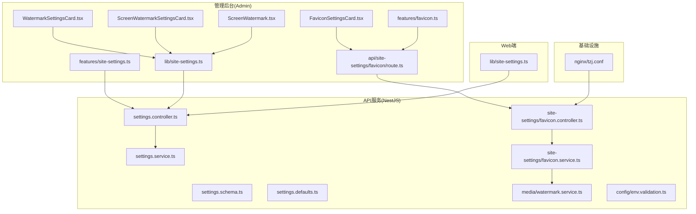
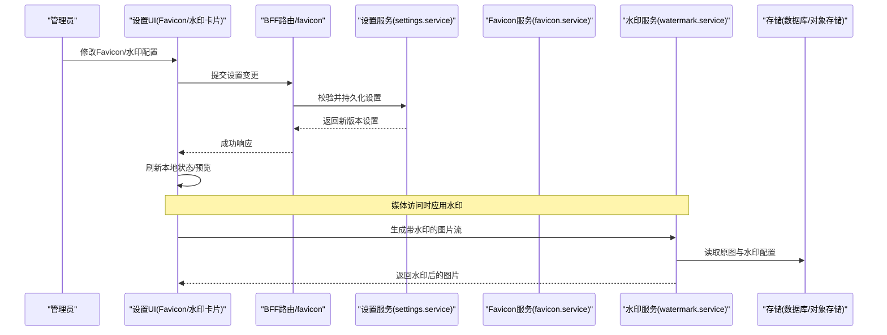
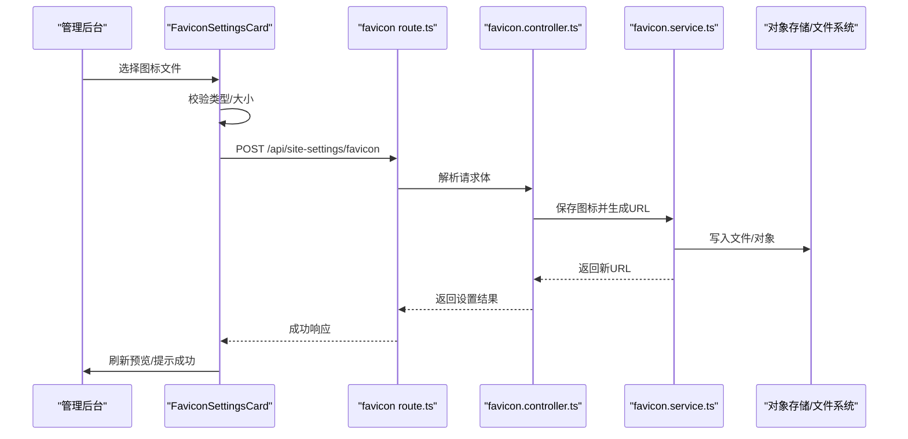
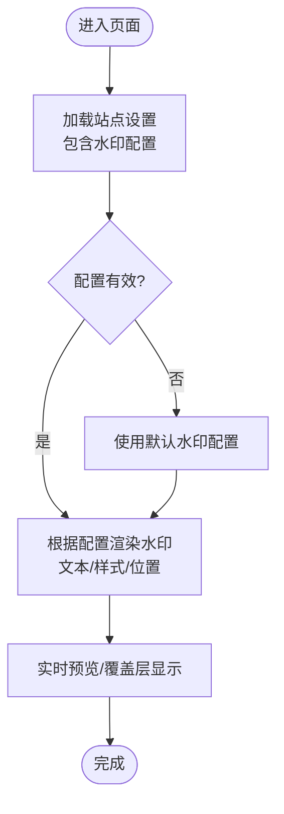
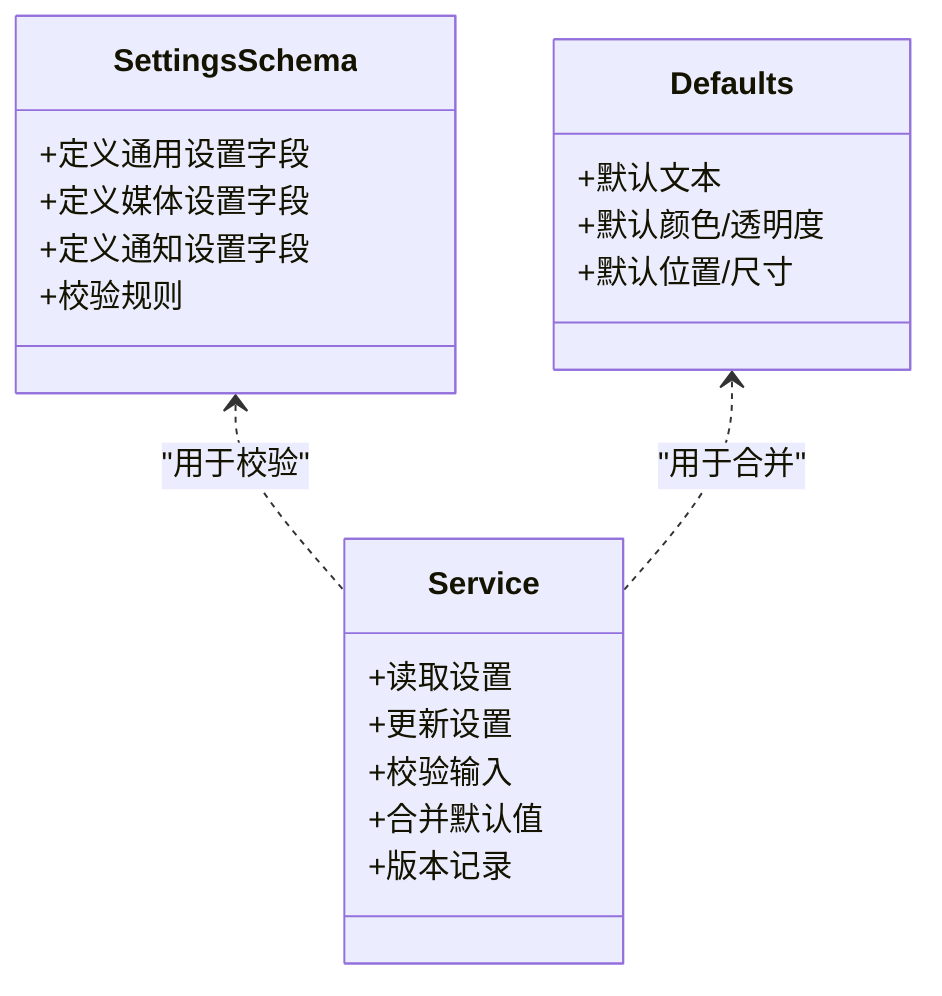
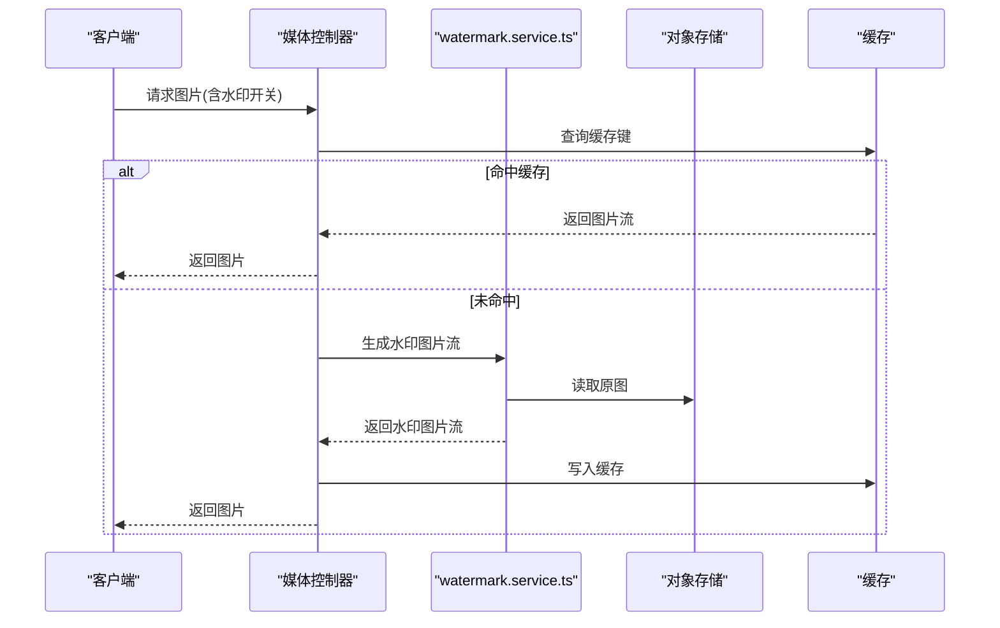
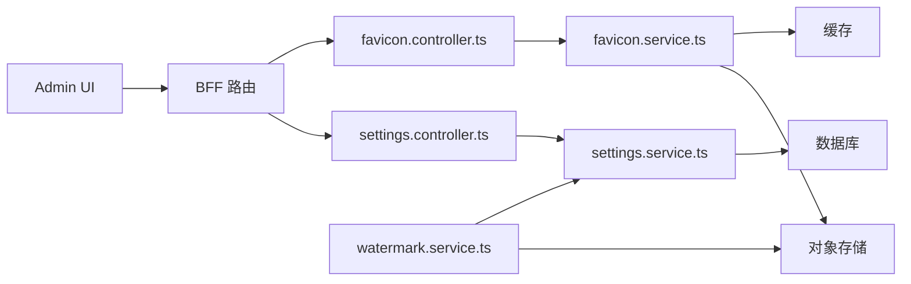

# 系统设置与配置

<cite>
**本文引用的文件**
- [apps/admin/src/components/settings/FaviconSettingsCard.tsx](file://apps/admin/src/components/settings/FaviconSettingsCard.tsx)
- [apps/admin/src/components/settings/ScreenWatermarkSettingsCard.tsx](file://apps/admin/src/components/settings/ScreenWatermarkSettingsCard.tsx)
- [apps/admin/src/components/settings/WatermarkSettingsCard.tsx](file://apps/admin/src/components/settings/WatermarkSettingsCard.tsx)
- [apps/admin/src/components/ScreenWatermark.tsx](file://apps/admin/src/components/ScreenWatermark.tsx)
- [apps/admin/src/features/favicon.ts](file://apps/admin/src/features/favicon.ts)
- [apps/admin/src/features/site-settings.ts](file://apps/admin/src/features/site-settings.ts)
- [apps/admin/src/lib/site-settings.ts](file://apps/admin/src/lib/site-settings.ts)
- [apps/admin/src/app/api/site-settings/favicon/route.ts](file://apps/admin/src/app/api/site-settings/favicon/route.ts)
- [apps/api/src/settings/settings.controller.ts](file://apps/api/src/settings/settings.controller.ts)
- [apps/api/src/settings/settings.service.ts](file://apps/api/src/settings/settings.service.ts)
- [apps/api/src/settings/settings.schema.ts](file://apps/api/src/settings/settings.schema.ts)
- [apps/api/src/settings/settings.defaults.ts](file://apps/api/src/settings/settings.defaults.ts)
- [apps/api/src/settings/settings-media.schema.ts](file://apps/api/src/settings/settings-media.schema.ts)
- [apps/api/src/settings/settings-notifications.schema.ts](file://apps/api/src/settings/settings-notifications.schema.ts)
- [apps/api/src/settings/settings-media.defaults.ts](file://apps/api/src/settings/settings-media.defaults.ts)
- [apps/api/src/site-settings/favicon.controller.ts](file://apps/api/src/site-settings/favicon.controller.ts)
- [apps/api/src/site-settings/favicon.service.ts](file://apps/api/src/site-settings/favicon.service.ts)
- [apps/web/src/lib/site-settings.ts](file://apps/web/src/lib/site-settings.ts)
- [apps/web/src/lib/site-defaults.ts](file://apps/web/src/lib/site-defaults.ts)
- [apps/api/src/media/watermark.service.ts](file://apps/api/src/media/watermark.service.ts)
- [apps/api/src/config/env.validation.ts](file://apps/api/src/config/env.validation.ts)
- [infra/docker/nginx/tzj.conf](file://infra/docker/nginx/tzj.conf)
</cite>

## 目录
1. [简介](#简介)
2. [项目结构](#项目结构)
3. [核心组件](#核心组件)
4. [架构总览](#架构总览)
5. [详细组件分析](#详细组件分析)
6. [依赖关系分析](#依赖关系分析)
7. [性能考虑](#性能考虑)
8. [故障排查指南](#故障排查指南)
9. [结论](#结论)
10. [附录](#附录)

## 简介
本模块聚焦管理后台的“系统设置与配置”，覆盖网站基础设置、品牌标识（Favicon）配置与屏幕水印功能。文档将说明：
- Favicon 上传、预览与动态更新流程
- 水印样式定制（文本、颜色、透明度、尺寸、布局等）与运行时生效机制
- 设置项的数据持久化、版本管理与回滚策略
- 多环境配置与环境变量管理
- 配置校验、默认值管理以及配置的导入导出能力

## 项目结构
该功能横跨前端（Next.js Admin）、后端（NestJS API）与部署层（Nginx），并涉及媒体存储与水印服务。关键路径如下：
- 前端设置卡片与特性封装：apps/admin/src/components/settings/*, apps/admin/src/features/*, apps/admin/src/lib/site-settings.ts
- 前端 API 路由（BFF）：apps/admin/src/app/api/site-settings/favicon/route.ts
- 后端设置控制器与服务：apps/api/src/settings/*
- 后端 Favicon 控制器与服务：apps/api/src/site-settings/*
- 媒体与水印服务：apps/api/src/media/watermark.service.ts
- Web 端读取站点设置：apps/web/src/lib/site-settings.ts
- 环境变量校验：apps/api/src/config/env.validation.ts
- Nginx 配置（静态资源与缓存）：infra/docker/nginx/tzj.conf

图表来源
- [apps/admin/src/components/settings/FaviconSettingsCard.tsx](file://apps/admin/src/components/settings/FaviconSettingsCard.tsx)
- [apps/admin/src/components/settings/WatermarkSettingsCard.tsx](file://apps/admin/src/components/settings/WatermarkSettingsCard.tsx)
- [apps/admin/src/components/settings/ScreenWatermarkSettingsCard.tsx](file://apps/admin/src/components/settings/ScreenWatermarkSettingsCard.tsx)
- [apps/admin/src/components/ScreenWatermark.tsx](file://apps/admin/src/components/ScreenWatermark.tsx)
- [apps/admin/src/features/favicon.ts](file://apps/admin/src/features/favicon.ts)
- [apps/admin/src/features/site-settings.ts](file://apps/admin/src/features/site-settings.ts)
- [apps/admin/src/lib/site-settings.ts](file://apps/admin/src/lib/site-settings.ts)
- [apps/admin/src/app/api/site-settings/favicon/route.ts](file://apps/admin/src/app/api/site-settings/favicon/route.ts)
- [apps/api/src/settings/settings.controller.ts](file://apps/api/src/settings/settings.controller.ts)
- [apps/api/src/settings/settings.service.ts](file://apps/api/src/settings/settings.service.ts)
- [apps/api/src/settings/settings.schema.ts](file://apps/api/src/settings/settings.schema.ts)
- [apps/api/src/settings/settings.defaults.ts](file://apps/api/src/settings/settings.defaults.ts)
- [apps/api/src/site-settings/favicon.controller.ts](file://apps/api/src/site-settings/favicon.controller.ts)
- [apps/api/src/site-settings/favicon.service.ts](file://apps/api/src/site-settings/favicon.service.ts)
- [apps/api/src/media/watermark.service.ts](file://apps/api/src/media/watermark.service.ts)
- [apps/api/src/config/env.validation.ts](file://apps/api/src/config/env.validation.ts)
- [apps/web/src/lib/site-settings.ts](file://apps/web/src/lib/site-settings.ts)
- [infra/docker/nginx/tzj.conf](file://infra/docker/nginx/tzj.conf)

章节来源
- [apps/admin/src/components/settings/FaviconSettingsCard.tsx](file://apps/admin/src/components/settings/FaviconSettingsCard.tsx)
- [apps/admin/src/components/settings/WatermarkSettingsCard.tsx](file://apps/admin/src/components/settings/WatermarkSettingsCard.tsx)
- [apps/admin/src/components/settings/ScreenWatermarkSettingsCard.tsx](file://apps/admin/src/components/settings/ScreenWatermarkSettingsCard.tsx)
- [apps/admin/src/components/ScreenWatermark.tsx](file://apps/admin/src/components/ScreenWatermark.tsx)
- [apps/admin/src/features/favicon.ts](file://apps/admin/src/features/favicon.ts)
- [apps/admin/src/features/site-settings.ts](file://apps/admin/src/features/site-settings.ts)
- [apps/admin/src/lib/site-settings.ts](file://apps/admin/src/lib/site-settings.ts)
- [apps/admin/src/app/api/site-settings/favicon/route.ts](file://apps/admin/src/app/api/site-settings/favicon/route.ts)
- [apps/api/src/settings/settings.controller.ts](file://apps/api/src/settings/settings.controller.ts)
- [apps/api/src/settings/settings.service.ts](file://apps/api/src/settings/settings.service.ts)
- [apps/api/src/settings/settings.schema.ts](file://apps/api/src/settings/settings.schema.ts)
- [apps/api/src/settings/settings.defaults.ts](file://apps/api/src/settings/settings.defaults.ts)
- [apps/api/src/site-settings/favicon.controller.ts](file://apps/api/src/site-settings/favicon.controller.ts)
- [apps/api/src/site-settings/favicon.service.ts](file://apps/api/src/site-settings/favicon.service.ts)
- [apps/api/src/media/watermark.service.ts](file://apps/api/src/media/watermark.service.ts)
- [apps/api/src/config/env.validation.ts](file://apps/api/src/config/env.validation.ts)
- [apps/web/src/lib/site-settings.ts](file://apps/web/src/lib/site-settings.ts)
- [infra/docker/nginx/tzj.conf](file://infra/docker/nginx/tzj.conf)

## 核心组件
- Favicon 设置卡片：提供图标上传、预览、保存与刷新，调用 BFF 路由触发后端处理。
- 水印设置卡片：支持文本、颜色、透明度、尺寸、旋转角度、位置等样式配置，实时预览并保存。
- 屏幕水印组件：在页面层渲染水印，读取运行时配置，实现动态显示。
- 站点设置特性与库：统一封装设置项的获取、更新、校验与默认值合并。
- 后端设置服务：负责设置项的读写、校验、版本记录与回滚。
- Favicon 服务：处理图标上传、格式校验、存储与缓存控制。
- 媒体水印服务：为图片流添加水印，供媒体访问链路使用。

章节来源
- [apps/admin/src/components/settings/FaviconSettingsCard.tsx](file://apps/admin/src/components/settings/FaviconSettingsCard.tsx)
- [apps/admin/src/components/settings/WatermarkSettingsCard.tsx](file://apps/admin/src/components/settings/WatermarkSettingsCard.tsx)
- [apps/admin/src/components/settings/ScreenWatermarkSettingsCard.tsx](file://apps/admin/src/components/settings/ScreenWatermarkSettingsCard.tsx)
- [apps/admin/src/components/ScreenWatermark.tsx](file://apps/admin/src/components/ScreenWatermark.tsx)
- [apps/admin/src/features/site-settings.ts](file://apps/admin/src/features/site-settings.ts)
- [apps/admin/src/lib/site-settings.ts](file://apps/admin/src/lib/site-settings.ts)
- [apps/api/src/settings/settings.service.ts](file://apps/api/src/settings/settings.service.ts)
- [apps/api/src/site-settings/favicon.service.ts](file://apps/api/src/site-settings/favicon.service.ts)
- [apps/api/src/media/watermark.service.ts](file://apps/api/src/media/watermark.service.ts)

## 架构总览
整体数据流分为“设置编辑”和“运行时读取”两条主线：
- 设置编辑：管理后台 UI -> BFF 路由 -> 后端设置控制器/服务 -> 存储（数据库/对象存储）-> 返回结果
- 运行时读取：Web 端或浏览器直接请求 -> 后端设置服务 -> 返回当前有效配置；媒体请求经水印服务处理

图表来源
- [apps/admin/src/app/api/site-settings/favicon/route.ts](file://apps/admin/src/app/api/site-settings/favicon/route.ts)
- [apps/api/src/settings/settings.controller.ts](file://apps/api/src/settings/settings.controller.ts)
- [apps/api/src/settings/settings.service.ts](file://apps/api/src/settings/settings.service.ts)
- [apps/api/src/site-settings/favicon.controller.ts](file://apps/api/src/site-settings/favicon.controller.ts)
- [apps/api/src/site-settings/favicon.service.ts](file://apps/api/src/site-settings/favicon.service.ts)
- [apps/api/src/media/watermark.service.ts](file://apps/api/src/media/watermark.service.ts)

## 详细组件分析

### Favicon 设置组件与流程
- 功能要点
  - 支持上传 .ico/.png 等常见格式，进行大小与类型校验
  - 预览当前图标，保存后触发缓存失效与 CDN 刷新
  - 通过 BFF 路由转发至后端 Favicon 服务
- 交互流程
  - 选择文件 -> 前端校验 -> 调用 BFF -> 后端校验与存储 -> 返回新 URL -> 更新页面元信息

图表来源
- [apps/admin/src/components/settings/FaviconSettingsCard.tsx](file://apps/admin/src/components/settings/FaviconSettingsCard.tsx)
- [apps/admin/src/app/api/site-settings/favicon/route.ts](file://apps/admin/src/app/api/site-settings/favicon/route.ts)
- [apps/api/src/site-settings/favicon.controller.ts](file://apps/api/src/site-settings/favicon.controller.ts)
- [apps/api/src/site-settings/favicon.service.ts](file://apps/api/src/site-settings/favicon.service.ts)

章节来源
- [apps/admin/src/components/settings/FaviconSettingsCard.tsx](file://apps/admin/src/components/settings/FaviconSettingsCard.tsx)
- [apps/admin/src/app/api/site-settings/favicon/route.ts](file://apps/admin/src/app/api/site-settings/favicon/route.ts)
- [apps/api/src/site-settings/favicon.controller.ts](file://apps/api/src/site-settings/favicon.controller.ts)
- [apps/api/src/site-settings/favicon.service.ts](file://apps/api/src/site-settings/favicon.service.ts)

### 水印设置与屏幕水印渲染
- 功能要点
  - 支持文本内容、字体、字号、颜色、透明度、旋转角度、间距、位置等
  - 实时预览，保存后立即生效（前端缓存更新）
  - 媒体水印：对图片流叠加水印，适用于缩略图与预览图
- 渲染流程
  - 读取站点设置 -> 计算水印坐标与样式 -> 绘制到画布或注入 CSS -> 展示

图表来源
- [apps/admin/src/components/settings/WatermarkSettingsCard.tsx](file://apps/admin/src/components/settings/WatermarkSettingsCard.tsx)
- [apps/admin/src/components/settings/ScreenWatermarkSettingsCard.tsx](file://apps/admin/src/components/settings/ScreenWatermarkSettingsCard.tsx)
- [apps/admin/src/components/ScreenWatermark.tsx](file://apps/admin/src/components/ScreenWatermark.tsx)
- [apps/admin/src/lib/site-settings.ts](file://apps/admin/src/lib/site-settings.ts)

章节来源
- [apps/admin/src/components/settings/WatermarkSettingsCard.tsx](file://apps/admin/src/components/settings/WatermarkSettingsCard.tsx)
- [apps/admin/src/components/settings/ScreenWatermarkSettingsCard.tsx](file://apps/admin/src/components/settings/ScreenWatermarkSettingsCard.tsx)
- [apps/admin/src/components/ScreenWatermark.tsx](file://apps/admin/src/components/ScreenWatermark.tsx)
- [apps/admin/src/lib/site-settings.ts](file://apps/admin/src/lib/site-settings.ts)

### 站点设置数据模型与校验
- 数据模型
  - 使用 Schema 定义各子模块字段与约束（如媒体、通知、通用设置）
  - 默认值集中管理，确保未配置时的稳定行为
- 校验与合并
  - 入参校验失败则拒绝更新
  - 合并默认值与用户配置，形成最终运行配置

图表来源
- [apps/api/src/settings/settings.schema.ts](file://apps/api/src/settings/settings.schema.ts)
- [apps/api/src/settings/settings-media.schema.ts](file://apps/api/src/settings/settings-media.schema.ts)
- [apps/api/src/settings/settings-notifications.schema.ts](file://apps/api/src/settings/settings-notifications.schema.ts)
- [apps/api/src/settings/settings.defaults.ts](file://apps/api/src/settings/settings.defaults.ts)
- [apps/api/src/settings/settings-media.defaults.ts](file://apps/api/src/settings/settings-media.defaults.ts)
- [apps/api/src/settings/settings.service.ts](file://apps/api/src/settings/settings.service.ts)

章节来源
- [apps/api/src/settings/settings.schema.ts](file://apps/api/src/settings/settings.schema.ts)
- [apps/api/src/settings/settings-media.schema.ts](file://apps/api/src/settings/settings-media.schema.ts)
- [apps/api/src/settings/settings-notifications.schema.ts](file://apps/api/src/settings/settings-notifications.schema.ts)
- [apps/api/src/settings/settings.defaults.ts](file://apps/api/src/settings/settings.defaults.ts)
- [apps/api/src/settings/settings-media.defaults.ts](file://apps/api/src/settings/settings-media.defaults.ts)
- [apps/api/src/settings/settings.service.ts](file://apps/api/src/settings/settings.service.ts)

### 媒体水印服务
- 功能要点
  - 从设置中读取水印参数
  - 对图片流进行合成，输出带水印的图片
  - 支持缓存键基于配置哈希，避免重复计算

图表来源
- [apps/api/src/media/watermark.service.ts](file://apps/api/src/media/watermark.service.ts)

章节来源
- [apps/api/src/media/watermark.service.ts](file://apps/api/src/media/watermark.service.ts)

### 环境变量与安全设置
- 环境变量校验
  - 启动时校验必要的环境变量（如存储凭证、域名、密钥）
  - 缺失或非法值将阻止服务启动，保障安全基线
- 安全建议
  - 敏感信息仅通过环境变量注入
  - 限制可接受的域名与白名单
  - 启用 HTTPS 与最小权限原则

章节来源
- [apps/api/src/config/env.validation.ts](file://apps/api/src/config/env.validation.ts)

## 依赖关系分析
- 前端依赖
  - 设置卡片依赖 site-settings 库与 features 封装，统一读取与更新设置
  - BFF 路由依赖后端设置与 Favicon 控制器
- 后端依赖
  - 设置服务依赖 Schema 与 Defaults，保证一致性与健壮性
  - Favicon 服务依赖对象存储与缓存策略
  - 水印服务依赖媒体存储与设置服务
- 部署依赖
  - Nginx 配置影响静态资源缓存与跨域策略

图表来源
- [apps/admin/src/app/api/site-settings/favicon/route.ts](file://apps/admin/src/app/api/site-settings/favicon/route.ts)
- [apps/api/src/settings/settings.controller.ts](file://apps/api/src/settings/settings.controller.ts)
- [apps/api/src/settings/settings.service.ts](file://apps/api/src/settings/settings.service.ts)
- [apps/api/src/site-settings/favicon.controller.ts](file://apps/api/src/site-settings/favicon.controller.ts)
- [apps/api/src/site-settings/favicon.service.ts](file://apps/api/src/site-settings/favicon.service.ts)
- [apps/api/src/media/watermark.service.ts](file://apps/api/src/media/watermark.service.ts)

章节来源
- [apps/admin/src/app/api/site-settings/favicon/route.ts](file://apps/admin/src/app/api/site-settings/favicon/route.ts)
- [apps/api/src/settings/settings.controller.ts](file://apps/api/src/settings/settings.controller.ts)
- [apps/api/src/settings/settings.service.ts](file://apps/api/src/settings/settings.service.ts)
- [apps/api/src/site-settings/favicon.controller.ts](file://apps/api/src/site-settings/favicon.controller.ts)
- [apps/api/src/site-settings/favicon.service.ts](file://apps/api/src/site-settings/favicon.service.ts)
- [apps/api/src/media/watermark.service.ts](file://apps/api/src/media/watermark.service.ts)

## 性能考虑
- 缓存策略
  - 设置读取采用短 TTL 缓存，减少频繁 IO
  - 媒体水印输出按配置哈希缓存，避免重复合成
- 传输优化
  - Favicon 与静态资源通过 Nginx 开启压缩与缓存头
  - 大图标上传分块与进度反馈
- 渲染优化
  - 水印渲染按需计算，避免主线程阻塞
  - 使用离屏 Canvas 或 Worker 提升体验

[本节为通用指导，不直接分析具体文件]

## 故障排查指南
- 常见问题
  - 环境变量缺失导致启动失败：检查 env.validation.ts 中的必填项
  - Favicon 无法刷新：确认缓存失效与 CDN 刷新逻辑
  - 水印不生效：检查设置是否保存成功与前端缓存是否更新
  - 媒体水印异常：核对图片格式与水印参数合法性
- 定位步骤
  - 查看设置接口日志与返回值
  - 检查对象存储中是否存在正确文件
  - 验证 Nginx 缓存头与跨域配置
  - 对比默认值与实际配置差异

章节来源
- [apps/api/src/config/env.validation.ts](file://apps/api/src/config/env.validation.ts)
- [apps/api/src/site-settings/favicon.service.ts](file://apps/api/src/site-settings/favicon.service.ts)
- [apps/api/src/media/watermark.service.ts](file://apps/api/src/media/watermark.service.ts)
- [infra/docker/nginx/tzj.conf](file://infra/docker/nginx/tzj.conf)

## 结论
本模块以清晰的职责划分与严格的校验机制，实现了网站基础设置、品牌标识与屏幕水印的统一管理。通过前后端协作、缓存与媒体水印服务，保证了配置的动态更新与高效渲染。建议在后续迭代中完善配置导入导出与审计追踪，进一步提升可维护性与安全性。

[本节为总结，不直接分析具体文件]

## 附录
- 配置项清单（示例）
  - 网站基础设置：站点名称、描述、语言、时区、主题色
  - 品牌标识：Favicon 文件、Logo、社交媒体链接
  - 屏幕水印：文本、字体、颜色、透明度、尺寸、位置、旋转角度
- 版本管理与回滚
  - 每次更新设置生成版本号，保留历史快照
  - 支持按版本回滚与差异对比
- 多环境与变量
  - 开发/测试/生产环境通过环境变量隔离
  - 敏感配置仅注入环境变量，禁止硬编码

[本节为概念性补充，不直接分析具体文件]