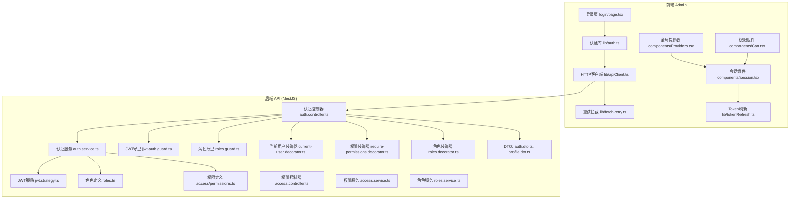
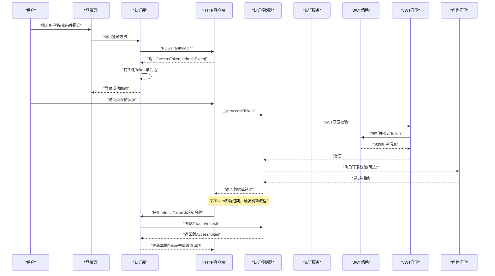
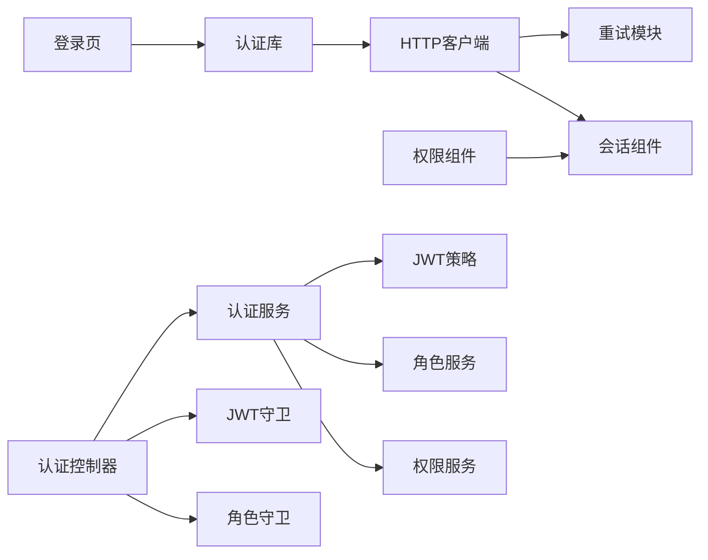

# 认证与权限系统

<cite>
**本文引用的文件**   
- [auth.controller.ts](file://apps/api/src/auth/auth.controller.ts)
- [auth.service.ts](file://apps/api/src/auth/auth.service.ts)
- [jwt.strategy.ts](file://apps/api/src/auth/strategies/jwt.strategy.ts)
- [jwt-auth.guard.ts](file://apps/api/src/auth/guards/jwt-auth.guard.ts)
- [roles.guard.ts](file://apps/api/src/auth/guards/roles.guard.ts)
- [current-user.decorator.ts](file://apps/api/src/auth/decorators/current-user.decorator.ts)
- [require-permissions.decorator.ts](file://apps/api/src/auth/decorators/require-permissions.decorator.ts)
- [roles.decorator.ts](file://apps/api/src/auth/decorators/roles.decorator.ts)
- [auth.dto.ts](file://apps/api/src/auth/dto/auth.dto.ts)
- [profile.dto.ts](file://apps/api/src/auth/dto/profile.dto.ts)
- [roles.ts](file://apps/api/src/auth/roles.ts)
- [permissions.ts](file://apps/api/src/access/permissions.ts)
- [access.controller.ts](file://apps/api/src/access/access.controller.ts)
- [access.service.ts](file://apps/api/src/access/access.service.ts)
- [roles.service.ts](file://apps/api/src/access/roles.service.ts)
- [tokenRefresh.ts](file://apps/admin/src/lib/tokenRefresh.ts)
- [auth.ts](file://apps/admin/src/lib/auth.ts)
- [Can.tsx](file://apps/admin/src/components/Can.tsx)
- [session.tsx](file://apps/admin/src/components/session.tsx)
- [Providers.tsx](file://apps/admin/src/components/Providers.tsx)
- [login/page.tsx](file://apps/admin/src/app/login/page.tsx)
- [apiClient.ts](file://apps/admin/src/lib/apiClient.ts)
- [fetch-retry.ts](file://apps/admin/src/lib/fetch-retry.ts)
- [config.ts](file://apps/admin/src/lib/config.ts)
</cite>

## 目录
1. [简介](#简介)
2. [项目结构](#项目结构)
3. [核心组件](#核心组件)
4. [架构总览](#架构总览)
5. [详细组件分析](#详细组件分析)
6. [依赖关系分析](#依赖关系分析)
7. [性能考虑](#性能考虑)
8. [故障排查指南](#故障排查指南)
9. [结论](#结论)
10. [附录](#附录)

## 简介
本文件面向管理后台的认证与权限系统，围绕基于JWT的认证流程、用户会话管理与Token刷新机制，以及角色权限控制（RBAC）模型、权限装饰器与路由守卫进行系统化说明。文档同时覆盖登录页面实现、密码验证与安全最佳实践，并给出权限检查组件 Can.tsx 的使用方法与自定义权限规则配置建议，最后提供认证相关的错误处理与调试指南。

## 项目结构
本项目采用前后端分离架构：
- 后端（NestJS）：负责JWT签发与校验、角色与权限管理、API访问控制。
- 前端（Next.js）：负责登录界面、会话状态、Token刷新、权限判断与UI级权限控制。

图表来源
- [login/page.tsx](file://apps/admin/src/app/login/page.tsx)
- [auth.ts](file://apps/admin/src/lib/auth.ts)
- [apiClient.ts](file://apps/admin/src/lib/apiClient.ts)
- [fetch-retry.ts](file://apps/admin/src/lib/fetch-retry.ts)
- [session.tsx](file://apps/admin/src/components/session.tsx)
- [tokenRefresh.ts](file://apps/admin/src/lib/tokenRefresh.ts)
- [auth.controller.ts](file://apps/api/src/auth/auth.controller.ts)
- [auth.service.ts](file://apps/api/src/auth/auth.service.ts)
- [jwt.strategy.ts](file://apps/api/src/auth/strategies/jwt.strategy.ts)
- [jwt-auth.guard.ts](file://apps/api/src/auth/guards/jwt-auth.guard.ts)
- [roles.guard.ts](file://apps/api/src/auth/guards/roles.guard.ts)
- [current-user.decorator.ts](file://apps/api/src/auth/decorators/current-user.decorator.ts)
- [require-permissions.decorator.ts](file://apps/api/src/auth/decorators/require-permissions.decorator.ts)
- [roles.decorator.ts](file://apps/api/src/auth/decorators/roles.decorator.ts)
- [auth.dto.ts](file://apps/api/src/auth/dto/auth.dto.ts)
- [profile.dto.ts](file://apps/api/src/auth/dto/profile.dto.ts)
- [roles.ts](file://apps/api/src/auth/roles.ts)
- [permissions.ts](file://apps/api/src/access/permissions.ts)
- [access.controller.ts](file://apps/api/src/access/access.controller.ts)
- [access.service.ts](file://apps/api/src/access/access.service.ts)
- [roles.service.ts](file://apps/api/src/access/roles.service.ts)

章节来源
- [auth.controller.ts](file://apps/api/src/auth/auth.controller.ts)
- [auth.service.ts](file://apps/api/src/auth/auth.service.ts)
- [jwt.strategy.ts](file://apps/api/src/auth/strategies/jwt.strategy.ts)
- [jwt-auth.guard.ts](file://apps/api/src/auth/guards/jwt-auth.guard.ts)
- [roles.guard.ts](file://apps/api/src/auth/guards/roles.guard.ts)
- [current-user.decorator.ts](file://apps/api/src/auth/decorators/current-user.decorator.ts)
- [require-permissions.decorator.ts](file://apps/api/src/auth/decorators/require-permissions.decorator.ts)
- [roles.decorator.ts](file://apps/api/src/auth/decorators/roles.decorator.ts)
- [auth.dto.ts](file://apps/api/src/auth/dto/auth.dto.ts)
- [profile.dto.ts](file://apps/api/src/auth/dto/profile.dto.ts)
- [roles.ts](file://apps/api/src/auth/roles.ts)
- [permissions.ts](file://apps/api/src/access/permissions.ts)
- [access.controller.ts](file://apps/api/src/access/access.controller.ts)
- [access.service.ts](file://apps/api/src/access/access.service.ts)
- [roles.service.ts](file://apps/api/src/access/roles.service.ts)
- [tokenRefresh.ts](file://apps/admin/src/lib/tokenRefresh.ts)
- [auth.ts](file://apps/admin/src/lib/auth.ts)
- [Can.tsx](file://apps/admin/src/components/Can.tsx)
- [session.tsx](file://apps/admin/src/components/session.tsx)
- [Providers.tsx](file://apps/admin/src/components/Providers.tsx)
- [login/page.tsx](file://apps/admin/src/app/login/page.tsx)
- [apiClient.ts](file://apps/admin/src/lib/apiClient.ts)
- [fetch-retry.ts](file://apps/admin/src/lib/fetch-retry.ts)
- [config.ts](file://apps/admin/src/lib/config.ts)

## 核心组件
- 认证控制器与服务：统一处理登录、注销、Token刷新等接口，封装业务逻辑与数据校验。
- JWT策略与守卫：解析与校验JWT，注入当前用户上下文，并在路由层执行鉴权。
- 角色与权限：通过装饰器声明所需角色或权限，结合守卫完成细粒度授权。
- 前端认证库与会话：封装登录请求、Token存储、自动刷新与错误处理。
- 权限组件：在UI层根据当前用户角色/权限渲染或隐藏功能入口。

章节来源
- [auth.controller.ts](file://apps/api/src/auth/auth.controller.ts)
- [auth.service.ts](file://apps/api/src/auth/auth.service.ts)
- [jwt.strategy.ts](file://apps/api/src/auth/strategies/jwt.strategy.ts)
- [jwt-auth.guard.ts](file://apps/api/src/auth/guards/jwt-auth.guard.ts)
- [roles.guard.ts](file://apps/api/src/auth/guards/roles.guard.ts)
- [current-user.decorator.ts](file://apps/api/src/auth/decorators/current-user.decorator.ts)
- [require-permissions.decorator.ts](file://apps/api/src/auth/decorators/require-permissions.decorator.ts)
- [roles.decorator.ts](file://apps/api/src/auth/decorators/roles.decorator.ts)
- [auth.ts](file://apps/admin/src/lib/auth.ts)
- [session.tsx](file://apps/admin/src/components/session.tsx)
- [Can.tsx](file://apps/admin/src/components/Can.tsx)

## 架构总览
下图展示从前端登录到后端鉴权的完整调用链，包括Token刷新与权限校验的关键节点。

图表来源
- [login/page.tsx](file://apps/admin/src/app/login/page.tsx)
- [auth.ts](file://apps/admin/src/lib/auth.ts)
- [apiClient.ts](file://apps/admin/src/lib/apiClient.ts)
- [auth.controller.ts](file://apps/api/src/auth/auth.controller.ts)
- [auth.service.ts](file://apps/api/src/auth/auth.service.ts)
- [jwt.strategy.ts](file://apps/api/src/auth/strategies/jwt.strategy.ts)
- [jwt-auth.guard.ts](file://apps/api/src/auth/guards/jwt-auth.guard.ts)
- [roles.guard.ts](file://apps/api/src/auth/guards/roles.guard.ts)

## 详细组件分析

### 认证控制器与服务（登录、注销、刷新）
- 职责
  - 登录：校验凭据，生成并返回访问令牌与刷新令牌。
  - 注销：使前端失效或服务端记录登出（视实现而定）。
  - 刷新：使用刷新令牌换取新的访问令牌。
- 关键交互
  - 控制器接收请求，委托服务完成业务逻辑。
  - 服务负责与用户数据源交互、签发/验证令牌、权限相关计算。
- 安全要点
  - 严格校验输入（DTO），防止注入与越权。
  - 合理设置令牌有效期与刷新策略。
  - 对敏感操作进行最小权限原则控制。

章节来源
- [auth.controller.ts](file://apps/api/src/auth/auth.controller.ts)
- [auth.service.ts](file://apps/api/src/auth/auth.service.ts)
- [auth.dto.ts](file://apps/api/src/auth/dto/auth.dto.ts)
- [profile.dto.ts](file://apps/api/src/auth/dto/profile.dto.ts)

### JWT策略与守卫（解析、校验、注入用户）
- 策略
  - 解析请求中的Authorization头，提取并验证JWT签名与时效。
  - 将用户信息注入到请求上下文，供后续装饰器与控制器使用。
- 守卫
  - JWT守卫：确保请求已认证。
  - 角色守卫：结合装饰器声明的角色要求，进行二次授权。
- 扩展点
  - 可接入黑名单、设备指纹、IP白名单等增强校验。

章节来源
- [jwt.strategy.ts](file://apps/api/src/auth/strategies/jwt.strategy.ts)
- [jwt-auth.guard.ts](file://apps/api/src/auth/guards/jwt-auth.guard.ts)
- [roles.guard.ts](file://apps/api/src/auth/guards/roles.guard.ts)
- [current-user.decorator.ts](file://apps/api/src/auth/decorators/current-user.decorator.ts)

### 角色与权限（RBAC模型、装饰器与路由守卫）
- RBAC模型
  - 角色：如管理员、编辑、访客等，具备一组权限集合。
  - 权限：针对资源与动作的细粒度控制，例如“文档:编辑”、“用户:删除”。
- 装饰器
  - 角色装饰器：声明接口所需的角色。
  - 权限装饰器：声明接口所需的权限列表。
- 路由守卫
  - 角色守卫：在控制器方法执行前校验角色/权限。
- 权限管理
  - 权限定义集中管理，便于审计与变更。
  - 提供权限查询接口，供前端动态控制菜单与按钮。

章节来源
- [roles.ts](file://apps/api/src/auth/roles.ts)
- [permissions.ts](file://apps/api/src/access/permissions.ts)
- [roles.decorator.ts](file://apps/api/src/auth/decorators/roles.decorator.ts)
- [require-permissions.decorator.ts](file://apps/api/src/auth/decorators/require-permissions.decorator.ts)
- [roles.guard.ts](file://apps/api/src/auth/guards/roles.guard.ts)
- [access.controller.ts](file://apps/api/src/access/access.controller.ts)
- [access.service.ts](file://apps/api/src/access/access.service.ts)
- [roles.service.ts](file://apps/api/src/access/roles.service.ts)

### 前端认证库与会话管理（登录、存储、刷新）
- 登录流程
  - 调用认证库发起登录请求，成功后保存Token与用户信息。
  - 重定向至管理后台首页或目标页面。
- 会话管理
  - 在应用启动时恢复会话，必要时静默刷新Token。
  - 提供统一的鉴权状态获取方法，供组件与路由守卫使用。
- Token刷新
  - 当访问令牌即将过期或收到401时，使用刷新令牌换取新令牌。
  - 失败则清除会话并跳转登录页。

章节来源
- [auth.ts](file://apps/admin/src/lib/auth.ts)
- [session.tsx](file://apps/admin/src/components/session.tsx)
- [tokenRefresh.ts](file://apps/admin/src/lib/tokenRefresh.ts)
- [Providers.tsx](file://apps/admin/src/components/Providers.tsx)

### 权限检查组件 Can.tsx（UI级权限控制）
- 作用
  - 根据当前用户的角色/权限决定是否渲染子节点。
  - 支持条件组合与自定义规则扩展。
- 使用方式
  - 包裹需要权限控制的UI元素，传入权限标识或角色名。
  - 无权限时不渲染或显示占位提示。
- 自定义规则
  - 可通过扩展权限判定函数，实现更复杂的业务规则（如数据范围、时间窗口等）。

章节来源
- [Can.tsx](file://apps/admin/src/components/Can.tsx)
- [session.tsx](file://apps/admin/src/components/session.tsx)

### 登录页面实现与密码验证
- 登录页
  - 表单收集用户名与密码，提交后调用认证库。
  - 处理成功与失败分支，包含错误提示与跳转逻辑。
- 密码验证
  - 前端基础校验（非空、长度、格式）。
  - 后端严格校验（DTO校验、防暴力破解、账户锁定策略）。
- 安全最佳实践
  - 使用HTTPS传输。
  - 避免在日志中输出敏感信息。
  - 限制登录尝试频率，启用验证码或二次验证（可选）。

章节来源
- [login/page.tsx](file://apps/admin/src/app/login/page.tsx)
- [auth.dto.ts](file://apps/api/src/auth/dto/auth.dto.ts)

### HTTP客户端与重试机制
- 客户端
  - 统一封装请求，附加Authorization头与通用参数。
  - 处理响应错误码，区分网络错误与业务错误。
- 重试机制
  - 对特定错误（如网络抖动）进行指数退避重试。
  - 与Token刷新联动，在401时先刷新再重试。

章节来源
- [apiClient.ts](file://apps/admin/src/lib/apiClient.ts)
- [fetch-retry.ts](file://apps/admin/src/lib/fetch-retry.ts)

## 依赖关系分析
- 前端依赖
  - 登录页依赖认证库；认证库依赖HTTP客户端；客户端依赖重试模块与会话组件。
  - 权限组件依赖会话上下文以获取当前用户角色/权限。
- 后端依赖
  - 认证控制器依赖认证服务；服务依赖JWT策略与角色/权限服务。
  - 守卫依赖策略与装饰器提供的上下文信息。

图表来源
- [login/page.tsx](file://apps/admin/src/app/login/page.tsx)
- [auth.ts](file://apps/admin/src/lib/auth.ts)
- [apiClient.ts](file://apps/admin/src/lib/apiClient.ts)
- [fetch-retry.ts](file://apps/admin/src/lib/fetch-retry.ts)
- [session.tsx](file://apps/admin/src/components/session.tsx)
- [Can.tsx](file://apps/admin/src/components/Can.tsx)
- [auth.controller.ts](file://apps/api/src/auth/auth.controller.ts)
- [auth.service.ts](file://apps/api/src/auth/auth.service.ts)
- [jwt.strategy.ts](file://apps/api/src/auth/strategies/jwt.strategy.ts)
- [jwt-auth.guard.ts](file://apps/api/src/auth/guards/jwt-auth.guard.ts)
- [roles.guard.ts](file://apps/api/src/auth/guards/roles.guard.ts)
- [roles.service.ts](file://apps/api/src/access/roles.service.ts)
- [access.service.ts](file://apps/api/src/access/access.service.ts)

章节来源
- [auth.controller.ts](file://apps/api/src/auth/auth.controller.ts)
- [auth.service.ts](file://apps/api/src/auth/auth.service.ts)
- [jwt.strategy.ts](file://apps/api/src/auth/strategies/jwt.strategy.ts)
- [jwt-auth.guard.ts](file://apps/api/src/auth/guards/jwt-auth.guard.ts)
- [roles.guard.ts](file://apps/api/src/auth/guards/roles.guard.ts)
- [roles.service.ts](file://apps/api/src/access/roles.service.ts)
- [access.service.ts](file://apps/api/src/access/access.service.ts)
- [auth.ts](file://apps/admin/src/lib/auth.ts)
- [apiClient.ts](file://apps/admin/src/lib/apiClient.ts)
- [fetch-retry.ts](file://apps/admin/src/lib/fetch-retry.ts)
- [session.tsx](file://apps/admin/src/components/session.tsx)
- [Can.tsx](file://apps/admin/src/components/Can.tsx)

## 性能考虑
- Token刷新策略
  - 预刷新：在访问令牌剩余有效期低于阈值时主动刷新，减少401重试开销。
  - 并发控制：同一时刻仅允许一个刷新请求，其他请求排队复用结果。
- 缓存与会话
  - 将用户角色/权限缓存于内存或短期存储，降低频繁查询。
- 网络优化
  - 合理设置超时与重试次数，避免雪崩效应。
  - 对静态资源与常用数据进行CDN与缓存优化。

[本节为通用指导，无需代码来源]

## 故障排查指南
- 常见问题
  - 401未授权：检查Authorization头是否正确携带，Token是否过期或无效。
  - 403禁止访问：确认用户角色/权限是否满足接口要求。
  - 刷新失败：检查刷新令牌是否有效、是否被撤销或跨域问题。
- 调试步骤
  - 查看浏览器Network面板，确认请求头与响应体。
  - 在后端开启调试日志，定位守卫与装饰器的校验结果。
  - 使用测试账号与最小权限集逐步验证。
- 错误处理
  - 前端统一捕获错误并提示用户，避免泄露敏感信息。
  - 后端对异常进行分类与标准化返回，便于前端处理。

章节来源
- [apiClient.ts](file://apps/admin/src/lib/apiClient.ts)
- [fetch-retry.ts](file://apps/admin/src/lib/fetch-retry.ts)
- [jwt-auth.guard.ts](file://apps/api/src/auth/guards/jwt-auth.guard.ts)
- [roles.guard.ts](file://apps/api/src/auth/guards/roles.guard.ts)

## 结论
本系统通过JWT实现无状态认证，结合角色与权限的RBAC模型，在前端与后端共同完成细粒度授权。前端通过会话管理与Token刷新保障用户体验，后端通过策略与守卫确保接口安全。遵循安全最佳实践与完善的错误处理，可有效提升系统的健壮性与可维护性。

[本节为总结性内容，无需代码来源]

## 附录
- 术语表
  - JWT：JSON Web Token，用于身份认证的令牌。
  - RBAC：基于角色的访问控制。
  - 装饰器：在方法或类上声明元数据的语法特性。
  - 守卫：在请求处理前执行的中间件式组件。
- 参考路径
  - 登录页：[login/page.tsx](file://apps/admin/src/app/login/page.tsx)
  - 认证库：[auth.ts](file://apps/admin/src/lib/auth.ts)
  - 权限组件：[Can.tsx](file://apps/admin/src/components/Can.tsx)
  - 认证控制器：[auth.controller.ts](file://apps/api/src/auth/auth.controller.ts)
  - 权限定义：[permissions.ts](file://apps/api/src/access/permissions.ts)

[本节为补充信息，无需代码来源]