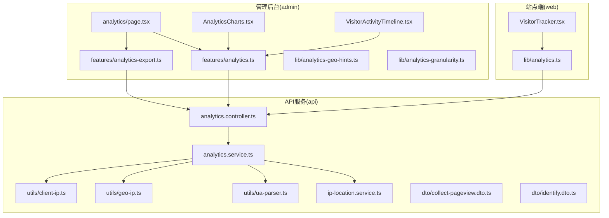
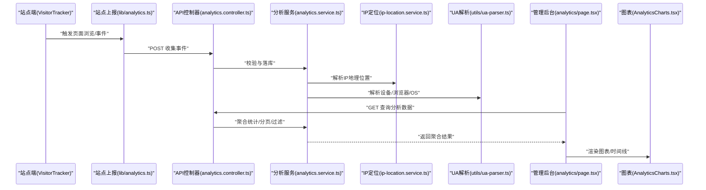
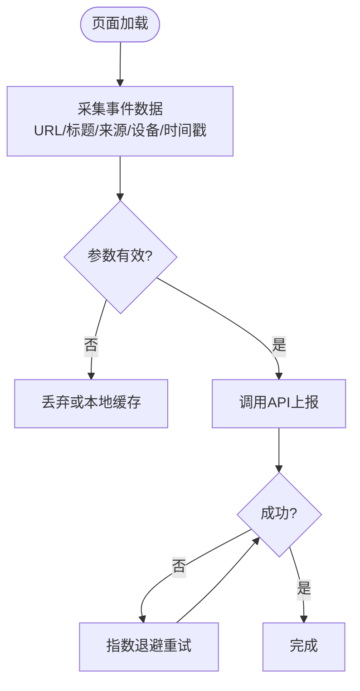
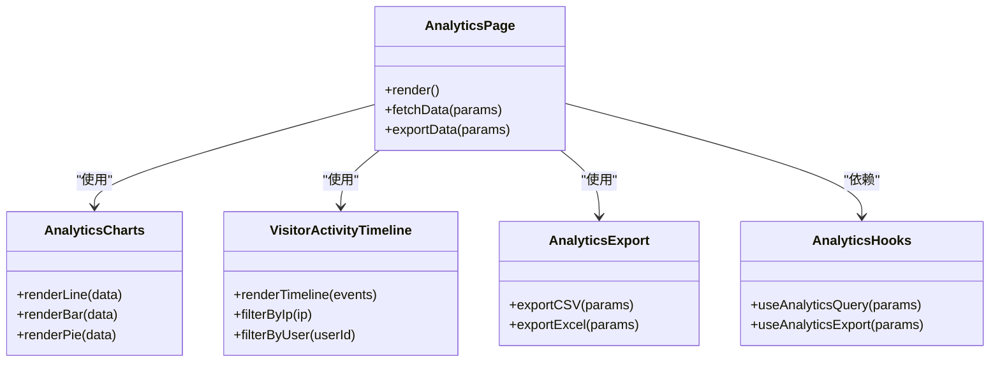
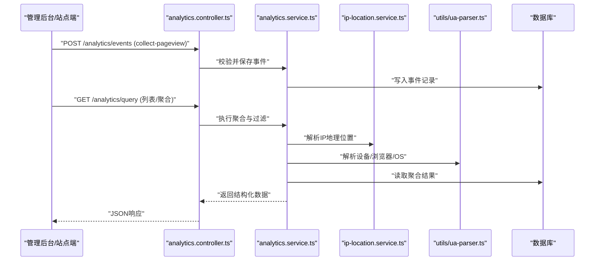
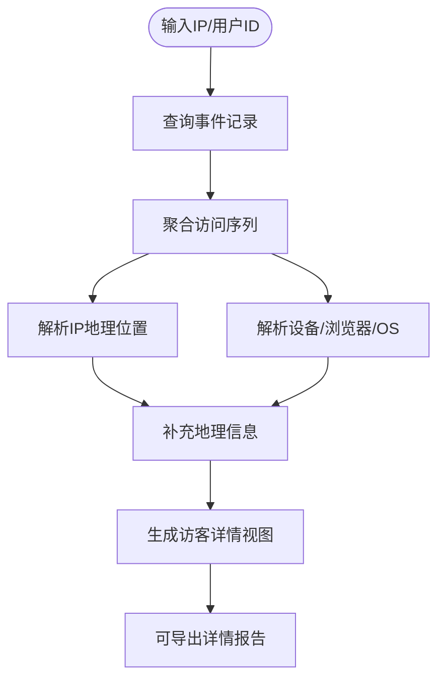
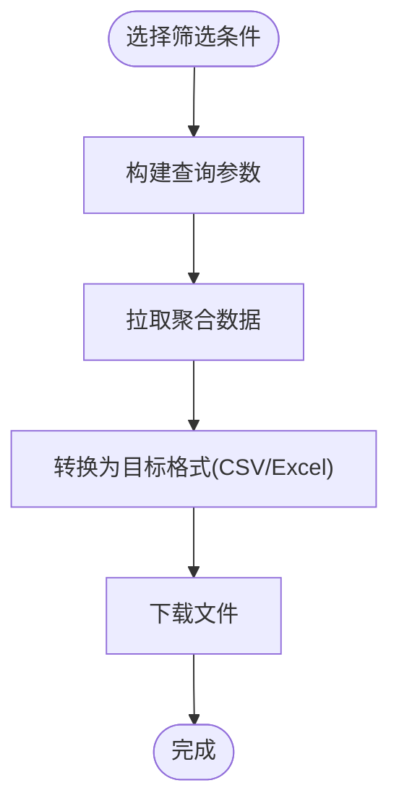
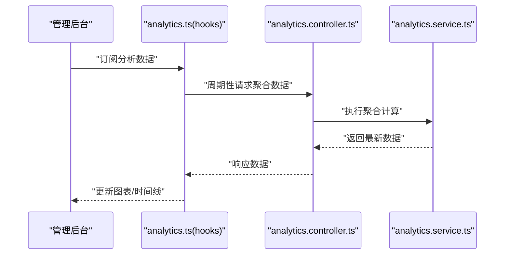
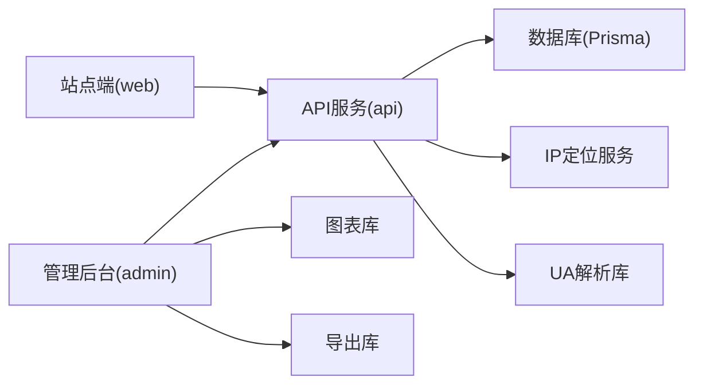

# 访客分析与统计

<cite>
**本文档引用的文件**   
- [apps/admin/src/app/(dashboard)/analytics/page.tsx](file://apps/admin/src/app/(dashboard)/analytics/page.tsx)
- [apps/admin/src/components/analytics/AnalyticsCharts.tsx](file://apps/admin/src/components/analytics/AnalyticsCharts.tsx)
- [apps/admin/src/components/analytics/VisitorActivityTimeline.tsx](file://apps/admin/src/components/analytics/VisitorActivityTimeline.tsx)
- [apps/admin/src/components/analytics/chart-theme.ts](file://apps/admin/src/components/analytics/chart-theme.ts)
- [apps/admin/src/features/analytics-export.ts](file://apps/admin/src/features/analytics-export.ts)
- [apps/admin/src/features/analytics.ts](file://apps/admin/src/features/analytics.ts)
- [apps/admin/src/lib/analytics-geo-hints.ts](file://apps/admin/src/lib/analytics-geo-hints.ts)
- [apps/admin/src/lib/analytics-granularity.ts](file://apps/admin/src/lib/analytics-granularity.ts)
- [apps/api/src/analytics/analytics.controller.ts](file://apps/api/src/analytics/analytics.controller.ts)
- [apps/api/src/analytics/analytics.service.ts](file://apps/api/src/analytics/analytics.service.ts)
- [apps/api/src/analytics/ip-location.service.ts](file://apps/api/src/analytics/ip-location.service.ts)
- [apps/api/src/analytics/utils/client-ip.ts](file://apps/api/src/analytics/utils/client-ip.ts)
- [apps/api/src/analytics/utils/geo-ip.ts](file://apps/api/src/analytics/utils/geo-ip.ts)
- [apps/api/src/analytics/utils/ua-parser.ts](file://apps/api/src/analytics/utils/ua-parser.ts)
- [apps/api/src/analytics/dto/collect-pageview.dto.ts](file://apps/api/src/analytics/dto/collect-pageview.dto.ts)
- [apps/api/src/analytics/dto/identify.dto.ts](file://apps/api/src/analytics/dto/identify.dto.ts)
- [apps/web/src/components/analytics/VisitorTracker.tsx](file://apps/web/src/components/analytics/VisitorTracker.tsx)
- [apps/web/src/lib/analytics.ts](file://apps/web/src/lib/analytics.ts)
</cite>

## 目录
1. [简介](#简介)
2. [项目结构](#项目结构)
3. [核心组件](#核心组件)
4. [架构总览](#架构总览)
5. [详细组件分析](#详细组件分析)
6. [依赖关系分析](#依赖关系分析)
7. [性能考量](#性能考量)
8. [故障排查指南](#故障排查指南)
9. [结论](#结论)
10. [附录](#附录)

## 简介
本系统为管理后台的访客分析与统计模块，覆盖访客行为追踪、流量分析、地理分布统计、图表可视化、实时数据更新与趋势分析、访客详情查看（含IP解析与设备信息识别）、数据导出与报表生成、自定义指标配置、性能监控、异常检测与告警设置等能力。前端基于 Next.js 管理后台与站点侧埋点采集，后端采用 NestJS 提供分析接口、IP 地理位置解析与 UA 解析工具，数据库通过 Prisma 持久化分析事件与元数据。

## 项目结构
该功能横跨三个子应用：
- 站点端（web）：负责页面级埋点与事件上报，包括页面浏览、用户标识、来源渠道、设备信息等。
- 管理后台（admin）：提供分析看板、图表、时间线、筛选与导出等功能。
- API 服务（api）：提供事件收集、聚合查询、IP 定位、UA 解析、导出等接口。

**图示来源** 
- [apps/web/src/components/analytics/VisitorTracker.tsx](file://apps/web/src/components/analytics/VisitorTracker.tsx)
- [apps/web/src/lib/analytics.ts](file://apps/web/src/lib/analytics.ts)
- [apps/admin/src/app/(dashboard)/analytics/page.tsx](file://apps/admin/src/app/(dashboard)/analytics/page.tsx)
- [apps/admin/src/components/analytics/AnalyticsCharts.tsx](file://apps/admin/src/components/analytics/AnalyticsCharts.tsx)
- [apps/admin/src/components/analytics/VisitorActivityTimeline.tsx](file://apps/admin/src/components/analytics/VisitorActivityTimeline.tsx)
- [apps/admin/src/features/analytics-export.ts](file://apps/admin/src/features/analytics-export.ts)
- [apps/admin/src/features/analytics.ts](file://apps/admin/src/features/analytics.ts)
- [apps/api/src/analytics/analytics.controller.ts](file://apps/api/src/analytics/analytics.controller.ts)
- [apps/api/src/analytics/analytics.service.ts](file://apps/api/src/analytics/analytics.service.ts)
- [apps/api/src/analytics/ip-location.service.ts](file://apps/api/src/analytics/ip-location.service.ts)
- [apps/api/src/analytics/utils/ua-parser.ts](file://apps/api/src/analytics/utils/ua-parser.ts)
- [apps/api/src/analytics/utils/geo-ip.ts](file://apps/api/src/analytics/utils/geo-ip.ts)
- [apps/api/src/analytics/utils/client-ip.ts](file://apps/api/src/analytics/utils/client-ip.ts)

**章节来源**
- [apps/admin/src/app/(dashboard)/analytics/page.tsx](file://apps/admin/src/app/(dashboard)/analytics/page.tsx)
- [apps/admin/src/components/analytics/AnalyticsCharts.tsx](file://apps/admin/src/components/analytics/AnalyticsCharts.tsx)
- [apps/admin/src/components/analytics/VisitorActivityTimeline.tsx](file://apps/admin/src/components/analytics/VisitorActivityTimeline.tsx)
- [apps/admin/src/features/analytics-export.ts](file://apps/admin/src/features/analytics-export.ts)
- [apps/admin/src/features/analytics.ts](file://apps/admin/src/features/analytics.ts)
- [apps/web/src/components/analytics/VisitorTracker.tsx](file://apps/web/src/components/analytics/VisitorTracker.tsx)
- [apps/web/src/lib/analytics.ts](file://apps/web/src/lib/analytics.ts)
- [apps/api/src/analytics/analytics.controller.ts](file://apps/api/src/analytics/analytics.controller.ts)
- [apps/api/src/analytics/analytics.service.ts](file://apps/api/src/analytics/analytics.service.ts)

## 核心组件
- 站点端埋点与上报
  - VisitorTracker：在页面挂载时采集基础访问事件（如页面浏览、来源、设备信息），并调用统一上报方法。
  - analytics.ts：封装上报逻辑，包含重试、节流、去重与错误处理。
- 管理后台分析面板
  - analytics/page.tsx：分析页入口，集成图表、时间线与筛选条件。
  - AnalyticsCharts.tsx：图表容器，支持折线、柱状、饼图等，主题由 chart-theme.ts 控制。
  - VisitorActivityTimeline.tsx：按时间轴展示访客活动轨迹，支持按 IP/用户维度过滤。
  - analytics-export.ts：导出 CSV/Excel，支持自定义字段与筛选条件。
  - analytics.ts（admin）：聚合查询与状态管理，封装分页、排序与缓存策略。
  - analytics-geo-hints.ts / analytics-granularity.ts：地理提示与粒度配置（日/周/月）。
- API 服务与分析能力
  - analytics.controller.ts：定义事件收集、列表查询、导出等路由。
  - analytics.service.ts：业务编排，聚合统计、过滤、分页、导出。
  - ip-location.service.ts：IP 地理位置解析与反查。
  - utils/ua-parser.ts：User-Agent 解析（浏览器、操作系统、设备类型）。
  - utils/geo-ip.ts / client-ip.ts：IP 获取与地理信息辅助。
  - dto/collect-pageview.dto.ts / identify.dto.ts：请求校验与数据结构定义。

**章节来源**
- [apps/web/src/components/analytics/VisitorTracker.tsx](file://apps/web/src/components/analytics/VisitorTracker.tsx)
- [apps/web/src/lib/analytics.ts](file://apps/web/src/lib/analytics.ts)
- [apps/admin/src/app/(dashboard)/analytics/page.tsx](file://apps/admin/src/app/(dashboard)/analytics/page.tsx)
- [apps/admin/src/components/analytics/AnalyticsCharts.tsx](file://apps/admin/src/components/analytics/AnalyticsCharts.tsx)
- [apps/admin/src/components/analytics/VisitorActivityTimeline.tsx](file://apps/admin/src/components/analytics/VisitorActivityTimeline.tsx)
- [apps/admin/src/features/analytics-export.ts](file://apps/admin/src/features/analytics-export.ts)
- [apps/admin/src/features/analytics.ts](file://apps/admin/src/features/analytics.ts)
- [apps/admin/src/lib/analytics-geo-hints.ts](file://apps/admin/src/lib/analytics-geo-hints.ts)
- [apps/admin/src/lib/analytics-granularity.ts](file://apps/admin/src/lib/analytics-granularity.ts)
- [apps/api/src/analytics/analytics.controller.ts](file://apps/api/src/analytics/analytics.controller.ts)
- [apps/api/src/analytics/analytics.service.ts](file://apps/api/src/analytics/analytics.service.ts)
- [apps/api/src/analytics/ip-location.service.ts](file://apps/api/src/analytics/ip-location.service.ts)
- [apps/api/src/analytics/utils/ua-parser.ts](file://apps/api/src/analytics/utils/ua-parser.ts)
- [apps/api/src/analytics/utils/geo-ip.ts](file://apps/api/src/analytics/utils/geo-ip.ts)
- [apps/api/src/analytics/utils/client-ip.ts](file://apps/api/src/analytics/utils/client-ip.ts)
- [apps/api/src/analytics/dto/collect-pageview.dto.ts](file://apps/api/src/analytics/dto/collect-pageview.dto.ts)
- [apps/api/src/analytics/dto/identify.dto.ts](file://apps/api/src/analytics/dto/identify.dto.ts)

## 架构总览
整体采用“前端埋点 → API 收集与解析 → 聚合存储 → 管理后台可视化”的分层架构。站点端通过轻量脚本采集关键行为；API 层负责接收、校验、解析与入库；管理后台通过统一的查询与导出接口进行展示与操作。

**图示来源** 
- [apps/web/src/components/analytics/VisitorTracker.tsx](file://apps/web/src/components/analytics/VisitorTracker.tsx)
- [apps/web/src/lib/analytics.ts](file://apps/web/src/lib/analytics.ts)
- [apps/api/src/analytics/analytics.controller.ts](file://apps/api/src/analytics/analytics.controller.ts)
- [apps/api/src/analytics/analytics.service.ts](file://apps/api/src/analytics/analytics.service.ts)
- [apps/api/src/analytics/ip-location.service.ts](file://apps/api/src/analytics/ip-location.service.ts)
- [apps/api/src/analytics/utils/ua-parser.ts](file://apps/api/src/analytics/utils/ua-parser.ts)
- [apps/admin/src/app/(dashboard)/analytics/page.tsx](file://apps/admin/src/app/(dashboard)/analytics/page.tsx)
- [apps/admin/src/components/analytics/AnalyticsCharts.tsx](file://apps/admin/src/components/analytics/AnalyticsCharts.tsx)

## 详细组件分析

### 站点端埋点与上报
- VisitorTracker：在页面生命周期内采集页面 URL、标题、来源、时间戳、设备信息与用户标识（可选），并通过统一上报接口发送。
- analytics.ts：封装上报流程，包括参数校验、重试机制、失败降级与日志记录。

**图示来源** 
- [apps/web/src/components/analytics/VisitorTracker.tsx](file://apps/web/src/components/analytics/VisitorTracker.tsx)
- [apps/web/src/lib/analytics.ts](file://apps/web/src/lib/analytics.ts)

**章节来源**
- [apps/web/src/components/analytics/VisitorTracker.tsx](file://apps/web/src/components/analytics/VisitorTracker.tsx)
- [apps/web/src/lib/analytics.ts](file://apps/web/src/lib/analytics.ts)

### 管理后台分析面板
- analytics/page.tsx：作为分析页入口，组合查询参数（时间范围、粒度、来源、地区等），调用 analytics.ts 获取数据，驱动图表与时间线。
- AnalyticsCharts.tsx：根据返回数据渲染多种图表，支持交互（缩放、筛选、钻取）。
- VisitorActivityTimeline.tsx：以时间轴形式展示访客活动，支持按 IP/用户维度展开详情。
- analytics-export.ts：将当前筛选条件下的数据导出为 CSV/Excel，支持自定义列与格式。
- analytics.ts（admin）：封装查询、分页、排序、缓存与错误处理，提供统一的 hooks 或函数供页面使用。
- analytics-geo-hints.ts / analytics-granularity.ts：提供地理提示与时间粒度配置，影响聚合与展示方式。

**图示来源** 
- [apps/admin/src/app/(dashboard)/analytics/page.tsx](file://apps/admin/src/app/(dashboard)/analytics/page.tsx)
- [apps/admin/src/components/analytics/AnalyticsCharts.tsx](file://apps/admin/src/components/analytics/AnalyticsCharts.tsx)
- [apps/admin/src/components/analytics/VisitorActivityTimeline.tsx](file://apps/admin/src/components/analytics/VisitorActivityTimeline.tsx)
- [apps/admin/src/features/analytics-export.ts](file://apps/admin/src/features/analytics-export.ts)
- [apps/admin/src/features/analytics.ts](file://apps/admin/src/features/analytics.ts)

**章节来源**
- [apps/admin/src/app/(dashboard)/analytics/page.tsx](file://apps/admin/src/app/(dashboard)/analytics/page.tsx)
- [apps/admin/src/components/analytics/AnalyticsCharts.tsx](file://apps/admin/src/components/analytics/AnalyticsCharts.tsx)
- [apps/admin/src/components/analytics/VisitorActivityTimeline.tsx](file://apps/admin/src/components/analytics/VisitorActivityTimeline.tsx)
- [apps/admin/src/features/analytics-export.ts](file://apps/admin/src/features/analytics-export.ts)
- [apps/admin/src/features/analytics.ts](file://apps/admin/src/features/analytics.ts)
- [apps/admin/src/lib/analytics-geo-hints.ts](file://apps/admin/src/lib/analytics-geo-hints.ts)
- [apps/admin/src/lib/analytics-granularity.ts](file://apps/admin/src/lib/analytics-granularity.ts)

### API 服务与分析能力
- analytics.controller.ts：定义事件收集、列表查询、导出等路由，负责参数校验与响应格式化。
- analytics.service.ts：实现事件落库、聚合统计、过滤、分页、导出等核心逻辑。
- ip-location.service.ts：调用外部或内置库解析 IP 地理位置，支持批量与缓存。
- utils/ua-parser.ts：解析 User-Agent，提取浏览器、操作系统、设备类型等信息。
- utils/geo-ip.ts / client-ip.ts：辅助获取客户端真实 IP 与地理信息。
- dto/collect-pageview.dto.ts / identify.dto.ts：定义请求体结构与校验规则。

**图示来源** 
- [apps/api/src/analytics/analytics.controller.ts](file://apps/api/src/analytics/analytics.controller.ts)
- [apps/api/src/analytics/analytics.service.ts](file://apps/api/src/analytics/analytics.service.ts)
- [apps/api/src/analytics/ip-location.service.ts](file://apps/api/src/analytics/ip-location.service.ts)
- [apps/api/src/analytics/utils/ua-parser.ts](file://apps/api/src/analytics/utils/ua-parser.ts)
- [apps/api/src/analytics/dto/collect-pageview.dto.ts](file://apps/api/src/analytics/dto/collect-pageview.dto.ts)
- [apps/api/src/analytics/dto/identify.dto.ts](file://apps/api/src/analytics/dto/identify.dto.ts)

**章节来源**
- [apps/api/src/analytics/analytics.controller.ts](file://apps/api/src/analytics/analytics.controller.ts)
- [apps/api/src/analytics/analytics.service.ts](file://apps/api/src/analytics/analytics.service.ts)
- [apps/api/src/analytics/ip-location.service.ts](file://apps/api/src/analytics/ip-location.service.ts)
- [apps/api/src/analytics/utils/ua-parser.ts](file://apps/api/src/analytics/utils/ua-parser.ts)
- [apps/api/src/analytics/utils/geo-ip.ts](file://apps/api/src/analytics/utils/geo-ip.ts)
- [apps/api/src/analytics/utils/client-ip.ts](file://apps/api/src/analytics/utils/client-ip.ts)
- [apps/api/src/analytics/dto/collect-pageview.dto.ts](file://apps/api/src/analytics/dto/collect-pageview.dto.ts)
- [apps/api/src/analytics/dto/identify.dto.ts](file://apps/api/src/analytics/dto/identify.dto.ts)

### 访客详情查看、IP地址解析与设备信息识别
- 访客详情：通过 IP 或用户 ID 聚合其访问历史，展示页面序列、停留时长、来源渠道、设备与地理位置。
- IP 解析：结合 geo-ip 与 ip-location 服务，将 IP 映射到国家/城市/ISP，支持反向解析与缓存。
- 设备识别：利用 ua-parser 解析 UA 字符串，输出浏览器、操作系统、设备型号与屏幕分辨率等。

**图示来源** 
- [apps/api/src/analytics/analytics.service.ts](file://apps/api/src/analytics/analytics.service.ts)
- [apps/api/src/analytics/ip-location.service.ts](file://apps/api/src/analytics/ip-location.service.ts)
- [apps/api/src/analytics/utils/ua-parser.ts](file://apps/api/src/analytics/utils/ua-parser.ts)
- [apps/api/src/analytics/utils/geo-ip.ts](file://apps/api/src/analytics/utils/geo-ip.ts)

**章节来源**
- [apps/api/src/analytics/analytics.service.ts](file://apps/api/src/analytics/analytics.service.ts)
- [apps/api/src/analytics/ip-location.service.ts](file://apps/api/src/analytics/ip-location.service.ts)
- [apps/api/src/analytics/utils/ua-parser.ts](file://apps/api/src/analytics/utils/ua-parser.ts)
- [apps/api/src/analytics/utils/geo-ip.ts](file://apps/api/src/analytics/utils/geo-ip.ts)

### 数据导出、报表生成与自定义指标配置
- 数据导出：analytics-export.ts 支持按当前筛选条件导出 CSV/Excel，允许自定义列与格式。
- 报表生成：管理后台可将聚合结果导出为报表模板，支持定时任务与邮件推送（可扩展）。
- 自定义指标：通过 analytics.ts 与 DTO 扩展指标字段，支持新增维度与度量，并在图表中展示。

**图示来源** 
- [apps/admin/src/features/analytics-export.ts](file://apps/admin/src/features/analytics-export.ts)
- [apps/admin/src/features/analytics.ts](file://apps/admin/src/features/analytics.ts)
- [apps/api/src/analytics/analytics.controller.ts](file://apps/api/src/analytics/analytics.controller.ts)

**章节来源**
- [apps/admin/src/features/analytics-export.ts](file://apps/admin/src/features/analytics-export.ts)
- [apps/admin/src/features/analytics.ts](file://apps/admin/src/features/analytics.ts)
- [apps/api/src/analytics/analytics.controller.ts](file://apps/api/src/analytics/analytics.controller.ts)

### 实时数据更新与趋势分析
- 实时数据：通过轮询或 WebSocket（可扩展）刷新分析数据，确保看板时效性。
- 趋势分析：按时间粒度（日/周/月）聚合流量与转化指标，支持同比/环比与异常波动标注。

**图示来源** 
- [apps/admin/src/features/analytics.ts](file://apps/admin/src/features/analytics.ts)
- [apps/api/src/analytics/analytics.controller.ts](file://apps/api/src/analytics/analytics.controller.ts)
- [apps/api/src/analytics/analytics.service.ts](file://apps/api/src/analytics/analytics.service.ts)

**章节来源**
- [apps/admin/src/features/analytics.ts](file://apps/admin/src/features/analytics.ts)
- [apps/api/src/analytics/analytics.controller.ts](file://apps/api/src/analytics/analytics.controller.ts)
- [apps/api/src/analytics/analytics.service.ts](file://apps/api/src/analytics/analytics.service.ts)

## 依赖关系分析
- 前端依赖：Next.js、图表库（由 AnalyticsCharts.tsx 引入）、状态管理与网络请求封装。
- 后端依赖：NestJS、Prisma、IP 定位库、UA 解析库、缓存与队列（可扩展）。
- 外部集成：地理位置服务、存储（用于导出文件）、消息通知（告警）。

**图示来源** 
- [apps/web/src/components/analytics/VisitorTracker.tsx](file://apps/web/src/components/analytics/VisitorTracker.tsx)
- [apps/admin/src/components/analytics/AnalyticsCharts.tsx](file://apps/admin/src/components/analytics/AnalyticsCharts.tsx)
- [apps/api/src/analytics/analytics.controller.ts](file://apps/api/src/analytics/analytics.controller.ts)
- [apps/api/src/analytics/analytics.service.ts](file://apps/api/src/analytics/analytics.service.ts)

**章节来源**
- [apps/web/src/components/analytics/VisitorTracker.tsx](file://apps/web/src/components/analytics/VisitorTracker.tsx)
- [apps/admin/src/components/analytics/AnalyticsCharts.tsx](file://apps/admin/src/components/analytics/AnalyticsCharts.tsx)
- [apps/api/src/analytics/analytics.controller.ts](file://apps/api/src/analytics/analytics.controller.ts)
- [apps/api/src/analytics/analytics.service.ts](file://apps/api/src/analytics/analytics.service.ts)

## 性能考量
- 数据采集：站点端埋点需避免阻塞主线程，建议异步上报与批量合并。
- 数据传输：压缩与分页，减少单次请求体积；对热点数据启用缓存。
- 聚合计算：按时间粒度预聚合，避免全量扫描；必要时引入时序数据库或 OLAP。
- 导出性能：大文件分片生成与异步任务，避免阻塞请求。
- 资源优化：图表按需渲染，懒加载与虚拟滚动提升交互体验。

## 故障排查指南
- 事件丢失：检查站点端上报是否被拦截（广告插件、隐私模式），确认 API 可达性与限流策略。
- 数据不准：核对 UA 解析与 IP 定位准确性，验证时间戳与时区设置。
- 导出失败：检查磁盘空间与权限，确认文件格式与字段映射。
- 性能问题：监控接口耗时与数据库慢查询，优化索引与聚合逻辑。
- 告警缺失：确认监控阈值与通知通道配置，测试告警触发链路。

**章节来源**
- [apps/web/src/lib/analytics.ts](file://apps/web/src/lib/analytics.ts)
- [apps/api/src/analytics/analytics.service.ts](file://apps/api/src/analytics/analytics.service.ts)
- [apps/admin/src/features/analytics-export.ts](file://apps/admin/src/features/analytics-export.ts)

## 结论
本系统通过前后端协同实现了完整的访客分析与统计能力，涵盖数据采集、解析、聚合、可视化与导出。未来可在实时性、准确性与性能方面持续优化，并扩展更多自定义指标与告警策略，以满足复杂业务场景需求。

## 附录
- 常用查询参数：时间范围、粒度、来源、地区、设备类型、用户标识。
- 指标定义：PV/UV、平均停留时长、跳出率、转化率、地域占比、设备占比。
- 扩展点：新增指标字段、接入第三方地理位置服务、增加 WebSocket 实时推送。