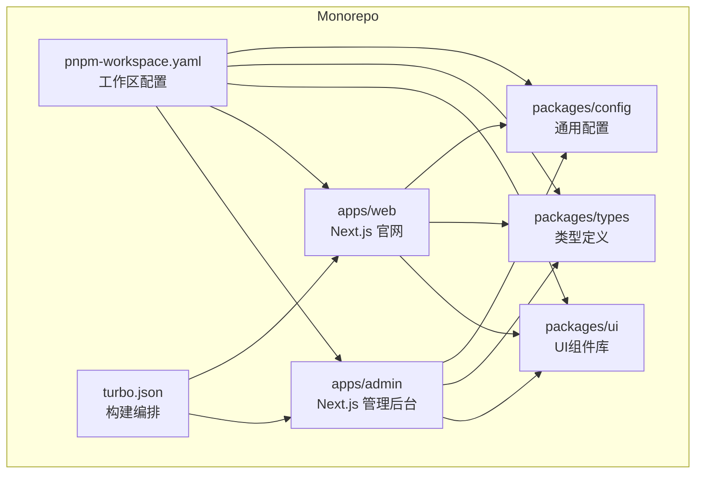
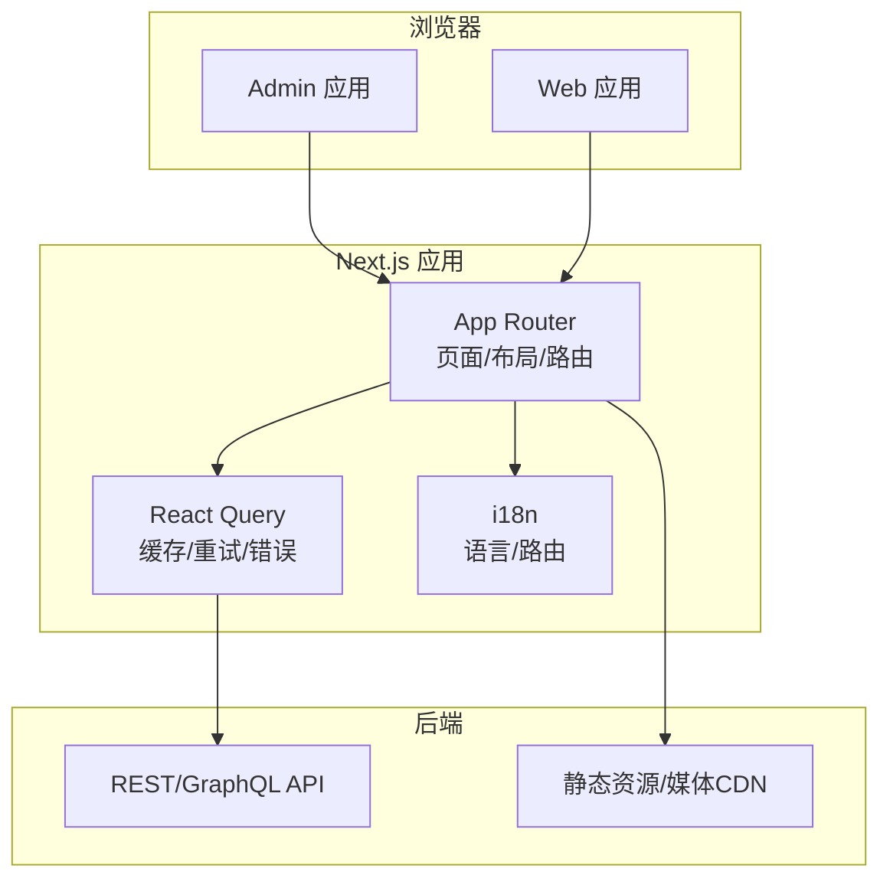
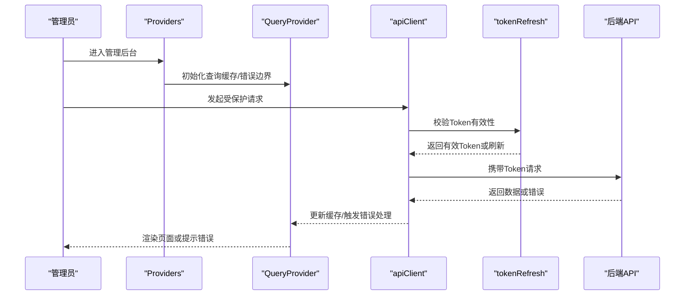
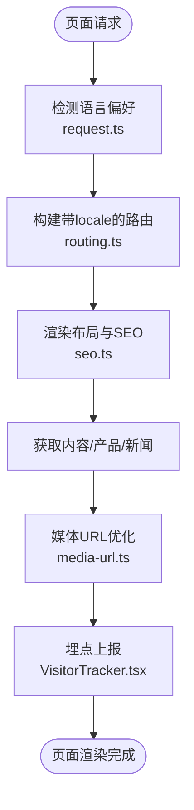
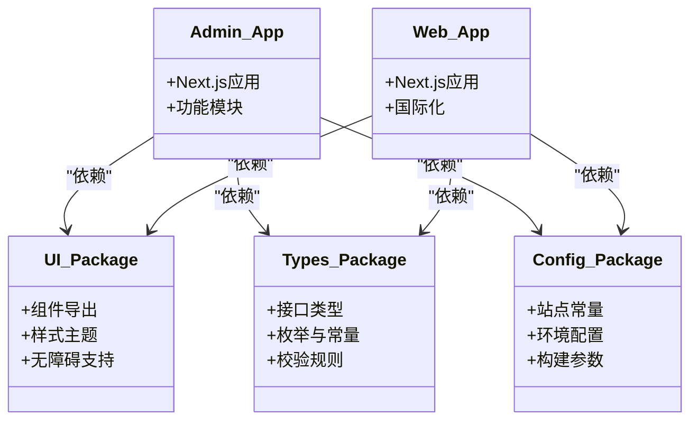
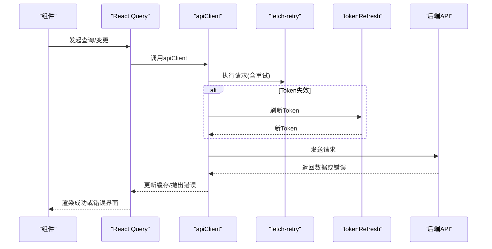
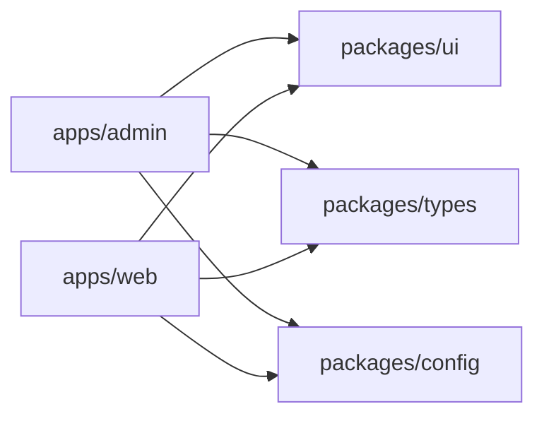

# 前端架构设计

<cite>
**本文引用的文件**   
- [apps/admin/src/app/layout.tsx](file://apps/admin/src/app/layout.tsx)
- [apps/admin/src/app/(dashboard)/layout.tsx](file://apps/admin/src/app/(dashboard)/layout.tsx)
- [apps/admin/src/app/login/page.tsx](file://apps/admin/src/app/login/page.tsx)
- [apps/admin/src/components/Providers.tsx](file://apps/admin/src/components/Providers.tsx)
- [apps/admin/src/components/QueryProvider.tsx](file://apps/admin/src/components/QueryProvider.tsx)
- [apps/admin/src/lib/apiClient.ts](file://apps/admin/src/lib/apiClient.ts)
- [apps/admin/src/lib/fetch-retry.ts](file://apps/admin/src/lib/fetch-retry.ts)
- [apps/admin/src/lib/tokenRefresh.ts](file://apps/admin/src/lib/tokenRefresh.ts)
- [apps/admin/src/features/chat/api.ts](file://apps/admin/src/features/chat/api.ts)
- [apps/web/src/app/[locale]/layout.tsx](file://apps/web/src/app/[locale]/layout.tsx)
- [apps/web/src/app/layout.tsx](file://apps/web/src/app/layout.tsx)
- [apps/web/src/i18n/navigation.ts](file://apps/web/src/i18n/navigation.ts)
- [apps/web/src/i18n/request.ts](file://apps/web/src/i18n/request.ts)
- [apps/web/src/i18n/routing.ts](file://apps/web/src/i18n/routing.ts)
- [apps/web/src/lib/api.ts](file://apps/web/src/lib/api.ts)
- [apps/web/src/lib/media-url.ts](file://apps/web/src/lib/media-url.ts)
- [apps/web/src/lib/seo.ts](file://apps/web/src/lib/seo.ts)
- [apps/web/src/components/analytics/VisitorTracker.tsx](file://apps/web/src/components/analytics/VisitorTracker.tsx)
- [apps/web/src/components/content/ContentListShell.tsx](file://apps/web/src/components/content/ContentListShell.tsx)
- [packages/ui/package.json](file://packages/ui/package.json)
- [packages/types/package.json](file://packages/types/package.json)
- [packages/config/package.json](file://packages/config/package.json)
- [pnpm-workspace.yaml](file://pnpm-workspace.yaml)
- [turbo.json](file://turbo.json)
- [apps/admin/next.config.ts](file://apps/admin/next.config.ts)
- [apps/web/next.config.ts](file://apps/web/next.config.ts)
</cite>

## 目录
1. [引言](#引言)
2. [项目结构](#项目结构)
3. [核心组件](#核心组件)
4. [架构总览](#架构总览)
5. [详细组件分析](#详细组件分析)
6. [依赖分析](#依赖分析)
7. [性能考量](#性能考量)
8. [故障排查指南](#故障排查指南)
9. [结论](#结论)
10. [附录](#附录)

## 引言
本文件面向TZJ网站的前端开发者，系统性阐述基于Next.js的三层架构：Admin管理后台、Web官网与共享组件库（packages）。文档覆盖应用结构、路由策略、状态管理模式、组件分层设计、Monorepo共享代码组织、前后端分离API调用模式、错误处理与数据缓存策略、响应式设计与国际化支持、以及性能优化方案。目标是帮助团队在统一架构下高效协作、稳定演进。

## 项目结构
仓库采用Monorepo组织，使用pnpm workspace与Turbo进行任务编排。前端包含两个Next.js应用：
- apps/admin：管理后台，基于App Router，提供内容、用户、媒体、安全等管理能力。
- apps/web：对外官网，基于App Router并实现多语言路由[locale]。
- packages：共享包，包括UI组件库、类型定义、通用配置等。

图表来源
- [pnpm-workspace.yaml](file://pnpm-workspace.yaml)
- [turbo.json](file://turbo.json)

章节来源
- [pnpm-workspace.yaml](file://pnpm-workspace.yaml)
- [turbo.json](file://turbo.json)

## 核心组件
- 应用壳与布局
  - Admin：根布局与仪表板分组布局，承载全局样式、导航与权限控制。
  - Web：根布局与多语言布局，负责SEO、主题、i18n上下文与客户端脚本注入。
- 状态与数据层
  - React Query Provider：集中管理服务端状态、缓存、重试与错误边界。
  - API客户端：封装fetch、拦截器、Token刷新与重试策略。
- 国际化
  - Web侧通过[locale]路由与i18n工具模块实现动态语言切换与URL规范化。
- 共享包
  - UI组件库：跨应用复用的基础与业务组件。
  - 类型定义：统一的接口与实体类型。
  - 配置：站点常量、主题与构建期配置。

章节来源
- [apps/admin/src/app/layout.tsx](file://apps/admin/src/app/layout.tsx)
- [apps/admin/src/app/(dashboard)/layout.tsx](file://apps/admin/src/app/(dashboard)/layout.tsx)
- [apps/web/src/app/[locale]/layout.tsx](file://apps/web/src/app/[locale]/layout.tsx)
- [apps/web/src/app/layout.tsx](file://apps/web/src/app/layout.tsx)
- [apps/admin/src/components/Providers.tsx](file://apps/admin/src/components/Providers.tsx)
- [apps/admin/src/components/QueryProvider.tsx](file://apps/admin/src/components/QueryProvider.tsx)
- [apps/admin/src/lib/apiClient.ts](file://apps/admin/src/lib/apiClient.ts)
- [apps/web/src/i18n/navigation.ts](file://apps/web/src/i18n/navigation.ts)
- [apps/web/src/i18n/request.ts](file://apps/web/src/i18n/request.ts)
- [apps/web/src/i18n/routing.ts](file://apps/web/src/i18n/routing.ts)

## 架构总览
整体采用“前后端分离 + Next.js App Router”的架构：
- Admin与Web各自独立部署，共享packages中的类型、UI与配置。
- API由后端服务提供，前端通过HTTP或BFF代理访问。
- 状态管理以React Query为核心，结合本地缓存与请求重试。
- 国际化通过Next.js i18n与自定义路由解析实现。

图表来源
- [apps/admin/src/app/layout.tsx](file://apps/admin/src/app/layout.tsx)
- [apps/web/src/app/[locale]/layout.tsx](file://apps/web/src/app/[locale]/layout.tsx)
- [apps/admin/src/components/QueryProvider.tsx](file://apps/admin/src/components/QueryProvider.tsx)
- [apps/web/src/i18n/routing.ts](file://apps/web/src/i18n/routing.ts)

## 详细组件分析

### Admin管理后台
- 路由与布局
  - 根布局提供全局样式、会话与权限上下文。
  - (dashboard)分组布局用于受保护的路由集合，配合登录页跳转与权限守卫。
- 状态与数据
  - Providers组合全局上下文；QueryProvider统一管理查询缓存、重试与错误提示。
- API与认证
  - apiClient封装请求拦截、Token刷新与错误分类；tokenRefresh保障会话续期。
- 功能特性
  - 聊天、媒体、文档、客户、审计日志等按feature划分，便于扩展与维护。

图表来源
- [apps/admin/src/components/Providers.tsx](file://apps/admin/src/components/Providers.tsx)
- [apps/admin/src/components/QueryProvider.tsx](file://apps/admin/src/components/QueryProvider.tsx)
- [apps/admin/src/lib/apiClient.ts](file://apps/admin/src/lib/apiClient.ts)
- [apps/admin/src/lib/tokenRefresh.ts](file://apps/admin/src/lib/tokenRefresh.ts)

章节来源
- [apps/admin/src/app/layout.tsx](file://apps/admin/src/app/layout.tsx)
- [apps/admin/src/app/(dashboard)/layout.tsx](file://apps/admin/src/app/(dashboard)/layout.tsx)
- [apps/admin/src/app/login/page.tsx](file://apps/admin/src/app/login/page.tsx)
- [apps/admin/src/components/Providers.tsx](file://apps/admin/src/components/Providers.tsx)
- [apps/admin/src/components/QueryProvider.tsx](file://apps/admin/src/components/QueryProvider.tsx)
- [apps/admin/src/lib/apiClient.ts](file://apps/admin/src/lib/apiClient.ts)
- [apps/admin/src/lib/tokenRefresh.ts](file://apps/admin/src/lib/tokenRefresh.ts)

### Web官网
- 路由与国际化
  - 使用[locale]动态段实现多语言路由，结合navigation与routing工具完成语言切换与路径生成。
  - request模块在服务端解析语言偏好，确保SSR一致性。
- SEO与元信息
  - seo工具集中管理标题、描述、OpenGraph与结构化数据。
- 媒体与图片
  - media-url统一处理媒体域名、尺寸与加载策略，提升首屏性能。
- 分析与埋点
  - VisitorTracker记录访客行为，辅助数据分析与转化追踪。

图表来源
- [apps/web/src/i18n/request.ts](file://apps/web/src/i18n/request.ts)
- [apps/web/src/i18n/routing.ts](file://apps/web/src/i18n/routing.ts)
- [apps/web/src/lib/seo.ts](file://apps/web/src/lib/seo.ts)
- [apps/web/src/lib/media-url.ts](file://apps/web/src/lib/media-url.ts)
- [apps/web/src/components/analytics/VisitorTracker.tsx](file://apps/web/src/components/analytics/VisitorTracker.tsx)

章节来源
- [apps/web/src/app/[locale]/layout.tsx](file://apps/web/src/app/[locale]/layout.tsx)
- [apps/web/src/app/layout.tsx](file://apps/web/src/app/layout.tsx)
- [apps/web/src/i18n/navigation.ts](file://apps/web/src/i18n/navigation.ts)
- [apps/web/src/i18n/request.ts](file://apps/web/src/i18n/request.ts)
- [apps/web/src/i18n/routing.ts](file://apps/web/src/i18n/routing.ts)
- [apps/web/src/lib/seo.ts](file://apps/web/src/lib/seo.ts)
- [apps/web/src/lib/media-url.ts](file://apps/web/src/lib/media-url.ts)
- [apps/web/src/components/analytics/VisitorTracker.tsx](file://apps/web/src/components/analytics/VisitorTracker.tsx)

### 共享组件库与Monorepo复用机制
- packages/ui：跨应用复用的UI组件，保证风格一致与可维护性。
- packages/types：统一类型定义，避免重复声明，提升类型安全。
- packages/config：站点常量、主题与构建期配置，减少硬编码。
- pnpm workspace与turbo协调依赖安装与并行构建，提升开发体验与CI效率。

图表来源
- [packages/ui/package.json](file://packages/ui/package.json)
- [packages/types/package.json](file://packages/types/package.json)
- [packages/config/package.json](file://packages/config/package.json)
- [pnpm-workspace.yaml](file://pnpm-workspace.yaml)
- [turbo.json](file://turbo.json)

章节来源
- [packages/ui/package.json](file://packages/ui/package.json)
- [packages/types/package.json](file://packages/types/package.json)
- [packages/config/package.json](file://packages/config/package.json)
- [pnpm-workspace.yaml](file://pnpm-workspace.yaml)
- [turbo.json](file://turbo.json)

### API调用模式与错误处理
- 统一客户端
  - apiClient封装请求头、鉴权、错误映射与重试策略。
  - fetch-retry提供指数退避与最大重试次数控制。
  - tokenRefresh在Token过期时自动刷新，避免中断用户体验。
- 功能模块API
  - features/chat/api.ts等按领域组织API调用，保持高内聚低耦合。
- 错误处理
  - 网络错误、业务错误与权限错误分类处理，提供用户友好提示。
  - 在QueryProvider中集中捕获并展示错误。

图表来源
- [apps/admin/src/lib/apiClient.ts](file://apps/admin/src/lib/apiClient.ts)
- [apps/admin/src/lib/fetch-retry.ts](file://apps/admin/src/lib/fetch-retry.ts)
- [apps/admin/src/lib/tokenRefresh.ts](file://apps/admin/src/lib/tokenRefresh.ts)
- [apps/admin/src/features/chat/api.ts](file://apps/admin/src/features/chat/api.ts)

章节来源
- [apps/admin/src/lib/apiClient.ts](file://apps/admin/src/lib/apiClient.ts)
- [apps/admin/src/lib/fetch-retry.ts](file://apps/admin/src/lib/fetch-retry.ts)
- [apps/admin/src/lib/tokenRefresh.ts](file://apps/admin/src/lib/tokenRefresh.ts)
- [apps/admin/src/features/chat/api.ts](file://apps/admin/src/features/chat/api.ts)

### 数据缓存策略
- React Query缓存
  - 默认启用内存缓存，合理设置staleTime与gcTime，平衡实时性与性能。
  - 对列表类数据采用分页与增量更新，减少重复请求。
- 媒体与静态资源
  - 通过media-url与CDN缓存策略提升加载速度。
- 离线与降级
  - 关键数据可结合Service Worker或localStorage做离线缓存与快速恢复。

章节来源
- [apps/admin/src/components/QueryProvider.tsx](file://apps/admin/src/components/QueryProvider.tsx)
- [apps/web/src/lib/media-url.ts](file://apps/web/src/lib/media-url.ts)

### 响应式设计实现
- 组件级适配
  - 使用CSS变量与Tailwind断点实现自适应布局。
  - 媒体组件根据视口与设备选择合适尺寸与格式。
- 布局策略
  - 移动端优先，逐步增强至桌面端体验。
  - 侧边栏与抽屉在移动端自动折叠。

章节来源
- [apps/web/src/components/content/ContentListShell.tsx](file://apps/web/src/components/content/ContentListShell.tsx)

### 国际化支持
- 路由与导航
  - [locale]动态段与navigation工具生成/解析语言相关URL。
  - routing模块统一语言前缀与默认语言回退。
- 服务端解析
  - request在服务端读取Accept-Language与Cookie，确保SSR一致性。
- 文案管理
  - 按模块拆分消息文件，支持批量提取与替换脚本。

章节来源
- [apps/web/src/i18n/navigation.ts](file://apps/web/src/i18n/navigation.ts)
- [apps/web/src/i18n/request.ts](file://apps/web/src/i18n/request.ts)
- [apps/web/src/i18n/routing.ts](file://apps/web/src/i18n/routing.ts)

### 性能优化方案
- 构建与打包
  - Next.js按需加载、代码分割与Tree Shaking。
  - Turbo并行构建与缓存加速CI。
- 运行时优化
  - 懒加载与Suspense提升首屏速度。
  - 媒体懒加载与占位图减少带宽消耗。
- 缓存与CDN
  - 静态资源与媒体走CDN，开启强缓存与版本化。
  - API响应缓存与ETag协商。

章节来源
- [apps/admin/next.config.ts](file://apps/admin/next.config.ts)
- [apps/web/next.config.ts](file://apps/web/next.config.ts)
- [turbo.json](file://turbo.json)

## 依赖分析
- 应用间依赖
  - Admin与Web均依赖packages下的ui、types与config，形成稳定的共享契约。
- 外部依赖
  - Next.js生态（App Router、i18n、Image优化）、React Query、Tailwind等。
- 潜在风险
  - 避免循环依赖，严格类型约束，定期升级依赖并验证兼容性。

图表来源
- [pnpm-workspace.yaml](file://pnpm-workspace.yaml)
- [turbo.json](file://turbo.json)

章节来源
- [pnpm-workspace.yaml](file://pnpm-workspace.yaml)
- [turbo.json](file://turbo.json)

## 性能考量
- 首屏优化
  - 关键CSS内联、字体子集化、图片懒加载与预加载策略。
- 交互优化
  - 防抖与节流、虚拟列表与分页、骨架屏与渐进式渲染。
- 监控与分析
  - 集成性能指标上报与错误监控，持续优化用户体验。

[本节为通用指导，不直接分析具体文件]

## 故障排查指南
- 常见问题
  - Token刷新失败：检查tokenRefresh逻辑与后端刷新接口可用性。
  - 请求重试风暴：调整fetch-retry参数，避免雪崩。
  - 国际化错乱：确认request解析与routing配置一致。
  - 媒体加载失败：核对media-url域名与CDN配置。
- 定位方法
  - 查看Network与Console日志，结合React Query DevTools分析缓存状态。
  - 使用浏览器性能面板定位渲染瓶颈。

章节来源
- [apps/admin/src/lib/tokenRefresh.ts](file://apps/admin/src/lib/tokenRefresh.ts)
- [apps/admin/src/lib/fetch-retry.ts](file://apps/admin/src/lib/fetch-retry.ts)
- [apps/web/src/i18n/request.ts](file://apps/web/src/i18n/request.ts)
- [apps/web/src/lib/media-url.ts](file://apps/web/src/lib/media-url.ts)

## 结论
TZJ网站前端采用清晰的三层架构与Monorepo组织，借助Next.js App Router与React Query实现高性能、可维护的前端系统。通过统一的API客户端、国际化与性能优化策略，团队能够在保证用户体验的同时快速迭代。建议持续完善错误监控、性能度量与自动化测试，进一步提升稳定性与交付效率。

[本节为总结性内容，不直接分析具体文件]

## 附录
- 最佳实践
  - 组件分层：展示组件、业务组件与容器组件职责清晰。
  - 类型先行：优先定义类型，再实现逻辑，确保契约稳定。
  - 错误边界：在关键节点捕获异常，提供降级与提示。
  - 可观测性：埋点与日志规范统一，便于问题定位。

[本节为通用指导，不直接分析具体文件]