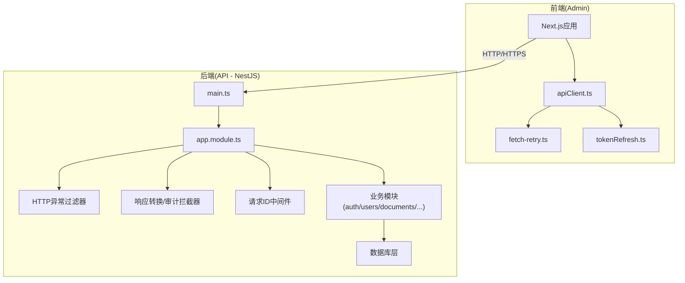
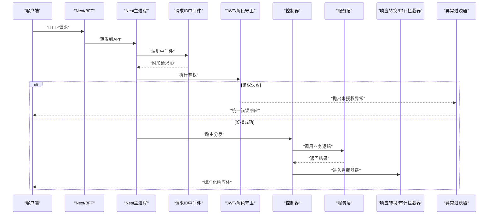
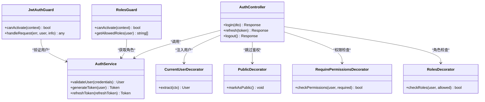
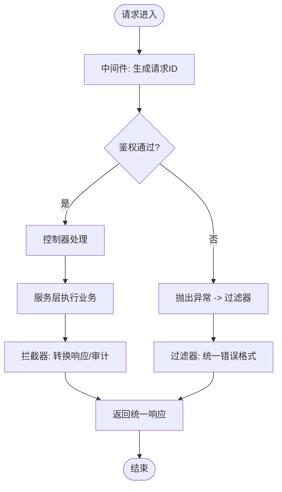
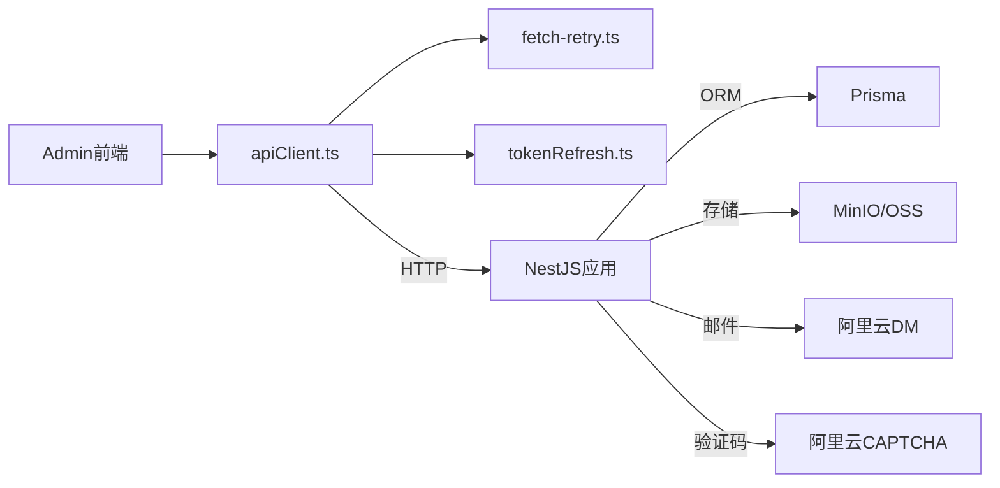

# API设计规范与模式

<cite>
**本文档引用的文件**   
- [main.ts](file://apps/api/src/main.ts)
- [app.module.ts](file://apps/api/src/app.module.ts)
- [http-exception.filter.ts](file://apps/api/src/common/filters/http-exception.filter.ts)
- [transform.interceptor.ts](file://apps/api/src/common/interceptors/transform.interceptor.ts)
- [audit.interceptor.ts](file://apps/api/src/common/interceptors/audit.interceptor.ts)
- [request-id.middleware.ts](file://apps/api/src/common/middleware/request-id.middleware.ts)
- [env.validation.ts](file://apps/api/src/config/env.validation.ts)
- [auth.controller.ts](file://apps/api/src/auth/auth.controller.ts)
- [auth.service.ts](file://apps/api/src/auth/auth.service.ts)
- [jwt-auth.guard.ts](file://apps/api/src/auth/guards/jwt-auth.guard.ts)
- [roles.guard.ts](file://apps/api/src/auth/guards/roles.guard.ts)
- [current-user.decorator.ts](file://apps/api/src/auth/decorators/current-user.decorator.ts)
- [public.decorator.ts](file://apps/api/src/auth/decorators/public.decorator.ts)
- [require-permissions.decorator.ts](file://apps/api/src/auth/decorators/require-permissions.decorator.ts)
- [roles.decorator.ts](file://apps/api/src/auth/decorators/roles.decorator.ts)
- [auth.dto.ts](file://apps/api/src/auth/dto/auth.dto.ts)
- [profile.dto.ts](file://apps/api/src/auth/dto/profile.dto.ts)
- [password.validator.ts](file://apps/api/src/common/validators/password.validator.ts)
- [apiClient.ts](file://apps/admin/src/lib/apiClient.ts)
- [fetch-retry.ts](file://apps/admin/src/lib/fetch-retry.ts)
- [tokenRefresh.ts](file://apps/admin/src/lib/tokenRefresh.ts)
- [README.md](file://docs/api/README.md)
</cite>

## 目录
1. [引言](#引言)
2. [项目结构](#项目结构)
3. [核心组件](#核心组件)
4. [架构总览](#架构总览)
5. [详细组件分析](#详细组件分析)
6. [依赖关系分析](#依赖关系分析)
7. [性能考量](#性能考量)
8. [故障排查指南](#故障排查指南)
9. [结论](#结论)
10. [附录](#附录)

## 引言
本规范面向API开发团队，统一RESTful API设计原则、路由规范、响应格式标准，以及DTO验证、参数校验、错误处理机制。同时涵盖API版本控制、文档生成与测试策略，并说明请求拦截、响应转换和全局异常处理的实现方式，为前后端协作提供一致的设计标准与最佳实践。

## 项目结构
后端采用NestJS模块化架构，按领域划分模块（如auth、users、documents等），公共能力集中在common目录（过滤器、拦截器、中间件、管道、校验器等）。前端通过Next.js的API路由或BFF代理访问后端服务。

**图表来源** 
- [main.ts](file://apps/api/src/main.ts)
- [app.module.ts](file://apps/api/src/app.module.ts)
- [http-exception.filter.ts](file://apps/api/src/common/filters/http-exception.filter.ts)
- [transform.interceptor.ts](file://apps/api/src/common/interceptors/transform.interceptor.ts)
- [audit.interceptor.ts](file://apps/api/src/common/interceptors/audit.interceptor.ts)
- [request-id.middleware.ts](file://apps/api/src/common/middleware/request-id.middleware.ts)

**章节来源**
- [main.ts](file://apps/api/src/main.ts)
- [app.module.ts](file://apps/api/src/app.module.ts)

## 核心组件
- 全局异常过滤器：统一捕获并格式化异常，输出一致的错误响应结构。
- 响应转换拦截器：对成功响应进行标准化包装，确保字段命名与分页结构一致。
- 审计拦截器：记录关键操作日志，便于追踪与合规。
- 请求ID中间件：为每个请求分配唯一ID，贯穿日志链路。
- 配置与环境校验：集中管理环境变量，启动时校验必要配置。
- 认证与授权：基于JWT的鉴权流程，结合角色与权限装饰器与守卫。
- DTO与校验：使用DTO定义输入模型，配合校验器保证数据合法性。

**章节来源**
- [http-exception.filter.ts](file://apps/api/src/common/filters/http-exception.filter.ts)
- [transform.interceptor.ts](file://apps/api/src/common/interceptors/transform.interceptor.ts)
- [audit.interceptor.ts](file://apps/api/src/common/interceptors/audit.interceptor.ts)
- [request-id.middleware.ts](file://apps/api/src/common/middleware/request-id.middleware.ts)
- [env.validation.ts](file://apps/api/src/config/env.validation.ts)
- [auth.controller.ts](file://apps/api/src/auth/auth.controller.ts)
- [auth.service.ts](file://apps/api/src/auth/auth.service.ts)
- [jwt-auth.guard.ts](file://apps/api/src/auth/guards/jwt-auth.guard.ts)
- [roles.guard.ts](file://apps/api/src/auth/guards/roles.guard.ts)
- [current-user.decorator.ts](file://apps/api/src/auth/decorators/current-user.decorator.ts)
- [public.decorator.ts](file://apps/api/src/auth/decorators/public.decorator.ts)
- [require-permissions.decorator.ts](file://apps/api/src/auth/decorators/require-permissions.decorator.ts)
- [roles.decorator.ts](file://apps/api/src/auth/decorators/roles.decorator.ts)
- [auth.dto.ts](file://apps/api/src/auth/dto/auth.dto.ts)
- [profile.dto.ts](file://apps/api/src/auth/dto/profile.dto.ts)
- [password.validator.ts](file://apps/api/src/common/validators/password.validator.ts)

## 架构总览
整体请求生命周期如下：客户端发起请求 → 中间件注入请求ID → 控制器接收 → 守卫鉴权 → 服务层处理 → 拦截器转换响应 → 过滤器兜底异常 → 返回统一响应体。

**图表来源** 
- [main.ts](file://apps/api/src/main.ts)
- [request-id.middleware.ts](file://apps/api/src/common/middleware/request-id.middleware.ts)
- [jwt-auth.guard.ts](file://apps/api/src/auth/guards/jwt-auth.guard.ts)
- [roles.guard.ts](file://apps/api/src/auth/guards/roles.guard.ts)
- [auth.controller.ts](file://apps/api/src/auth/auth.controller.ts)
- [auth.service.ts](file://apps/api/src/auth/auth.service.ts)
- [transform.interceptor.ts](file://apps/api/src/common/interceptors/transform.interceptor.ts)
- [audit.interceptor.ts](file://apps/api/src/common/interceptors/audit.interceptor.ts)
- [http-exception.filter.ts](file://apps/api/src/common/filters/http-exception.filter.ts)

## 详细组件分析

### RESTful设计与路由规范
- 资源命名：使用名词复数形式，避免动词；路径层级不超过三层。
- HTTP方法：GET读取、POST创建、PUT完整更新、PATCH部分更新、DELETE删除。
- 查询参数：支持分页（page、pageSize）、排序（sort、order）、过滤（field=value）。
- 状态码：遵循HTTP语义，成功2xx，客户端错误4xx，服务端错误5xx。
- 版本控制：建议URL前缀或Header版本控制（如/v1/...），保持向后兼容。

**章节来源**
- [README.md](file://docs/api/README.md)

### 响应格式标准
- 成功响应：包含data、meta（分页信息）、links（可选）等字段。
- 错误响应：包含code、message、details（可选）、traceId（请求ID）。
- 列表响应：统一分页结构，包含total、page、pageSize、items。
- 时间戳：统一ISO8601格式。
- 空值处理：明确null与缺失字段的语义。

**章节来源**
- [transform.interceptor.ts](file://apps/api/src/common/interceptors/transform.interceptor.ts)

### DTO验证模式与参数校验
- DTO定义：使用类+装饰器声明字段类型、必填、长度、范围等约束。
- 校验器：自定义校验器（如密码复杂度）与内置校验器组合使用。
- 管道：在控制器参数上启用ValidationPipe，自动校验并返回结构化错误。
- 错误聚合：收集所有字段级错误，便于前端提示。

**章节来源**
- [auth.dto.ts](file://apps/api/src/auth/dto/auth.dto.ts)
- [profile.dto.ts](file://apps/api/src/auth/dto/profile.dto.ts)
- [password.validator.ts](file://apps/api/src/common/validators/password.validator.ts)

### 认证与授权
- JWT鉴权：登录成功后签发令牌，后续请求携带Authorization头。
- 守卫：JwtAuthGuard校验令牌有效性，RolesGuard校验角色权限。
- 装饰器：@CurrentUser注入当前用户上下文，@Public跳过鉴权，@RequirePermissions/@Roles细粒度控制。
- 刷新令牌：前端在过期前刷新，避免中断用户体验。

**图表来源** 
- [jwt-auth.guard.ts](file://apps/api/src/auth/guards/jwt-auth.guard.ts)
- [roles.guard.ts](file://apps/api/src/auth/guards/roles.guard.ts)
- [auth.controller.ts](file://apps/api/src/auth/auth.controller.ts)
- [auth.service.ts](file://apps/api/src/auth/auth.service.ts)
- [current-user.decorator.ts](file://apps/api/src/auth/decorators/current-user.decorator.ts)
- [public.decorator.ts](file://apps/api/src/auth/decorators/public.decorator.ts)
- [require-permissions.decorator.ts](file://apps/api/src/auth/decorators/require-permissions.decorator.ts)
- [roles.decorator.ts](file://apps/api/src/auth/decorators/roles.decorator.ts)

### 请求拦截、响应转换与全局异常处理
- 请求拦截：中间件注入请求ID，审计拦截器记录关键操作。
- 响应转换：统一包装成功响应，添加元数据与链接。
- 全局异常：过滤器捕获所有异常，转换为标准错误结构，附带traceId。

**图表来源** 
- [request-id.middleware.ts](file://apps/api/src/common/middleware/request-id.middleware.ts)
- [audit.interceptor.ts](file://apps/api/src/common/interceptors/audit.interceptor.ts)
- [transform.interceptor.ts](file://apps/api/src/common/interceptors/transform.interceptor.ts)
- [http-exception.filter.ts](file://apps/api/src/common/filters/http-exception.filter.ts)

### API版本控制
- URL版本化：/v1/resource，便于平滑升级与废弃旧版本。
- Header版本化：Accept-Version: v1，适合无侵入式演进。
- 兼容性策略：新增字段不破坏现有客户端，删除字段需提前弃用公告。

**章节来源**
- [README.md](file://docs/api/README.md)

### 文档生成
- OpenAPI/Swagger：在模块中启用Swagger插件，自动生成接口文档。
- 注解描述：使用装饰器标注接口说明、参数、响应模型。
- 在线调试：集成Swagger UI，便于联调与演示。

**章节来源**
- [README.md](file://docs/api/README.md)

### 测试策略
- 单元测试：针对服务层与工具函数编写用例，覆盖边界条件。
- 集成测试：模拟数据库与外部依赖，验证端到端流程。
- E2E测试：使用真实环境或容器化环境，验证接口契约。
- 契约测试：前后端共享DTO定义，确保数据结构一致性。

**章节来源**
- [README.md](file://docs/api/README.md)

## 依赖关系分析
- 前端依赖：apiClient封装HTTP请求，retry重试机制，tokenRefresh自动刷新令牌。
- 后端依赖：NestJS核心模块、Prisma ORM、JWT库、校验库（class-validator/class-transformer）。
- 外部依赖：存储（MinIO/OSS）、邮件（阿里云DM）、验证码（阿里云CAPTCHA）。

**图表来源** 
- [apiClient.ts](file://apps/admin/src/lib/apiClient.ts)
- [fetch-retry.ts](file://apps/admin/src/lib/fetch-retry.ts)
- [tokenRefresh.ts](file://apps/admin/src/lib/tokenRefresh.ts)

**章节来源**
- [apiClient.ts](file://apps/admin/src/lib/apiClient.ts)
- [fetch-retry.ts](file://apps/admin/src/lib/fetch-retry.ts)
- [tokenRefresh.ts](file://apps/admin/src/lib/tokenRefresh.ts)

## 性能考量
- 连接池：合理配置数据库连接池大小，避免连接耗尽。
- 缓存策略：热点数据使用Redis缓存，减少数据库压力。
- 异步处理：耗时操作使用队列或异步任务，提升响应速度。
- 压缩传输：启用Gzip/Brotli压缩，减少带宽消耗。
- 静态资源：CDN加速，浏览器缓存优化。

[本节为通用指导，无需特定文件引用]

## 故障排查指南
- 查看请求ID：通过traceId定位日志，快速关联上下游问题。
- 检查鉴权：确认JWT令牌有效性与权限配置。
- 验证DTO：检查输入参数是否符合校验规则。
- 监控异常：关注全局异常过滤器输出的错误结构。
- 网络重试：前端重试机制是否生效，避免瞬时失败影响体验。

**章节来源**
- [http-exception.filter.ts](file://apps/api/src/common/filters/http-exception.filter.ts)
- [jwt-auth.guard.ts](file://apps/api/src/auth/guards/jwt-auth.guard.ts)
- [auth.dto.ts](file://apps/api/src/auth/dto/auth.dto.ts)
- [fetch-retry.ts](file://apps/admin/src/lib/fetch-retry.ts)

## 结论
本规范定义了统一的API设计原则与实现模式，涵盖RESTful路由、响应格式、DTO验证、认证授权、拦截转换、异常处理、版本控制、文档与测试等方面。遵循这些标准可提升代码质量、团队协作效率与系统可维护性。

[本节为总结性内容，无需特定文件引用]

## 附录
- 最佳实践清单：
  - 始终使用DTO进行输入验证
  - 统一响应结构与错误格式
  - 启用全局异常处理与日志追踪
  - 实施严格的鉴权与授权策略
  - 保持API版本兼容性与文档同步
  - 完善测试覆盖率与自动化流水线

[本节为补充信息，无需特定文件引用]