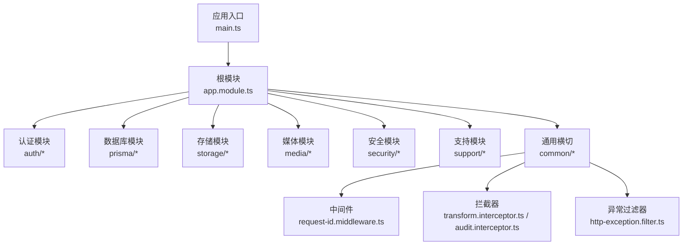
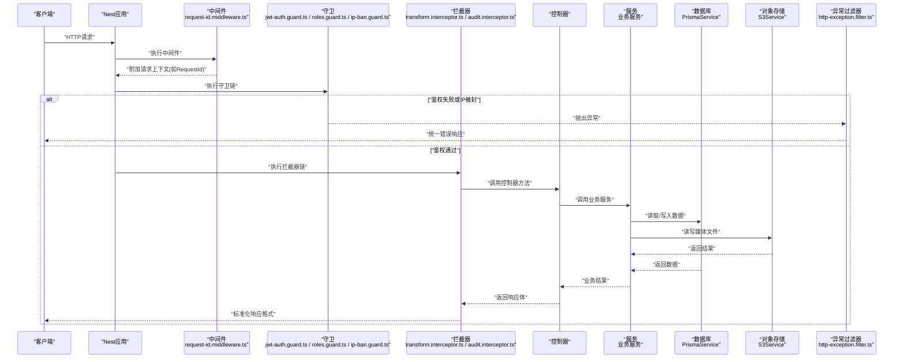
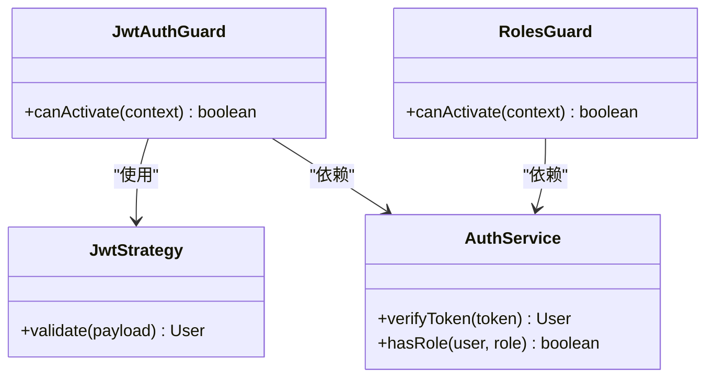
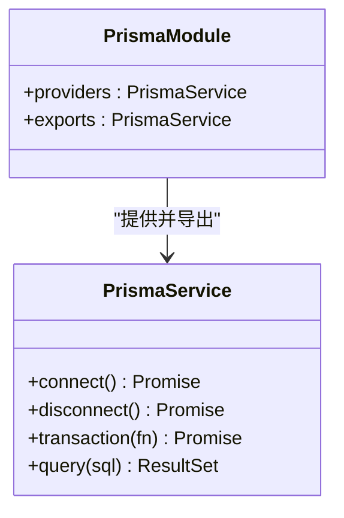
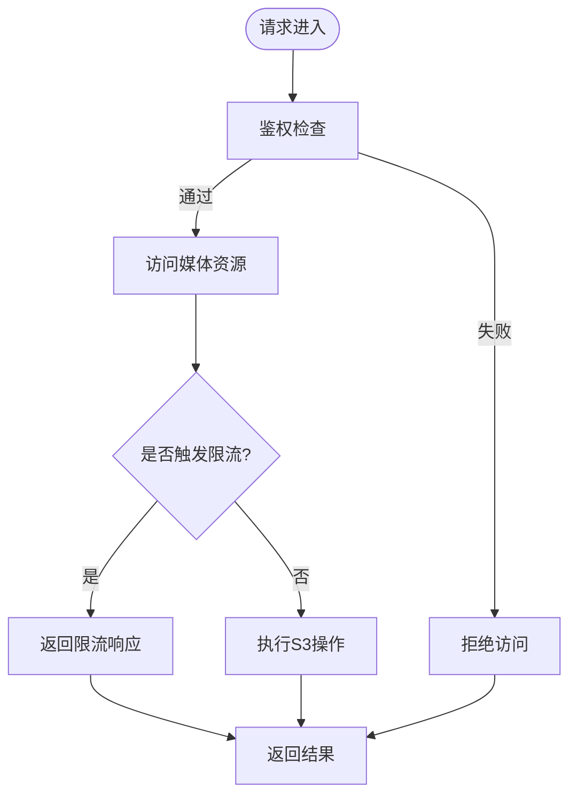
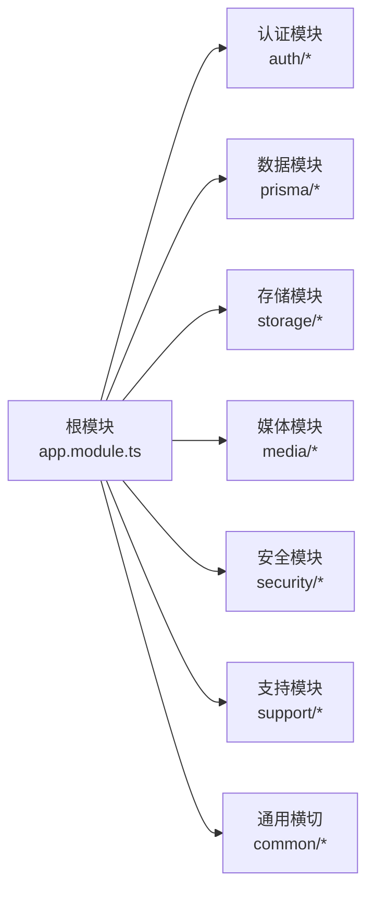

# NestJS核心架构

<cite>
**本文引用的文件**   
- [apps/api/src/app.module.ts](file://apps/api/src/app.module.ts)
- [apps/api/src/main.ts](file://apps/api/src/main.ts)
- [apps/api/src/config/env.validation.ts](file://apps/api/src/config/env.validation.ts)
- [apps/api/src/common/middleware/request-id.middleware.ts](file://apps/api/src/common/middleware/request-id.middleware.ts)
- [apps/api/src/common/interceptors/transform.interceptor.ts](file://apps/api/src/common/interceptors/transform.interceptor.ts)
- [apps/api/src/common/interceptors/audit.interceptor.ts](file://apps/api/src/common/interceptors/audit.interceptor.ts)
- [apps/api/src/common/filters/http-exception.filter.ts](file://apps/api/src/common/filters/http-exception.filter.ts)
- [apps/api/src/auth/guards/jwt-auth.guard.ts](file://apps/api/src/auth/guards/jwt-auth.guard.ts)
- [apps/api/src/auth/guards/roles.guard.ts](file://apps/api/src/auth/guards/roles.guard.ts)
- [apps/api/src/auth/strategies/jwt.strategy.ts](file://apps/api/src/auth/strategies/jwt.strategy.ts)
- [apps/api/src/prisma/prisma.service.ts](file://apps/api/src/prisma/prisma.service.ts)
- [apps/api/src/prisma/prisma.module.ts](file://apps/api/src/prisma/prisma.module.ts)
- [apps/api/src/storage/s3.service.ts](file://apps/api/src/storage/s3.service.ts)
- [apps/api/src/storage/storage.module.ts](file://apps/api/src/storage/storage.module.ts)
- [apps/api/src/media/media-guard.service.ts](file://apps/api/src/media/media-guard.service.ts)
- [apps/api/src/security/ip-ban.guard.ts](file://apps/api/src/security/ip-ban.guard.ts)
- [apps/api/src/support/chat.gateway.ts](file://apps/api/src/support/chat.gateway.ts)
</cite>

## 目录
1. [简介](#简介)
2. [项目结构](#项目结构)
3. [核心组件](#核心组件)
4. [架构总览](#架构总览)
5. [详细组件分析](#详细组件分析)
6. [依赖关系分析](#依赖关系分析)
7. [性能考量](#性能考量)
8. [故障排查指南](#故障排查指南)
9. [结论](#结论)
10. [附录](#附录)

## 简介
本文件面向NestJS后端应用（位于 apps/api），系统性阐述模块化组织、依赖注入容器配置与生命周期管理，解释模块间依赖与共享服务设计模式，并深入说明中间件管道、拦截器、守卫和管道的实现机制。同时覆盖环境变量校验、日志记录与错误处理策略，提供最佳实践与扩展指南，帮助开发者高效构建可维护、可扩展的API服务。

## 项目结构
该NestJS应用采用按功能域划分的模块化结构：
- 应用入口与全局配置：main.ts、app.module.ts
- 环境配置与校验：config/env.validation.ts
- 通用横切能力：common/middleware、common/interceptors、common/filters
- 认证授权：auth（guards、strategies、decorators）
- 数据访问：prisma（PrismaService与PrismaModule）
- 存储与媒体：storage（S3）、media（守卫与服务）
- 安全控制：security（IP封禁等）
- 实时通信：support（WebSocket Gateway）

图表来源
- [apps/api/src/main.ts](file://apps/api/src/main.ts)
- [apps/api/src/app.module.ts](file://apps/api/src/app.module.ts)
- [apps/api/src/common/middleware/request-id.middleware.ts](file://apps/api/src/common/middleware/request-id.middleware.ts)
- [apps/api/src/common/interceptors/transform.interceptor.ts](file://apps/api/src/common/interceptors/transform.interceptor.ts)
- [apps/api/src/common/interceptors/audit.interceptor.ts](file://apps/api/src/common/interceptors/audit.interceptor.ts)
- [apps/api/src/common/filters/http-exception.filter.ts](file://apps/api/src/common/filters/http-exception.filter.ts)

章节来源
- [apps/api/src/main.ts](file://apps/api/src/main.ts)
- [apps/api/src/app.module.ts](file://apps/api/src/app.module.ts)

## 核心组件
- 应用启动与全局配置
  - main.ts负责创建Nest应用实例、注册全局中间件、监听端口、加载环境变量与验证。
  - app.module.ts作为根模块聚合各业务模块与共享服务，定义全局拦截器、过滤器、守卫等。
- 环境变量与校验
  - config/env.validation.ts集中定义环境变量校验规则，确保运行时配置安全可用。
- 数据访问层
  - prisma.service.ts封装Prisma客户端，提供单例服务；prisma.module.ts暴露为可注入模块。
- 存储与媒体
  - storage模块通过s3.service.ts抽象对象存储操作；media模块提供媒体访问控制与水印等服务。
- 认证与授权
  - auth模块包含JWT策略、守卫与角色权限控制，结合装饰器实现细粒度鉴权。
- 安全控制
  - security模块提供IP封禁等防护能力，通过守卫在请求早期拦截非法访问。
- 实时通信
  - support模块基于Gateway实现WebSocket通信，用于聊天与会话状态同步。

章节来源
- [apps/api/src/main.ts](file://apps/api/src/main.ts)
- [apps/api/src/app.module.ts](file://apps/api/src/app.module.ts)
- [apps/api/src/config/env.validation.ts](file://apps/api/src/config/env.validation.ts)
- [apps/api/src/prisma/prisma.service.ts](file://apps/api/src/prisma/prisma.service.ts)
- [apps/api/src/prisma/prisma.module.ts](file://apps/api/src/prisma/prisma.module.ts)
- [apps/api/src/storage/s3.service.ts](file://apps/api/src/storage/s3.service.ts)
- [apps/api/src/storage/storage.module.ts](file://apps/api/src/storage/storage.module.ts)
- [apps/api/src/media/media-guard.service.ts](file://apps/api/src/media/media-guard.service.ts)
- [apps/api/src/auth/guards/jwt-auth.guard.ts](file://apps/api/src/auth/guards/jwt-auth.guard.ts)
- [apps/api/src/auth/guards/roles.guard.ts](file://apps/api/src/auth/guards/roles.guard.ts)
- [apps/api/src/auth/strategies/jwt.strategy.ts](file://apps/api/src/auth/strategies/jwt.strategy.ts)
- [apps/api/src/security/ip-ban.guard.ts](file://apps/api/src/security/ip-ban.guard.ts)
- [apps/api/src/support/chat.gateway.ts](file://apps/api/src/support/chat.gateway.ts)

## 架构总览
下图展示从HTTP请求进入Nest应用到控制器处理的完整流程，包括中间件、守卫、拦截器、控制器与异常过滤器的协作关系。

图表来源
- [apps/api/src/main.ts](file://apps/api/src/main.ts)
- [apps/api/src/common/middleware/request-id.middleware.ts](file://apps/api/src/common/middleware/request-id.middleware.ts)
- [apps/api/src/auth/guards/jwt-auth.guard.ts](file://apps/api/src/auth/guards/jwt-auth.guard.ts)
- [apps/api/src/auth/guards/roles.guard.ts](file://apps/api/src/auth/guards/roles.guard.ts)
- [apps/api/src/security/ip-ban.guard.ts](file://apps/api/src/security/ip-ban.guard.ts)
- [apps/api/src/common/interceptors/transform.interceptor.ts](file://apps/api/src/common/interceptors/transform.interceptor.ts)
- [apps/api/src/common/interceptors/audit.interceptor.ts](file://apps/api/src/common/interceptors/audit.interceptor.ts)
- [apps/api/src/common/filters/http-exception.filter.ts](file://apps/api/src/common/filters/http-exception.filter.ts)
- [apps/api/src/prisma/prisma.service.ts](file://apps/api/src/prisma/prisma.service.ts)
- [apps/api/src/storage/s3.service.ts](file://apps/api/src/storage/s3.service.ts)

## 详细组件分析

### 应用启动与全局配置
- main.ts
  - 初始化Nest应用，加载环境变量，启用全局中间件、拦截器、过滤器，设置CORS与静态资源，监听端口。
  - 建议将跨域、超时、压缩等全局选项集中配置，便于环境与部署差异化管理。
- app.module.ts
  - 聚合业务模块与共享服务，注册全局拦截器、过滤器、守卫，声明模块依赖。
  - 推荐将横切关注点（日志、审计、转换、异常）以全局方式注册，减少重复配置。

章节来源
- [apps/api/src/main.ts](file://apps/api/src/main.ts)
- [apps/api/src/app.module.ts](file://apps/api/src/app.module.ts)

### 环境变量配置与校验
- config/env.validation.ts
  - 定义环境变量校验规则，确保必需变量存在且类型正确，避免运行期崩溃。
  - 建议在模块初始化前完成校验，并在测试环境中提供默认值或Mock。

章节来源
- [apps/api/src/config/env.validation.ts](file://apps/api/src/config/env.validation.ts)

### 中间件管道
- request-id.middleware.ts
  - 为每个请求生成唯一ID并附加到请求上下文，便于链路追踪与日志关联。
  - 中间件应在应用启动时全局注册，保证所有路由均具备追踪能力。

章节来源
- [apps/api/src/common/middleware/request-id.middleware.ts](file://apps/api/src/common/middleware/request-id.middleware.ts)

### 拦截器
- transform.interceptor.ts
  - 统一包装控制器返回值，规范化响应结构（如code、data、message）。
  - 适合在根模块中全局注册，减少控制器样板代码。
- audit.interceptor.ts
  - 记录关键操作的审计信息（如用户、动作、时间戳、资源标识）。
  - 可与请求ID结合，形成完整的审计轨迹。

章节来源
- [apps/api/src/common/interceptors/transform.interceptor.ts](file://apps/api/src/common/interceptors/transform.interceptor.ts)
- [apps/api/src/common/interceptors/audit.interceptor.ts](file://apps/api/src/common/interceptors/audit.interceptor.ts)

### 异常过滤器
- http-exception.filter.ts
  - 捕获并统一格式化异常响应，区分业务异常与系统异常，输出一致的错误结构。
  - 建议根据异常类型设置不同HTTP状态码，并记录详细堆栈至服务端日志。

章节来源
- [apps/api/src/common/filters/http-exception.filter.ts](file://apps/api/src/common/filters/http-exception.filter.ts)

### 认证与授权
- jwt.strategy.ts
  - 解析JWT令牌，提取用户身份并挂载到请求上下文。
- jwt-auth.guard.ts
  - 校验令牌有效性，拒绝未认证请求。
- roles.guard.ts
  - 基于角色的访问控制，结合装饰器实现细粒度权限检查。

图表来源
- [apps/api/src/auth/strategies/jwt.strategy.ts](file://apps/api/src/auth/strategies/jwt.strategy.ts)
- [apps/api/src/auth/guards/jwt-auth.guard.ts](file://apps/api/src/auth/guards/jwt-auth.guard.ts)
- [apps/api/src/auth/guards/roles.guard.ts](file://apps/api/src/auth/guards/roles.guard.ts)

章节来源
- [apps/api/src/auth/strategies/jwt.strategy.ts](file://apps/api/src/auth/strategies/jwt.strategy.ts)
- [apps/api/src/auth/guards/jwt-auth.guard.ts](file://apps/api/src/auth/guards/jwt-auth.guard.ts)
- [apps/api/src/auth/guards/roles.guard.ts](file://apps/api/src/auth/guards/roles.guard.ts)

### 数据访问层（Prisma）
- prisma.service.ts
  - 封装Prisma客户端，提供连接池、事务、查询优化等能力。
- prisma.module.ts
  - 将PrismaService暴露为可注入模块，供业务服务按需使用。

图表来源
- [apps/api/src/prisma/prisma.service.ts](file://apps/api/src/prisma/prisma.service.ts)
- [apps/api/src/prisma/prisma.module.ts](file://apps/api/src/prisma/prisma.module.ts)

章节来源
- [apps/api/src/prisma/prisma.service.ts](file://apps/api/src/prisma/prisma.service.ts)
- [apps/api/src/prisma/prisma.module.ts](file://apps/api/src/prisma/prisma.module.ts)

### 存储与媒体
- s3.service.ts
  - 抽象对象存储操作（上传、下载、删除、URL生成），屏蔽底层SDK差异。
- media-guard.service.ts
  - 对媒体访问进行鉴权与限流，防止未授权访问与滥用。

图表来源
- [apps/api/src/storage/s3.service.ts](file://apps/api/src/storage/s3.service.ts)
- [apps/api/src/media/media-guard.service.ts](file://apps/api/src/media/media-guard.service.ts)

章节来源
- [apps/api/src/storage/s3.service.ts](file://apps/api/src/storage/s3.service.ts)
- [apps/api/src/media/media-guard.service.ts](file://apps/api/src/media/media-guard.service.ts)

### 安全控制（IP封禁）
- ip-ban.guard.ts
  - 在请求早期检查客户端IP是否在封禁列表中，快速拒绝恶意流量。
  - 建议结合缓存（如Redis）提升查询性能。

章节来源
- [apps/api/src/security/ip-ban.guard.ts](file://apps/api/src/security/ip-ban.guard.ts)

### 实时通信（WebSocket）
- chat.gateway.ts
  - 基于Gateway实现WebSocket通信，处理连接、消息广播、在线状态等。
  - 建议与认证守卫集成，确保仅合法用户建立连接。

章节来源
- [apps/api/src/support/chat.gateway.ts](file://apps/api/src/support/chat.gateway.ts)

## 依赖关系分析
下图展示根模块与各子模块之间的依赖关系，体现高内聚、低耦合的模块化设计。

图表来源
- [apps/api/src/app.module.ts](file://apps/api/src/app.module.ts)

章节来源
- [apps/api/src/app.module.ts](file://apps/api/src/app.module.ts)

## 性能考量
- 连接池与复用
  - 数据库连接池应合理配置最大连接数与空闲超时，避免连接泄漏。
- 缓存策略
  - 高频读数据（如配置、字典、地理位置）建议使用内存缓存或Redis，降低数据库压力。
- 异步与并发
  - 长耗时任务（如文件处理、邮件发送）应放入队列异步执行，避免阻塞请求线程。
- 响应体积
  - 启用Gzip/Brotli压缩，分页与字段裁剪减少响应大小。
- 监控与指标
  - 采集关键指标（QPS、延迟、错误率、连接池使用率），配合APM工具定位瓶颈。

[本节为通用指导，不直接分析具体文件]

## 故障排查指南
- 常见异常分类
  - 业务异常：参数校验失败、权限不足、资源不存在等，应返回明确的用户可读错误。
  - 系统异常：数据库连接失败、外部服务超时等，应记录详细堆栈并告警。
- 日志记录
  - 使用请求ID串联全链路日志，区分INFO/WARN/ERROR级别，避免敏感信息泄露。
- 健康检查
  - 提供健康检查端点，集成探针与自动重启策略，保障服务可用性。
- 回滚与降级
  - 对外部依赖（如S3、第三方API）实现熔断与降级，避免雪崩效应。

章节来源
- [apps/api/src/common/filters/http-exception.filter.ts](file://apps/api/src/common/filters/http-exception.filter.ts)

## 结论
本NestJS应用通过清晰的模块化设计与横切能力抽象，实现了高内聚、低耦合、易扩展的架构。依赖注入容器统一管理生命周期，中间件、拦截器、守卫与过滤器协同工作，保障请求处理的一致性与安全性。结合环境变量校验、统一异常处理与日志追踪，为生产环境的稳定运行提供了坚实基础。建议持续优化缓存、异步化与监控体系，进一步提升性能与可观测性。

[本节为总结性内容，不直接分析具体文件]

## 附录
- 最佳实践清单
  - 模块职责单一，避免跨模块强耦合。
  - 共享服务通过模块导出，限制作用域。
  - 环境变量集中校验，测试环境提供Mock。
  - 统一响应格式与错误结构，前端友好。
  - 关键路径添加审计与监控。
- 扩展指南
  - 新增功能优先新建模块，遵循领域边界。
  - 横切能力通过拦截器/守卫/过滤器复用。
  - 外部依赖通过适配器模式隔离，便于替换。

[本节为通用指导，不直接分析具体文件]