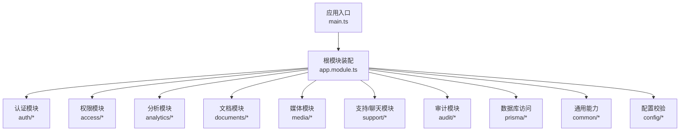
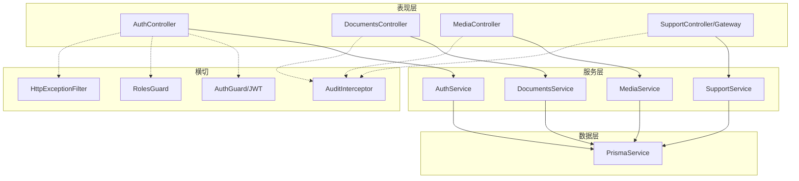
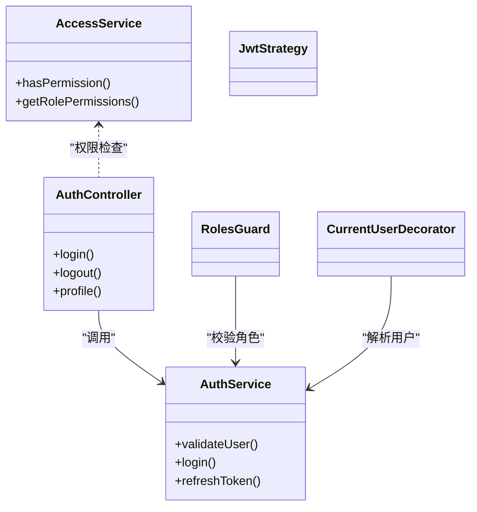
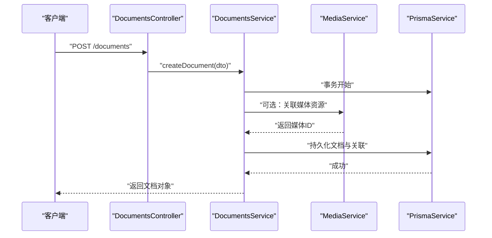
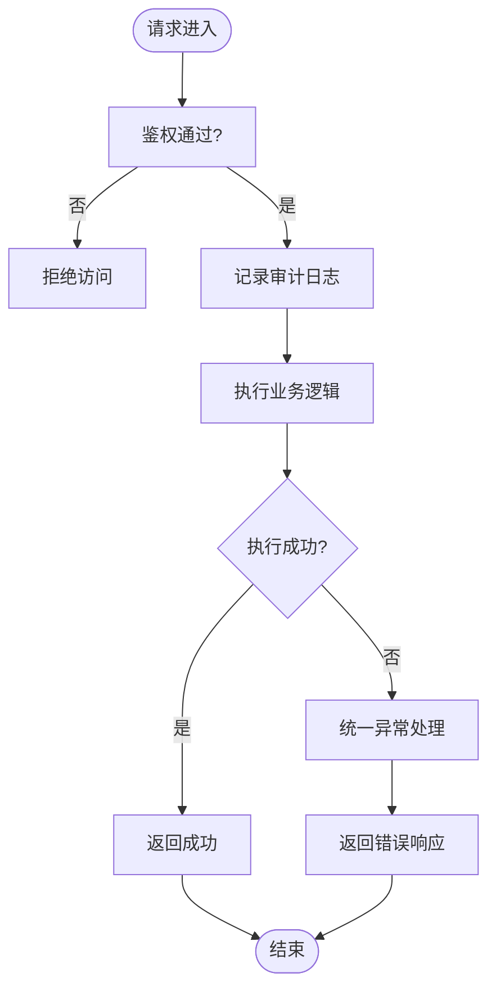
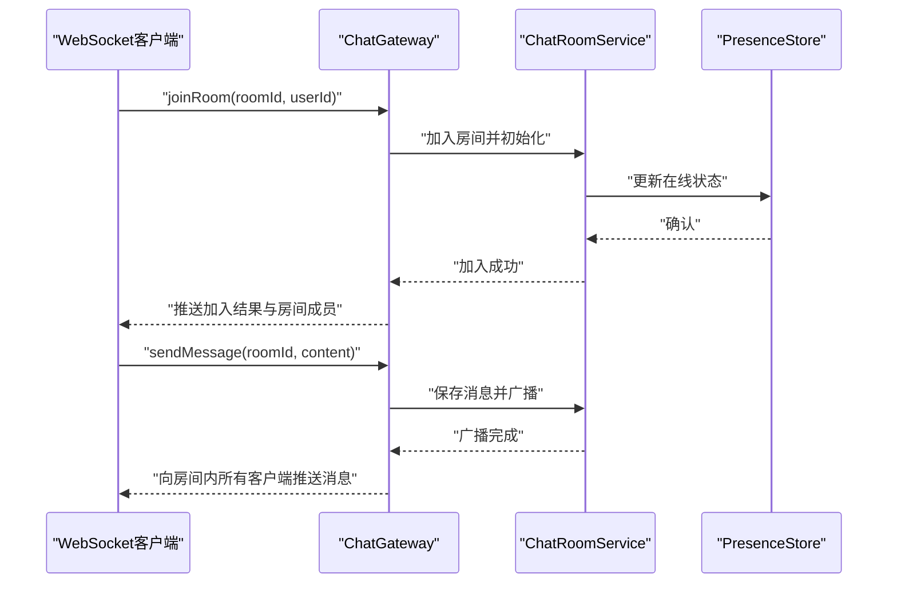
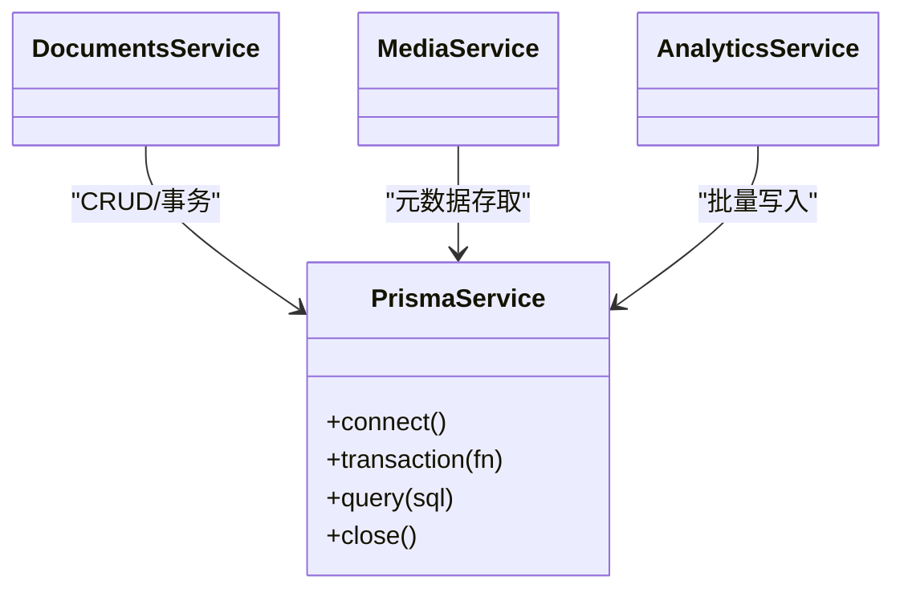
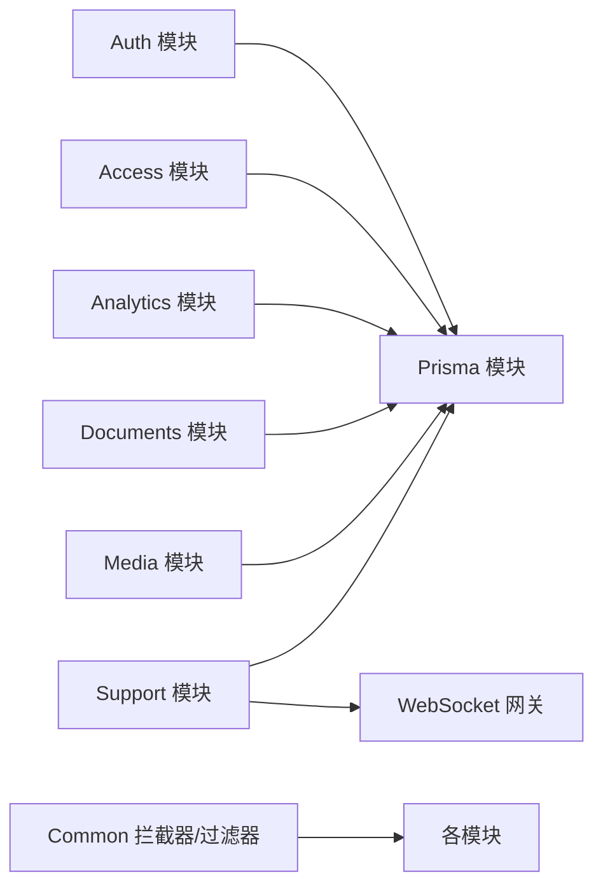
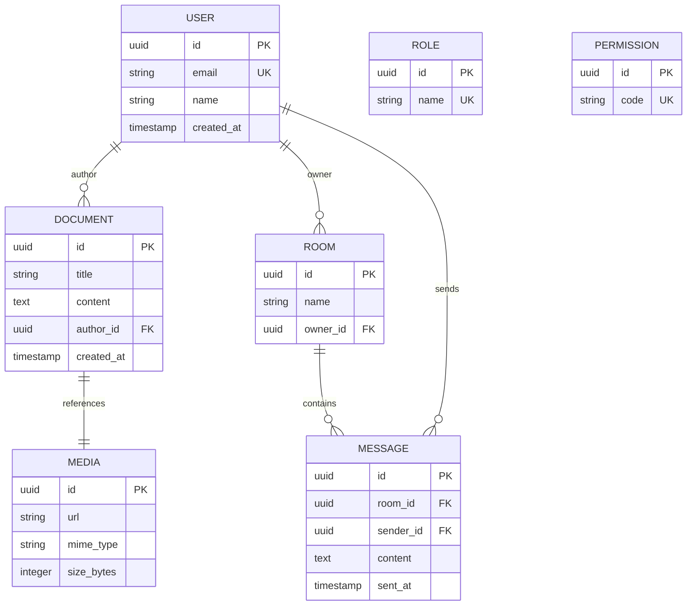

# 业务模块架构

<cite>
**本文引用的文件**   
- [apps/api/src/app.module.ts](file://apps/api/src/app.module.ts)
- [apps/api/src/main.ts](file://apps/api/src/main.ts)
- [apps/api/src/auth/auth.module.ts](file://apps/api/src/auth/auth.module.ts)
- [apps/api/src/auth/auth.controller.ts](file://apps/api/src/auth/auth.controller.ts)
- [apps/api/src/auth/auth.service.ts](file://apps/api/src/auth/auth.service.ts)
- [apps/api/src/access/access.module.ts](file://apps/api/src/access/access.module.ts)
- [apps/api/src/access/access.service.ts](file://apps/api/src/access/access.service.ts)
- [apps/api/src/analytics/analytics.module.ts](file://apps/api/src/analytics/analytics.module.ts)
- [apps/api/src/analytics/analytics.controller.ts](file://apps/api/src/analytics/analytics.controller.ts)
- [apps/api/src/analytics/analytics.service.ts](file://apps/api/src/analytics/analytics.service.ts)
- [apps/api/src/documents/documents.module.ts](file://apps/api/src/documents/documents.module.ts)
- [apps/api/src/documents/documents.controller.ts](file://apps/api/src/documents/documents.controller.ts)
- [apps/api/src/documents/documents.service.ts](file://apps/api/src/documents/documents.service.ts)
- [apps/api/src/prisma/prisma.module.ts](file://apps/api/src/prisma/prisma.module.ts)
- [apps/api/src/prisma/prisma.service.ts](file://apps/api/src/prisma/prisma.service.ts)
- [apps/api/src/media/media.module.ts](file://apps/api/src/media/media.module.ts)
- [apps/api/src/media/media.controller.ts](file://apps/api/src/media/media.controller.ts)
- [apps/api/src/media/media.service.ts](file://apps/api/src/media/media.service.ts)
- [apps/api/src/support/support.module.ts](file://apps/api/src/support/support.module.ts)
- [apps/api/src/support/chat.gateway.ts](file://apps/api/src/support/chat.gateway.ts)
- [apps/api/src/support/chat-room.service.ts](file://apps/api/src/support/chat-room.service.ts)
- [apps/api/src/support/chat-presence.store.ts](file://apps/api/src/support/chat-presence.store.ts)
- [apps/api/src/audit/audit.module.ts](file://apps/api/src/audit/audit.module.ts)
- [apps/api/src/audit/audit.controller.ts](file://apps/api/src/audit/audit.controller.ts)
- [apps/api/src/audit/audit.service.ts](file://apps/api/src/audit/audit.service.ts)
- [apps/api/src/common/interceptors/audit.interceptor.ts](file://apps/api/src/common/interceptors/audit.interceptor.ts)
- [apps/api/src/common/filters/http-exception.filter.ts](file://apps/api/src/common/filters/http-exception.filter.ts)
- [apps/api/src/config/env.validation.ts](file://apps/api/src/config/env.validation.ts)
- [apps/api/prisma/schema.prisma](file://apps/api/prisma/schema.prisma)
</cite>

## 目录
1. [简介](#简介)
2. [项目结构](#项目结构)
3. [核心组件](#核心组件)
4. [架构总览](#架构总览)
5. [详细组件分析](#详细组件分析)
6. [依赖分析](#依赖分析)
7. [性能考虑](#性能考虑)
8. [故障排查指南](#故障排查指南)
9. [结论](#结论)
10. [附录](#附录)

## 简介
本文件面向业务开发团队，系统化阐述后端 API（NestJS）的业务模块架构、服务层设计与领域模型。重点说明：
- 按领域划分的模块边界与职责
- 服务层编排与跨模块协作模式
- 事件驱动与消息传递机制（WebSocket 聊天与会话状态）
- 事务管理与数据一致性策略
- 鉴权与权限控制、审计与异常处理
- 扩展点与最佳实践，帮助快速迭代与稳定演进

## 项目结构
后端采用 NestJS 模块化组织，以“领域模块 + 公共基础设施”的方式解耦。关键入口与装配如下：
- 应用启动与全局配置：main.ts
- 根模块装配与模块注册：app.module.ts
- 各业务模块：auth、access、analytics、documents、media、support、audit 等
- 数据访问：Prisma 模块与服务
- 通用能力：拦截器、过滤器、中间件、校验与工具

图表来源
- [apps/api/src/main.ts](file://apps/api/src/main.ts)
- [apps/api/src/app.module.ts](file://apps/api/src/app.module.ts)

章节来源
- [apps/api/src/main.ts](file://apps/api/src/main.ts)
- [apps/api/src/app.module.ts](file://apps/api/src/app.module.ts)

## 核心组件
- 认证与授权
  - 认证模块提供登录、令牌签发与用户上下文注入；配合角色守卫与权限装饰器实现细粒度访问控制。
  - 权限模块维护角色与权限映射，供控制器与守卫使用。
- 内容管理
  - 文档模块负责文档、标签、文件夹与权限的 CRUD 与关联关系。
  - 媒体模块负责上传、访问控制与水印等增强能力。
- 分析与审计
  - 分析模块采集页面浏览、访客识别与地理信息。
  - 审计模块记录关键操作日志，并通过拦截器统一捕获。
- 实时通信
  - 支持模块基于 WebSocket 提供聊天室、消息收发与在线状态。
- 数据访问
  - Prisma 模块集中管理连接与事务，为各业务模块提供一致的数据访问能力。

章节来源
- [apps/api/src/auth/auth.module.ts](file://apps/api/src/auth/auth.module.ts)
- [apps/api/src/access/access.module.ts](file://apps/api/src/access/access.module.ts)
- [apps/api/src/analytics/analytics.module.ts](file://apps/api/src/analytics/analytics.module.ts)
- [apps/api/src/documents/documents.module.ts](file://apps/api/src/documents/documents.module.ts)
- [apps/api/src/media/media.module.ts](file://apps/api/src/media/media.module.ts)
- [apps/api/src/support/support.module.ts](file://apps/api/src/support/support.module.ts)
- [apps/api/src/prisma/prisma.module.ts](file://apps/api/src/prisma/prisma.module.ts)

## 架构总览
整体采用分层与模块化结合：
- 表现层：Controller 暴露 REST/WebSocket 接口
- 服务层：Service 封装领域逻辑、编排跨模块调用
- 数据层：Prisma Service 提供 ORM 访问与事务
- 横切关注点：鉴权、审计、异常、配置校验

图表来源
- [apps/api/src/auth/auth.controller.ts](file://apps/api/src/auth/auth.controller.ts)
- [apps/api/src/auth/auth.service.ts](file://apps/api/src/auth/auth.service.ts)
- [apps/api/src/documents/documents.controller.ts](file://apps/api/src/documents/documents.controller.ts)
- [apps/api/src/documents/documents.service.ts](file://apps/api/src/documents/documents.service.ts)
- [apps/api/src/media/media.controller.ts](file://apps/api/src/media/media.controller.ts)
- [apps/api/src/media/media.service.ts](file://apps/api/src/media/media.service.ts)
- [apps/api/src/support/chat.gateway.ts](file://apps/api/src/support/chat.gateway.ts)
- [apps/api/src/support/chat-room.service.ts](file://apps/api/src/support/chat-room.service.ts)
- [apps/api/src/prisma/prisma.service.ts](file://apps/api/src/prisma/prisma.service.ts)
- [apps/api/src/common/interceptors/audit.interceptor.ts](file://apps/api/src/common/interceptors/audit.interceptor.ts)
- [apps/api/src/common/filters/http-exception.filter.ts](file://apps/api/src/common/filters/http-exception.filter.ts)

## 详细组件分析

### 认证与授权模块（Auth & Access）
- 职责
  - 认证：登录、令牌签发、用户上下文注入
  - 授权：角色与权限校验、资源级访问控制
- 关键点
  - 通过 JWT 策略与守卫完成请求鉴权
  - 角色守卫与权限装饰器组合实现细粒度控制
  - 与审计模块联动记录登录/登出等安全事件

图表来源
- [apps/api/src/auth/auth.controller.ts](file://apps/api/src/auth/auth.controller.ts)
- [apps/api/src/auth/auth.service.ts](file://apps/api/src/auth/auth.service.ts)
- [apps/api/src/access/access.service.ts](file://apps/api/src/access/access.service.ts)

章节来源
- [apps/api/src/auth/auth.module.ts](file://apps/api/src/auth/auth.module.ts)
- [apps/api/src/access/access.module.ts](file://apps/api/src/access/access.module.ts)

### 文档与媒体模块（Documents & Media）
- 职责
  - 文档：文档、标签、文件夹、权限的增删改查与关联
  - 媒体：上传、下载、访问控制、水印等
- 关键点
  - 文档与媒体通过外键关联，保证引用完整性
  - 媒体访问受鉴权守卫保护，避免未授权访问
  - 文档权限服务支持细粒度访问控制

图表来源
- [apps/api/src/documents/documents.controller.ts](file://apps/api/src/documents/documents.controller.ts)
- [apps/api/src/documents/documents.service.ts](file://apps/api/src/documents/documents.service.ts)
- [apps/api/src/media/media.service.ts](file://apps/api/src/media/media.service.ts)
- [apps/api/src/prisma/prisma.service.ts](file://apps/api/src/prisma/prisma.service.ts)

章节来源
- [apps/api/src/documents/documents.module.ts](file://apps/api/src/documents/documents.module.ts)
- [apps/api/src/media/media.module.ts](file://apps/api/src/media/media.module.ts)

### 分析与审计模块（Analytics & Audit）
- 职责
  - 分析：收集页面浏览、访客识别、地理位置等
  - 审计：记录关键业务操作，便于追溯与合规
- 关键点
  - 分析接口轻量高吞吐，适合异步落库或队列
  - 审计通过拦截器统一捕获，减少侵入式代码

图表来源
- [apps/api/src/analytics/analytics.controller.ts](file://apps/api/src/analytics/analytics.controller.ts)
- [apps/api/src/audit/audit.controller.ts](file://apps/api/src/audit/audit.controller.ts)
- [apps/api/src/common/interceptors/audit.interceptor.ts](file://apps/api/src/common/interceptors/audit.interceptor.ts)
- [apps/api/src/common/filters/http-exception.filter.ts](file://apps/api/src/common/filters/http-exception.filter.ts)

章节来源
- [apps/api/src/analytics/analytics.module.ts](file://apps/api/src/analytics/analytics.module.ts)
- [apps/api/src/audit/audit.module.ts](file://apps/api/src/audit/audit.module.ts)

### 支持与聊天模块（Support & Chat）
- 职责
  - 聊天室：创建房间、加入/离开、消息广播
  - 在线状态：维护访客/代理在线列表
  - 消息搜索：按条件检索历史消息
- 关键点
  - 使用 WebSocket Gateway 进行双向通信
  - 在线状态存储于内存或外部缓存，保障低延迟
  - 与认证模块集成，确保会话身份可信

图表来源
- [apps/api/src/support/chat.gateway.ts](file://apps/api/src/support/chat.gateway.ts)
- [apps/api/src/support/chat-room.service.ts](file://apps/api/src/support/chat-room.service.ts)
- [apps/api/src/support/chat-presence.store.ts](file://apps/api/src/support/chat-presence.store.ts)

章节来源
- [apps/api/src/support/support.module.ts](file://apps/api/src/support/support.module.ts)

### 数据访问与事务（Prisma）
- 职责
  - 统一管理数据库连接、迁移与事务
  - 为各模块提供一致的查询与写入能力
- 关键点
  - 在复杂写操作中开启事务，保证原子性
  - 读写分离与连接池参数调优提升吞吐

图表来源
- [apps/api/src/prisma/prisma.service.ts](file://apps/api/src/prisma/prisma.service.ts)
- [apps/api/src/prisma/prisma.module.ts](file://apps/api/src/prisma/prisma.module.ts)

章节来源
- [apps/api/src/prisma/prisma.module.ts](file://apps/api/src/prisma/prisma.module.ts)
- [apps/api/src/prisma/prisma.service.ts](file://apps/api/src/prisma/prisma.service.ts)

## 依赖分析
- 模块耦合
  - Controller 仅依赖对应 Service，保持表现层简洁
  - Service 之间通过模块导入解耦，必要时通过事件总线或消息队列进一步弱化耦合
  - 鉴权与审计作为横切能力被多模块复用
- 外部依赖
  - Prisma 作为 ORM，屏蔽底层 SQL 差异
  - WebSocket 用于实时通信
  - 存储（如对象存储）用于媒体文件

图表来源
- [apps/api/src/app.module.ts](file://apps/api/src/app.module.ts)
- [apps/api/src/support/chat.gateway.ts](file://apps/api/src/support/chat.gateway.ts)
- [apps/api/src/common/interceptors/audit.interceptor.ts](file://apps/api/src/common/interceptors/audit.interceptor.ts)
- [apps/api/src/common/filters/http-exception.filter.ts](file://apps/api/src/common/filters/http-exception.filter.ts)

章节来源
- [apps/api/src/app.module.ts](file://apps/api/src/app.module.ts)

## 性能考虑
- 数据库
  - 合理使用索引与分页，避免全表扫描
  - 批量写入与事务合并，降低往返开销
- 缓存
  - 热点数据（如站点设置、权限表）可引入缓存层
  - 在线状态存储选择内存或 Redis，权衡一致性与扩展性
- 并发
  - WebSocket 连接数与广播范围需限流与去重
  - 分析数据写入建议异步化或入队
- 网络
  - 静态资源与媒体走 CDN/对象存储，减轻 API 压力
  - 合理设置超时与重试策略

## 故障排查指南
- 常见异常
  - 鉴权失败：检查 JWT 策略、令牌有效期与签名
  - 权限不足：核对角色与权限映射是否生效
  - 数据库错误：查看事务回滚与约束冲突
  - 实时通信：检查 WebSocket 握手与房间状态
- 定位手段
  - 启用审计日志与请求 ID 追踪
  - 统一异常过滤器输出结构化错误
  - 监控关键指标（QPS、延迟、错误率）

章节来源
- [apps/api/src/common/filters/http-exception.filter.ts](file://apps/api/src/common/filters/http-exception.filter.ts)
- [apps/api/src/common/interceptors/audit.interceptor.ts](file://apps/api/src/common/interceptors/audit.interceptor.ts)

## 结论
本项目以领域模块为核心，通过服务层编排与横切能力（鉴权、审计、异常）构建清晰、可扩展的后端架构。结合 Prisma 的数据访问抽象与 WebSocket 的实时通信能力，既能满足常规 CRUD 场景，也能支撑复杂的业务流程与交互体验。建议在后续演进中持续强化事件驱动与异步化设计，进一步提升系统的弹性与可维护性。

## 附录
- 领域模型概览（实体关系）

图表来源
- [apps/api/prisma/schema.prisma](file://apps/api/prisma/schema.prisma)