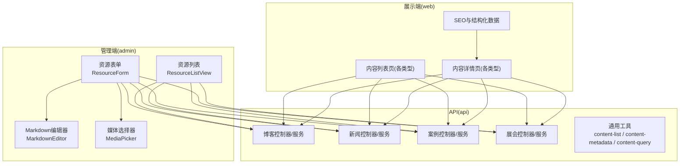
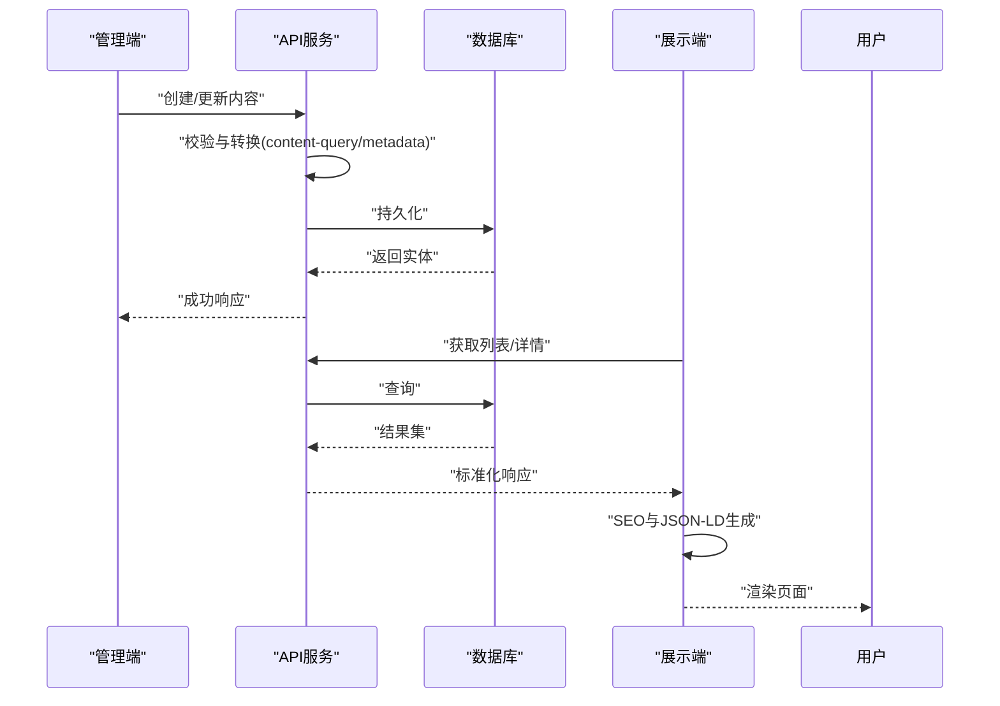
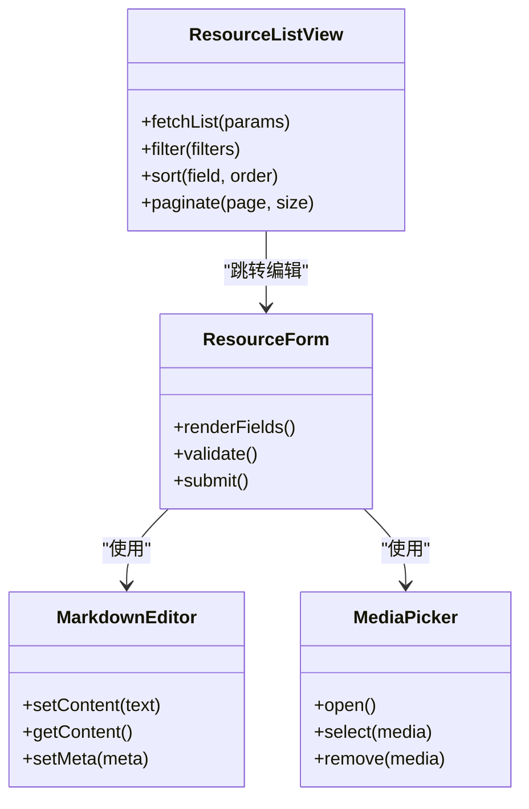
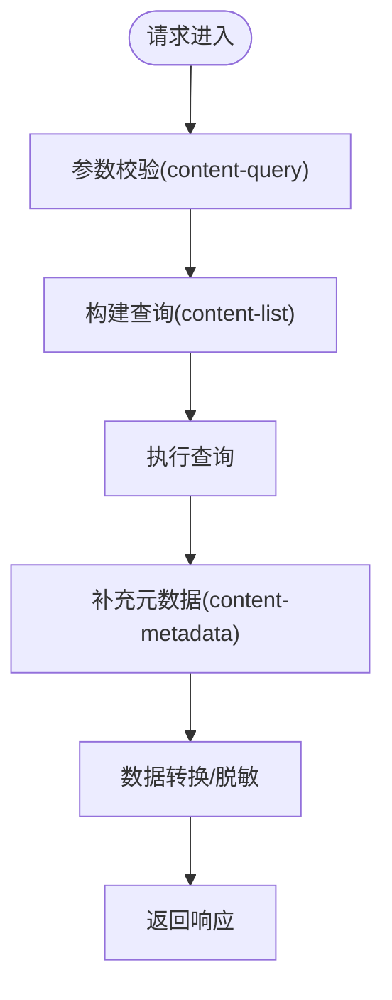
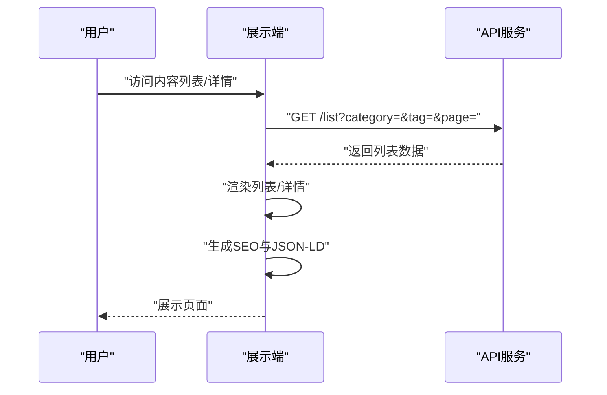
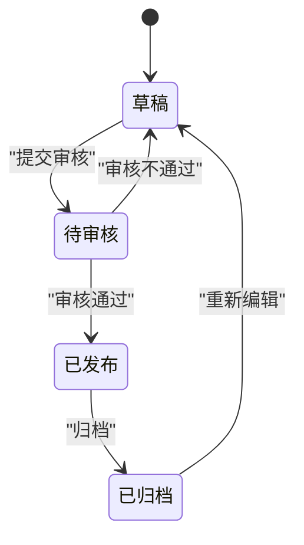
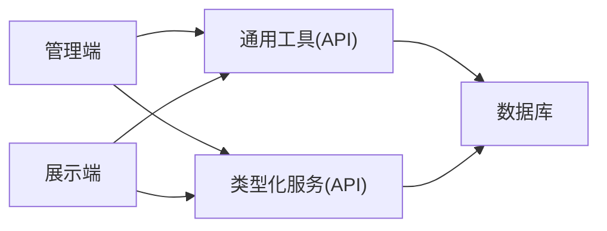

# 内容管理模块

<cite>
**本文引用的文件**   
- [apps/admin/src/features/resources/blog.tsx](file://apps/admin/src/features/resources/blog.tsx)
- [apps/admin/src/features/resources/cases.tsx](file://apps/admin/src/features/resources/cases.tsx)
- [apps/admin/src/features/resources/news.tsx](file://apps/admin/src/features/resources/news.tsx)
- [apps/admin/src/features/resources/tradeShows.tsx](file://apps/admin/src/features/resources/tradeShows.tsx)
- [apps/admin/src/components/crud/ResourceForm.tsx](file://apps/admin/src/components/crud/ResourceForm.tsx)
- [apps/admin/src/components/crud/ResourceListView.tsx](file://apps/admin/src/components/crud/ResourceListView.tsx)
- [apps/admin/src/components/crud/MarkdownEditor.tsx](file://apps/admin/src/components/crud/MarkdownEditor.tsx)
- [apps/admin/src/components/crud/MediaPicker.tsx](file://apps/admin/src/components/crud/MediaPicker.tsx)
- [apps/api/src/blogs/blogs.controller.ts](file://apps/api/src/blogs/blogs.controller.ts)
- [apps/api/src/blogs/blogs.service.ts](file://apps/api/src/blogs/blogs.service.ts)
- [apps/api/src/cases/cases.controller.ts](file://apps/api/src/cases/cases.controller.ts)
- [apps/api/src/cases/cases.service.ts](file://apps/api/src/cases/cases.service.ts)
- [apps/api/src/news/news.controller.ts](file://apps/api/src/news/news.controller.ts)
- [apps/api/src/news/news.service.ts](file://apps/api/src/news/news.service.ts)
- [apps/api/src/trade-shows/trade-shows.controller.ts](file://apps/api/src/trade-shows/trade-shows.controller.ts)
- [apps/api/src/trade-shows/trade-shows.service.ts](file://apps/api/src/trade-shows/trade-shows.service.ts)
- [apps/api/src/common/utils/content-list.ts](file://apps/api/src/common/utils/content-list.ts)
- [apps/api/src/common/utils/content-metadata.ts](file://apps/api/src/common/utils/content-metadata.ts)
- [apps/api/src/common/utils/content-query.ts](file://apps/api/src/common/utils/content-query.ts)
- [apps/api/src/common/enums/content-status.enum.ts](file://apps/api/src/common/enums/content-status.enum.ts)
- [apps/web/src/lib/content-detail.ts](file://apps/web/src/lib/content-detail.ts)
- [apps/web/src/lib/content-list.ts](file://apps/web/src/lib/content-list.ts)
- [apps/web/src/lib/seo.ts](file://apps/web/src/lib/seo.ts)
- [apps/web/src/app/[locale]/resources/blog/page.tsx](file://apps/web/src/app/[locale]/resources/blog/page.tsx)
- [apps/web/src/app/[locale]/resources/news/page.tsx](file://apps/web/src/app/[locale]/resources/news/page.tsx)
- [apps/web/src/app/[locale]/resources/cases/page.tsx](file://apps/web/src/app/[locale]/resources/cases/page.tsx)
- [apps/web/src/app/[locale]/resources/trade-shows/page.tsx](file://apps/web/src/app/[locale]/resources/trade-shows/page.tsx)
- [apps/web/src/components/content/ContentListShell.tsx](file://apps/web/src/components/content/ContentListShell.tsx)
- [apps/web/src/components/content/ContentCategoryTabs.tsx](file://apps/web/src/components/content/ContentCategoryTabs.tsx)
- [apps/web/src/components/content/ContentPagination.tsx](file://apps/web/src/components/content/ContentPagination.tsx)
- [apps/web/src/components/content/MarkdownBody.tsx](file://apps/web/src/components/content/MarkdownBody.tsx)
- [apps/web/src/lib/jsonld.ts](file://apps/web/src/lib/jsonld.ts)
</cite>

## 目录
1. [简介](#简介)
2. [项目结构](#项目结构)
3. [核心组件](#核心组件)
4. [架构总览](#架构总览)
5. [详细组件分析](#详细组件分析)
6. [依赖关系分析](#依赖关系分析)
7. [性能考量](#性能考量)
8. [故障排查指南](#故障排查指南)
9. [结论](#结论)
10. [附录](#附录)

## 简介
本模块为网站的内容管理系统（CMS），统一支撑博客、新闻、案例与展会四类内容。通过“统一设计模式 + 差异化实现”的方式，提供一致的编辑体验、发布流程、版本控制、SEO优化和多语言支持；同时提供分类体系、标签管理、检索与分发能力，并给出扩展自定义内容类型的开发指南。

## 项目结构
内容管理模块采用前后端分离架构：
- 前端管理端（admin）：统一的资源编辑器与列表视图，按内容类型配置字段、校验、媒体选择与预览。
- 后端API（api）：基于NestJS的模块化控制器与服务，提供CRUD、查询、元数据、状态流转等通用能力。
- 前端展示端（web）：面向用户的页面渲染、SEO与多语言路由，统一的内容列表与详情组件。

图表来源
- [apps/admin/src/components/crud/ResourceForm.tsx](file://apps/admin/src/components/crud/ResourceForm.tsx)
- [apps/admin/src/components/crud/ResourceListView.tsx](file://apps/admin/src/components/crud/ResourceListView.tsx)
- [apps/api/src/blogs/blogs.controller.ts](file://apps/api/src/blogs/blogs.controller.ts)
- [apps/api/src/news/news.controller.ts](file://apps/api/src/news/news.controller.ts)
- [apps/api/src/cases/cases.controller.ts](file://apps/api/src/cases/cases.controller.ts)
- [apps/api/src/trade-shows/trade-shows.controller.ts](file://apps/api/src/trade-shows/trade-shows.controller.ts)
- [apps/web/src/components/content/ContentListShell.tsx](file://apps/web/src/components/content/ContentListShell.tsx)
- [apps/web/src/lib/seo.ts](file://apps/web/src/lib/seo.ts)

章节来源
- [apps/admin/src/features/resources/blog.tsx](file://apps/admin/src/features/resources/blog.tsx)
- [apps/admin/src/features/resources/news.tsx](file://apps/admin/src/features/resources/news.tsx)
- [apps/admin/src/features/resources/cases.tsx](file://apps/admin/src/features/resources/cases.tsx)
- [apps/admin/src/features/resources/tradeShows.tsx](file://apps/admin/src/features/resources/tradeShows.tsx)
- [apps/api/src/common/utils/content-list.ts](file://apps/api/src/common/utils/content-list.ts)
- [apps/api/src/common/utils/content-metadata.ts](file://apps/api/src/common/utils/content-metadata.ts)
- [apps/api/src/common/utils/content-query.ts](file://apps/api/src/common/utils/content-query.ts)
- [apps/web/src/lib/content-list.ts](file://apps/web/src/lib/content-list.ts)
- [apps/web/src/lib/content-detail.ts](file://apps/web/src/lib/content-detail.ts)

## 核心组件
- 统一资源表单（ResourceForm）：承载所有内容的创建与编辑，支持字段定义、校验、富文本与媒体嵌入。
- Markdown编辑器（MarkdownEditor）：统一的内容正文编辑与预览，支持多语言与SEO元信息注入。
- 媒体选择器（MediaPicker）：跨内容类型复用，上传、选择与替换媒体资源。
- 资源列表（ResourceListView）：统一的分页、筛选、排序与批量操作。
- API通用工具：
  - content-list：分页、过滤、排序、聚合。
  - content-metadata：SEO标题、描述、关键词、OG/Twitter卡片、canonical等。
  - content-query：统一查询构建器，支持多条件组合。
- 内容类型差异实现：
  - 博客：作者、发布时间、阅读时长、标签、分类。
  - 新闻：发布渠道、优先级、时效性。
  - 案例：客户行业、解决方案、成果指标。
  - 展会：时间地点、议程、报名链接。

章节来源
- [apps/admin/src/components/crud/ResourceForm.tsx](file://apps/admin/src/components/crud/ResourceForm.tsx)
- [apps/admin/src/components/crud/MarkdownEditor.tsx](file://apps/admin/src/components/crud/MarkdownEditor.tsx)
- [apps/admin/src/components/crud/MediaPicker.tsx](file://apps/admin/src/components/crud/MediaPicker.tsx)
- [apps/admin/src/components/crud/ResourceListView.tsx](file://apps/admin/src/components/crud/ResourceListView.tsx)
- [apps/api/src/common/utils/content-list.ts](file://apps/api/src/common/utils/content-list.ts)
- [apps/api/src/common/utils/content-metadata.ts](file://apps/api/src/common/utils/content-metadata.ts)
- [apps/api/src/common/utils/content-query.ts](file://apps/api/src/common/utils/content-query.ts)

## 架构总览
内容管理遵循“统一接口 + 类型化实现”的设计：
- 管理端通过统一的资源定义驱动表单与列表，减少重复代码。
- API层以Controller/Service分层，通用能力下沉到common工具，业务差异在各自Service中实现。
- 展示端通过统一的列表与详情组件渲染不同内容类型，结合SEO与JSON-LD提升可发现性与可读性。

图表来源
- [apps/api/src/blogs/blogs.controller.ts](file://apps/api/src/blogs/blogs.controller.ts)
- [apps/api/src/news/news.controller.ts](file://apps/api/src/news/news.controller.ts)
- [apps/api/src/cases/cases.controller.ts](file://apps/api/src/cases/cases.controller.ts)
- [apps/api/src/trade-shows/trade-shows.controller.ts](file://apps/api/src/trade-shows/trade-shows.controller.ts)
- [apps/web/src/lib/content-list.ts](file://apps/web/src/lib/content-list.ts)
- [apps/web/src/lib/content-detail.ts](file://apps/web/src/lib/content-detail.ts)

## 详细组件分析

### 统一资源编辑与列表（管理端）
- ResourceForm：根据内容类型动态渲染字段，支持必填校验、默认值、国际化提示。
- MarkdownEditor：统一正文编辑，内置预览、快捷键与SEO元信息输入区。
- MediaPicker：支持本地/云端存储，缩略图预览与替换。
- ResourceListView：统一分页、搜索、筛选、排序与导出。

图表来源
- [apps/admin/src/components/crud/ResourceForm.tsx](file://apps/admin/src/components/crud/ResourceForm.tsx)
- [apps/admin/src/components/crud/MarkdownEditor.tsx](file://apps/admin/src/components/crud/MarkdownEditor.tsx)
- [apps/admin/src/components/crud/MediaPicker.tsx](file://apps/admin/src/components/crud/MediaPicker.tsx)
- [apps/admin/src/components/crud/ResourceListView.tsx](file://apps/admin/src/components/crud/ResourceListView.tsx)

章节来源
- [apps/admin/src/components/crud/ResourceForm.tsx](file://apps/admin/src/components/crud/ResourceForm.tsx)
- [apps/admin/src/components/crud/MarkdownEditor.tsx](file://apps/admin/src/components/crud/MarkdownEditor.tsx)
- [apps/admin/src/components/crud/MediaPicker.tsx](file://apps/admin/src/components/crud/MediaPicker.tsx)
- [apps/admin/src/components/crud/ResourceListView.tsx](file://apps/admin/src/components/crud/ResourceListView.tsx)

### 内容类型差异实现（管理端）
- 博客：作者、发布时间、阅读时长、标签、分类、封面图。
- 新闻：发布渠道、优先级、时效性、摘要。
- 案例：客户行业、解决方案、成果指标、相关媒体。
- 展会：时间地点、议程、报名链接、参会人数。

章节来源
- [apps/admin/src/features/resources/blog.tsx](file://apps/admin/src/features/resources/blog.tsx)
- [apps/admin/src/features/resources/news.tsx](file://apps/admin/src/features/resources/news.tsx)
- [apps/admin/src/features/resources/cases.tsx](file://apps/admin/src/features/resources/cases.tsx)
- [apps/admin/src/features/resources/tradeShows.tsx](file://apps/admin/src/features/resources/tradeShows.tsx)

### API层：通用能力与类型化服务
- 通用工具：
  - content-list：分页、过滤、排序、聚合。
  - content-metadata：SEO元数据生成与校验。
  - content-query：统一查询构建器。
- 类型化服务：
  - blogs.service：博客领域逻辑（作者、标签、分类、阅读时长）。
  - news.service：新闻领域逻辑（渠道、优先级、时效性）。
  - cases.service：案例领域逻辑（行业、解决方案、指标）。
  - trade-shows.service：展会领域逻辑（时间地点、议程、报名）。

图表来源
- [apps/api/src/common/utils/content-query.ts](file://apps/api/src/common/utils/content-query.ts)
- [apps/api/src/common/utils/content-list.ts](file://apps/api/src/common/utils/content-list.ts)
- [apps/api/src/common/utils/content-metadata.ts](file://apps/api/src/common/utils/content-metadata.ts)

章节来源
- [apps/api/src/common/utils/content-query.ts](file://apps/api/src/common/utils/content-query.ts)
- [apps/api/src/common/utils/content-list.ts](file://apps/api/src/common/utils/content-list.ts)
- [apps/api/src/common/utils/content-metadata.ts](file://apps/api/src/common/utils/content-metadata.ts)
- [apps/api/src/blogs/blogs.service.ts](file://apps/api/src/blogs/blogs.service.ts)
- [apps/api/src/news/news.service.ts](file://apps/api/src/news/news.service.ts)
- [apps/api/src/cases/cases.service.ts](file://apps/api/src/cases/cases.service.ts)
- [apps/api/src/trade-shows/trade-shows.service.ts](file://apps/api/src/trade-shows/trade-shows.service.ts)

### 展示端：内容列表与详情
- 内容列表页：统一列表壳（ContentListShell）、分类标签（ContentCategoryTabs）、分页（ContentPagination）。
- 内容详情页：Markdown渲染（MarkdownBody）、SEO与JSON-LD注入。
- 多语言路由：[locale]路径前缀，切换语言时保持内容一致性。

图表来源
- [apps/web/src/components/content/ContentListShell.tsx](file://apps/web/src/components/content/ContentListShell.tsx)
- [apps/web/src/components/content/ContentCategoryTabs.tsx](file://apps/web/src/components/content/ContentCategoryTabs.tsx)
- [apps/web/src/components/content/ContentPagination.tsx](file://apps/web/src/components/content/ContentPagination.tsx)
- [apps/web/src/components/content/MarkdownBody.tsx](file://apps/web/src/components/content/MarkdownBody.tsx)
- [apps/web/src/lib/content-list.ts](file://apps/web/src/lib/content-list.ts)
- [apps/web/src/lib/content-detail.ts](file://apps/web/src/lib/content-detail.ts)

章节来源
- [apps/web/src/app/[locale]/resources/blog/page.tsx](file://apps/web/src/app/[locale]/resources/blog/page.tsx)
- [apps/web/src/app/[locale]/resources/news/page.tsx](file://apps/web/src/app/[locale]/resources/news/page.tsx)
- [apps/web/src/app/[locale]/resources/cases/page.tsx](file://apps/web/src/app/[locale]/resources/cases/page.tsx)
- [apps/web/src/app/[locale]/resources/trade-shows/page.tsx](file://apps/web/src/app/[locale]/resources/trade-shows/page.tsx)
- [apps/web/src/components/content/ContentListShell.tsx](file://apps/web/src/components/content/ContentListShell.tsx)
- [apps/web/src/components/content/ContentCategoryTabs.tsx](file://apps/web/src/components/content/ContentCategoryTabs.tsx)
- [apps/web/src/components/content/ContentPagination.tsx](file://apps/web/src/components/content/ContentPagination.tsx)
- [apps/web/src/components/content/MarkdownBody.tsx](file://apps/web/src/components/content/MarkdownBody.tsx)
- [apps/web/src/lib/content-list.ts](file://apps/web/src/lib/content-list.ts)
- [apps/web/src/lib/content-detail.ts](file://apps/web/src/lib/content-detail.ts)

### 内容发布流程与版本控制
- 发布流程：草稿 -> 待审核 -> 已发布 -> 已归档（可通过状态枚举扩展）。
- 版本控制：每次提交生成新版本快照，支持回滚与对比。
- 审计追踪：记录操作人、时间与变更摘要。

图表来源
- [apps/api/src/common/enums/content-status.enum.ts](file://apps/api/src/common/enums/content-status.enum.ts)

章节来源
- [apps/api/src/common/enums/content-status.enum.ts](file://apps/api/src/common/enums/content-status.enum.ts)

### SEO优化与多语言支持
- SEO：自动生成标题、描述、关键词、OG/Twitter卡片、canonical与robots策略。
- JSON-LD：为不同类型内容注入结构化数据（文章、事件、案例等）。
- 多语言：URL前缀[locale]，内容与导航按语言隔离，媒体与静态资源适配。

章节来源
- [apps/web/src/lib/seo.ts](file://apps/web/src/lib/seo.ts)
- [apps/web/src/lib/jsonld.ts](file://apps/web/src/lib/jsonld.ts)

### 内容分类体系与标签管理
- 分类：层级化分类树，支持多级嵌套与排序。
- 标签：扁平化标签集合，支持去重与合并。
- 关联：内容与分类/标签的多对多关系，便于检索与推荐。

章节来源
- [apps/api/src/common/utils/content-list.ts](file://apps/api/src/common/utils/content-list.ts)
- [apps/api/src/common/utils/content-query.ts](file://apps/api/src/common/utils/content-query.ts)

### 内容检索与分发机制
- 检索：全文检索、分类/标签过滤、时间范围、作者/渠道筛选。
- 分发：RSS/订阅、社交分享、站内推荐、外部平台同步。

章节来源
- [apps/api/src/common/utils/content-query.ts](file://apps/api/src/common/utils/content-query.ts)
- [apps/web/src/lib/content-list.ts](file://apps/web/src/lib/content-list.ts)

### 扩展模式与自定义内容类型开发指南
- 新增内容类型步骤：
  1. 在管理端新增资源定义（字段、校验、媒体）。
  2. 在API层新增Controller/Service，复用通用工具。
  3. 在展示端新增路由与页面组件，接入统一列表与详情。
  4. 配置SEO模板与JSON-LD。
  5. 添加权限与审计规则。
- 最佳实践：
  - 字段命名规范与校验集中化。
  - 媒体资源统一管理与水印处理。
  - 查询与分页统一封装，避免重复SQL。
  - 多语言文案集中管理，避免硬编码。

章节来源
- [apps/admin/src/features/resources/blog.tsx](file://apps/admin/src/features/resources/blog.tsx)
- [apps/admin/src/features/resources/news.tsx](file://apps/admin/src/features/resources/news.tsx)
- [apps/admin/src/features/resources/cases.tsx](file://apps/admin/src/features/resources/cases.tsx)
- [apps/admin/src/features/resources/tradeShows.tsx](file://apps/admin/src/features/resources/tradeShows.tsx)
- [apps/api/src/blogs/blogs.controller.ts](file://apps/api/src/blogs/blogs.controller.ts)
- [apps/api/src/news/news.controller.ts](file://apps/api/src/news/news.controller.ts)
- [apps/api/src/cases/cases.controller.ts](file://apps/api/src/cases/cases.controller.ts)
- [apps/api/src/trade-shows/trade-shows.controller.ts](file://apps/api/src/trade-shows/trade-shows.controller.ts)
- [apps/web/src/app/[locale]/resources/blog/page.tsx](file://apps/web/src/app/[locale]/resources/blog/page.tsx)
- [apps/web/src/app/[locale]/resources/news/page.tsx](file://apps/web/src/app/[locale]/resources/news/page.tsx)
- [apps/web/src/app/[locale]/resources/cases/page.tsx](file://apps/web/src/app/[locale]/resources/cases/page.tsx)
- [apps/web/src/app/[locale]/resources/trade-shows/page.tsx](file://apps/web/src/app/[locale]/resources/trade-shows/page.tsx)

## 依赖关系分析
- 管理端依赖：ResourceForm、MarkdownEditor、MediaPicker、ResourceListView。
- API层依赖：通用工具（content-list、content-metadata、content-query）与各类型Service。
- 展示端依赖：统一列表与详情组件、SEO与JSON-LD库、多语言路由。

图表来源
- [apps/api/src/common/utils/content-list.ts](file://apps/api/src/common/utils/content-list.ts)
- [apps/api/src/common/utils/content-metadata.ts](file://apps/api/src/common/utils/content-metadata.ts)
- [apps/api/src/common/utils/content-query.ts](file://apps/api/src/common/utils/content-query.ts)
- [apps/api/src/blogs/blogs.service.ts](file://apps/api/src/blogs/blogs.service.ts)
- [apps/api/src/news/news.service.ts](file://apps/api/src/news/news.service.ts)
- [apps/api/src/cases/cases.service.ts](file://apps/api/src/cases/cases.service.ts)
- [apps/api/src/trade-shows/trade-shows.service.ts](file://apps/api/src/trade-shows/trade-shows.service.ts)

章节来源
- [apps/api/src/common/utils/content-list.ts](file://apps/api/src/common/utils/content-list.ts)
- [apps/api/src/common/utils/content-metadata.ts](file://apps/api/src/common/utils/content-metadata.ts)
- [apps/api/src/common/utils/content-query.ts](file://apps/api/src/common/utils/content-query.ts)
- [apps/api/src/blogs/blogs.service.ts](file://apps/api/src/blogs/blogs.service.ts)
- [apps/api/src/news/news.service.ts](file://apps/api/src/news/news.service.ts)
- [apps/api/src/cases/cases.service.ts](file://apps/api/src/cases/cases.service.ts)
- [apps/api/src/trade-shows/trade-shows.service.ts](file://apps/api/src/trade-shows/trade-shows.service.ts)

## 性能考量
- 列表查询：分页与索引优化，避免全表扫描；按需加载媒体缩略图。
- 缓存策略：热点内容缓存（Redis），静态资源CDN加速。
- 渲染优化：服务端渲染（SSR）与增量静态再生成（ISR）结合。
- 媒体处理：异步转码与水印，懒加载与占位图。

## 故障排查指南
- 常见问题：
  - 列表为空或分页异常：检查查询参数与索引。
  - 媒体无法加载：确认存储配置与CORS设置。
  - SEO不生效：验证元数据生成与JSON-LD注入。
  - 多语言路由错误：确认locale前缀与翻译文件。
- 调试建议：
  - 启用请求日志与审计追踪。
  - 使用浏览器开发者工具检查网络与DOM。
  - 单元测试覆盖关键查询与转换逻辑。

## 结论
本内容管理模块通过统一设计与差异化实现，提供了可扩展、高性能、易维护的内容管理能力。未来可进一步引入AI辅助写作、智能标签与推荐、以及更细粒度的权限控制，以提升运营效率与用户体验。

## 附录
- 术语表：
  - 内容类型：博客、新闻、案例、展会等。
  - 资源：可被编辑与发布的对象。
  - SEO：搜索引擎优化。
  - JSON-LD：结构化数据格式。
- 参考路径：
  - 管理端资源定义：apps/admin/src/features/resources/*
  - API通用工具：apps/api/src/common/utils/*
  - 展示端组件：apps/web/src/components/content/*