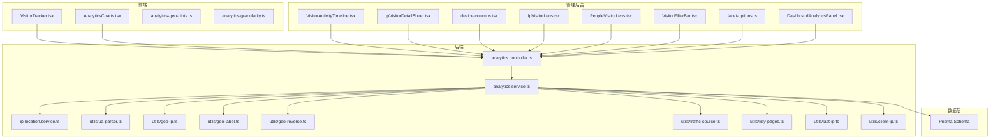
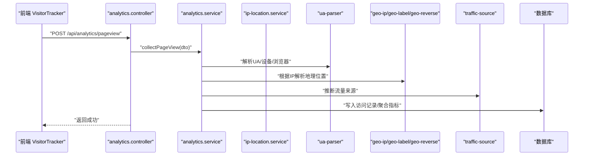
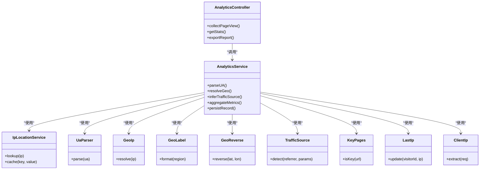

# 分析统计模块

<cite>
**本文引用的文件**   
- [apps/api/src/analytics/analytics.controller.ts](file://apps/api/src/analytics/analytics.controller.ts)
- [apps/api/src/analytics/analytics.service.ts](file://apps/api/src/analytics/analytics.service.ts)
- [apps/api/src/analytics/ip-location.service.ts](file://apps/api/src/analytics/ip-location.service.ts)
- [apps/api/src/analytics/dto/collect-pageview.dto.ts](file://apps/api/src/analytics/dto/collect-pageview.dto.ts)
- [apps/api/src/analytics/dto/identify.dto.ts](file://apps/api/src/analytics/dto/identify.dto.ts)
- [apps/api/src/analytics/utils/client-ip.ts](file://apps/api/src/analytics/utils/client-ip.ts)
- [apps/api/src/analytics/utils/geo-ip.ts](file://apps/api/src/analytics/utils/geo-ip.ts)
- [apps/api/src/analytics/utils/geo-label.ts](file://apps/api/src/analytics/utils/geo-label.ts)
- [apps/api/src/analytics/utils/geo-reverse.ts](file://apps/api/src/analytics/utils/geo-reverse.ts)
- [apps/api/src/analytics/utils/key-pages.ts](file://apps/api/src/analytics/utils/key-pages.ts)
- [apps/api/src/analytics/utils/last-ip.ts](file://apps/api/src/analytics/utils/last-ip.ts)
- [apps/api/src/analytics/utils/traffic-source.ts](file://apps/api/src/analytics/utils/traffic-source.ts)
- [apps/api/src/analytics/utils/ua-parser.ts](file://apps/api/src/analytics/utils/ua-parser.ts)
- [apps/web/src/components/analytics/VisitorTracker.tsx](file://apps/web/src/components/analytics/VisitorTracker.tsx)
- [apps/admin/src/features/analytics.ts](file://apps/admin/src/features/analytics.ts)
- [apps/admin/src/lib/analytics-granularity.ts](file://apps/admin/src/lib/analytics-granularity.ts)
- [apps/admin/src/lib/analytics-geo-hints.ts](file://apps/admin/src/lib/analytics-geo-hints.ts)
- [apps/admin/src/components/analytics/AnalyticsCharts.tsx](file://apps/admin/src/components/analytics/AnalyticsCharts.tsx)
- [apps/admin/src/components/analytics/IpVisitorDetailSheet.tsx](file://apps/admin/src/components/analytics/IpVisitorDetailSheet.tsx)
- [apps/admin/src/components/analytics/VisitorActivityTimeline.tsx](file://apps/admin/src/components/analytics/VisitorActivityTimeline.tsx)
- [apps/admin/src/components/analytics/device-columns.tsx](file://apps/admin/src/components/analytics/device-columns.tsx)
- [apps/admin/src/components/visitors/IpVisitorLens.tsx](file://apps/admin/src/components/visitors/IpVisitorLens.tsx)
- [apps/admin/src/components/visitors/PeopleVisitorLens.tsx](file://apps/admin/src/components/visitors/PeopleVisitorLens.tsx)
- [apps/admin/src/components/visitors/VisitorFilterBar.tsx](file://apps/admin/src/components/visitors/VisitorFilterBar.tsx)
- [apps/admin/src/components/visitors/facet-options.ts](file://apps/admin/src/components/visitors/facet-options.ts)
- [apps/admin/src/components/dashboard/DashboardAnalyticsPanel.tsx](file://apps/admin/src/components/dashboard/DashboardAnalyticsPanel.tsx)
- [apps/api/prisma/schema.prisma](file://apps/api/prisma/schema.prisma)
</cite>

## 目录
1. [简介](#简介)
2. [项目结构](#项目结构)
3. [核心组件](#核心组件)
4. [架构总览](#架构总览)
5. [详细组件分析](#详细组件分析)
6. [依赖关系分析](#依赖关系分析)
7. [性能与存储优化](#性能与存储优化)
8. [故障排查指南](#故障排查指南)
9. [结论](#结论)
10. [附录](#附录)

## 简介
本模块为网站与分析后台提供完整的访客追踪、页面访问统计、地理位置分析与流量来源追踪能力。前端通过轻量脚本采集浏览器设备信息、UA、IP、页面路径与来源，后端对请求进行解析、去重、聚合与持久化，并提供多维度的报表与可视化展示。模块覆盖数据采集策略、实时计算、数据聚合算法、报表生成机制，以及反爬虫与查询性能调优方案。

## 项目结构
分析统计模块由三部分组成：
- 前端采集器（Web）：在页面加载时上报事件，包含设备识别、UA解析、IP获取、来源追踪等。
- 后端服务（API）：接收并处理采集数据，解析IP与地理位置，关联流量来源，持久化到数据库，并提供查询接口。
- 管理后台（Admin）：提供分析看板、访客详情、活动时序、设备维度、过滤与导出等功能。

图表来源
- [apps/web/src/components/analytics/VisitorTracker.tsx](file://apps/web/src/components/analytics/VisitorTracker.tsx)
- [apps/api/src/analytics/analytics.controller.ts](file://apps/api/src/analytics/analytics.controller.ts)
- [apps/api/src/analytics/analytics.service.ts](file://apps/api/src/analytics/analytics.service.ts)
- [apps/api/src/analytics/ip-location.service.ts](file://apps/api/src/analytics/ip-location.service.ts)
- [apps/api/src/analytics/utils/ua-parser.ts](file://apps/api/src/analytics/utils/ua-parser.ts)
- [apps/api/src/analytics/utils/geo-ip.ts](file://apps/api/src/analytics/utils/geo-ip.ts)
- [apps/api/src/analytics/utils/geo-label.ts](file://apps/api/src/analytics/utils/geo-label.ts)
- [apps/api/src/analytics/utils/geo-reverse.ts](file://apps/api/src/analytics/utils/geo-reverse.ts)
- [apps/api/src/analytics/utils/traffic-source.ts](file://apps/api/src/analytics/utils/traffic-source.ts)
- [apps/api/src/analytics/utils/key-pages.ts](file://apps/api/src/analytics/utils/key-pages.ts)
- [apps/api/src/analytics/utils/last-ip.ts](file://apps/api/src/analytics/utils/last-ip.ts)
- [apps/api/src/analytics/utils/client-ip.ts](file://apps/api/src/analytics/utils/client-ip.ts)
- [apps/admin/src/components/analytics/AnalyticsCharts.tsx](file://apps/admin/src/components/analytics/AnalyticsCharts.tsx)
- [apps/admin/src/components/analytics/VisitorActivityTimeline.tsx](file://apps/admin/src/components/analytics/VisitorActivityTimeline.tsx)
- [apps/admin/src/components/analytics/IpVisitorDetailSheet.tsx](file://apps/admin/src/components/analytics/IpVisitorDetailSheet.tsx)
- [apps/admin/src/components/analytics/device-columns.tsx](file://apps/admin/src/components/analytics/device-columns.tsx)
- [apps/admin/src/components/visitors/IpVisitorLens.tsx](file://apps/admin/src/components/visitors/IpVisitorLens.tsx)
- [apps/admin/src/components/visitors/PeopleVisitorLens.tsx](file://apps/admin/src/components/visitors/PeopleVisitorLens.tsx)
- [apps/admin/src/components/visitors/VisitorFilterBar.tsx](file://apps/admin/src/components/visitors/VisitorFilterBar.tsx)
- [apps/admin/src/components/visitors/facet-options.ts](file://apps/admin/src/components/visitors/facet-options.ts)
- [apps/admin/src/components/dashboard/DashboardAnalyticsPanel.tsx](file://apps/admin/src/components/dashboard/DashboardAnalyticsPanel.tsx)

章节来源
- [apps/api/src/analytics/analytics.controller.ts](file://apps/api/src/analytics/analytics.controller.ts)
- [apps/api/src/analytics/analytics.service.ts](file://apps/api/src/analytics/analytics.service.ts)
- [apps/api/prisma/schema.prisma](file://apps/api/prisma/schema.prisma)

## 核心组件
- 数据采集与上报（Web）
  - VisitorTracker：负责在页面生命周期内采集设备信息、UA、IP、页面路径、来源参数，并调用后端接口上报。
  - 支持防抖与批量上报，降低网络开销与后端压力。
- 后端处理（API）
  - analytics.controller：定义采集与查询接口，校验输入DTO，路由到服务层。
  - analytics.service：核心业务逻辑，包括IP解析、UA解析、地理位置标注、流量来源推断、关键页面判定、最近IP更新、去重与聚合。
  - ip-location.service：封装IP地理位置查询与缓存策略。
  - utils：client-ip、ua-parser、geo-ip、geo-label、geo-reverse、traffic-source、key-pages、last-ip等工具函数。
- 管理后台（Admin）
  - AnalyticsCharts：图表渲染与交互。
  - VisitorActivityTimeline：按时间线展示访客活动。
  - IpVisitorDetailSheet：按IP维度的访客详情面板。
  - device-columns：设备维度列配置。
  - IpVisitorLens / PeopleVisitorLens：按IP或人维度的筛选与列表。
  - VisitorFilterBar / facet-options：多维度过滤与分面选项。
  - DashboardAnalyticsPanel：仪表盘概览。

章节来源
- [apps/web/src/components/analytics/VisitorTracker.tsx](file://apps/web/src/components/analytics/VisitorTracker.tsx)
- [apps/api/src/analytics/analytics.controller.ts](file://apps/api/src/analytics/analytics.controller.ts)
- [apps/api/src/analytics/analytics.service.ts](file://apps/api/src/analytics/analytics.service.ts)
- [apps/api/src/analytics/ip-location.service.ts](file://apps/api/src/analytics/ip-location.service.ts)
- [apps/api/src/analytics/utils/client-ip.ts](file://apps/api/src/analytics/utils/client-ip.ts)
- [apps/api/src/analytics/utils/ua-parser.ts](file://apps/api/src/analytics/utils/ua-parser.ts)
- [apps/api/src/analytics/utils/geo-ip.ts](file://apps/api/src/analytics/utils/geo-ip.ts)
- [apps/api/src/analytics/utils/geo-label.ts](file://apps/api/src/analytics/utils/geo-label.ts)
- [apps/api/src/analytics/utils/geo-reverse.ts](file://apps/api/src/analytics/utils/geo-reverse.ts)
- [apps/api/src/analytics/utils/traffic-source.ts](file://apps/api/src/analytics/utils/traffic-source.ts)
- [apps/api/src/analytics/utils/key-pages.ts](file://apps/api/src/analytics/utils/key-pages.ts)
- [apps/api/src/analytics/utils/last-ip.ts](file://apps/api/src/analytics/utils/last-ip.ts)
- [apps/admin/src/components/analytics/AnalyticsCharts.tsx](file://apps/admin/src/components/analytics/AnalyticsCharts.tsx)
- [apps/admin/src/components/analytics/VisitorActivityTimeline.tsx](file://apps/admin/src/components/analytics/VisitorActivityTimeline.tsx)
- [apps/admin/src/components/analytics/IpVisitorDetailSheet.tsx](file://apps/admin/src/components/analytics/IpVisitorDetailSheet.tsx)
- [apps/admin/src/components/analytics/device-columns.tsx](file://apps/admin/src/components/analytics/device-columns.tsx)
- [apps/admin/src/components/visitors/IpVisitorLens.tsx](file://apps/admin/src/components/visitors/IpVisitorLens.tsx)
- [apps/admin/src/components/visitors/PeopleVisitorLens.tsx](file://apps/admin/src/components/visitors/PeopleVisitorLens.tsx)
- [apps/admin/src/components/visitors/VisitorFilterBar.tsx](file://apps/admin/src/components/visitors/VisitorFilterBar.tsx)
- [apps/admin/src/components/visitors/facet-options.ts](file://apps/admin/src/components/visitors/facet-options.ts)
- [apps/admin/src/components/dashboard/DashboardAnalyticsPanel.tsx](file://apps/admin/src/components/dashboard/DashboardAnalyticsPanel.tsx)

## 架构总览
整体采用“前端采集 + 后端服务 + 管理后台”的三层架构。前端以最小侵入方式采集数据；后端集中处理解析、标注、聚合与持久化；管理后台提供多维分析视图与导出能力。

图表来源
- [apps/web/src/components/analytics/VisitorTracker.tsx](file://apps/web/src/components/analytics/VisitorTracker.tsx)
- [apps/api/src/analytics/analytics.controller.ts](file://apps/api/src/analytics/analytics.controller.ts)
- [apps/api/src/analytics/analytics.service.ts](file://apps/api/src/analytics/analytics.service.ts)
- [apps/api/src/analytics/ip-location.service.ts](file://apps/api/src/analytics/ip-location.service.ts)
- [apps/api/src/analytics/utils/ua-parser.ts](file://apps/api/src/analytics/utils/ua-parser.ts)
- [apps/api/src/analytics/utils/geo-ip.ts](file://apps/api/src/analytics/utils/geo-ip.ts)
- [apps/api/src/analytics/utils/geo-label.ts](file://apps/api/src/analytics/utils/geo-label.ts)
- [apps/api/src/analytics/utils/geo-reverse.ts](file://apps/api/src/analytics/utils/geo-reverse.ts)
- [apps/api/src/analytics/utils/traffic-source.ts](file://apps/api/src/analytics/utils/traffic-source.ts)

## 详细组件分析

### 数据采集策略与上报流程
- 采集时机：页面加载完成、路由切换、滚动深度、停留时长等。
- 采集字段：URL、标题、来源参数、UA、屏幕分辨率、语言、时区、IP（由后端解析）、设备类型、浏览器版本等。
- 上报策略：
  - 防抖与节流：避免重复上报与高频请求。
  - 批量上报：合并多次事件减少网络开销。
  - 离线重试：在网络恢复后补发未上报事件。
- 隐私与安全：
  - 不采集敏感个人信息。
  - 支持匿名模式与用户授权开关。

章节来源
- [apps/web/src/components/analytics/VisitorTracker.tsx](file://apps/web/src/components/analytics/VisitorTracker.tsx)
- [apps/api/src/analytics/dto/collect-pageview.dto.ts](file://apps/api/src/analytics/dto/collect-pageview.dto.ts)

### 页面访问统计与实时分析
- 实时计数：按分钟/小时粒度聚合PV、UV、平均停留时长、跳出率等。
- 去重策略：基于IP+UA+会话ID进行去重，避免同一访客重复计数。
- 关键页面识别：通过规则匹配热门页面与转化页面，提升报表可读性。
- 实时计算：使用内存缓存或流式计算框架（可选）实现近实时指标。

章节来源
- [apps/api/src/analytics/analytics.service.ts](file://apps/api/src/analytics/analytics.service.ts)
- [apps/api/src/analytics/utils/key-pages.ts](file://apps/api/src/analytics/utils/key-pages.ts)

### 地理位置分析与IP解析
- IP解析：从请求头与代理链中可靠提取客户端真实IP。
- 地理标注：结合本地库与在线服务，解析国家、省份、城市、经纬度。
- 反向地理：将坐标转换为地名标签，便于可视化与搜索。
- 缓存策略：对热点IP与地区结果进行缓存，降低外部依赖延迟。

章节来源
- [apps/api/src/analytics/utils/client-ip.ts](file://apps/api/src/analytics/utils/client-ip.ts)
- [apps/api/src/analytics/utils/geo-ip.ts](file://apps/api/src/analytics/utils/geo-ip.ts)
- [apps/api/src/analytics/utils/geo-label.ts](file://apps/api/src/analytics/utils/geo-label.ts)
- [apps/api/src/analytics/utils/geo-reverse.ts](file://apps/api/src/analytics/utils/geo-reverse.ts)
- [apps/api/src/analytics/ip-location.service.ts](file://apps/api/src/analytics/ip-location.service.ts)

### 流量来源追踪
- 来源识别：解析UTM参数、Referrer、搜索引擎关键词、广告渠道等。
- 归因模型：支持首次触达、末次触达与线性归因（可扩展）。
- 渠道质量：结合转化率与停留时长评估渠道效果。

章节来源
- [apps/api/src/analytics/utils/traffic-source.ts](file://apps/api/src/analytics/utils/traffic-source.ts)

### 设备识别与浏览器检测
- UA解析：识别操作系统、设备类型、浏览器名称与版本。
- 移动端适配：区分手机、平板、桌面端，优化展示与统计口径。
- 兼容性处理：对异常UA进行降级与容错。

章节来源
- [apps/api/src/analytics/utils/ua-parser.ts](file://apps/api/src/analytics/utils/ua-parser.ts)

### 反爬虫与风控策略
- 频率限制：基于IP与UA的请求速率限制，防止恶意抓取。
- 行为校验：检查请求头一致性、User-Agent合法性、Referer白名单。
- 黑名单机制：对异常IP进行临时封禁与告警。
- 验证码集成：高风险场景触发人机验证。

章节来源
- [apps/api/src/analytics/analytics.controller.ts](file://apps/api/src/analytics/analytics.controller.ts)
- [apps/api/src/analytics/analytics.service.ts](file://apps/api/src/analytics/analytics.service.ts)

### 数据聚合算法与报表生成
- 聚合维度：时间（日/周/月）、地域、设备、浏览器、来源、页面。
- 聚合算法：滑动窗口、增量聚合、TopN排序、漏斗分析。
- 报表生成：支持导出CSV/Excel，定时任务生成日报/周报。
- 查询优化：预聚合表、物化视图、索引设计。

章节来源
- [apps/api/src/analytics/analytics.service.ts](file://apps/api/src/analytics/analytics.service.ts)
- [apps/admin/src/features/analytics.ts](file://apps/admin/src/features/analytics.ts)
- [apps/admin/src/lib/analytics-granularity.ts](file://apps/admin/src/lib/analytics-granularity.ts)

### 数据存储与查询性能调优
- 存储模型：访问日志表、聚合指标表、地理位置映射表、来源映射表。
- 索引策略：按时间、IP、页面路径建立复合索引，加速范围查询与分组。
- 分区与归档：按时间分区历史数据，冷热分离提升查询效率。
- 缓存层：Redis缓存热点指标与地理位置结果。
- 批处理：夜间批量计算复杂指标，减轻在线查询压力。

章节来源
- [apps/api/prisma/schema.prisma](file://apps/api/prisma/schema.prisma)
- [apps/api/src/analytics/ip-location.service.ts](file://apps/api/src/analytics/ip-location.service.ts)

### 管理后台可视化与交互
- 图表组件：趋势图、饼图、地图热力、设备分布等。
- 时间线：按访客或IP维度展示活动轨迹。
- 过滤器：时间范围、地域、设备、来源、页面等多维筛选。
- 导出功能：支持多格式导出与定时推送。

章节来源
- [apps/admin/src/components/analytics/AnalyticsCharts.tsx](file://apps/admin/src/components/analytics/AnalyticsCharts.tsx)
- [apps/admin/src/components/analytics/VisitorActivityTimeline.tsx](file://apps/admin/src/components/analytics/VisitorActivityTimeline.tsx)
- [apps/admin/src/components/analytics/IpVisitorDetailSheet.tsx](file://apps/admin/src/components/analytics/IpVisitorDetailSheet.tsx)
- [apps/admin/src/components/analytics/device-columns.tsx](file://apps/admin/src/components/analytics/device-columns.tsx)
- [apps/admin/src/components/visitors/IpVisitorLens.tsx](file://apps/admin/src/components/visitors/IpVisitorLens.tsx)
- [apps/admin/src/components/visitors/PeopleVisitorLens.tsx](file://apps/admin/src/components/visitors/PeopleVisitorLens.tsx)
- [apps/admin/src/components/visitors/VisitorFilterBar.tsx](file://apps/admin/src/components/visitors/VisitorFilterBar.tsx)
- [apps/admin/src/components/visitors/facet-options.ts](file://apps/admin/src/components/visitors/facet-options.ts)
- [apps/admin/src/components/dashboard/DashboardAnalyticsPanel.tsx](file://apps/admin/src/components/dashboard/DashboardAnalyticsPanel.tsx)

## 依赖关系分析
- 控制器依赖服务层，服务层依赖工具函数与位置服务。
- 前端组件依赖控制器提供的API。
- 管理后台组件依赖控制器提供的查询接口。

图表来源
- [apps/api/src/analytics/analytics.controller.ts](file://apps/api/src/analytics/analytics.controller.ts)
- [apps/api/src/analytics/analytics.service.ts](file://apps/api/src/analytics/analytics.service.ts)
- [apps/api/src/analytics/ip-location.service.ts](file://apps/api/src/analytics/ip-location.service.ts)
- [apps/api/src/analytics/utils/ua-parser.ts](file://apps/api/src/analytics/utils/ua-parser.ts)
- [apps/api/src/analytics/utils/geo-ip.ts](file://apps/api/src/analytics/utils/geo-ip.ts)
- [apps/api/src/analytics/utils/geo-label.ts](file://apps/api/src/analytics/utils/geo-label.ts)
- [apps/api/src/analytics/utils/geo-reverse.ts](file://apps/api/src/analytics/utils/geo-reverse.ts)
- [apps/api/src/analytics/utils/traffic-source.ts](file://apps/api/src/analytics/utils/traffic-source.ts)
- [apps/api/src/analytics/utils/key-pages.ts](file://apps/api/src/analytics/utils/key-pages.ts)
- [apps/api/src/analytics/utils/last-ip.ts](file://apps/api/src/analytics/utils/last-ip.ts)
- [apps/api/src/analytics/utils/client-ip.ts](file://apps/api/src/analytics/utils/client-ip.ts)

## 性能与存储优化
- 采集端优化
  - 防抖与节流：减少无效上报。
  - 批量上报：合并事件，降低请求次数。
  - 离线队列：网络恢复后重试，保证数据完整性。
- 服务端优化
  - 异步处理：非关键路径异步执行，缩短响应时间。
  - 缓存策略：热点IP与地区结果缓存，减少外部依赖。
  - 限流与熔断：保护后端资源，避免雪崩。
- 存储优化
  - 分区表：按时间分区，提升查询与归档效率。
  - 索引设计：复合索引覆盖常用查询条件。
  - 物化视图：预计算复杂指标，加速报表生成。
- 查询优化
  - 分页与游标：避免大结果集拖慢查询。
  - 只读副本：读写分离，提升并发能力。
  - 预热与缓存：常用查询结果缓存，降低数据库压力。

[本节为通用指导，无需特定文件引用]

## 故障排查指南
- 常见问题
  - IP解析失败：检查代理链与请求头，确认可信代理配置。
  - 地理位置缺失：核对本地库版本与在线服务可用性。
  - 数据来源错误：校验UTM参数与Referrer格式。
  - 上报失败：检查网络状态与重试策略。
- 诊断步骤
  - 查看控制器日志与错误码。
  - 检查服务层中间件与工具函数返回值。
  - 验证数据库索引与分区状态。
  - 监控缓存命中率与外部依赖延迟。
- 修复建议
  - 增加超时与重试机制。
  - 完善异常捕获与告警。
  - 定期更新地理位置库与UA规则。

章节来源
- [apps/api/src/analytics/analytics.controller.ts](file://apps/api/src/analytics/analytics.controller.ts)
- [apps/api/src/analytics/analytics.service.ts](file://apps/api/src/analytics/analytics.service.ts)
- [apps/api/src/analytics/ip-location.service.ts](file://apps/api/src/analytics/ip-location.service.ts)

## 结论
分析统计模块通过前后端协同实现了完整的访客追踪、页面访问统计、地理位置分析与流量来源追踪。模块具备良好的扩展性与可维护性，支持高并发与大数据量场景下的稳定运行。通过合理的采集策略、解析算法、聚合机制与存储优化，能够满足多样化的分析需求与报表生成目标。

[本节为总结性内容，无需特定文件引用]

## 附录
- DTO定义
  - collect-pageview.dto：页面访问采集数据传输对象。
  - identify.dto：访客身份识别数据传输对象。
- 管理后台特性
  - 多维度过滤与分面选项。
  - 可视化图表与导出功能。
  - 仪表盘与活动时序展示。

章节来源
- [apps/api/src/analytics/dto/collect-pageview.dto.ts](file://apps/api/src/analytics/dto/collect-pageview.dto.ts)
- [apps/api/src/analytics/dto/identify.dto.ts](file://apps/api/src/analytics/dto/identify.dto.ts)
- [apps/admin/src/components/visitors/facet-options.ts](file://apps/admin/src/components/visitors/facet-options.ts)
- [apps/admin/src/lib/analytics-granularity.ts](file://apps/admin/src/lib/analytics-granularity.ts)
- [apps/admin/src/lib/analytics-geo-hints.ts](file://apps/admin/src/lib/analytics-geo-hints.ts)