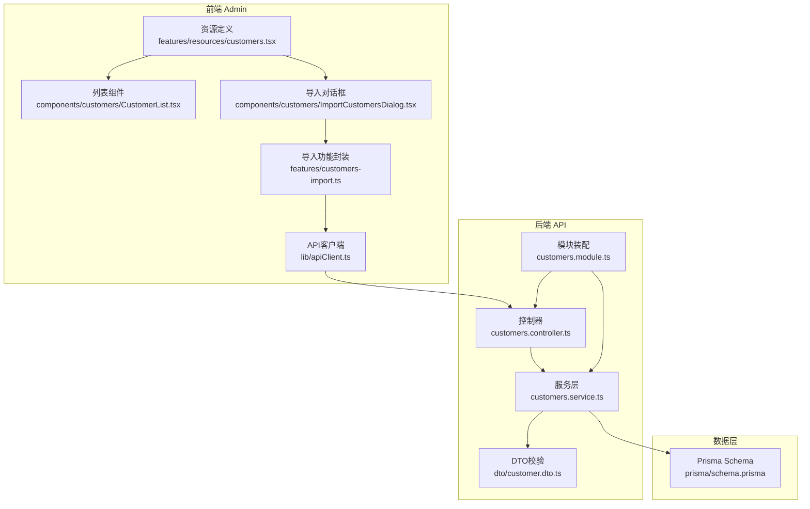
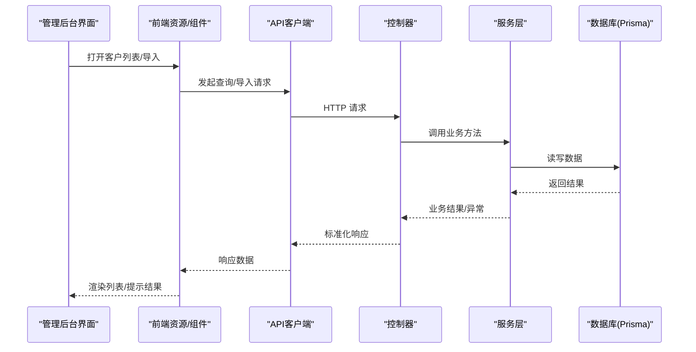
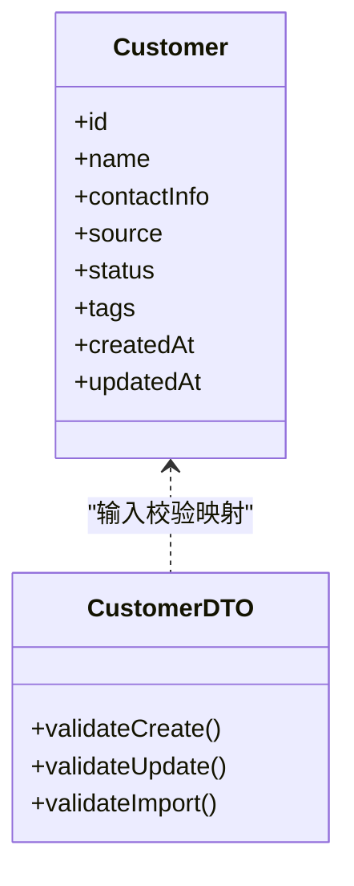
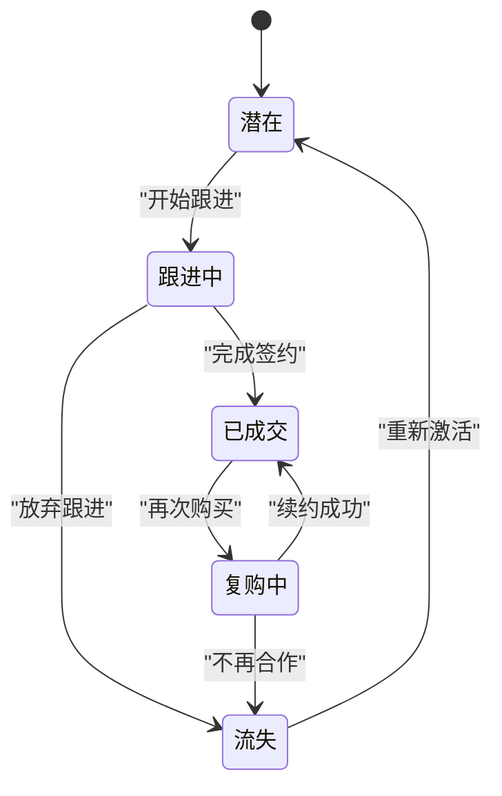
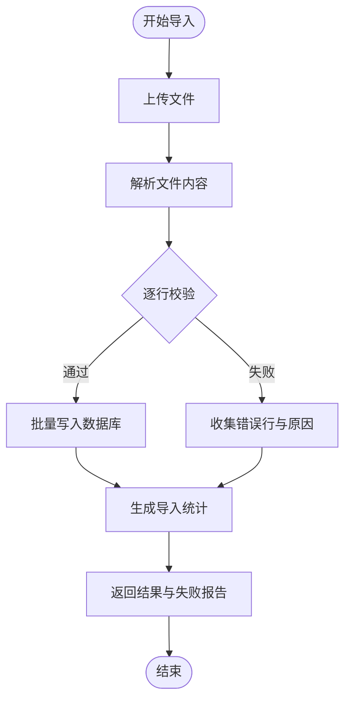
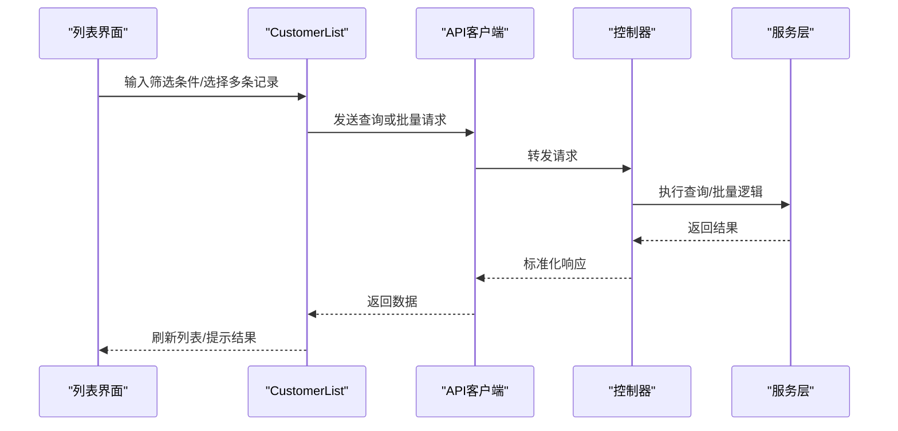
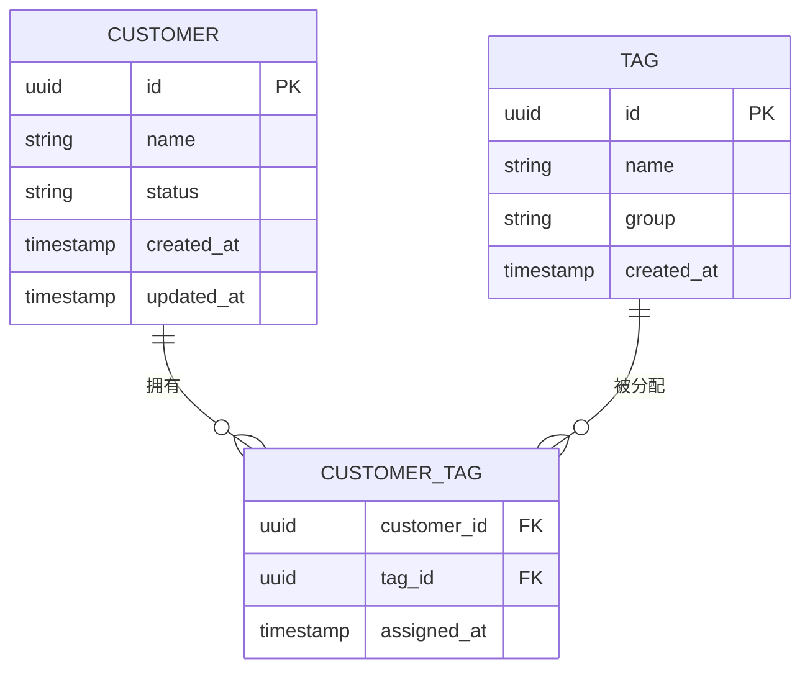
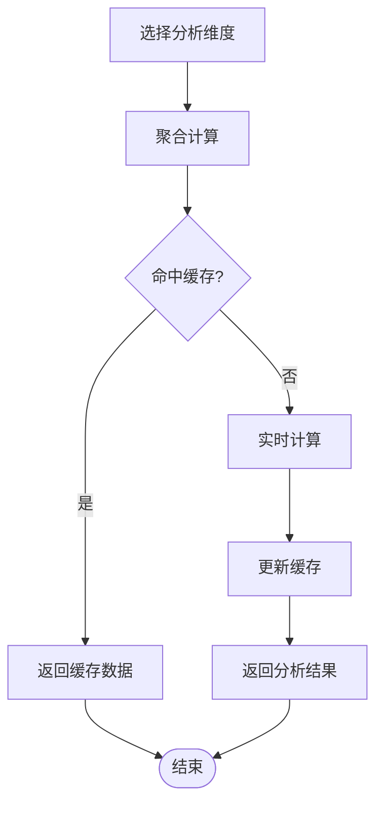
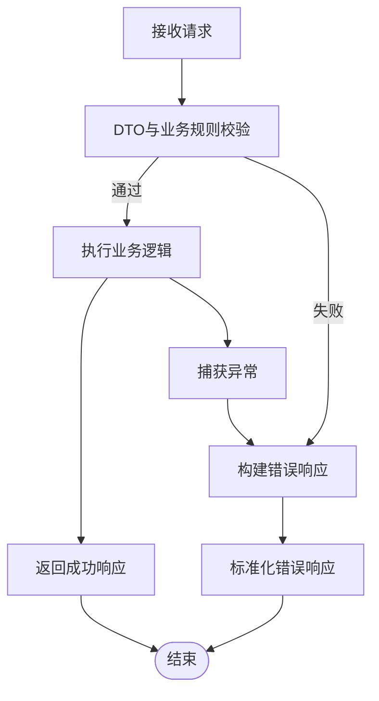
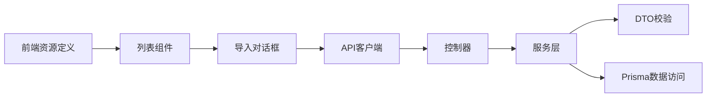

# 客户管理模块

<cite>
**本文引用的文件**   
- [customers.controller.ts](file://apps/api/src/customers/customers.controller.ts)
- [customers.service.ts](file://apps/api/src/customers/customers.service.ts)
- [customer.dto.ts](file://apps/api/src/customers/dto/customer.dto.ts)
- [customers.module.ts](file://apps/api/src/customers/customers.module.ts)
- [schema.prisma](file://apps/api/prisma/schema.prisma)
- [customers.tsx](file://apps/admin/src/features/resources/customers.tsx)
- [CustomerList.tsx](file://apps/admin/src/components/customers/CustomerList.tsx)
- [ImportCustomersDialog.tsx](file://apps/admin/src/components/customers/ImportCustomersDialog.tsx)
- [customers-import.ts](file://apps/admin/src/features/customers-import.ts)
- [apiClient.ts](file://apps/admin/src/lib/apiClient.ts)
</cite>

## 目录
1. [简介](#简介)
2. [项目结构](#项目结构)
3. [核心组件](#核心组件)
4. [架构总览](#架构总览)
5. [详细组件分析](#详细组件分析)
6. [依赖关系分析](#依赖关系分析)
7. [性能考虑](#性能考虑)
8. [故障排查指南](#故障排查指南)
9. [结论](#结论)
10. [附录](#附录)

## 简介
本模块面向企业级后台管理系统中的“客户管理”能力，覆盖以下关键主题：
- 客户实体模型与数据校验
- 客户关系管理与状态流转
- 客户数据的导入导出
- 搜索过滤、批量操作、标签管理
- 数据分析与报表
- 业务规则校验与异常处理机制
- 业务流程与前后端集成模式

该文档以代码为依据，结合前端页面与后端服务，提供从数据模型到接口调用、从界面交互到持久化落库的全链路说明。

## 项目结构
客户管理模块横跨前端（Next.js Admin）与后端（NestJS API），并通过 Prisma 进行数据库建模与迁移。

图表来源
- [customers.tsx:1-200](file://apps/admin/src/features/resources/customers.tsx#L1-L200)
- [CustomerList.tsx:1-200](file://apps/admin/src/components/customers/CustomerList.tsx#L1-L200)
- [ImportCustomersDialog.tsx:1-200](file://apps/admin/src/components/customers/ImportCustomersDialog.tsx#L1-L200)
- [customers-import.ts:1-200](file://apps/admin/src/features/customers-import.ts#L1-L200)
- [apiClient.ts:1-200](file://apps/admin/src/lib/apiClient.ts#L1-L200)
- [customers.controller.ts:1-200](file://apps/api/src/customers/customers.controller.ts#L1-L200)
- [customers.service.ts:1-200](file://apps/api/src/customers/customers.service.ts#L1-L200)
- [customer.dto.ts:1-200](file://apps/api/src/customers/dto/customer.dto.ts#L1-L200)
- [customers.module.ts:1-200](file://apps/api/src/customers/customers.module.ts#L1-L200)
- [schema.prisma:1-200](file://apps/api/prisma/schema.prisma#L1-L200)

章节来源
- [customers.tsx:1-200](file://apps/admin/src/features/resources/customers.tsx#L1-L200)
- [CustomerList.tsx:1-200](file://apps/admin/src/components/customers/CustomerList.tsx#L1-L200)
- [ImportCustomersDialog.tsx:1-200](file://apps/admin/src/components/customers/ImportCustomersDialog.tsx#L1-L200)
- [customers-import.ts:1-200](file://apps/admin/src/features/customers-import.ts#L1-L200)
- [apiClient.ts:1-200](file://apps/admin/src/lib/apiClient.ts#L1-L200)
- [customers.controller.ts:1-200](file://apps/api/src/customers/customers.controller.ts#L1-L200)
- [customers.service.ts:1-200](file://apps/api/src/customers/customers.service.ts#L1-L200)
- [customer.dto.ts:1-200](file://apps/api/src/customers/dto/customer.dto.ts#L1-L200)
- [customers.module.ts:1-200](file://apps/api/src/customers/customers.module.ts#L1-L200)
- [schema.prisma:1-200](file://apps/api/prisma/schema.prisma#L1-L200)

## 核心组件
- 前端资源定义与路由注册：用于在管理后台注册“客户”资源，配置列展示、表单字段、筛选器、批量操作入口等。
- 列表与导入界面：提供分页列表、搜索过滤、批量选择与导入弹窗。
- 导入流程封装：统一处理文件上传、进度反馈、错误提示与结果回写。
- 后端控制器与服务：REST 接口暴露、请求参数校验、业务编排、事务与异常处理。
- DTO 校验：基于类装饰器的输入校验，确保字段类型、长度、格式与业务约束。
- 数据模型：通过 Prisma Schema 定义客户实体、关联关系与索引策略。

章节来源
- [customers.tsx:1-200](file://apps/admin/src/features/resources/customers.tsx#L1-L200)
- [CustomerList.tsx:1-200](file://apps/admin/src/components/customers/CustomerList.tsx#L1-L200)
- [ImportCustomersDialog.tsx:1-200](file://apps/admin/src/components/customers/ImportCustomersDialog.tsx#L1-L200)
- [customers-import.ts:1-200](file://apps/admin/src/features/customers-import.ts#L1-L200)
- [customers.controller.ts:1-200](file://apps/api/src/customers/customers.controller.ts#L1-L200)
- [customers.service.ts:1-200](file://apps/api/src/customers/customers.service.ts#L1-L200)
- [customer.dto.ts:1-200](file://apps/api/src/customers/dto/customer.dto.ts#L1-L200)
- [schema.prisma:1-200](file://apps/api/prisma/schema.prisma#L1-L200)

## 架构总览
整体采用前后端分离的 REST 架构，前端通过统一的 API 客户端发起请求，后端由 NestJS 控制器接收并交由服务层处理，最终通过 Prisma 访问数据库。

图表来源
- [apiClient.ts:1-200](file://apps/admin/src/lib/apiClient.ts#L1-L200)
- [customers.controller.ts:1-200](file://apps/api/src/customers/customers.controller.ts#L1-L200)
- [customers.service.ts:1-200](file://apps/api/src/customers/customers.service.ts#L1-L200)
- [schema.prisma:1-200](file://apps/api/prisma/schema.prisma#L1-L200)

## 详细组件分析

### 客户实体模型与数据校验
- 数据模型：通过 Prisma Schema 定义客户主表及必要字段（如名称、联系方式、来源、状态、标签等），并建立必要的索引以提升查询性能。
- DTO 校验：使用类装饰器对创建/更新/导入数据进行强校验，包括必填项、格式、长度、枚举值等，避免脏数据入库。
- 数据一致性：在服务层对关键字段进行二次校验与规范化，保证跨接口的数据一致性。

图表来源
- [schema.prisma:1-200](file://apps/api/prisma/schema.prisma#L1-L200)
- [customer.dto.ts:1-200](file://apps/api/src/customers/dto/customer.dto.ts#L1-L200)

章节来源
- [schema.prisma:1-200](file://apps/api/prisma/schema.prisma#L1-L200)
- [customer.dto.ts:1-200](file://apps/api/src/customers/dto/customer.dto.ts#L1-L200)

### 客户关系管理与状态流转
- 关系管理：支持将客户与其他实体（如联系人、商机、合同等）建立关联，便于后续 CRM 扩展。
- 状态机：定义客户生命周期状态（如潜在、跟进中、已成交、流失等），并提供状态变更接口与审计记录。
- 权限控制：基于角色与权限，限制敏感状态的变更操作。

图表来源
- [customers.service.ts:1-200](file://apps/api/src/customers/customers.service.ts#L1-L200)
- [customer.dto.ts:1-200](file://apps/api/src/customers/dto/customer.dto.ts#L1-L200)

章节来源
- [customers.service.ts:1-200](file://apps/api/src/customers/customers.service.ts#L1-L200)
- [customer.dto.ts:1-200](file://apps/api/src/customers/dto/customer.dto.ts#L1-L200)

### 客户数据导入导出
- 导入流程：支持 Excel/CSV 上传，服务端解析、校验、去重、批量写入，并返回失败明细与统计信息。
- 导出功能：按筛选条件导出数据为 Excel/CSV，支持分页与异步任务队列（可选）。
- 错误处理：对每行数据进行独立校验，汇总错误原因并允许用户下载失败报告。

图表来源
- [ImportCustomersDialog.tsx:1-200](file://apps/admin/src/components/customers/ImportCustomersDialog.tsx#L1-L200)
- [customers-import.ts:1-200](file://apps/admin/src/features/customers-import.ts#L1-L200)
- [customers.controller.ts:1-200](file://apps/api/src/customers/customers.controller.ts#L1-L200)
- [customers.service.ts:1-200](file://apps/api/src/customers/customers.service.ts#L1-L200)

章节来源
- [ImportCustomersDialog.tsx:1-200](file://apps/admin/src/components/customers/ImportCustomersDialog.tsx#L1-L200)
- [customers-import.ts:1-200](file://apps/admin/src/features/customers-import.ts#L1-L200)
- [customers.controller.ts:1-200](file://apps/api/src/customers/customers.controller.ts#L1-L200)
- [customers.service.ts:1-200](file://apps/api/src/customers/customers.service.ts#L1-L200)

### 搜索过滤与批量操作
- 搜索过滤：支持多条件组合查询（名称、来源、状态、时间范围等），并提供排序与分页。
- 批量操作：支持批量启用/禁用、批量打标签、批量删除等，减少重复操作成本。
- 前端交互：列表组件提供勾选框、工具栏按钮与确认弹窗，提升用户体验。

图表来源
- [CustomerList.tsx:1-200](file://apps/admin/src/components/customers/CustomerList.tsx#L1-L200)
- [apiClient.ts:1-200](file://apps/admin/src/lib/apiClient.ts#L1-L200)
- [customers.controller.ts:1-200](file://apps/api/src/customers/customers.controller.ts#L1-L200)
- [customers.service.ts:1-200](file://apps/api/src/customers/customers.service.ts#L1-L200)

章节来源
- [CustomerList.tsx:1-200](file://apps/admin/src/components/customers/CustomerList.tsx#L1-L200)
- [apiClient.ts:1-200](file://apps/admin/src/lib/apiClient.ts#L1-L200)
- [customers.controller.ts:1-200](file://apps/api/src/customers/customers.controller.ts#L1-L200)
- [customers.service.ts:1-200](file://apps/api/src/customers/customers.service.ts#L1-L200)

### 客户标签管理
- 标签体系：支持多级标签、标签分组与继承，便于精细化分类。
- 标签操作：新增、编辑、删除、合并与批量应用。
- 数据联动：标签变更触发审计日志与通知（可选）。

图表来源
- [schema.prisma:1-200](file://apps/api/prisma/schema.prisma#L1-L200)

章节来源
- [schema.prisma:1-200](file://apps/api/prisma/schema.prisma#L1-L200)

### 客户数据分析
- 指标维度：按来源、状态、地区、时间等维度统计客户数量、转化率、活跃度等。
- 可视化：提供图表与表格展示，支持导出与分析报表。
- 缓存策略：对热点指标使用缓存加速查询。

图表来源
- [customers.service.ts:1-200](file://apps/api/src/customers/customers.service.ts#L1-L200)

章节来源
- [customers.service.ts:1-200](file://apps/api/src/customers/customers.service.ts#L1-L200)

### 业务规则校验与异常处理
- 业务规则：唯一性校验（如手机号/邮箱）、状态转换合法性、权限校验等。
- 异常处理：统一异常过滤器捕获并返回标准错误码与消息；对导入失败提供明细。
- 审计追踪：关键操作记录操作人、时间与变更前后值。

图表来源
- [customer.dto.ts:1-200](file://apps/api/src/customers/dto/customer.dto.ts#L1-L200)
- [customers.service.ts:1-200](file://apps/api/src/customers/customers.service.ts#L1-L200)

章节来源
- [customer.dto.ts:1-200](file://apps/api/src/customers/dto/customer.dto.ts#L1-L200)
- [customers.service.ts:1-200](file://apps/api/src/customers/customers.service.ts#L1-L200)

## 依赖关系分析
- 前端依赖：资源定义与组件依赖 API 客户端，后者负责鉴权、重试与错误处理。
- 后端依赖：控制器依赖服务层，服务层依赖 DTO 校验与 Prisma 数据访问。
- 模块装配：NestJS 模块声明控制器、服务与依赖注入。

图表来源
- [customers.tsx:1-200](file://apps/admin/src/features/resources/customers.tsx#L1-L200)
- [CustomerList.tsx:1-200](file://apps/admin/src/components/customers/CustomerList.tsx#L1-L200)
- [ImportCustomersDialog.tsx:1-200](file://apps/admin/src/components/customers/ImportCustomersDialog.tsx#L1-L200)
- [apiClient.ts:1-200](file://apps/admin/src/lib/apiClient.ts#L1-L200)
- [customers.controller.ts:1-200](file://apps/api/src/customers/customers.controller.ts#L1-L200)
- [customers.service.ts:1-200](file://apps/api/src/customers/customers.service.ts#L1-L200)
- [customer.dto.ts:1-200](file://apps/api/src/customers/dto/customer.dto.ts#L1-L200)
- [customers.module.ts:1-200](file://apps/api/src/customers/customers.module.ts#L1-L200)

章节来源
- [customers.tsx:1-200](file://apps/admin/src/features/resources/customers.tsx#L1-L200)
- [CustomerList.tsx:1-200](file://apps/admin/src/components/customers/CustomerList.tsx#L1-L200)
- [ImportCustomersDialog.tsx:1-200](file://apps/admin/src/components/customers/ImportCustomersDialog.tsx#L1-L200)
- [apiClient.ts:1-200](file://apps/admin/src/lib/apiClient.ts#L1-L200)
- [customers.controller.ts:1-200](file://apps/api/src/customers/customers.controller.ts#L1-L200)
- [customers.service.ts:1-200](file://apps/api/src/customers/customers.service.ts#L1-L200)
- [customer.dto.ts:1-200](file://apps/api/src/customers/dto/customer.dto.ts#L1-L200)
- [customers.module.ts:1-200](file://apps/api/src/customers/customers.module.ts#L1-L200)

## 性能考虑
- 查询优化：合理使用索引、分页与懒加载，避免全表扫描与大对象传输。
- 导入优化：分批写入、事务边界控制、失败重试与断点续传（可选）。
- 缓存策略：对高频查询与报表结果进行缓存，降低数据库压力。
- 并发控制：对批量操作进行限流与幂等设计，防止重复提交。

[本节为通用指导，不直接分析具体文件]

## 故障排查指南
- 导入失败：检查文件格式、编码、必填字段与校验规则；查看失败明细报告定位问题行。
- 查询缓慢：检查筛选条件是否命中索引；必要时增加复合索引或调整查询语句。
- 状态变更异常：核对状态机定义与权限配置；查看审计日志定位操作人。
- 接口错误：查看统一异常过滤器返回的错误码与消息；在后端服务日志中定位堆栈。

章节来源
- [customers.service.ts:1-200](file://apps/api/src/customers/customers.service.ts#L1-L200)
- [customer.dto.ts:1-200](file://apps/api/src/customers/dto/customer.dto.ts#L1-L200)

## 结论
客户管理模块围绕“实体模型—接口服务—界面交互—数据持久化”形成闭环，具备完善的校验、导入导出、搜索过滤、批量操作、标签管理与数据分析能力。通过清晰的职责划分与模块化设计，系统具备良好的可维护性与扩展性，能够支撑后续 CRM 能力的持续演进。

[本节为总结性内容，不直接分析具体文件]

## 附录
- 术语表：客户、联系人、标签、状态机、导入导出、审计日志等。
- 参考路径：
  - 前端资源定义：[customers.tsx:1-200](file://apps/admin/src/features/resources/customers.tsx#L1-L200)
  - 列表与导入界面：[CustomerList.tsx:1-200](file://apps/admin/src/components/customers/CustomerList.tsx#L1-L200)、[ImportCustomersDialog.tsx:1-200](file://apps/admin/src/components/customers/ImportCustomersDialog.tsx#L1-L200)
  - 导入封装：[customers-import.ts:1-200](file://apps/admin/src/features/customers-import.ts#L1-L200)
  - API 客户端：[apiClient.ts:1-200](file://apps/admin/src/lib/apiClient.ts#L1-L200)
  - 后端控制器与服务：[customers.controller.ts:1-200](file://apps/api/src/customers/customers.controller.ts#L1-L200)、[customers.service.ts:1-200](file://apps/api/src/customers/customers.service.ts#L1-L200)
  - DTO 校验：[customer.dto.ts:1-200](file://apps/api/src/customers/dto/customer.dto.ts#L1-L200)
  - 数据模型：[schema.prisma:1-200](file://apps/api/prisma/schema.prisma#L1-L200)