# 文档管理模块

<cite>
**本文引用的文件**   
- [documents.controller.ts](file://apps/api/src/documents/documents.controller.ts)
- [documents.service.ts](file://apps/api/src/documents/documents.service.ts)
- [doc-folders.service.ts](file://apps/api/src/documents/doc-folders.service.ts)
- [doc-tags.service.ts](file://apps/api/src/documents/doc-tags.service.ts)
- [document-permissions.service.ts](file://apps/api/src/documents/document-permissions.service.ts)
- [document.dto.ts](file://apps/api/src/documents/dto/document.dto.ts)
- [document-permission.dto.ts](file://apps/api/src/documents/dto/document-permission.dto.ts)
- [markdown.ts](file://apps/api/src/common/utils/markdown.ts)
- [content-query.ts](file://apps/api/src/common/utils/content-query.ts)
- [content-metadata.ts](file://apps/api/src/common/utils/content-metadata.ts)
- [document-summary.ts](file://apps/api/src/common/utils/document-summary.ts)
- [schema.prisma](file://apps/api/prisma/schema.prisma)
- [DocumentsHub.tsx](file://apps/admin/src/components/documents/DocumentsHub.tsx)
- [DocumentListView.tsx](file://apps/admin/src/components/documents/DocumentListView.tsx)
- [DocFolderSidebar.tsx](file://apps/admin/src/components/documents/DocFolderSidebar.tsx)
- [DocumentEditorPage.tsx](file://apps/admin/src/components/documents/DocumentEditorPage.tsx)
- [DocumentReadView.tsx](file://apps/admin/src/components/documents/DocumentReadView.tsx)
- [MarkdownPreview.tsx](file://apps/admin/src/components/documents/MarkdownPreview.tsx)
- [DocumentTagsManageDialog.tsx](file://apps/admin/src/components/documents/DocumentTagsManageDialog.tsx)
- [DocumentPermissionDialog.tsx](file://apps/admin/src/components/documents/DocumentPermissionDialog.tsx)
- [documents.ts](file://apps/admin/src/features/documents.ts)
</cite>

## 目录
1. [简介](#简介)
2. [项目结构](#项目结构)
3. [核心组件](#核心组件)
4. [架构总览](#架构总览)
5. [详细组件分析](#详细组件分析)
6. [依赖关系分析](#依赖关系分析)
7. [性能考虑](#性能考虑)
8. [故障排查指南](#故障排查指南)
9. [结论](#结论)
10. [附录](#附录)

## 简介
本模块提供企业级文档管理能力，涵盖文档实体设计、文件夹层级结构、版本控制、权限管理、Markdown内容处理、标签系统、搜索与协作、上传下载、格式转换、预览生成及性能优化策略。后端基于 NestJS + Prisma，前端采用 Next.js Admin 控制台，通过 REST API 进行前后端交互。

## 项目结构
文档管理模块由“后端服务层”和“前端控制台界面”两部分组成：
- 后端（NestJS）
  - 控制器：对外暴露文档相关 REST API
  - 服务：实现业务逻辑（CRUD、权限、标签、文件夹、搜索、摘要等）
  - DTO：请求/响应数据校验与类型定义
  - 工具：Markdown 处理、查询构建、元数据提取、摘要生成
  - 数据库：Prisma Schema 定义文档、文件夹、标签、权限等实体
- 前端（Next.js Admin）
  - 页面与组件：文档列表、编辑器、阅读视图、标签管理、权限设置、文件夹导航
  - 特性封装：统一调用后端 API，管理状态与交互流程

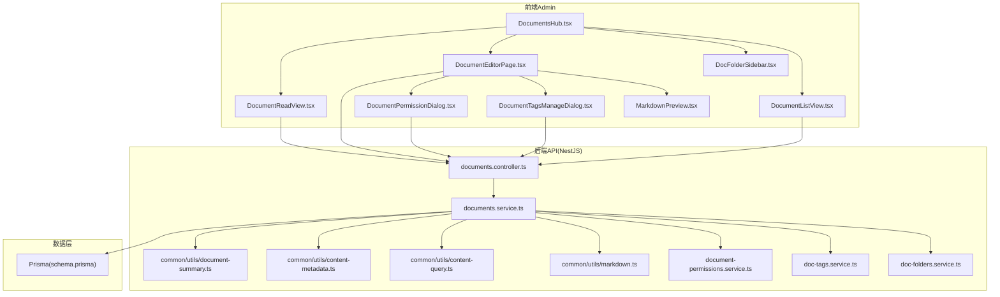

图表来源
- [documents.controller.ts](file://apps/api/src/documents/documents.controller.ts)
- [documents.service.ts](file://apps/api/src/documents/documents.service.ts)
- [doc-folders.service.ts](file://apps/api/src/documents/doc-folders.service.ts)
- [doc-tags.service.ts](file://apps/api/src/documents/doc-tags.service.ts)
- [document-permissions.service.ts](file://apps/api/src/documents/document-permissions.service.ts)
- [markdown.ts](file://apps/api/src/common/utils/markdown.ts)
- [content-query.ts](file://apps/api/src/common/utils/content-query.ts)
- [content-metadata.ts](file://apps/api/src/common/utils/content-metadata.ts)
- [document-summary.ts](file://apps/api/src/common/utils/document-summary.ts)
- [schema.prisma](file://apps/api/prisma/schema.prisma)

章节来源
- [documents.controller.ts](file://apps/api/src/documents/documents.controller.ts)
- [documents.service.ts](file://apps/api/src/documents/documents.service.ts)
- [DocumentsHub.tsx](file://apps/admin/src/components/documents/DocumentsHub.tsx)

## 核心组件
- 文档控制器（Controller）
  - 职责：接收并校验请求参数，路由到对应服务方法，返回标准化响应
  - 能力：文档CRUD、批量操作、权限设置、标签管理、文件夹操作、搜索与分页
- 文档服务（Service）
  - 职责：编排业务逻辑，协调文件夹、标签、权限、Markdown处理、摘要与元数据
  - 能力：版本化保存、变更审计、权限校验、全文检索、导出/导入、预览生成
- 文件夹服务
  - 职责：维护树形文件夹结构，支持移动、复制、重命名、层级校验
- 标签服务
  - 职责：标签的创建、关联、去重、统计与聚合
- 权限服务
  - 职责：基于用户/角色的细粒度访问控制，支持继承与覆盖
- Markdown 工具
  - 职责：安全渲染、语法高亮、图片处理、链接规范化、SEO元信息提取
- 查询与元数据工具
  - 职责：动态过滤、排序、分页、关键词匹配、摘要截取、时间范围筛选

章节来源
- [documents.controller.ts](file://apps/api/src/documents/documents.controller.ts)
- [documents.service.ts](file://apps/api/src/documents/documents.service.ts)
- [doc-folders.service.ts](file://apps/api/src/documents/doc-folders.service.ts)
- [doc-tags.service.ts](file://apps/api/src/documents/doc-tags.service.ts)
- [document-permissions.service.ts](file://apps/api/src/documents/document-permissions.service.ts)
- [markdown.ts](file://apps/api/src/common/utils/markdown.ts)
- [content-query.ts](file://apps/api/src/common/utils/content-query.ts)
- [content-metadata.ts](file://apps/api/src/common/utils/content-metadata.ts)
- [document-summary.ts](file://apps/api/src/common/utils/document-summary.ts)

## 架构总览
文档管理采用分层架构：
- 表现层（前端）：页面与组件负责用户交互与展示
- 接口层（控制器）：统一入口，参数校验与错误映射
- 业务层（服务）：核心逻辑编排，事务与一致性保障
- 数据层（Prisma）：持久化存储与关系建模

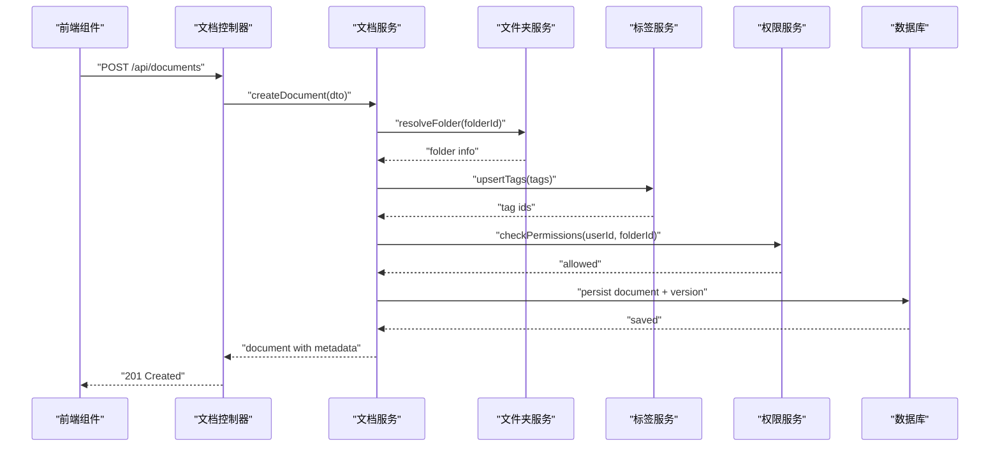

图表来源
- [documents.controller.ts](file://apps/api/src/documents/documents.controller.ts)
- [documents.service.ts](file://apps/api/src/documents/documents.service.ts)
- [doc-folders.service.ts](file://apps/api/src/documents/doc-folders.service.ts)
- [doc-tags.service.ts](file://apps/api/src/documents/doc-tags.service.ts)
- [document-permissions.service.ts](file://apps/api/src/documents/document-permissions.service.ts)

## 详细组件分析

### 文档实体设计与数据模型
- 文档实体
  - 字段：标题、内容（Markdown）、状态、作者、创建/更新时间、版本号、父文档（历史版本）、所属文件夹、语言、可见性
  - 索引：标题、标签、文件夹ID、更新时间用于快速检索与排序
- 文件夹实体
  - 字段：名称、父ID、路径、排序、可见性
  - 约束：循环引用检测、路径唯一性
- 标签实体
  - 字段：名称、分类、颜色、描述
  - 关系：多对多关联文档
- 权限实体
  - 字段：资源ID、主体（用户/角色）、动作（读/写/发布/删除）、是否继承
  - 策略：精确匹配优先，未命中则回退至文件夹或全局默认

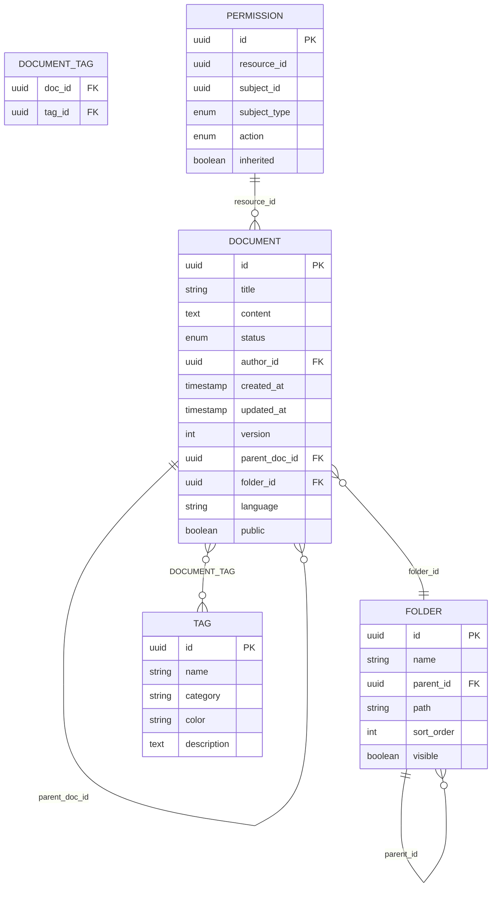

图表来源
- [schema.prisma](file://apps/api/prisma/schema.prisma)

章节来源
- [schema.prisma](file://apps/api/prisma/schema.prisma)

### 文件夹层级结构与导航
- 树形结构：支持多级嵌套，路径自动生成与校验
- 操作：新增、重命名、移动、复制、删除（含子节点级联）
- 前端：侧边栏递归渲染，选中态与懒加载

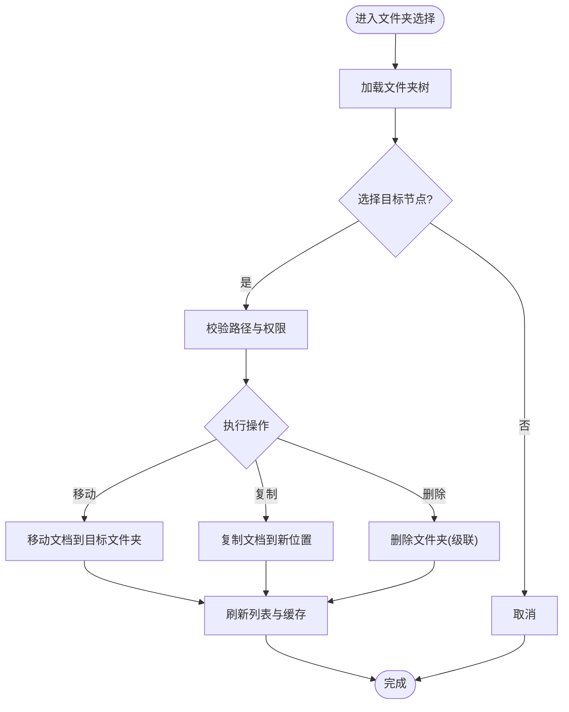

图表来源
- [doc-folders.service.ts](file://apps/api/src/documents/doc-folders.service.ts)
- [DocFolderSidebar.tsx](file://apps/admin/src/components/documents/DocFolderSidebar.tsx)

章节来源
- [doc-folders.service.ts](file://apps/api/src/documents/doc-folders.service.ts)
- [DocFolderSidebar.tsx](file://apps/admin/src/components/documents/DocFolderSidebar.tsx)

### 文档版本控制
- 版本策略：每次保存生成新版本，保留历史快照；支持回滚与对比
- 元数据：记录作者、时间戳、变更说明、来源（编辑/导入/迁移）
- 并发控制：乐观锁版本号，避免覆盖冲突

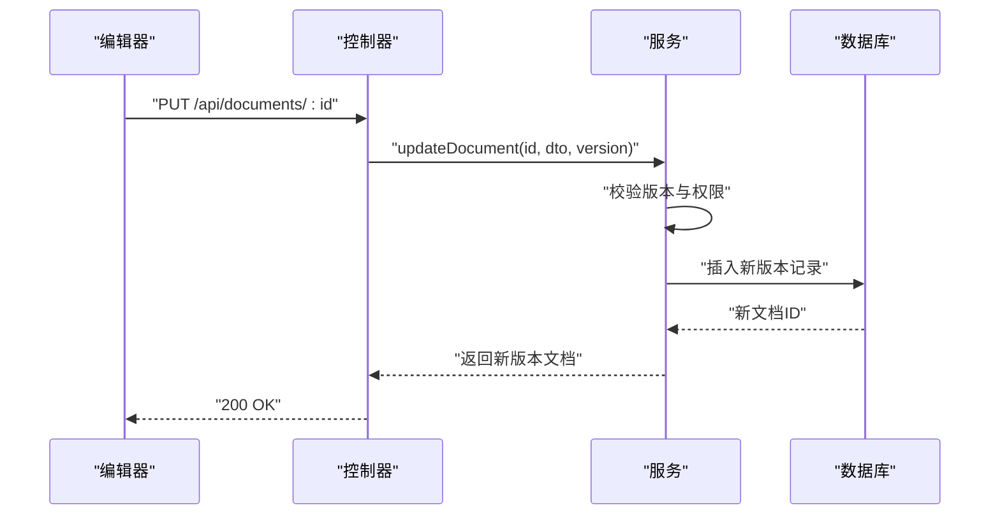

图表来源
- [documents.controller.ts](file://apps/api/src/documents/documents.controller.ts)
- [documents.service.ts](file://apps/api/src/documents/documents.service.ts)

章节来源
- [documents.controller.ts](file://apps/api/src/documents/documents.controller.ts)
- [documents.service.ts](file://apps/api/src/documents/documents.service.ts)

### 文档权限管理
- 权限模型：基于资源的细粒度授权，支持用户与角色
- 继承机制：文档可继承文件夹权限，也可单独覆盖
- 动作集：读取、编辑、发布、删除、分享、审计查看

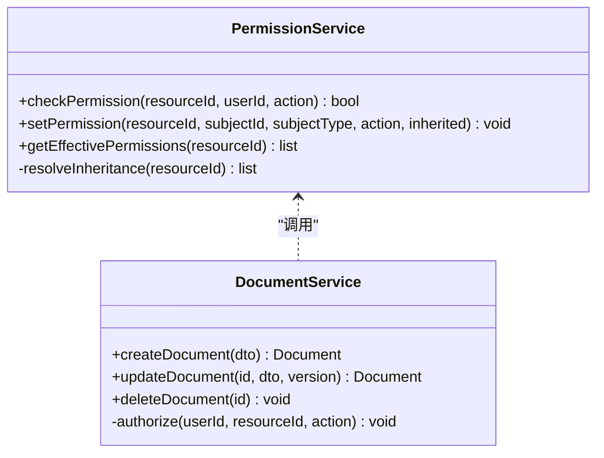

图表来源
- [document-permissions.service.ts](file://apps/api/src/documents/document-permissions.service.ts)
- [documents.service.ts](file://apps/api/src/documents/documents.service.ts)

章节来源
- [document-permissions.service.ts](file://apps/api/src/documents/document-permissions.service.ts)
- [documents.service.ts](file://apps/api/src/documents/documents.service.ts)

### Markdown内容处理与预览
- 安全渲染：白名单过滤、脚本移除、外链安全策略
- 增强能力：代码高亮、表格、数学公式、图片懒加载、内部锚点跳转
- 预览生成：服务端渲染HTML片段，前端按需渲染，减少首屏压力

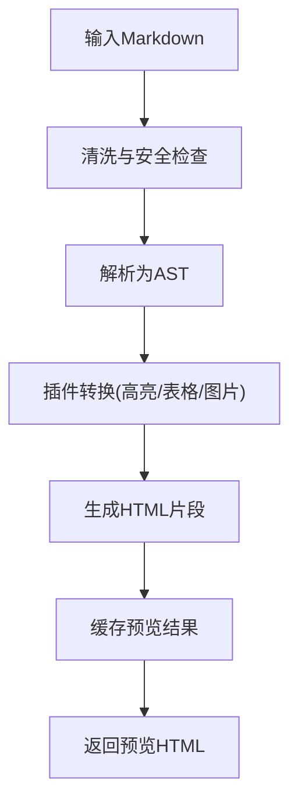

图表来源
- [markdown.ts](file://apps/api/src/common/utils/markdown.ts)
- [MarkdownPreview.tsx](file://apps/admin/src/components/documents/MarkdownPreview.tsx)

章节来源
- [markdown.ts](file://apps/api/src/common/utils/markdown.ts)
- [MarkdownPreview.tsx](file://apps/admin/src/components/documents/MarkdownPreview.tsx)

### 文档标签系统
- 标签管理：创建、编辑、删除、分类与颜色配置
- 关联策略：批量关联、去重、统计使用频率
- 前端：标签选择器、多选、搜索与自动补全

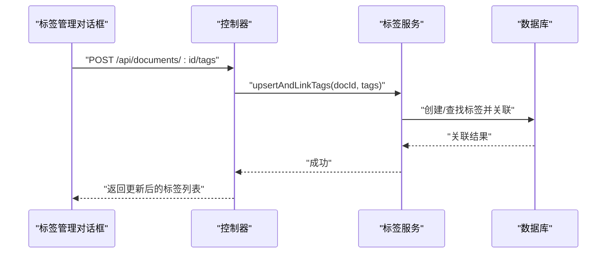

图表来源
- [doc-tags.service.ts](file://apps/api/src/documents/doc-tags.service.ts)
- [DocumentTagsManageDialog.tsx](file://apps/admin/src/components/documents/DocumentTagsManageDialog.tsx)

章节来源
- [doc-tags.service.ts](file://apps/api/src/documents/doc-tags.service.ts)
- [DocumentTagsManageDialog.tsx](file://apps/admin/src/components/documents/DocumentTagsManageDialog.tsx)

### 文档搜索功能
- 搜索维度：标题、正文、标签、作者、时间范围、文件夹
- 查询构建：动态条件组合、模糊匹配、权重排序
- 性能优化：分页、缓存热点查询、异步索引重建

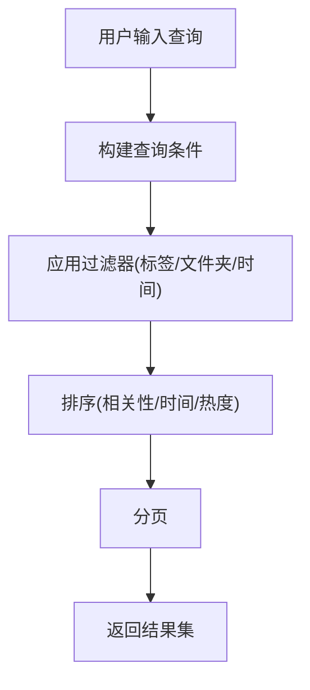

图表来源
- [content-query.ts](file://apps/api/src/common/utils/content-query.ts)
- [documents.controller.ts](file://apps/api/src/documents/documents.controller.ts)

章节来源
- [content-query.ts](file://apps/api/src/common/utils/content-query.ts)
- [documents.controller.ts](file://apps/api/src/documents/documents.controller.ts)

### 文档协作机制
- 实时协作：基于WebSocket的在线编辑与存在感知（可选扩展）
- 评论与批注：段落级批注、@提及、通知
- 冲突解决：差异合并、手动确认合并

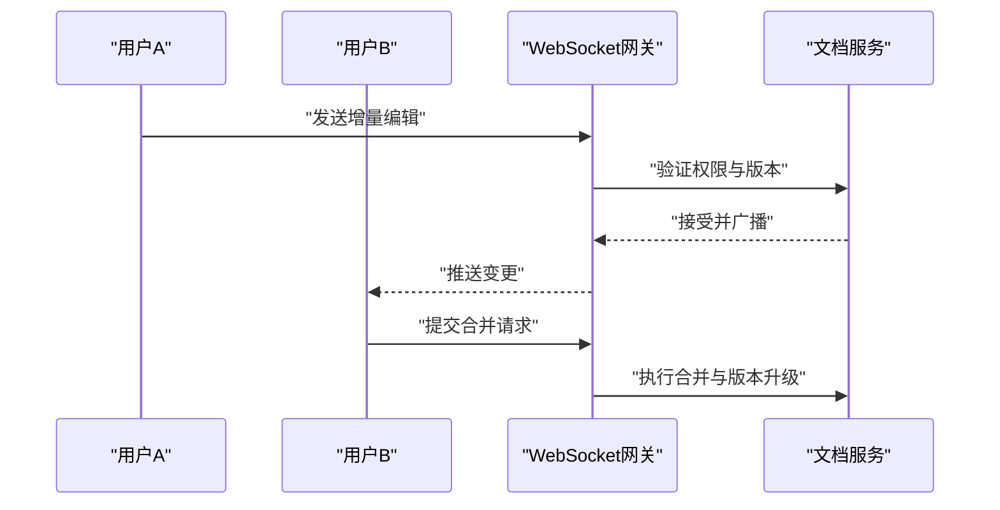

图表来源
- [documents.service.ts](file://apps/api/src/documents/documents.service.ts)

章节来源
- [documents.service.ts](file://apps/api/src/documents/documents.service.ts)

### 文档上传下载与格式转换
- 上传：分片上传、断点续传、病毒扫描（可选）
- 下载：流式传输、限速、防盗链签名
- 转换：Markdown转PDF/Word、图片压缩与格式转换、封面图生成

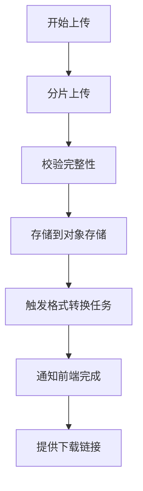

图表来源
- [documents.controller.ts](file://apps/api/src/documents/documents.controller.ts)
- [documents.service.ts](file://apps/api/src/documents/documents.service.ts)

章节来源
- [documents.controller.ts](file://apps/api/src/documents/documents.controller.ts)
- [documents.service.ts](file://apps/api/src/documents/documents.service.ts)

### 预览生成与性能优化
- 预览策略：服务端预渲染HTML片段，前端按需渲染，减少重复计算
- 缓存策略：Redis缓存热门文档预览与搜索结果，TTL与失效策略
- 懒加载：长文档分页渲染，图片懒加载与占位符
- 压缩与CDN：静态资源压缩、CDN分发、浏览器缓存头优化

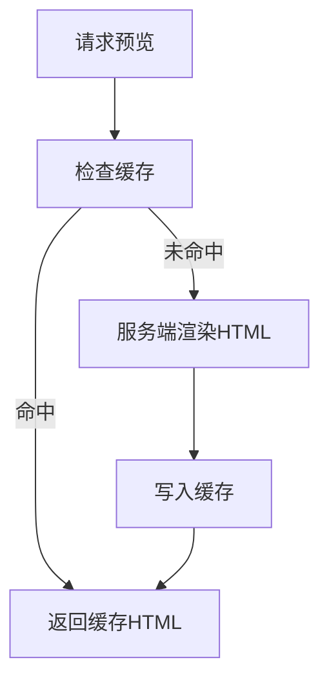

图表来源
- [document-summary.ts](file://apps/api/src/common/utils/document-summary.ts)
- [markdown.ts](file://apps/api/src/common/utils/markdown.ts)

章节来源
- [document-summary.ts](file://apps/api/src/common/utils/document-summary.ts)
- [markdown.ts](file://apps/api/src/common/utils/markdown.ts)

### 前端组件与交互
- DocumentsHub：文档中心入口，聚合列表、编辑器、阅读视图
- DocumentListView：列表展示、筛选、分页、批量操作
- DocumentEditorPage：Markdown编辑器、标签与权限设置、版本历史
- DocumentReadView：阅读模式、目录导航、评论与分享
- MarkdownPreview：预览渲染与交互
- DocumentTagsManageDialog：标签管理与关联
- DocumentPermissionDialog：权限设置与继承可视化

章节来源
- [DocumentsHub.tsx](file://apps/admin/src/components/documents/DocumentsHub.tsx)
- [DocumentListView.tsx](file://apps/admin/src/components/documents/DocumentListView.tsx)
- [DocumentEditorPage.tsx](file://apps/admin/src/components/documents/DocumentEditorPage.tsx)
- [DocumentReadView.tsx](file://apps/admin/src/components/documents/DocumentReadView.tsx)
- [MarkdownPreview.tsx](file://apps/admin/src/components/documents/MarkdownPreview.tsx)
- [DocumentTagsManageDialog.tsx](file://apps/admin/src/components/documents/DocumentTagsManageDialog.tsx)
- [DocumentPermissionDialog.tsx](file://apps/admin/src/components/documents/DocumentPermissionDialog.tsx)

## 依赖关系分析
- 控制器依赖服务：解耦业务逻辑，便于测试与扩展
- 服务间协作：文件夹、标签、权限服务被文档服务编排
- 工具库复用：Markdown、查询、元数据、摘要工具跨模块复用
- 数据层抽象：Prisma提供类型安全的数据库访问

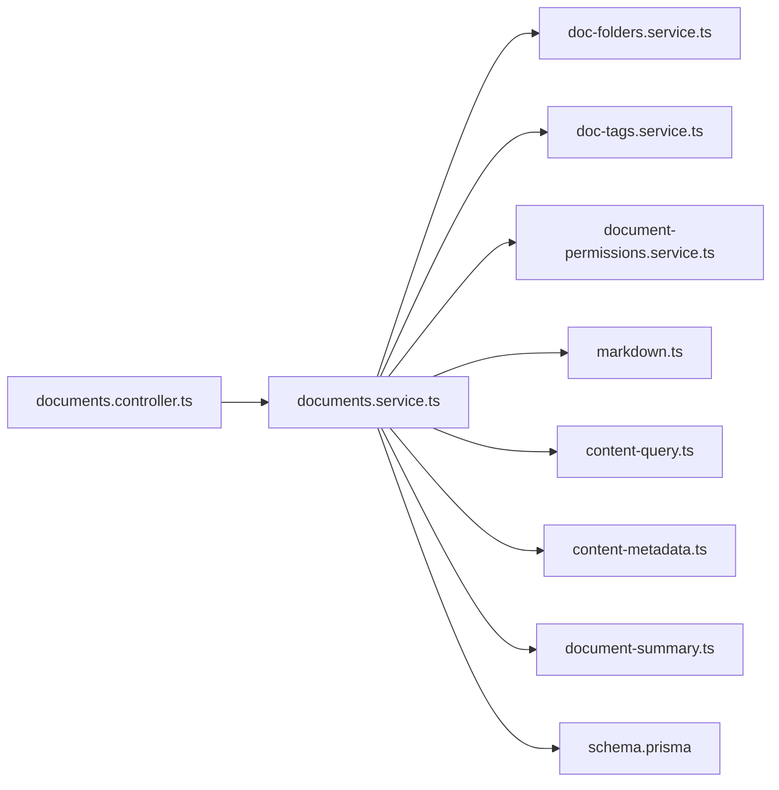

图表来源
- [documents.controller.ts](file://apps/api/src/documents/documents.controller.ts)
- [documents.service.ts](file://apps/api/src/documents/documents.service.ts)
- [doc-folders.service.ts](file://apps/api/src/documents/doc-folders.service.ts)
- [doc-tags.service.ts](file://apps/api/src/documents/doc-tags.service.ts)
- [document-permissions.service.ts](file://apps/api/src/documents/document-permissions.service.ts)
- [markdown.ts](file://apps/api/src/common/utils/markdown.ts)
- [content-query.ts](file://apps/api/src/common/utils/content-query.ts)
- [content-metadata.ts](file://apps/api/src/common/utils/content-metadata.ts)
- [document-summary.ts](file://apps/api/src/common/utils/document-summary.ts)
- [schema.prisma](file://apps/api/prisma/schema.prisma)

章节来源
- [documents.controller.ts](file://apps/api/src/documents/documents.controller.ts)
- [documents.service.ts](file://apps/api/src/documents/documents.service.ts)

## 性能考虑
- 查询优化：合理使用索引、避免N+1查询、分页与游标
- 缓存策略：热点数据缓存、结果集缓存、预览片段缓存
- 渲染优化：服务端SSR与客户端CSR结合、懒加载与虚拟滚动
- I/O优化：对象存储直传、CDN加速、压缩与HTTP/2
- 并发控制：乐观锁、限流与熔断、队列异步处理耗时任务

[本节为通用指导，不直接分析具体文件]

## 故障排查指南
- 常见问题
  - 权限拒绝：检查用户角色与资源权限继承
  - 版本冲突：确认客户端版本号与服务端最新一致
  - Markdown渲染异常：检查白名单与插件配置
  - 搜索无结果：确认索引状态与查询条件
- 调试建议
  - 启用请求日志与审计日志
  - 使用单元测试与集成测试覆盖关键路径
  - 监控指标：QPS、延迟、错误率、缓存命中率

章节来源
- [documents.controller.ts](file://apps/api/src/documents/documents.controller.ts)
- [documents.service.ts](file://apps/api/src/documents/documents.service.ts)

## 结论
文档管理模块以清晰的分层架构与完善的业务能力，支撑企业级文档的全生命周期管理。通过版本控制、权限体系、Markdown处理、标签与搜索、协作与预览等功能，满足复杂场景需求。未来可扩展实时协作、AI辅助写作与智能检索，进一步提升效率与体验。

[本节为总结性内容，不直接分析具体文件]

## 附录
- API参考：文档CRUD、权限设置、标签管理、搜索与分页
- 前端特性：统一API封装、状态管理、组件复用
- 部署与运维：容器化、环境变量、监控与告警

[本节为补充信息，不直接分析具体文件]