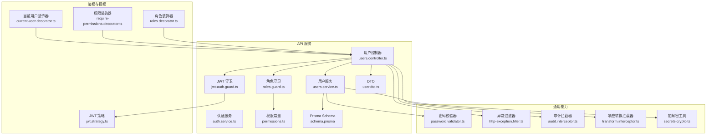
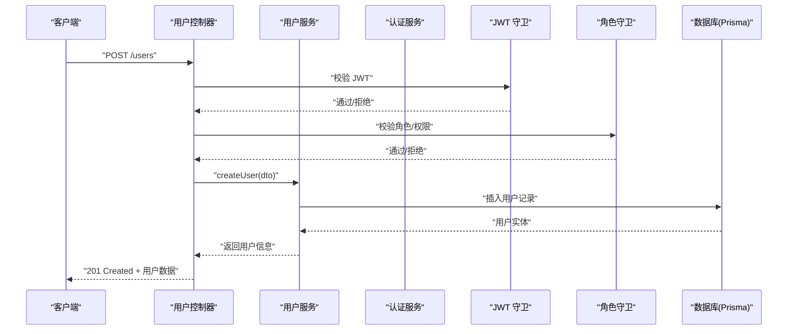
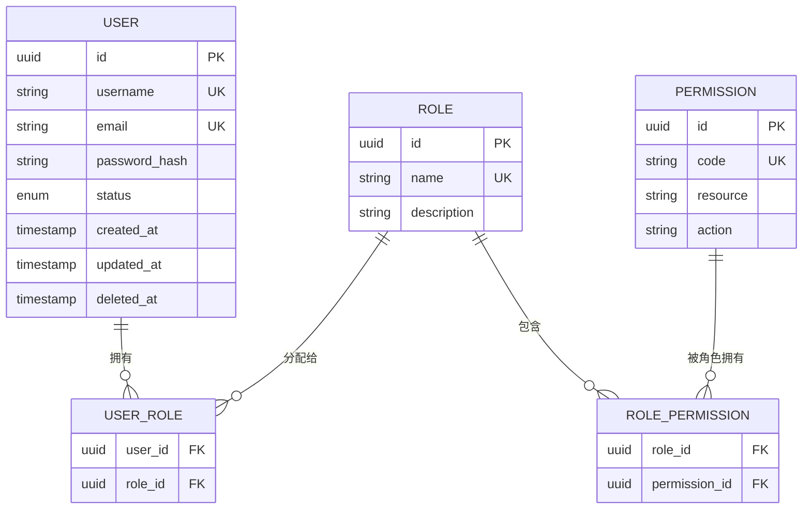
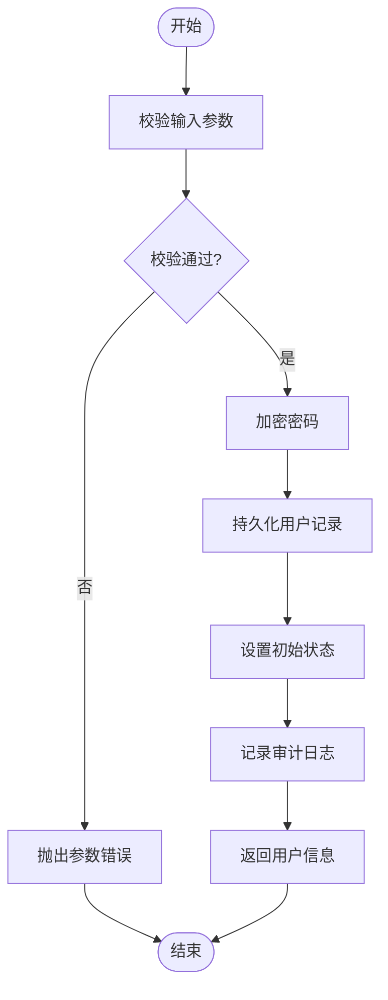
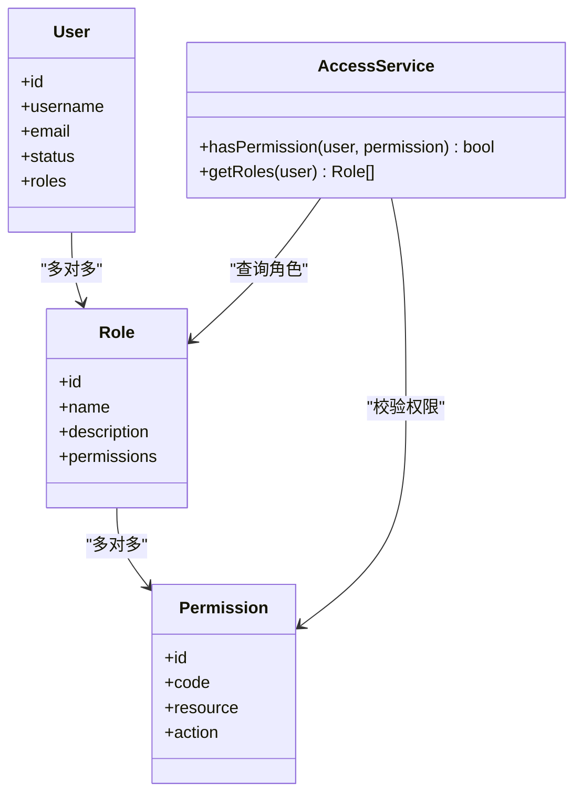
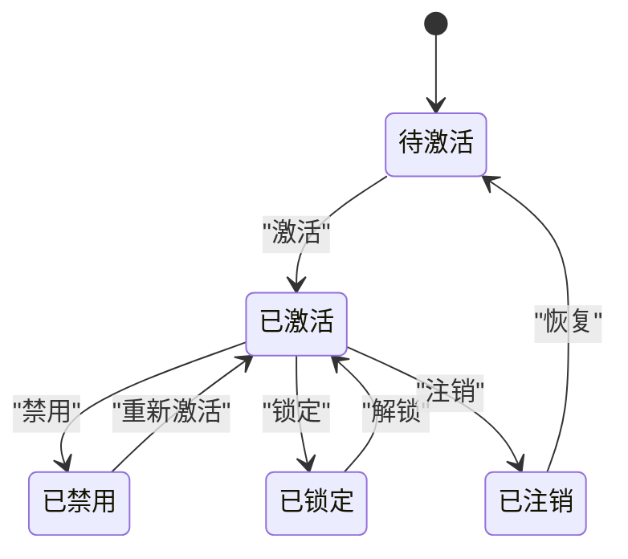
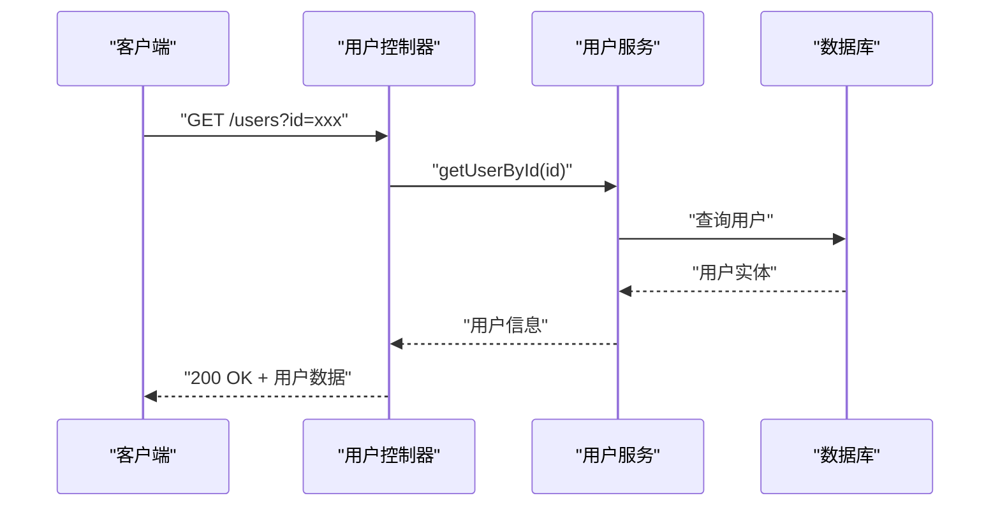
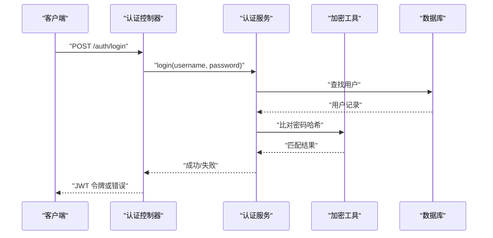
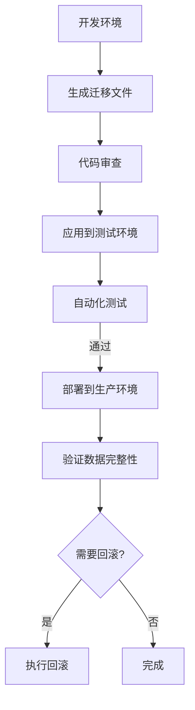
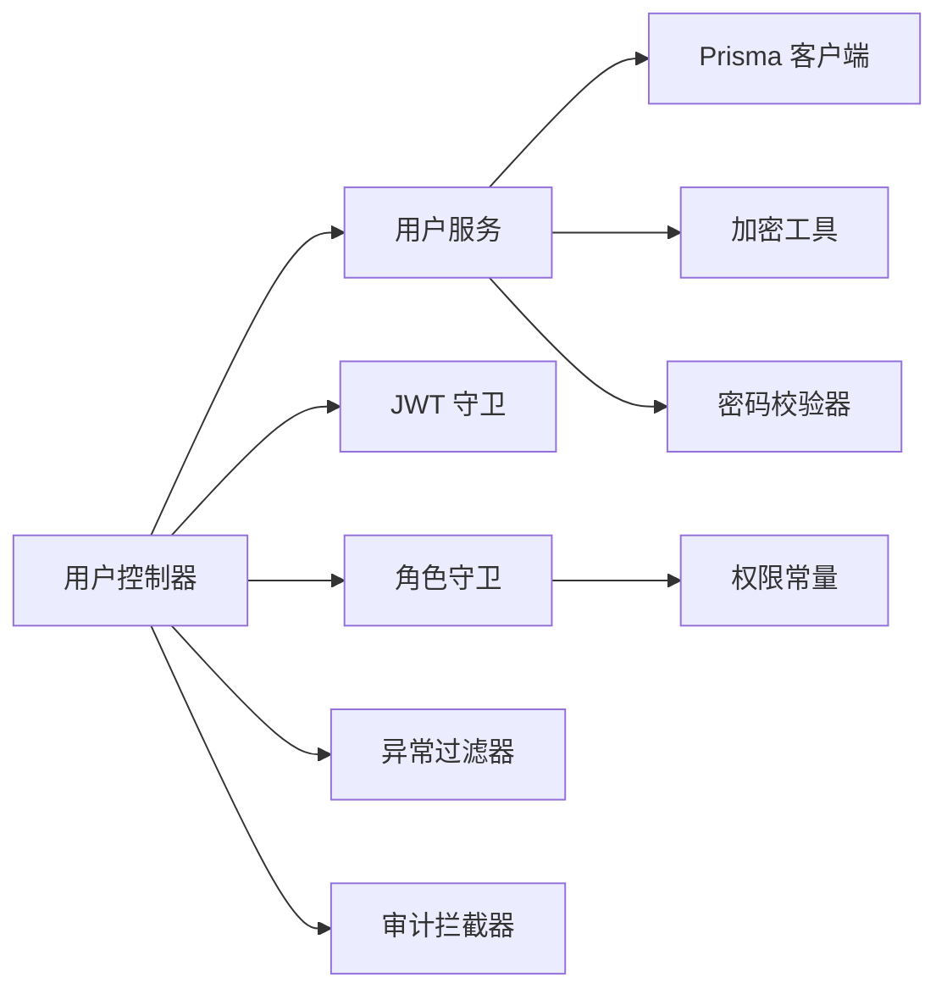

# 用户管理模块

<cite>
**本文引用的文件**   
- [users.controller.ts](file://apps/api/src/users/users.controller.ts)
- [users.service.ts](file://apps/api/src/users/users.service.ts)
- [user.dto.ts](file://apps/api/src/users/dto/user.dto.ts)
- [auth.controller.ts](file://apps/api/src/auth/auth.controller.ts)
- [auth.service.ts](file://apps/api/src/auth/auth.service.ts)
- [jwt.strategy.ts](file://apps/api/src/auth/strategies/jwt.strategy.ts)
- [jwt-auth.guard.ts](file://apps/api/src/auth/guards/jwt-auth.guard.ts)
- [roles.guard.ts](file://apps/api/src/auth/guards/roles.guard.ts)
- [current-user.decorator.ts](file://apps/api/src/auth/decorators/current-user.decorator.ts)
- [require-permissions.decorator.ts](file://apps/api/src/auth/decorators/require-permissions.decorator.ts)
- [roles.decorator.ts](file://apps/api/src/auth/decorators/roles.decorator.ts)
- [access.controller.ts](file://apps/api/src/access/access.controller.ts)
- [access.service.ts](file://apps/api/src/access/access.service.ts)
- [roles.service.ts](file://apps/api/src/access/roles.service.ts)
- [permissions.ts](file://apps/api/src/access/permissions.ts)
- [schema.prisma](file://apps/api/prisma/schema.prisma)
- [env.validation.ts](file://apps/api/src/config/env.validation.ts)
- [secrets-crypto.ts](file://apps/api/src/common/crypto/secrets-crypto.ts)
- [password.validator.ts](file://apps/api/src/common/validators/password.validator.ts)
- [http-exception.filter.ts](file://apps/api/src/common/filters/http-exception.filter.ts)
- [audit.interceptor.ts](file://apps/api/src/common/interceptors/audit.interceptor.ts)
- [transform.interceptor.ts](file://apps/api/src/common/interceptors/transform.interceptor.ts)
- [seed.ts](file://apps/api/src/seed/seed.ts)
- [seed-roles.ts](file://apps/api/scripts/seed-roles.ts)
- [migrate-deprecated-roles.ts](file://apps/api/scripts/migrate-deprecated-roles.ts)
- [prune-deprecated-permissions.ts](file://apps/api/scripts/prune-deprecated-permissions.ts)
</cite>

## 目录
1. [简介](#简介)
2. [项目结构](#项目结构)
3. [核心组件](#核心组件)
4. [架构总览](#架构总览)
5. [详细组件分析](#详细组件分析)
6. [依赖关系分析](#依赖关系分析)
7. [性能考虑](#性能考虑)
8. [故障排查指南](#故障排查指南)
9. [结论](#结论)
10. [附录](#附录)

## 简介
本文件围绕“用户管理模块”进行系统化文档化，覆盖用户实体设计、生命周期管理、角色权限集成、状态管理、CRUD 操作、密码加密存储、验证流程与数据迁移策略。同时给出业务规则、数据校验与错误处理机制，并提供最佳实践与扩展指南，帮助开发者快速理解并安全地扩展该模块。

## 项目结构
用户管理模块位于后端 NestJS 应用中，采用分层架构：控制器负责 HTTP 接口，服务层封装业务逻辑，DTO 定义输入输出契约，鉴权与授权通过 Guard/装饰器实现，数据库模型由 Prisma 管理，迁移脚本与种子数据在 scripts 与 prisma 目录下维护。前端 Admin 应用通过 API 路由访问用户管理功能。

图表来源
- [users.controller.ts](file://apps/api/src/users/users.controller.ts)
- [users.service.ts](file://apps/api/src/users/users.service.ts)
- [user.dto.ts](file://apps/api/src/users/dto/user.dto.ts)
- [auth.service.ts](file://apps/api/src/auth/auth.service.ts)
- [jwt.strategy.ts](file://apps/api/src/auth/strategies/jwt.strategy.ts)
- [jwt-auth.guard.ts](file://apps/api/src/auth/guards/jwt-auth.guard.ts)
- [roles.guard.ts](file://apps/api/src/auth/guards/roles.guard.ts)
- [permissions.ts](file://apps/api/src/access/permissions.ts)
- [password.validator.ts](file://apps/api/src/common/validators/password.validator.ts)
- [http-exception.filter.ts](file://apps/api/src/common/filters/http-exception.filter.ts)
- [audit.interceptor.ts](file://apps/api/src/common/interceptors/audit.interceptor.ts)
- [transform.interceptor.ts](file://apps/api/src/common/interceptors/transform.interceptor.ts)
- [secrets-crypto.ts](file://apps/api/src/common/crypto/secrets-crypto.ts)
- [schema.prisma](file://apps/api/prisma/schema.prisma)

章节来源
- [users.controller.ts](file://apps/api/src/users/users.controller.ts)
- [users.service.ts](file://apps/api/src/users/users.service.ts)
- [user.dto.ts](file://apps/api/src/users/dto/user.dto.ts)
- [schema.prisma](file://apps/api/prisma/schema.prisma)

## 核心组件
- 用户控制器：暴露用户相关的 REST 接口（创建、查询、更新、删除、批量操作等），统一鉴权与授权入口。
- 用户服务：封装用户领域逻辑，包括用户生命周期、密码处理、状态流转、与角色的关联、审计记录等。
- DTO：定义用户输入输出的数据结构与校验规则。
- 鉴权与授权：基于 JWT 的无状态认证，结合角色与权限控制访问。
- 数据模型：通过 Prisma 管理用户表结构与关系。
- 通用能力：密码校验、异常过滤、审计与响应转换、加解密工具。

章节来源
- [users.controller.ts](file://apps/api/src/users/users.controller.ts)
- [users.service.ts](file://apps/api/src/users/users.service.ts)
- [user.dto.ts](file://apps/api/src/users/dto/user.dto.ts)
- [jwt.strategy.ts](file://apps/api/src/auth/strategies/jwt.strategy.ts)
- [jwt-auth.guard.ts](file://apps/api/src/auth/guards/jwt-auth.guard.ts)
- [roles.guard.ts](file://apps/api/src/auth/guards/roles.guard.ts)
- [permissions.ts](file://apps/api/src/access/permissions.ts)
- [password.validator.ts](file://apps/api/src/common/validators/password.validator.ts)
- [http-exception.filter.ts](file://apps/api/src/common/filters/http-exception.filter.ts)
- [audit.interceptor.ts](file://apps/api/src/common/interceptors/audit.interceptor.ts)
- [transform.interceptor.ts](file://apps/api/src/common/interceptors/transform.interceptor.ts)
- [secrets-crypto.ts](file://apps/api/src/common/crypto/secrets-crypto.ts)
- [schema.prisma](file://apps/api/prisma/schema.prisma)

## 架构总览
用户管理模块遵循典型的 NestJS 分层模式：
- 控制器层：接收请求、参数校验、调用服务、返回响应。
- 服务层：业务编排、事务控制、事件触发、审计记录。
- 鉴权层：JWT 签发与校验、角色与权限检查。
- 数据层：Prisma ORM 与数据库迁移。
- 通用层：异常处理、审计、响应转换、加密工具。

图表来源
- [users.controller.ts](file://apps/api/src/users/users.controller.ts)
- [users.service.ts](file://apps/api/src/users/users.service.ts)
- [jwt-auth.guard.ts](file://apps/api/src/auth/guards/jwt-auth.guard.ts)
- [roles.guard.ts](file://apps/api/src/auth/guards/roles.guard.ts)
- [schema.prisma](file://apps/api/prisma/schema.prisma)

## 详细组件分析

### 用户实体设计与数据模型
- 用户实体字段涵盖身份标识、登录名、邮箱、密码哈希、状态、角色关联、时间戳等。
- 使用 Prisma 定义表结构与关系，确保类型安全与一致性。
- 支持软删除或状态标记以保留审计轨迹。

图表来源
- [schema.prisma](file://apps/api/prisma/schema.prisma)

章节来源
- [schema.prisma](file://apps/api/prisma/schema.prisma)

### 用户生命周期管理
- 创建：校验输入、生成唯一标识、加密密码、设置默认状态、写入数据库、记录审计。
- 读取：按条件查询、分页排序、敏感字段脱敏。
- 更新：增量更新、并发控制（版本号或时间戳）、变更审计。
- 删除：软删除或硬删除策略，级联清理或保留审计。
- 状态流转：激活、禁用、锁定、注销等状态机，确保业务规则一致。

图表来源
- [users.service.ts](file://apps/api/src/users/users.service.ts)
- [password.validator.ts](file://apps/api/src/common/validators/password.validator.ts)
- [secrets-crypto.ts](file://apps/api/src/common/crypto/secrets-crypto.ts)
- [audit.interceptor.ts](file://apps/api/src/common/interceptors/audit.interceptor.ts)

章节来源
- [users.service.ts](file://apps/api/src/users/users.service.ts)
- [password.validator.ts](file://apps/api/src/common/validators/password.validator.ts)
- [secrets-crypto.ts](file://apps/api/src/common/crypto/secrets-crypto.ts)
- [audit.interceptor.ts](file://apps/api/src/common/interceptors/audit.interceptor.ts)

### 角色权限集成
- 角色与权限模型分离，支持多对多关系。
- 通过装饰器与守卫实现细粒度访问控制。
- 提供权限常量与策略配置，便于扩展与维护。

图表来源
- [permissions.ts](file://apps/api/src/access/permissions.ts)
- [access.service.ts](file://apps/api/src/access/access.service.ts)
- [roles.service.ts](file://apps/api/src/access/roles.service.ts)
- [roles.guard.ts](file://apps/api/src/auth/guards/roles.guard.ts)
- [require-permissions.decorator.ts](file://apps/api/src/auth/decorators/require-permissions.decorator.ts)
- [roles.decorator.ts](file://apps/api/src/auth/decorators/roles.decorator.ts)

章节来源
- [permissions.ts](file://apps/api/src/access/permissions.ts)
- [access.service.ts](file://apps/api/src/access/access.service.ts)
- [roles.service.ts](file://apps/api/src/access/roles.service.ts)
- [roles.guard.ts](file://apps/api/src/auth/guards/roles.guard.ts)
- [require-permissions.decorator.ts](file://apps/api/src/auth/decorators/require-permissions.decorator.ts)
- [roles.decorator.ts](file://apps/api/src/auth/decorators/roles.decorator.ts)

### 用户状态管理
- 状态枚举定义用户可用状态（如激活、禁用、锁定）。
- 状态变更需满足前置条件与业务规则。
- 状态变更触发审计与通知（可选）。

图表来源
- [users.service.ts](file://apps/api/src/users/users.service.ts)
- [schema.prisma](file://apps/api/prisma/schema.prisma)

章节来源
- [users.service.ts](file://apps/api/src/users/users.service.ts)
- [schema.prisma](file://apps/api/prisma/schema.prisma)

### 用户 CRUD 操作
- 创建用户：校验唯一性、密码强度、默认角色分配。
- 查询用户：支持筛选、分页、排序、字段投影。
- 更新用户：字段级更新、冲突检测、审计记录。
- 删除用户：软删除优先，级联清理策略明确。

图表来源
- [users.controller.ts](file://apps/api/src/users/users.controller.ts)
- [users.service.ts](file://apps/api/src/users/users.service.ts)
- [schema.prisma](file://apps/api/prisma/schema.prisma)

章节来源
- [users.controller.ts](file://apps/api/src/users/users.controller.ts)
- [users.service.ts](file://apps/api/src/users/users.service.ts)

### 密码加密存储与验证流程
- 密码加密：使用安全的哈希算法（如 bcrypt）与盐值。
- 密码校验：强度规则、历史重复检查、过期策略。
- 登录流程：用户名/邮箱查找、密码比对、生成 JWT、刷新令牌。

图表来源
- [auth.controller.ts](file://apps/api/src/auth/auth.controller.ts)
- [auth.service.ts](file://apps/api/src/auth/auth.service.ts)
- [secrets-crypto.ts](file://apps/api/src/common/crypto/secrets-crypto.ts)
- [password.validator.ts](file://apps/api/src/common/validators/password.validator.ts)

章节来源
- [auth.controller.ts](file://apps/api/src/auth/auth.controller.ts)
- [auth.service.ts](file://apps/api/src/auth/auth.service.ts)
- [secrets-crypto.ts](file://apps/api/src/common/crypto/secrets-crypto.ts)
- [password.validator.ts](file://apps/api/src/common/validators/password.validator.ts)

### 用户数据迁移策略
- 使用 Prisma Migrate 管理版本化迁移。
- 提供回滚与向前兼容策略。
- 种子数据用于初始化角色与权限。

图表来源
- [schema.prisma](file://apps/api/prisma/schema.prisma)
- [seed-roles.ts](file://apps/api/scripts/seed-roles.ts)
- [migrate-deprecated-roles.ts](file://apps/api/scripts/migrate-deprecated-roles.ts)
- [prune-deprecated-permissions.ts](file://apps/api/scripts/prune-deprecated-permissions.ts)

章节来源
- [schema.prisma](file://apps/api/prisma/schema.prisma)
- [seed-roles.ts](file://apps/api/scripts/seed-roles.ts)
- [migrate-deprecated-roles.ts](file://apps/api/scripts/migrate-deprecated-roles.ts)
- [prune-deprecated-permissions.ts](file://apps/api/scripts/prune-deprecated-permissions.ts)

### 业务规则、数据验证与错误处理
- 业务规则：唯一性约束、状态机约束、角色权限最小化原则。
- 数据验证：DTO 校验、自定义校验器、输入清洗。
- 错误处理：统一异常过滤器、HTTP 状态码规范、审计日志。

章节来源
- [user.dto.ts](file://apps/api/src/users/dto/user.dto.ts)
- [password.validator.ts](file://apps/api/src/common/validators/password.validator.ts)
- [http-exception.filter.ts](file://apps/api/src/common/filters/http-exception.filter.ts)
- [audit.interceptor.ts](file://apps/api/src/common/interceptors/audit.interceptor.ts)

### 最佳实践与扩展指南
- 安全实践：强密码策略、定期轮换密钥、最小权限原则。
- 可观测性：审计日志、指标采集、错误追踪。
- 可扩展性：插件化权限策略、异步任务队列、缓存策略。
- 测试策略：单元测试、集成测试、端到端测试。

[本节为通用指导，不直接分析具体文件]

## 依赖关系分析
用户管理模块依赖鉴权、权限、数据库与通用能力模块，形成清晰的依赖边界。

图表来源
- [users.controller.ts](file://apps/api/src/users/users.controller.ts)
- [users.service.ts](file://apps/api/src/users/users.service.ts)
- [jwt-auth.guard.ts](file://apps/api/src/auth/guards/jwt-auth.guard.ts)
- [roles.guard.ts](file://apps/api/src/auth/guards/roles.guard.ts)
- [permissions.ts](file://apps/api/src/access/permissions.ts)
- [secrets-crypto.ts](file://apps/api/src/common/crypto/secrets-crypto.ts)
- [password.validator.ts](file://apps/api/src/common/validators/password.validator.ts)
- [http-exception.filter.ts](file://apps/api/src/common/filters/http-exception.filter.ts)
- [audit.interceptor.ts](file://apps/api/src/common/interceptors/audit.interceptor.ts)

章节来源
- [users.controller.ts](file://apps/api/src/users/users.controller.ts)
- [users.service.ts](file://apps/api/src/users/users.service.ts)
- [jwt-auth.guard.ts](file://apps/api/src/auth/guards/jwt-auth.guard.ts)
- [roles.guard.ts](file://apps/api/src/auth/guards/roles.guard.ts)
- [permissions.ts](file://apps/api/src/access/permissions.ts)
- [secrets-crypto.ts](file://apps/api/src/common/crypto/secrets-crypto.ts)
- [password.validator.ts](file://apps/api/src/common/validators/password.validator.ts)
- [http-exception.filter.ts](file://apps/api/src/common/filters/http-exception.filter.ts)
- [audit.interceptor.ts](file://apps/api/src/common/interceptors/audit.interceptor.ts)

## 性能考虑
- 数据库查询优化：索引设计、分页与投影、避免 N+1 查询。
- 缓存策略：用户信息缓存、权限缓存、会话缓存。
- 异步处理：邮件通知、审计日志写入异步化。
- 资源限制：限流、超时、重试策略。

[本节为通用指导，不直接分析具体文件]

## 故障排查指南
- 常见问题：登录失败、权限不足、数据不一致、迁移失败。
- 诊断方法：查看审计日志、异常堆栈、数据库锁与慢查询。
- 修复建议：回滚迁移、重置状态、清理缓存、调整权限。

章节来源
- [http-exception.filter.ts](file://apps/api/src/common/filters/http-exception.filter.ts)
- [audit.interceptor.ts](file://apps/api/src/common/interceptors/audit.interceptor.ts)
- [env.validation.ts](file://apps/api/src/config/env.validation.ts)

## 结论
用户管理模块通过清晰的分层架构、严格的鉴权与授权机制、完善的密码安全与数据迁移策略，提供了稳定可靠的用戶管理能力。遵循本文档的最佳实践与扩展指南，可进一步提升系统的安全性、可维护性与可扩展性。

[本节为总结性内容，不直接分析具体文件]

## 附录
- 环境变量与安全配置：参考环境验证模块。
- 种子数据与初始化：参考种子脚本。
- 权限与角色管理：参考访问控制模块。

章节来源
- [env.validation.ts](file://apps/api/src/config/env.validation.ts)
- [seed.ts](file://apps/api/src/seed/seed.ts)
- [access.controller.ts](file://apps/api/src/access/access.controller.ts)
- [access.service.ts](file://apps/api/src/access/access.service.ts)
- [roles.service.ts](file://apps/api/src/access/roles.service.ts)