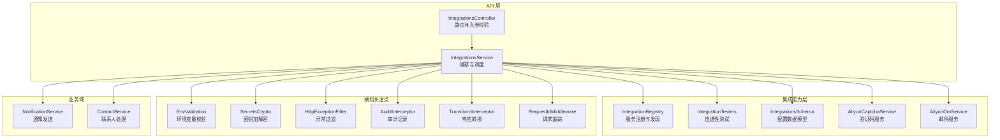
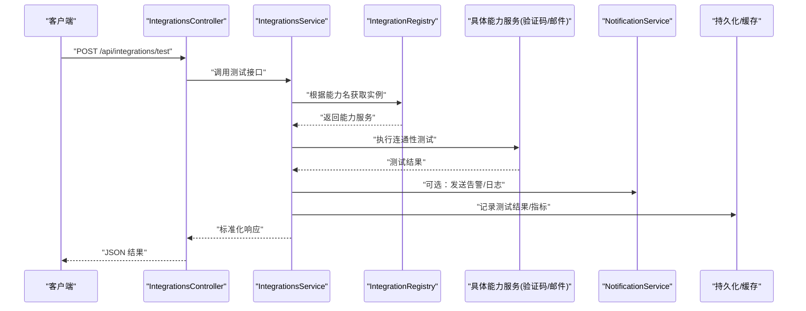
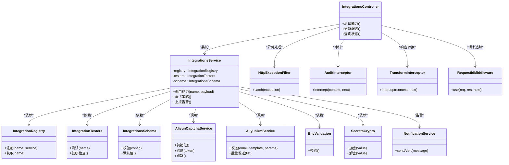

# 第三方集成模块

<cite>
**本文引用的文件**   
- [integrations.module.ts](file://apps/api/src/integrations/integrations.module.ts)
- [integrations.controller.ts](file://apps/api/src/integrations/integrations.controller.ts)
- [integrations.service.ts](file://apps/api/src/integrations/integrations.service.ts)
- [integration.registry.ts](file://apps/api/src/integrations/integration.registry.ts)
- [integration.testers.ts](file://apps/api/src/integrations/integration.testers.ts)
- [integrations.schema.ts](file://apps/api/src/integrations/integrations.schema.ts)
- [aliyun-captcha.service.ts](file://apps/api/src/integrations/aliyun-captcha.service.ts)
- [aliyun-dm.service.ts](file://apps/api/src/integrations/aliyun-dm.service.ts)
- [env.validation.ts](file://apps/api/src/config/env.validation.ts)
- [secrets-crypto.ts](file://apps/api/src/common/crypto/secrets-crypto.ts)
- [http-exception.filter.ts](file://apps/api/src/common/filters/http-exception.filter.ts)
- [audit.interceptor.ts](file://apps/api/src/common/interceptors/audit.interceptor.ts)
- [transform.interceptor.ts](file://apps/api/src/common/interceptors/transform.interceptor.ts)
- [request-id.middleware.ts](file://apps/api/src/common/middleware/request-id.middleware.ts)
- [notification.service.ts](file://apps/api/src/notifications/notification.service.ts)
- [contact.service.ts](file://apps/api/src/contact/contact.service.ts)
</cite>

## 目录
1. [简介](#简介)
2. [项目结构](#项目结构)
3. [核心组件](#核心组件)
4. [架构总览](#架构总览)
5. [详细组件分析](#详细组件分析)
6. [依赖关系分析](#依赖关系分析)
7. [性能考量](#性能考量)
8. [故障排查指南](#故障排查指南)
9. [结论](#结论)
10. [附录](#附录)

## 简介
本文件面向“第三方集成模块”的架构与实现，聚焦以下目标：
- 统一的服务注册机制与配置管理
- 阿里云验证码、邮件服务等第三方服务的集成方式
- API 密钥管理、请求重试、限流控制与监控告警策略
- 新增第三方服务集成的开发规范与最佳实践

该模块基于 NestJS 构建，采用模块化设计，通过统一的控制器、服务、注册表与校验器，将外部能力抽象为可插拔的能力单元，便于扩展与维护。

## 项目结构
第三方集成模块位于后端应用 apps/api/src/integrations 下，围绕“控制器-服务-注册表-测试器-数据模型”分层组织，并与通知、联系人等业务域协作。

图表来源
- [integrations.controller.ts](file://apps/api/src/integrations/integrations.controller.ts)
- [integrations.service.ts](file://apps/api/src/integrations/integrations.service.ts)
- [integration.registry.ts](file://apps/api/src/integrations/integration.registry.ts)
- [integration.testers.ts](file://apps/api/src/integrations/integration.testers.ts)
- [integrations.schema.ts](file://apps/api/src/integrations/integrations.schema.ts)
- [aliyun-captcha.service.ts](file://apps/api/src/integrations/aliyun-captcha.service.ts)
- [aliyun-dm.service.ts](file://apps/api/src/integrations/aliyun-dm.service.ts)
- [env.validation.ts](file://apps/api/src/config/env.validation.ts)
- [secrets-crypto.ts](file://apps/api/src/common/crypto/secrets-crypto.ts)
- [http-exception.filter.ts](file://apps/api/src/common/filters/http-exception.filter.ts)
- [audit.interceptor.ts](file://apps/api/src/common/interceptors/audit.interceptor.ts)
- [transform.interceptor.ts](file://apps/api/src/common/interceptors/transform.interceptor.ts)
- [request-id.middleware.ts](file://apps/api/src/common/middleware/request-id.middleware.ts)
- [notification.service.ts](file://apps/api/src/notifications/notification.service.ts)
- [contact.service.ts](file://apps/api/src/contact/contact.service.ts)

章节来源
- [integrations.module.ts](file://apps/api/src/integrations/integrations.module.ts)
- [integrations.controller.ts](file://apps/api/src/integrations/integrations.controller.ts)
- [integrations.service.ts](file://apps/api/src/integrations/integrations.service.ts)
- [integration.registry.ts](file://apps/api/src/integrations/integration.registry.ts)
- [integration.testers.ts](file://apps/api/src/integrations/integration.testers.ts)
- [integrations.schema.ts](file://apps/api/src/integrations/integrations.schema.ts)
- [aliyun-captcha.service.ts](file://apps/api/src/integrations/aliyun-captcha.service.ts)
- [aliyun-dm.service.ts](file://apps/api/src/integrations/aliyun-dm.service.ts)
- [env.validation.ts](file://apps/api/src/config/env.validation.ts)
- [secrets-crypto.ts](file://apps/api/src/common/crypto/secrets-crypto.ts)
- [http-exception.filter.ts](file://apps/api/src/common/filters/http-exception.filter.ts)
- [audit.interceptor.ts](file://apps/api/src/common/interceptors/audit.interceptor.ts)
- [transform.interceptor.ts](file://apps/api/src/common/interceptors/transform.interceptor.ts)
- [request-id.middleware.ts](file://apps/api/src/common/middleware/request-id.middleware.ts)
- [notification.service.ts](file://apps/api/src/notifications/notification.service.ts)
- [contact.service.ts](file://apps/api/src/contact/contact.service.ts)

## 核心组件
- IntegrationsController：对外暴露集成能力的 HTTP 接口，负责参数校验、鉴权与响应包装。
- IntegrationsService：集成编排中心，协调注册表、测试器、具体服务（如验证码、邮件）与配置模型。
- IntegrationRegistry：集中注册与发现各第三方能力，支持按名称或类型查询。
- IntegrationTesters：提供连通性检测、健康检查与能力探测方法。
- IntegrationsSchema：定义配置的 JSON Schema，用于运行时校验与前端表单生成。
- AliyunCaptchaService：封装阿里云验证码 SDK/HTTP 调用，包含签名、重试与错误映射。
- AliyunDmService：封装阿里云邮件推送服务，包含模板渲染、批量发送与失败重试。
- 横切关注点：环境变量校验、密钥加解密、异常过滤、审计拦截、响应转换、请求 ID 追踪等。

章节来源
- [integrations.controller.ts](file://apps/api/src/integrations/integrations.controller.ts)
- [integrations.service.ts](file://apps/api/src/integrations/integrations.service.ts)
- [integration.registry.ts](file://apps/api/src/integrations/integration.registry.ts)
- [integration.testers.ts](file://apps/api/src/integrations/integration.testers.ts)
- [integrations.schema.ts](file://apps/api/src/integrations/integrations.schema.ts)
- [aliyun-captcha.service.ts](file://apps/api/src/integrations/aliyun-captcha.service.ts)
- [aliyun-dm.service.ts](file://apps/api/src/integrations/aliyun-dm.service.ts)
- [env.validation.ts](file://apps/api/src/config/env.validation.ts)
- [secrets-crypto.ts](file://apps/api/src/common/crypto/secrets-crypto.ts)
- [http-exception.filter.ts](file://apps/api/src/common/filters/http-exception.filter.ts)
- [audit.interceptor.ts](file://apps/api/src/common/interceptors/audit.interceptor.ts)
- [transform.interceptor.ts](file://apps/api/src/common/interceptors/transform.interceptor.ts)
- [request-id.middleware.ts](file://apps/api/src/common/middleware/request-id.middleware.ts)

## 架构总览
整体采用“控制器-服务-注册表-能力服务”的分层模式，结合横切关注点形成稳定的集成基座。

图表来源
- [integrations.controller.ts](file://apps/api/src/integrations/integrations.controller.ts)
- [integrations.service.ts](file://apps/api/src/integrations/integrations.service.ts)
- [integration.registry.ts](file://apps/api/src/integrations/integration.registry.ts)
- [aliyun-captcha.service.ts](file://apps/api/src/integrations/aliyun-captcha.service.ts)
- [aliyun-dm.service.ts](file://apps/api/src/integrations/aliyun-dm.service.ts)
- [notification.service.ts](file://apps/api/src/notifications/notification.service.ts)

## 详细组件分析

### 集成控制器（IntegrationsController）
职责
- 定义 RESTful 接口，如能力测试、配置更新、状态查询等
- 使用 DTO 进行入参校验，结合管道与守卫完成鉴权
- 统一响应格式，配合 TransformInterceptor 输出标准结构

关键流程
- 接收请求 -> 参数校验 -> 权限校验 -> 委托 Service -> 统一响应

章节来源
- [integrations.controller.ts](file://apps/api/src/integrations/integrations.controller.ts)

### 集成服务（IntegrationsService）
职责
- 编排第三方能力调用，统一错误码与重试策略
- 读取并校验配置（IntegrationsSchema），必要时触发配置热更新
- 与 NotificationService 联动，上报异常与告警

关键流程
- 解析能力标识 -> 从注册表获取实例 -> 执行调用 -> 捕获异常 -> 上报与重试 -> 返回结果

章节来源
- [integrations.service.ts](file://apps/api/src/integrations/integrations.service.ts)
- [integrations.schema.ts](file://apps/api/src/integrations/integrations.schema.ts)
- [notification.service.ts](file://apps/api/src/notifications/notification.service.ts)

### 注册表（IntegrationRegistry）
职责
- 集中注册各第三方能力（按名称或类型）
- 提供按能力名查找实例的方法，支持懒加载与生命周期管理

章节来源
- [integration.registry.ts](file://apps/api/src/integrations/integration.registry.ts)

### 测试器（IntegrationTesters）
职责
- 对已注册能力执行轻量级连通性测试
- 返回健康状态与诊断信息，供控制台展示

章节来源
- [integration.testers.ts](file://apps/api/src/integrations/integration.testers.ts)

### 配置模型（IntegrationsSchema）
职责
- 以 JSON Schema 描述第三方配置项（如 AK/SK、端点、超时、重试次数等）
- 在保存前进行强校验，避免非法配置进入运行态

章节来源
- [integrations.schema.ts](file://apps/api/src/integrations/integrations.schema.ts)

### 阿里云验证码服务（AliyunCaptchaService）
职责
- 封装验证码初始化、验证、刷新等能力
- 处理签名、签名过期、网络异常等场景
- 提供重试与降级策略（如本地缓存、备用通道）

章节来源
- [aliyun-captcha.service.ts](file://apps/api/src/integrations/aliyun-captcha.service.ts)

### 阿里云邮件服务（AliyunDmService）
职责
- 封装邮件发送、模板渲染、批量发送与回执处理
- 处理配额限制、退信、重试与失败队列

章节来源
- [aliyun-dm.service.ts](file://apps/api/src/integrations/aliyun-dm.service.ts)

### 横切关注点
- 环境变量校验（EnvValidation）：启动时校验必需变量，确保运行环境正确
- 密钥加解密（SecretsCrypto）：对敏感配置进行加密存储与解密使用
- 异常过滤（HttpExceptionFilter）：统一异常结构与错误码
- 审计拦截（AuditInterceptor）：记录关键操作审计日志
- 响应转换（TransformInterceptor）：统一响应体结构
- 请求追踪（RequestIdMiddleware）：为每个请求分配唯一 ID，贯穿链路

章节来源
- [env.validation.ts](file://apps/api/src/config/env.validation.ts)
- [secrets-crypto.ts](file://apps/api/src/common/crypto/secrets-crypto.ts)
- [http-exception.filter.ts](file://apps/api/src/common/filters/http-exception.filter.ts)
- [audit.interceptor.ts](file://apps/api/src/common/interceptors/audit.interceptor.ts)
- [transform.interceptor.ts](file://apps/api/src/common/interceptors/transform.interceptor.ts)
- [request-id.middleware.ts](file://apps/api/src/common/middleware/request-id.middleware.ts)

## 依赖关系分析

图表来源
- [integrations.controller.ts](file://apps/api/src/integrations/integrations.controller.ts)
- [integrations.service.ts](file://apps/api/src/integrations/integrations.service.ts)
- [integration.registry.ts](file://apps/api/src/integrations/integration.registry.ts)
- [integration.testers.ts](file://apps/api/src/integrations/integration.testers.ts)
- [integrations.schema.ts](file://apps/api/src/integrations/integrations.schema.ts)
- [aliyun-captcha.service.ts](file://apps/api/src/integrations/aliyun-captcha.service.ts)
- [aliyun-dm.service.ts](file://apps/api/src/integrations/aliyun-dm.service.ts)
- [env.validation.ts](file://apps/api/src/config/env.validation.ts)
- [secrets-crypto.ts](file://apps/api/src/common/crypto/secrets-crypto.ts)
- [http-exception.filter.ts](file://apps/api/src/common/filters/http-exception.filter.ts)
- [audit.interceptor.ts](file://apps/api/src/common/interceptors/audit.interceptor.ts)
- [transform.interceptor.ts](file://apps/api/src/common/interceptors/transform.interceptor.ts)
- [request-id.middleware.ts](file://apps/api/src/common/middleware/request-id.middleware.ts)
- [notification.service.ts](file://apps/api/src/notifications/notification.service.ts)

章节来源
- [integrations.module.ts](file://apps/api/src/integrations/integrations.module.ts)

## 性能考量
- 连接复用与池化：HTTP 客户端应启用连接池，减少握手开销
- 超时与重试：合理设置超时时间，指数退避重试，避免雪崩
- 限流与熔断：对第三方 API 做令牌桶/滑动窗口限流，失败率过高时快速失败
- 异步与批处理：邮件发送等耗时任务采用队列与批处理，降低主线程阻塞
- 缓存热点数据：验证码初始化、模板内容等可短期缓存
- 监控与指标：采集成功率、延迟、错误码分布，接入告警

[本节为通用指导，不直接分析具体文件]

## 故障排查指南
常见问题与定位步骤
- 配置错误：检查环境变量与 SecretsCrypto 加解密是否一致；确认 IntegrationsSchema 校验通过
- 认证失败：核对 AK/SK、签名算法、时间戳与签名有效期
- 网络异常：检查 DNS、代理、防火墙；查看请求 ID 与链路日志
- 限流/配额：查看第三方配额与限流阈值，调整并发与重试策略
- 邮件失败：检查模板变量、收件人白名单、退信原因与重试队列

建议工具
- 开启审计拦截与请求 ID 追踪，聚合日志
- 使用 IntegrationTesters 进行连通性自检
- 通过 NotificationService 发送告警到企业微信/钉钉/邮件

章节来源
- [http-exception.filter.ts](file://apps/api/src/common/filters/http-exception.filter.ts)
- [audit.interceptor.ts](file://apps/api/src/common/interceptors/audit.interceptor.ts)
- [request-id.middleware.ts](file://apps/api/src/common/middleware/request-id.middleware.ts)
- [integration.testers.ts](file://apps/api/src/integrations/integration.testers.ts)
- [notification.service.ts](file://apps/api/src/notifications/notification.service.ts)

## 结论
本模块通过统一的控制器与服务编排，结合注册表与测试器，实现了第三方能力的可插拔集成。借助环境变量校验、密钥加解密、异常过滤、审计与请求追踪等横切能力，保障了稳定性与可观测性。在此基础上，可按规范快速接入新的第三方服务，并通过重试、限流与告警提升系统韧性。

[本节为总结性内容，不直接分析具体文件]

## 附录

### 新增第三方服务集成规范
- 新建能力服务：实现统一的接口契约（初始化、调用、错误映射、重试）
- 注册能力：在 IntegrationRegistry 中按名称注册，支持懒加载
- 配置模型：在 IntegrationsSchema 中声明配置项与默认值，保证运行时校验
- 测试用例：在 IntegrationTesters 中增加连通性测试与健康检查
- 安全与审计：使用 SecretsCrypto 管理密钥，开启审计拦截与请求追踪
- 监控与告警：接入指标采集与告警通道，覆盖错误率、延迟与配额

章节来源
- [integration.registry.ts](file://apps/api/src/integrations/integration.registry.ts)
- [integrations.schema.ts](file://apps/api/src/integrations/integrations.schema.ts)
- [integration.testers.ts](file://apps/api/src/integrations/integration.testers.ts)
- [secrets-crypto.ts](file://apps/api/src/common/crypto/secrets-crypto.ts)
- [audit.interceptor.ts](file://apps/api/src/common/interceptors/audit.interceptor.ts)
- [request-id.middleware.ts](file://apps/api/src/common/middleware/request-id.middleware.ts)

### 阿里云验证码集成要点
- 初始化：传入 AppKey/AppSecret、场景配置，建立客户端实例
- 验证：提交 token 与用户 IP，处理签名与风控结果
- 刷新：token 过期或验证失败时自动刷新
- 重试与降级：网络异常指数退避，失败回退到本地策略或提示重试

章节来源
- [aliyun-captcha.service.ts](file://apps/api/src/integrations/aliyun-captcha.service.ts)

### 阿里云邮件服务集成要点
- 模板：维护模板 ID 与变量映射，渲染后发送
- 发送：单发与批量发送，支持附件与回执
- 限流：遵循服务商配额，控制并发与速率
- 失败处理：退信分类、重试队列与告警

章节来源
- [aliyun-dm.service.ts](file://apps/api/src/integrations/aliyun-dm.service.ts)

### 配置管理与密钥管理
- 环境变量：通过 EnvValidation 校验必填项与类型
- 密钥存储：使用 SecretsCrypto 加密存储，运行时解密
- 配置校验：IntegrationsSchema 强校验，避免非法配置进入运行态

章节来源
- [env.validation.ts](file://apps/api/src/config/env.validation.ts)
- [secrets-crypto.ts](file://apps/api/src/common/crypto/secrets-crypto.ts)
- [integrations.schema.ts](file://apps/api/src/integrations/integrations.schema.ts)

### 请求重试、限流与监控告警
- 重试：指数退避、抖动、最大重试次数与可重试错误码
- 限流：令牌桶/滑动窗口，按租户或服务维度隔离
- 监控：成功率、P95/P99 延迟、错误码分布、配额使用率
- 告警：阈值告警、突发错误、配额不足、证书过期

章节来源
- [integrations.service.ts](file://apps/api/src/integrations/integrations.service.ts)
- [notification.service.ts](file://apps/api/src/notifications/notification.service.ts)

### 与业务域的协作
- 通知：通过 NotificationService 发送验证码、邮件、告警等
- 联系人：ContactService 可用于联系人信息的读写与同步

章节来源
- [notification.service.ts](file://apps/api/src/notifications/notification.service.ts)
- [contact.service.ts](file://apps/api/src/contact/contact.service.ts)