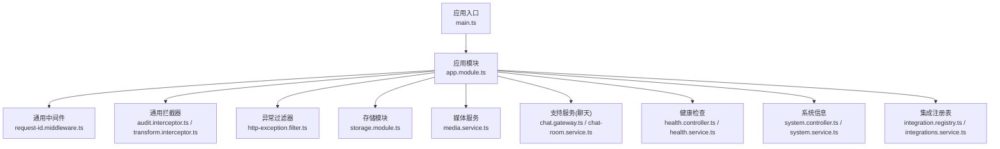
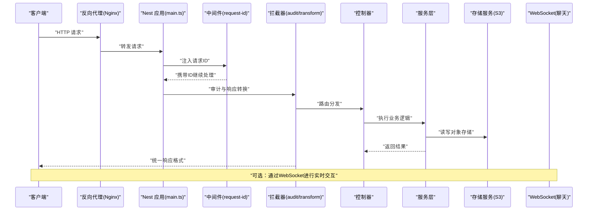
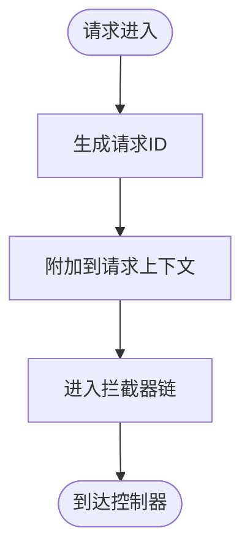
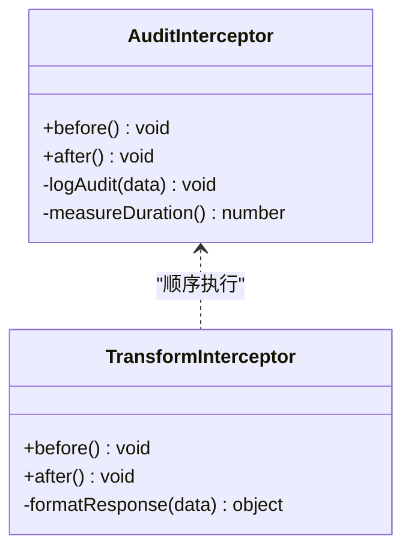
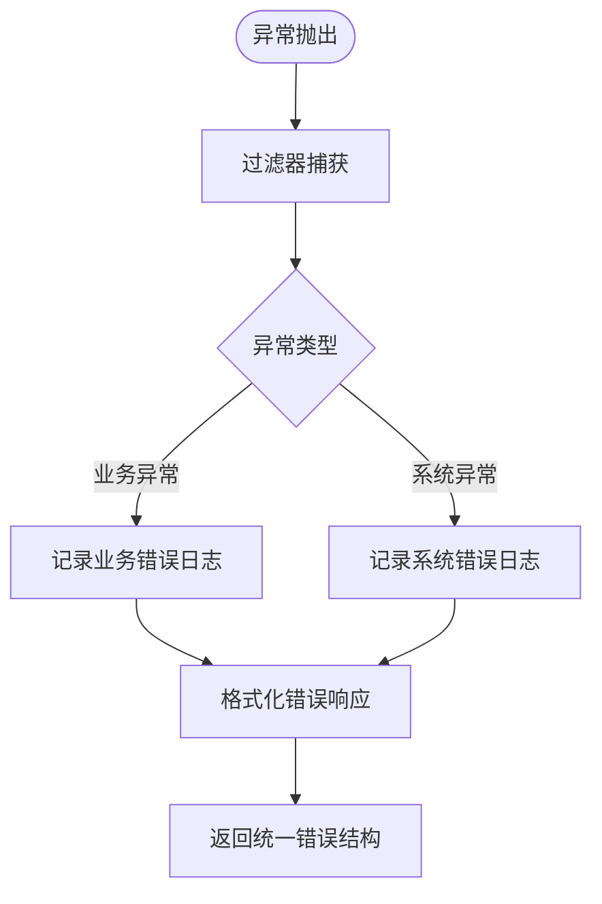
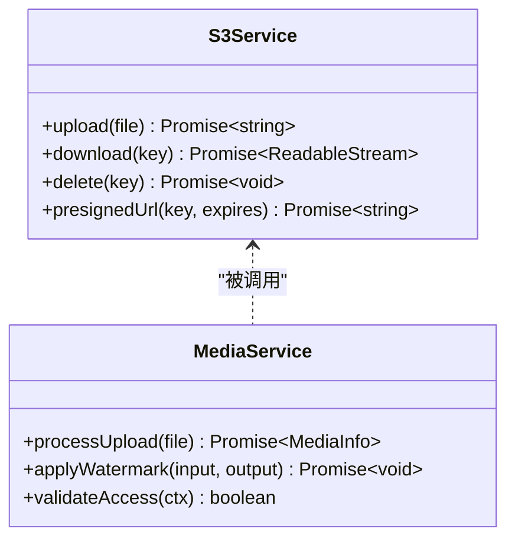
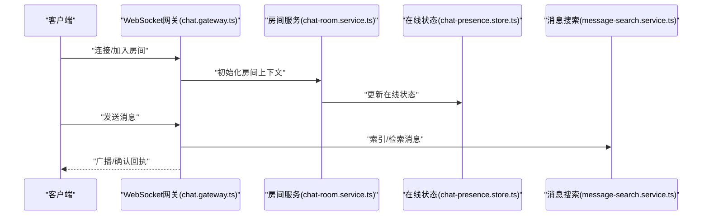
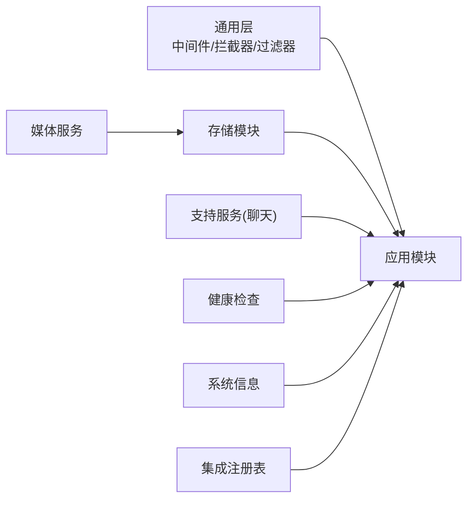

# 中间件与基础设施

<cite>
**本文档引用的文件**   
- [main.ts](file://apps/api/src/main.ts)
- [app.module.ts](file://apps/api/src/app.module.ts)
- [request-id.middleware.ts](file://apps/api/src/common/middleware/request-id.middleware.ts)
- [audit.interceptor.ts](file://apps/api/src/common/interceptors/audit.interceptor.ts)
- [transform.interceptor.ts](file://apps/api/src/common/interceptors/transform.interceptor.ts)
- [http-exception.filter.ts](file://apps/api/src/common/filters/http-exception.filter.ts)
- [env.validation.ts](file://apps/api/src/config/env.validation.ts)
- [s3.service.ts](file://apps/api/src/storage/s3.service.ts)
- [storage.controller.ts](file://apps/api/src/storage/storage.controller.ts)
- [storage.module.ts](file://apps/api/src/storage/storage.module.ts)
- [media.service.ts](file://apps/api/src/media/media.service.ts)
- [media-guard.service.ts](file://apps/api/src/media/media-guard.service.ts)
- [watermark.service.ts](file://apps/api/src/media/watermark.service.ts)
- [chat.gateway.ts](file://apps/api/src/support/chat.gateway.ts)
- [chat-room.service.ts](file://apps/api/src/support/chat-room.service.ts)
- [chat-presence.store.ts](file://apps/api/src/support/chat-presence.store.ts)
- [message-search.service.ts](file://apps/api/src/support/message-search.service.ts)
- [health.controller.ts](file://apps/api/src/health/health.controller.ts)
- [health.service.ts](file://apps/api/src/health/health.service.ts)
- [system.controller.ts](file://apps/api/src/system/system.controller.ts)
- [system.service.ts](file://apps/api/src/system/system.service.ts)
- [integrations.service.ts](file://apps/api/src/integrations/integrations.service.ts)
- [integration.registry.ts](file://apps/api/src/integrations/integration.registry.ts)
- [docker-compose.dev.yml](file://infra/docker/docker-compose.dev.yml)
- [docker-compose.prod.yml](file://infra/docker/docker-compose.prod.yml)
- [tzj.conf.template](file://infra/docker/nginx/templates/tzj.conf.template)
- [nginx entrypoint](file://infra/docker/nginx/entrypoint.d/90-periodic-reload.sh)
</cite>

## 目录
1. [简介](#简介)
2. [项目结构](#项目结构)
3. [核心组件](#核心组件)
4. [架构总览](#架构总览)
5. [详细组件分析](#详细组件分析)
6. [依赖关系分析](#依赖关系分析)
7. [性能考量](#性能考量)
8. [故障排查指南](#故障排查指南)
9. [结论](#结论)
10. [附录](#附录)

## 简介
本文件聚焦于后端 API（NestJS）的中间件与基础设施，涵盖：
- 自定义中间件、拦截器与过滤器的实现与编排
- 请求处理管道与响应拦截机制
- 审计日志、性能监控与错误追踪的基础设施
- 文件存储（S3/对象存储）、缓存与会话、消息队列（WebSocket）集成
- 配置管理、环境适配与服务发现
- 面向扩展的统一框架与最佳实践

## 项目结构
后端采用 NestJS 模块化组织，关键基础设施位于 common、config、storage、media、support、health、system、integrations 等模块中。入口为 main.ts，应用模块 app.module.ts 统一装配全局中间件、拦截器、过滤器与模块。

图表来源
- [main.ts](file://apps/api/src/main.ts)
- [app.module.ts](file://apps/api/src/app.module.ts)
- [request-id.middleware.ts](file://apps/api/src/common/middleware/request-id.middleware.ts)
- [audit.interceptor.ts](file://apps/api/src/common/interceptors/audit.interceptor.ts)
- [transform.interceptor.ts](file://apps/api/src/common/interceptors/transform.interceptor.ts)
- [http-exception.filter.ts](file://apps/api/src/common/filters/http-exception.filter.ts)
- [storage.module.ts](file://apps/api/src/storage/storage.module.ts)
- [media.service.ts](file://apps/api/src/media/media.service.ts)
- [chat.gateway.ts](file://apps/api/src/support/chat.gateway.ts)
- [chat-room.service.ts](file://apps/api/src/support/chat-room.service.ts)
- [health.controller.ts](file://apps/api/src/health/health.controller.ts)
- [health.service.ts](file://apps/api/src/health/health.service.ts)
- [system.controller.ts](file://apps/api/src/system/system.controller.ts)
- [system.service.ts](file://apps/api/src/system/system.service.ts)
- [integration.registry.ts](file://apps/api/src/integrations/integration.registry.ts)
- [integrations.service.ts](file://apps/api/src/integrations/integrations.service.ts)

章节来源
- [main.ts](file://apps/api/src/main.ts)
- [app.module.ts](file://apps/api/src/app.module.ts)

## 核心组件
- 请求标识中间件：为每个请求生成并注入唯一 ID，贯穿日志与链路追踪。
- 审计拦截器：记录关键操作上下文（用户、资源、动作、耗时），输出结构化审计日志。
- 响应转换拦截器：统一包装响应体、格式化时间戳、脱敏敏感字段。
- 异常过滤器：捕获 HTTP 异常，标准化错误响应，附带请求 ID 与堆栈摘要。
- 配置与环境校验：集中读取环境变量，启动时进行强类型校验与默认值填充。
- 存储与媒体：封装 S3/对象存储能力，提供上传、下载、水印、鉴权访问。
- 实时通信：基于 WebSocket 的消息通道、房间管理与在线状态。
- 健康与系统：探针接口、依赖健康检查、系统指标暴露。
- 集成注册表：插件式第三方能力接入与测试工具。

章节来源
- [request-id.middleware.ts](file://apps/api/src/common/middleware/request-id.middleware.ts)
- [audit.interceptor.ts](file://apps/api/src/common/interceptors/audit.interceptor.ts)
- [transform.interceptor.ts](file://apps/api/src/common/interceptors/transform.interceptor.ts)
- [http-exception.filter.ts](file://apps/api/src/common/filters/http-exception.filter.ts)
- [env.validation.ts](file://apps/api/src/config/env.validation.ts)
- [s3.service.ts](file://apps/api/src/storage/s3.service.ts)
- [media.service.ts](file://apps/api/src/media/media.service.ts)
- [media-guard.service.ts](file://apps/api/src/media/media-guard.service.ts)
- [watermark.service.ts](file://apps/api/src/media/watermark.service.ts)
- [chat.gateway.ts](file://apps/api/src/support/chat.gateway.ts)
- [chat-room.service.ts](file://apps/api/src/support/chat-room.service.ts)
- [chat-presence.store.ts](file://apps/api/src/support/chat-presence.store.ts)
- [message-search.service.ts](file://apps/api/src/support/message-search.service.ts)
- [health.controller.ts](file://apps/api/src/health/health.controller.ts)
- [health.service.ts](file://apps/api/src/health/health.service.ts)
- [system.controller.ts](file://apps/api/src/system/system.controller.ts)
- [system.service.ts](file://apps/api/src/system/system.service.ts)
- [integration.registry.ts](file://apps/api/src/integrations/integration.registry.ts)
- [integrations.service.ts](file://apps/api/src/integrations/integrations.service.ts)

## 架构总览
下图展示从请求进入网关到业务处理的完整路径，以及审计、错误处理、存储与实时通信的协作关系。

图表来源
- [main.ts](file://apps/api/src/main.ts)
- [request-id.middleware.ts](file://apps/api/src/common/middleware/request-id.middleware.ts)
- [audit.interceptor.ts](file://apps/api/src/common/interceptors/audit.interceptor.ts)
- [transform.interceptor.ts](file://apps/api/src/common/interceptors/transform.interceptor.ts)
- [s3.service.ts](file://apps/api/src/storage/s3.service.ts)
- [chat.gateway.ts](file://apps/api/src/support/chat.gateway.ts)

## 详细组件分析

### 请求处理管道与中间件
- 中间件生命周期：在控制器之前执行，适合横切关注点如请求ID注入、CORS、速率限制、访问控制前置校验。
- 请求ID传播：中间件生成 UUID 并写入请求头或上下文，后续日志与审计均携带该 ID，便于全链路追踪。
- 扩展建议：新增中间件应遵循单一职责，避免阻塞 IO；对耗时操作使用异步非阻塞方式。

图表来源
- [request-id.middleware.ts](file://apps/api/src/common/middleware/request-id.middleware.ts)

章节来源
- [request-id.middleware.ts](file://apps/api/src/common/middleware/request-id.middleware.ts)

### 审计日志与性能监控
- 审计拦截器：在方法执行前后采集入参、出参、异常、耗时与用户上下文，输出结构化日志。
- 性能监控：可结合请求耗时统计、慢查询标记、采样率控制，避免高吞吐下日志风暴。
- 最佳实践：对大对象进行采样或脱敏；将审计落盘至独立索引或外部日志系统；按模块开关审计。

图表来源
- [audit.interceptor.ts](file://apps/api/src/common/interceptors/audit.interceptor.ts)
- [transform.interceptor.ts](file://apps/api/src/common/interceptors/transform.interceptor.ts)

章节来源
- [audit.interceptor.ts](file://apps/api/src/common/interceptors/audit.interceptor.ts)
- [transform.interceptor.ts](file://apps/api/src/common/interceptors/transform.interceptor.ts)

### 错误追踪与异常处理
- 异常过滤器：捕获未处理异常，统一返回错误码、消息与请求ID，便于前端与运维定位问题。
- 错误分类：区分业务异常与系统异常，分别记录不同级别日志与告警策略。
- 调试建议：开启开发模式下的详细堆栈；生产环境仅保留必要信息并关联请求ID。

图表来源
- [http-exception.filter.ts](file://apps/api/src/common/filters/http-exception.filter.ts)

章节来源
- [http-exception.filter.ts](file://apps/api/src/common/filters/http-exception.filter.ts)

### 配置管理与环境适配
- 环境变量：集中定义键名、类型、默认值与校验规则，启动时强制校验缺失项。
- 多环境：通过 .env、容器注入、K8s ConfigMap/Secret 等方式覆盖配置。
- 安全建议：密钥不硬编码，使用加密存储或密钥管理服务；敏感字段不在日志中输出。

章节来源
- [env.validation.ts](file://apps/api/src/config/env.validation.ts)

### 文件存储服务（S3/对象存储）
- 能力封装：上传、下载、删除、列表、元数据读写、分块上传与断点续传。
- 安全与访问：签名 URL、权限校验、防盗链、跨域策略。
- 性能优化：连接池、并发限制、压缩与缓存命中策略。

图表来源
- [s3.service.ts](file://apps/api/src/storage/s3.service.ts)
- [media.service.ts](file://apps/api/src/media/media.service.ts)
- [media-guard.service.ts](file://apps/api/src/media/media-guard.service.ts)
- [watermark.service.ts](file://apps/api/src/media/watermark.service.ts)

章节来源
- [s3.service.ts](file://apps/api/src/storage/s3.service.ts)
- [media.service.ts](file://apps/api/src/media/media.service.ts)
- [media-guard.service.ts](file://apps/api/src/media/media-guard.service.ts)
- [watermark.service.ts](file://apps/api/src/media/watermark.service.ts)
- [storage.controller.ts](file://apps/api/src/storage/storage.controller.ts)
- [storage.module.ts](file://apps/api/src/storage/storage.module.ts)

### 缓存服务与会话
- 缓存策略：热点数据缓存、读穿透保护、过期与失效策略。
- 会话管理：无状态 JWT 或带签名的短期令牌；必要时结合 Redis 做黑名单或限流。
- 一致性：写后更新/失效缓存，避免脏读；分布式场景注意锁与幂等。

章节来源
- [env.validation.ts](file://apps/api/src/config/env.validation.ts)

### 消息队列与实时通信（WebSocket）
- 通道设计：聊天室、事件广播、订阅/发布模型。
- 状态管理：在线状态、心跳保活、离线重连。
- 可靠性：消息持久化、去重、重试与死信队列。

图表来源
- [chat.gateway.ts](file://apps/api/src/support/chat.gateway.ts)
- [chat-room.service.ts](file://apps/api/src/support/chat-room.service.ts)
- [chat-presence.store.ts](file://apps/api/src/support/chat-presence.store.ts)
- [message-search.service.ts](file://apps/api/src/support/message-search.service.ts)

章节来源
- [chat.gateway.ts](file://apps/api/src/support/chat.gateway.ts)
- [chat-room.service.ts](file://apps/api/src/support/chat-room.service.ts)
- [chat-presence.store.ts](file://apps/api/src/support/chat-presence.store.ts)
- [message-search.service.ts](file://apps/api/src/support/message-search.service.ts)

### 健康检查与系统信息
- 健康探针：存活/就绪探测、依赖服务健康（DB、缓存、对象存储）。
- 系统指标：内存、CPU、GC、线程池、连接数等。
- 对外暴露：/health、/ready、/metrics 等端点，供编排平台与监控采集。

章节来源
- [health.controller.ts](file://apps/api/src/health/health.controller.ts)
- [health.service.ts](file://apps/api/src/health/health.service.ts)
- [system.controller.ts](file://apps/api/src/system/system.controller.ts)
- [system.service.ts](file://apps/api/src/system/system.service.ts)

### 集成注册表与插件化
- 注册中心：统一声明第三方能力（短信、验证码、邮件等），支持启用/禁用与测试。
- 适配器模式：抽象接口，具体实现按需切换（阿里云、腾讯云等）。
- 配置驱动：通过配置开关与参数动态加载。

章节来源
- [integration.registry.ts](file://apps/api/src/integrations/integration.registry.ts)
- [integrations.service.ts](file://apps/api/src/integrations/integrations.service.ts)

## 依赖关系分析
- 模块耦合：common 层（中间件、拦截器、过滤器）低耦合、高复用；业务模块通过服务层间接依赖基础设施。
- 外部依赖：数据库、对象存储、缓存、消息总线、外部 SDK。
- 循环依赖规避：通过接口抽象与延迟注入解耦。

图表来源
- [app.module.ts](file://apps/api/src/app.module.ts)
- [storage.module.ts](file://apps/api/src/storage/storage.module.ts)
- [media.service.ts](file://apps/api/src/media/media.service.ts)
- [chat.gateway.ts](file://apps/api/src/support/chat.gateway.ts)
- [health.controller.ts](file://apps/api/src/health/health.controller.ts)
- [system.controller.ts](file://apps/api/src/system/system.controller.ts)
- [integration.registry.ts](file://apps/api/src/integrations/integration.registry.ts)

章节来源
- [app.module.ts](file://apps/api/src/app.module.ts)

## 性能考量
- 中间件与拦截器：避免同步阻塞 IO，尽量使用异步与流式处理；对大对象进行采样与脱敏。
- 存储与媒体：连接池、并发限制、CDN 加速、图片压缩与懒加载。
- 缓存：合理 TTL、热点预热、缓存击穿/雪崩防护。
- 实时通信：心跳检测、背压控制、消息批处理与去重。
- 监控：APM、指标采集、慢请求告警、日志采样。

## 故障排查指南
- 快速定位：通过请求 ID 串联日志、审计与错误信息。
- 常见问题：
  - 存储上传失败：检查凭证、网络、桶策略与 CORS。
  - 媒体访问拒绝：检查鉴权守卫与签名有效期。
  - 聊天掉线：检查心跳、防火墙与负载均衡会话保持。
  - 健康检查失败：逐项检查依赖服务连通性与配额。
- 诊断步骤：
  - 查看异常过滤器输出的错误结构与堆栈摘要。
  - 打开审计日志，核对关键操作的入参与耗时。
  - 检查配置与环境变量是否生效。
  - 使用健康检查端点验证依赖状态。

章节来源
- [http-exception.filter.ts](file://apps/api/src/common/filters/http-exception.filter.ts)
- [audit.interceptor.ts](file://apps/api/src/common/interceptors/audit.interceptor.ts)
- [env.validation.ts](file://apps/api/src/config/env.validation.ts)
- [health.controller.ts](file://apps/api/src/health/health.controller.ts)
- [health.service.ts](file://apps/api/src/health/health.service.ts)

## 结论
本基础设施以中间件/拦截器/过滤器为核心，构建统一的请求处理与错误处理体系；通过配置校验与模块化设计，支撑存储、媒体、实时通信与健康系统等关键能力。建议在扩展时遵循单一职责、接口抽象与配置驱动原则，确保可观测性、可维护性与可扩展性。

## 附录

### 部署与运行要点
- 容器编排：使用 docker-compose 管理本地与生产环境依赖（Postgres、Redis、MinIO、Nginx）。
- Nginx 配置：模板化站点配置，支持证书自动签发与定期重载。
- 环境变量：通过 .env 与容器注入覆盖，严格校验必填项。

章节来源
- [docker-compose.dev.yml](file://infra/docker/docker-compose.dev.yml)
- [docker-compose.prod.yml](file://infra/docker/docker-compose.prod.yml)
- [tzj.conf.template](file://infra/docker/nginx/templates/tzj.conf.template)
- [nginx entrypoint](file://infra/docker/nginx/entrypoint.d/90-periodic-reload.sh)