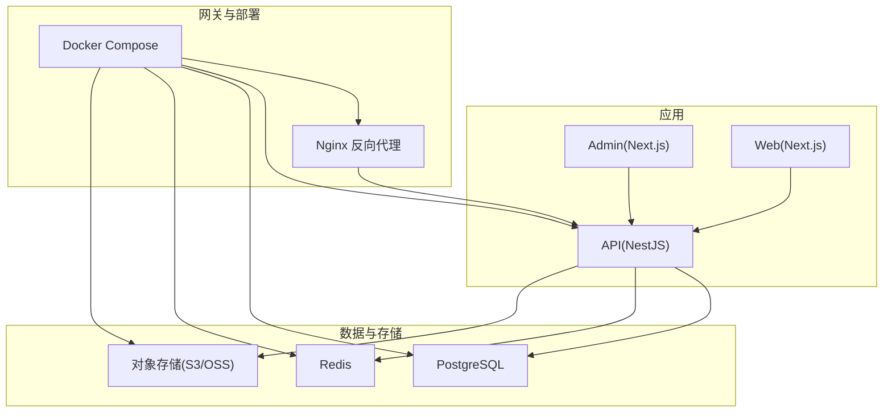
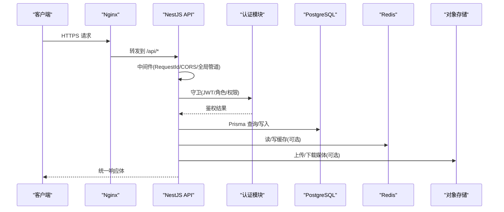
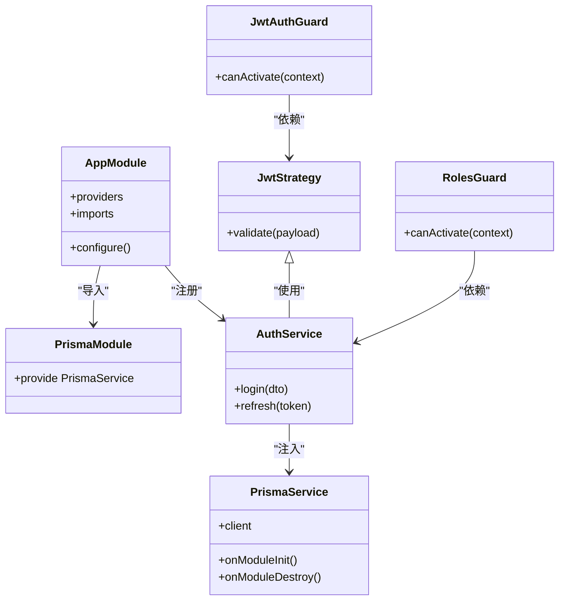
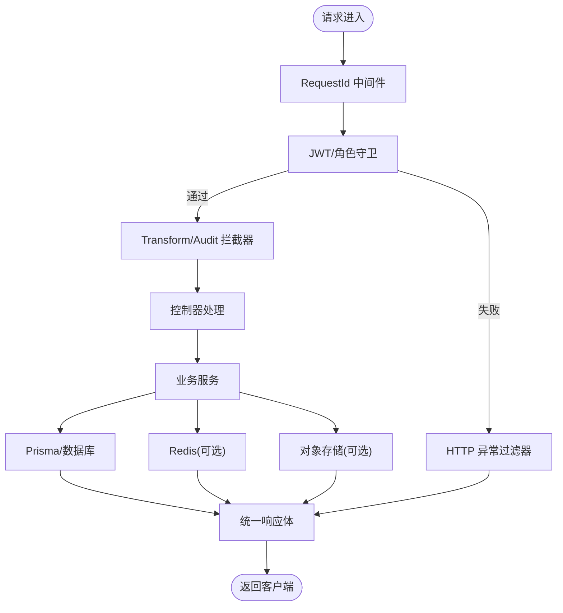
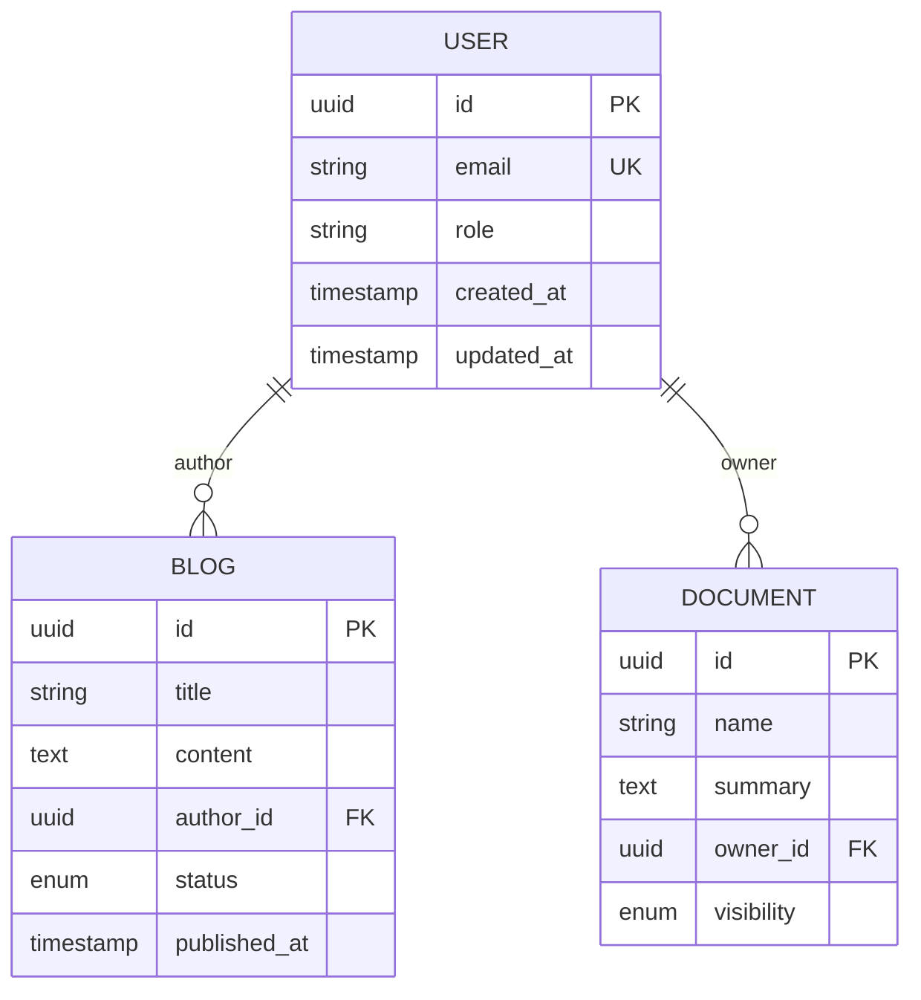
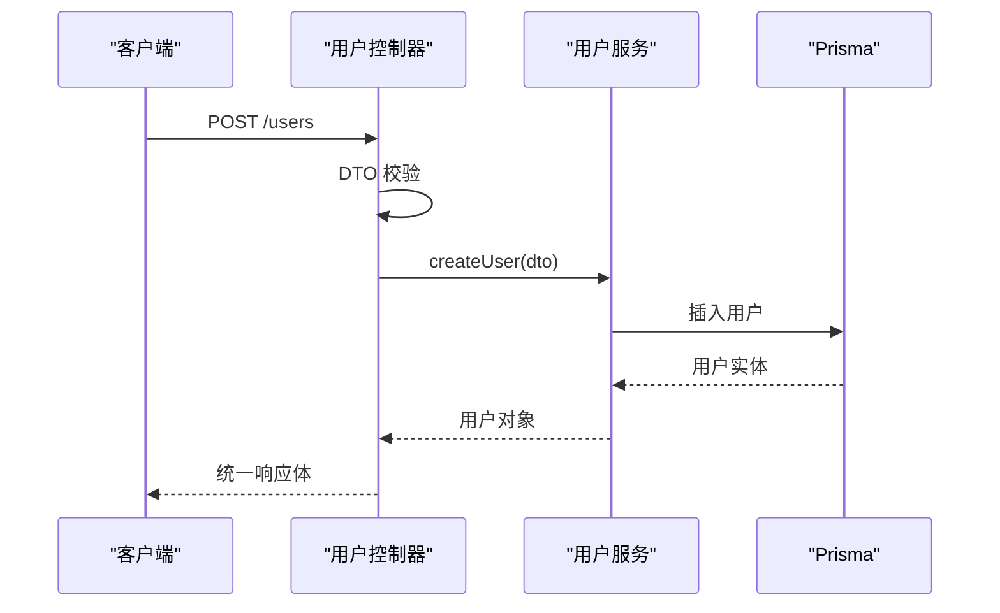
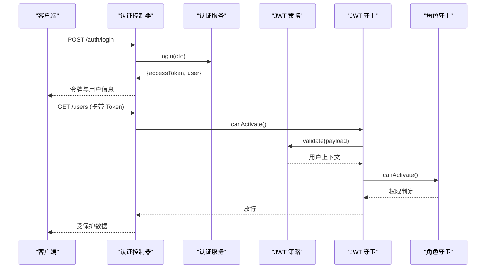
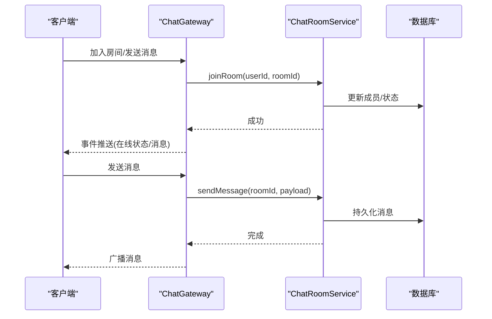
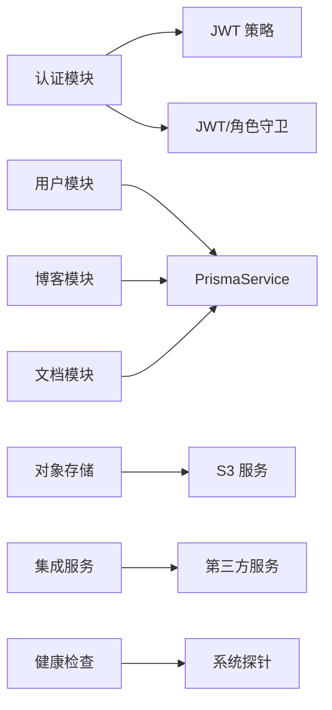

# 后端架构设计

<cite>
**本文引用的文件**   
- [apps/api/src/main.ts](file://apps/api/src/main.ts)
- [apps/api/src/app.module.ts](file://apps/api/src/app.module.ts)
- [apps/api/src/prisma/prisma.service.ts](file://apps/api/src/prisma/prisma.service.ts)
- [apps/api/src/prisma/prisma.module.ts](file://apps/api/src/prisma/prisma.module.ts)
- [apps/api/prisma/schema.prisma](file://apps/api/prisma/schema.prisma)
- [apps/api/prisma/migrations/0_init/migration.sql](file://apps/api/prisma/migrations/0_init/migration.sql)
- [apps/api/src/config/env.validation.ts](file://apps/api/src/config/env.validation.ts)
- [apps/api/src/common/middleware/request-id.middleware.ts](file://apps/api/src/common/middleware/request-id.middleware.ts)
- [apps/api/src/common/filters/http-exception.filter.ts](file://apps/api/src/common/filters/http-exception.filter.ts)
- [apps/api/src/common/interceptors/transform.interceptor.ts](file://apps/api/src/common/interceptors/transform.interceptor.ts)
- [apps/api/src/common/interceptors/audit.interceptor.ts](file://apps/api/src/common/interceptors/audit.interceptor.ts)
- [apps/api/src/auth/guards/jwt-auth.guard.ts](file://apps/api/src/auth/guards/jwt-auth.guard.ts)
- [apps/api/src/auth/guards/roles.guard.ts](file://apps/api/src/auth/guards/roles.guard.ts)
- [apps/api/src/auth/decorators/current-user.decorator.ts](file://apps/api/src/auth/decorators/current-user.decorator.ts)
- [apps/api/src/auth/decorators/public.decorator.ts](file://apps/api/src/auth/decorators/public.decorator.ts)
- [apps/api/src/auth/decorators/require-permissions.decorator.ts](file://apps/api/src/auth/decorators/require-permissions.decorator.ts)
- [apps/api/src/auth/strategies/jwt.strategy.ts](file://apps/api/src/auth/strategies/jwt.strategy.ts)
- [apps/api/src/auth/auth.controller.ts](file://apps/api/src/auth/auth.controller.ts)
- [apps/api/src/auth/auth.service.ts](file://apps/api/src/auth/auth.service.ts)
- [apps/api/src/users/users.controller.ts](file://apps/api/src/users/users.controller.ts)
- [apps/api/src/users/users.service.ts](file://apps/api/src/users/users.service.ts)
- [apps/api/src/blogs/blogs.controller.ts](file://apps/api/src/blogs/blogs.controller.ts)
- [apps/api/src/blogs/blogs.service.ts](file://apps/api/src/blogs/blogs.service.ts)
- [apps/api/src/documents/documents.controller.ts](file://apps/api/src/documents/documents.controller.ts)
- [apps/api/src/documents/documents.service.ts](file://apps/api/src/documents/documents.service.ts)
- [apps/api/src/support/chat.gateway.ts](file://apps/api/src/support/chat.gateway.ts)
- [apps/api/src/support/chat-room.service.ts](file://apps/api/src/support/chat-room.service.ts)
- [apps/api/src/storage/s3.service.ts](file://apps/api/src/storage/s3.service.ts)
- [apps/api/src/integrations/integrations.service.ts](file://apps/api/src/integrations/integrations.service.ts)
- [apps/api/src/health/health.controller.ts](file://apps/api/src/health/health.controller.ts)
- [apps/api/src/health/health.service.ts](file://apps/api/src/health/health.service.ts)
- [infra/docker/docker-compose.dev.yml](file://infra/docker/docker-compose.dev.yml)
- [infra/docker/nginx/tzj.conf](file://infra/docker/nginx/tzj.conf)
</cite>

## 目录
1. [简介](#简介)
2. [项目结构](#项目结构)
3. [核心组件](#核心组件)
4. [架构总览](#架构总览)
5. [详细组件分析](#详细组件分析)
6. [依赖关系分析](#依赖关系分析)
7. [性能考量](#性能考量)
8. [故障排查指南](#故障排查指南)
9. [结论](#结论)
10. [附录](#附录)

## 简介
本文件面向后端开发者，系统化阐述基于 NestJS 的微服务架构设计。重点覆盖：
- 模块化架构与依赖注入模式
- 中间件、守卫、拦截器、过滤器等横切机制
- Prisma ORM 数据访问层设计与数据库迁移策略
- RESTful API 规范、DTO 验证与异常处理
- 消息队列集成、缓存策略与异步任务处理（扩展建议）
- 微服务间通信协议、服务发现与服务治理（扩展建议）

本项目采用 Monorepo 组织，API 服务位于 apps/api，前端应用位于 apps/admin 与 apps/web，基础设施通过 Docker Compose 编排。

## 项目结构
- 应用层
  - apps/api：NestJS 后端服务，按领域划分模块（auth、users、blogs、documents、support 等），统一入口 main.ts，根模块 app.module.ts 装配全局配置与中间件。
  - apps/admin、apps/web：Next.js 前端应用，通过 API 路由或 BFF 调用后端。
- 数据层
  - apps/api/prisma：Prisma Schema、迁移脚本与种子数据。
- 基础设施
  - infra/docker：Docker Compose、Nginx 反向代理、Postgres、Redis、MinIO/OSS 等环境配置。

图表来源
- [apps/api/src/main.ts](file://apps/api/src/main.ts)
- [infra/docker/docker-compose.dev.yml](file://infra/docker/docker-compose.dev.yml)
- [infra/docker/nginx/tzj.conf](file://infra/docker/nginx/tzj.conf)

章节来源
- [apps/api/src/main.ts](file://apps/api/src/main.ts)
- [apps/api/src/app.module.ts](file://apps/api/src/app.module.ts)
- [infra/docker/docker-compose.dev.yml](file://infra/docker/docker-compose.dev.yml)

## 核心组件
- 应用启动与全局配置
  - main.ts：创建 Nest 应用实例，挂载全局前缀、CORS、静态资源、Swagger、中间件与监听端口。
  - app.module.ts：注册所有业务模块、全局管道/拦截器/过滤器、PrismaModule、环境变量校验等。
- 数据访问层
  - prisma.service.ts：封装 PrismaClient 生命周期管理（启动/关闭）。
  - prisma.module.ts：以 Provider 形式暴露 PrismaService，供各模块注入使用。
  - schema.prisma：定义数据模型、关系与索引；配合 migrations 目录进行版本化迁移。
- 认证与授权
  - JWT 策略与守卫：jwt.strategy.ts、jwt-auth.guard.ts、roles.guard.ts。
  - 装饰器：current-user.decorator.ts、public.decorator.ts、require-permissions.decorator.ts。
  - 控制器与服务：auth.controller.ts、auth.service.ts。
- 中间件与横切关注点
  - request-id.middleware.ts：为请求生成并透传唯一 ID。
  - transform.interceptor.ts：统一响应体包装。
  - audit.interceptor.ts：审计日志记录。
  - http-exception.filter.ts：统一异常格式输出。
- 健康检查
  - health.controller.ts、health.service.ts：提供就绪/存活探针接口。

章节来源
- [apps/api/src/main.ts](file://apps/api/src/main.ts)
- [apps/api/src/app.module.ts](file://apps/api/src/app.module.ts)
- [apps/api/src/prisma/prisma.service.ts](file://apps/api/src/prisma/prisma.service.ts)
- [apps/api/src/prisma/prisma.module.ts](file://apps/api/src/prisma/prisma.module.ts)
- [apps/api/prisma/schema.prisma](file://apps/api/prisma/schema.prisma)
- [apps/api/src/common/middleware/request-id.middleware.ts](file://apps/api/src/common/middleware/request-id.middleware.ts)
- [apps/api/src/common/interceptors/transform.interceptor.ts](file://apps/api/src/common/interceptors/transform.interceptor.ts)
- [apps/api/src/common/interceptors/audit.interceptor.ts](file://apps/api/src/common/interceptors/audit.interceptor.ts)
- [apps/api/src/common/filters/http-exception.filter.ts](file://apps/api/src/common/filters/http-exception.filter.ts)
- [apps/api/src/auth/guards/jwt-auth.guard.ts](file://apps/api/src/auth/guards/jwt-auth.guard.ts)
- [apps/api/src/auth/guards/roles.guard.ts](file://apps/api/src/auth/guards/roles.guard.ts)
- [apps/api/src/auth/decorators/current-user.decorator.ts](file://apps/api/src/auth/decorators/current-user.decorator.ts)
- [apps/api/src/auth/decorators/public.decorator.ts](file://apps/api/src/auth/decorators/public.decorator.ts)
- [apps/api/src/auth/decorators/require-permissions.decorator.ts](file://apps/api/src/auth/decorators/require-permissions.decorator.ts)
- [apps/api/src/auth/strategies/jwt.strategy.ts](file://apps/api/src/auth/strategies/jwt.strategy.ts)
- [apps/api/src/auth/auth.controller.ts](file://apps/api/src/auth/auth.controller.ts)
- [apps/api/src/auth/auth.service.ts](file://apps/api/src/auth/auth.service.ts)
- [apps/api/src/health/health.controller.ts](file://apps/api/src/health/health.controller.ts)
- [apps/api/src/health/health.service.ts](file://apps/api/src/health/health.service.ts)

## 架构总览
整体采用“网关 + 微服务”的演进形态。当前单体 API 服务内按领域拆分模块，未来可拆分为独立进程并通过消息总线或 gRPC 通信。Nginx 作为反向代理统一入口，PostgreSQL 作为主数据存储，Redis 用于会话/缓存/限流，对象存储承载媒体资源。

图表来源
- [infra/docker/nginx/tzj.conf](file://infra/docker/nginx/tzj.conf)
- [apps/api/src/main.ts](file://apps/api/src/main.ts)
- [apps/api/src/common/middleware/request-id.middleware.ts](file://apps/api/src/common/middleware/request-id.middleware.ts)
- [apps/api/src/auth/guards/jwt-auth.guard.ts](file://apps/api/src/auth/guards/jwt-auth.guard.ts)
- [apps/api/src/prisma/prisma.service.ts](file://apps/api/src/prisma/prisma.service.ts)
- [apps/api/src/storage/s3.service.ts](file://apps/api/src/storage/s3.service.ts)

## 详细组件分析

### 模块化架构与依赖注入
- 模块划分遵循“领域优先”，每个业务域包含 controller、service、dto、guards/interceptors/filters 等。
- 依赖注入通过 @Injectable() 与构造函数注入实现，PrismaService、外部服务（S3、集成服务等）均以 Provider 形式注入。
- 根模块集中装配全局管道、拦截器、过滤器与模块注册，保证横切能力一致生效。

图表来源
- [apps/api/src/app.module.ts](file://apps/api/src/app.module.ts)
- [apps/api/src/prisma/prisma.module.ts](file://apps/api/src/prisma/prisma.module.ts)
- [apps/api/src/prisma/prisma.service.ts](file://apps/api/src/prisma/prisma.service.ts)
- [apps/api/src/auth/auth.service.ts](file://apps/api/src/auth/auth.service.ts)
- [apps/api/src/auth/strategies/jwt.strategy.ts](file://apps/api/src/auth/strategies/jwt.strategy.ts)
- [apps/api/src/auth/guards/jwt-auth.guard.ts](file://apps/api/src/auth/guards/jwt-auth.guard.ts)
- [apps/api/src/auth/guards/roles.guard.ts](file://apps/api/src/auth/guards/roles.guard.ts)

章节来源
- [apps/api/src/app.module.ts](file://apps/api/src/app.module.ts)
- [apps/api/src/prisma/prisma.module.ts](file://apps/api/src/prisma/prisma.module.ts)
- [apps/api/src/prisma/prisma.service.ts](file://apps/api/src/prisma/prisma.service.ts)
- [apps/api/src/auth/auth.service.ts](file://apps/api/src/auth/auth.service.ts)
- [apps/api/src/auth/strategies/jwt.strategy.ts](file://apps/api/src/auth/strategies/jwt.strategy.ts)
- [apps/api/src/auth/guards/jwt-auth.guard.ts](file://apps/api/src/auth/guards/jwt-auth.guard.ts)
- [apps/api/src/auth/guards/roles.guard.ts](file://apps/api/src/auth/guards/roles.guard.ts)

### 中间件机制与横切关注点
- RequestId 中间件：为每个请求生成唯一 ID，贯穿日志链路，便于追踪。
- Transform 拦截器：统一响应体结构，屏蔽内部细节，提升前端对接一致性。
- Audit 拦截器：记录关键操作的审计信息（如操作人、时间、资源ID）。
- HTTP 异常过滤器：捕获未处理异常，返回标准错误码与消息。

图表来源
- [apps/api/src/common/middleware/request-id.middleware.ts](file://apps/api/src/common/middleware/request-id.middleware.ts)
- [apps/api/src/common/interceptors/transform.interceptor.ts](file://apps/api/src/common/interceptors/transform.interceptor.ts)
- [apps/api/src/common/interceptors/audit.interceptor.ts](file://apps/api/src/common/interceptors/audit.interceptor.ts)
- [apps/api/src/common/filters/http-exception.filter.ts](file://apps/api/src/common/filters/http-exception.filter.ts)
- [apps/api/src/auth/guards/jwt-auth.guard.ts](file://apps/api/src/auth/guards/jwt-auth.guard.ts)
- [apps/api/src/auth/guards/roles.guard.ts](file://apps/api/src/auth/guards/roles.guard.ts)

章节来源
- [apps/api/src/common/middleware/request-id.middleware.ts](file://apps/api/src/common/middleware/request-id.middleware.ts)
- [apps/api/src/common/interceptors/transform.interceptor.ts](file://apps/api/src/common/interceptors/transform.interceptor.ts)
- [apps/api/src/common/interceptors/audit.interceptor.ts](file://apps/api/src/common/interceptors/audit.interceptor.ts)
- [apps/api/src/common/filters/http-exception.filter.ts](file://apps/api/src/common/filters/http-exception.filter.ts)

### Prisma ORM 数据访问层与迁移策略
- PrismaService：在模块初始化时连接数据库，模块销毁时断开连接，确保生命周期安全。
- Schema 驱动：schema.prisma 定义模型、关系与索引，保持代码即文档。
- 迁移管理：migrations 目录存放增量 SQL 迁移，结合 CI/CD 执行迁移，保证环境一致性。
- 连接池：通过环境变量控制连接数、超时与重试策略，避免连接泄漏与耗尽。

图表来源
- [apps/api/prisma/schema.prisma](file://apps/api/prisma/schema.prisma)

章节来源
- [apps/api/src/prisma/prisma.service.ts](file://apps/api/src/prisma/prisma.service.ts)
- [apps/api/prisma/schema.prisma](file://apps/api/prisma/schema.prisma)
- [apps/api/prisma/migrations/0_init/migration.sql](file://apps/api/prisma/migrations/0_init/migration.sql)

### RESTful API 设计规范与 DTO 验证
- 控制器职责单一：仅负责参数解析、调用服务、返回响应。
- DTO 校验：使用类装饰器对输入进行强类型校验，结合全局管道自动抛出标准化错误。
- 统一响应：通过 Transform 拦截器包裹成功响应，减少前端适配成本。
- 分页与排序：在服务层统一封装列表查询、排序与过滤逻辑。

图表来源
- [apps/api/src/users/users.controller.ts](file://apps/api/src/users/users.controller.ts)
- [apps/api/src/users/users.service.ts](file://apps/api/src/users/users.service.ts)
- [apps/api/src/common/interceptors/transform.interceptor.ts](file://apps/api/src/common/interceptors/transform.interceptor.ts)

章节来源
- [apps/api/src/users/users.controller.ts](file://apps/api/src/users/users.controller.ts)
- [apps/api/src/users/users.service.ts](file://apps/api/src/users/users.service.ts)
- [apps/api/src/common/interceptors/transform.interceptor.ts](file://apps/api/src/common/interceptors/transform.interceptor.ts)

### 认证与授权流程
- JWT 策略：从请求头提取 token，校验签名与过期时间，反查用户上下文。
- 守卫链：JwtAuthGuard 先验签，RolesGuard 再校验角色，RequirePermissions 进一步校验权限。
- 公共接口：Public 装饰器跳过鉴权，适用于登录、注册、公开查询等。
- 当前用户注入：CurrentUser 装饰器将已认证用户注入控制器方法参数。

图表来源
- [apps/api/src/auth/auth.controller.ts](file://apps/api/src/auth/auth.controller.ts)
- [apps/api/src/auth/auth.service.ts](file://apps/api/src/auth/auth.service.ts)
- [apps/api/src/auth/strategies/jwt.strategy.ts](file://apps/api/src/auth/strategies/jwt.strategy.ts)
- [apps/api/src/auth/guards/jwt-auth.guard.ts](file://apps/api/src/auth/guards/jwt-auth.guard.ts)
- [apps/api/src/auth/guards/roles.guard.ts](file://apps/api/src/auth/guards/roles.guard.ts)
- [apps/api/src/auth/decorators/current-user.decorator.ts](file://apps/api/src/auth/decorators/current-user.decorator.ts)
- [apps/api/src/auth/decorators/public.decorator.ts](file://apps/api/src/auth/decorators/public.decorator.ts)
- [apps/api/src/auth/decorators/require-permissions.decorator.ts](file://apps/api/src/auth/decorators/require-permissions.decorator.ts)

章节来源
- [apps/api/src/auth/auth.controller.ts](file://apps/api/src/auth/auth.controller.ts)
- [apps/api/src/auth/auth.service.ts](file://apps/api/src/auth/auth.service.ts)
- [apps/api/src/auth/strategies/jwt.strategy.ts](file://apps/api/src/auth/strategies/jwt.strategy.ts)
- [apps/api/src/auth/guards/jwt-auth.guard.ts](file://apps/api/src/auth/guards/jwt-auth.guard.ts)
- [apps/api/src/auth/guards/roles.guard.ts](file://apps/api/src/auth/guards/roles.guard.ts)
- [apps/api/src/auth/decorators/current-user.decorator.ts](file://apps/api/src/auth/decorators/current-user.decorator.ts)
- [apps/api/src/auth/decorators/public.decorator.ts](file://apps/api/src/auth/decorators/public.decorator.ts)
- [apps/api/src/auth/decorators/require-permissions.decorator.ts](file://apps/api/src/auth/decorators/require-permissions.decorator.ts)

### 实时通信与消息处理
- WebSocket Gateway：chat.gateway.ts 提供聊天室与会话状态广播能力。
- 房间服务：chat-room.service.ts 管理房间生命周期、消息持久化与会者状态。
- 适用场景：在线客服、协作编辑、实时通知等。

图表来源
- [apps/api/src/support/chat.gateway.ts](file://apps/api/src/support/chat.gateway.ts)
- [apps/api/src/support/chat-room.service.ts](file://apps/api/src/support/chat-room.service.ts)

章节来源
- [apps/api/src/support/chat.gateway.ts](file://apps/api/src/support/chat.gateway.ts)
- [apps/api/src/support/chat-room.service.ts](file://apps/api/src/support/chat-room.service.ts)

### 存储与外部集成
- 对象存储：s3.service.ts 封装上传、下载、删除等操作，支持 MinIO 或云厂商 OSS。
- 第三方集成：integrations.service.ts 统一管理外部服务接入（如验证码、邮件等），便于扩展与测试替换。

章节来源
- [apps/api/src/storage/s3.service.ts](file://apps/api/src/storage/s3.service.ts)
- [apps/api/src/integrations/integrations.service.ts](file://apps/api/src/integrations/integrations.service.ts)

### 健康检查与环境配置
- 健康检查：health.controller.ts 与 health.service.ts 提供就绪/存活探针，便于容器编排与健康探测。
- 环境变量：env.validation.ts 使用 Joi/Yup 等库校验环境变量，确保运行期配置正确。

章节来源
- [apps/api/src/health/health.controller.ts](file://apps/api/src/health/health.controller.ts)
- [apps/api/src/health/health.service.ts](file://apps/api/src/health/health.service.ts)
- [apps/api/src/config/env.validation.ts](file://apps/api/src/config/env.validation.ts)

## 依赖关系分析
- 模块耦合
  - 认证模块依赖策略与守卫，控制器仅依赖服务，服务依赖 PrismaService 与外部服务。
  - 数据访问层通过 PrismaService 解耦具体数据库实现。
- 外部依赖
  - PostgreSQL：主数据存储。
  - Redis：缓存、会话、限流（可扩展）。
  - 对象存储：媒体资源与附件。
- 潜在循环依赖
  - 通过模块边界与 Provider 注入避免循环引用，必要时使用 forwardRef。

图表来源
- [apps/api/src/auth/auth.service.ts](file://apps/api/src/auth/auth.service.ts)
- [apps/api/src/auth/strategies/jwt.strategy.ts](file://apps/api/src/auth/strategies/jwt.strategy.ts)
- [apps/api/src/auth/guards/jwt-auth.guard.ts](file://apps/api/src/auth/guards/jwt-auth.guard.ts)
- [apps/api/src/prisma/prisma.service.ts](file://apps/api/src/prisma/prisma.service.ts)
- [apps/api/src/storage/s3.service.ts](file://apps/api/src/storage/s3.service.ts)
- [apps/api/src/integrations/integrations.service.ts](file://apps/api/src/integrations/integrations.service.ts)
- [apps/api/src/health/health.service.ts](file://apps/api/src/health/health.service.ts)

章节来源
- [apps/api/src/auth/auth.service.ts](file://apps/api/src/auth/auth.service.ts)
- [apps/api/src/auth/strategies/jwt.strategy.ts](file://apps/api/src/auth/strategies/jwt.strategy.ts)
- [apps/api/src/auth/guards/jwt-auth.guard.ts](file://apps/api/src/auth/guards/jwt-auth.guard.ts)
- [apps/api/src/prisma/prisma.service.ts](file://apps/api/src/prisma/prisma.service.ts)
- [apps/api/src/storage/s3.service.ts](file://apps/api/src/storage/s3.service.ts)
- [apps/api/src/integrations/integrations.service.ts](file://apps/api/src/integrations/integrations.service.ts)
- [apps/api/src/health/health.service.ts](file://apps/api/src/health/health.service.ts)

## 性能考量
- 数据库连接池
  - 合理设置最大连接数、空闲超时与重连策略，避免连接泄漏。
  - 使用 Prisma 的连接池配置与事务批处理降低往返开销。
- 缓存策略
  - 热点数据（如站点设置、字典表）放入 Redis，设置 TTL 与失效策略。
  - 读写分离：读多写少场景优先走缓存，写后主动失效或延迟刷新。
- 异步任务
  - 耗时操作（邮件发送、报表生成、媒体转码）放入消息队列（RabbitMQ/Kafka/BullMQ），消费者异步处理。
- I/O 优化
  - 大文件上传分片与断点续传，对象存储直传减少 API 压力。
  - 静态资源 CDN 加速，图片按需压缩与懒加载。
- 监控与可观测性
  - 统一日志（含 RequestId）、指标采集（Prometheus）、分布式追踪（OpenTelemetry）。

[本节为通用指导，不直接分析具体文件]

## 故障排查指南
- 常见问题定位
  - 请求无响应：检查 Nginx 转发规则与 API 监听端口。
  - 鉴权失败：确认 Token 签发与校验配置、时钟同步与过期策略。
  - 数据库连接失败：核对连接串、用户名密码、网络连通性与连接池上限。
  - 对象存储上传失败：检查密钥、Bucket 权限与 CORS 配置。
- 诊断手段
  - 启用详细日志与 RequestId 追踪。
  - 使用健康检查接口与容器探针观察服务状态。
  - 借助数据库慢查询分析与 Redis 命中率统计定位瓶颈。

章节来源
- [infra/docker/nginx/tzj.conf](file://infra/docker/nginx/tzj.conf)
- [apps/api/src/common/middleware/request-id.middleware.ts](file://apps/api/src/common/middleware/request-id.middleware.ts)
- [apps/api/src/common/filters/http-exception.filter.ts](file://apps/api/src/common/filters/http-exception.filter.ts)
- [apps/api/src/health/health.controller.ts](file://apps/api/src/health/health.controller.ts)

## 结论
本项目以 NestJS 为核心构建模块化、可维护的后端服务，通过 Prisma 实现类型安全的数据库访问，结合中间件、守卫与拦截器形成清晰的横切关注点体系。未来可按领域拆分为独立微服务，引入消息总线与缓存层，完善服务发现与治理，进一步提升弹性与可观测性。

[本节为总结性内容，不直接分析具体文件]

## 附录
- 开发环境与部署
  - Docker Compose 编排本地与生产环境，Nginx 统一入口，Postgres/Redis/MinIO 等依赖一键拉起。
- 扩展建议
  - 引入 BullMQ/RabbitMQ/Kafka 实现异步任务与事件驱动。
  - 使用 OpenAPI/Swagger 自动生成 API 文档，强化契约管理。
  - 引入限流、熔断与降级策略，提升系统韧性。

[本节为补充说明，不直接分析具体文件]