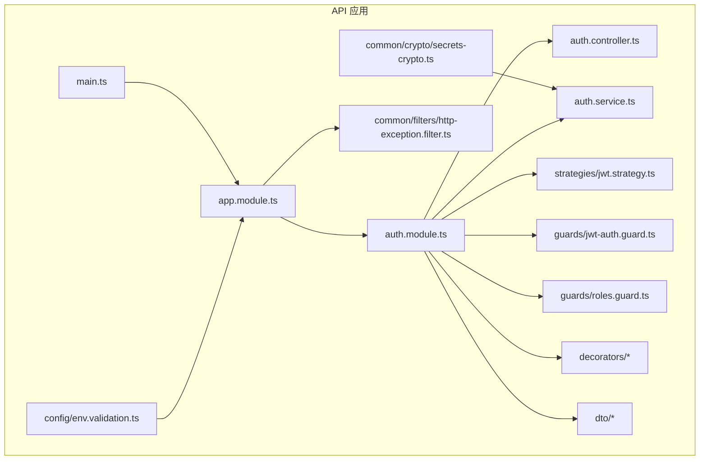
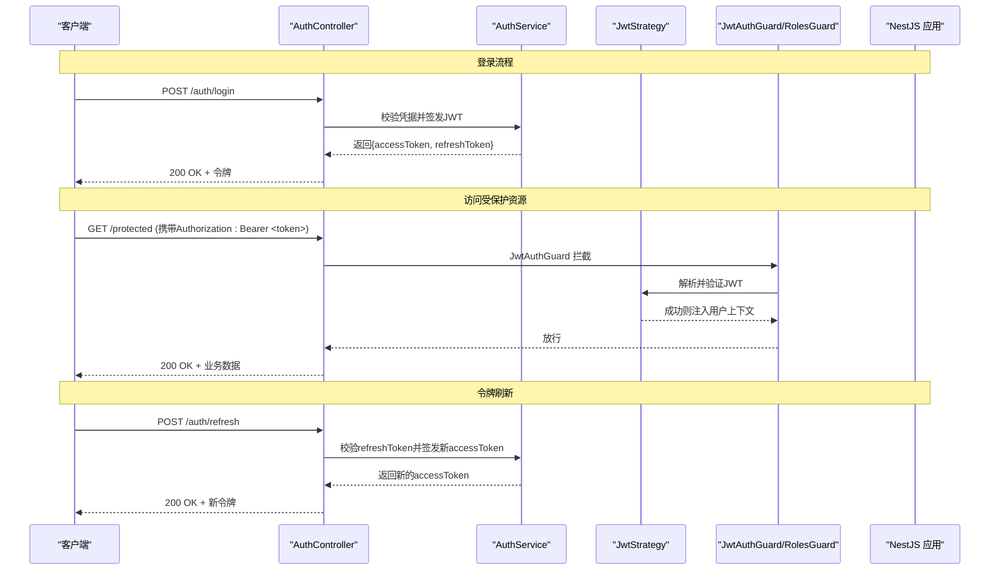
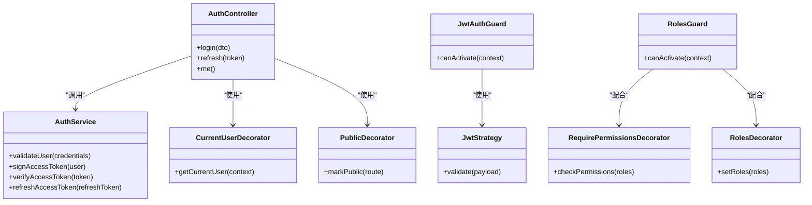

# JWT令牌认证

<cite>
**本文档引用的文件**
- [auth.controller.ts](file://apps/api/src/auth/auth.controller.ts)
- [auth.service.ts](file://apps/api/src/auth/auth.service.ts)
- [auth.module.ts](file://apps/api/src/auth/auth.module.ts)
- [jwt.strategy.ts](file://apps/api/src/auth/strategies/jwt.strategy.ts)
- [jwt-auth.guard.ts](file://apps/api/src/auth/guards/jwt-auth.guard.ts)
- [roles.guard.ts](file://apps/api/src/auth/guards/roles.guard.ts)
- [current-user.decorator.ts](file://apps/api/src/auth/decorators/current-user.decorator.ts)
- [public.decorator.ts](file://apps/api/src/auth/decorators/public.decorator.ts)
- [require-permissions.decorator.ts](file://apps/api/src/auth/decorators/require-permissions.decorator.ts)
- [roles.decorator.ts](file://apps/api/src/auth/decorators/roles.decorator.ts)
- [auth.dto.ts](file://apps/api/src/auth/dto/auth.dto.ts)
- [profile.dto.ts](file://apps/api/src/auth/dto/profile.dto.ts)
- [env.validation.ts](file://apps/api/src/config/env.validation.ts)
- [secrets-crypto.ts](file://apps/api/src/common/crypto/secrets-crypto.ts)
- [http-exception.filter.ts](file://apps/api/src/common/filters/http-exception.filter.ts)
- [main.ts](file://apps/api/src/main.ts)
- [app.module.ts](file://apps/api/src/app.module.ts)
</cite>

## 目录
1. [简介](#简介)
2. [项目结构](#项目结构)
3. [核心组件](#核心组件)
4. [架构总览](#架构总览)
5. [详细组件分析](#详细组件分析)
6. [依赖关系分析](#依赖关系分析)
7. [性能考虑](#性能考虑)
8. [故障排查指南](#故障排查指南)
9. [结论](#结论)
10. [附录](#附录)

## 简介
本文件围绕 NestJS 应用中的 JWT 令牌认证机制，系统性阐述令牌的生成、验证与刷新流程，涵盖令牌结构、过期策略与安全配置；深入解析 JWT 策略实现原理、守卫工作机制以及用户上下文提取方式；并提供令牌存储最佳实践、跨域配置建议与错误处理方案。同时给出在 NestJS 中集成 JWT 认证的步骤化示例，并说明如何处理令牌失效与重新登录场景。

## 项目结构
JWT 相关代码集中在后端 API 应用的 auth 模块及其子目录（策略、守卫、装饰器、DTO），并在应用入口与全局模块中进行装配。整体采用分层与职责分离：控制器负责请求路由与参数校验，服务层封装业务逻辑（如签发与校验），策略与守卫负责鉴权拦截，装饰器用于声明式权限控制。

图表来源
- [app.module.ts](file://apps/api/src/app.module.ts)
- [auth.module.ts](file://apps/api/src/auth/auth.module.ts)
- [auth.controller.ts](file://apps/api/src/auth/auth.controller.ts)
- [auth.service.ts](file://apps/api/src/auth/auth.service.ts)
- [jwt.strategy.ts](file://apps/api/src/auth/strategies/jwt.strategy.ts)
- [jwt-auth.guard.ts](file://apps/api/src/auth/guards/jwt-auth.guard.ts)
- [roles.guard.ts](file://apps/api/src/auth/guards/roles.guard.ts)
- [http-exception.filter.ts](file://apps/api/src/common/filters/http-exception.filter.ts)
- [env.validation.ts](file://apps/api/src/config/env.validation.ts)
- [secrets-crypto.ts](file://apps/api/src/common/crypto/secrets-crypto.ts)
- [main.ts](file://apps/api/src/main.ts)

章节来源
- [auth.module.ts](file://apps/api/src/auth/auth.module.ts)
- [auth.controller.ts](file://apps/api/src/auth/auth.controller.ts)
- [auth.service.ts](file://apps/api/src/auth/auth.service.ts)
- [jwt.strategy.ts](file://apps/api/src/auth/strategies/jwt.strategy.ts)
- [jwt-auth.guard.ts](file://apps/api/src/auth/guards/jwt-auth.guard.ts)
- [roles.guard.ts](file://apps/api/src/auth/guards/roles.guard.ts)
- [current-user.decorator.ts](file://apps/api/src/auth/decorators/current-user.decorator.ts)
- [public.decorator.ts](file://apps/api/src/auth/decorators/public.decorator.ts)
- [require-permissions.decorator.ts](file://apps/api/src/auth/decorators/require-permissions.decorator.ts)
- [roles.decorator.ts](file://apps/api/src/auth/decorators/roles.decorator.ts)
- [auth.dto.ts](file://apps/api/src/auth/dto/auth.dto.ts)
- [profile.dto.ts](file://apps/api/src/auth/dto/profile.dto.ts)
- [env.validation.ts](file://apps/api/src/config/env.validation.ts)
- [secrets-crypto.ts](file://apps/api/src/common/crypto/secrets-crypto.ts)
- [http-exception.filter.ts](file://apps/api/src/common/filters/http-exception.filter.ts)
- [main.ts](file://apps/api/src/main.ts)
- [app.module.ts](file://apps/api/src/app.module.ts)

## 核心组件
- 认证控制器：提供登录、获取当前用户信息、可能的刷新接口等 HTTP 端点，负责入参校验与响应组装。
- 认证服务：封装 JWT 的签发、校验、用户信息查询与映射等核心业务逻辑。
- JWT 策略：基于 Passport-JWT 的策略实现，从请求头中提取并验证 JWT，将用户信息注入到请求上下文。
- 守卫：
  - JWT 守卫：拦截受保护路由，确保请求携带有效 JWT。
  - 角色守卫：结合自定义装饰器进行角色或权限校验。
- 装饰器：
  - 当前用户装饰器：便捷地从请求上下文获取已认证用户对象。
  - 公共路由装饰器：跳过鉴权的公开接口标记。
  - 权限/角色装饰器：声明式地限制访问所需角色或权限。
- DTO：登录请求与用户资料响应的数据结构定义与校验。
- 配置与加密：环境变量校验与密钥管理，保障签名安全。
- 异常过滤器：统一捕获并返回标准化的错误响应。

章节来源
- [auth.controller.ts](file://apps/api/src/auth/auth.controller.ts)
- [auth.service.ts](file://apps/api/src/auth/auth.service.ts)
- [jwt.strategy.ts](file://apps/api/src/auth/strategies/jwt.strategy.ts)
- [jwt-auth.guard.ts](file://apps/api/src/auth/guards/jwt-auth.guard.ts)
- [roles.guard.ts](file://apps/api/src/auth/guards/roles.guard.ts)
- [current-user.decorator.ts](file://apps/api/src/auth/decorators/current-user.decorator.ts)
- [public.decorator.ts](file://apps/api/src/auth/decorators/public.decorator.ts)
- [require-permissions.decorator.ts](file://apps/api/src/auth/decorators/require-permissions.decorator.ts)
- [roles.decorator.ts](file://apps/api/src/auth/decorators/roles.decorator.ts)
- [auth.dto.ts](file://apps/api/src/auth/dto/auth.dto.ts)
- [profile.dto.ts](file://apps/api/src/auth/dto/profile.dto.ts)
- [env.validation.ts](file://apps/api/src/config/env.validation.ts)
- [secrets-crypto.ts](file://apps/api/src/common/crypto/secrets-crypto.ts)
- [http-exception.filter.ts](file://apps/api/src/common/filters/http-exception.filter.ts)

## 架构总览
下图展示了客户端发起登录、访问受保护资源、以及令牌刷新时的关键调用链路与数据流向。

图表来源
- [auth.controller.ts](file://apps/api/src/auth/auth.controller.ts)
- [auth.service.ts](file://apps/api/src/auth/auth.service.ts)
- [jwt.strategy.ts](file://apps/api/src/auth/strategies/jwt.strategy.ts)
- [jwt-auth.guard.ts](file://apps/api/src/auth/guards/jwt-auth.guard.ts)
- [roles.guard.ts](file://apps/api/src/auth/guards/roles.guard.ts)

## 详细组件分析

### 认证控制器（AuthController）
- 职责：定义登录、获取当前用户、刷新令牌等 HTTP 端点；对输入进行 DTO 校验；返回标准化响应。
- 关键点：
  - 登录成功后返回访问令牌与可选的刷新令牌。
  - 刷新接口接收刷新令牌并返回新的访问令牌。
  - 使用装饰器标注公开接口与需要鉴权的接口。

章节来源
- [auth.controller.ts](file://apps/api/src/auth/auth.controller.ts)
- [auth.dto.ts](file://apps/api/src/auth/dto/auth.dto.ts)
- [profile.dto.ts](file://apps/api/src/auth/dto/profile.dto.ts)

### 认证服务（AuthService）
- 职责：封装 JWT 的签发与校验、用户信息查询与映射、刷新令牌逻辑。
- 关键点：
  - 签发时设置合理的过期时间，并将必要的最小化用户信息写入载荷。
  - 校验时验证签名与过期时间，必要时结合黑名单或设备指纹增强安全性。
  - 刷新流程需严格校验刷新令牌的有效性，避免重放攻击。

章节来源
- [auth.service.ts](file://apps/api/src/auth/auth.service.ts)
- [secrets-crypto.ts](file://apps/api/src/common/crypto/secrets-crypto.ts)

### JWT 策略（JwtStrategy）
- 职责：基于 Passport-JWT 从请求头中解析并验证 JWT，将用户信息挂载到请求上下文。
- 关键点：
  - 从 Authorization 头提取 Bearer Token。
  - 使用配置的密钥与算法验证签名与过期时间。
  - 失败时抛出标准异常，由全局异常过滤器统一处理。

章节来源
- [jwt.strategy.ts](file://apps/api/src/auth/strategies/jwt.strategy.ts)

### 守卫（Guards）
- JWT 守卫（JwtAuthGuard）
  - 拦截受保护路由，确保请求携带有效 JWT。
  - 与策略协作完成令牌解析与用户上下文注入。
- 角色守卫（RolesGuard）
  - 结合 roles/permissions 装饰器进行细粒度授权。
  - 支持基于角色或权限集合的访问控制。

章节来源
- [jwt-auth.guard.ts](file://apps/api/src/auth/guards/jwt-auth.guard.ts)
- [roles.guard.ts](file://apps/api/src/auth/guards/roles.guard.ts)

### 装饰器（Decorators）
- 当前用户装饰器（@CurrentUser）
  - 从请求上下文快速读取已认证用户对象。
- 公共路由装饰器（@Public）
  - 标记无需鉴权的公开接口。
- 权限/角色装饰器（@RequirePermissions/@Roles）
  - 声明式限制访问所需的角色或权限集合。

章节来源
- [current-user.decorator.ts](file://apps/api/src/auth/decorators/current-user.decorator.ts)
- [public.decorator.ts](file://apps/api/src/auth/decorators/public.decorator.ts)
- [require-permissions.decorator.ts](file://apps/api/src/auth/decorators/require-permissions.decorator.ts)
- [roles.decorator.ts](file://apps/api/src/auth/decorators/roles.decorator.ts)

### DTO 与数据模型
- 登录 DTO：定义用户名/邮箱与密码字段及校验规则。
- 用户资料 DTO：定义对外暴露的用户字段，避免敏感信息泄露。

章节来源
- [auth.dto.ts](file://apps/api/src/auth/dto/auth.dto.ts)
- [profile.dto.ts](file://apps/api/src/auth/dto/profile.dto.ts)

### 配置与环境变量
- 环境变量校验：集中校验 JWT 密钥、算法、过期时间等关键配置。
- 密钥管理：通过加密工具模块统一管理密钥，避免硬编码。

章节来源
- [env.validation.ts](file://apps/api/src/config/env.validation.ts)
- [secrets-crypto.ts](file://apps/api/src/common/crypto/secrets-crypto.ts)

### 异常过滤与错误处理
- 全局异常过滤器：统一捕获未处理异常与认证异常，返回标准化错误响应。
- 常见错误：令牌无效、过期、缺失、权限不足等。

章节来源
- [http-exception.filter.ts](file://apps/api/src/common/filters/http-exception.filter.ts)

## 依赖关系分析

图表来源
- [auth.controller.ts](file://apps/api/src/auth/auth.controller.ts)
- [auth.service.ts](file://apps/api/src/auth/auth.service.ts)
- [jwt.strategy.ts](file://apps/api/src/auth/strategies/jwt.strategy.ts)
- [jwt-auth.guard.ts](file://apps/api/src/auth/guards/jwt-auth.guard.ts)
- [roles.guard.ts](file://apps/api/src/auth/guards/roles.guard.ts)
- [current-user.decorator.ts](file://apps/api/src/auth/decorators/current-user.decorator.ts)
- [public.decorator.ts](file://apps/api/src/auth/decorators/public.decorator.ts)
- [require-permissions.decorator.ts](file://apps/api/src/auth/decorators/require-permissions.decorator.ts)
- [roles.decorator.ts](file://apps/api/src/auth/decorators/roles.decorator.ts)

## 性能考虑
- 令牌载荷最小化：仅包含必要字段，减少传输与解析开销。
- 合理设置过期时间：短时效访问令牌提升安全性，长时效刷新令牌降低频繁登录成本。
- 缓存热点数据：对用户角色/权限等可缓存信息进行缓存，减少数据库查询。
- 异步与批处理：批量操作与异步任务避免阻塞主线程。
- 连接池与超时：数据库与外部服务连接池配置合理，避免资源耗尽。

[本节为通用指导，不直接分析具体文件]

## 故障排查指南
- 常见问题定位
  - 401 未授权：检查 Authorization 头是否携带正确的 Bearer Token；确认策略是否正确解析。
  - 403 禁止访问：检查角色/权限装饰器配置是否与用户实际角色匹配。
  - 400 参数错误：检查 DTO 校验规则与前端提交数据一致性。
  - 500 服务器错误：查看全局异常过滤器日志与服务层异常堆栈。
- 调试建议
  - 启用详细日志记录，打印请求 ID、用户标识与关键决策点。
  - 使用本地开发环境模拟令牌失效与刷新流程。
  - 通过健康检查端点确认服务状态与依赖可用性。

章节来源
- [http-exception.filter.ts](file://apps/api/src/common/filters/http-exception.filter.ts)
- [auth.controller.ts](file://apps/api/src/auth/auth.controller.ts)
- [auth.service.ts](file://apps/api/src/auth/auth.service.ts)
- [jwt.strategy.ts](file://apps/api/src/auth/strategies/jwt.strategy.ts)

## 结论
本项目通过 NestJS 的模块化设计与 Passport-JWT 策略实现了清晰、可扩展的 JWT 认证体系。控制器、服务、策略与守卫各司其职，装饰器简化了权限声明，异常过滤器统一了错误处理。结合环境变量校验与密钥管理，保证了配置安全与部署灵活性。遵循令牌存储最佳实践与跨域配置建议，可有效提升系统的安全性与用户体验。

[本节为总结性内容，不直接分析具体文件]

## 附录

### JWT 令牌结构与过期策略
- 载荷建议包含：用户唯一标识、角色/权限集合、签发时间、过期时间、设备指纹（可选）。
- 过期策略：访问令牌短时效（例如 15 分钟），刷新令牌较长时效（例如 7 天），并支持服务端黑名单或滚动刷新。
- 安全配置：使用强随机密钥与合适的签名算法（如 RS256/HS256），禁用弱算法。

章节来源
- [env.validation.ts](file://apps/api/src/config/env.validation.ts)
- [secrets-crypto.ts](file://apps/api/src/common/crypto/secrets-crypto.ts)

### 守卫工作机制与用户上下文提取
- 守卫拦截受保护路由，调用策略解析并验证 JWT。
- 验证通过后，用户对象注入到请求上下文，供控制器通过装饰器便捷获取。
- 角色/权限守卫根据装饰器声明进行细粒度授权判断。

章节来源
- [jwt-auth.guard.ts](file://apps/api/src/auth/guards/jwt-auth.guard.ts)
- [jwt.strategy.ts](file://apps/api/src/auth/strategies/jwt.strategy.ts)
- [current-user.decorator.ts](file://apps/api/src/auth/decorators/current-user.decorator.ts)
- [roles.guard.ts](file://apps/api/src/auth/guards/roles.guard.ts)

### 令牌存储最佳实践
- 浏览器端：优先使用 HttpOnly Cookie 存储访问令牌，避免 XSS 窃取；如需 JS 访问，谨慎使用 localStorage 并做好 CSRF 防护。
- 移动端：使用平台安全的存储（如 Keychain/Keystore）。
- 服务端：刷新令牌可结合黑名单或短期有效策略，防止重放与劫持。

[本节为通用指导，不直接分析具体文件]

### 跨域配置（CORS）
- 明确允许的源、方法与头部。
- 允许凭证（credentials）时需谨慎配置白名单。
- 预检请求（OPTIONS）应快速返回，避免影响性能。

章节来源
- [main.ts](file://apps/api/src/main.ts)

### 错误处理与令牌失效场景
- 令牌失效：返回 401，引导前端跳转到登录页或触发静默刷新。
- 权限不足：返回 403，提示用户无相应权限。
- 参数错误：返回 400，附带字段级错误信息。
- 统一错误格式：由全局异常过滤器输出标准化响应体。

章节来源
- [http-exception.filter.ts](file://apps/api/src/common/filters/http-exception.filter.ts)
- [auth.controller.ts](file://apps/api/src/auth/auth.controller.ts)

### 集成示例（步骤化）
- 安装依赖：引入 Passport-JWT 与相关守卫、策略。
- 配置模块：在 auth.module 中注册策略与守卫。
- 编写策略：从请求头解析并验证 JWT，注入用户上下文。
- 编写守卫：保护路由，结合角色/权限装饰器。
- 控制器端点：实现登录、刷新与获取当前用户。
- 装饰器使用：在控制器方法上添加 @Public、@Roles、@RequirePermissions、@CurrentUser。
- 异常处理：启用全局异常过滤器，统一错误响应。

章节来源
- [auth.module.ts](file://apps/api/src/auth/auth.module.ts)
- [jwt.strategy.ts](file://apps/api/src/auth/strategies/jwt.strategy.ts)
- [jwt-auth.guard.ts](file://apps/api/src/auth/guards/jwt-auth.guard.ts)
- [roles.guard.ts](file://apps/api/src/auth/guards/roles.guard.ts)
- [auth.controller.ts](file://apps/api/src/auth/auth.controller.ts)
- [current-user.decorator.ts](file://apps/api/src/auth/decorators/current-user.decorator.ts)
- [public.decorator.ts](file://apps/api/src/auth/decorators/public.decorator.ts)
- [require-permissions.decorator.ts](file://apps/api/src/auth/decorators/require-permissions.decorator.ts)
- [roles.decorator.ts](file://apps/api/src/auth/decorators/roles.decorator.ts)
- [http-exception.filter.ts](file://apps/api/src/common/filters/http-exception.filter.ts)