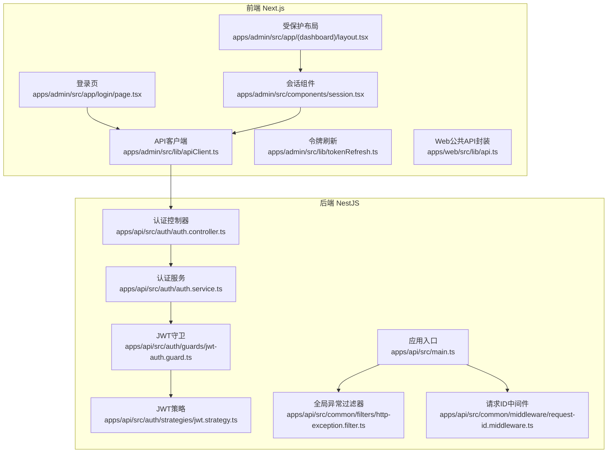
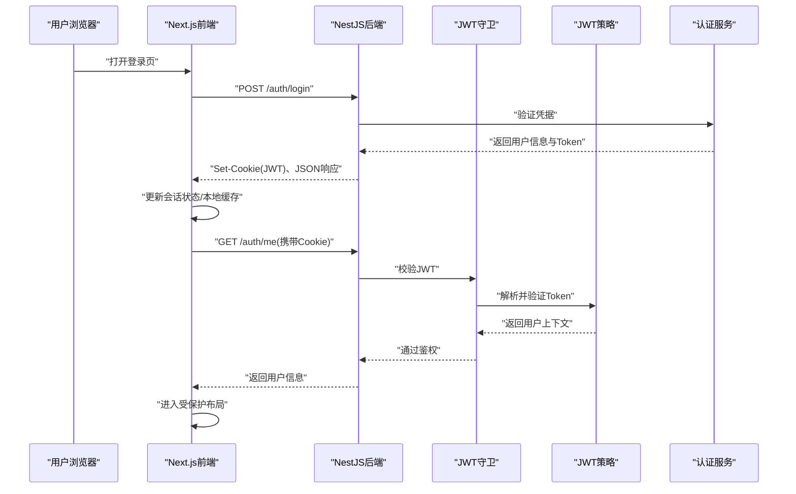
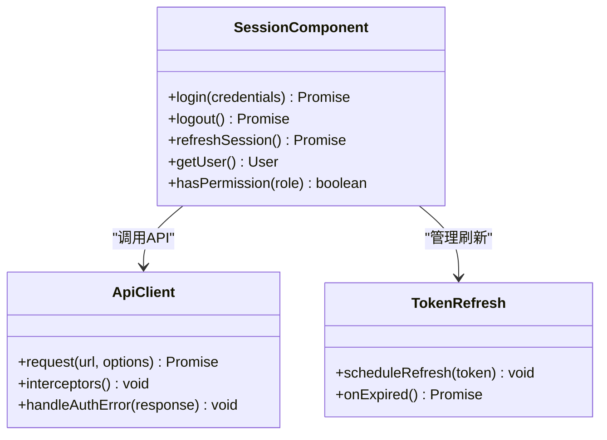
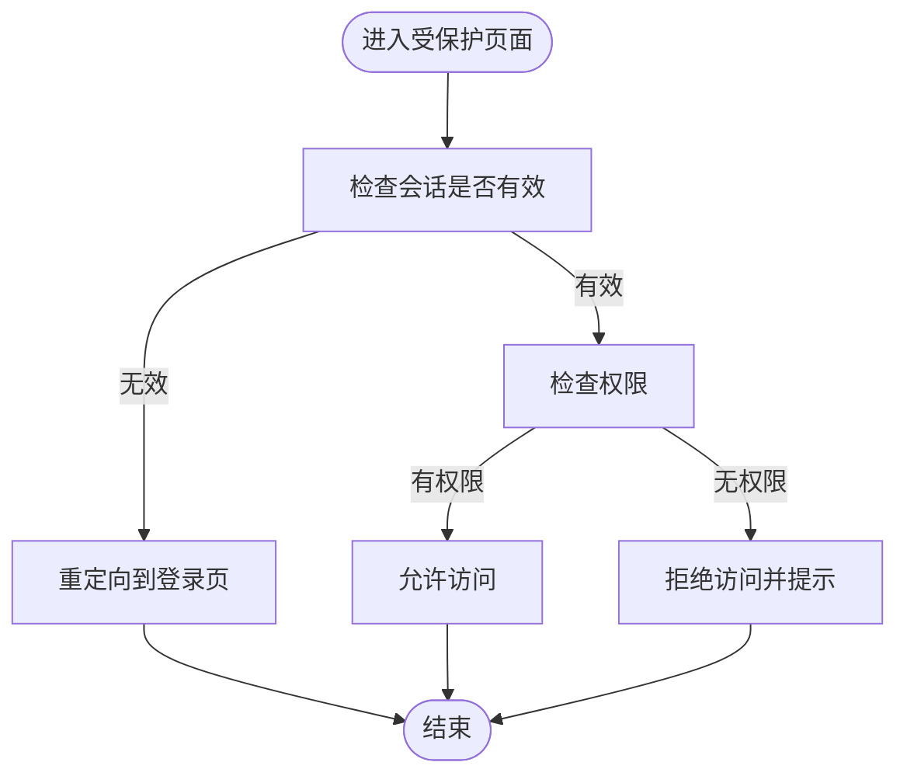
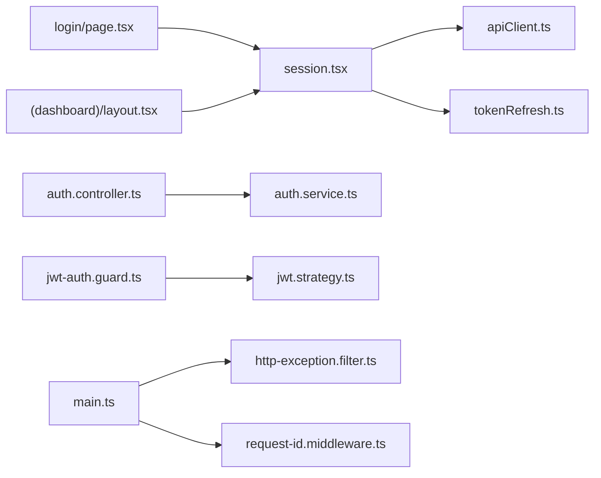

# 会话管理

<cite>
**本文引用的文件**   
- [apps/admin/src/components/session.tsx](file://apps/admin/src/components/session.tsx)
- [apps/admin/src/lib/auth.ts](file://apps/admin/src/lib/auth.ts)
- [apps/admin/src/lib/tokenRefresh.ts](file://apps/admin/src/lib/tokenRefresh.ts)
- [apps/admin/src/lib/apiClient.ts](file://apps/admin/src/lib/apiClient.ts)
- [apps/admin/src/app/login/page.tsx](file://apps/admin/src/app/login/page.tsx)
- [apps/admin/src/app/(dashboard)/layout.tsx](file://apps/admin/src/app/(dashboard)/layout.tsx)
- [apps/admin/src/features/access.ts](file://apps/admin/src/features/access.ts)
- [apps/api/src/auth/auth.controller.ts](file://apps/api/src/auth/auth.controller.ts)
- [apps/api/src/auth/auth.service.ts](file://apps/api/src/auth/auth.service.ts)
- [apps/api/src/auth/guards/jwt-auth.guard.ts](file://apps/api/src/auth/guards/jwt-auth.guard.ts)
- [apps/api/src/auth/strategies/jwt.strategy.ts](file://apps/api/src/auth/strategies/jwt.strategy.ts)
- [apps/api/src/common/middleware/request-id.middleware.ts](file://apps/api/src/common/middleware/request-id.middleware.ts)
- [apps/api/src/common/filters/http-exception.filter.ts](file://apps/api/src/common/filters/http-exception.filter.ts)
- [apps/api/src/main.ts](file://apps/api/src/main.ts)
- [apps/api/src/config/env.validation.ts](file://apps/api/src/config/env.validation.ts)
- [apps/web/src/lib/api.ts](file://apps/web/src/lib/api.ts)
</cite>

## 目录
1. [简介](#简介)
2. [项目结构](#项目结构)
3. [核心组件](#核心组件)
4. [架构总览](#架构总览)
5. [详细组件分析](#详细组件分析)
6. [依赖关系分析](#依赖关系分析)
7. [性能考虑](#性能考虑)
8. [故障排查指南](#故障排查指南)
9. [结论](#结论)
10. [附录](#附录)

## 简介
本文件面向“会话管理系统”的完整实现与最佳实践，覆盖前后端会话状态维护、Cookie 管理、会话安全策略（CSRF、XSS、会话劫持防护）、登录状态保持、自动重定向与会话超时处理。同时给出 Next.js 前端与 NestJS 后端之间建立安全会话通信的具体示例，并说明多设备登录处理与会话同步机制。

## 项目结构
本项目采用前后端分离架构：
- 前端 Next.js（admin 与 web）负责页面渲染、路由守卫、请求封装、Token 刷新与本地状态管理。
- 后端 NestJS（api）提供认证接口、JWT 签发与校验、权限控制、全局异常与中间件等。

图表来源
- [apps/admin/src/app/login/page.tsx](file://apps/admin/src/app/login/page.tsx)
- [apps/admin/src/app/(dashboard)/layout.tsx](file://apps/admin/src/app/(dashboard)/layout.tsx)
- [apps/admin/src/components/session.tsx](file://apps/admin/src/components/session.tsx)
- [apps/admin/src/lib/apiClient.ts](file://apps/admin/src/lib/apiClient.ts)
- [apps/api/src/auth/auth.controller.ts](file://apps/api/src/auth/auth.controller.ts)
- [apps/api/src/auth/auth.service.ts](file://apps/api/src/auth/auth.service.ts)
- [apps/api/src/auth/guards/jwt-auth.guard.ts](file://apps/api/src/auth/guards/jwt-auth.guard.ts)
- [apps/api/src/auth/strategies/jwt.strategy.ts](file://apps/api/src/auth/strategies/jwt.strategy.ts)
- [apps/api/src/common/filters/http-exception.filter.ts](file://apps/api/src/common/filters/http-exception.filter.ts)
- [apps/api/src/common/middleware/request-id.middleware.ts](file://apps/api/src/common/middleware/request-id.middleware.ts)
- [apps/api/src/main.ts](file://apps/api/src/main.ts)

章节来源
- [apps/admin/src/app/login/page.tsx](file://apps/admin/src/app/login/page.tsx)
- [apps/admin/src/app/(dashboard)/layout.tsx](file://apps/admin/src/app/(dashboard)/layout.tsx)
- [apps/admin/src/components/session.tsx](file://apps/admin/src/components/session.tsx)
- [apps/admin/src/lib/apiClient.ts](file://apps/admin/src/lib/apiClient.ts)
- [apps/api/src/auth/auth.controller.ts](file://apps/api/src/auth/auth.controller.ts)
- [apps/api/src/auth/auth.service.ts](file://apps/api/src/auth/auth.service.ts)
- [apps/api/src/auth/guards/jwt-auth.guard.ts](file://apps/api/src/auth/guards/jwt-auth.guard.ts)
- [apps/api/src/auth/strategies/jwt.strategy.ts](file://apps/api/src/auth/strategies/jwt.strategy.ts)
- [apps/api/src/common/filters/http-exception.filter.ts](file://apps/api/src/common/filters/http-exception.filter.ts)
- [apps/api/src/common/middleware/request-id.middleware.ts](file://apps/api/src/common/middleware/request-id.middleware.ts)
- [apps/api/src/main.ts](file://apps/api/src/main.ts)

## 核心组件
- 前端会话状态与UI
  - 会话组件：集中管理登录态、用户信息、登出与错误提示。
  - API 客户端：统一拦截器，附加 Cookie/Token、处理跨域与安全头、重试与错误映射。
  - Token 刷新：基于时间窗口或响应码触发静默刷新，避免频繁刷新与并发刷新。
  - 登录页与受保护布局：登录成功后跳转受保护区域；未登录时自动重定向。
- 后端认证与安全
  - 认证控制器与服务：登录、登出、刷新、获取当前用户等。
  - JWT 守卫与策略：解析并验证 Token，注入当前用户上下文。
  - 全局异常过滤器与中间件：标准化错误响应、记录请求ID便于追踪。
  - 环境变量校验：确保密钥、过期时间、CORS、Cookie 配置正确。

章节来源
- [apps/admin/src/components/session.tsx](file://apps/admin/src/components/session.tsx)
- [apps/admin/src/lib/apiClient.ts](file://apps/admin/src/lib/apiClient.ts)
- [apps/admin/src/lib/tokenRefresh.ts](file://apps/admin/src/lib/tokenRefresh.ts)
- [apps/admin/src/app/login/page.tsx](file://apps/admin/src/app/login/page.tsx)
- [apps/admin/src/app/(dashboard)/layout.tsx](file://apps/admin/src/app/(dashboard)/layout.tsx)
- [apps/api/src/auth/auth.controller.ts](file://apps/api/src/auth/auth.controller.ts)
- [apps/api/src/auth/auth.service.ts](file://apps/api/src/auth/auth.service.ts)
- [apps/api/src/auth/guards/jwt-auth.guard.ts](file://apps/api/src/auth/guards/jwt-auth.guard.ts)
- [apps/api/src/auth/strategies/jwt.strategy.ts](file://apps/api/src/auth/strategies/jwt.strategy.ts)
- [apps/api/src/common/filters/http-exception.filter.ts](file://apps/api/src/common/filters/http-exception.filter.ts)
- [apps/api/src/common/middleware/request-id.middleware.ts](file://apps/api/src/common/middleware/request-id.middleware.ts)
- [apps/api/src/config/env.validation.ts](file://apps/api/src/config/env.validation.ts)

## 架构总览
下图展示从浏览器发起登录到受保护资源访问的端到端流程，包括 Cookie 设置、JWT 校验、权限守卫与错误处理。

图表来源
- [apps/admin/src/app/login/page.tsx](file://apps/admin/src/app/login/page.tsx)
- [apps/admin/src/lib/apiClient.ts](file://apps/admin/src/lib/apiClient.ts)
- [apps/api/src/auth/auth.controller.ts](file://apps/api/src/auth/auth.controller.ts)
- [apps/api/src/auth/auth.service.ts](file://apps/api/src/auth/auth.service.ts)
- [apps/api/src/auth/guards/jwt-auth.guard.ts](file://apps/api/src/auth/guards/jwt-auth.guard.ts)
- [apps/api/src/auth/strategies/jwt.strategy.ts](file://apps/api/src/auth/strategies/jwt.strategy.ts)

## 详细组件分析

### 前端会话组件与状态管理
- 职责
  - 维护登录态、用户信息、角色与权限。
  - 提供登录、登出、刷新会话等方法。
  - 与 API 客户端协作，处理 Cookie 与 Token 生命周期。
- 关键点
  - 使用 HttpOnly Cookie 存储 Token 以避免 XSS 窃取。
  - 在组件挂载时检查会话有效性，必要时触发刷新。
  - 将错误消息通过 UI 提示反馈给用户。

图表来源
- [apps/admin/src/components/session.tsx](file://apps/admin/src/components/session.tsx)
- [apps/admin/src/lib/apiClient.ts](file://apps/admin/src/lib/apiClient.ts)
- [apps/admin/src/lib/tokenRefresh.ts](file://apps/admin/src/lib/tokenRefresh.ts)

章节来源
- [apps/admin/src/components/session.tsx](file://apps/admin/src/components/session.tsx)
- [apps/admin/src/lib/apiClient.ts](file://apps/admin/src/lib/apiClient.ts)
- [apps/admin/src/lib/tokenRefresh.ts](file://apps/admin/src/lib/tokenRefresh.ts)

### 登录与受保护路由
- 登录流程
  - 提交用户名/密码至后端认证接口。
  - 后端返回 Set-Cookie（HttpOnly、Secure、SameSite）。
  - 前端更新会话状态并重定向到目标页面。
- 受保护路由
  - 在布局层检查会话有效性，未登录则重定向到登录页。
  - 已登录但无权限时显示相应提示。

图表来源
- [apps/admin/src/app/(dashboard)/layout.tsx](file://apps/admin/src/app/(dashboard)/layout.tsx)
- [apps/admin/src/app/login/page.tsx](file://apps/admin/src/app/login/page.tsx)

章节来源
- [apps/admin/src/app/(dashboard)/layout.tsx](file://apps/admin/src/app/(dashboard)/layout.tsx)
- [apps/admin/src/app/login/page.tsx](file://apps/admin/src/app/login/page.tsx)

### API 客户端与请求拦截
- 功能
  - 统一添加 Cookie、Content-Type、Accept 等头部。
  - 处理 401/403 响应，触发登出或刷新。
  - 支持重试与退避策略，提升稳定性。
- 安全要点
  - 不将敏感 Token 放入 URL 或日志。
  - 严格校验跨域与 Cookie 属性（Secure、SameSite）。

章节来源
- [apps/admin/src/lib/apiClient.ts](file://apps/admin/src/lib/apiClient.ts)
- [apps/web/src/lib/api.ts](file://apps/web/src/lib/api.ts)

### 令牌刷新策略
- 触发条件
  - 基于剩余有效期阈值（如剩余 < 5 分钟）预刷新。
  - 收到 401 响应且为 Token 过期时触发刷新。
- 并发控制
  - 防止多次并发刷新，使用队列或标志位。
- 失败处理
  - 刷新失败则清理会话并重定向登录。

章节来源
- [apps/admin/src/lib/tokenRefresh.ts](file://apps/admin/src/lib/tokenRefresh.ts)

### 后端认证控制器与服务
- 控制器
  - 暴露登录、登出、刷新、获取当前用户等接口。
  - 设置 Cookie 属性（HttpOnly、Secure、SameSite=Strict/Lax）。
- 服务
  - 校验凭据、生成/刷新 Token、维护会话元数据（可选）。
  - 支持多设备登录与会话列表管理。

章节来源
- [apps/api/src/auth/auth.controller.ts](file://apps/api/src/auth/auth.controller.ts)
- [apps/api/src/auth/auth.service.ts](file://apps/api/src/auth/auth.service.ts)

### JWT 守卫与策略
- 守卫
  - 拦截需要鉴权的请求，提取 Cookie 中的 Token。
  - 校验签名、过期时间与黑名单（可选）。
- 策略
  - 解析 Token 载荷，注入当前用户到请求上下文。
  - 支持角色/权限扩展。

章节来源
- [apps/api/src/auth/guards/jwt-auth.guard.ts](file://apps/api/src/auth/guards/jwt-auth.guard.ts)
- [apps/api/src/auth/strategies/jwt.strategy.ts](file://apps/api/src/auth/strategies/jwt.strategy.ts)

### 全局异常与中间件
- 异常过滤器
  - 统一错误格式、隐藏内部堆栈、记录请求ID。
- 中间件
  - 为每个请求分配唯一 ID，便于链路追踪。
  - 可集成 CORS、速率限制、审计日志等。

章节来源
- [apps/api/src/common/filters/http-exception.filter.ts](file://apps/api/src/common/filters/http-exception.filter.ts)
- [apps/api/src/common/middleware/request-id.middleware.ts](file://apps/api/src/common/middleware/request-id.middleware.ts)
- [apps/api/src/main.ts](file://apps/api/src/main.ts)

### 环境变量与配置校验
- 关键配置项
  - JWT 密钥、过期时间、刷新令牌策略。
  - CORS 白名单、Cookie 域名与路径。
  - HTTPS 强制、安全头（HSTS、CSP）。
- 校验
  - 启动时校验必填项，缺失则快速失败。

章节来源
- [apps/api/src/config/env.validation.ts](file://apps/api/src/config/env.validation.ts)

## 依赖关系分析
- 前端依赖
  - session.tsx 依赖 apiClient.ts 与 tokenRefresh.ts。
  - 登录页与受保护布局依赖 session.tsx 进行状态判断与重定向。
- 后端依赖
  - auth.controller.ts 依赖 auth.service.ts。
  - jwt-auth.guard.ts 依赖 jwt.strategy.ts。
  - main.ts 注册全局过滤器与中间件。

图表来源
- [apps/admin/src/components/session.tsx](file://apps/admin/src/components/session.tsx)
- [apps/admin/src/lib/apiClient.ts](file://apps/admin/src/lib/apiClient.ts)
- [apps/admin/src/lib/tokenRefresh.ts](file://apps/admin/src/lib/tokenRefresh.ts)
- [apps/admin/src/app/login/page.tsx](file://apps/admin/src/app/login/page.tsx)
- [apps/admin/src/app/(dashboard)/layout.tsx](file://apps/admin/src/app/(dashboard)/layout.tsx)
- [apps/api/src/auth/auth.controller.ts](file://apps/api/src/auth/auth.controller.ts)
- [apps/api/src/auth/auth.service.ts](file://apps/api/src/auth/auth.service.ts)
- [apps/api/src/auth/guards/jwt-auth.guard.ts](file://apps/api/src/auth/guards/jwt-auth.guard.ts)
- [apps/api/src/auth/strategies/jwt.strategy.ts](file://apps/api/src/auth/strategies/jwt.strategy.ts)
- [apps/api/src/common/filters/http-exception.filter.ts](file://apps/api/src/common/filters/http-exception.filter.ts)
- [apps/api/src/common/middleware/request-id.middleware.ts](file://apps/api/src/common/middleware/request-id.middleware.ts)
- [apps/api/src/main.ts](file://apps/api/src/main.ts)

章节来源
- [apps/admin/src/components/session.tsx](file://apps/admin/src/components/session.tsx)
- [apps/admin/src/lib/apiClient.ts](file://apps/admin/src/lib/apiClient.ts)
- [apps/admin/src/lib/tokenRefresh.ts](file://apps/admin/src/lib/tokenRefresh.ts)
- [apps/admin/src/app/login/page.tsx](file://apps/admin/src/app/login/page.tsx)
- [apps/admin/src/app/(dashboard)/layout.tsx](file://apps/admin/src/app/(dashboard)/layout.tsx)
- [apps/api/src/auth/auth.controller.ts](file://apps/api/src/auth/auth.controller.ts)
- [apps/api/src/auth/auth.service.ts](file://apps/api/src/auth/auth.service.ts)
- [apps/api/src/auth/guards/jwt-auth.guard.ts](file://apps/api/src/auth/guards/jwt-auth.guard.ts)
- [apps/api/src/auth/strategies/jwt.strategy.ts](file://apps/api/src/auth/strategies/jwt.strategy.ts)
- [apps/api/src/common/filters/http-exception.filter.ts](file://apps/api/src/common/filters/http-exception.filter.ts)
- [apps/api/src/common/middleware/request-id.middleware.ts](file://apps/api/src/common/middleware/request-id.middleware.ts)
- [apps/api/src/main.ts](file://apps/api/src/main.ts)

## 性能考虑
- 减少不必要的刷新
  - 基于阈值预刷新，避免每次请求都校验。
  - 合并并发刷新请求，降低后端压力。
- 缓存与幂等
  - 对只读接口启用合理缓存策略。
  - 幂等接口设计避免重复操作。
- 网络优化
  - 连接复用、压缩、CDN 静态资源。
  - 错误重试与退避策略避免雪崩。

[本节为通用指导，无需引用具体文件]

## 故障排查指南
- 常见问题
  - 401 未授权：检查 Cookie 是否被浏览器拦截、跨域配置是否正确、Token 是否过期。
  - 403 禁止访问：检查角色与权限配置、守卫逻辑。
  - 登录成功但无法访问受保护页面：检查会话初始化与路由守卫顺序。
- 定位方法
  - 查看请求ID与服务器日志，确认链路。
  - 检查浏览器开发者工具中 Cookie 属性（HttpOnly、Secure、SameSite）。
  - 核对环境变量与部署配置（HTTPS、CORS、域名）。

章节来源
- [apps/api/src/common/filters/http-exception.filter.ts](file://apps/api/src/common/filters/http-exception.filter.ts)
- [apps/api/src/common/middleware/request-id.middleware.ts](file://apps/api/src/common/middleware/request-id.middleware.ts)
- [apps/api/src/config/env.validation.ts](file://apps/api/src/config/env.validation.ts)

## 结论
本会话管理方案以 HttpOnly Cookie + JWT 为核心，结合前端会话组件、API 客户端拦截与令牌刷新策略，实现了安全的登录态保持、自动重定向与会话超时处理。后端通过 JWT 守卫与策略完成鉴权，配合全局异常与中间件保障可观测性与健壮性。建议在生产环境启用 HTTPS、严格 CORS、最小化 Cookie 作用域，并完善多设备登录与会话同步机制。

[本节为总结，无需引用具体文件]

## 附录

### 安全策略清单
- CSRF 防护
  - 使用 SameSite=Strict/Lax 的 Cookie。
  - 对写操作增加自定义 Header 校验或双重提交 Token。
- XSS 防护
  - 所有 Cookie 标记 HttpOnly。
  - 输出内容转义，启用 CSP 头。
- 会话劫持防护
  - 强制 HTTPS，启用 HSTS。
  - 绑定设备指纹或 IP（谨慎使用），定期轮换 Token。
  - 服务端维护会话黑名单/注销广播。

[本节为通用指导，无需引用具体文件]

### 多设备登录与会话同步
- 多设备登录
  - 服务端维护用户会话列表，支持独立失效。
  - 前端根据响应码或事件通知切换会话。
- 会话同步
  - 使用 WebSocket 或轮询推送登出事件。
  - 前端监听事件后清理本地状态并重定向。

[本节为通用指导，无需引用具体文件]

### 实现示例参考
- Next.js 前端
  - 登录页与受保护布局：参见 [apps/admin/src/app/login/page.tsx](file://apps/admin/src/app/login/page.tsx)、[apps/admin/src/app/(dashboard)/layout.tsx](file://apps/admin/src/app/(dashboard)/layout.tsx)。
  - 会话组件与 API 客户端：参见 [apps/admin/src/components/session.tsx](file://apps/admin/src/components/session.tsx)、[apps/admin/src/lib/apiClient.ts](file://apps/admin/src/lib/apiClient.ts)。
  - 令牌刷新：参见 [apps/admin/src/lib/tokenRefresh.ts](file://apps/admin/src/lib/tokenRefresh.ts)。
- NestJS 后端
  - 认证控制器与服务：参见 [apps/api/src/auth/auth.controller.ts](file://apps/api/src/auth/auth.controller.ts)、[apps/api/src/auth/auth.service.ts](file://apps/api/src/auth/auth.service.ts)。
  - JWT 守卫与策略：参见 [apps/api/src/auth/guards/jwt-auth.guard.ts](file://apps/api/src/auth/guards/jwt-auth.guard.ts)、[apps/api/src/auth/strategies/jwt.strategy.ts](file://apps/api/src/auth/strategies/jwt.strategy.ts)。
  - 全局异常与中间件：参见 [apps/api/src/common/filters/http-exception.filter.ts](file://apps/api/src/common/filters/http-exception.filter.ts)、[apps/api/src/common/middleware/request-id.middleware.ts](file://apps/api/src/common/middleware/request-id.middleware.ts)、[apps/api/src/main.ts](file://apps/api/src/main.ts)。
  - 环境变量校验：参见 [apps/api/src/config/env.validation.ts](file://apps/api/src/config/env.validation.ts)。

章节来源
- [apps/admin/src/app/login/page.tsx](file://apps/admin/src/app/login/page.tsx)
- [apps/admin/src/app/(dashboard)/layout.tsx](file://apps/admin/src/app/(dashboard)/layout.tsx)
- [apps/admin/src/components/session.tsx](file://apps/admin/src/components/session.tsx)
- [apps/admin/src/lib/apiClient.ts](file://apps/admin/src/lib/apiClient.ts)
- [apps/admin/src/lib/tokenRefresh.ts](file://apps/admin/src/lib/tokenRefresh.ts)
- [apps/api/src/auth/auth.controller.ts](file://apps/api/src/auth/auth.controller.ts)
- [apps/api/src/auth/auth.service.ts](file://apps/api/src/auth/auth.service.ts)
- [apps/api/src/auth/guards/jwt-auth.guard.ts](file://apps/api/src/auth/guards/jwt-auth.guard.ts)
- [apps/api/src/auth/strategies/jwt.strategy.ts](file://apps/api/src/auth/strategies/jwt.strategy.ts)
- [apps/api/src/common/filters/http-exception.filter.ts](file://apps/api/src/common/filters/http-exception.filter.ts)
- [apps/api/src/common/middleware/request-id.middleware.ts](file://apps/api/src/common/middleware/request-id.middleware.ts)
- [apps/api/src/main.ts](file://apps/api/src/main.ts)
- [apps/api/src/config/env.validation.ts](file://apps/api/src/config/env.validation.ts)