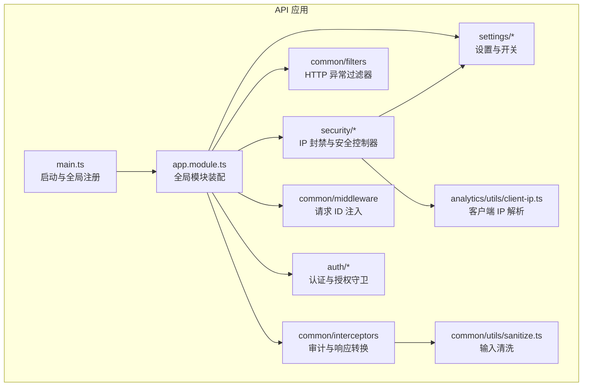
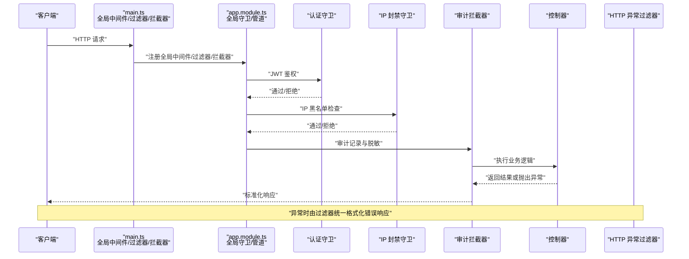
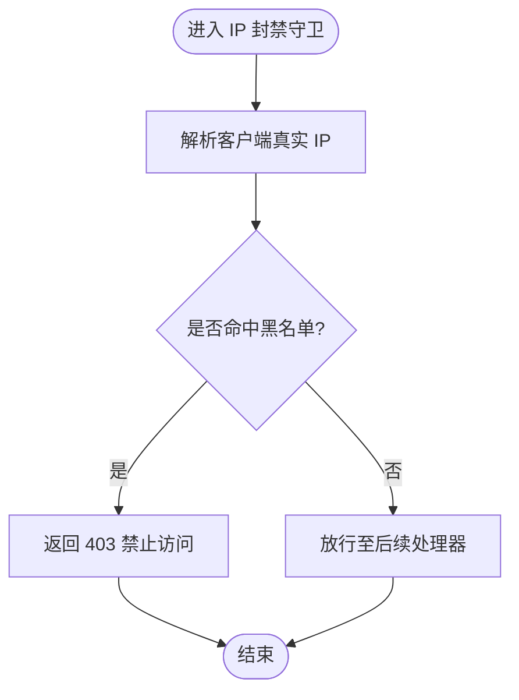
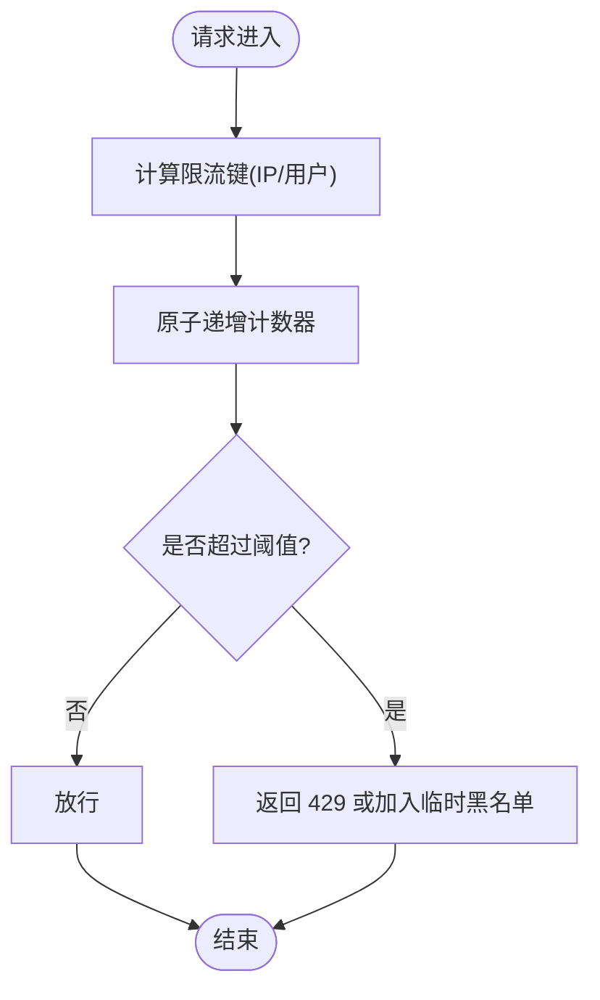
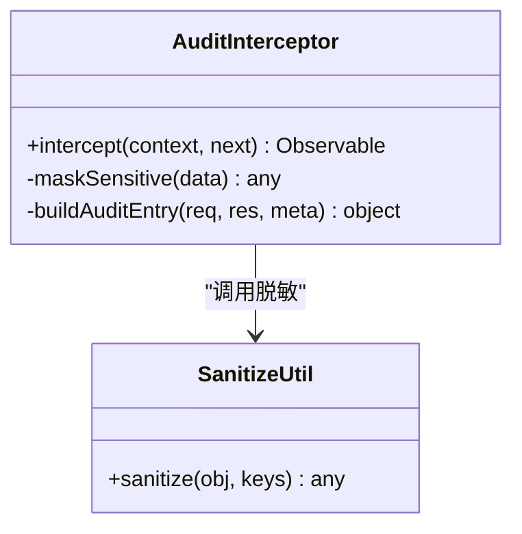
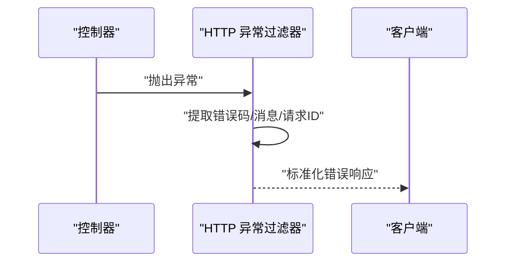
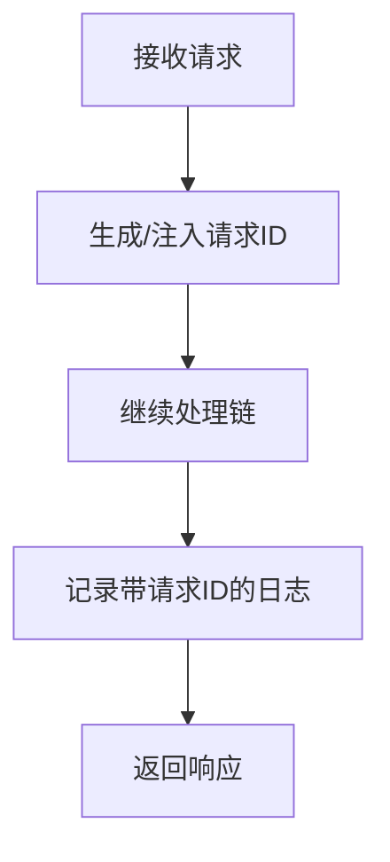
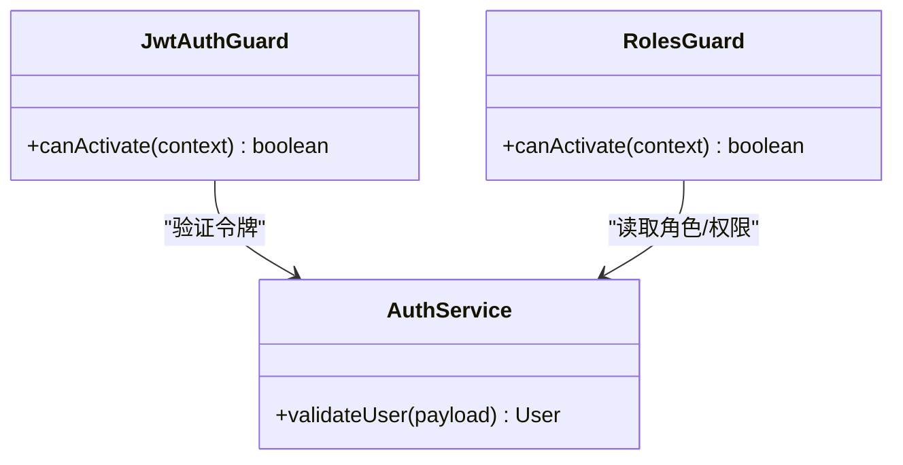
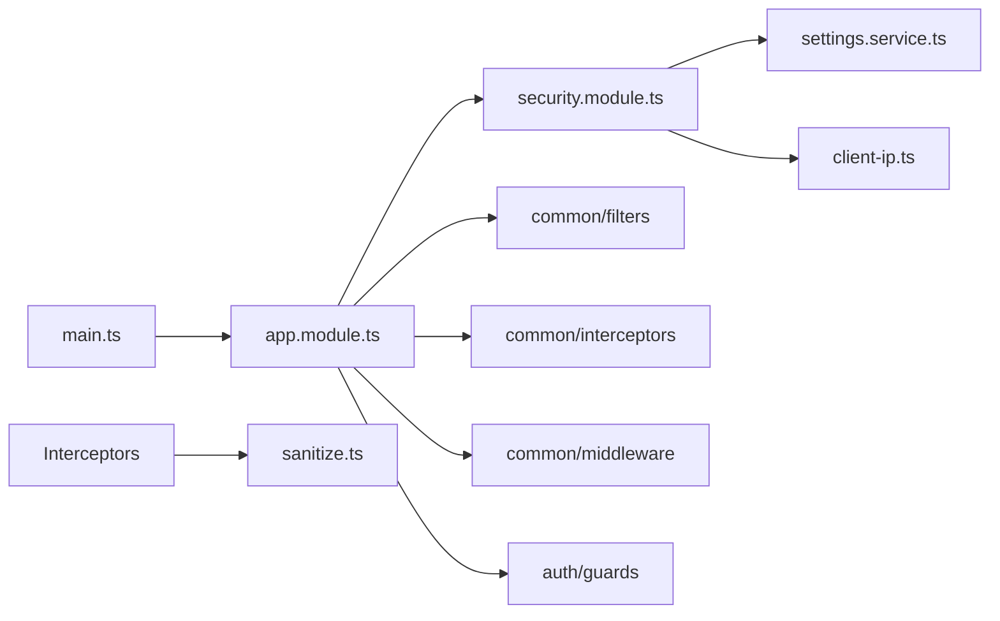

# 安全中间件与防护

<cite>
**本文引用的文件**   
- [app.module.ts](file://apps/api/src/app.module.ts)
- [main.ts](file://apps/api/src/main.ts)
- [ip-ban.guard.ts](file://apps/api/src/security/ip-ban.guard.ts)
- [ip-ban.service.ts](file://apps/api/src/security/ip-ban.service.ts)
- [security.controller.ts](file://apps/api/src/security/security.controller.ts)
- [security.module.ts](file://apps/api/src/security/security.module.ts)
- [http-exception.filter.ts](file://apps/api/src/common/filters/http-exception.filter.ts)
- [audit.interceptor.ts](file://apps/api/src/common/interceptors/audit.interceptor.ts)
- [transform.interceptor.ts](file://apps/api/src/common/interceptors/transform.interceptor.ts)
- [request-id.middleware.ts](file://apps/api/src/common/middleware/request-id.middleware.ts)
- [env.validation.ts](file://apps/api/src/config/env.validation.ts)
- [jwt-auth.guard.ts](file://apps/api/src/auth/guards/jwt-auth.guard.ts)
- [roles.guard.ts](file://apps/api/src/auth/guards/roles.guard.ts)
- [auth.controller.ts](file://apps/api/src/auth/auth.controller.ts)
- [auth.service.ts](file://apps/api/src/auth/auth.service.ts)
- [client-ip.ts](file://apps/api/src/analytics/utils/client-ip.ts)
- [client-ip.ts](file://apps/api/src/common/utils/client-ip.ts)
- [sanitize.ts](file://apps/api/src/common/utils/sanitize.ts)
- [media-guard.service.ts](file://apps/api/src/media/media-guard.service.ts)
- [settings.schema.ts](file://apps/api/src/settings/settings.schema.ts)
- [settings.service.ts](file://apps/api/src/settings/settings.service.ts)
</cite>

## 目录
1. [简介](#简介)
2. [项目结构](#项目结构)
3. [核心组件](#核心组件)
4. [架构总览](#架构总览)
5. [详细组件分析](#详细组件分析)
6. [依赖关系分析](#依赖关系分析)
7. [性能考量](#性能考量)
8. [故障排查指南](#故障排查指南)
9. [结论](#结论)
10. [附录](#附录)

## 简介
本文件聚焦于后端 API（NestJS）的安全中间件与防护机制，涵盖以下主题：
- IP 封禁机制：基于守卫与服务实现的可配置 IP 黑名单拦截。
- 请求频率限制：通过中间件、守卫与设置中心协同实现限流策略。
- 异常处理策略：统一 HTTP 异常过滤器与错误响应格式化。
- 审计拦截器：操作日志记录与敏感信息过滤。
- 调试信息控制：全局开关与环境变量驱动。
- 安全事件监控、告警与响应：结合审计日志与外部集成能力。

## 项目结构
本项目采用多应用仓库，API 服务位于 apps/api，安全相关能力集中在 security 模块与 common 层（filters、interceptors、middleware、utils）。

**图表来源** 
- [main.ts:1-100](file://apps/api/src/main.ts#L1-L100)
- [app.module.ts:1-200](file://apps/api/src/app.module.ts#L1-L200)
- [security.module.ts:1-120](file://apps/api/src/security/security.module.ts#L1-L120)

**章节来源**
- [main.ts:1-100](file://apps/api/src/main.ts#L1-L100)
- [app.module.ts:1-200](file://apps/api/src/app.module.ts#L1-L200)

## 核心组件
- IP 封禁守卫与服务：用于在请求进入业务逻辑前检查并拒绝来自黑名单 IP 的请求。
- 审计拦截器：在请求生命周期中记录关键操作，并对敏感字段进行脱敏。
- HTTP 异常过滤器：统一捕获异常，输出标准化错误响应。
- 请求 ID 中间件：为每个请求生成唯一标识，便于追踪与审计。
- 认证与授权守卫：JWT 校验与角色权限控制。
- 设置与开关：通过设置中心管理安全策略开关与阈值。

**章节来源**
- [ip-ban.guard.ts:1-200](file://apps/api/src/security/ip-ban.guard.ts#L1-L200)
- [ip-ban.service.ts:1-200](file://apps/api/src/security/ip-ban.service.ts#L1-L200)
- [audit.interceptor.ts:1-200](file://apps/api/src/common/interceptors/audit.interceptor.ts#L1-L200)
- [http-exception.filter.ts:1-200](file://apps/api/src/common/filters/http-exception.filter.ts#L1-L200)
- [request-id.middleware.ts:1-200](file://apps/api/src/common/middleware/request-id.middleware.ts#L1-L200)
- [jwt-auth.guard.ts:1-200](file://apps/api/src/auth/guards/jwt-auth.guard.ts#L1-L200)
- [roles.guard.ts:1-200](file://apps/api/src/auth/guards/roles.guard.ts#L1-L200)
- [settings.schema.ts:1-200](file://apps/api/src/settings/settings.schema.ts#L1-L200)
- [settings.service.ts:1-200](file://apps/api/src/settings/settings.service.ts#L1-L200)

## 架构总览
下图展示了请求从入口到控制器处理的完整链路，以及安全中间件、过滤器与拦截器的协作方式。

**图表来源** 
- [main.ts:1-100](file://apps/api/src/main.ts#L1-L100)
- [app.module.ts:1-200](file://apps/api/src/app.module.ts#L1-L200)
- [jwt-auth.guard.ts:1-200](file://apps/api/src/auth/guards/jwt-auth.guard.ts#L1-L200)
- [ip-ban.guard.ts:1-200](file://apps/api/src/security/ip-ban.guard.ts#L1-L200)
- [audit.interceptor.ts:1-200](file://apps/api/src/common/interceptors/audit.interceptor.ts#L1-L200)
- [http-exception.filter.ts:1-200](file://apps/api/src/common/filters/http-exception.filter.ts#L1-L200)

## 详细组件分析

### IP 封禁机制
- 守卫职责：在请求到达控制器前，根据客户端 IP 判断是否在黑名单中；若命中则直接拒绝。
- 服务职责：提供 IP 黑名单的增删查改接口，支持持久化存储与缓存优化。
- 数据来源：可从设置中心读取白名单/黑名单策略，结合客户端 IP 解析工具获取真实 IP。
- 典型流程：
  - 解析客户端 IP（考虑代理头）。
  - 查询黑名单集合（内存/缓存/数据库）。
  - 命中则返回 403；未命中则放行。

**图表来源** 
- [ip-ban.guard.ts:1-200](file://apps/api/src/security/ip-ban.guard.ts#L1-L200)
- [ip-ban.service.ts:1-200](file://apps/api/src/security/ip-ban.service.ts#L1-L200)
- [client-ip.ts:1-200](file://apps/api/src/analytics/utils/client-ip.ts#L1-L200)

**章节来源**
- [ip-ban.guard.ts:1-200](file://apps/api/src/security/ip-ban.guard.ts#L1-L200)
- [ip-ban.service.ts:1-200](file://apps/api/src/security/ip-ban.service.ts#L1-L200)
- [security.controller.ts:1-200](file://apps/api/src/security/security.controller.ts#L1-L200)
- [client-ip.ts:1-200](file://apps/api/src/analytics/utils/client-ip.ts#L1-L200)

### 请求频率限制
- 实现思路：可通过中间件或守卫对同一 IP/用户维度进行计数与阈值判断。
- 建议策略：
  - 使用 Redis 作为计数器存储，按时间窗口滑动统计。
  - 针对登录、验证码等敏感接口提高限制强度。
  - 结合设置中心动态调整阈值与窗口大小。
- 与 IP 封禁联动：当超过阈值多次失败后，自动加入临时黑名单。

[本节为概念性说明，不直接分析具体文件]

### 审计拦截器与操作日志
- 职责：
  - 记录请求上下文（方法、路径、参数、耗时、用户、IP、请求 ID）。
  - 对敏感字段进行脱敏（如密码、令牌、身份证号等）。
  - 将审计事件写入日志或消息队列，供后续分析与告警。
- 敏感信息过滤：
  - 定义敏感字段清单，递归清理 DTO/对象中的敏感值。
  - 在响应阶段再次过滤，避免泄露。

**图表来源** 
- [audit.interceptor.ts:1-200](file://apps/api/src/common/interceptors/audit.interceptor.ts#L1-L200)
- [sanitize.ts:1-200](file://apps/api/src/common/utils/sanitize.ts#L1-L200)

**章节来源**
- [audit.interceptor.ts:1-200](file://apps/api/src/common/interceptors/audit.interceptor.ts#L1-L200)
- [sanitize.ts:1-200](file://apps/api/src/common/utils/sanitize.ts#L1-L200)

### HTTP 异常过滤器与错误响应格式化
- 统一捕获 NestJS 异常与业务异常。
- 输出标准错误格式：包含错误码、消息、时间戳、请求 ID 等。
- 区分环境：生产环境隐藏堆栈与内部细节，开发环境可开启详细调试信息。

**图表来源** 
- [http-exception.filter.ts:1-200](file://apps/api/src/common/filters/http-exception.filter.ts#L1-L200)

**章节来源**
- [http-exception.filter.ts:1-200](file://apps/api/src/common/filters/http-exception.filter.ts#L1-L200)

### 请求 ID 中间件与调试信息控制
- 请求 ID 中间件：为每个请求生成唯一 ID，贯穿日志与审计。
- 调试信息控制：
  - 通过环境变量开关全局调试模式。
  - 在生产环境禁用堆栈与敏感数据输出。
  - 结合设置中心允许管理员按需开启诊断端点。

**图表来源** 
- [request-id.middleware.ts:1-200](file://apps/api/src/common/middleware/request-id.middleware.ts#L1-L200)
- [env.validation.ts:1-200](file://apps/api/src/config/env.validation.ts#L1-L200)

**章节来源**
- [request-id.middleware.ts:1-200](file://apps/api/src/common/middleware/request-id.middleware.ts#L1-L200)
- [env.validation.ts:1-200](file://apps/api/src/config/env.validation.ts#L1-L200)

### 认证与授权守卫
- JWT 认证守卫：校验令牌有效性、过期时间与签名。
- 角色授权守卫：基于角色或权限注解进行细粒度访问控制。
- 与审计联动：记录认证与授权结果，便于安全审计。

**图表来源** 
- [jwt-auth.guard.ts:1-200](file://apps/api/src/auth/guards/jwt-auth.guard.ts#L1-L200)
- [roles.guard.ts:1-200](file://apps/api/src/auth/guards/roles.guard.ts#L1-L200)
- [auth.service.ts:1-200](file://apps/api/src/auth/auth.service.ts#L1-L200)

**章节来源**
- [jwt-auth.guard.ts:1-200](file://apps/api/src/auth/guards/jwt-auth.guard.ts#L1-L200)
- [roles.guard.ts:1-200](file://apps/api/src/auth/guards/roles.guard.ts#L1-L200)
- [auth.controller.ts:1-200](file://apps/api/src/auth/auth.controller.ts#L1-L200)
- [auth.service.ts:1-200](file://apps/api/src/auth/auth.service.ts#L1-L200)

### 媒体访问守卫
- 用途：保护媒体资源访问，防止未授权下载与遍历。
- 策略：基于用户会话、令牌或签名 URL 校验。

**章节来源**
- [media-guard.service.ts:1-200](file://apps/api/src/media/media-guard.service.ts#L1-L200)

## 依赖关系分析
- main.ts 负责全局注册中间件、过滤器、拦截器与全局守卫。
- app.module.ts 装配各功能模块，集中声明全局依赖。
- security 模块依赖设置中心与 IP 解析工具。
- 审计拦截器依赖脱敏工具与日志基础设施。
- 认证与授权守卫依赖用户服务与权限模型。

**图表来源** 
- [main.ts:1-100](file://apps/api/src/main.ts#L1-L100)
- [app.module.ts:1-200](file://apps/api/src/app.module.ts#L1-L200)
- [security.module.ts:1-120](file://apps/api/src/security/security.module.ts#L1-L120)

**章节来源**
- [main.ts:1-100](file://apps/api/src/main.ts#L1-L100)
- [app.module.ts:1-200](file://apps/api/src/app.module.ts#L1-L200)

## 性能考量
- IP 封禁查询应使用缓存（内存或 Redis），降低数据库压力。
- 审计日志异步落盘或入队，避免阻塞主流程。
- 敏感字段脱敏需控制深度与范围，避免过度序列化开销。
- 限流计数器使用原子操作与过期策略，减少锁竞争。
- 生产环境关闭详细调试信息，减少日志体积与 IO 压力。

[本节为通用指导，不直接分析具体文件]

## 故障排查指南
- 常见错误类型：
  - 401 未认证：检查 JWT 令牌有效性与签发服务。
  - 403 禁止访问：检查 IP 黑名单与角色权限。
  - 429 请求过多：检查限流阈值与窗口配置。
  - 500 服务器错误：查看审计日志与异常过滤器输出。
- 定位步骤：
  - 通过请求 ID 关联全链路日志。
  - 启用调试模式（仅测试环境）查看详细堆栈。
  - 检查设置中心的开关与阈值配置。
  - 核对 IP 解析与代理头配置是否正确。

**章节来源**
- [http-exception.filter.ts:1-200](file://apps/api/src/common/filters/http-exception.filter.ts#L1-L200)
- [audit.interceptor.ts:1-200](file://apps/api/src/common/interceptors/audit.interceptor.ts#L1-L200)
- [env.validation.ts:1-200](file://apps/api/src/config/env.validation.ts#L1-L200)

## 结论
本项目通过守卫、拦截器、过滤器与中间件的组合，构建了较为完善的安全防护体系。IP 封禁、审计日志、异常处理与调试控制在不同层面协同工作，配合设置中心可实现灵活配置与动态调整。建议在关键接口上叠加限流与风控策略，并结合外部监控系统实现告警与自动化响应。

[本节为总结性内容，不直接分析具体文件]

## 附录

### 配置示例（启用安全防护措施）
- 启用 IP 封禁：
  - 在安全模块中注册 IP 封禁守卫。
  - 通过设置中心维护黑名单列表。
- 启用请求频率限制：
  - 在中间件或守卫中实现限流逻辑。
  - 使用 Redis 存储计数器与过期策略。
- 启用审计日志：
  - 在全局注册审计拦截器。
  - 配置敏感字段脱敏规则。
- 启用统一异常处理：
  - 全局注册 HTTP 异常过滤器。
  - 设置生产/开发环境的错误输出级别。
- 启用调试信息控制：
  - 通过环境变量开关调试模式。
  - 在设置中心暴露诊断端点开关。

[本节为概念性说明，不直接分析具体文件]