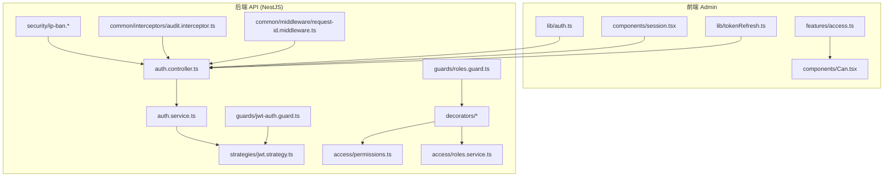
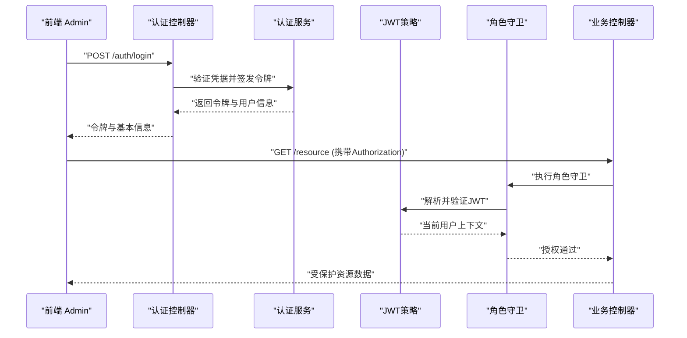
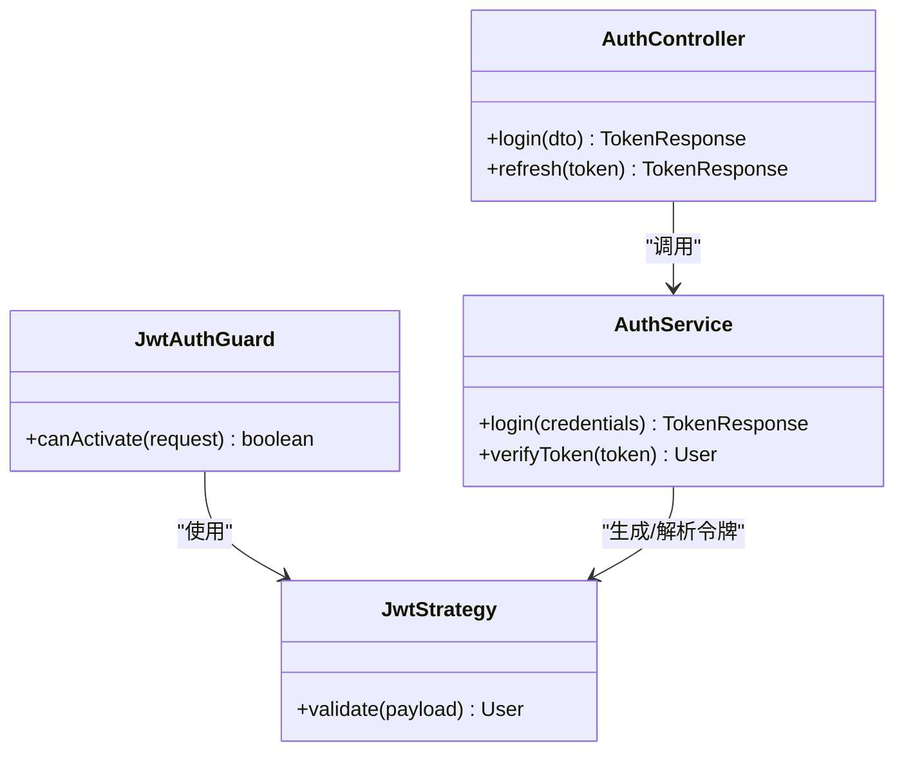
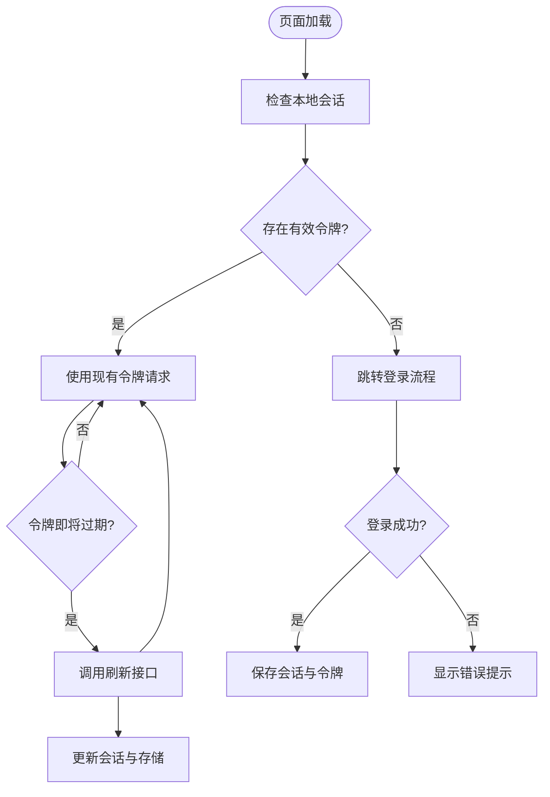
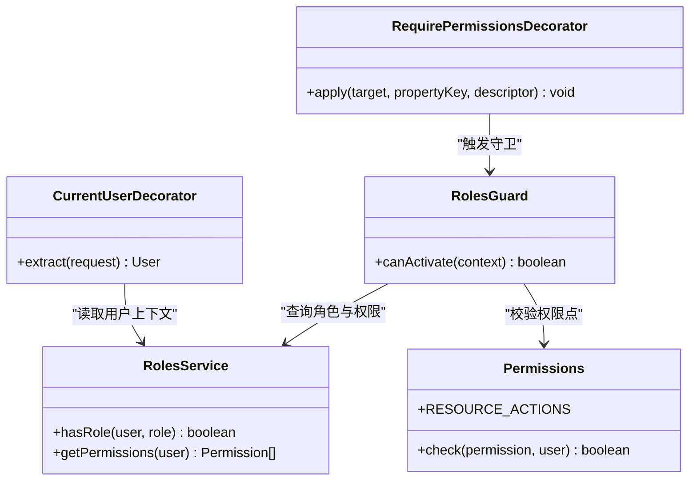
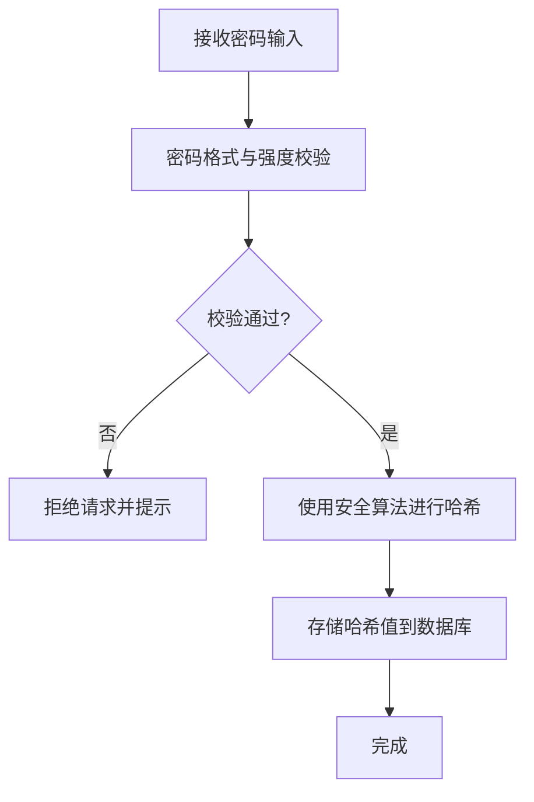
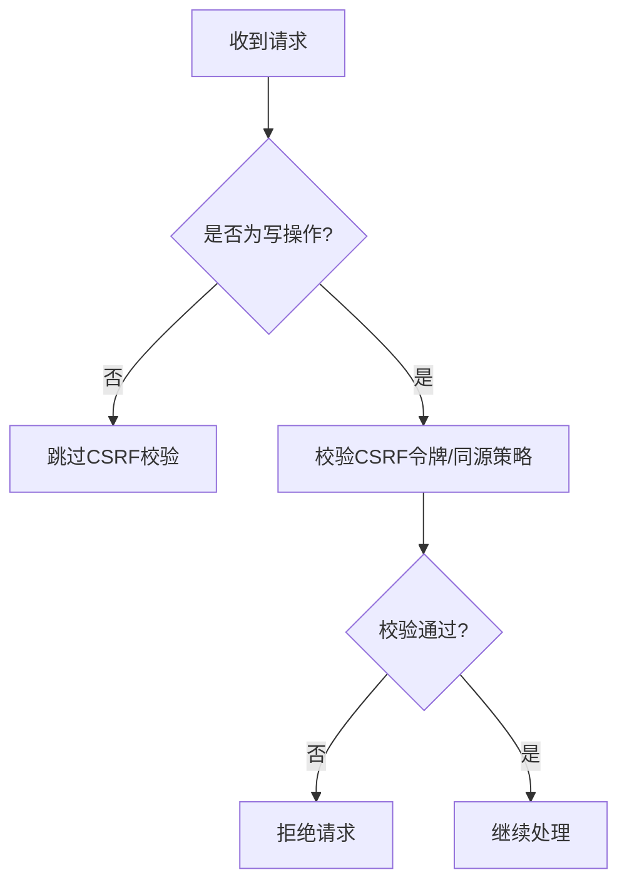
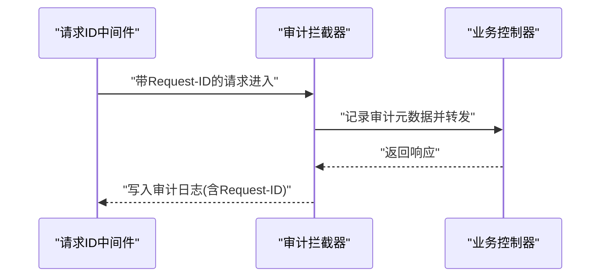
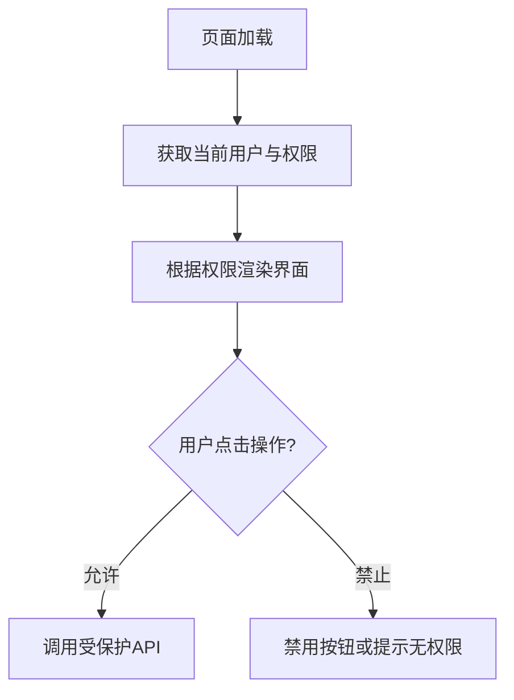
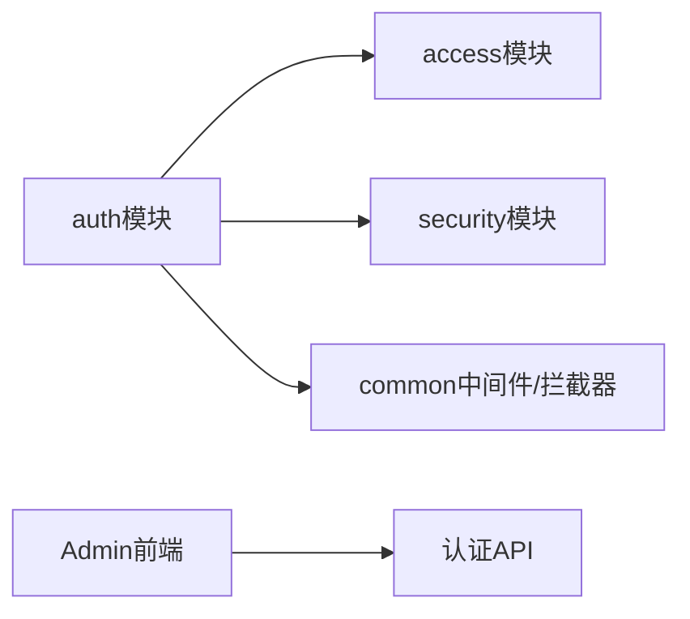

# 安全认证与授权

<cite>
**本文引用的文件**   
- [apps/api/src/auth/auth.controller.ts](file://apps/api/src/auth/auth.controller.ts)
- [apps/api/src/auth/auth.service.ts](file://apps/api/src/auth/auth.service.ts)
- [apps/api/src/auth/strategies/jwt.strategy.ts](file://apps/api/src/auth/strategies/jwt.strategy.ts)
- [apps/api/src/auth/guards/jwt-auth.guard.ts](file://apps/api/src/auth/guards/jwt-auth.guard.ts)
- [apps/api/src/auth/guards/roles.guard.ts](file://apps/api/src/auth/guards/roles.guard.ts)
- [apps/api/src/auth/decorators/current-user.decorator.ts](file://apps/api/src/auth/decorators/current-user.decorator.ts)
- [apps/api/src/auth/decorators/roles.decorator.ts](file://apps/api/src/auth/decorators/roles.decorator.ts)
- [apps/api/src/auth/decorators/require-permissions.decorator.ts](file://apps/api/src/auth/decorators/require-permissions.decorator.ts)
- [apps/api/src/auth/decorators/public.decorator.ts](file://apps/api/src/auth/decorators/public.decorator.ts)
- [apps/api/src/auth/dto/auth.dto.ts](file://apps/api/src/auth/dto/auth.dto.ts)
- [apps/api/src/auth/roles.ts](file://apps/api/src/auth/roles.ts)
- [apps/api/src/access/permissions.ts](file://apps/api/src/access/permissions.ts)
- [apps/api/src/access/roles.service.ts](file://apps/api/src/access/roles.service.ts)
- [apps/api/src/common/crypto/secrets-crypto.ts](file://apps/api/src/common/crypto/secrets-crypto.ts)
- [apps/api/src/common/validators/password.validator.ts](file://apps/api/src/common/validators/password.validator.ts)
- [apps/api/src/security/ip-ban.guard.ts](file://apps/api/src/security/ip-ban.guard.ts)
- [apps/api/src/security/ip-ban.service.ts](file://apps/api/src/security/ip-ban.service.ts)
- [apps/api/src/common/middleware/request-id.middleware.ts](file://apps/api/src/common/middleware/request-id.middleware.ts)
- [apps/api/src/common/interceptors/audit.interceptor.ts](file://apps/api/src/common/interceptors/audit.interceptor.ts)
- [apps/api/src/config/env.validation.ts](file://apps/api/src/config/env.validation.ts)
- [apps/admin/src/lib/auth.ts](file://apps/admin/src/lib/auth.ts)
- [apps/admin/src/lib/tokenRefresh.ts](file://apps/admin/src/lib/tokenRefresh.ts)
- [apps/admin/src/components/session.tsx](file://apps/admin/src/components/session.tsx)
- [apps/admin/src/features/access.ts](file://apps/admin/src/features/access.ts)
- [apps/admin/src/components/Can.tsx](file://apps/admin/src/components/Can.tsx)
- [apps/admin/src/app/api/auth/[...path]/route.ts](file://apps/admin/src/app/api/auth/[...path]/route.ts)
</cite>

## 目录
1. [简介](#简介)
2. [项目结构](#项目结构)
3. [核心组件](#核心组件)
4. [架构总览](#架构总览)
5. [详细组件分析](#详细组件分析)
6. [依赖关系分析](#依赖关系分析)
7. [性能与安全考量](#性能与安全考量)
8. [故障排查指南](#故障排查指南)
9. [结论](#结论)
10. [附录](#附录)

## 简介
本文件面向安全开发，系统性阐述本项目中的认证与授权实现：JWT令牌认证、用户会话管理、RBAC角色基础访问控制、细粒度权限验证、密码加密存储、会话安全与CSRF防护策略、OAuth2集成思路以及安全审计。文档同时提供架构图、流程图和类图，帮助读者快速理解并落地安全最佳实践。

## 项目结构
后端采用NestJS模块化设计，认证与授权相关能力集中在auth模块与access模块；前端Admin应用通过API客户端与后端交互，负责令牌刷新、会话状态与前端权限渲染。关键路径如下：
- 认证控制器与服务：处理登录、令牌签发与校验
- JWT策略与守卫：解析令牌、注入当前用户、保护路由
- RBAC与权限装饰器：基于角色与权限的细粒度控制
- 安全中间件与拦截器：请求ID、审计日志、IP封禁
- 前端会话与令牌刷新：本地持久化、自动刷新、UI级权限控制

**图示来源** 
- [apps/api/src/auth/auth.controller.ts](file://apps/api/src/auth/auth.controller.ts)
- [apps/api/src/auth/auth.service.ts](file://apps/api/src/auth/auth.service.ts)
- [apps/api/src/auth/strategies/jwt.strategy.ts](file://apps/api/src/auth/strategies/jwt.strategy.ts)
- [apps/api/src/auth/guards/jwt-auth.guard.ts](file://apps/api/src/auth/guards/jwt-auth.guard.ts)
- [apps/api/src/auth/guards/roles.guard.ts](file://apps/api/src/auth/guards/roles.guard.ts)
- [apps/api/src/access/permissions.ts](file://apps/api/src/access/permissions.ts)
- [apps/api/src/access/roles.service.ts](file://apps/api/src/access/roles.service.ts)
- [apps/api/src/security/ip-ban.guard.ts](file://apps/api/src/security/ip-ban.guard.ts)
- [apps/api/src/common/interceptors/audit.interceptor.ts](file://apps/api/src/common/interceptors/audit.interceptor.ts)
- [apps/api/src/common/middleware/request-id.middleware.ts](file://apps/api/src/common/middleware/request-id.middleware.ts)
- [apps/admin/src/lib/auth.ts](file://apps/admin/src/lib/auth.ts)
- [apps/admin/src/components/session.tsx](file://apps/admin/src/components/session.tsx)
- [apps/admin/src/lib/tokenRefresh.ts](file://apps/admin/src/lib/tokenRefresh.ts)
- [apps/admin/src/features/access.ts](file://apps/admin/src/features/access.ts)
- [apps/admin/src/components/Can.tsx](file://apps/admin/src/components/Can.tsx)

**章节来源**
- [apps/api/src/auth/auth.controller.ts](file://apps/api/src/auth/auth.controller.ts)
- [apps/api/src/auth/auth.service.ts](file://apps/api/src/auth/auth.service.ts)
- [apps/api/src/auth/strategies/jwt.strategy.ts](file://apps/api/src/auth/strategies/jwt.strategy.ts)
- [apps/api/src/auth/guards/jwt-auth.guard.ts](file://apps/api/src/auth/guards/jwt-auth.guard.ts)
- [apps/api/src/auth/guards/roles.guard.ts](file://apps/api/src/auth/guards/roles.guard.ts)
- [apps/api/src/access/permissions.ts](file://apps/api/src/access/permissions.ts)
- [apps/api/src/access/roles.service.ts](file://apps/api/src/access/roles.service.ts)
- [apps/api/src/security/ip-ban.guard.ts](file://apps/api/src/security/ip-ban.guard.ts)
- [apps/api/src/common/interceptors/audit.interceptor.ts](file://apps/api/src/common/interceptors/audit.interceptor.ts)
- [apps/api/src/common/middleware/request-id.middleware.ts](file://apps/api/src/common/middleware/request-id.middleware.ts)
- [apps/admin/src/lib/auth.ts](file://apps/admin/src/lib/auth.ts)
- [apps/admin/src/components/session.tsx](file://apps/admin/src/components/session.tsx)
- [apps/admin/src/lib/tokenRefresh.ts](file://apps/admin/src/lib/tokenRefresh.ts)
- [apps/admin/src/features/access.ts](file://apps/admin/src/features/access.ts)
- [apps/admin/src/components/Can.tsx](file://apps/admin/src/components/Can.tsx)

## 核心组件
- 认证控制器与服务：统一处理登录、注册（如有）、令牌签发与校验、登出等流程
- JWT策略与守卫：从请求头提取令牌、解码并注入当前用户上下文
- 角色与权限守卫：结合装饰器进行RBAC与细粒度权限校验
- 安全中间件与拦截器：请求追踪、审计日志、IP封禁
- 前端会话与令牌刷新：本地存储、过期前自动刷新、UI级权限渲染

**章节来源**
- [apps/api/src/auth/auth.controller.ts](file://apps/api/src/auth/auth.controller.ts)
- [apps/api/src/auth/auth.service.ts](file://apps/api/src/auth/auth.service.ts)
- [apps/api/src/auth/strategies/jwt.strategy.ts](file://apps/api/src/auth/strategies/jwt.strategy.ts)
- [apps/api/src/auth/guards/jwt-auth.guard.ts](file://apps/api/src/auth/guards/jwt-auth.guard.ts)
- [apps/api/src/auth/guards/roles.guard.ts](file://apps/api/src/auth/guards/roles.guard.ts)
- [apps/api/src/common/interceptors/audit.interceptor.ts](file://apps/api/src/common/interceptors/audit.interceptor.ts)
- [apps/api/src/common/middleware/request-id.middleware.ts](file://apps/api/src/common/middleware/request-id.middleware.ts)
- [apps/admin/src/lib/auth.ts](file://apps/admin/src/lib/auth.ts)
- [apps/admin/src/components/session.tsx](file://apps/admin/src/components/session.tsx)
- [apps/admin/src/lib/tokenRefresh.ts](file://apps/admin/src/lib/tokenRefresh.ts)

## 架构总览
下图展示从前端发起登录到后端鉴权、再到资源访问的完整调用链。

**图示来源** 
- [apps/api/src/auth/auth.controller.ts](file://apps/api/src/auth/auth.controller.ts)
- [apps/api/src/auth/auth.service.ts](file://apps/api/src/auth/auth.service.ts)
- [apps/api/src/auth/strategies/jwt.strategy.ts](file://apps/api/src/auth/strategies/jwt.strategy.ts)
- [apps/api/src/auth/guards/roles.guard.ts](file://apps/api/src/auth/guards/roles.guard.ts)

## 详细组件分析

### JWT令牌认证机制
- 令牌签发：认证服务在成功登录后生成JWT，包含用户标识、角色与必要声明，设置合理过期时间
- 令牌解析：JWT策略从请求头提取令牌，校验签名与有效期，将用户信息注入请求上下文
- 守卫保护：JWT守卫确保请求携带有效令牌，未通过则拒绝访问

**图示来源** 
- [apps/api/src/auth/strategies/jwt.strategy.ts](file://apps/api/src/auth/strategies/jwt.strategy.ts)
- [apps/api/src/auth/guards/jwt-auth.guard.ts](file://apps/api/src/auth/guards/jwt-auth.guard.ts)
- [apps/api/src/auth/auth.service.ts](file://apps/api/src/auth/auth.service.ts)
- [apps/api/src/auth/auth.controller.ts](file://apps/api/src/auth/auth.controller.ts)

**章节来源**
- [apps/api/src/auth/strategies/jwt.strategy.ts](file://apps/api/src/auth/strategies/jwt.strategy.ts)
- [apps/api/src/auth/guards/jwt-auth.guard.ts](file://apps/api/src/auth/guards/jwt-auth.guard.ts)
- [apps/api/src/auth/auth.service.ts](file://apps/api/src/auth/auth.service.ts)
- [apps/api/src/auth/auth.controller.ts](file://apps/api/src/auth/auth.controller.ts)

### 用户会话管理与令牌刷新
- 前端会话：Admin端通过session组件维护登录态，存储令牌与用户信息
- 自动刷新：tokenRefresh模块在令牌即将过期时主动刷新，避免中断用户体验
- 安全存储：建议将敏感信息存储在安全的存储中，避免XSS泄露

**图示来源** 
- [apps/admin/src/components/session.tsx](file://apps/admin/src/components/session.tsx)
- [apps/admin/src/lib/tokenRefresh.ts](file://apps/admin/src/lib/tokenRefresh.ts)
- [apps/admin/src/lib/auth.ts](file://apps/admin/src/lib/auth.ts)

**章节来源**
- [apps/admin/src/components/session.tsx](file://apps/admin/src/components/session.tsx)
- [apps/admin/src/lib/tokenRefresh.ts](file://apps/admin/src/lib/tokenRefresh.ts)
- [apps/admin/src/lib/auth.ts](file://apps/admin/src/lib/auth.ts)

### 角色基础访问控制（RBAC）与细粒度权限
- 角色定义：roles.ts集中定义系统角色与默认权限集合
- 权限模型：permissions.ts描述资源与操作维度的权限点
- 装饰器与守卫：roles.decorator与require-permissions.decorator配合roles.guard实现角色与权限校验
- 当前用户注入：current-user.decorator便捷获取上下文用户

**图示来源** 
- [apps/api/src/access/roles.service.ts](file://apps/api/src/access/roles.service.ts)
- [apps/api/src/access/permissions.ts](file://apps/api/src/access/permissions.ts)
- [apps/api/src/auth/guards/roles.guard.ts](file://apps/api/src/auth/guards/roles.guard.ts)
- [apps/api/src/auth/decorators/roles.decorator.ts](file://apps/api/src/auth/decorators/roles.decorator.ts)
- [apps/api/src/auth/decorators/require-permissions.decorator.ts](file://apps/api/src/auth/decorators/require-permissions.decorator.ts)
- [apps/api/src/auth/decorators/current-user.decorator.ts](file://apps/api/src/auth/decorators/current-user.decorator.ts)

**章节来源**
- [apps/api/src/access/roles.service.ts](file://apps/api/src/access/roles.service.ts)
- [apps/api/src/access/permissions.ts](file://apps/api/src/access/permissions.ts)
- [apps/api/src/auth/guards/roles.guard.ts](file://apps/api/src/auth/guards/roles.guard.ts)
- [apps/api/src/auth/decorators/roles.decorator.ts](file://apps/api/src/auth/decorators/roles.decorator.ts)
- [apps/api/src/auth/decorators/require-permissions.decorator.ts](file://apps/api/src/auth/decorators/require-permissions.decorator.ts)
- [apps/api/src/auth/decorators/current-user.decorator.ts](file://apps/api/src/auth/decorators/current-user.decorator.ts)

### 密码加密存储与输入校验
- 密码校验：password.validator对密码强度与格式进行校验
- 加密存储：secrets-crypto提供统一的加密/哈希工具，用于密码与敏感配置处理

**图示来源** 
- [apps/api/src/common/validators/password.validator.ts](file://apps/api/src/common/validators/password.validator.ts)
- [apps/api/src/common/crypto/secrets-crypto.ts](file://apps/api/src/common/crypto/secrets-crypto.ts)

**章节来源**
- [apps/api/src/common/validators/password.validator.ts](file://apps/api/src/common/validators/password.validator.ts)
- [apps/api/src/common/crypto/secrets-crypto.ts](file://apps/api/src/common/crypto/secrets-crypto.ts)

### 会话安全与CSRF防护
- 会话安全：建议使用HttpOnly Cookie或安全的本地存储策略，避免XSS窃取令牌
- CSRF防护：对写操作启用CSRF令牌校验，或使用同源策略与SameSite Cookie限制跨站请求
- 公开接口标记：public.decorator明确无需认证的接口，减少误保护

[本节为概念性说明，不直接分析具体文件]

### OAuth2集成与第三方登录
- 集成思路：在后端新增OAuth2策略与回调控制器，对接第三方身份提供商
- 令牌映射：将第三方用户映射为本系统用户，建立角色与权限关联
- 安全要点：严格校验state与nonce，防止重放攻击；最小化权限范围

[本节为概念性说明，不直接分析具体文件]

### 安全审计与请求追踪
- 审计拦截器：记录关键操作的请求上下文、操作者与结果，便于事后追溯
- 请求ID：request-id.middleware为每个请求分配唯一ID，贯穿日志链路

**图示来源** 
- [apps/api/src/common/middleware/request-id.middleware.ts](file://apps/api/src/common/middleware/request-id.middleware.ts)
- [apps/api/src/common/interceptors/audit.interceptor.ts](file://apps/api/src/common/interceptors/audit.interceptor.ts)

**章节来源**
- [apps/api/src/common/middleware/request-id.middleware.ts](file://apps/api/src/common/middleware/request-id.middleware.ts)
- [apps/api/src/common/interceptors/audit.interceptor.ts](file://apps/api/src/common/interceptors/audit.interceptor.ts)

### 前端权限渲染与资源保护
- 前端权限：features/access.ts与components/Can.tsx根据用户角色与权限控制UI元素可见性与操作按钮
- API代理：admin的auth代理路由将认证请求转发至后端

**图示来源** 
- [apps/admin/src/features/access.ts](file://apps/admin/src/features/access.ts)
- [apps/admin/src/components/Can.tsx](file://apps/admin/src/components/Can.tsx)
- [apps/admin/src/app/api/auth/[...path]/route.ts](file://apps/admin/src/app/api/auth/[...path]/route.ts)

**章节来源**
- [apps/admin/src/features/access.ts](file://apps/admin/src/features/access.ts)
- [apps/admin/src/components/Can.tsx](file://apps/admin/src/components/Can.tsx)
- [apps/admin/src/app/api/auth/[...path]/route.ts](file://apps/admin/src/app/api/auth/[...path]/route.ts)

## 依赖关系分析
- 模块耦合：auth模块依赖access模块的角色与权限服务；security模块提供IP封禁能力；common中间件与拦截器横切关注点
- 外部依赖：环境变量校验确保密钥与配置安全；数据库与缓存用于用户与会话数据持久化

**图示来源** 
- [apps/api/src/auth/auth.controller.ts](file://apps/api/src/auth/auth.controller.ts)
- [apps/api/src/access/roles.service.ts](file://apps/api/src/access/roles.service.ts)
- [apps/api/src/security/ip-ban.guard.ts](file://apps/api/src/security/ip-ban.guard.ts)
- [apps/api/src/common/middleware/request-id.middleware.ts](file://apps/api/src/common/middleware/request-id.middleware.ts)
- [apps/api/src/common/interceptors/audit.interceptor.ts](file://apps/api/src/common/interceptors/audit.interceptor.ts)
- [apps/admin/src/app/api/auth/[...path]/route.ts](file://apps/admin/src/app/api/auth/[...path]/route.ts)

**章节来源**
- [apps/api/src/config/env.validation.ts](file://apps/api/src/config/env.validation.ts)
- [apps/api/src/auth/auth.controller.ts](file://apps/api/src/auth/auth.controller.ts)
- [apps/api/src/access/roles.service.ts](file://apps/api/src/access/roles.service.ts)
- [apps/api/src/security/ip-ban.guard.ts](file://apps/api/src/security/ip-ban.guard.ts)
- [apps/api/src/common/middleware/request-id.middleware.ts](file://apps/api/src/common/middleware/request-id.middleware.ts)
- [apps/api/src/common/interceptors/audit.interceptor.ts](file://apps/api/src/common/interceptors/audit.interceptor.ts)
- [apps/admin/src/app/api/auth/[...path]/route.ts](file://apps/admin/src/app/api/auth/[...path]/route.ts)

## 性能与安全考量
- 令牌策略：合理设置JWT过期时间与刷新窗口，平衡安全性与用户体验
- 密码算法：使用强哈希算法（如bcrypt/argon2），避免弱算法与明文存储
- 速率限制：对登录与刷新接口实施限流，防止暴力破解与滥用
- 最小权限：默认拒绝，显式授权；按资源与操作维度细化权限
- 审计与监控：关键操作全量审计，异常告警与溯源
- 配置安全：环境变量与密钥管理遵循最小暴露原则

[本节为通用指导，不直接分析具体文件]

## 故障排查指南
- 登录失败：检查凭据校验逻辑、密码哈希与数据库一致性
- 令牌无效：确认JWT签名、过期时间与请求头携带方式
- 权限不足：核对角色与权限映射、装饰器与守卫配置
- 审计缺失：检查拦截器是否全局注册、Request-ID是否传递
- IP封禁：查看ip-ban规则与命中条件，确认中间件顺序

**章节来源**
- [apps/api/src/auth/auth.controller.ts](file://apps/api/src/auth/auth.controller.ts)
- [apps/api/src/auth/auth.service.ts](file://apps/api/src/auth/auth.service.ts)
- [apps/api/src/auth/strategies/jwt.strategy.ts](file://apps/api/src/auth/strategies/jwt.strategy.ts)
- [apps/api/src/auth/guards/roles.guard.ts](file://apps/api/src/auth/guards/roles.guard.ts)
- [apps/api/src/security/ip-ban.guard.ts](file://apps/api/src/security/ip-ban.guard.ts)
- [apps/api/src/common/interceptors/audit.interceptor.ts](file://apps/api/src/common/interceptors/audit.interceptor.ts)
- [apps/api/src/common/middleware/request-id.middleware.ts](file://apps/api/src/common/middleware/request-id.middleware.ts)

## 结论
本项目通过JWT认证、RBAC与细粒度权限控制构建了完整的认证与授权体系，辅以审计、IP封禁与请求追踪等安全能力，形成纵深防御。建议在后续迭代中持续完善OAuth2集成、强化CSRF与XSS防护、优化令牌刷新体验，并加强安全审计与监控告警，以应对不断演进的安全威胁。

[本节为总结性内容，不直接分析具体文件]

## 附录
- 环境变量与配置：确保密钥、域名、CORS与超时参数正确配置
- 部署建议：启用HTTPS、SameSite Cookie、CSP与HSTS等浏览器安全头
- 测试建议：覆盖认证、授权、刷新、审计与异常路径的自动化测试

[本节为补充信息，不直接分析具体文件]