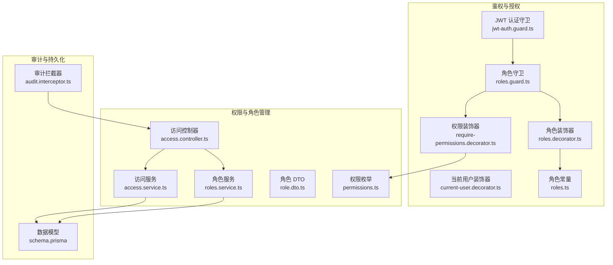
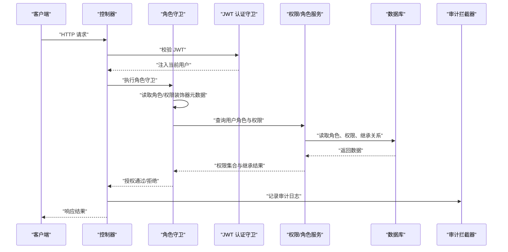
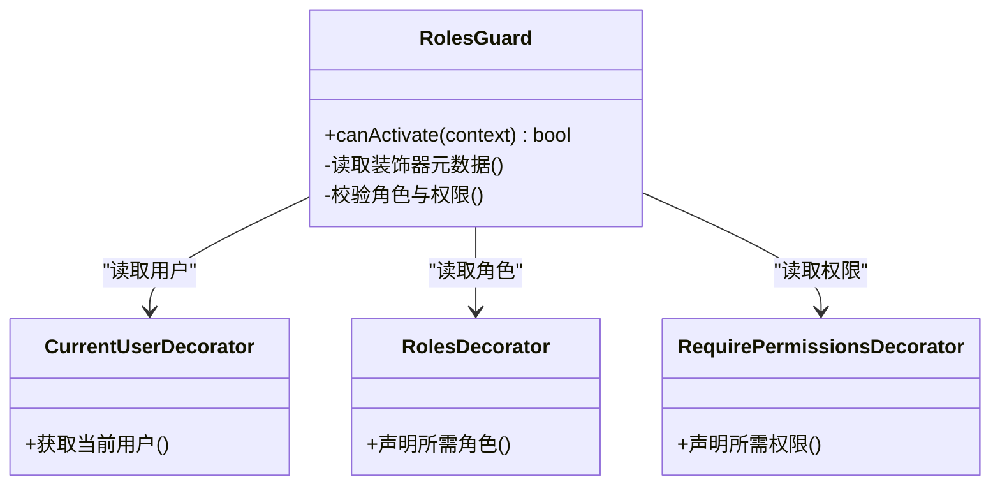
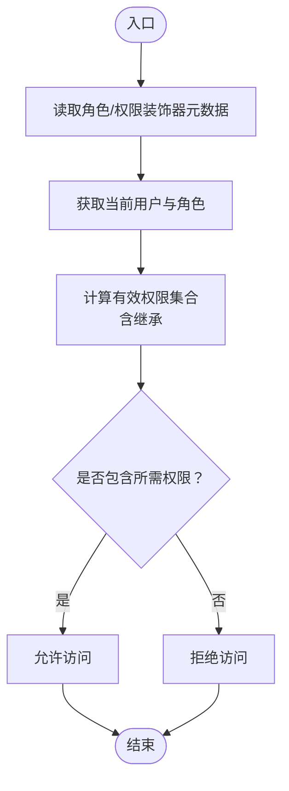
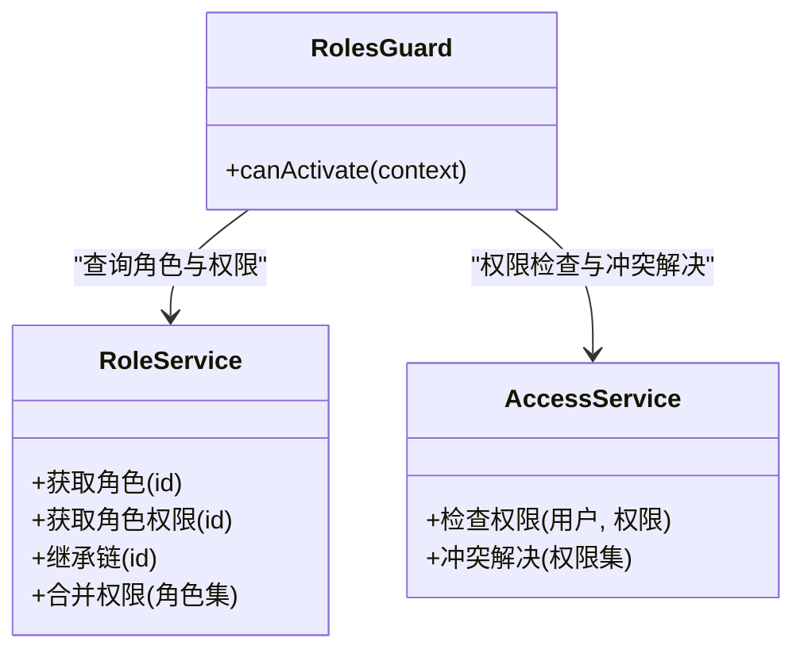
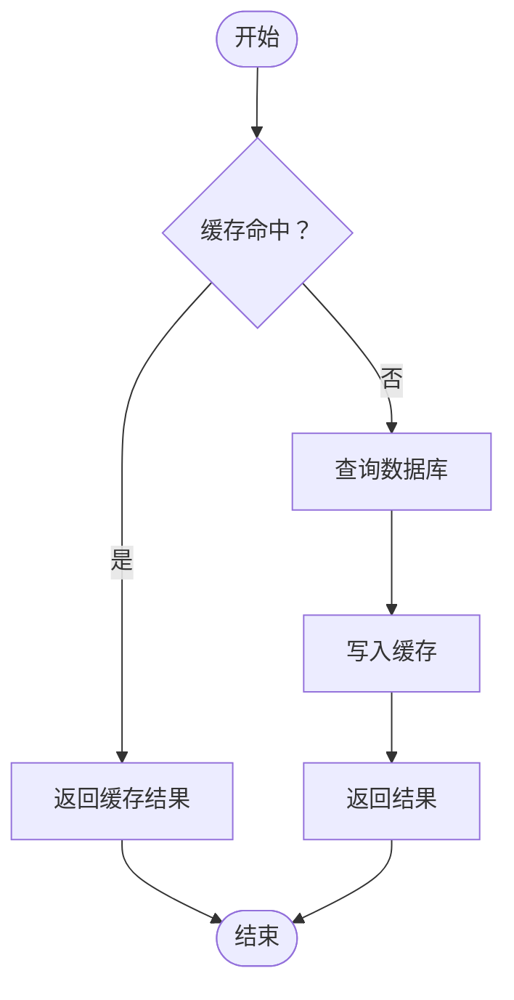
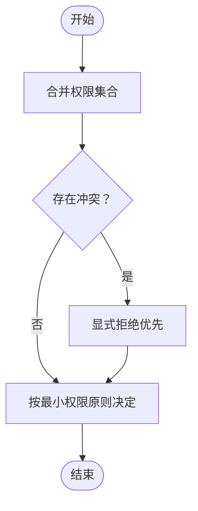
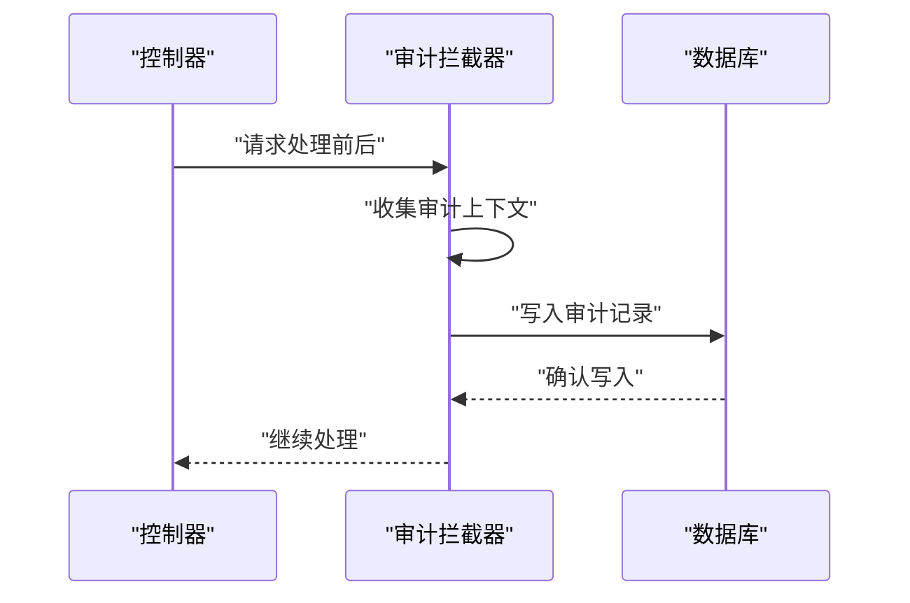
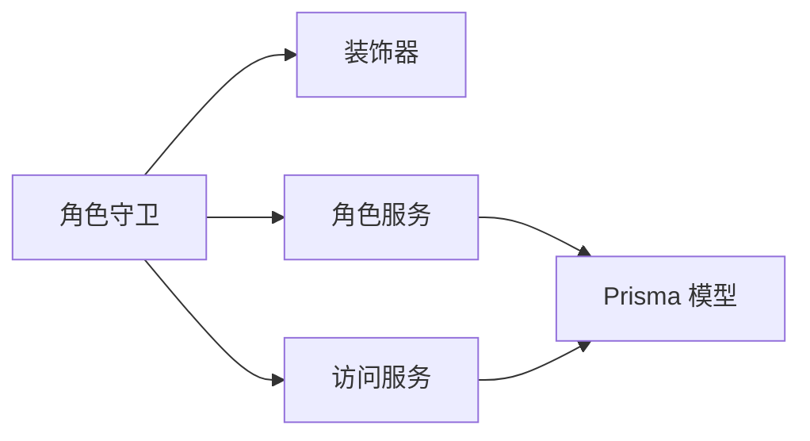

# 角色基础访问控制

<cite>
**本文引用的文件**   
- [apps/api/src/access/permissions.ts](file://apps/api/src/access/permissions.ts)
- [apps/api/src/auth/guards/jwt-auth.guard.ts](file://apps/api/src/auth/guards/jwt-auth.guard.ts)
- [apps/api/src/auth/guards/roles.guard.ts](file://apps/api/src/auth/guards/roles.guard.ts)
- [apps/api/src/auth/decorators/current-user.decorator.ts](file://apps/api/src/auth/decorators/current-user.decorator.ts)
- [apps/api/src/auth/decorators/require-permissions.decorator.ts](file://apps/api/src/auth/decorators/require-permissions.decorator.ts)
- [apps/api/src/auth/decorators/roles.decorator.ts](file://apps/api/src/auth/decorators/roles.decorator.ts)
- [apps/api/src/auth/roles.ts](file://apps/api/src/auth/roles.ts)
- [apps/api/src/access/access.controller.ts](file://apps/api/src/access/access.controller.ts)
- [apps/api/src/access/access.service.ts](file://apps/api/src/access/access.service.ts)
- [apps/api/src/access/roles.service.ts](file://apps/api/src/access/roles.service.ts)
- [apps/api/src/access/dto/role.dto.ts](file://apps/api/src/access/dto/role.dto.ts)
- [apps/api/src/common/interceptors/audit.interceptor.ts](file://apps/api/src/common/interceptors/audit.interceptor.ts)
- [apps/api/src/prisma/schema.prisma](file://apps/api/src/prisma/schema.prisma)
</cite>

## 目录
1. [简介](#简介)
2. [项目结构](#项目结构)
3. [核心组件](#核心组件)
4. [架构总览](#架构总览)
5. [详细组件分析](#详细组件分析)
6. [依赖关系分析](#依赖关系分析)
7. [性能考虑](#性能考虑)
8. [故障排查指南](#故障排查指南)
9. [结论](#结论)
10. [附录：使用示例与最佳实践](#附录使用示例与最佳实践)

## 简介
本文件面向角色基础访问控制（RBAC）系统，系统性说明角色定义、权限分配与访问控制的实现机制。重点覆盖：
- 权限装饰器的工作原理与使用方法
- 角色守卫的验证流程与细粒度权限检查
- 角色继承与动态权限检查的实现思路
- 权限缓存策略与审计日志记录机制
- 权限冲突解决原则
- 具体使用示例：如何定义角色、分配权限、保护 API 端点

## 项目结构
RBAC 相关代码主要位于后端 NestJS 应用中，围绕 auth 与 access 两大模块组织：
- 鉴权与授权：guards、decorators、strategies、roles 常量
- 权限与角色管理：controller、service、DTO、权限枚举
- 审计与持久化：审计拦截器、数据库模型

图表来源
- [apps/api/src/auth/guards/jwt-auth.guard.ts](file://apps/api/src/auth/guards/jwt-auth.guard.ts)
- [apps/api/src/auth/guards/roles.guard.ts](file://apps/api/src/auth/guards/roles.guard.ts)
- [apps/api/src/auth/decorators/current-user.decorator.ts](file://apps/api/src/auth/decorators/current-user.decorator.ts)
- [apps/api/src/auth/decorators/require-permissions.decorator.ts](file://apps/api/src/auth/decorators/require-permissions.decorator.ts)
- [apps/api/src/auth/decorators/roles.decorator.ts](file://apps/api/src/auth/decorators/roles.decorator.ts)
- [apps/api/src/auth/roles.ts](file://apps/api/src/auth/roles.ts)
- [apps/api/src/access/access.controller.ts](file://apps/api/src/access/access.controller.ts)
- [apps/api/src/access/access.service.ts](file://apps/api/src/access/access.service.ts)
- [apps/api/src/access/roles.service.ts](file://apps/api/src/access/roles.service.ts)
- [apps/api/src/access/dto/role.dto.ts](file://apps/api/src/access/dto/role.dto.ts)
- [apps/api/src/access/permissions.ts](file://apps/api/src/access/permissions.ts)
- [apps/api/src/common/interceptors/audit.interceptor.ts](file://apps/api/src/common/interceptors/audit.interceptor.ts)
- [apps/api/src/prisma/schema.prisma](file://apps/api/src/prisma/schema.prisma)

章节来源
- [apps/api/src/auth/guards/jwt-auth.guard.ts](file://apps/api/src/auth/guards/jwt-auth.guard.ts)
- [apps/api/src/auth/guards/roles.guard.ts](file://apps/api/src/auth/guards/roles.guard.ts)
- [apps/api/src/auth/decorators/current-user.decorator.ts](file://apps/api/src/auth/decorators/current-user.decorator.ts)
- [apps/api/src/auth/decorators/require-permissions.decorator.ts](file://apps/api/src/auth/decorators/require-permissions.decorator.ts)
- [apps/api/src/auth/decorators/roles.decorator.ts](file://apps/api/src/auth/decorators/roles.decorator.ts)
- [apps/api/src/auth/roles.ts](file://apps/api/src/auth/roles.ts)
- [apps/api/src/access/access.controller.ts](file://apps/api/src/access/access.controller.ts)
- [apps/api/src/access/access.service.ts](file://apps/api/src/access/access.service.ts)
- [apps/api/src/access/roles.service.ts](file://apps/api/src/access/roles.service.ts)
- [apps/api/src/access/dto/role.dto.ts](file://apps/api/src/access/dto/role.dto.ts)
- [apps/api/src/access/permissions.ts](file://apps/api/src/access/permissions.ts)
- [apps/api/src/common/interceptors/audit.interceptor.ts](file://apps/api/src/common/interceptors/audit.interceptor.ts)
- [apps/api/src/prisma/schema.prisma](file://apps/api/src/prisma/schema.prisma)

## 核心组件
- 权限枚举与常量
  - 权限枚举集中定义，便于跨模块引用与类型安全校验。
  - 角色常量提供预置角色集合，作为默认继承或分配的起点。
- 装饰器
  - 当前用户装饰器：从请求上下文解析已认证用户信息。
  - 角色装饰器：声明方法所需角色，供守卫读取。
  - 权限装饰器：声明方法所需权限，供守卫进行细粒度检查。
- 守卫
  - JWT 认证守卫：校验令牌有效性并注入用户上下文。
  - 角色守卫：结合角色与权限装饰器完成授权决策，支持继承与动态检查。
- 权限与角色服务
  - 访问服务：封装权限相关的业务逻辑（如权限合并、冲突判定）。
  - 角色服务：负责角色的增删改查、角色-权限映射、角色继承关系维护。
- DTO
  - 角色 DTO：用于输入校验与接口契约。
- 审计拦截器
  - 统一记录关键操作的审计日志，包括操作人、资源、动作、结果等。

章节来源
- [apps/api/src/access/permissions.ts](file://apps/api/src/access/permissions.ts)
- [apps/api/src/auth/roles.ts](file://apps/api/src/auth/roles.ts)
- [apps/api/src/auth/decorators/current-user.decorator.ts](file://apps/api/src/auth/decorators/current-user.decorator.ts)
- [apps/api/src/auth/decorators/roles.decorator.ts](file://apps/api/src/auth/decorators/roles.decorator.ts)
- [apps/api/src/auth/decorators/require-permissions.decorator.ts](file://apps/api/src/auth/decorators/require-permissions.decorator.ts)
- [apps/api/src/auth/guards/jwt-auth.guard.ts](file://apps/api/src/auth/guards/jwt-auth.guard.ts)
- [apps/api/src/auth/guards/roles.guard.ts](file://apps/api/src/auth/guards/roles.guard.ts)
- [apps/api/src/access/access.service.ts](file://apps/api/src/access/access.service.ts)
- [apps/api/src/access/roles.service.ts](file://apps/api/src/access/roles.service.ts)
- [apps/api/src/access/dto/role.dto.ts](file://apps/api/src/access/dto/role.dto.ts)
- [apps/api/src/common/interceptors/audit.interceptor.ts](file://apps/api/src/common/interceptors/audit.interceptor.ts)

## 架构总览
RBAC 在请求生命周期中的位置如下：
- 进入控制器前，先经过 JWT 认证守卫，确保请求来自有效会话。
- 随后进入角色守卫，读取方法上的角色与权限装饰器元数据。
- 角色守卫根据当前用户角色、角色继承链、权限集合进行授权判断。
- 若通过，则执行业务逻辑；否则返回未授权错误。
- 审计拦截器对关键操作进行记录，形成可追溯的审计轨迹。

图表来源
- [apps/api/src/auth/guards/jwt-auth.guard.ts](file://apps/api/src/auth/guards/jwt-auth.guard.ts)
- [apps/api/src/auth/guards/roles.guard.ts](file://apps/api/src/auth/guards/roles.guard.ts)
- [apps/api/src/auth/decorators/current-user.decorator.ts](file://apps/api/src/auth/decorators/current-user.decorator.ts)
- [apps/api/src/auth/decorators/roles.decorator.ts](file://apps/api/src/auth/decorators/roles.decorator.ts)
- [apps/api/src/auth/decorators/require-permissions.decorator.ts](file://apps/api/src/auth/decorators/require-permissions.decorator.ts)
- [apps/api/src/access/access.service.ts](file://apps/api/src/access/access.service.ts)
- [apps/api/src/access/roles.service.ts](file://apps/api/src/access/roles.service.ts)
- [apps/api/src/common/interceptors/audit.interceptor.ts](file://apps/api/src/common/interceptors/audit.interceptor.ts)
- [apps/api/src/prisma/schema.prisma](file://apps/api/src/prisma/schema.prisma)

## 详细组件分析

### 权限装饰器工作原理
- 当前用户装饰器
  - 作用：从请求上下文中提取已认证用户对象，供后续守卫与业务逻辑使用。
  - 关键点：需确保在认证守卫之后执行，避免空用户上下文。
- 角色装饰器
  - 作用：声明方法所需的角色集合，供角色守卫读取并校验。
  - 关键点：支持多角色组合，守卫采用“任一匹配”策略。
- 权限装饰器
  - 作用：声明方法所需的权限集合，供角色守卫进行细粒度检查。
  - 关键点：支持按资源维度与动作维度组合，满足复杂场景。

图表来源
- [apps/api/src/auth/decorators/current-user.decorator.ts](file://apps/api/src/auth/decorators/current-user.decorator.ts)
- [apps/api/src/auth/decorators/roles.decorator.ts](file://apps/api/src/auth/decorators/roles.decorator.ts)
- [apps/api/src/auth/decorators/require-permissions.decorator.ts](file://apps/api/src/auth/decorators/require-permissions.decorator.ts)
- [apps/api/src/auth/guards/roles.guard.ts](file://apps/api/src/auth/guards/roles.guard.ts)

章节来源
- [apps/api/src/auth/decorators/current-user.decorator.ts](file://apps/api/src/auth/decorators/current-user.decorator.ts)
- [apps/api/src/auth/decorators/roles.decorator.ts](file://apps/api/src/auth/decorators/roles.decorator.ts)
- [apps/api/src/auth/decorators/require-permissions.decorator.ts](file://apps/api/src/auth/decorators/require-permissions.decorator.ts)
- [apps/api/src/auth/guards/roles.guard.ts](file://apps/api/src/auth/guards/roles.guard.ts)

### 角色守卫验证流程与细粒度权限检查
- 验证流程
  - 读取装饰器元数据（角色与权限）。
  - 基于当前用户角色，计算其有效权限集合（含继承）。
  - 判断是否包含所需权限，允许或拒绝访问。
- 细粒度检查
  - 支持资源+动作的组合权限，例如“文档:编辑”。
  - 支持条件判断（如仅管理员可删除），可在守卫中扩展。

图表来源
- [apps/api/src/auth/guards/roles.guard.ts](file://apps/api/src/auth/guards/roles.guard.ts)
- [apps/api/src/auth/decorators/roles.decorator.ts](file://apps/api/src/auth/decorators/roles.decorator.ts)
- [apps/api/src/auth/decorators/require-permissions.decorator.ts](file://apps/api/src/auth/decorators/require-permissions.decorator.ts)
- [apps/api/src/access/roles.service.ts](file://apps/api/src/access/roles.service.ts)
- [apps/api/src/access/access.service.ts](file://apps/api/src/access/access.service.ts)

章节来源
- [apps/api/src/auth/guards/roles.guard.ts](file://apps/api/src/auth/guards/roles.guard.ts)
- [apps/api/src/access/roles.service.ts](file://apps/api/src/access/roles.service.ts)
- [apps/api/src/access/access.service.ts](file://apps/api/src/access/access.service.ts)

### 角色继承与动态权限检查
- 角色继承
  - 通过角色关系表维护父子继承，子角色自动获得父角色权限。
  - 守卫在计算权限时遍历继承链，合并所有祖先权限。
- 动态权限检查
  - 支持运行时条件（如资源所有者、租户隔离），在守卫或服务层扩展。
  - 可通过权限服务暴露动态规则函数，由守卫调用。

图表来源
- [apps/api/src/access/roles.service.ts](file://apps/api/src/access/roles.service.ts)
- [apps/api/src/access/access.service.ts](file://apps/api/src/access/access.service.ts)
- [apps/api/src/auth/guards/roles.guard.ts](file://apps/api/src/auth/guards/roles.guard.ts)

章节来源
- [apps/api/src/access/roles.service.ts](file://apps/api/src/access/roles.service.ts)
- [apps/api/src/access/access.service.ts](file://apps/api/src/access/access.service.ts)
- [apps/api/src/auth/guards/roles.guard.ts](file://apps/api/src/auth/guards/roles.guard.ts)

### 权限缓存策略
- 缓存目标
  - 用户-角色映射、角色-权限映射、继承链结果。
- 缓存策略
  - 短 TTL 缓存（分钟级），兼顾一致性与性能。
  - 变更失效：角色/权限更新后主动清除相关缓存。
- 回退机制
  - 缓存不可用时直接查询数据库，保证可用性。

图表来源
- [apps/api/src/access/access.service.ts](file://apps/api/src/access/access.service.ts)
- [apps/api/src/access/roles.service.ts](file://apps/api/src/access/roles.service.ts)

章节来源
- [apps/api/src/access/access.service.ts](file://apps/api/src/access/access.service.ts)
- [apps/api/src/access/roles.service.ts](file://apps/api/src/access/roles.service.ts)

### 权限冲突解决
- 冲突场景
  - 同一资源存在“允许”与“拒绝”两种权限。
- 解决策略
  - 显式拒绝优先：当同时存在允许与拒绝时，以拒绝为准。
  - 最小权限原则：默认拒绝，显式授予才允许。
- 实现要点
  - 在权限合并阶段标记冲突，并在最终决策时应用优先级规则。

图表来源
- [apps/api/src/access/access.service.ts](file://apps/api/src/access/access.service.ts)

章节来源
- [apps/api/src/access/access.service.ts](file://apps/api/src/access/access.service.ts)

### 审计日志记录机制
- 触发时机
  - 关键写操作（创建、更新、删除）与敏感读操作（查看敏感数据）。
- 记录内容
  - 操作人、时间、IP、资源标识、动作、结果、附加上下文。
- 存储方式
  - 写入审计表，支持按用户、时间范围、资源类型检索。

图表来源
- [apps/api/src/common/interceptors/audit.interceptor.ts](file://apps/api/src/common/interceptors/audit.interceptor.ts)
- [apps/api/src/prisma/schema.prisma](file://apps/api/src/prisma/schema.prisma)

章节来源
- [apps/api/src/common/interceptors/audit.interceptor.ts](file://apps/api/src/common/interceptors/audit.interceptor.ts)
- [apps/api/src/prisma/schema.prisma](file://apps/api/src/prisma/schema.prisma)

## 依赖关系分析
- 组件耦合
  - 角色守卫依赖装饰器元数据与权限/角色服务。
  - 权限服务依赖角色服务与数据库模型。
- 外部依赖
  - Prisma ORM 用于数据访问。
  - 可选缓存中间件（如 Redis）用于权限缓存。
- 循环依赖
  - 通过服务分层与接口抽象避免循环依赖。

图表来源
- [apps/api/src/auth/guards/roles.guard.ts](file://apps/api/src/auth/guards/roles.guard.ts)
- [apps/api/src/access/roles.service.ts](file://apps/api/src/access/roles.service.ts)
- [apps/api/src/access/access.service.ts](file://apps/api/src/access/access.service.ts)
- [apps/api/src/prisma/schema.prisma](file://apps/api/src/prisma/schema.prisma)

章节来源
- [apps/api/src/auth/guards/roles.guard.ts](file://apps/api/src/auth/guards/roles.guard.ts)
- [apps/api/src/access/roles.service.ts](file://apps/api/src/access/roles.service.ts)
- [apps/api/src/access/access.service.ts](file://apps/api/src/access/access.service.ts)
- [apps/api/src/prisma/schema.prisma](file://apps/api/src/prisma/schema.prisma)

## 性能考虑
- 减少数据库查询
  - 缓存用户-角色与角色-权限映射，降低高频查询开销。
- 批量加载
  - 一次性加载继承链与权限集合，避免 N+1 查询。
- 异步与并发
  - 非关键路径的审计写入采用异步队列，避免阻塞主流程。
- 内存占用
  - 合理设置缓存大小与 TTL，防止内存膨胀。

[本节为通用指导，不直接分析具体文件]

## 故障排查指南
- 常见问题
  - 未授权错误：检查 JWT 是否有效、装饰器是否正确声明、角色与权限是否配置。
  - 权限不一致：检查缓存是否过期、角色继承是否正确、冲突解决策略是否符合预期。
  - 审计缺失：检查拦截器是否启用、审计表写入是否成功。
- 定位步骤
  - 开启调试日志，观察守卫决策过程。
  - 核对装饰器元数据与服务返回值。
  - 检查数据库角色-权限映射与继承关系。

章节来源
- [apps/api/src/auth/guards/roles.guard.ts](file://apps/api/src/auth/guards/roles.guard.ts)
- [apps/api/src/common/interceptors/audit.interceptor.ts](file://apps/api/src/common/interceptors/audit.interceptor.ts)
- [apps/api/src/access/roles.service.ts](file://apps/api/src/access/roles.service.ts)
- [apps/api/src/access/access.service.ts](file://apps/api/src/access/access.service.ts)

## 结论
本 RBAC 系统通过装饰器与守卫实现了声明式的权限控制，结合角色继承与动态检查满足复杂业务需求。配合权限缓存与审计日志，系统在性能与可追溯性上达到平衡。建议在生产环境启用缓存与审计，并持续优化权限模型与冲突解决策略。

[本节为总结，不直接分析具体文件]

## 附录：使用示例与最佳实践
- 定义角色与权限
  - 在权限枚举中新增权限项，在角色常量中定义预置角色。
  - 通过角色服务建立角色-权限映射与继承关系。
- 保护 API 端点
  - 在控制器方法上使用角色与权限装饰器声明所需权限。
  - 确保 JWT 认证守卫已注册，角色守卫生效。
- 动态权限检查
  - 在服务层实现动态规则函数，在守卫中调用进行条件判断。
- 权限冲突解决
  - 遵循显式拒绝优先与最小权限原则，避免越权访问。
- 审计与监控
  - 启用审计拦截器，记录关键操作，定期审查异常行为。

章节来源
- [apps/api/src/access/permissions.ts](file://apps/api/src/access/permissions.ts)
- [apps/api/src/auth/roles.ts](file://apps/api/src/auth/roles.ts)
- [apps/api/src/access/access.controller.ts](file://apps/api/src/access/access.controller.ts)
- [apps/api/src/access/access.service.ts](file://apps/api/src/access/access.service.ts)
- [apps/api/src/access/roles.service.ts](file://apps/api/src/access/roles.service.ts)
- [apps/api/src/common/interceptors/audit.interceptor.ts](file://apps/api/src/common/interceptors/audit.interceptor.ts)