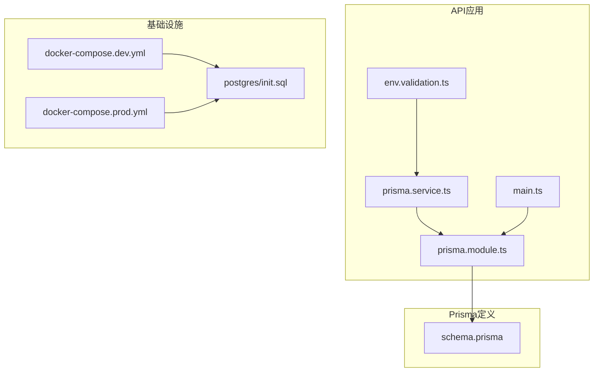
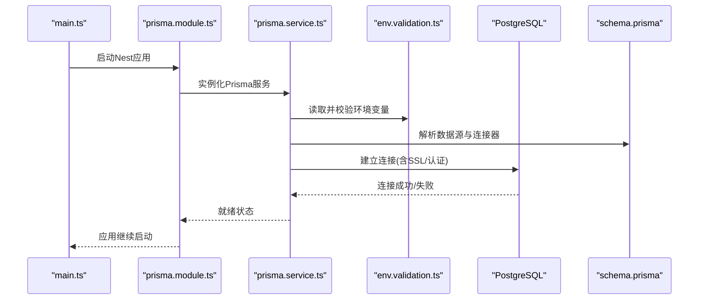
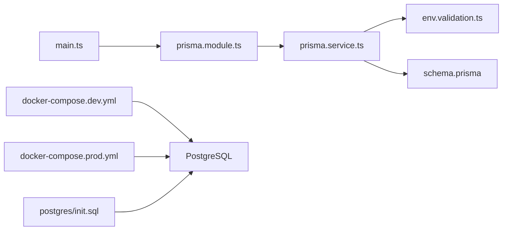

# Prisma配置与连接

<cite>
**本文引用的文件**   
- [apps/api/prisma/schema.prisma](file://apps/api/prisma/schema.prisma)
- [apps/api/src/prisma/prisma.service.ts](file://apps/api/src/prisma/prisma.service.ts)
- [apps/api/src/prisma/prisma.module.ts](file://apps/api/src/prisma/prisma.module.ts)
- [apps/api/src/config/env.validation.ts](file://apps/api/src/config/env.validation.ts)
- [apps/api/src/main.ts](file://apps/api/src/main.ts)
- [apps/api/package.json](file://apps/api/package.json)
- [infra/docker/docker-compose.dev.yml](file://infra/docker/docker-compose.dev.yml)
- [infra/docker/docker-compose.prod.yml](file://infra/docker/docker-compose.prod.yml)
- [infra/docker/postgres/init.sql](file://infra/docker/postgres/init.sql)
</cite>

## 目录
1. [简介](#简介)
2. [项目结构](#项目结构)
3. [核心组件](#核心组件)
4. [架构总览](#架构总览)
5. [详细组件分析](#详细组件分析)
6. [依赖关系分析](#依赖关系分析)
7. [性能考虑](#性能考虑)
8. [故障排查指南](#故障排查指南)
9. [结论](#结论)
10. [附录](#附录)

## 简介
本文件面向Prisma在API服务中的配置与连接，覆盖以下主题：
- Prisma客户端初始化、连接字符串与环境变量管理
- SSL与安全认证设置
- 连接池参数调优、超时配置与错误处理机制
- 开发环境与生产环境差异、环境变量校验与最佳实践
- 连接监控、性能调优与故障排查方案

## 项目结构
本项目采用多应用（monorepo）结构，Prisma相关代码位于API应用中：
- schema定义与迁移位于 apps/api/prisma
- NestJS模块封装Prisma服务，提供单例客户端
- 环境变量校验集中管理
- Docker Compose用于本地与生产数据库编排

图表来源
- [apps/api/src/prisma/prisma.service.ts](file://apps/api/src/prisma/prisma.service.ts)
- [apps/api/src/prisma/prisma.module.ts](file://apps/api/src/prisma/prisma.module.ts)
- [apps/api/src/config/env.validation.ts](file://apps/api/src/config/env.validation.ts)
- [apps/api/src/main.ts](file://apps/api/src/main.ts)
- [apps/api/prisma/schema.prisma](file://apps/api/prisma/schema.prisma)
- [infra/docker/docker-compose.dev.yml](file://infra/docker/docker-compose.dev.yml)
- [infra/docker/docker-compose.prod.yml](file://infra/docker/docker-compose.prod.yml)
- [infra/docker/postgres/init.sql](file://infra/docker/postgres/init.sql)

章节来源
- [apps/api/src/prisma/prisma.service.ts](file://apps/api/src/prisma/prisma.service.ts)
- [apps/api/src/prisma/prisma.module.ts](file://apps/api/src/prisma/prisma.module.ts)
- [apps/api/src/config/env.validation.ts](file://apps/api/src/config/env.validation.ts)
- [apps/api/src/main.ts](file://apps/api/src/main.ts)
- [apps/api/prisma/schema.prisma](file://apps/api/prisma/schema.prisma)
- [infra/docker/docker-compose.dev.yml](file://infra/docker/docker-compose.dev.yml)
- [infra/docker/docker-compose.prod.yml](file://infra/docker/docker-compose.prod.yml)
- [infra/docker/postgres/init.sql](file://infra/docker/postgres/init.sql)

## 核心组件
- Prisma服务：封装NestJS的OnModuleInit生命周期，确保在模块启动时建立Prisma客户端并准备连接。
- Prisma模块：将Prisma服务注册为可注入的单例，供业务模块使用。
- 环境变量校验：集中校验数据库连接所需的环境变量，避免运行时缺失导致的不稳定。
- Schema定义：声明数据模型、数据源与连接器，决定连接字符串格式与可用特性。

章节来源
- [apps/api/src/prisma/prisma.service.ts](file://apps/api/src/prisma/prisma.service.ts)
- [apps/api/src/prisma/prisma.module.ts](file://apps/api/src/prisma/prisma.module.ts)
- [apps/api/src/config/env.validation.ts](file://apps/api/src/config/env.validation.ts)
- [apps/api/prisma/schema.prisma](file://apps/api/prisma/schema.prisma)

## 架构总览
下图展示了从应用启动到数据库连接的完整流程，以及关键配置文件的作用域。

图表来源
- [apps/api/src/main.ts](file://apps/api/src/main.ts)
- [apps/api/src/prisma/prisma.module.ts](file://apps/api/src/prisma/prisma.module.ts)
- [apps/api/src/prisma/prisma.service.ts](file://apps/api/src/prisma/prisma.service.ts)
- [apps/api/src/config/env.validation.ts](file://apps/api/src/config/env.validation.ts)
- [apps/api/prisma/schema.prisma](file://apps/api/prisma/schema.prisma)

## 详细组件分析

### Prisma服务（prisma.service.ts）
职责与要点：
- 实现NestJS生命周期钩子，在模块初始化阶段创建Prisma客户端。
- 通过环境变量构建连接字符串，支持不同环境的差异化配置。
- 负责连接异常捕获与重试策略（如需要），保证服务健壮性。
- 暴露统一的Prisma客户端给其他模块注入使用。

建议关注点：
- 连接字符串拼接逻辑需严格校验必填项（主机、端口、用户、密码、数据库名）。
- SSL证书路径或内联PEM内容应安全加载，避免硬编码敏感信息。
- 连接池参数（最大连接数、最小连接数、空闲超时等）应在服务层或schema中明确配置。

章节来源
- [apps/api/src/prisma/prisma.service.ts](file://apps/api/src/prisma/prisma.service.ts)

### Prisma模块（prisma.module.ts）
职责与要点：
- 将Prisma服务注册为全局或局部提供者，便于跨模块注入。
- 控制Prisma服务的生命周期与作用域（单例）。
- 可选地与其他模块（如健康检查、迁移脚本）集成。

章节来源
- [apps/api/src/prisma/prisma.module.ts](file://apps/api/src/prisma/prisma.module.ts)

### 环境变量校验（env.validation.ts）
职责与要点：
- 集中定义必需的环境变量键名与类型约束。
- 在应用启动前进行校验，缺失或非法值立即报错，避免隐式失败。
- 区分开发与生产环境的不同默认值与强制要求。

建议关注点：
- DATABASE_URL必须包含协议、主机、端口、用户名、密码、库名及可选查询参数（如sslmode）。
- 对SSL相关变量（如CA证书路径、客户端证书/私钥）进行存在性与格式校验。
- 记录详细的校验错误信息，便于快速定位问题。

章节来源
- [apps/api/src/config/env.validation.ts](file://apps/api/src/config/env.validation.ts)

### Schema定义（schema.prisma）
职责与要点：
- 声明数据源（datasource）与生成器（generator），决定连接器与客户端行为。
- 定义数据模型、索引、枚举与关系，驱动迁移与类型生成。
- 可在数据源段添加连接参数（如连接池大小、超时、SSL模式等）。

建议关注点：
- 连接器选择（postgresql/mysql/sqlserver等）影响连接字符串语法与可用选项。
- 连接池参数优先在schema中配置，以确保Prisma引擎统一管理。
- 迁移文件与版本锁定文件需纳入版本控制，保证一致性。

章节来源
- [apps/api/prisma/schema.prisma](file://apps/api/prisma/schema.prisma)

### 应用入口（main.ts）
职责与要点：
- 启动Nest应用，加载模块与中间件。
- 确保环境变量在进程启动前已正确设置。
- 可与健康检查端点集成，暴露数据库连接状态。

章节来源
- [apps/api/src/main.ts](file://apps/api/src/main.ts)

### 包依赖（package.json）
职责与要点：
- 声明Prisma CLI与运行时依赖。
- 定义脚本命令（如生成客户端、执行迁移、种子数据）。
- 确保Node版本与Prisma版本兼容。

章节来源
- [apps/api/package.json](file://apps/api/package.json)

### Docker编排（docker-compose.*.yml）
职责与要点：
- 定义数据库容器、网络、卷挂载与初始脚本。
- 区分开发与生产环境的配置差异（端口映射、资源限制、持久化）。
- 传递环境变量至API容器，确保连接字符串一致。

章节来源
- [infra/docker/docker-compose.dev.yml](file://infra/docker/docker-compose.dev.yml)
- [infra/docker/docker-compose.prod.yml](file://infra/docker/docker-compose.prod.yml)

### 数据库初始化（postgres/init.sql）
职责与要点：
- 创建数据库、角色与权限。
- 预置基础数据或扩展（如全文搜索、时区设置）。
- 与迁移配合，确保数据结构一致性。

章节来源
- [infra/docker/postgres/init.sql](file://infra/docker/postgres/init.sql)

## 依赖关系分析
Prisma相关组件之间的依赖如下：
- main.ts启动应用，加载prisma.module.ts
- prisma.module.ts提供prisma.service.ts作为依赖
- prisma.service.ts依赖env.validation.ts获取环境变量
- prisma.service.ts根据schema.prisma解析数据源与连接器
- docker-compose.*.yml提供数据库运行环境与初始化脚本

图表来源
- [apps/api/src/main.ts](file://apps/api/src/main.ts)
- [apps/api/src/prisma/prisma.module.ts](file://apps/api/src/prisma/prisma.module.ts)
- [apps/api/src/prisma/prisma.service.ts](file://apps/api/src/prisma/prisma.service.ts)
- [apps/api/src/config/env.validation.ts](file://apps/api/src/config/env.validation.ts)
- [apps/api/prisma/schema.prisma](file://apps/api/prisma/schema.prisma)
- [infra/docker/docker-compose.dev.yml](file://infra/docker/docker-compose.dev.yml)
- [infra/docker/docker-compose.prod.yml](file://infra/docker/docker-compose.prod.yml)
- [infra/docker/postgres/init.sql](file://infra/docker/postgres/init.sql)

章节来源
- [apps/api/src/main.ts](file://apps/api/src/main.ts)
- [apps/api/src/prisma/prisma.module.ts](file://apps/api/src/prisma/prisma.module.ts)
- [apps/api/src/prisma/prisma.service.ts](file://apps/api/src/prisma/prisma.service.ts)
- [apps/api/src/config/env.validation.ts](file://apps/api/src/config/env.validation.ts)
- [apps/api/prisma/schema.prisma](file://apps/api/prisma/schema.prisma)
- [infra/docker/docker-compose.dev.yml](file://infra/docker/docker-compose.dev.yml)
- [infra/docker/docker-compose.prod.yml](file://infra/docker/docker-compose.prod.yml)
- [infra/docker/postgres/init.sql](file://infra/docker/postgres/init.sql)

## 性能考虑
连接池与超时调优建议：
- 连接池大小：根据并发请求量与数据库容量调整，避免过大导致资源争用或过小造成排队。
- 空闲超时：合理设置空闲连接回收时间，减少数据库侧资源占用。
- 查询超时：针对慢查询设置上限，防止长事务阻塞连接池。
- SSL开销：在高延迟网络下评估TLS握手成本，必要时启用会话复用。
- 监控指标：跟踪活跃连接数、等待队列长度、错误率与延迟分位。

[本节为通用指导，不直接分析具体文件]

## 故障排查指南
常见问题与解决步骤：
- 环境变量缺失或非法：检查env.validation.ts定义的键名与类型，确认Docker环境变量注入正确。
- 连接失败：验证DATABASE_URL格式、主机可达性、端口开放、用户名密码正确；检查SSL证书路径与权限。
- 连接池耗尽：观察活跃连接与等待队列，适当增大池大小或优化慢查询；检查未释放连接的事务。
- SSL握手失败：确认服务器证书链完整、客户端信任根证书；测试sslmode参数（prefer/require/disable）。
- 迁移冲突：核对迁移文件顺序与锁定文件，回滚或重新应用迁移。

章节来源
- [apps/api/src/config/env.validation.ts](file://apps/api/src/config/env.validation.ts)
- [apps/api/prisma/schema.prisma](file://apps/api/prisma/schema.prisma)
- [infra/docker/docker-compose.dev.yml](file://infra/docker/docker-compose.dev.yml)
- [infra/docker/docker-compose.prod.yml](file://infra/docker/docker-compose.prod.yml)

## 结论
通过集中化的环境变量校验、模块化的Prisma服务封装与清晰的schema定义，项目实现了稳定可靠的数据库连接管理。结合合理的连接池与超时配置、严格的SSL与安全设置，以及完善的监控与故障排查流程，可在开发与生产环境中保持一致的行为与性能表现。

[本节为总结性内容，不直接分析具体文件]

## 附录
- 连接字符串示例字段说明（以PostgreSQL为例）：
  - 协议与主机：postgresql://
  - 认证信息：用户名:密码@
  - 主机与端口：host:port/
  - 数据库名：dbname
  - 查询参数：?sslmode=require&connect_timeout=10&pool_size=20
- 环境变量清单建议：
  - DATABASE_URL：完整连接字符串
  - DB_SSL_CA：CA证书路径或内联PEM
  - DB_CLIENT_CERT：客户端证书路径
  - DB_CLIENT_KEY：客户端私钥路径
  - DB_POOL_SIZE：连接池大小
  - DB_IDLE_TIMEOUT：空闲超时秒数
  - DB_CONNECT_TIMEOUT：连接超时秒数
- 最佳实践：
  - 所有敏感信息通过环境变量注入，禁止硬编码
  - 启动前统一校验环境变量，失败即终止进程
  - 使用只读副本分担查询负载，主库仅写
  - 定期审计连接池与慢查询，持续优化

[本节为补充信息，不直接分析具体文件]