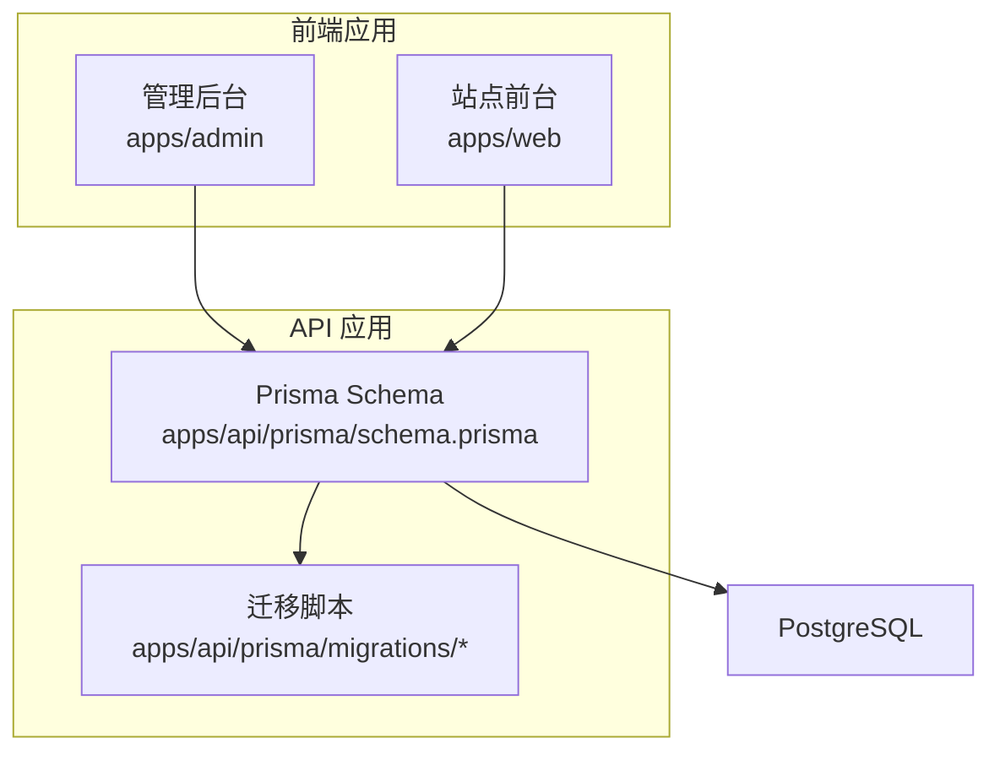
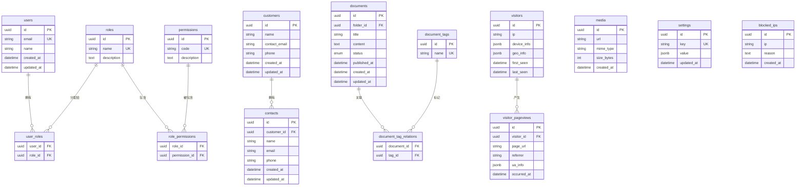
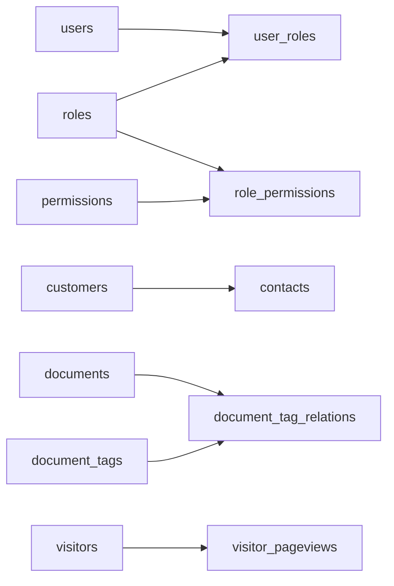
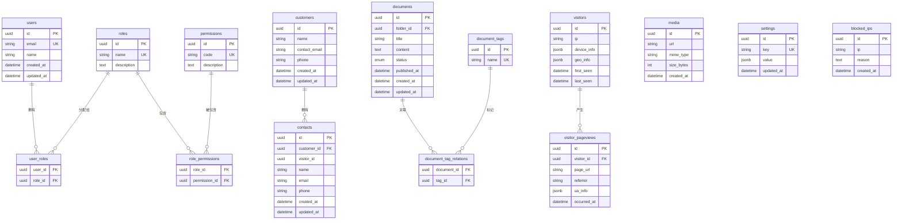

# 数据库模型设计

<cite>
**本文引用的文件**   
- [schema.prisma](file://apps/api/prisma/schema.prisma)
- [0_init/migration.sql](file://apps/api/prisma/migrations/0_init/migration.sql)
- [20260723110621_add_device_details/migration.sql](file://apps/api/prisma/migrations/20260723110621_add_device_details/migration.sql)
- [20260723120000_add_contact_visitor_id/migration.sql](file://apps/api/prisma/migrations/20260723120000_add_contact_visitor_id/migration.sql)
- [20260724122950_customer_visitor_id/migration.sql](file://apps/api/prisma/migrations/20260724122950_customer_visitor_id/migration.sql)
</cite>

## 目录
1. [引言](#引言)
2. [项目结构](#项目结构)
3. [核心组件](#核心组件)
4. [架构总览](#架构总览)
5. [详细组件分析](#详细组件分析)
6. [依赖关系分析](#依赖关系分析)
7. [性能考虑](#性能考虑)
8. [故障排查指南](#故障排查指南)
9. [结论](#结论)
10. [附录](#附录)

## 引言
本文件面向开发者与数据建模人员，系统化梳理 Prisma Schema 中的实体定义、字段类型与约束条件，重点覆盖用户、客户、文档、访客分析等核心业务模块。文档包含：
- 实体与字段说明（含默认值、校验规则）
- 实体间关系映射（一对一、一对多、多对多）及外键约束
- ER 图与索引优化策略
- 常见问题的定位与排障建议

## 项目结构
本项目采用前后端分离的 Monorepo 结构，数据库模型定义位于后端 API 应用的 Prisma 配置中。迁移脚本按版本分目录存放，便于追踪表结构与约束变更。

图表来源
- [schema.prisma](file://apps/api/prisma/schema.prisma)
- [0_init/migration.sql](file://apps/api/prisma/migrations/0_init/migration.sql)

章节来源
- [schema.prisma](file://apps/api/prisma/schema.prisma)

## 核心组件
本节概述数据库中的关键实体及其职责：
- 用户与访问控制：用户、角色、权限、审计日志
- 内容与资源：文档、文档分类、标签、媒体资源
- 营销与销售：客户、联系人、商机、新闻、案例、解决方案、展会
- 分析与安全：访客分析、IP 封禁、系统设置、集成配置
- 支持与服务：聊天会话、消息、工单

章节来源
- [schema.prisma](file://apps/api/prisma/schema.prisma)

## 架构总览
下图展示核心实体之间的关系映射，包括一对一、一对多与多对多关系，以及典型的外键约束。

图表来源
- [schema.prisma](file://apps/api/prisma/schema.prisma)
- [0_init/migration.sql](file://apps/api/prisma/migrations/0_init/migration.sql)
- [20260723110621_add_device_details/migration.sql](file://apps/api/prisma/migrations/20260723110621_add_device_details/migration.sql)
- [20260723120000_add_contact_visitor_id/migration.sql](file://apps/api/prisma/migrations/20260723120000_add_contact_visitor_id/migration.sql)
- [20260724122950_customer_visitor_id/migration.sql](file://apps/api/prisma/migrations/20260724122950_customer_visitor_id/migration.sql)

## 详细组件分析

### 用户与访问控制
- 用户（users）
  - 主键：uuid
  - 唯一性：email
  - 时间戳：created_at、updated_at
  - 常用字段：name、status、avatar_url（如存在）
- 角色（roles）与权限（permissions）
  - 角色名称唯一；权限代码唯一
  - 通过中间表实现多对多：user_roles、role_permissions
- 审计日志（audit_logs）
  - 记录操作主体、目标、动作、上下文与时间戳

关系与约束
- 用户与角色：多对多（user_roles）
- 角色与权限：多对多（role_permissions）
- 审计日志通常与用户建立一对多关系（由用户触发）

索引优化
- users.email 唯一索引
- audit_logs.created_at、actor_id、action 等高频查询字段建议建复合索引

章节来源
- [schema.prisma](file://apps/api/prisma/schema.prisma)
- [0_init/migration.sql](file://apps/api/prisma/migrations/0_init/migration.sql)

### 客户与联系人
- 客户（customers）
  - 主键：uuid
  - 关键字段：name、contact_email、phone、source、status
  - 时间戳：created_at、updated_at
- 联系人（contacts）
  - 主键：uuid
  - 外键：customer_id
  - 关键字段：name、email、phone、title、notes
  - 时间戳：created_at、updated_at

关系与约束
- 客户与联系人：一对多（contacts.customer_id -> customers.id）
- 可选：visitor_id 用于将访客转化为联系人或客户（见迁移）

索引优化
- contacts.customer_id 索引
- contacts.email 唯一索引（如需）
- customers.contact_email 唯一索引（如业务要求）

章节来源
- [schema.prisma](file://apps/api/prisma/schema.prisma)
- [20260723120000_add_contact_visitor_id/migration.sql](file://apps/api/prisma/migrations/20260723120000_add_contact_visitor_id/migration.sql)
- [20260724122950_customer_visitor_id/migration.sql](file://apps/api/prisma/migrations/20260724122950_customer_visitor_id/migration.sql)

### 文档与标签
- 文档（documents）
  - 主键：uuid
  - 外键：folder_id（文档目录）
  - 关键字段：title、content、status、published_at、author_id（如存在）
  - 时间戳：created_at、updated_at
- 标签（document_tags）
  - 主键：uuid，name 唯一
- 文档-标签关系（document_tag_relations）
  - 多对多：document_id、tag_id

关系与约束
- 文档与目录：一对多（documents.folder_id -> folders.id，如存在）
- 文档与标签：多对多（document_tag_relations）

索引优化
- documents.status、documents.published_at、documents.author_id 等查询热点字段
- document_tag_relations.document_id、document_tag_relations.tag_id 复合索引

章节来源
- [schema.prisma](file://apps/api/prisma/schema.prisma)
- [0_init/migration.sql](file://apps/api/prisma/migrations/0_init/migration.sql)

### 访客分析与设备信息
- 访客（visitors）
  - 主键：uuid
  - 关键字段：ip、device_info（JSONB）、geo_info（JSONB）
  - 时间戳：first_seen、last_seen
- 页面浏览（visitor_pageviews）
  - 主键：uuid
  - 外键：visitor_id
  - 关键字段：page_url、referrer、ua_info（JSONB）、occurred_at

关系与约束
- 访客与页面浏览：一对多（visitor_pageviews.visitor_id -> visitors.id）
- 可选：contacts.customer_id、contacts.visitor_id 用于线索转化链路

索引优化
- visitor_pageviews.visitor_id、visitor_pageviews.occurred_at
- visitors.ip 索引（用于去重与聚合）
- 针对地理与设备信息的 JSONB 字段可考虑 GIN 索引以加速筛选

章节来源
- [schema.prisma](file://apps/api/prisma/schema.prisma)
- [20260723110621_add_device_details/migration.sql](file://apps/api/prisma/migrations/20260723110621_add_device_details/migration.sql)
- [20260723120000_add_contact_visitor_id/migration.sql](file://apps/api/prisma/migrations/20260723120000_add_contact_visitor_id/migration.sql)

### 媒体资源与系统设置
- 媒体（media）
  - 主键：uuid
  - 关键字段：url、mime_type、size_bytes、metadata（如存在）
  - 时间戳：created_at、updated_at
- 系统设置（settings）
  - 主键：uuid
  - 唯一键：key
  - 值字段：value（JSONB）
  - 时间戳：updated_at

索引优化
- media.mime_type、media.size_bytes 等过滤字段
- settings.key 唯一索引

章节来源
- [schema.prisma](file://apps/api/prisma/schema.prisma)

### 安全与集成
- IP 封禁（blocked_ips）
  - 主键：uuid
  - 关键字段：ip、reason、created_at
- 集成配置（integrations）
  - 主键：uuid
  - 关键字段：provider、config（JSONB）、enabled、created_at、updated_at

索引优化
- blocked_ips.ip 唯一索引
- integrations.provider 索引

章节来源
- [schema.prisma](file://apps/api/prisma/schema.prisma)

## 依赖关系分析
- 实体耦合度
  - 访问控制：users、roles、permissions 通过中间表解耦，提升扩展性
  - 内容管理：documents 与 tags 通过多对多解耦，便于灵活打标
  - 访客分析：visitors 与 visitor_pageviews 一对多，利于时序分析
- 外键约束
  - 强一致性：contacts.customer_id、visitor_pageviews.visitor_id、documents.folder_id（如存在）
  - 软关联：settings、media、blocked_ips 无复杂外键，便于独立演进
- 潜在循环依赖
  - 当前模型未见循环引用，多对多通过中间表隔离

图表来源
- [schema.prisma](file://apps/api/prisma/schema.prisma)
- [0_init/migration.sql](file://apps/api/prisma/migrations/0_init/migration.sql)

章节来源
- [schema.prisma](file://apps/api/prisma/schema.prisma)

## 性能考虑
- 索引策略
  - 高频查询字段加索引：users.email、contacts.customer_id、visitor_pageviews.visitor_id、documents.status/published_at
  - JSONB 字段使用 GIN 索引：visitors.device_info、visitors.geo_info、visitor_pageviews.ua_info
  - 复合索引：按查询模式组合排序与过滤字段，如 (occurred_at, visitor_id)
- 分区与归档
  - visitor_pageviews 可按时间分区，历史数据归档至冷存储
- 读写分离
  - 分析型查询走只读副本，写入走主库
- 连接池与缓存
  - 合理设置 Prisma 连接池大小；热点数据（如 settings）可引入 Redis 缓存

[本节为通用指导，不直接分析具体文件]

## 故障排查指南
- 迁移失败
  - 检查迁移 SQL 语法与依赖顺序，确保新增列与索引在已有数据上兼容
  - 回滚策略：保留基线迁移，逐步增量更新
- 外键冲突
  - 删除或更新子记录后再删除父记录；或使用级联策略
- 唯一约束冲突
  - 插入前进行存在性检查；必要时捕获并处理重复键异常
- JSONB 查询慢
  - 确认是否创建 GIN 索引；避免在 JSONB 上使用低选择性函数
- 访客数据膨胀
  - 定期清理或归档 visitor_pageviews；限制保留周期

章节来源
- [0_init/migration.sql](file://apps/api/prisma/migrations/0_init/migration.sql)
- [20260723110621_add_device_details/migration.sql](file://apps/api/prisma/migrations/20260723110621_add_device_details/migration.sql)
- [20260723120000_add_contact_visitor_id/migration.sql](file://apps/api/prisma/migrations/20260723120000_add_contact_visitor_id/migration.sql)
- [20260724122950_customer_visitor_id/migration.sql](file://apps/api/prisma/migrations/20260724122950_customer_visitor_id/migration.sql)

## 结论
本数据模型围绕用户与权限、内容与资源、营销与销售、访客分析与安全支撑构建了清晰的结构。通过合理的实体划分、外键约束与索引策略，既保证了数据一致性与查询性能，也为后续扩展预留了空间。建议在新增字段与索引时遵循“先评估查询模式，再落地索引”的原则，并结合监控指标持续优化。

[本节为总结性内容，不直接分析具体文件]

## 附录

### ER 图（完整视图）

图表来源
- [schema.prisma](file://apps/api/prisma/schema.prisma)
- [0_init/migration.sql](file://apps/api/prisma/migrations/0_init/migration.sql)
- [20260723110621_add_device_details/migration.sql](file://apps/api/prisma/migrations/20260723110621_add_device_details/migration.sql)
- [20260723120000_add_contact_visitor_id/migration.sql](file://apps/api/prisma/migrations/20260723120000_add_contact_visitor_id/migration.sql)
- [20260724122950_customer_visitor_id/migration.sql](file://apps/api/prisma/migrations/20260724122950_customer_visitor_id/migration.sql)