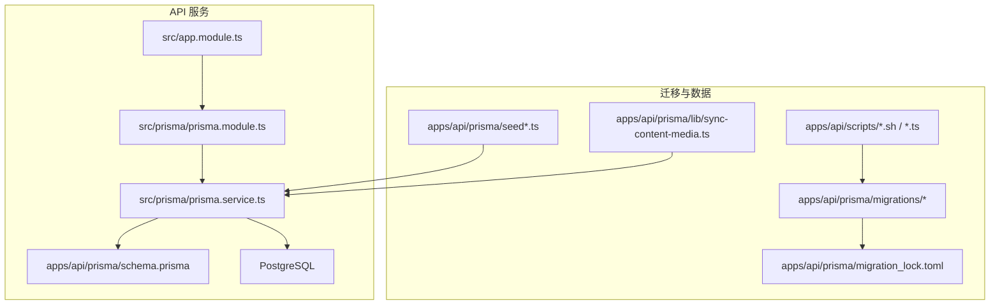
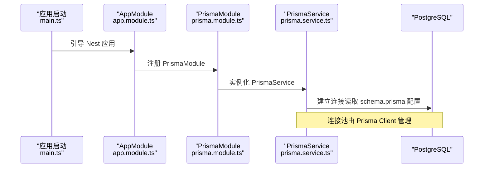
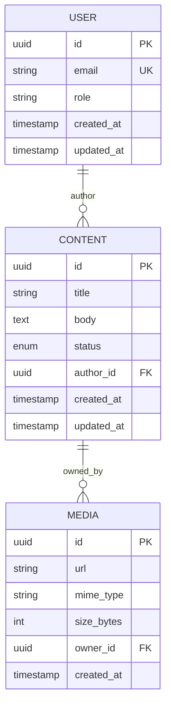
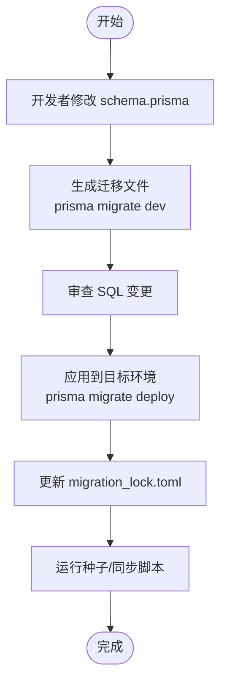
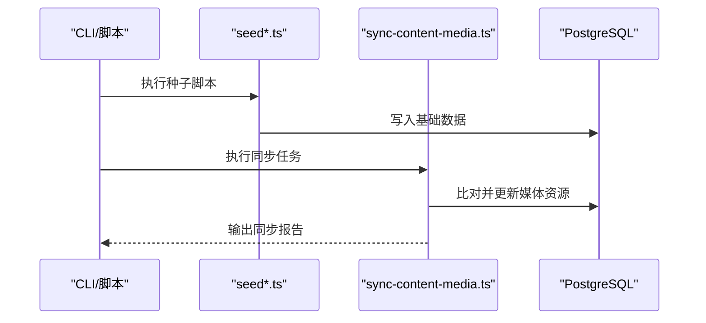
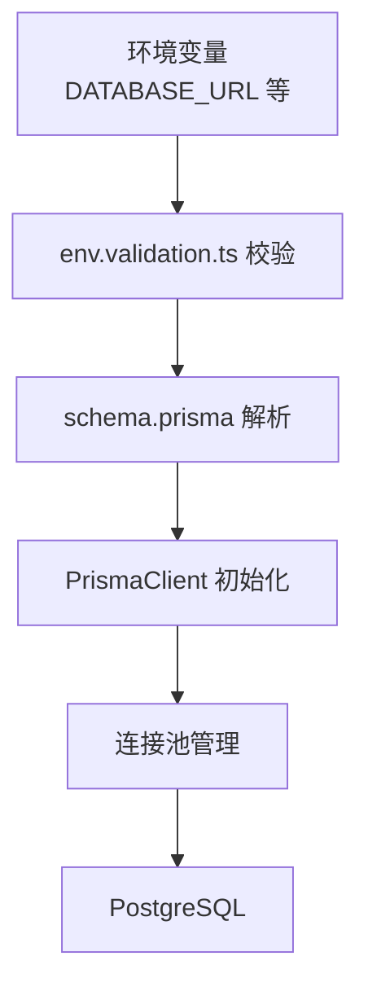
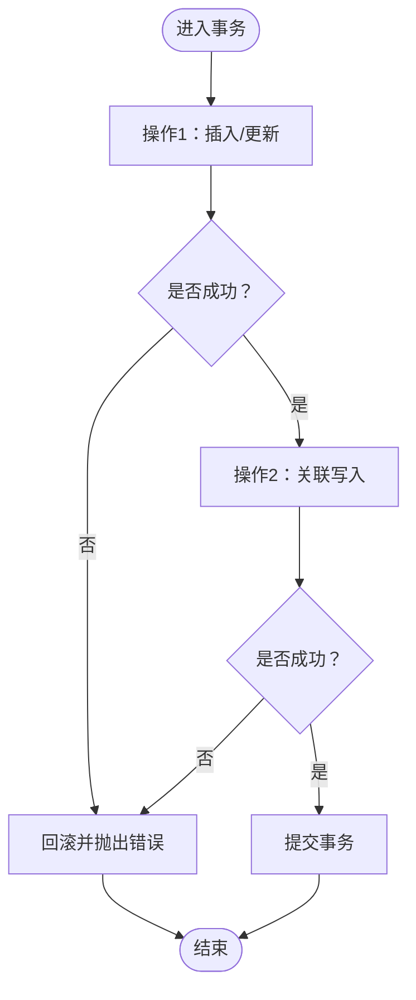
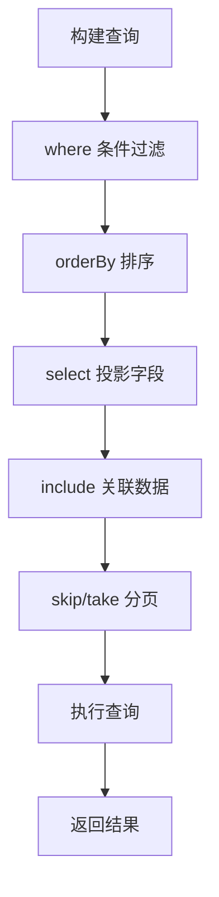
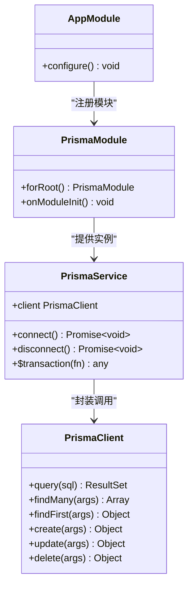

# 数据库设计与ORM

<cite>
**本文引用的文件**   
- [schema.prisma](file://apps/api/prisma/schema.prisma)
- [prisma.service.ts](file://apps/api/src/prisma/prisma.service.ts)
- [prisma.module.ts](file://apps/api/src/prisma/prisma.module.ts)
- [migration_lock.toml](file://apps/api/prisma/migrations/migration_lock.toml)
- [0_init/migration.sql](file://apps/api/prisma/migrations/0_init/migration.sql)
- [20260723110621_add_device_details/migration.sql](file://apps/api/prisma/migrations/20260723110621_add_device_details/migration.sql)
- [20260723120000_add_contact_visitor_id/migration.sql](file://apps/api/prisma/migrations/20260723120000_add_contact_visitor_id/migration.sql)
- [20260724122950_customer_visitor_id/migration.sql](file://apps/api/prisma/migrations/20260724122950_customer_visitor_id/migration.sql)
- [seed.ts](file://apps/api/prisma/seed.ts)
- [seed-content-media.ts](file://apps/api/prisma/seed-content-media.ts)
- [seed-content.ts](file://apps/api/prisma/seed-content.ts)
- [sync-content-media.ts](file://apps/api/prisma/lib/sync-content-media.ts)
- [baseline-migrations.sh](file://apps/api/scripts/baseline-migrations.sh)
- [migrate-deprecated-roles.ts](file://apps/api/scripts/migrate-deprecated-roles.ts)
- [prune-deprecated-permissions.ts](file://apps/api/scripts/prune-deprecated-permissions.ts)
- [env.validation.ts](file://apps/api/src/config/env.validation.ts)
- [app.module.ts](file://apps/api/src/app.module.ts)
- [main.ts](file://apps/api/src/main.ts)
</cite>

## 目录
1. [简介](#简介)
2. [项目结构](#项目结构)
3. [核心组件](#核心组件)
4. [架构总览](#架构总览)
5. [详细组件分析](#详细组件分析)
6. [依赖关系分析](#依赖关系分析)
7. [性能考虑](#性能考虑)
8. [故障排查指南](#故障排查指南)
9. [结论](#结论)
10. [附录](#附录)

## 简介
本文件面向基于 Prisma 的数据库设计与 ORM 使用，覆盖模型设计、实体关系与约束、迁移策略与版本管理、数据同步机制、连接池配置、查询优化与事务处理、复杂查询模式、索引设计与性能调优等主题。目标是提供一套可落地的数据库开发与维护指导方案，帮助团队在 NestJS + Prisma 的技术栈上高效、稳定地演进数据层。

## 项目结构
本项目采用多应用（admin、api、web）+ infra 的基础设施编排。数据库相关代码集中在 apps/api 下的 prisma 目录与 src/prisma 模块中：
- schema.prisma：Prisma 数据模型定义与数据库连接配置
- migrations：按时间戳划分的迁移目录，包含 SQL 与锁定文件
- seed*：种子脚本用于初始化或填充测试数据
- lib/sync-content-media.ts：内容媒体同步工具
- scripts/*：迁移辅助与数据修复脚本
- src/prisma：NestJS 模块封装 Prisma Client 生命周期与注入

图表来源
- [app.module.ts](file://apps/api/src/app.module.ts)
- [prisma.module.ts](file://apps/api/src/prisma/prisma.module.ts)
- [prisma.service.ts](file://apps/api/src/prisma/prisma.service.ts)
- [schema.prisma](file://apps/api/prisma/schema.prisma)
- [migration_lock.toml](file://apps/api/prisma/migrations/migration_lock.toml)

章节来源
- [schema.prisma](file://apps/api/prisma/schema.prisma)
- [prisma.service.ts](file://apps/api/src/prisma/prisma.service.ts)
- [prisma.module.ts](file://apps/api/src/prisma/prisma.module.ts)
- [migration_lock.toml](file://apps/api/prisma/migrations/migration_lock.toml)

## 核心组件
- Prisma 客户端与服务：通过 NestJS 模块暴露 PrismaClient，统一生命周期管理与错误处理
- 数据模型与约束：在 schema.prisma 中声明实体、字段类型、关联关系与校验规则
- 迁移系统：以时间戳命名的迁移目录配合 migration_lock.toml 保证一致性
- 种子与同步：seed 脚本与同步工具用于初始化和增量数据对齐
- 环境验证：集中校验数据库连接参数与运行时环境变量

章节来源
- [prisma.service.ts](file://apps/api/src/prisma/prisma.service.ts)
- [prisma.module.ts](file://apps/api/src/prisma/prisma.module.ts)
- [schema.prisma](file://apps/api/prisma/schema.prisma)
- [migration_lock.toml](file://apps/api/prisma/migrations/migration_lock.toml)
- [seed.ts](file://apps/api/prisma/seed.ts)
- [seed-content-media.ts](file://apps/api/prisma/seed-content-media.ts)
- [seed-content.ts](file://apps/api/prisma/seed-content.ts)
- [sync-content-media.ts](file://apps/api/prisma/lib/sync-content-media.ts)
- [env.validation.ts](file://apps/api/src/config/env.validation.ts)

## 架构总览
下图展示了 API 服务如何通过 NestJS 模块加载 Prisma 客户端，并访问 PostgreSQL 数据库；同时展示迁移与种子脚本如何与数据库交互。

图表来源
- [main.ts](file://apps/api/src/main.ts)
- [app.module.ts](file://apps/api/src/app.module.ts)
- [prisma.module.ts](file://apps/api/src/prisma/prisma.module.ts)
- [prisma.service.ts](file://apps/api/src/prisma/prisma.service.ts)
- [schema.prisma](file://apps/api/prisma/schema.prisma)

## 详细组件分析

### Prisma 数据模型与关系
- 实体建模：在 schema.prisma 中定义所有业务实体、字段类型、默认值与唯一性约束
- 关系建模：使用 @relation 描述一对多、多对多等关系，确保外键语义清晰
- 约束与校验：利用 Prisma 内置校验（如 unique、required、enum）保障数据完整性
- 复合索引：为高频查询条件创建联合索引，提升过滤与排序性能

图表来源
- [schema.prisma](file://apps/api/prisma/schema.prisma)

章节来源
- [schema.prisma](file://apps/api/prisma/schema.prisma)

### 迁移策略与版本管理
- 迁移目录：每个迁移以时间戳命名，包含独立的 SQL 文件，便于追踪变更历史
- 锁定文件：migration_lock.toml 记录迁移依赖与状态，避免冲突
- 基线迁移：baseline-migrations.sh 用于生成或校验基线，确保 CI/CD 一致性
- 数据修复脚本：migrate-deprecated-roles.ts、prune-deprecated-permissions.ts 用于清理与修复历史数据

图表来源
- [0_init/migration.sql](file://apps/api/prisma/migrations/0_init/migration.sql)
- [20260723110621_add_device_details/migration.sql](file://apps/api/prisma/migrations/20260723110621_add_device_details/migration.sql)
- [20260723120000_add_contact_visitor_id/migration.sql](file://apps/api/prisma/migrations/20260723120000_add_contact_visitor_id/migration.sql)
- [20260724122950_customer_visitor_id/migration.sql](file://apps/api/prisma/migrations/20260724122950_customer_visitor_id/migration.sql)
- [migration_lock.toml](file://apps/api/prisma/migrations/migration_lock.toml)
- [baseline-migrations.sh](file://apps/api/scripts/baseline-migrations.sh)
- [migrate-deprecated-roles.ts](file://apps/api/scripts/migrate-deprecated-roles.ts)
- [prune-deprecated-permissions.ts](file://apps/api/scripts/prune-deprecated-permissions.ts)

章节来源
- [migration_lock.toml](file://apps/api/prisma/migrations/migration_lock.toml)
- [0_init/migration.sql](file://apps/api/prisma/migrations/0_init/migration.sql)
- [20260723110621_add_device_details/migration.sql](file://apps/api/prisma/migrations/20260723110621_add_device_details/migration.sql)
- [20260723120000_add_contact_visitor_id/migration.sql](file://apps/api/prisma/migrations/20260723120000_add_contact_visitor_id/migration.sql)
- [20260724122950_customer_visitor_id/migration.sql](file://apps/api/prisma/migrations/20260724122950_customer_visitor_id/migration.sql)
- [baseline-migrations.sh](file://apps/api/scripts/baseline-migrations.sh)
- [migrate-deprecated-roles.ts](file://apps/api/scripts/migrate-deprecated-roles.ts)
- [prune-deprecated-permissions.ts](file://apps/api/scripts/prune-deprecated-permissions.ts)

### 数据同步与种子
- 种子脚本：seed.ts、seed-content.ts、seed-content-media.ts 用于初始化基础数据与示例内容
- 同步工具：lib/sync-content-media.ts 负责内容与媒体资源的增量同步与一致性校验
- 执行时机：通常在迁移完成后运行，确保数据结构与数据内容一致

图表来源
- [seed.ts](file://apps/api/prisma/seed.ts)
- [seed-content.ts](file://apps/api/prisma/seed-content.ts)
- [seed-content-media.ts](file://apps/api/prisma/seed-content-media.ts)
- [sync-content-media.ts](file://apps/api/prisma/lib/sync-content-media.ts)

章节来源
- [seed.ts](file://apps/api/prisma/seed.ts)
- [seed-content.ts](file://apps/api/prisma/seed-content.ts)
- [seed-content-media.ts](file://apps/api/prisma/seed-content-media.ts)
- [sync-content-media.ts](file://apps/api/prisma/lib/sync-content-media.ts)

### 连接池配置与环境变量
- 连接字符串：通过 DATABASE_URL 指定数据库地址、用户名、密码与连接参数
- 连接池参数：可在连接字符串中配置最大连接数、超时、重试等，Prisma Client 内部统一管理
- 环境变量校验：env.validation.ts 集中校验必要的环境变量，防止运行时缺失导致崩溃

图表来源
- [schema.prisma](file://apps/api/prisma/schema.prisma)
- [env.validation.ts](file://apps/api/src/config/env.validation.ts)

章节来源
- [schema.prisma](file://apps/api/prisma/schema.prisma)
- [env.validation.ts](file://apps/api/src/config/env.validation.ts)

### 事务处理与并发控制
- 事务边界：在 PrismaService 或业务 Service 中使用 $transaction 包裹多个写操作，保证原子性
- 并发控制：结合唯一约束与行级锁（FOR UPDATE）避免竞态条件
- 错误回滚：捕获异常并触发回滚，确保数据一致性

章节来源
- [prisma.service.ts](file://apps/api/src/prisma/prisma.service.ts)

### 复杂查询模式与索引设计
- 分页与过滤：使用 skip/take 实现分页，where 条件组合布尔表达式
- 排序与投影：orderBy 指定排序字段，select 仅返回必要字段减少传输开销
- 关联查询：include 预加载关联数据，避免 N+1 问题
- 索引策略：为常用过滤、排序与关联字段建立单列或复合索引，关注选择性高的列

章节来源
- [schema.prisma](file://apps/api/prisma/schema.prisma)

## 依赖关系分析
Prisma 模块与 NestJS 应用的生命周期紧密耦合，PrismaService 作为单一入口对外暴露数据库能力。

图表来源
- [app.module.ts](file://apps/api/src/app.module.ts)
- [prisma.module.ts](file://apps/api/src/prisma/prisma.module.ts)
- [prisma.service.ts](file://apps/api/src/prisma/prisma.service.ts)

章节来源
- [app.module.ts](file://apps/api/src/app.module.ts)
- [prisma.module.ts](file://apps/api/src/prisma/prisma.module.ts)
- [prisma.service.ts](file://apps/api/src/prisma/prisma.service.ts)

## 性能考虑
- 连接池调优：根据并发量调整最大连接数与超时，避免连接耗尽与长事务占用
- 查询优化：优先使用 select 投影、合理 where 条件、避免不必要的 include
- 索引设计：针对高频查询路径建立合适索引，定期评估慢查询日志
- 批量操作：使用批量写入与合并更新减少往返次数
- 缓存策略：热点数据引入 Redis 缓存，降低数据库压力

[本节为通用指导，不直接分析具体文件]

## 故障排查指南
- 连接失败：检查 DATABASE_URL 是否正确，网络连通性与权限设置
- 迁移冲突：核对 migration_lock.toml 与目标库状态，必要时重建基线
- 数据不一致：运行 sync-content-media.ts 进行一致性修复
- 事务失败：查看事务内异常堆栈，确认锁竞争与约束冲突

章节来源
- [env.validation.ts](file://apps/api/src/config/env.validation.ts)
- [migration_lock.toml](file://apps/api/prisma/migrations/migration_lock.toml)
- [sync-content-media.ts](file://apps/api/prisma/lib/sync-content-media.ts)

## 结论
通过 Prisma 的强类型模型、迁移系统与 NestJS 的模块化封装，本项目实现了清晰的数据库设计与稳健的数据访问层。遵循本文档的迁移策略、索引设计与性能调优建议，可有效提升系统的稳定性与可扩展性。建议在持续集成中固化迁移与种子流程，确保环境与数据的一致性。

[本节为总结，不直接分析具体文件]

## 附录
- 常用命令：
  - 生成并应用迁移：prisma migrate dev / prisma migrate deploy
  - 运行种子：node prisma/seed.ts
  - 同步内容媒体：node prisma/lib/sync-content-media.ts
- 参考文件：
  - 模型定义：schema.prisma
  - 迁移历史：apps/api/prisma/migrations/*
  - 服务封装：src/prisma/prisma.service.ts

[本节为补充信息，不直接分析具体文件]