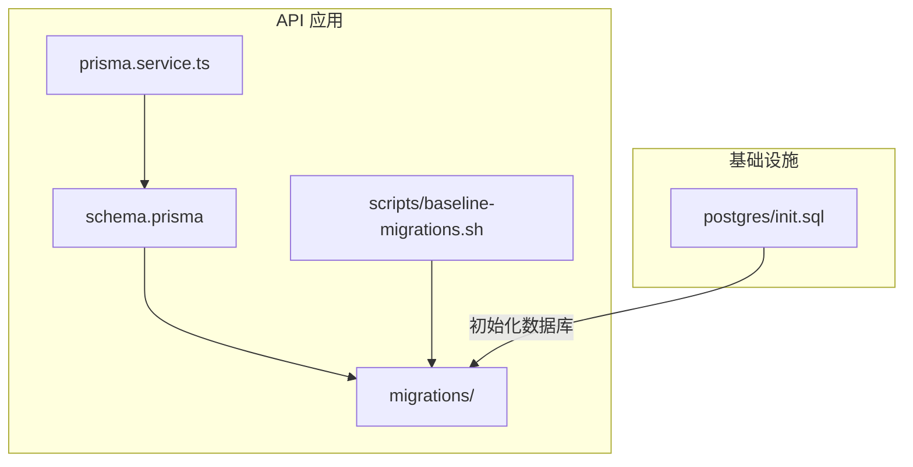
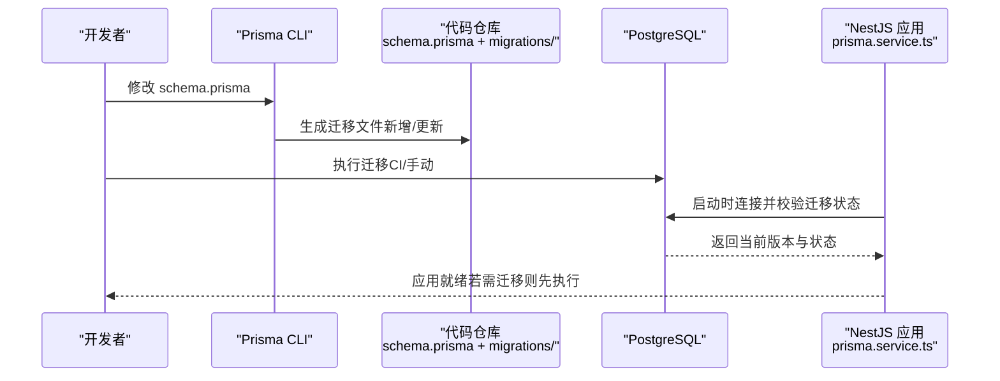
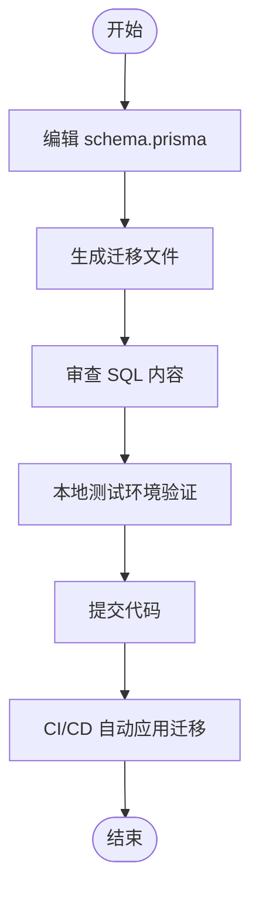
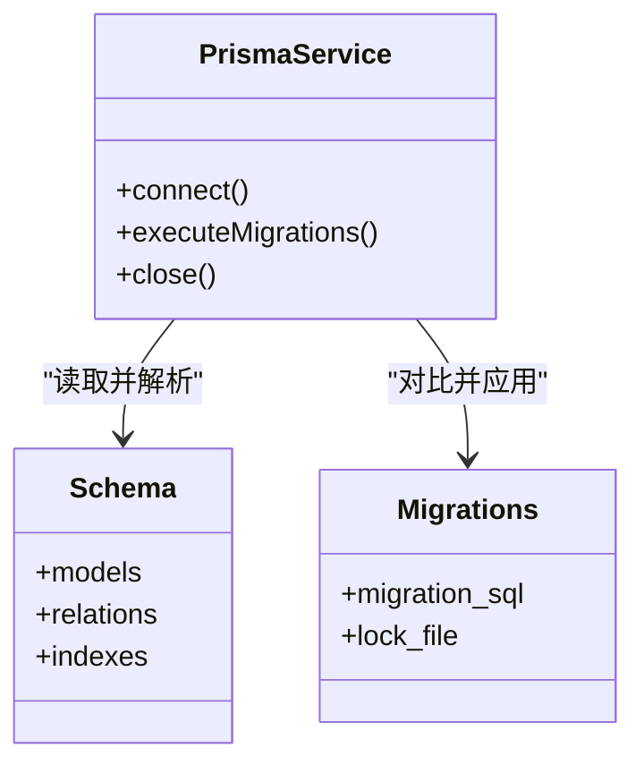

# 数据库迁移管理

<cite>
**本文引用的文件**   
- [apps/api/prisma/schema.prisma](file://apps/api/prisma/schema.prisma)
- [apps/api/prisma/migrations/0_init/migration.sql](file://apps/api/prisma/migrations/0_init/migration.sql)
- [apps/api/prisma/migrations/20260723110621_add_device_details/migration.sql](file://apps/api/prisma/migrations/20260723110621_add_device_details/migration.sql)
- [apps/api/prisma/migrations/20260723120000_add_contact_visitor_id/migration.sql](file://apps/api/prisma/migrations/20260723120000_add_contact_visitor_id/migration.sql)
- [apps/api/prisma/migrations/20260724122950_customer_visitor_id/migration.sql](file://apps/api/prisma/migrations/20260724122950_customer_visitor_id/migration.sql)
- [apps/api/prisma/migrations/migration_lock.toml](file://apps/api/prisma/migrations/migration_lock.toml)
- [apps/api/scripts/baseline-migrations.sh](file://apps/api/scripts/baseline-migrations.sh)
- [apps/api/src/prisma/prisma.service.ts](file://apps/api/src/prisma/prisma.service.ts)
- [infra/docker/postgres/init.sql](file://infra/docker/postgres/init.sql)
</cite>

## 目录
1. [简介](#简介)
2. [项目结构](#项目结构)
3. [核心组件](#核心组件)
4. [架构总览](#架构总览)
5. [详细组件分析](#详细组件分析)
6. [依赖关系分析](#依赖关系分析)
7. [性能考虑](#性能考虑)
8. [故障排查指南](#故障排查指南)
9. [结论](#结论)
10. [附录](#附录)

## 简介
本文件面向使用 Prisma Migrations 的团队，提供基于仓库中现有实现的数据库版本控制策略与迁移流程说明。内容涵盖：
- 迁移文件的命名规范、结构组织与内容格式
- 如何创建新迁移、回滚迁移与应用生产环境变更
- 数据迁移最佳实践、备份策略与故障恢复方案
- 迁移脚本示例路径与常见问题解决方案
目标是在保证数据库版本一致性的前提下，提升可维护性与可回滚能力。

## 项目结构
本项目采用多应用（admin、api、web）+ 基础设施（infra）的模块化组织。数据库迁移位于 API 应用的 Prisma 目录中，包含 schema 定义与多个按时间戳命名的迁移文件夹，每个文件夹内包含对应的 SQL 迁移脚本与锁定文件。

图表来源
- [apps/api/prisma/schema.prisma](file://apps/api/prisma/schema.prisma)
- [apps/api/prisma/migrations/0_init/migration.sql](file://apps/api/prisma/migrations/0_init/migration.sql)
- [apps/api/src/prisma/prisma.service.ts](file://apps/api/src/prisma/prisma.service.ts)
- [apps/api/scripts/baseline-migrations.sh](file://apps/api/scripts/baseline-migrations.sh)
- [infra/docker/postgres/init.sql](file://infra/docker/postgres/init.sql)

章节来源
- [apps/api/prisma/schema.prisma](file://apps/api/prisma/schema.prisma)
- [apps/api/prisma/migrations/0_init/migration.sql](file://apps/api/prisma/migrations/0_init/migration.sql)
- [apps/api/prisma/migrations/20260723110621_add_device_details/migration.sql](file://apps/api/prisma/migrations/20260723110621_add_device_details/migration.sql)
- [apps/api/prisma/migrations/20260723120000_add_contact_visitor_id/migration.sql](file://apps/api/prisma/migrations/20260723120000_add_contact_visitor_id/migration.sql)
- [apps/api/prisma/migrations/20260724122950_customer_visitor_id/migration.sql](file://apps/api/prisma/migrations/20260724122950_customer_visitor_id/migration.sql)
- [apps/api/prisma/migrations/migration_lock.toml](file://apps/api/prisma/migrations/migration_lock.toml)
- [apps/api/src/prisma/prisma.service.ts](file://apps/api/src/prisma/prisma.service.ts)
- [apps/api/scripts/baseline-migrations.sh](file://apps/api/scripts/baseline-migrations.sh)
- [infra/docker/postgres/init.sql](file://infra/docker/postgres/init.sql)

## 核心组件
- Schema 定义：集中描述模型、字段、索引与约束，是生成迁移的基础。
- 迁移目录：按时间戳或语义化名称组织，每个迁移包含一个 SQL 脚本，记录对数据库结构的增量变更。
- 迁移锁定文件：确保团队与 CI 使用一致的迁移元数据，避免冲突。
- 服务集成：Prisma 客户端在服务启动时负责连接数据库并执行迁移。
- 基线脚本：用于在本地或 CI 环境中快速建立初始迁移基线。

章节来源
- [apps/api/prisma/schema.prisma](file://apps/api/prisma/schema.prisma)
- [apps/api/prisma/migrations/migration_lock.toml](file://apps/api/prisma/migrations/migration_lock.toml)
- [apps/api/src/prisma/prisma.service.ts](file://apps/api/src/prisma/prisma.service.ts)
- [apps/api/scripts/baseline-migrations.sh](file://apps/api/scripts/baseline-migrations.sh)

## 架构总览
下图展示了从 Schema 到数据库的迁移链路，以及服务启动时的迁移执行点。

图表来源
- [apps/api/prisma/schema.prisma](file://apps/api/prisma/schema.prisma)
- [apps/api/src/prisma/prisma.service.ts](file://apps/api/src/prisma/prisma.service.ts)

## 详细组件分析

### 迁移文件命名规范与结构
- 命名规范
  - 使用“时间戳_语义描述”的文件夹名，例如：20260723110621_add_device_details
  - 首个迁移可使用语义化前缀（如 0_init），便于基线构建
- 结构组织
  - 每个迁移文件夹包含一个 migration.sql，描述该版本的 DDL/DML 变更
  - 根级 migration_lock.toml 锁定迁移元数据，保证一致性
- 内容格式
  - 以 SQL 为主，遵循幂等性原则（尽量可重复执行或具备条件判断）
  - 建议为关键表添加注释，便于后续维护

章节来源
- [apps/api/prisma/migrations/0_init/migration.sql](file://apps/api/prisma/migrations/0_init/migration.sql)
- [apps/api/prisma/migrations/20260723110621_add_device_details/migration.sql](file://apps/api/prisma/migrations/20260723110621_add_device_details/migration.sql)
- [apps/api/prisma/migrations/20260723120000_add_contact_visitor_id/migration.sql](file://apps/api/prisma/migrations/20260723120000_add_contact_visitor_id/migration.sql)
- [apps/api/prisma/migrations/20260724122950_customer_visitor_id/migration.sql](file://apps/api/prisma/migrations/20260724122950_customer_visitor_id/migration.sql)
- [apps/api/prisma/migrations/migration_lock.toml](file://apps/api/prisma/migrations/migration_lock.toml)

### 创建新迁移的流程
- 修改 schema.prisma，描述期望的数据模型
- 生成迁移文件（由 Prisma CLI 完成）
- 审查生成的 SQL，确保符合业务需求与回滚策略
- 提交代码并在测试环境验证
- 在 CI/CD 中自动应用到目标环境

章节来源
- [apps/api/prisma/schema.prisma](file://apps/api/prisma/schema.prisma)
- [apps/api/scripts/baseline-migrations.sh](file://apps/api/scripts/baseline-migrations.sh)

### 回滚迁移的策略
- 开发/测试环境：可直接回滚最近一次迁移，重新生成并验证
- 生产环境：不建议直接回滚；应编写反向迁移脚本，谨慎评估数据影响后再应用
- 回滚前务必备份数据库，确保可恢复

章节来源
- [apps/api/prisma/migrations/migration_lock.toml](file://apps/api/prisma/migrations/migration_lock.toml)

### 应用生产环境变更
- 通过 CI/CD 流水线执行迁移，确保与代码版本一致
- 建议在发布前进行预演（Staging），确认无破坏性变更
- 发布后监控错误日志与慢查询，必要时快速回退至上一稳定版本

章节来源
- [apps/api/src/prisma/prisma.service.ts](file://apps/api/src/prisma/prisma.service.ts)

### 数据迁移最佳实践
- 幂等性：迁移脚本应具备幂等性，支持重复执行或条件分支
- 向后兼容：优先采用“先加字段/表，再填充数据，最后切换引用”的分步策略
- 事务性：将相关变更放入同一事务，保证原子性
- 最小锁表：大表变更分批次进行，避免长时间锁表
- 审计与注释：为关键变更添加注释，便于回溯

章节来源
- [apps/api/prisma/migrations/20260723110621_add_device_details/migration.sql](file://apps/api/prisma/migrations/20260723110621_add_device_details/migration.sql)
- [apps/api/prisma/migrations/20260723120000_add_contact_visitor_id/migration.sql](file://apps/api/prisma/migrations/20260723120000_add_contact_visitor_id/migration.sql)
- [apps/api/prisma/migrations/20260724122950_customer_visitor_id/migration.sql](file://apps/api/prisma/migrations/20260724122950_customer_visitor_id/migration.sql)

### 备份策略与故障恢复
- 定期全量备份与增量备份结合，保留足够历史版本
- 每次重大迁移前执行快照备份
- 恢复流程：停止写入 -> 恢复备份 -> 校验一致性 -> 逐步回放必要日志 -> 灰度上线

章节来源
- [infra/docker/postgres/init.sql](file://infra/docker/postgres/init.sql)

### 迁移脚本示例与参考
- 基线迁移示例：0_init 用于初始化基础结构与种子数据
- 字段扩展示例：为设备详情增加字段
- 关联字段示例：为联系人和访客建立关联
- 客户关联示例：为客户实体引入访客标识

章节来源
- [apps/api/prisma/migrations/0_init/migration.sql](file://apps/api/prisma/migrations/0_init/migration.sql)
- [apps/api/prisma/migrations/20260723110621_add_device_details/migration.sql](file://apps/api/prisma/migrations/20260723110621_add_device_details/migration.sql)
- [apps/api/prisma/migrations/20260723120000_add_contact_visitor_id/migration.sql](file://apps/api/prisma/migrations/20260723120000_add_contact_visitor_id/migration.sql)
- [apps/api/prisma/migrations/20260724122950_customer_visitor_id/migration.sql](file://apps/api/prisma/migrations/20260724122950_customer_visitor_id/migration.sql)

### 常见问题与解决方案
- 迁移顺序不一致：检查 migration_lock.toml 是否同步，确保团队与 CI 使用相同锁定文件
- 生产环境迁移失败：立即回滚到上一个稳定版本，定位问题后修复迁移脚本再重试
- 大表变更导致超时：拆分迁移步骤，分批处理，减少锁表时间
- 数据不一致：在迁移前后分别导出关键表数据进行比对，确保一致性

章节来源
- [apps/api/prisma/migrations/migration_lock.toml](file://apps/api/prisma/migrations/migration_lock.toml)

## 依赖关系分析
Prisma 客户端与服务启动流程对迁移的影响如下：

图表来源
- [apps/api/src/prisma/prisma.service.ts](file://apps/api/src/prisma/prisma.service.ts)
- [apps/api/prisma/schema.prisma](file://apps/api/prisma/schema.prisma)
- [apps/api/prisma/migrations/migration_lock.toml](file://apps/api/prisma/migrations/migration_lock.toml)

章节来源
- [apps/api/src/prisma/prisma.service.ts](file://apps/api/src/prisma/prisma.service.ts)
- [apps/api/prisma/schema.prisma](file://apps/api/prisma/schema.prisma)
- [apps/api/prisma/migrations/migration_lock.toml](file://apps/api/prisma/migrations/migration_lock.toml)

## 性能考虑
- 迁移脚本应尽量使用批量操作，减少往返次数
- 对大表变更采用分批次更新，避免长事务与锁竞争
- 在低峰期执行耗时较长的迁移，降低对在线服务的影响
- 利用索引优化查询性能，但注意索引重建的成本

[本节为通用指导，不直接分析具体文件]

## 故障排查指南
- 查看迁移状态：确认数据库当前版本与预期版本是否一致
- 检查锁定文件：确保 migration_lock.toml 未被篡改或未遗漏
- 回滚与重放：在测试环境复现问题，修正迁移脚本后重新应用
- 监控与告警：对迁移过程中的错误与慢查询设置告警，及时响应

章节来源
- [apps/api/prisma/migrations/migration_lock.toml](file://apps/api/prisma/migrations/migration_lock.toml)
- [apps/api/src/prisma/prisma.service.ts](file://apps/api/src/prisma/prisma.service.ts)

## 结论
通过规范的迁移命名、清晰的目录组织、严格的锁定机制与完善的回滚策略，可以在保证数据库版本一致性的同时，提升系统的可维护性与稳定性。建议将迁移纳入 CI/CD 自动化流程，并结合备份与监控实现可靠的发布与恢复能力。

[本节为总结性内容，不直接分析具体文件]

## 附录
- 基线迁移脚本：用于快速建立初始迁移基线，适用于本地与 CI 环境
- 初始化 SQL：用于容器化环境的数据库初始化

章节来源
- [apps/api/scripts/baseline-migrations.sh](file://apps/api/scripts/baseline-migrations.sh)
- [infra/docker/postgres/init.sql](file://infra/docker/postgres/init.sql)