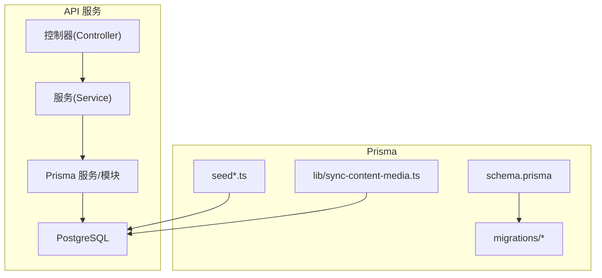
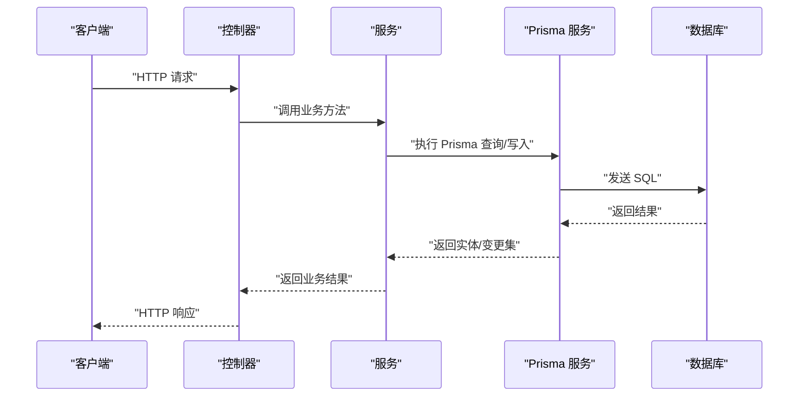
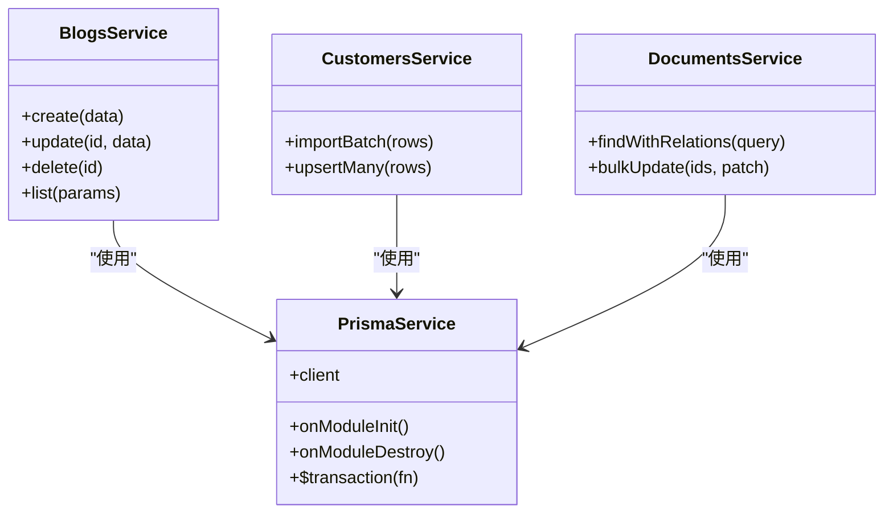
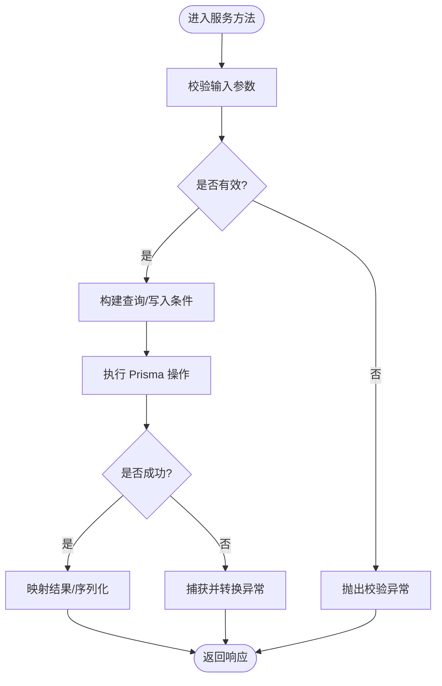
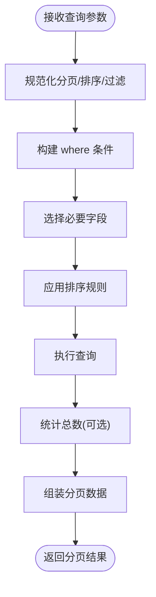
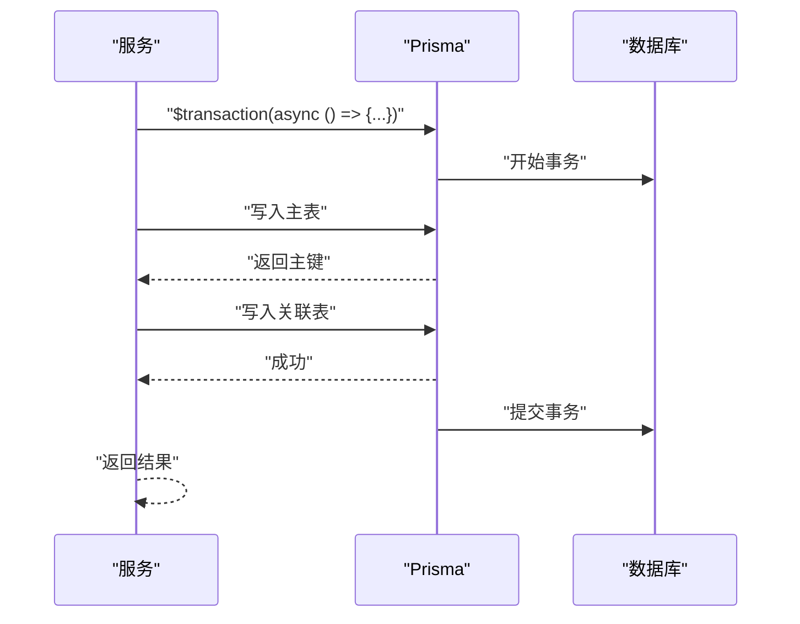
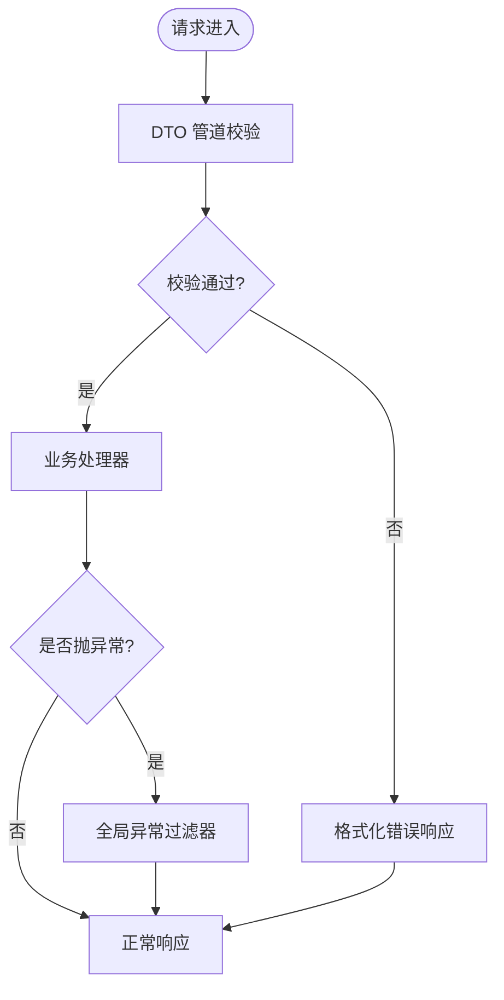
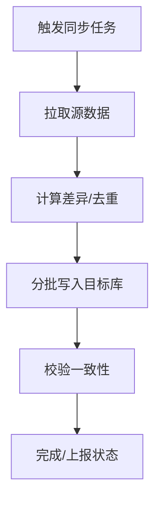
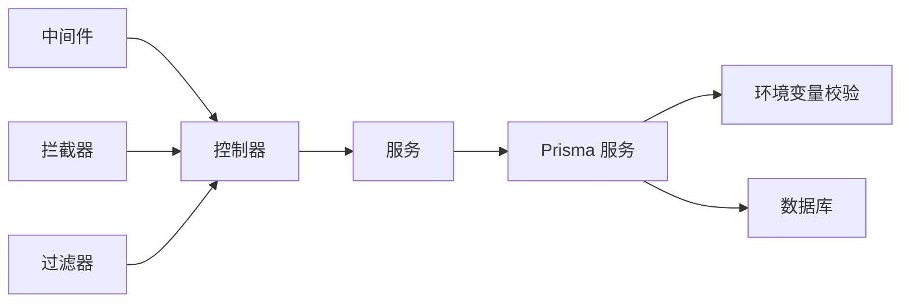

# 数据访问模式

<cite>
**本文引用的文件**   
- [schema.prisma](file://apps/api/prisma/schema.prisma)
- [prisma.service.ts](file://apps/api/src/prisma/prisma.service.ts)
- [prisma.module.ts](file://apps/api/src/prisma/prisma.module.ts)
- [blogs.service.ts](file://apps/api/src/blogs/blogs.service.ts)
- [blogs.controller.ts](file://apps/api/src/blogs/blogs.controller.ts)
- [customers.service.ts](file://apps/api/src/customers/customers.service.ts)
- [documents.service.ts](file://apps/api/src/documents/documents.service.ts)
- [media.service.ts](file://apps/api/src/media/media.service.ts)
- [sync-content-media.ts](file://apps/api/prisma/lib/sync-content-media.ts)
- [seed.ts](file://apps/api/prisma/seed.ts)
- [env.validation.ts](file://apps/api/src/config/env.validation.ts)
- [http-exception.filter.ts](file://apps/api/src/common/filters/http-exception.filter.ts)
- [audit.interceptor.ts](file://apps/api/src/common/interceptors/audit.interceptor.ts)
- [transform.interceptor.ts](file://apps/api/src/common/interceptors/transform.interceptor.ts)
- [request-id.middleware.ts](file://apps/api/src/common/middleware/request-id.middleware.ts)
- [s3.service.ts](file://apps/api/src/storage/s3.service.ts)
</cite>

## 目录
1. [简介](#简介)
2. [项目结构](#项目结构)
3. [核心组件](#核心组件)
4. [架构总览](#架构总览)
5. [详细组件分析](#详细组件分析)
6. [依赖关系分析](#依赖关系分析)
7. [性能考量](#性能考量)
8. [故障排查指南](#故障排查指南)
9. [结论](#结论)
10. [附录](#附录)

## 简介
本文件面向基于 Prisma 的数据访问模式，系统阐述在 NestJS + Prisma 技术栈下的 CRUD 实现、复杂查询构建、事务处理、数据验证与错误处理、批量操作、分页查询、性能优化、数据同步、缓存集成与异步处理等最佳实践。文档以仓库中的实际代码为依据，提供可追溯的源码路径与可视化图示，帮助读者快速掌握并落地高质量的数据访问层设计。

## 项目结构
本项目采用多应用（admin、api、web）+ 共享包的 Monorepo 结构。数据访问相关代码集中在 apps/api 中：
- Prisma 模型定义位于 apps/api/prisma/schema.prisma
- Prisma 客户端封装与模块注入位于 apps/api/src/prisma
- 各业务域 Service/Controller 通过 Prisma 客户端进行数据读写
- 迁移与种子脚本位于 apps/api/prisma 下
- 通用中间件、拦截器、过滤器用于请求链路增强与异常统一处理

图表来源
- [schema.prisma](file://apps/api/prisma/schema.prisma)
- [prisma.service.ts](file://apps/api/src/prisma/prisma.service.ts)
- [prisma.module.ts](file://apps/api/src/prisma/prisma.module.ts)

章节来源
- [schema.prisma](file://apps/api/prisma/schema.prisma)
- [prisma.service.ts](file://apps/api/src/prisma/prisma.service.ts)
- [prisma.module.ts](file://apps/api/src/prisma/prisma.module.ts)

## 核心组件
- Prisma 客户端封装：提供单例化的 PrismaClient 生命周期管理，确保连接池复用与优雅关闭。
- 领域服务：在各业务 Service 中封装 CRUD、复杂查询、事务与批处理逻辑，保持 Controller 薄且专注请求路由。
- 数据校验与转换：使用 DTO 与管道对输入进行校验，拦截器对响应进行标准化转换。
- 异常与审计：全局异常过滤器统一错误格式；审计拦截器记录关键操作上下文。
- 配置与环境：环境变量校验确保数据库连接、存储等外部依赖可用。

章节来源
- [prisma.service.ts](file://apps/api/src/prisma/prisma.service.ts)
- [prisma.module.ts](file://apps/api/src/prisma/prisma.module.ts)
- [blogs.service.ts](file://apps/api/src/blogs/blogs.service.ts)
- [customers.service.ts](file://apps/api/src/customers/customers.service.ts)
- [documents.service.ts](file://apps/api/src/documents/documents.service.ts)
- [media.service.ts](file://apps/api/src/media/media.service.ts)
- [http-exception.filter.ts](file://apps/api/src/common/filters/http-exception.filter.ts)
- [audit.interceptor.ts](file://apps/api/src/common/interceptors/audit.interceptor.ts)
- [transform.interceptor.ts](file://apps/api/src/common/interceptors/transform.interceptor.ts)
- [env.validation.ts](file://apps/api/src/config/env.validation.ts)

## 架构总览
下图展示了从 HTTP 请求到数据库写入的典型调用链，以及 Prisma 客户端在其中的作用。

图表来源
- [blogs.controller.ts](file://apps/api/src/blogs/blogs.controller.ts)
- [blogs.service.ts](file://apps/api/src/blogs/blogs.service.ts)
- [prisma.service.ts](file://apps/api/src/prisma/prisma.service.ts)

## 详细组件分析

### Prisma 客户端与服务封装
- 职责：初始化 PrismaClient、暴露统一的查询入口、管理连接生命周期（启动/关闭）、可选的事务包装。
- 关键点：
  - 单例化避免重复创建连接
  - 优雅关闭释放连接池
  - 为上层服务提供一致的 API 风格

图表来源
- [prisma.service.ts](file://apps/api/src/prisma/prisma.service.ts)
- [blogs.service.ts](file://apps/api/src/blogs/blogs.service.ts)
- [customers.service.ts](file://apps/api/src/customers/customers.service.ts)
- [documents.service.ts](file://apps/api/src/documents/documents.service.ts)

章节来源
- [prisma.service.ts](file://apps/api/src/prisma/prisma.service.ts)
- [prisma.module.ts](file://apps/api/src/prisma/prisma.module.ts)

### CRUD 操作模式（以博客为例）
- 典型流程：
  - 控制器接收参数并委托给服务
  - 服务调用 Prisma 进行增删改查
  - 返回标准化响应体
- 建议：
  - 将查询条件抽象为 DTO/接口
  - 使用 select/include 控制字段加载
  - 对写操作进行输入校验与权限检查

图表来源
- [blogs.service.ts](file://apps/api/src/blogs/blogs.service.ts)
- [blogs.controller.ts](file://apps/api/src/blogs/blogs.controller.ts)

章节来源
- [blogs.service.ts](file://apps/api/src/blogs/blogs.service.ts)
- [blogs.controller.ts](file://apps/api/src/blogs/blogs.controller.ts)

### 复杂查询与分页
- 常见模式：
  - 动态 where 条件拼接
  - 使用 include/select 减少冗余字段
  - 分页使用 skip/take 或游标分页
- 建议：
  - 将分页参数规范化为 DTO
  - 对排序字段白名单校验，防止注入
  - 大表查询优先使用索引列过滤

图表来源
- [documents.service.ts](file://apps/api/src/documents/documents.service.ts)
- [customers.service.ts](file://apps/api/src/customers/customers.service.ts)

章节来源
- [documents.service.ts](file://apps/api/src/documents/documents.service.ts)
- [customers.service.ts](file://apps/api/src/customers/customers.service.ts)

### 事务处理模式
- 适用场景：
  - 多表一致性更新
  - 写操作前后置条件校验
  - 失败回滚保证原子性
- 建议：
  - 使用 $transaction 包裹多个 Prisma 调用
  - 在事务内集中处理异常并回滚
  - 避免在事务中进行耗时 I/O

图表来源
- [prisma.service.ts](file://apps/api/src/prisma/prisma.service.ts)

章节来源
- [prisma.service.ts](file://apps/api/src/prisma/prisma.service.ts)

### 数据验证与错误处理
- 验证：
  - 使用 DTO + 管道对输入进行强类型校验
  - 自定义校验器扩展业务规则
- 错误：
  - 全局异常过滤器统一错误码与消息
  - 区分业务异常与系统异常
  - 记录关键上下文便于定位问题

图表来源
- [http-exception.filter.ts](file://apps/api/src/common/filters/http-exception.filter.ts)

章节来源
- [http-exception.filter.ts](file://apps/api/src/common/filters/http-exception.filter.ts)

### 批量操作与性能优化
- 批量写入：
  - 使用 createMany/upsertMany 提升吞吐
  - 分批提交避免单次过大事务
- 读取优化：
  - 精确 select 字段
  - 合理使用 include 避免 N+1
  - 对高频查询增加索引
- 其他：
  - 连接池大小调优
  - 慢查询日志与分析

章节来源
- [customers.service.ts](file://apps/api/src/customers/customers.service.ts)
- [documents.service.ts](file://apps/api/src/documents/documents.service.ts)

### 数据同步与异步处理
- 内容媒体同步：
  - 通过独立脚本/任务进行增量或全量同步
  - 幂等设计与去重策略
- 异步处理：
  - 将耗时任务放入队列或后台任务
  - 重试与死信机制保障可靠性

图表来源
- [sync-content-media.ts](file://apps/api/prisma/lib/sync-content-media.ts)

章节来源
- [sync-content-media.ts](file://apps/api/prisma/lib/sync-content-media.ts)

### 缓存集成与资源管理
- 缓存策略：
  - 读多写少场景使用 Redis 缓存热点数据
  - 设置合理的过期时间与失效策略
- 资源管理：
  - 合理配置连接池大小
  - 监控连接数与慢查询
  - 优雅关闭释放资源

章节来源
- [prisma.service.ts](file://apps/api/src/prisma/prisma.service.ts)
- [env.validation.ts](file://apps/api/src/config/env.validation.ts)

### 数据完整性与并发控制
- 完整性：
  - 利用数据库约束（唯一、外键、非空）
  - 在应用层做二次校验
- 并发控制：
  - 乐观锁（版本号字段）
  - 悲观锁（FOR UPDATE）
  - 分布式锁（Redis）

章节来源
- [schema.prisma](file://apps/api/prisma/schema.prisma)

## 依赖关系分析
- 控制器依赖服务，服务依赖 Prisma 服务
- Prisma 服务依赖数据库连接与环境变量
- 中间件/拦截器/过滤器横切关注点贯穿请求链路

图表来源
- [blogs.controller.ts](file://apps/api/src/blogs/blogs.controller.ts)
- [blogs.service.ts](file://apps/api/src/blogs/blogs.service.ts)
- [prisma.service.ts](file://apps/api/src/prisma/prisma.service.ts)
- [env.validation.ts](file://apps/api/src/config/env.validation.ts)
- [request-id.middleware.ts](file://apps/api/src/common/middleware/request-id.middleware.ts)
- [audit.interceptor.ts](file://apps/api/src/common/interceptors/audit.interceptor.ts)
- [transform.interceptor.ts](file://apps/api/src/common/interceptors/transform.interceptor.ts)
- [http-exception.filter.ts](file://apps/api/src/common/filters/http-exception.filter.ts)

章节来源
- [blogs.controller.ts](file://apps/api/src/blogs/blogs.controller.ts)
- [blogs.service.ts](file://apps/api/src/blogs/blogs.service.ts)
- [prisma.service.ts](file://apps/api/src/prisma/prisma.service.ts)
- [env.validation.ts](file://apps/api/src/config/env.validation.ts)
- [request-id.middleware.ts](file://apps/api/src/common/middleware/request-id.middleware.ts)
- [audit.interceptor.ts](file://apps/api/src/common/interceptors/audit.interceptor.ts)
- [transform.interceptor.ts](file://apps/api/src/common/interceptors/transform.interceptor.ts)
- [http-exception.filter.ts](file://apps/api/src/common/filters/http-exception.filter.ts)

## 性能考量
- 查询层面：
  - 仅选择必要字段，避免 select *
  - 使用 include 时注意深度与数量限制
  - 对高频过滤与排序字段建立索引
- 事务层面：
  - 缩小事务范围，避免长事务
  - 批量写入分批次提交
- 连接与资源：
  - 调整连接池大小与超时
  - 监控慢查询与连接泄漏
- 缓存与异步：
  - 热点数据缓存
  - 耗时任务异步化

[本节为通用指导，不直接分析具体文件]

## 故障排查指南
- 常见问题：
  - 数据库连接失败：检查环境变量与网络连通性
  - 慢查询：启用慢查询日志，分析执行计划
  - 事务超时：缩短事务范围，拆分批量操作
  - 内存溢出：限制批量大小，流式处理大数据
- 诊断工具：
  - 全局异常过滤器输出结构化错误
  - 审计拦截器记录关键操作上下文
  - 请求 ID 中间件追踪跨层调用

章节来源
- [http-exception.filter.ts](file://apps/api/src/common/filters/http-exception.filter.ts)
- [audit.interceptor.ts](file://apps/api/src/common/interceptors/audit.interceptor.ts)
- [request-id.middleware.ts](file://apps/api/src/common/middleware/request-id.middleware.ts)

## 结论
通过统一的 Prisma 客户端封装、清晰的领域服务分层、严格的输入校验与统一异常处理，结合事务、批量、分页与缓存等策略，可在保证数据一致性与性能的同时，提供稳定可扩展的数据访问能力。建议在团队内沉淀常用查询模板与最佳实践，持续监控与优化关键路径。

[本节为总结性内容，不直接分析具体文件]

## 附录
- 数据模型与迁移：
  - schema.prisma 定义实体与关系
  - migrations 管理版本演进
  - seed 脚本用于初始化测试数据
- 外部存储集成：
  - S3 服务用于对象存储交互
- 示例参考：
  - 博客、客户、文档等服务的 CRUD 与批量操作
  - 内容媒体同步脚本

章节来源
- [schema.prisma](file://apps/api/prisma/schema.prisma)
- [seed.ts](file://apps/api/prisma/seed.ts)
- [s3.service.ts](file://apps/api/src/storage/s3.service.ts)
- [blogs.service.ts](file://apps/api/src/blogs/blogs.service.ts)
- [customers.service.ts](file://apps/api/src/customers/customers.service.ts)
- [documents.service.ts](file://apps/api/src/documents/documents.service.ts)
- [media.service.ts](file://apps/api/src/media/media.service.ts)
- [sync-content-media.ts](file://apps/api/prisma/lib/sync-content-media.ts)