# 安全架构设计

<cite>
**本文引用的文件**   
- [apps/api/src/auth/auth.controller.ts](file://apps/api/src/auth/auth.controller.ts)
- [apps/api/src/auth/auth.service.ts](file://apps/api/src/auth/auth.service.ts)
- [apps/api/src/auth/guards/jwt-auth.guard.ts](file://apps/api/src/auth/guards/jwt-auth.guard.ts)
- [apps/api/src/auth/guards/roles.guard.ts](file://apps/api/src/auth/guards/roles.guard.ts)
- [apps/api/src/auth/strategies/jwt.strategy.ts](file://apps/api/src/auth/strategies/jwt.strategy.ts)
- [apps/api/src/auth/decorators/current-user.decorator.ts](file://apps/api/src/auth/decorators/current-user.decorator.ts)
- [apps/api/src/auth/decorators/require-permissions.decorator.ts](file://apps/api/src/auth/decorators/require-permissions.decorator.ts)
- [apps/api/src/access/permissions.ts](file://apps/api/src/access/permissions.ts)
- [apps/api/src/access/roles.service.ts](file://apps/api/src/access/roles.service.ts)
- [apps/api/src/common/middleware/request-id.middleware.ts](file://apps/api/src/common/middleware/request-id.middleware.ts)
- [apps/api/src/common/interceptors/audit.interceptor.ts](file://apps/api/src/common/interceptors/audit.interceptor.ts)
- [apps/api/src/security/ip-ban.guard.ts](file://apps/api/src/security/ip-ban.guard.ts)
- [apps/api/src/security/ip-ban.service.ts](file://apps/api/src/security/ip-ban.service.ts)
- [apps/api/src/security/security.controller.ts](file://apps/api/src/security/security.controller.ts)
- [apps/api/src/common/utils/sanitize.ts](file://apps/api/src/common/utils/sanitize.ts)
- [apps/api/src/prisma/schema.prisma](file://apps/api/src/prisma/schema.prisma)
- [infra/docker/nginx/tzj.conf](file://infra/docker/nginx/tzj.conf)
- [infra/docker/nginx/snippets/ssl.conf](file://infra/docker/nginx/snippets/ssl.conf)
- [infra/docker/nginx/templates/tzj.conf.template](file://infra/docker/nginx/templates/tzj.conf.template)
- [apps/admin/src/lib/tokenRefresh.ts](file://apps/admin/src/lib/tokenRefresh.ts)
- [apps/admin/src/components/session.tsx](file://apps/admin/src/components/session.tsx)
- [apps/web/src/app/[locale]/layout.tsx](file://apps/web/src/app/[locale]/layout.tsx)
- [apps/api/src/support/chat.gateway.ts](file://apps/api/src/support/chat.gateway.ts)
- [apps/api/src/support/chat-auth.service.ts](file://apps/api/src/support/chat-auth.service.ts)
</cite>

## 目录
1. [引言](#引言)
2. [项目结构](#项目结构)
3. [核心组件](#核心组件)
4. [架构总览](#架构总览)
5. [详细组件分析](#详细组件分析)
6. [依赖关系分析](#依赖关系分析)
7. [性能与安全权衡](#性能与安全权衡)
8. [故障排查指南](#故障排查指南)
9. [结论](#结论)
10. [附录：最佳实践清单](#附录最佳实践清单)

## 引言
本安全架构设计文档面向TZJ网站的安全工程师与开发者，系统性阐述认证授权、会话与Token管理、输入校验与防注入/XSS、网络安全（HTTPS与CORS）、敏感数据加密、日志审计与安全监控、以及IP封禁、频率限制与DDoS防护等关键能力。文档以代码级实现为依据，结合部署配置，给出可落地的安全策略与最佳实践。

## 项目结构
TZJ采用前后端分离与多应用架构：
- 后端API（NestJS）：承载认证、权限、业务接口、安全控制、审计与中间件。
- 管理后台（Next.js Admin）：管理界面、前端鉴权与会话管理。
- 对外站点（Next.js Web）：公开页面与访客追踪。
- 基础设施（Docker/Nginx/Postgres/Redis/MinIO/OSS）：提供反向代理、HTTPS、存储与缓存。

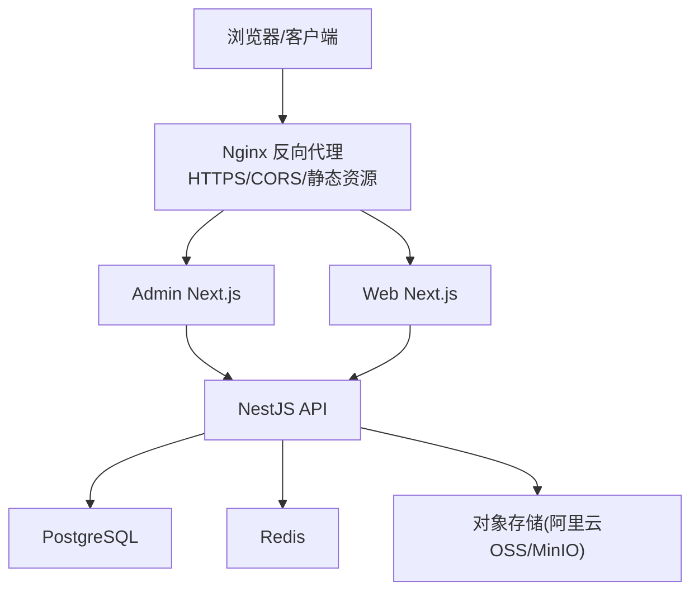

**图表来源** 
- [infra/docker/nginx/tzj.conf](file://infra/docker/nginx/tzj.conf)
- [apps/api/src/main.ts](file://apps/api/src/main.ts)
- [apps/admin/src/app/layout.tsx](file://apps/admin/src/app/layout.tsx)
- [apps/web/src/app/[locale]/layout.tsx](file://apps/web/src/app/[locale]/layout.tsx)

**章节来源**
- [infra/docker/nginx/tzj.conf](file://infra/docker/nginx/tzj.conf)
- [apps/api/src/main.ts](file://apps/api/src/main.ts)

## 核心组件
- 认证与Token：JWT签发、验证、刷新与过期处理；网关守卫与策略集成。
- 权限模型：RBAC角色与权限、角色继承、动态权限控制与装饰器校验。
- 输入与输出：请求体校验、内容清洗、XSS防护与SQL注入防护。
- 网络安全：强制HTTPS、CORS白名单、跨域与Cookie安全属性。
- 数据安全：敏感字段加密、密钥管理与传输加密。
- 审计与监控：请求ID、操作审计、访问日志与异常告警。
- 访问控制：IP封禁、频率限制、DDoS缓解策略。

**章节来源**
- [apps/api/src/auth/auth.controller.ts](file://apps/api/src/auth/auth.controller.ts)
- [apps/api/src/auth/auth.service.ts](file://apps/api/src/auth/auth.service.ts)
- [apps/api/src/auth/guards/jwt-auth.guard.ts](file://apps/api/src/auth/guards/jwt-auth.guard.ts)
- [apps/api/src/auth/guards/roles.guard.ts](file://apps/api/src/auth/guards/roles.guard.ts)
- [apps/api/src/auth/strategies/jwt.strategy.ts](file://apps/api/src/auth/strategies/jwt.strategy.ts)
- [apps/api/src/access/permissions.ts](file://apps/api/src/access/permissions.ts)
- [apps/api/src/access/roles.service.ts](file://apps/api/src/access/roles.service.ts)
- [apps/api/src/common/utils/sanitize.ts](file://apps/api/src/common/utils/sanitize.ts)
- [apps/api/src/common/middleware/request-id.middleware.ts](file://apps/api/src/common/middleware/request-id.middleware.ts)
- [apps/api/src/common/interceptors/audit.interceptor.ts](file://apps/api/src/common/interceptors/audit.interceptor.ts)
- [apps/api/src/security/ip-ban.guard.ts](file://apps/api/src/security/ip-ban.guard.ts)
- [apps/api/src/security/ip-ban.service.ts](file://apps/api/src/security/ip-ban.service.ts)
- [infra/docker/nginx/tzj.conf](file://infra/docker/nginx/tzj.conf)
- [infra/docker/nginx/snippets/ssl.conf](file://infra/docker/nginx/snippets/ssl.conf)

## 架构总览
下图展示从客户端到API的认证与授权流程，包括JWT校验、角色/权限检查、审计与IP封禁拦截。

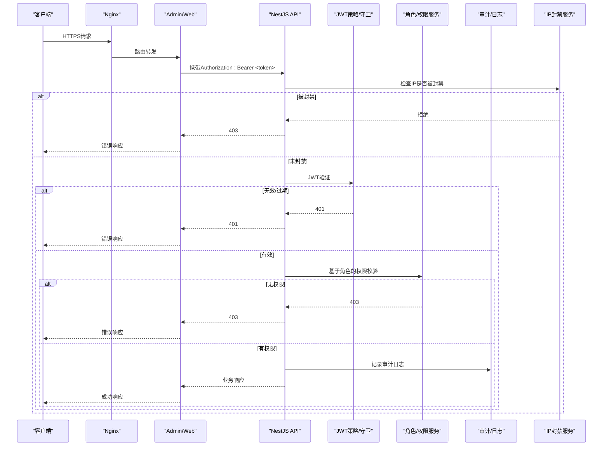

**图表来源** 
- [apps/api/src/auth/guards/jwt-auth.guard.ts](file://apps/api/src/auth/guards/jwt-auth.guard.ts)
- [apps/api/src/auth/strategies/jwt.strategy.ts](file://apps/api/src/auth/strategies/jwt.strategy.ts)
- [apps/api/src/auth/guards/roles.guard.ts](file://apps/api/src/auth/guards/roles.guard.ts)
- [apps/api/src/security/ip-ban.guard.ts](file://apps/api/src/security/ip-ban.guard.ts)
- [apps/api/src/common/interceptors/audit.interceptor.ts](file://apps/api/src/common/interceptors/audit.interceptor.ts)

## 详细组件分析

### 认证与JWT机制
- 登录与签发：控制器接收凭据，服务层校验用户并签发JWT（含用户标识、角色、权限集）。
- 令牌验证：全局守卫解析Authorization头，策略层验签并填充当前用户上下文。
- 刷新与过期：前端维护刷新逻辑，服务端支持刷新接口或短效Token+刷新Token组合。
- 会话控制：无状态JWT为主，必要时结合Redis黑名单或短期会话。

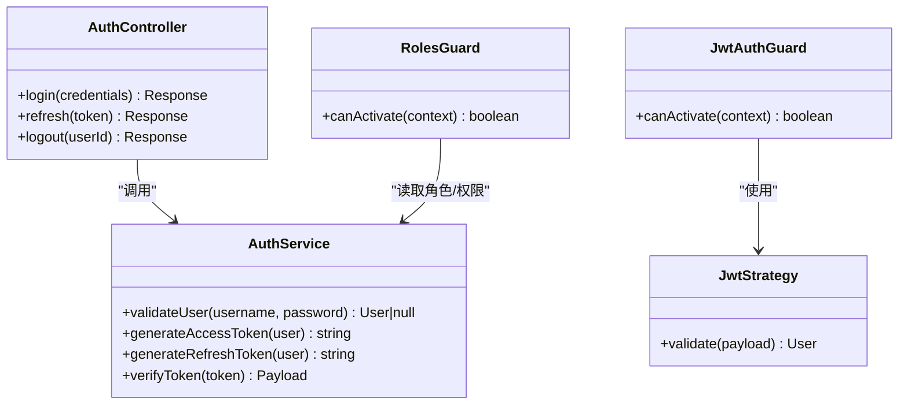

**图表来源** 
- [apps/api/src/auth/auth.controller.ts](file://apps/api/src/auth/auth.controller.ts)
- [apps/api/src/auth/auth.service.ts](file://apps/api/src/auth/auth.service.ts)
- [apps/api/src/auth/strategies/jwt.strategy.ts](file://apps/api/src/auth/strategies/jwt.strategy.ts)
- [apps/api/src/auth/guards/jwt-auth.guard.ts](file://apps/api/src/auth/guards/jwt-auth.guard.ts)
- [apps/api/src/auth/guards/roles.guard.ts](file://apps/api/src/auth/guards/roles.guard.ts)

**章节来源**
- [apps/api/src/auth/auth.controller.ts](file://apps/api/src/auth/auth.controller.ts)
- [apps/api/src/auth/auth.service.ts](file://apps/api/src/auth/auth.service.ts)
- [apps/api/src/auth/strategies/jwt.strategy.ts](file://apps/api/src/auth/strategies/jwt.strategy.ts)
- [apps/api/src/auth/guards/jwt-auth.guard.ts](file://apps/api/src/auth/guards/jwt-auth.guard.ts)
- [apps/api/src/auth/guards/roles.guard.ts](file://apps/api/src/auth/guards/roles.guard.ts)

### Token管理与前端会话
- 前端存储：建议HttpOnly Cookie或内存存储，避免LocalStorage长期保存敏感Token。
- 自动刷新：在请求拦截器中检测过期并刷新，失败则跳转登录。
- 会话清理：登出时清除本地Token与服务端黑名单（可选）。

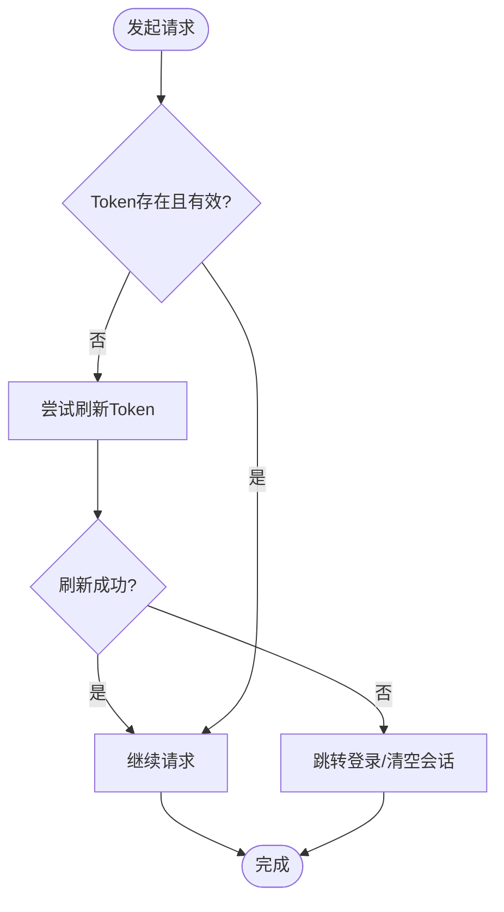

**图表来源** 
- [apps/admin/src/lib/tokenRefresh.ts](file://apps/admin/src/lib/tokenRefresh.ts)
- [apps/admin/src/components/session.tsx](file://apps/admin/src/components/session.tsx)

**章节来源**
- [apps/admin/src/lib/tokenRefresh.ts](file://apps/admin/src/lib/tokenRefresh.ts)
- [apps/admin/src/components/session.tsx](file://apps/admin/src/components/session.tsx)

### RBAC权限模型与动态控制
- 角色与权限：通过装饰器声明所需权限，守卫在服务层校验。
- 角色继承：父角色包含子角色权限，简化权限分配。
- 动态权限：根据资源维度（如文档、客户）进行细粒度控制。

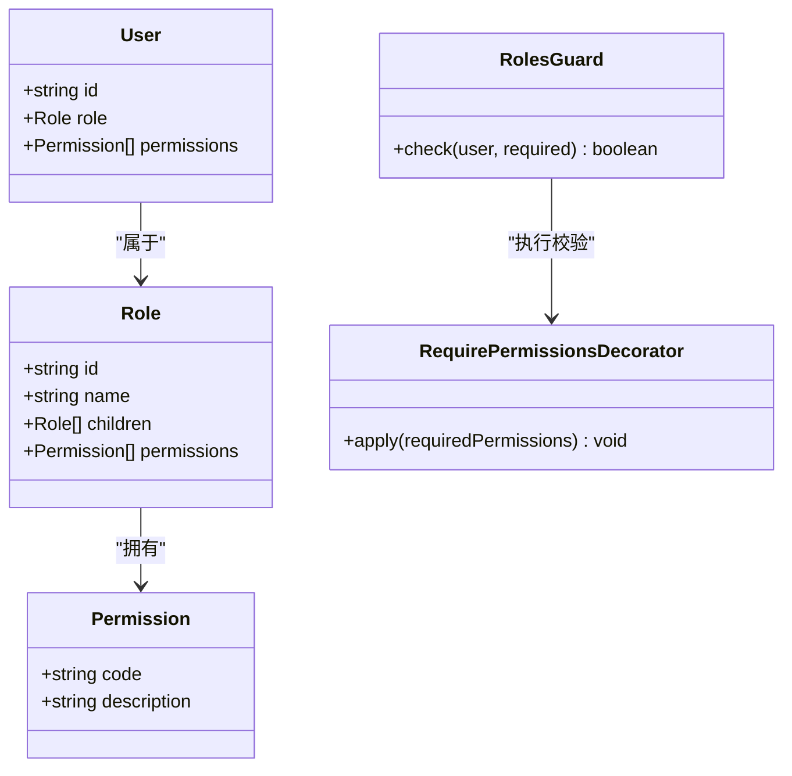

**图表来源** 
- [apps/api/src/access/permissions.ts](file://apps/api/src/access/permissions.ts)
- [apps/api/src/access/roles.service.ts](file://apps/api/src/access/roles.service.ts)
- [apps/api/src/auth/decorators/require-permissions.decorator.ts](file://apps/api/src/auth/decorators/require-permissions.decorator.ts)
- [apps/api/src/auth/guards/roles.guard.ts](file://apps/api/src/auth/guards/roles.guard.ts)

**章节来源**
- [apps/api/src/access/permissions.ts](file://apps/api/src/access/permissions.ts)
- [apps/api/src/access/roles.service.ts](file://apps/api/src/access/roles.service.ts)
- [apps/api/src/auth/decorators/require-permissions.decorator.ts](file://apps/api/src/auth/decorators/require-permissions.decorator.ts)
- [apps/api/src/auth/guards/roles.guard.ts](file://apps/api/src/auth/guards/roles.guard.ts)

### 输入验证、SQL注入与XSS防护
- 输入验证：统一DTO与管道校验，拒绝非法参数。
- SQL注入防护：ORM参数化查询，禁止拼接SQL。
- XSS防护：输出前清洗HTML，禁用危险标签与事件处理器。

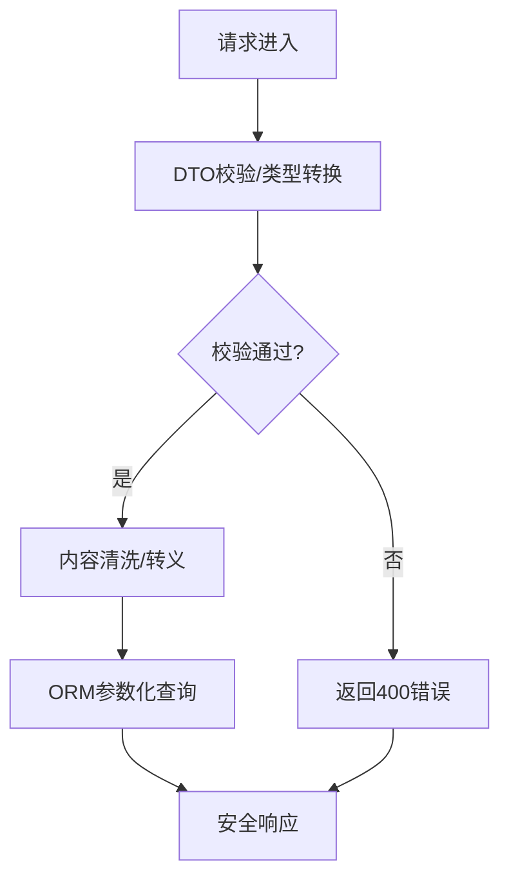

**图表来源** 
- [apps/api/src/common/utils/sanitize.ts](file://apps/api/src/common/utils/sanitize.ts)
- [apps/api/src/prisma/schema.prisma](file://apps/api/src/prisma/schema.prisma)

**章节来源**
- [apps/api/src/common/utils/sanitize.ts](file://apps/api/src/common/utils/sanitize.ts)
- [apps/api/src/prisma/schema.prisma](file://apps/api/src/prisma/schema.prisma)

### 网络安全配置（HTTPS与CORS）
- HTTPS强制：Nginx启用TLS证书与强密码套件，HTTP重定向至HTTPS。
- CORS策略：限定允许源、方法与头部，最小化暴露面。
- Cookie安全：Secure、SameSite、HttpOnly属性设置。

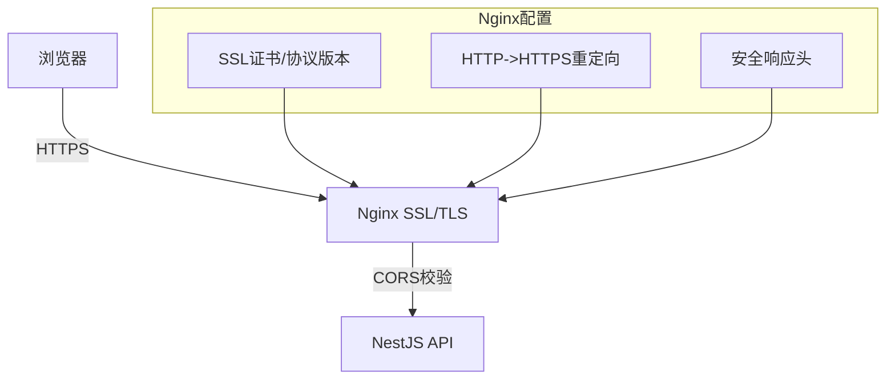

**图表来源** 
- [infra/docker/nginx/tzj.conf](file://infra/docker/nginx/tzj.conf)
- [infra/docker/nginx/snippets/ssl.conf](file://infra/docker/nginx/snippets/ssl.conf)
- [infra/docker/nginx/templates/tzj.conf.template](file://infra/docker/nginx/templates/tzj.conf.template)

**章节来源**
- [infra/docker/nginx/tzj.conf](file://infra/docker/nginx/tzj.conf)
- [infra/docker/nginx/snippets/ssl.conf](file://infra/docker/nginx/snippets/ssl.conf)
- [infra/docker/nginx/templates/tzj.conf.template](file://infra/docker/nginx/templates/tzj.conf.template)

### 敏感数据加密与密钥管理
- 传输加密：全链路HTTPS，避免明文传输。
- 存储加密：敏感字段（如密码、密钥）使用哈希或对称加密存储。
- 密钥管理：环境变量与密钥管理服务隔离，禁止硬编码。

**章节来源**
- [apps/api/src/common/crypto/secrets-crypto.ts](file://apps/api/src/common/crypto/secrets-crypto.ts)

### 日志审计与安全监控
- 请求ID：贯穿请求链路，便于追踪。
- 审计拦截器：记录关键操作、用户、IP、时间戳与结果。
- 异常过滤：统一错误格式与脱敏。

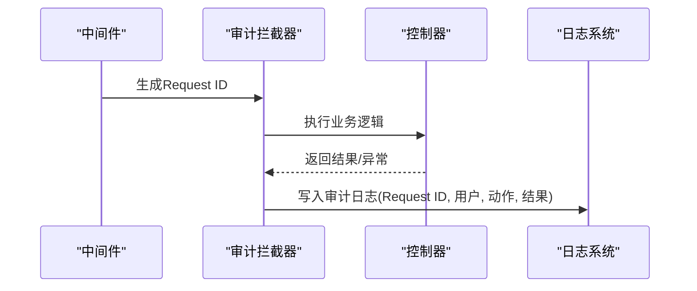

**图表来源** 
- [apps/api/src/common/middleware/request-id.middleware.ts](file://apps/api/src/common/middleware/request-id.middleware.ts)
- [apps/api/src/common/interceptors/audit.interceptor.ts](file://apps/api/src/common/interceptors/audit.interceptor.ts)

**章节来源**
- [apps/api/src/common/middleware/request-id.middleware.ts](file://apps/api/src/common/middleware/request-id.middleware.ts)
- [apps/api/src/common/interceptors/audit.interceptor.ts](file://apps/api/src/common/interceptors/audit.interceptor.ts)

### IP封禁、频率限制与DDoS防护
- IP封禁：网关层或服务层检查黑名单，快速拒绝恶意IP。
- 频率限制：按IP/用户限流，防止暴力破解与滥用。
- DDoS防护：Nginx限流、连接数限制、WAF与云厂商防护联动。

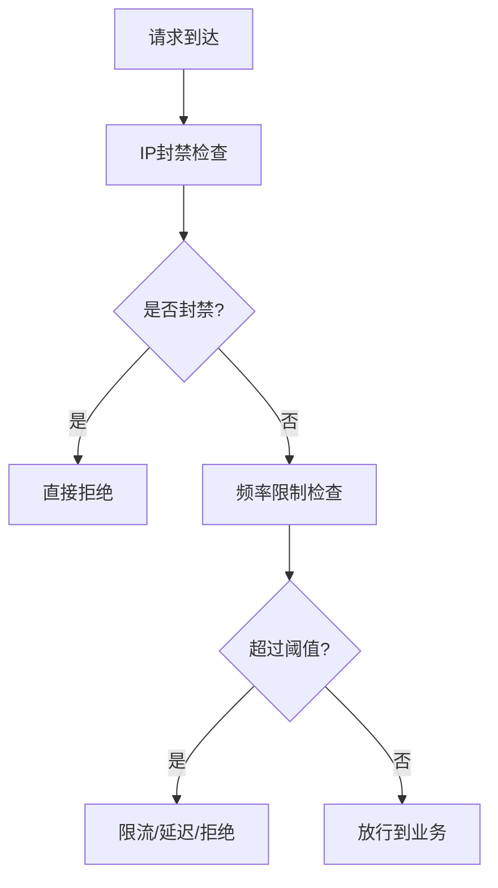

**图表来源** 
- [apps/api/src/security/ip-ban.guard.ts](file://apps/api/src/security/ip-ban.guard.ts)
- [apps/api/src/security/ip-ban.service.ts](file://apps/api/src/security/ip-ban.service.ts)
- [apps/api/src/security/security.controller.ts](file://apps/api/src/security/security.controller.ts)

**章节来源**
- [apps/api/src/security/ip-ban.guard.ts](file://apps/api/src/security/ip-ban.guard.ts)
- [apps/api/src/security/ip-ban.service.ts](file://apps/api/src/security/ip-ban.service.ts)
- [apps/api/src/security/security.controller.ts](file://apps/api/src/security/security.controller.ts)

### WebSocket实时通信安全（聊天）
- 握手认证：WebSocket连接前校验JWT或临时令牌。
- 房间权限：按角色/资源维度控制加入与消息发送。
- 消息审计：记录关键事件与异常。

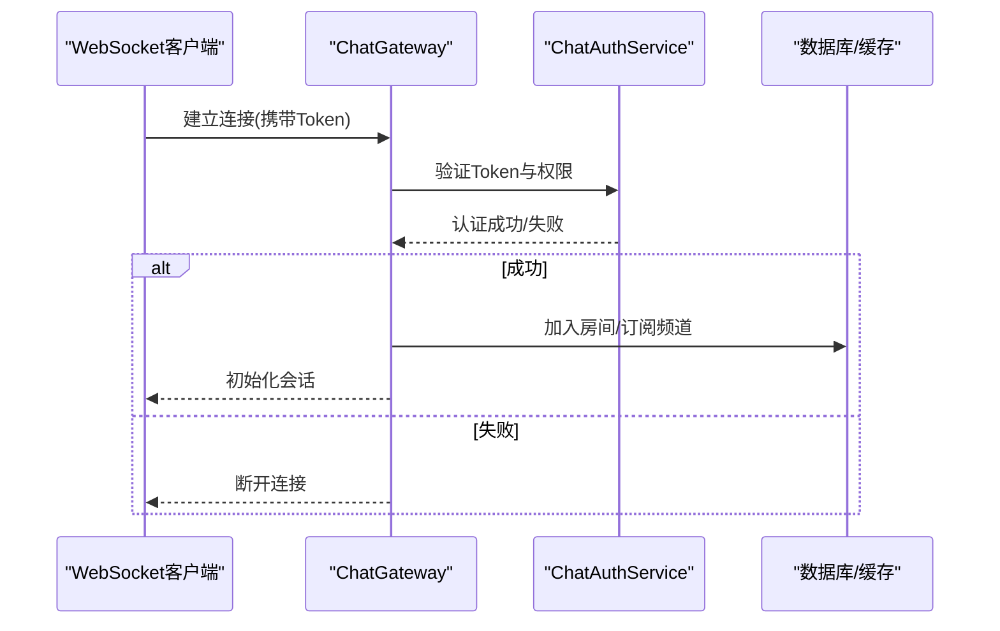

**图表来源** 
- [apps/api/src/support/chat.gateway.ts](file://apps/api/src/support/chat.gateway.ts)
- [apps/api/src/support/chat-auth.service.ts](file://apps/api/src/support/chat-auth.service.ts)

**章节来源**
- [apps/api/src/support/chat.gateway.ts](file://apps/api/src/support/chat.gateway.ts)
- [apps/api/src/support/chat-auth.service.ts](file://apps/api/src/support/chat-auth.service.ts)

## 依赖关系分析
- 认证模块依赖JWT策略与守卫，权限模块依赖角色服务与装饰器。
- 安全模块依赖IP封禁服务与控制器，审计模块依赖中间件与拦截器。
- 前端依赖Token刷新与会话组件，确保无状态认证与用户体验平衡。

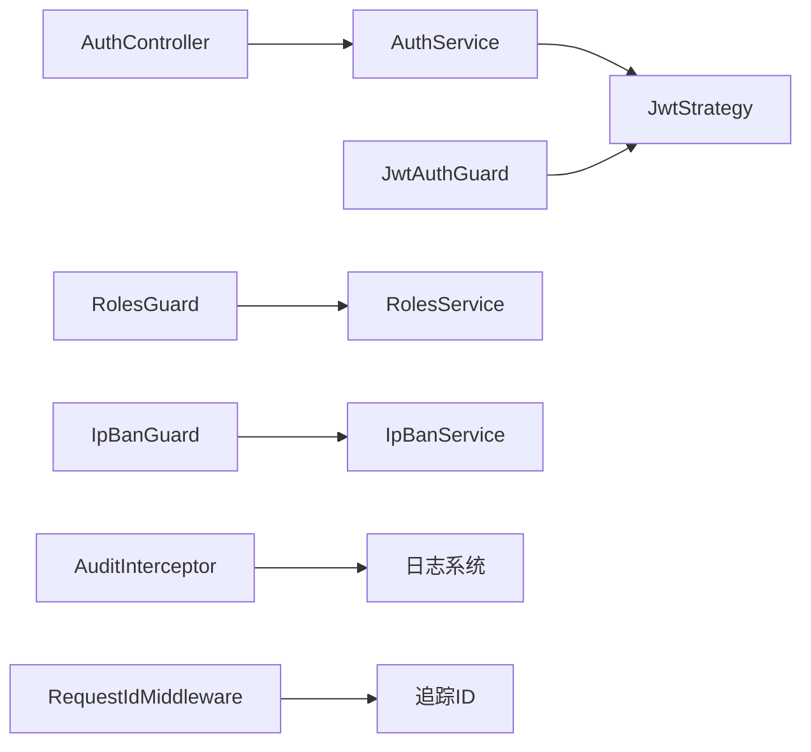

**图表来源** 
- [apps/api/src/auth/auth.controller.ts](file://apps/api/src/auth/auth.controller.ts)
- [apps/api/src/auth/auth.service.ts](file://apps/api/src/auth/auth.service.ts)
- [apps/api/src/auth/strategies/jwt.strategy.ts](file://apps/api/src/auth/strategies/jwt.strategy.ts)
- [apps/api/src/auth/guards/jwt-auth.guard.ts](file://apps/api/src/auth/guards/jwt-auth.guard.ts)
- [apps/api/src/auth/guards/roles.guard.ts](file://apps/api/src/auth/guards/roles.guard.ts)
- [apps/api/src/access/roles.service.ts](file://apps/api/src/access/roles.service.ts)
- [apps/api/src/security/ip-ban.guard.ts](file://apps/api/src/security/ip-ban.guard.ts)
- [apps/api/src/security/ip-ban.service.ts](file://apps/api/src/security/ip-ban.service.ts)
- [apps/api/src/common/interceptors/audit.interceptor.ts](file://apps/api/src/common/interceptors/audit.interceptor.ts)
- [apps/api/src/common/middleware/request-id.middleware.ts](file://apps/api/src/common/middleware/request-id.middleware.ts)

**章节来源**
- [apps/api/src/auth/auth.controller.ts](file://apps/api/src/auth/auth.controller.ts)
- [apps/api/src/auth/auth.service.ts](file://apps/api/src/auth/auth.service.ts)
- [apps/api/src/auth/strategies/jwt.strategy.ts](file://apps/api/src/auth/strategies/jwt.strategy.ts)
- [apps/api/src/auth/guards/jwt-auth.guard.ts](file://apps/api/src/auth/guards/jwt-auth.guard.ts)
- [apps/api/src/auth/guards/roles.guard.ts](file://apps/api/src/auth/guards/roles.guard.ts)
- [apps/api/src/access/roles.service.ts](file://apps/api/src/access/roles.service.ts)
- [apps/api/src/security/ip-ban.guard.ts](file://apps/api/src/security/ip-ban.guard.ts)
- [apps/api/src/security/ip-ban.service.ts](file://apps/api/src/security/ip-ban.service.ts)
- [apps/api/src/common/interceptors/audit.interceptor.ts](file://apps/api/src/common/interceptors/audit.interceptor.ts)
- [apps/api/src/common/middleware/request-id.middleware.ts](file://apps/api/src/common/middleware/request-id.middleware.ts)

## 性能与安全权衡
- JWT无状态减少会话存储压力，但需配合短效Token与刷新机制降低泄露风险。
- 输入校验与内容清洗增加CPU开销，应结合缓存与异步处理。
- 审计日志可能影响吞吐，建议分级采样与异步落盘。
- 频率限制与IP封禁需在网关层优先执行，减少后端负载。

[本节为通用指导，不直接分析具体文件]

## 故障排查指南
- 认证失败：检查JWT签名、过期时间、Authorization头格式与刷新流程。
- 权限不足：确认角色继承与权限码一致性，查看装饰器与守卫配置。
- 403/429：检查IP封禁列表与频率限制阈值，定位来源IP与请求模式。
- 审计缺失：确认中间件与拦截器注册顺序，检查日志输出路径与权限。

**章节来源**
- [apps/api/src/auth/auth.controller.ts](file://apps/api/src/auth/auth.controller.ts)
- [apps/api/src/auth/auth.service.ts](file://apps/api/src/auth/auth.service.ts)
- [apps/api/src/security/security.controller.ts](file://apps/api/src/security/security.controller.ts)
- [apps/api/src/common/interceptors/audit.interceptor.ts](file://apps/api/src/common/interceptors/audit.interceptor.ts)

## 结论
TZJ网站的安全架构围绕JWT认证、RBAC权限、输入校验、网络安全、数据加密、审计监控与访问控制构建，形成端到端的防护体系。通过网关层与后端协同、前端会话管理与自动化刷新，兼顾安全性与用户体验。建议持续完善频率限制、DDoS防护与密钥管理，强化威胁情报与应急响应能力。

[本节为总结性内容，不直接分析具体文件]

## 附录：最佳实践清单
- 认证与会话
  - 使用短效JWT+刷新Token，服务端支持黑名单或短期会话。
  - 前端避免在LocalStorage长期存储敏感Token，优先HttpOnly Cookie。
- 权限与角色
  - 明确角色继承关系，最小权限原则，定期审计权限分配。
  - 使用装饰器与守卫集中校验，避免分散逻辑。
- 输入与输出
  - 严格DTO校验，输出前清洗HTML，禁用危险标签与事件。
  - 使用ORM参数化查询，禁止字符串拼接SQL。
- 网络安全
  - 强制HTTPS，启用强密码套件与HSTS。
  - CORS仅允许必要源与方法，设置Cookie安全属性。
- 数据安全
  - 敏感字段加密存储，密钥与环境变量隔离。
- 审计与监控
  - 全链路Request ID，关键操作审计，异常统一格式化。
- 访问控制
  - 网关层实施IP封禁与频率限制，联动WAF与云防护。

[本节为通用指导，不直接分析具体文件]