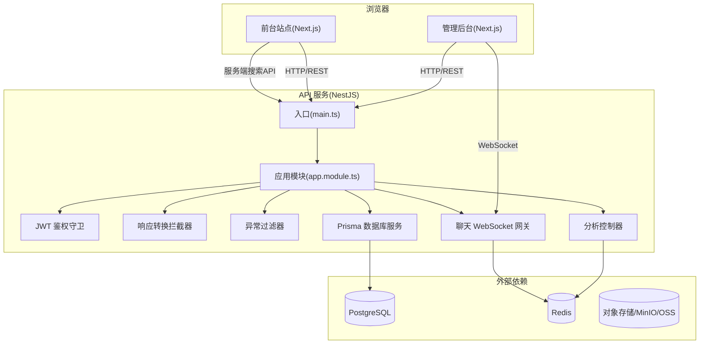
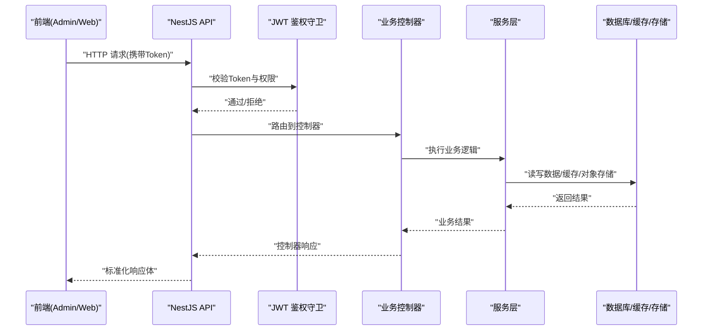
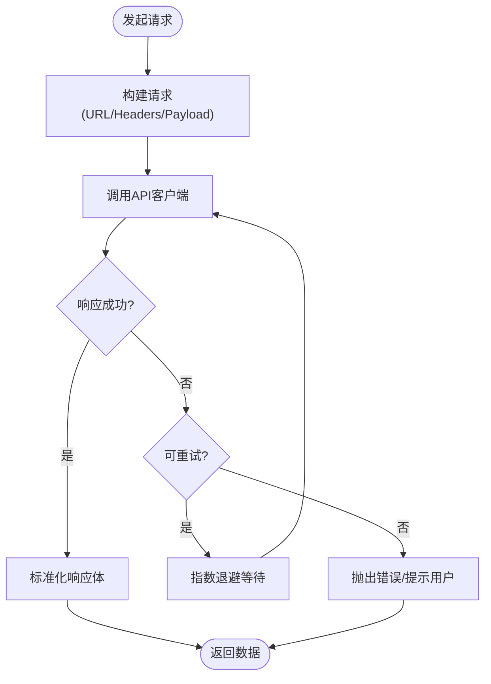
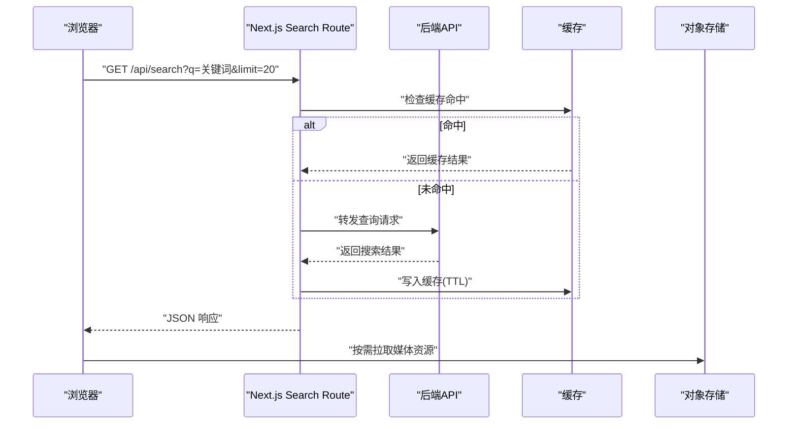
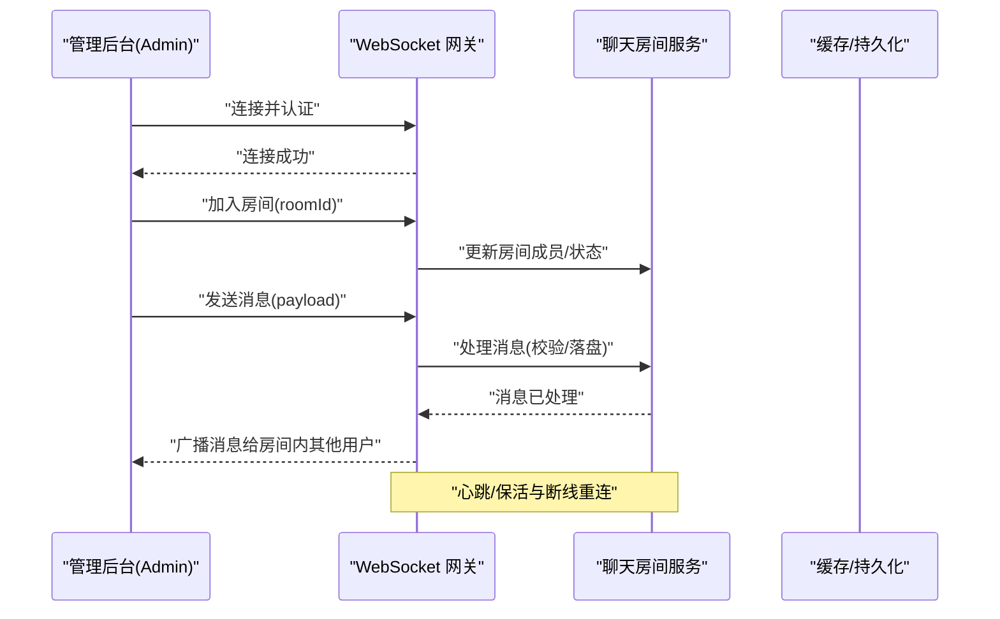
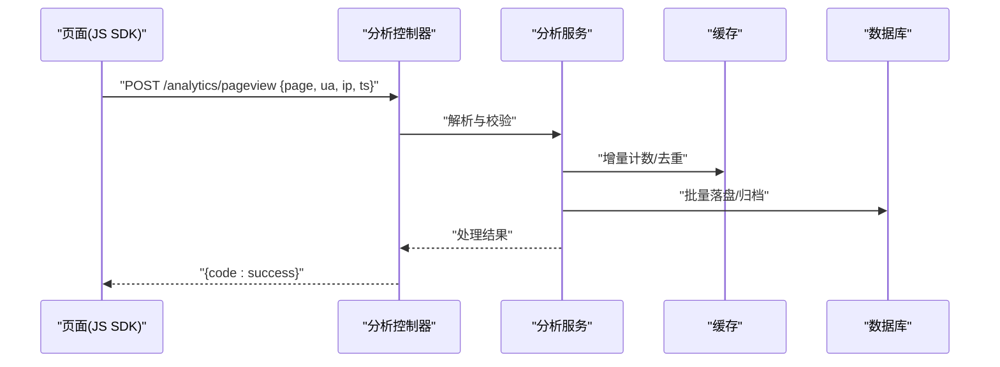
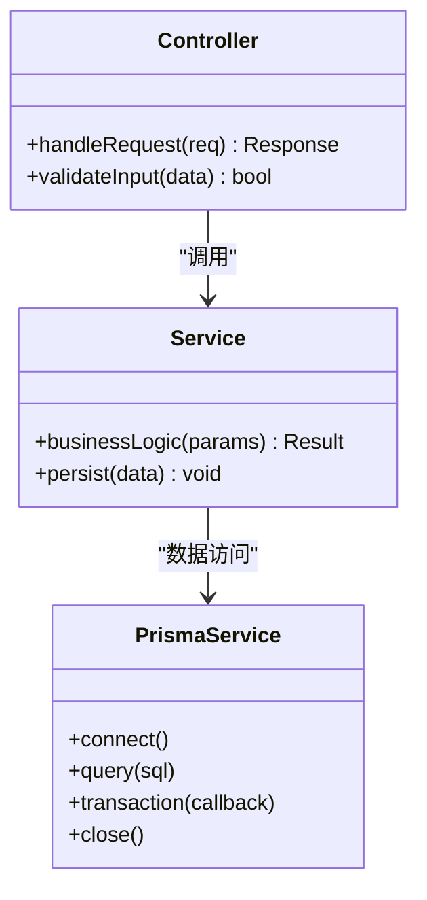
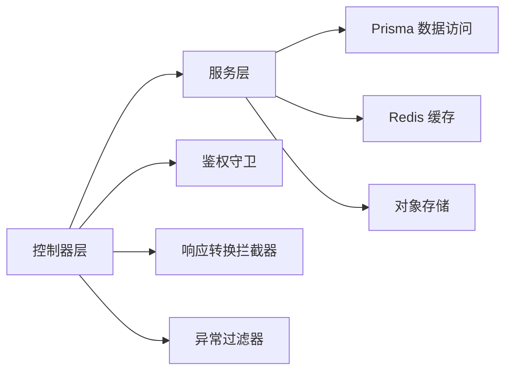

# 数据流设计

<cite>
**本文引用的文件**   
- [apps/api/src/main.ts](file://apps/api/src/main.ts)
- [apps/api/src/app.module.ts](file://apps/api/src/app.module.ts)
- [apps/api/src/auth/guards/jwt-auth.guard.ts](file://apps/api/src/auth/guards/jwt-auth.guard.ts)
- [apps/api/src/common/interceptors/transform.interceptor.ts](file://apps/api/src/common/interceptors/transform.interceptor.ts)
- [apps/api/src/common/filters/http-exception.filter.ts](file://apps/api/src/common/filters/http-exception.filter.ts)
- [apps/api/src/analytics/analytics.controller.ts](file://apps/api/src/analytics/analytics.controller.ts)
- [apps/api/src/analytics/analytics.service.ts](file://apps/api/src/analytics/analytics.service.ts)
- [apps/api/src/support/chat.gateway.ts](file://apps/api/src/support/chat.gateway.ts)
- [apps/api/src/support/chat-room.service.ts](file://apps/api/src/support/chat-room.service.ts)
- [apps/api/src/prisma/prisma.service.ts](file://apps/api/src/prisma/prisma.service.ts)
- [apps/admin/src/lib/apiClient.ts](file://apps/admin/src/lib/apiClient.ts)
- [apps/admin/src/lib/fetch-retry.ts](file://apps/admin/src/lib/fetch-retry.ts)
- [apps/admin/src/features/chat/useChatSocket.ts](file://apps/admin/src/features/chat/useChatSocket.ts)
- [apps/web/src/lib/api.ts](file://apps/web/src/lib/api.ts)
- [apps/web/src/app/api/search/route.ts](file://apps/web/src/app/api/search/route.ts)
</cite>

## 目录
1. [引言](#引言)
2. [项目结构](#项目结构)
3. [核心组件](#核心组件)
4. [架构总览](#架构总览)
5. [详细组件分析](#详细组件分析)
6. [依赖关系分析](#依赖关系分析)
7. [性能考量](#性能考量)
8. [故障排查指南](#故障排查指南)
9. [结论](#结论)
10. [附录](#附录)

## 引言
本文件面向开发者与架构师，系统性阐述 TZJ 网站的数据流设计与传输协议。内容涵盖前后端交互模式、请求响应格式与序列化策略；实时数据同步机制（WebSocket）与事件驱动架构；缓存策略、本地存储与离线支持；数据校验流程、错误处理与重试机制；大数据量处理、分页查询与搜索优化；以及数据一致性与性能优化的实践建议。文档以仓库实际代码为依据，辅以可视化图示帮助理解。

## 项目结构
TZJ 采用多应用（Monorepo）组织：
- apps/api：NestJS 后端服务，提供 REST API、WebSocket 网关、鉴权、审计、媒体、设置等模块。
- apps/admin：Next.js 管理后台，通过 BFF/API Client 调用后端接口，包含聊天 WebSocket 客户端。
- apps/web：Next.js 前台站点，提供页面渲染、搜索 API、媒体访问与前端能力。
- infra：Docker/Nginx/Redis/Postgres/MinIO 等基础设施配置。
- packages：共享包（主题、类型、UI 等）。

**图表来源** 
- [apps/api/src/main.ts](file://apps/api/src/main.ts)
- [apps/api/src/app.module.ts](file://apps/api/src/app.module.ts)
- [apps/api/src/auth/guards/jwt-auth.guard.ts](file://apps/api/src/auth/guards/jwt-auth.guard.ts)
- [apps/api/src/common/interceptors/transform.interceptor.ts](file://apps/api/src/common/interceptors/transform.interceptor.ts)
- [apps/api/src/common/filters/http-exception.filter.ts](file://apps/api/src/common/filters/http-exception.filter.ts)
- [apps/api/src/analytics/analytics.controller.ts](file://apps/api/src/analytics/analytics.controller.ts)
- [apps/api/src/support/chat.gateway.ts](file://apps/api/src/support/chat.gateway.ts)
- [apps/api/src/prisma/prisma.service.ts](file://apps/api/src/prisma/prisma.service.ts)

**章节来源**
- [apps/api/src/main.ts](file://apps/api/src/main.ts)
- [apps/api/src/app.module.ts](file://apps/api/src/app.module.ts)

## 核心组件
- HTTP 层
  - NestJS 主入口负责全局中间件、拦截器、过滤器与路由注册。
  - 统一响应转换拦截器对返回体进行标准化封装。
  - 全局异常过滤器捕获并规范化错误响应。
  - JWT 鉴权守卫用于受保护接口的身份验证与权限控制。
- 业务层
  - 分析模块提供页面浏览采集、访客识别等接口。
  - 聊天模块提供基于 WebSocket 的实时消息与会话能力。
- 数据层
  - Prisma 服务统一管理数据库连接与事务。
  - 缓存与对象存储由外部依赖提供（Redis、MinIO/OSS）。

**章节来源**
- [apps/api/src/common/interceptors/transform.interceptor.ts](file://apps/api/src/common/interceptors/transform.interceptor.ts)
- [apps/api/src/common/filters/http-exception.filter.ts](file://apps/api/src/common/filters/http-exception.filter.ts)
- [apps/api/src/auth/guards/jwt-auth.guard.ts](file://apps/api/src/auth/guards/jwt-auth.guard.ts)
- [apps/api/src/analytics/analytics.controller.ts](file://apps/api/src/analytics/analytics.controller.ts)
- [apps/api/src/support/chat.gateway.ts](file://apps/api/src/support/chat.gateway.ts)
- [apps/api/src/prisma/prisma.service.ts](file://apps/api/src/prisma/prisma.service.ts)

## 架构总览
整体数据流遵循“前端应用 → API 网关 → 业务控制器 → 服务层 → 数据/缓存/存储”的分层模型，并通过统一的鉴权、转换与异常处理保障一致性。

**图表来源** 
- [apps/api/src/auth/guards/jwt-auth.guard.ts](file://apps/api/src/auth/guards/jwt-auth.guard.ts)
- [apps/api/src/common/interceptors/transform.interceptor.ts](file://apps/api/src/common/interceptors/transform.interceptor.ts)
- [apps/api/src/common/filters/http-exception.filter.ts](file://apps/api/src/common/filters/http-exception.filter.ts)

## 详细组件分析

### 前端 API 客户端与重试机制（Admin）
- API 客户端集中封装请求方法，统一注入认证头、基础路径与错误处理。
- 重试机制在网络失败或特定状态码时自动重试，避免瞬时抖动影响用户体验。
- 与后端交互遵循一致的请求/响应约定，便于跨模块复用。

**图表来源** 
- [apps/admin/src/lib/apiClient.ts](file://apps/admin/src/lib/apiClient.ts)
- [apps/admin/src/lib/fetch-retry.ts](file://apps/admin/src/lib/fetch-retry.ts)

**章节来源**
- [apps/admin/src/lib/apiClient.ts](file://apps/admin/src/lib/apiClient.ts)
- [apps/admin/src/lib/fetch-retry.ts](file://apps/admin/src/lib/fetch-retry.ts)

### 前台站点 API 与搜索
- 前台站点通过 Next.js API Routes 暴露轻量级服务端接口，如搜索聚合与推荐。
- 搜索接口通常组合多个数据源（数据库、缓存、搜索引擎），返回结构化结果。
- 静态资源与媒体通过专用路由代理至对象存储，提升加载性能。

**图表来源** 
- [apps/web/src/app/api/search/route.ts](file://apps/web/src/app/api/search/route.ts)

**章节来源**
- [apps/web/src/lib/api.ts](file://apps/web/src/lib/api.ts)
- [apps/web/src/app/api/search/route.ts](file://apps/web/src/app/api/search/route.ts)

### 实时通信：WebSocket 聊天
- 后端使用 NestJS Gateway 实现 WebSocket 通道，支持房间、消息广播与在线状态。
- 前端通过 Socket 钩子建立连接、订阅频道、发送与接收消息，并在断线时重连。
- 典型事件包括：加入房间、发送消息、收到消息、在线人数变化等。

**图表来源** 
- [apps/api/src/support/chat.gateway.ts](file://apps/api/src/support/chat.gateway.ts)
- [apps/api/src/support/chat-room.service.ts](file://apps/api/src/support/chat-room.service.ts)
- [apps/admin/src/features/chat/useChatSocket.ts](file://apps/admin/src/features/chat/useChatSocket.ts)

**章节来源**
- [apps/api/src/support/chat.gateway.ts](file://apps/api/src/support/chat.gateway.ts)
- [apps/api/src/support/chat-room.service.ts](file://apps/api/src/support/chat-room.service.ts)
- [apps/admin/src/features/chat/useChatSocket.ts](file://apps/admin/src/features/chat/useChatSocket.ts)

### 分析数据采集
- 分析控制器提供页面浏览与访客识别接口，常用于埋点上报。
- 服务层对数据进行清洗、去重与聚合，写入缓存或数据库，供报表与分析面板展示。

**图表来源** 
- [apps/api/src/analytics/analytics.controller.ts](file://apps/api/src/analytics/analytics.controller.ts)
- [apps/api/src/analytics/analytics.service.ts](file://apps/api/src/analytics/analytics.service.ts)

**章节来源**
- [apps/api/src/analytics/analytics.controller.ts](file://apps/api/src/analytics/analytics.controller.ts)
- [apps/api/src/analytics/analytics.service.ts](file://apps/api/src/analytics/analytics.service.ts)

### 数据模型与数据库访问
- Prisma 服务作为数据访问抽象，统一连接管理与事务边界。
- 控制器与服务层通过 DTO 定义输入输出结构，确保类型安全与校验。

**图表来源** 
- [apps/api/src/prisma/prisma.service.ts](file://apps/api/src/prisma/prisma.service.ts)

**章节来源**
- [apps/api/src/prisma/prisma.service.ts](file://apps/api/src/prisma/prisma.service.ts)

## 依赖关系分析
- 模块耦合
  - 控制器依赖服务层，服务层依赖数据访问（Prisma）、缓存与对象存储。
  - 鉴权守卫与拦截器横切关注点贯穿所有受保护接口。
- 外部依赖
  - 数据库（PostgreSQL）、缓存（Redis）、对象存储（MinIO/OSS）为关键外部系统。
  - 第三方集成（验证码、邮件、地理定位等）通过适配器接入。

**图表来源** 
- [apps/api/src/app.module.ts](file://apps/api/src/app.module.ts)
- [apps/api/src/auth/guards/jwt-auth.guard.ts](file://apps/api/src/auth/guards/jwt-auth.guard.ts)
- [apps/api/src/common/interceptors/transform.interceptor.ts](file://apps/api/src/common/interceptors/transform.interceptor.ts)
- [apps/api/src/common/filters/http-exception.filter.ts](file://apps/api/src/common/filters/http-exception.filter.ts)

**章节来源**
- [apps/api/src/app.module.ts](file://apps/api/src/app.module.ts)

## 性能考量
- 缓存策略
  - 热点数据（分析统计、配置、媒体元信息）优先从缓存读取，降低数据库压力。
  - 合理设置 TTL 与失效策略，保证一致性与时效性平衡。
- 分页与限流
  - 列表接口默认分页参数（页码、每页大小），避免一次性返回大量数据。
  - 对高频接口实施限流与防抖，防止滥用与雪崩。
- 搜索优化
  - 前端搜索建议与后端聚合结合，利用缓存与索引加速查询。
  - 复杂查询拆分为并行任务，减少端到端延迟。
- 媒体与静态资源
  - 通过 CDN/对象存储直链加载，减少后端带宽占用。
  - 图片压缩与懒加载，提升首屏性能。
- 连接池与并发
  - 数据库连接池与异步 I/O 最大化吞吐。
  - WebSocket 会话按房间分片，避免单点瓶颈。

[本节为通用指导，不直接分析具体文件]

## 故障排查指南
- 统一异常处理
  - 全局异常过滤器捕获未处理异常，返回标准错误结构，便于前端统一提示。
- 鉴权失败
  - JWT 令牌过期或缺失将触发鉴权守卫拒绝访问，需检查 Token 生成与刷新流程。
- 网络重试
  - 前端重试机制应区分可重试与不可重试错误，避免无限重试导致雪崩。
- 日志与追踪
  - 建议在请求链路中注入唯一 ID，便于跨层追踪问题。
- 常见问题
  - 数据库连接超时：检查连接池配置与慢查询。
  - 缓存穿透/击穿：增加空值缓存与互斥锁。
  - WebSocket 断线：检查心跳与重连策略。

**章节来源**
- [apps/api/src/common/filters/http-exception.filter.ts](file://apps/api/src/common/filters/http-exception.filter.ts)
- [apps/api/src/auth/guards/jwt-auth.guard.ts](file://apps/api/src/auth/guards/jwt-auth.guard.ts)
- [apps/admin/src/lib/fetch-retry.ts](file://apps/admin/src/lib/fetch-retry.ts)

## 结论
TZJ 网站的数据流设计以分层清晰、职责明确为核心，通过统一的鉴权、转换与异常处理保障数据一致性与可观测性。实时通信采用 WebSocket 实现低延迟交互，配合前端重试与缓存策略提升鲁棒性与性能。在生产环境中，建议持续监控关键指标（延迟、错误率、缓存命中率），并结合业务场景优化分页、搜索与媒体加载策略，以获得更优的用户体验与系统稳定性。

[本节为总结性内容，不直接分析具体文件]

## 附录
- 术语说明
  - BFF：Backend for Frontend，面向前端的后端适配层。
  - DTO：Data Transfer Object，数据传输对象，用于接口输入输出校验。
  - TTL：Time To Live，缓存存活时间。
- 最佳实践清单
  - 所有接口均进行输入校验与错误处理。
  - 敏感操作记录审计日志。
  - 对外部依赖调用增加超时与熔断。
  - 前端统一错误提示与用户引导。

[本节为补充信息，不直接分析具体文件]