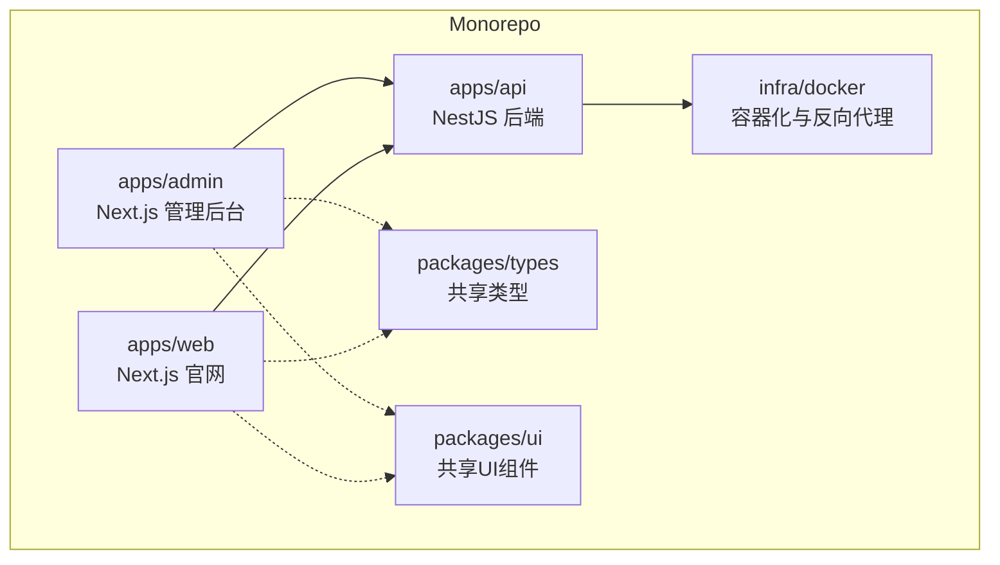
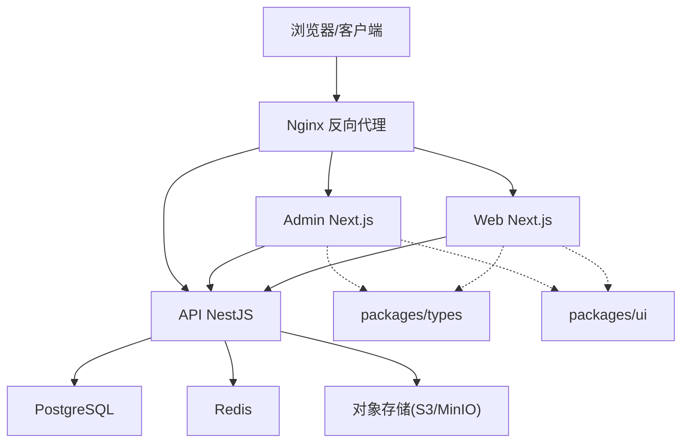
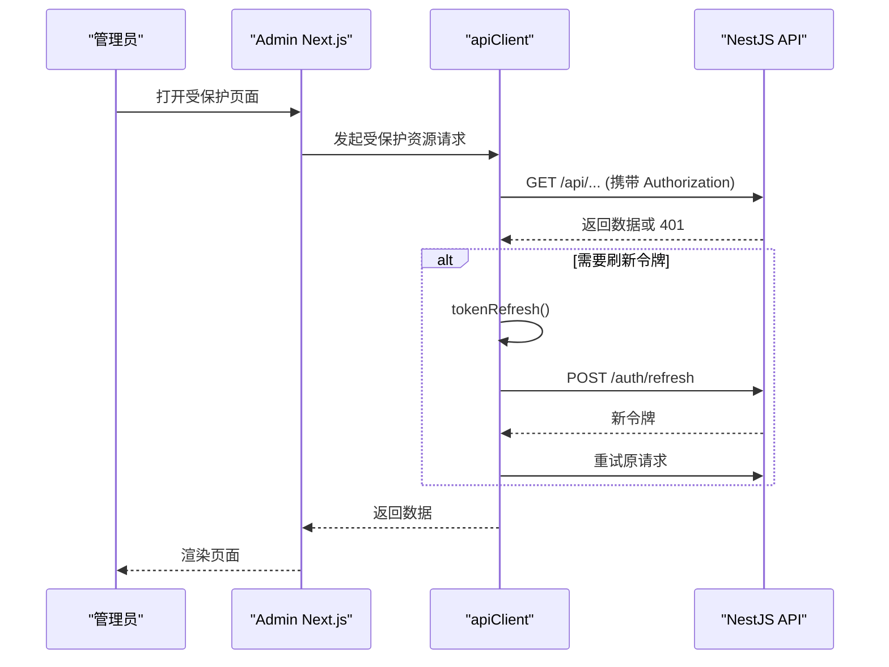
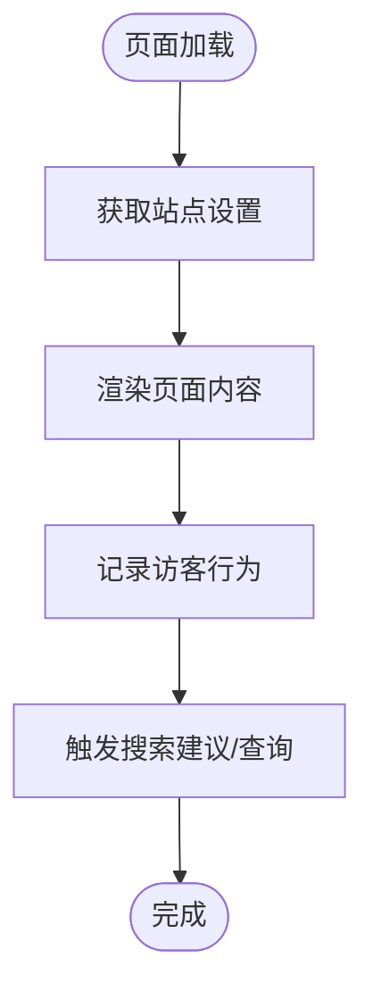
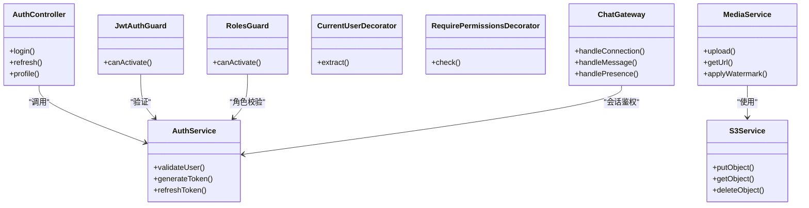
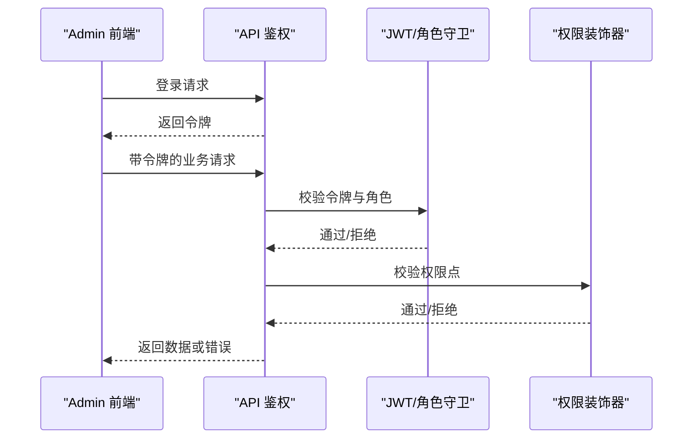
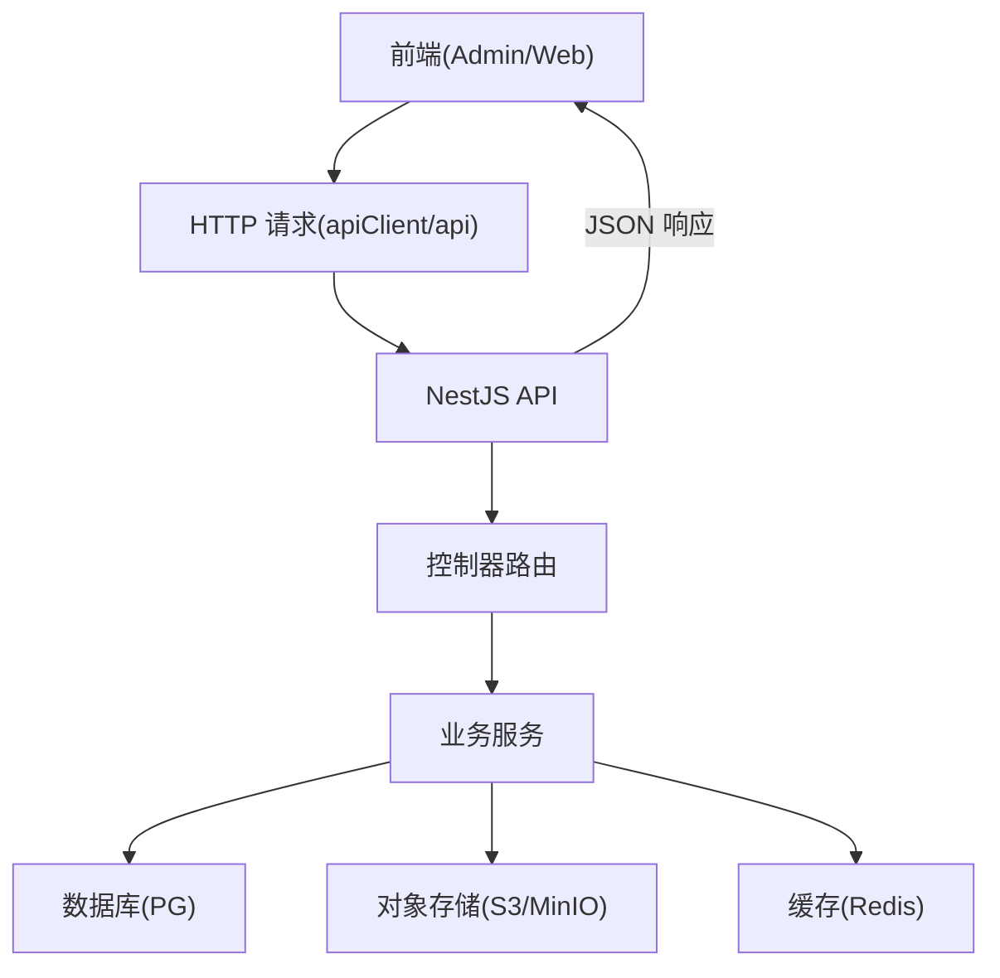
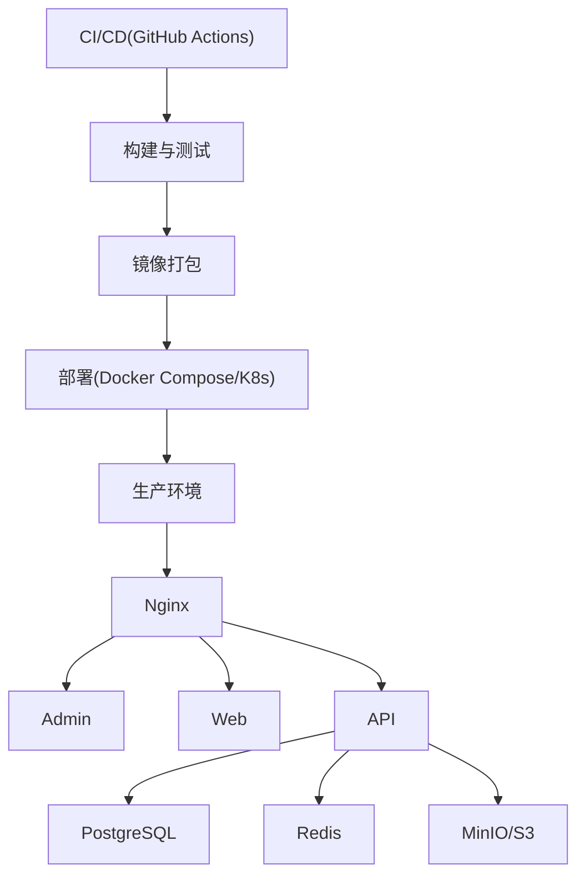
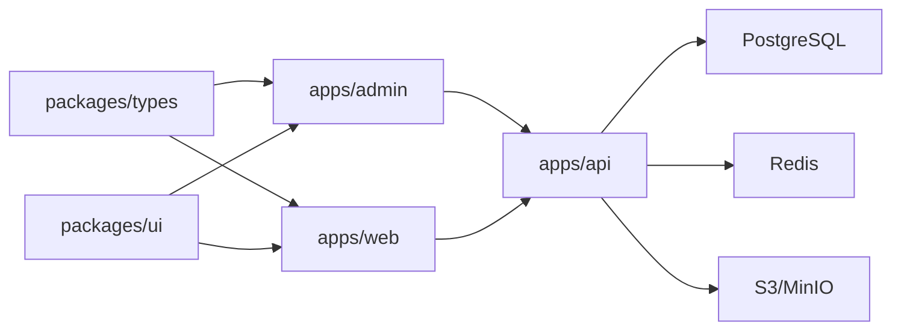

# 系统架构

<cite>
**本文引用的文件**   
- [apps/admin/package.json](file://apps/admin/package.json)
- [apps/admin/next.config.ts](file://apps/admin/next.config.ts)
- [apps/admin/src/app/layout.tsx](file://apps/admin/src/app/layout.tsx)
- [apps/admin/src/app/(dashboard)/layout.tsx](file://apps/admin/src/app/(dashboard)/layout.tsx)
- [apps/admin/src/lib/apiClient.ts](file://apps/admin/src/lib/apiClient.ts)
- [apps/admin/src/lib/auth.ts](file://apps/admin/src/lib/auth.ts)
- [apps/admin/src/lib/tokenRefresh.ts](file://apps/admin/src/lib/tokenRefresh.ts)
- [apps/admin/src/features/access.ts](file://apps/admin/src/features/access.ts)
- [apps/web/package.json](file://apps/web/package.json)
- [apps/web/next.config.ts](file://apps/web/next.config.ts)
- [apps/web/src/app/[locale]/layout.tsx](file://apps/web/src/app/[locale]/layout.tsx)
- [apps/web/src/lib/api.ts](file://apps/web/src/lib/api.ts)
- [apps/web/src/lib/site-settings.ts](file://apps/web/src/lib/site-settings.ts)
- [apps/api/src/main.ts](file://apps/api/src/main.ts)
- [apps/api/src/app.module.ts](file://apps/api/src/app.module.ts)
- [apps/api/src/auth/auth.controller.ts](file://apps/api/src/auth/auth.controller.ts)
- [apps/api/src/auth/auth.service.ts](file://apps/api/src/auth/auth.service.ts)
- [apps/api/src/auth/guards/jwt-auth.guard.ts](file://apps/api/src/auth/guards/jwt-auth.guard.ts)
- [apps/api/src/auth/guards/roles.guard.ts](file://apps/api/src/auth/guards/roles.guard.ts)
- [apps/api/src/auth/decorators/current-user.decorator.ts](file://apps/api/src/auth/decorators/current-user.decorator.ts)
- [apps/api/src/auth/decorators/require-permissions.decorator.ts](file://apps/api/src/auth/decorators/require-permissions.decorator.ts)
- [apps/api/src/config/env.validation.ts](file://apps/api/src/config/env.validation.ts)
- [apps/api/src/common/middleware/request-id.middleware.ts](file://apps/api/src/common/middleware/request-id.middleware.ts)
- [apps/api/src/common/interceptors/audit.interceptor.ts](file://apps/api/src/common/interceptors/audit.interceptor.ts)
- [apps/api/src/prisma/prisma.service.ts](file://apps/api/src/prisma/prisma.service.ts)
- [apps/api/src/media/media.service.ts](file://apps/api/src/media/media.service.ts)
- [apps/api/src/storage/s3.service.ts](file://apps/api/src/storage/s3.service.ts)
- [apps/api/src/support/chat.gateway.ts](file://apps/api/src/support/chat.gateway.ts)
- [packages/types/package.json](file://packages/types/package.json)
- [packages/ui/package.json](file://packages/ui/package.json)
- [pnpm-workspace.yaml](file://pnpm-workspace.yaml)
- [turbo.json](file://turbo.json)
- [infra/docker/nginx/tzj.conf](file://infra/docker/nginx/tzj.conf)
- [infra/docker/docker-compose.prod.yml](file://infra/docker/docker-compose.prod.yml)
</cite>

## 目录
1. [简介](#简介)
2. [项目结构](#项目结构)
3. [核心组件](#核心组件)
4. [架构总览](#架构总览)
5. [详细组件分析](#详细组件分析)
6. [依赖关系分析](#依赖关系分析)
7. [性能考量](#性能考量)
8. [故障排查指南](#故障排查指南)
9. [结论](#结论)
10. [附录](#附录)

## 简介
本架构文档面向架构师与高级开发者，系统性阐述 TZJ 网站的三层架构：Admin 管理后台（Next.js）、Web 官网（Next.js）与 API 后端（NestJS）。文档覆盖微服务间通信模式、数据流向与接口规范；Monorepo 组织结构、包管理与共享代码复用机制；认证授权体系、权限控制模型与安全架构；并给出系统边界定义、组件交互图与部署拓扑图。

## 项目结构
仓库采用 pnpm Monorepo + Turborepo 组织方式，前端两个应用与后端 NestJS 服务位于 apps 目录下，公共类型与 UI 组件位于 packages 目录，基础设施与部署脚本位于 infra 目录。

- Monorepo 与工作区
  - pnpm-workspace.yaml 定义工作区与包聚合策略
  - turbo.json 统一构建、缓存与任务编排
- 应用层
  - apps/admin：Next.js 管理后台，提供内容、用户、权限、媒体、设置等管理能力
  - apps/web：Next.js 官网，多语言、SEO、搜索、访客追踪与在线聊天
  - apps/api：NestJS 后端，统一业务 API、鉴权、存储、消息与集成
- 共享层
  - packages/types：跨端共享的类型定义
  - packages/ui：跨端共享的 UI 组件库
- 基础设施
  - infra/docker：Docker Compose/Nginx/ACME/MinIO/Postgres/Redis 等本地与生产环境配置
  - infra/k8s：Kubernetes 部署清单（占位说明）

图表来源
- [pnpm-workspace.yaml](file://pnpm-workspace.yaml)
- [turbo.json](file://turbo.json)
- [apps/admin/package.json](file://apps/admin/package.json)
- [apps/web/package.json](file://apps/web/package.json)
- [apps/api/src/main.ts](file://apps/api/src/main.ts)

章节来源
- [pnpm-workspace.yaml](file://pnpm-workspace.yaml)
- [turbo.json](file://turbo.json)
- [apps/admin/package.json](file://apps/admin/package.json)
- [apps/web/package.json](file://apps/web/package.json)
- [apps/api/src/main.ts](file://apps/api/src/main.ts)

## 核心组件
- Admin 管理后台（Next.js）
  - 路由与布局：基于 App Router 的分组路由与全局布局
  - 数据访问：统一的 apiClient 封装，支持请求重试、错误处理与鉴权头注入
  - 认证与会话：JWT 令牌获取、刷新与过期处理
  - 权限控制：基于角色与权限的前端守卫与按钮级控制
- Web 官网（Next.js）
  - 国际化与路由：[locale] 动态路由与 i18n 配置
  - 数据获取：服务端渲染与客户端请求结合，站点设置与媒体资源加载
  - 搜索与统计：站内搜索与访客行为采集
- API 后端（NestJS）
  - 模块划分：按领域划分的控制器、服务与 DTO
  - 鉴权与授权：JWT Guard、角色守卫、权限装饰器与当前用户注入
  - 中间件与拦截器：请求 ID、审计日志、转换与异常过滤
  - 存储与媒体：S3/MinIO 对象存储、水印与访问控制
  - 实时能力：WebSocket 聊天网关与存在性状态

章节来源
- [apps/admin/src/app/layout.tsx](file://apps/admin/src/app/layout.tsx)
- [apps/admin/src/app/(dashboard)/layout.tsx](file://apps/admin/src/app/(dashboard)/layout.tsx)
- [apps/admin/src/lib/apiClient.ts](file://apps/admin/src/lib/apiClient.ts)
- [apps/admin/src/lib/auth.ts](file://apps/admin/src/lib/auth.ts)
- [apps/admin/src/lib/tokenRefresh.ts](file://apps/admin/src/lib/tokenRefresh.ts)
- [apps/admin/src/features/access.ts](file://apps/admin/src/features/access.ts)
- [apps/web/src/app/[locale]/layout.tsx](file://apps/web/src/app/[locale]/layout.tsx)
- [apps/web/src/lib/api.ts](file://apps/web/src/lib/api.ts)
- [apps/web/src/lib/site-settings.ts](file://apps/web/src/lib/site-settings.ts)
- [apps/api/src/app.module.ts](file://apps/api/src/app.module.ts)
- [apps/api/src/auth/auth.controller.ts](file://apps/api/src/auth/auth.controller.ts)
- [apps/api/src/auth/auth.service.ts](file://apps/api/src/auth/auth.service.ts)
- [apps/api/src/auth/guards/jwt-auth.guard.ts](file://apps/api/src/auth/guards/jwt-auth.guard.ts)
- [apps/api/src/auth/guards/roles.guard.ts](file://apps/api/src/auth/guards/roles.guard.ts)
- [apps/api/src/auth/decorators/current-user.decorator.ts](file://apps/api/src/auth/decorators/current-user.decorator.ts)
- [apps/api/src/auth/decorators/require-permissions.decorator.ts](file://apps/api/src/auth/decorators/require-permissions.decorator.ts)
- [apps/api/src/common/middleware/request-id.middleware.ts](file://apps/api/src/common/middleware/request-id.middleware.ts)
- [apps/api/src/common/interceptors/audit.interceptor.ts](file://apps/api/src/common/interceptors/audit.interceptor.ts)
- [apps/api/src/media/media.service.ts](file://apps/api/src/media/media.service.ts)
- [apps/api/src/storage/s3.service.ts](file://apps/api/src/storage/s3.service.ts)
- [apps/api/src/support/chat.gateway.ts](file://apps/api/src/support/chat.gateway.ts)

## 架构总览
整体采用“前后端分离 + 统一 API”的微服务风格。Admin 与 Web 通过 HTTP 调用 API 提供的 REST 接口；部分实时功能使用 WebSocket。Nginx 作为反向代理与静态资源入口，将流量分发到各应用与 API。

图表来源
- [infra/docker/nginx/tzj.conf](file://infra/docker/nginx/tzj.conf)
- [apps/admin/src/lib/apiClient.ts](file://apps/admin/src/lib/apiClient.ts)
- [apps/web/src/lib/api.ts](file://apps/web/src/lib/api.ts)
- [apps/api/src/app.module.ts](file://apps/api/src/app.module.ts)

章节来源
- [infra/docker/nginx/tzj.conf](file://infra/docker/nginx/tzj.conf)
- [apps/admin/src/lib/apiClient.ts](file://apps/admin/src/lib/apiClient.ts)
- [apps/web/src/lib/api.ts](file://apps/web/src/lib/api.ts)
- [apps/api/src/app.module.ts](file://apps/api/src/app.module.ts)

## 详细组件分析

### Admin 管理后台（Next.js）
- 路由与布局
  - 根布局与仪表盘布局分别负责全局样式、Provider 与侧边栏导航
- 数据访问与错误处理
  - apiClient 统一封装 fetch，自动附加鉴权头、处理响应与重试
  - tokenRefresh 在 401 时尝试刷新令牌并重试请求
- 认证与权限
  - auth 模块负责登录、令牌存取与用户信息维护
  - access 特性提供角色与权限判断，用于页面与操作级控制

图表来源
- [apps/admin/src/lib/apiClient.ts](file://apps/admin/src/lib/apiClient.ts)
- [apps/admin/src/lib/tokenRefresh.ts](file://apps/admin/src/lib/tokenRefresh.ts)
- [apps/api/src/auth/auth.controller.ts](file://apps/api/src/auth/auth.controller.ts)

章节来源
- [apps/admin/src/app/layout.tsx](file://apps/admin/src/app/layout.tsx)
- [apps/admin/src/app/(dashboard)/layout.tsx](file://apps/admin/src/app/(dashboard)/layout.tsx)
- [apps/admin/src/lib/apiClient.ts](file://apps/admin/src/lib/apiClient.ts)
- [apps/admin/src/lib/tokenRefresh.ts](file://apps/admin/src/lib/tokenRefresh.ts)
- [apps/admin/src/lib/auth.ts](file://apps/admin/src/lib/auth.ts)
- [apps/admin/src/features/access.ts](file://apps/admin/src/features/access.ts)

### Web 官网（Next.js）
- 国际化与路由
  - [locale] 动态路由配合 i18n 配置实现多语言切换与 SEO
- 数据获取与站点设置
  - lib/api 与 site-settings 负责拉取站点配置与公开内容
- 搜索与统计
  - 站内搜索与访客追踪组件集成

图表来源
- [apps/web/src/app/[locale]/layout.tsx](file://apps/web/src/app/[locale]/layout.tsx)
- [apps/web/src/lib/site-settings.ts](file://apps/web/src/lib/site-settings.ts)
- [apps/web/src/lib/api.ts](file://apps/web/src/lib/api.ts)

章节来源
- [apps/web/src/app/[locale]/layout.tsx](file://apps/web/src/app/[locale]/layout.tsx)
- [apps/web/src/lib/site-settings.ts](file://apps/web/src/lib/site-settings.ts)
- [apps/web/src/lib/api.ts](file://apps/web/src/lib/api.ts)

### API 后端（NestJS）
- 模块与入口
  - main.ts 启动应用，app.module.ts 装配领域模块
- 鉴权与授权
  - JWT 守卫校验令牌，角色守卫校验角色，权限装饰器校验具体权限
  - 当前用户装饰器注入上下文中的用户信息
- 中间件与拦截器
  - 请求 ID 中间件为每个请求生成唯一标识
  - 审计拦截器记录关键操作轨迹
- 存储与媒体
  - media.service 与 s3.service 封装对象存储与媒体处理（水印、路径映射）
- 实时能力
  - chat.gateway 提供 WebSocket 聊天与存在性状态

图表来源
- [apps/api/src/auth/auth.controller.ts](file://apps/api/src/auth/auth.controller.ts)
- [apps/api/src/auth/auth.service.ts](file://apps/api/src/auth/auth.service.ts)
- [apps/api/src/auth/guards/jwt-auth.guard.ts](file://apps/api/src/auth/guards/jwt-auth.guard.ts)
- [apps/api/src/auth/guards/roles.guard.ts](file://apps/api/src/auth/guards/roles.guard.ts)
- [apps/api/src/auth/decorators/current-user.decorator.ts](file://apps/api/src/auth/decorators/current-user.decorator.ts)
- [apps/api/src/auth/decorators/require-permissions.decorator.ts](file://apps/api/src/auth/decorators/require-permissions.decorator.ts)
- [apps/api/src/media/media.service.ts](file://apps/api/src/media/media.service.ts)
- [apps/api/src/storage/s3.service.ts](file://apps/api/src/storage/s3.service.ts)
- [apps/api/src/support/chat.gateway.ts](file://apps/api/src/support/chat.gateway.ts)

章节来源
- [apps/api/src/main.ts](file://apps/api/src/main.ts)
- [apps/api/src/app.module.ts](file://apps/api/src/app.module.ts)
- [apps/api/src/auth/auth.controller.ts](file://apps/api/src/auth/auth.controller.ts)
- [apps/api/src/auth/auth.service.ts](file://apps/api/src/auth/auth.service.ts)
- [apps/api/src/auth/guards/jwt-auth.guard.ts](file://apps/api/src/auth/guards/jwt-auth.guard.ts)
- [apps/api/src/auth/guards/roles.guard.ts](file://apps/api/src/auth/guards/roles.guard.ts)
- [apps/api/src/auth/decorators/current-user.decorator.ts](file://apps/api/src/auth/decorators/current-user.decorator.ts)
- [apps/api/src/auth/decorators/require-permissions.decorator.ts](file://apps/api/src/auth/decorators/require-permissions.decorator.ts)
- [apps/api/src/common/middleware/request-id.middleware.ts](file://apps/api/src/common/middleware/request-id.middleware.ts)
- [apps/api/src/common/interceptors/audit.interceptor.ts](file://apps/api/src/common/interceptors/audit.interceptor.ts)
- [apps/api/src/media/media.service.ts](file://apps/api/src/media/media.service.ts)
- [apps/api/src/storage/s3.service.ts](file://apps/api/src/storage/s3.service.ts)
- [apps/api/src/support/chat.gateway.ts](file://apps/api/src/support/chat.gateway.ts)

### 认证与授权体系
- 认证流程
  - Admin 登录后从 API 获取 JWT，后续请求通过 Authorization 头传递
  - 401 时触发令牌刷新流程，成功后重试原请求
- 授权模型
  - 基于角色的访问控制（RBAC），结合细粒度权限点
  - 前端通过 Can 组件与权限常量进行展示与操作控制
  - 后端通过 Decorator 与 Guard 在控制器层执行校验

图表来源
- [apps/admin/src/lib/auth.ts](file://apps/admin/src/lib/auth.ts)
- [apps/admin/src/lib/tokenRefresh.ts](file://apps/admin/src/lib/tokenRefresh.ts)
- [apps/api/src/auth/auth.controller.ts](file://apps/api/src/auth/auth.controller.ts)
- [apps/api/src/auth/guards/jwt-auth.guard.ts](file://apps/api/src/auth/guards/jwt-auth.guard.ts)
- [apps/api/src/auth/guards/roles.guard.ts](file://apps/api/src/auth/guards/roles.guard.ts)
- [apps/api/src/auth/decorators/current-user.decorator.ts](file://apps/api/src/auth/decorators/current-user.decorator.ts)
- [apps/api/src/auth/decorators/require-permissions.decorator.ts](file://apps/api/src/auth/decorators/require-permissions.decorator.ts)

章节来源
- [apps/admin/src/lib/auth.ts](file://apps/admin/src/lib/auth.ts)
- [apps/admin/src/lib/tokenRefresh.ts](file://apps/admin/src/lib/tokenRefresh.ts)
- [apps/api/src/auth/auth.controller.ts](file://apps/api/src/auth/auth.controller.ts)
- [apps/api/src/auth/guards/jwt-auth.guard.ts](file://apps/api/src/auth/guards/jwt-auth.guard.ts)
- [apps/api/src/auth/guards/roles.guard.ts](file://apps/api/src/auth/guards/roles.guard.ts)
- [apps/api/src/auth/decorators/current-user.decorator.ts](file://apps/api/src/auth/decorators/current-user.decorator.ts)
- [apps/api/src/auth/decorators/require-permissions.decorator.ts](file://apps/api/src/auth/decorators/require-permissions.decorator.ts)

### 数据流向与接口规范
- 数据流向
  - Admin/Web 通过 apiClient/api 发起 HTTP 请求至 API
  - API 根据路由分发到对应控制器与服务，访问数据库与对象存储
  - 媒体资源通过 S3/MinIO 直接访问或经 API 签名下载
- 接口规范
  - RESTful 风格，统一响应结构与错误码
  - 鉴权相关接口：登录、刷新、获取当前用户
  - 业务接口：内容、用户、权限、媒体、设置、聊天等

图表来源
- [apps/admin/src/lib/apiClient.ts](file://apps/admin/src/lib/apiClient.ts)
- [apps/web/src/lib/api.ts](file://apps/web/src/lib/api.ts)
- [apps/api/src/app.module.ts](file://apps/api/src/app.module.ts)
- [apps/api/src/prisma/prisma.service.ts](file://apps/api/src/prisma/prisma.service.ts)
- [apps/api/src/storage/s3.service.ts](file://apps/api/src/storage/s3.service.ts)

章节来源
- [apps/admin/src/lib/apiClient.ts](file://apps/admin/src/lib/apiClient.ts)
- [apps/web/src/lib/api.ts](file://apps/web/src/lib/api.ts)
- [apps/api/src/app.module.ts](file://apps/api/src/app.module.ts)
- [apps/api/src/prisma/prisma.service.ts](file://apps/api/src/prisma/prisma.service.ts)
- [apps/api/src/storage/s3.service.ts](file://apps/api/src/storage/s3.service.ts)

### 安全架构与合规要点
- 传输安全
  - Nginx 启用 HTTPS，证书由 ACME 自动签发与续期
- 身份与访问
  - JWT 短期令牌 + 刷新机制，敏感操作需二次确认
  - 角色与权限双控，最小权限原则
- 审计与可观测
  - 请求 ID 贯穿链路，审计拦截器记录关键操作
  - 健康检查与日志集中收集
- 数据安全
  - 对象存储访问控制与防盗链，媒体水印与路径混淆
  - 环境变量与密钥管理（env.validation 校验）

章节来源
- [infra/docker/nginx/tzj.conf](file://infra/docker/nginx/tzj.conf)
- [apps/api/src/config/env.validation.ts](file://apps/api/src/config/env.validation.ts)
- [apps/api/src/common/middleware/request-id.middleware.ts](file://apps/api/src/common/middleware/request-id.middleware.ts)
- [apps/api/src/common/interceptors/audit.interceptor.ts](file://apps/api/src/common/interceptors/audit.interceptor.ts)
- [apps/api/src/media/media.service.ts](file://apps/api/src/media/media.service.ts)

### 部署拓扑与运行环境
- 容器化与编排
  - Docker Compose 提供开发/生产两套配置
  - Nginx 作为统一入口，反向代理到 Admin/Web/API
- 外部依赖
  - PostgreSQL、Redis、MinIO/S3、ACME 证书服务
- 发布流水线
  - GitHub Actions CI/CD 与云原生流水线脚本

图表来源
- [infra/docker/docker-compose.prod.yml](file://infra/docker/docker-compose.prod.yml)
- [infra/docker/nginx/tzj.conf](file://infra/docker/nginx/tzj.conf)
- [.github/workflows/ci.yml](file://.github/workflows/ci.yml)
- [.github/workflows/deploy.yml](file://.github/workflows/deploy.yml)

章节来源
- [infra/docker/docker-compose.prod.yml](file://infra/docker/docker-compose.prod.yml)
- [infra/docker/nginx/tzj.conf](file://infra/docker/nginx/tzj.conf)
- [.github/workflows/ci.yml](file://.github/workflows/ci.yml)
- [.github/workflows/deploy.yml](file://.github/workflows/deploy.yml)

## 依赖关系分析
- Monorepo 依赖
  - pnpm-workspace.yaml 统一管理包版本与安装
  - turbo.json 协调构建顺序与缓存
- 应用依赖
  - Admin/Web 依赖 packages/types 与 packages/ui
  - API 依赖 Prisma、Redis、S3/MinIO、第三方集成（如阿里云验证码、邮件）
- 运行时依赖
  - Nginx、PostgreSQL、Redis、MinIO/S3、ACME

图表来源
- [pnpm-workspace.yaml](file://pnpm-workspace.yaml)
- [turbo.json](file://turbo.json)
- [apps/admin/package.json](file://apps/admin/package.json)
- [apps/web/package.json](file://apps/web/package.json)
- [apps/api/src/app.module.ts](file://apps/api/src/app.module.ts)

章节来源
- [pnpm-workspace.yaml](file://pnpm-workspace.yaml)
- [turbo.json](file://turbo.json)
- [apps/admin/package.json](file://apps/admin/package.json)
- [apps/web/package.json](file://apps/web/package.json)
- [apps/api/src/app.module.ts](file://apps/api/src/app.module.ts)

## 性能考量
- 前端优化
  - Next.js 服务端渲染与增量静态再生，减少首屏时间
  - 图片与媒体懒加载与 CDN 加速
  - 请求去重与缓存策略（SWR/React Query）
- 后端优化
  - 数据库索引与分页查询，避免全表扫描
  - Redis 热点数据缓存与限流
  - 对象存储分片上传与断点续传
- 网络优化
  - Nginx 压缩与缓存策略
  - 连接池与超时配置调优

## 故障排查指南
- 常见问题定位
  - 401/403：检查 JWT 是否有效、角色与权限是否正确
  - 媒体无法访问：核对 S3/MinIO 配置与 CORS、水印服务状态
  - 聊天不在线：检查 WebSocket 网关与 Redis 订阅通道
- 日志与监控
  - 通过请求 ID 串联日志，定位问题链路
  - 健康检查接口与指标上报
- 调试技巧
  - 本地 Docker Compose 一键拉起依赖
  - 使用 Mock 数据快速验证前端逻辑

章节来源
- [apps/api/src/common/middleware/request-id.middleware.ts](file://apps/api/src/common/middleware/request-id.middleware.ts)
- [apps/api/src/common/interceptors/audit.interceptor.ts](file://apps/api/src/common/interceptors/audit.interceptor.ts)
- [apps/api/src/media/media.service.ts](file://apps/api/src/media/media.service.ts)
- [apps/api/src/support/chat.gateway.ts](file://apps/api/src/support/chat.gateway.ts)

## 结论
TZJ 网站采用清晰的三层架构与 Monorepo 工程化实践，前后端职责明确、接口规范统一、权限模型完善。通过 Nginx 统一入口与容器化部署，具备良好的可扩展性与可维护性。建议在后续迭代中持续强化缓存策略、监控告警与自动化测试，进一步提升稳定性与交付效率。

## 附录
- 术语
  - RBAC：基于角色的访问控制
  - JWT：JSON Web Token
  - S3/MinIO：对象存储服务
  - SWR：React 数据获取库
- 参考
  - Next.js App Router 文档
  - NestJS 官方文档
  - Docker Compose 与 Nginx 最佳实践