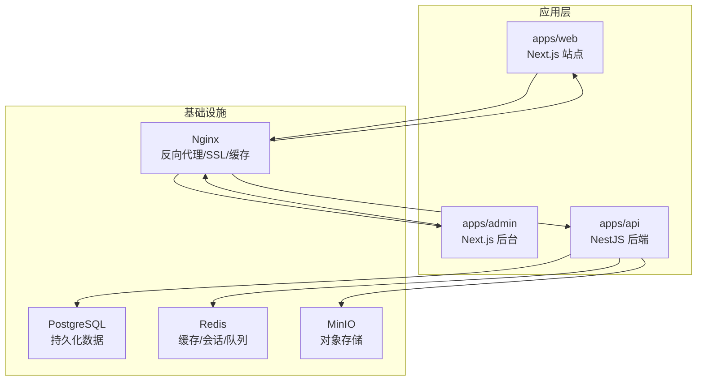
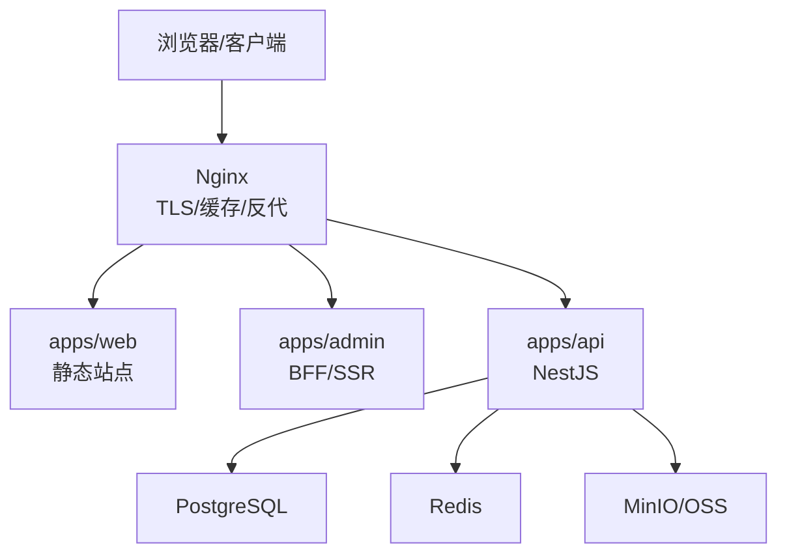
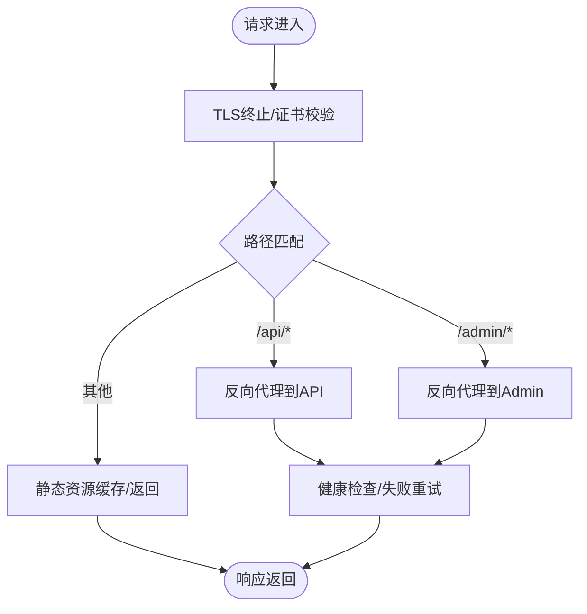
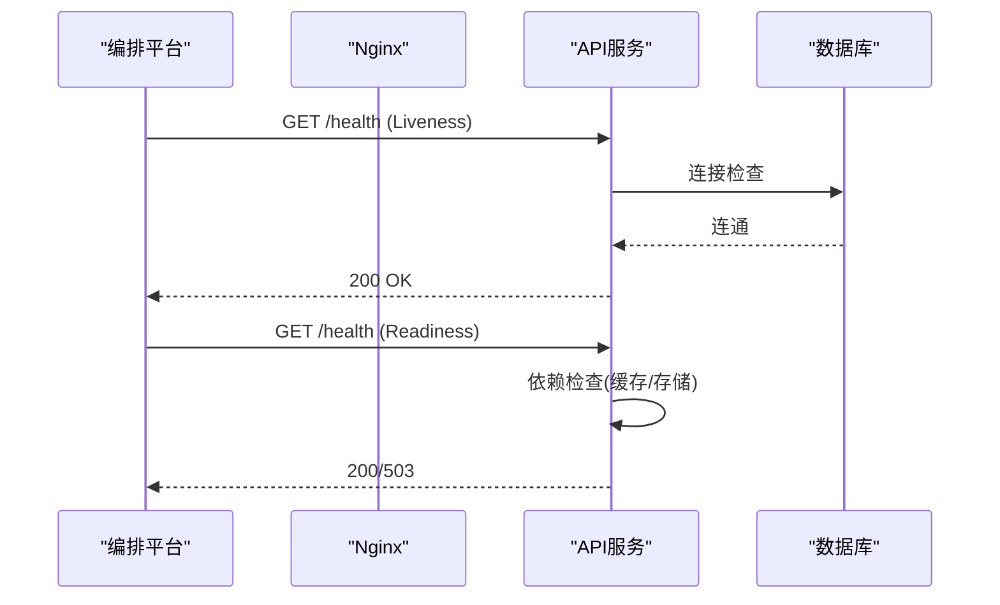
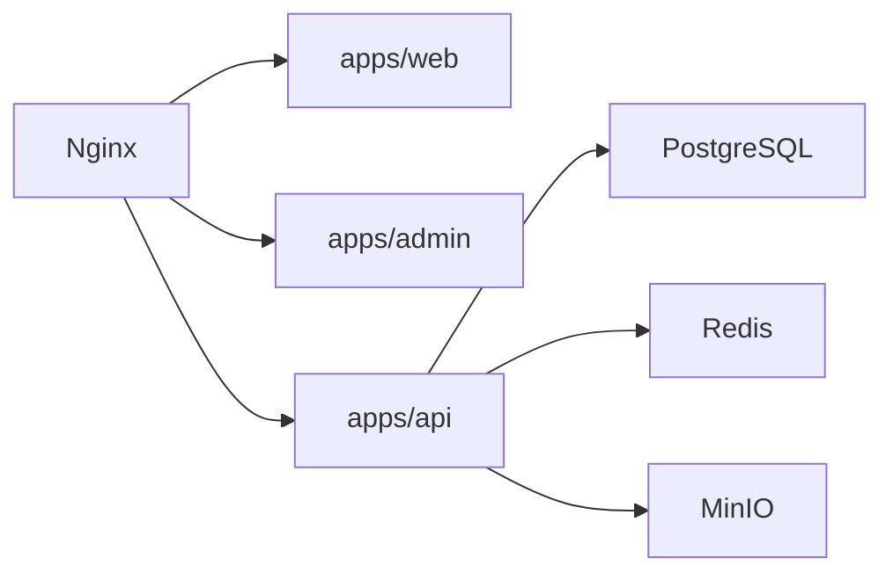

# 部署架构设计

<cite>
**本文引用的文件**   
- [apps/admin/Dockerfile](file://apps/admin/Dockerfile)
- [apps/api/Dockerfile](file://apps/api/Dockerfile)
- [apps/web/Dockerfile](file://apps/web/Dockerfile)
- [infra/docker/docker-compose.prod.yml](file://infra/docker/docker-compose.prod.yml)
- [infra/docker/nginx/tzj.conf](file://infra/docker/nginx/tzj.conf)
- [infra/docker/nginx/templates/tzj.conf.template](file://infra/docker/nginx/templates/tzj.conf.template)
- [infra/docker/nginx/snippets/proxy-docker.conf](file://infra/docker/nginx/snippets/proxy-docker.conf)
- [infra/docker/nginx/entrypoint.d/90-periodic-reload.sh](file://infra/docker/nginx/entrypoint.d/90-periodic-reload.sh)
- [.github/workflows/ci.yml](file://.github/workflows/ci.yml)
- [.github/workflows/deploy.yml](file://.github/workflows/deploy.yml)
- [.github/workflows/deploy-ssh.yml](file://.github/workflows/deploy-ssh.yml)
- [infra/yunxiao/pipeline.yml](file://infra/yunxiao/pipeline.yml)
- [Makefile](file://Makefile)
- [apps/api/src/main.ts](file://apps/api/src/main.ts)
- [apps/api/src/app.module.ts](file://apps/api/src/app.module.ts)
- [apps/api/src/health/health.controller.ts](file://apps/api/src/health/health.controller.ts)
- [apps/api/src/config/env.validation.ts](file://apps/api/src/config/env.validation.ts)
- [apps/api/prisma/schema.prisma](file://apps/api/prisma/schema.prisma)
- [apps/web/next.config.ts](file://apps/web/next.config.ts)
- [apps/admin/next.config.ts](file://apps/admin/next.config.ts)
- [packages/ui/package.json](file://packages/ui/package.json)
- [package.json](file://package.json)
- [pnpm-workspace.yaml](file://pnpm-workspace.yaml)
- [turbo.json](file://turbo.json)
</cite>

## 目录
1. [简介](#简介)
2. [项目结构](#项目结构)
3. [核心组件](#核心组件)
4. [架构总览](#架构总览)
5. [详细组件分析](#详细组件分析)
6. [依赖关系分析](#依赖关系分析)
7. [性能与优化](#性能与优化)
8. [故障排查指南](#故障排查指南)
9. [结论](#结论)
10. [附录](#附录)

## 简介
本文件面向运维工程师与DevOps团队，系统化阐述TZJ网站的容器化部署方案。内容覆盖Docker多阶段构建、镜像体积优化、Nginx反向代理与负载均衡、健康检查、CI/CD流水线、自动化测试与灰度发布策略、环境配置与密钥管理、监控告警与日志收集、高可用与容灾备份等。目标是提供可落地的部署与运维最佳实践，确保系统稳定、安全、可观测、可扩展。

## 项目结构
仓库采用Monorepo组织，包含三个应用与基础设施定义：
- apps/web：Next.js前端站点（生产静态化/SSG）
- apps/admin：Next.js后台管理系统（BFF/SSR）
- apps/api：NestJS后端服务（REST/WS/存储/鉴权/业务模块）
- infra/docker：Docker Compose编排、Nginx模板与脚本、MinIO/Postgres/Redis配置
- .github/workflows：GitHub Actions CI/CD流水线
- infra/yunxiao：云效流水线定义
- packages：共享包（UI、类型、主题等）

图表来源
- [apps/web/Dockerfile](file://apps/web/Dockerfile)
- [apps/admin/Dockerfile](file://apps/admin/Dockerfile)
- [apps/api/Dockerfile](file://apps/api/Dockerfile)
- [infra/docker/docker-compose.prod.yml](file://infra/docker/docker-compose.prod.yml)
- [infra/docker/nginx/tzj.conf](file://infra/docker/nginx/tzj.conf)

章节来源
- [Makefile](file://Makefile)
- [package.json](file://package.json)
- [pnpm-workspace.yaml](file://pnpm-workspace.yaml)
- [turbo.json](file://turbo.json)

## 核心组件
- 前端站点（apps/web）：Next.js SSG/ISR，输出静态资源，由Nginx直接托管；支持国际化、媒体加载、搜索与埋点。
- 后台管理（apps/admin）：Next.js BFF模式，聚合API与页面渲染，通过Nginx路由到后端API。
- 后端服务（apps/api）：NestJS模块化架构，提供REST/WS接口，集成鉴权、权限、审计、媒体、存储、聊天、通知等能力。
- 反向代理（Nginx）：统一入口、TLS终止、静态资源缓存、反向代理、限流与健康检查透传。
- 数据存储（PostgreSQL/Redis/MinIO）：结构化数据、缓存与会话、对象存储（图片/文档）。

章节来源
- [apps/web/Dockerfile](file://apps/web/Dockerfile)
- [apps/admin/Dockerfile](file://apps/admin/Dockerfile)
- [apps/api/Dockerfile](file://apps/api/Dockerfile)
- [apps/api/src/main.ts](file://apps/api/src/main.ts)
- [apps/api/src/app.module.ts](file://apps/api/src/app.module.ts)
- [infra/docker/nginx/tzj.conf](file://infra/docker/nginx/tzj.conf)

## 架构总览
整体采用“Nginx + 容器化微服务”的架构：Nginx作为唯一对外入口，负责TLS、静态资源、反向代理与负载均衡；Web/Admin为无状态容器，按需水平扩展；API为有状态服务，连接数据库、缓存与对象存储。所有组件通过环境变量与密钥注入实现环境隔离与安全管控。

图表来源
- [infra/docker/nginx/tzj.conf](file://infra/docker/nginx/tzj.conf)
- [infra/docker/docker-compose.prod.yml](file://infra/docker/docker-compose.prod.yml)
- [apps/api/src/main.ts](file://apps/api/src/main.ts)

## 详细组件分析

### Docker多阶段构建与镜像优化
- 前端（apps/web）：构建阶段安装依赖并执行Next.js构建，运行阶段仅包含产物与最小运行时，减少镜像体积与攻击面。
- 后台（apps/admin）：类似前端，分离构建与运行阶段，启用增量缓存与依赖锁定。
- 后端（apps/api）：Node.js多阶段构建，编译TypeScript与Prisma生成，运行阶段使用非root用户与精简基础镜像。

优化要点
- 使用.dockerignore排除无关文件
- 分层缓存node_modules与构建缓存
- 合并RUN指令减少层数
- 使用非root用户运行容器
- 移除开发依赖与调试信息

章节来源
- [apps/web/Dockerfile](file://apps/web/Dockerfile)
- [apps/admin/Dockerfile](file://apps/admin/Dockerfile)
- [apps/api/Dockerfile](file://apps/api/Dockerfile)

### Nginx反向代理与负载均衡
- 统一入口：HTTPS终止、HTTP重定向、静态资源缓存、Gzip/Brotli压缩。
- 路由规则：/api/*转发至API服务；/admin/*转发至Admin；其余静态资源由Web服务提供。
- 负载均衡：基于上游组轮询或加权策略，支持健康检查与故障剔除。
- 安全加固：限流、访问控制、CORS、HSTS、安全头。

图表来源
- [infra/docker/nginx/tzj.conf](file://infra/docker/nginx/tzj.conf)
- [infra/docker/nginx/templates/tzj.conf.template](file://infra/docker/nginx/templates/tzj.conf.template)
- [infra/docker/nginx/snippets/proxy-docker.conf](file://infra/docker/nginx/snippets/proxy-docker.conf)

章节来源
- [infra/docker/nginx/tzj.conf](file://infra/docker/nginx/tzj.conf)
- [infra/docker/nginx/templates/tzj.conf.template](file://infra/docker/nginx/templates/tzj.conf.template)
- [infra/docker/nginx/snippets/proxy-docker.conf](file://infra/docker/nginx/snippets/proxy-docker.conf)
- [infra/docker/nginx/entrypoint.d/90-periodic-reload.sh](file://infra/docker/nginx/entrypoint.d/90-periodic-reload.sh)

### 健康检查与探针
- API健康端点：/health用于存活与就绪探针，检查数据库连接、缓存可用性、磁盘空间等。
- Nginx健康透传：将上游健康状态反馈给编排平台，自动剔除不健康实例。
- 探针策略：Liveness/Readiness结合滚动更新，保证零停机发布。

图表来源
- [apps/api/src/health/health.controller.ts](file://apps/api/src/health/health.controller.ts)
- [apps/api/src/main.ts](file://apps/api/src/main.ts)

章节来源
- [apps/api/src/health/health.controller.ts](file://apps/api/src/health/health.controller.ts)
- [apps/api/src/main.ts](file://apps/api/src/main.ts)

### 环境变量与配置管理
- 环境变量隔离：不同环境（dev/staging/prod）通过Compose变量文件或Secrets注入。
- 配置校验：后端在启动时校验必需环境变量，缺失则拒绝启动。
- 密钥管理：敏感信息（数据库密码、JWT密钥、第三方API Key）通过环境变量或外部密钥管理服务注入，避免硬编码。

章节来源
- [apps/api/src/config/env.validation.ts](file://apps/api/src/config/env.validation.ts)
- [apps/api/src/main.ts](file://apps/api/src/main.ts)
- [infra/docker/docker-compose.prod.yml](file://infra/docker/docker-compose.prod.yml)

### 数据库与迁移
- Schema定义：Prisma schema集中管理数据模型与关系。
- 迁移策略：CI中执行迁移，生产环境采用蓝绿或滚动发布，确保向后兼容。
- 备份恢复：定期快照与异地备份，支持按时间点恢复。

章节来源
- [apps/api/prisma/schema.prisma](file://apps/api/prisma/schema.prisma)

### Next.js配置与构建
- 站点（apps/web）：静态导出、增量静态再生成、媒体路径与CDN集成。
- 后台（apps/admin）：BFF模式，API代理与SSR渲染，环境变量注入运行时配置。

章节来源
- [apps/web/next.config.ts](file://apps/web/next.config.ts)
- [apps/admin/next.config.ts](file://apps/admin/next.config.ts)

### 共享包与Monorepo
- 包管理：pnpm workspace + Turborepo加速构建与缓存。
- 共享库：UI组件、类型定义、主题配置等复用。

章节来源
- [packages/ui/package.json](file://packages/ui/package.json)
- [pnpm-workspace.yaml](file://pnpm-workspace.yaml)
- [turbo.json](file://turbo.json)

## 依赖关系分析
- 应用间依赖：Nginx依赖Web/Admin/API服务；API依赖PostgreSQL、Redis、MinIO。
- 构建依赖：前端与后端均依赖Node.js工具链与pnpm/Turbo。
- 外部依赖：第三方服务（如短信、验证码、邮件）通过环境变量接入。

图表来源
- [infra/docker/docker-compose.prod.yml](file://infra/docker/docker-compose.prod.yml)
- [apps/api/src/app.module.ts](file://apps/api/src/app.module.ts)

章节来源
- [infra/docker/docker-compose.prod.yml](file://infra/docker/docker-compose.prod.yml)
- [apps/api/src/app.module.ts](file://apps/api/src/app.module.ts)

## 性能与优化
- 镜像优化：多阶段构建、依赖缓存、精简基础镜像、非root运行。
- 网络优化：Nginx开启HTTP/2、Keep-Alive、Gzip/Brotli、静态资源缓存。
- 应用优化：Next.js ISR/SSG、API连接池、Redis缓存热点数据、MinIO分片上传。
- 资源限制：容器CPU/内存限制与弹性扩缩容。

[本节为通用指导，无需代码引用]

## 故障排查指南
- 启动失败：检查环境变量与密钥注入、端口冲突、依赖服务连通性。
- 健康检查失败：查看API健康端点日志、数据库连接、缓存可用性。
- 反向代理异常：检查Nginx配置语法、上游服务状态、证书有效性。
- 性能问题：定位慢查询、缓存命中率、静态资源加载瓶颈。

章节来源
- [apps/api/src/health/health.controller.ts](file://apps/api/src/health/health.controller.ts)
- [infra/docker/nginx/tzj.conf](file://infra/docker/nginx/tzj.conf)

## 结论
本部署架构以容器化为核心，结合Nginx反向代理与多阶段构建优化，实现了高可用、可扩展、易维护的TZJ网站部署方案。通过完善的CI/CD、健康检查、监控告警与备份恢复策略，保障系统在复杂环境下稳定运行。建议在生产环境持续演进，逐步引入服务网格、分布式追踪与更细粒度的权限控制。

[本节为总结，无需代码引用]

## 附录

### CI/CD流水线设计
- GitHub Actions：代码提交触发构建、测试、镜像推送与部署。
- 云效流水线：企业级流水线编排，支持审批与回滚。
- 自动化测试：单元测试、集成测试、端到端测试与性能基准。

章节来源
- [.github/workflows/ci.yml](file://.github/workflows/ci.yml)
- [.github/workflows/deploy.yml](file://.github/workflows/deploy.yml)
- [.github/workflows/deploy-ssh.yml](file://.github/workflows/deploy-ssh.yml)
- [infra/yunxiao/pipeline.yml](file://infra/yunxiao/pipeline.yml)

### 高可用与容灾
- 多副本部署：API与Admin多副本，Nginx双机热备。
- 故障转移：编排平台自动重启与替换失败实例。
- 数据备份：数据库定时快照、对象存储版本控制与跨区域复制。

[本节为通用指导，无需代码引用]

### 监控告警与日志收集
- 指标采集：Prometheus抓取应用与系统指标。
- 日志收集：Fluent Bit/EFK栈统一收集与检索。
- 告警规则：基于阈值与异常检测触发通知。

[本节为通用指导，无需代码引用]

### 部署命令与脚本
- Makefile：封装常用构建、部署、测试命令。
- 部署脚本：一键部署与回滚脚本，支持多环境切换。

章节来源
- [Makefile](file://Makefile)