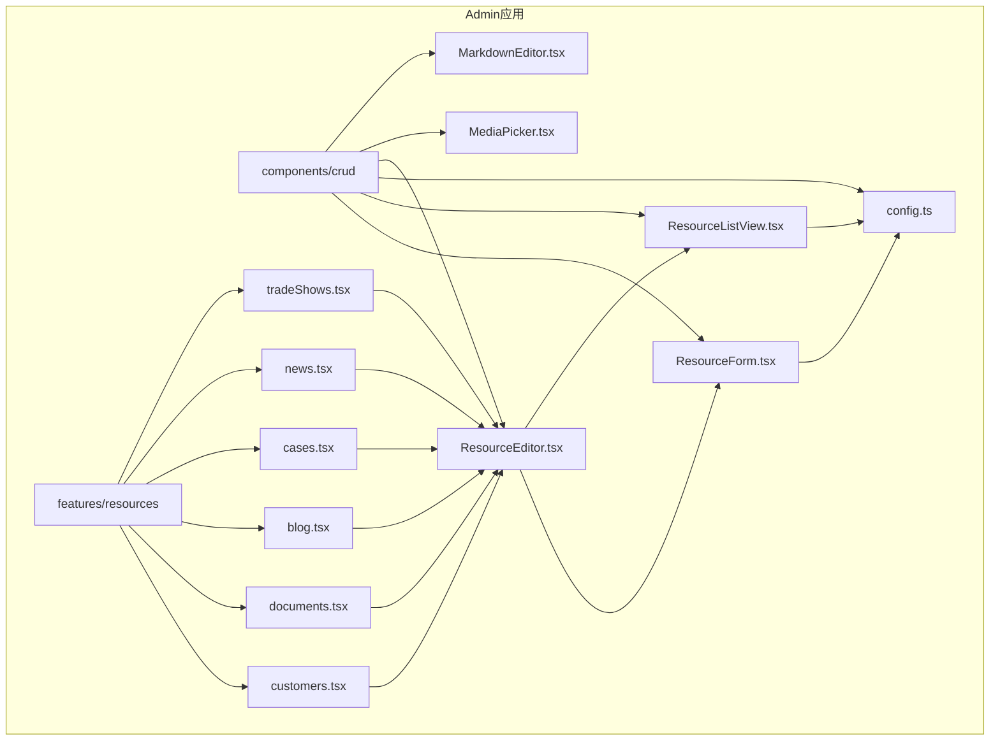
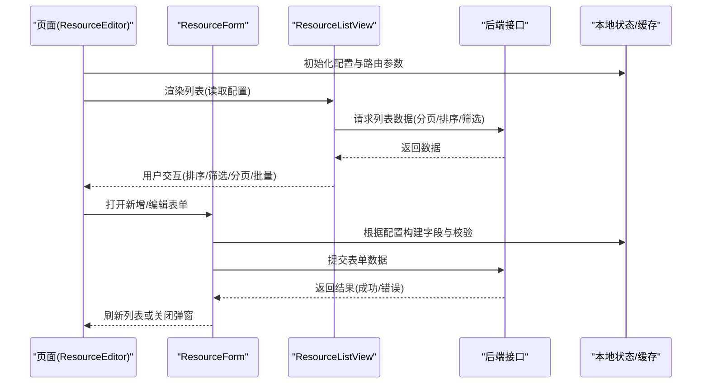
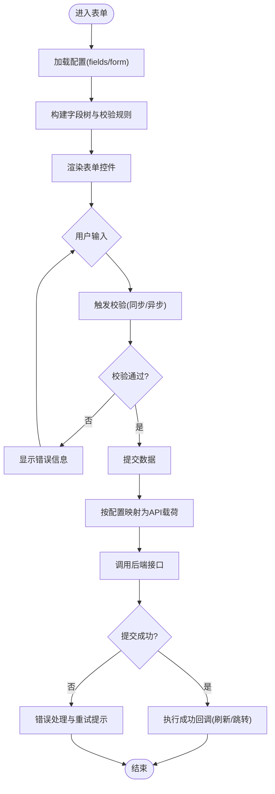
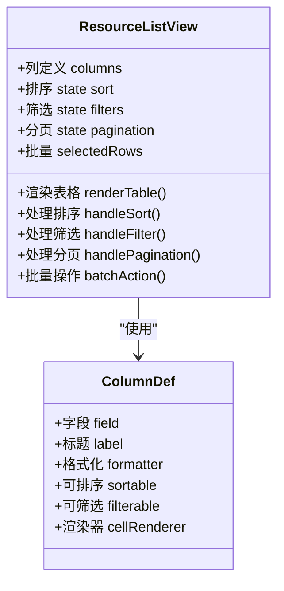
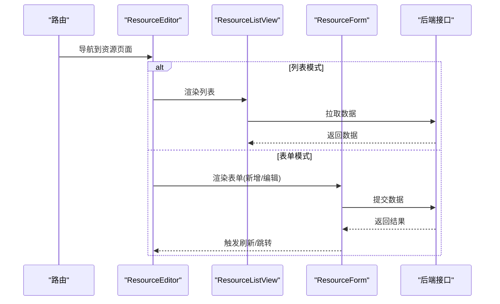
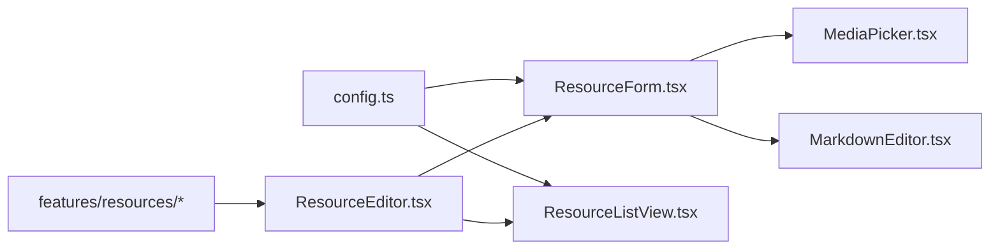

# CRUD组件

<cite>
**本文引用的文件**   
- [ResourceForm.tsx](file://apps/admin/src/components/crud/ResourceForm.tsx)
- [ResourceListView.tsx](file://apps/admin/src/components/crud/ResourceListView.tsx)
- [config.ts](file://apps/admin/src/components/crud/config.ts)
- [ResourceEditor.tsx](file://apps/admin/src/components/crud/ResourceEditor.tsx)
- [MediaPicker.tsx](file://apps/admin/src/components/crud/MediaPicker.tsx)
- [MarkdownEditor.tsx](file://apps/admin/src/components/crud/MarkdownEditor.tsx)
- [customers.tsx](file://apps/admin/src/features/resources/customers.tsx)
- [documents.tsx](file://apps/admin/src/features/resources/documents.tsx)
- [blog.tsx](file://apps/admin/src/features/resources/blog.tsx)
- [cases.tsx](file://apps/admin/src/features/resources/cases.tsx)
- [news.tsx](file://apps/admin/src/features/resources/news.tsx)
- [tradeShows.tsx](file://apps/admin/src/features/resources/tradeShows.tsx)
</cite>

## 目录
1. [简介](#简介)
2. [项目结构](#项目结构)
3. [核心组件](#核心组件)
4. [架构总览](#架构总览)
5. [详细组件分析](#详细组件分析)
6. [依赖关系分析](#依赖关系分析)
7. [性能考虑](#性能考虑)
8. [故障排查指南](#故障排查指南)
9. [结论](#结论)
10. [附录](#附录)

## 简介
本文件面向CRUD组件的使用与扩展，聚焦以下目标：
- 表单组件 ResourceForm：字段类型、验证规则、数据绑定机制、动态表单生成。
- 列表组件 ResourceListView：排序、筛选、分页、批量操作。
- 配置系统 config.ts：配置文件结构定义、字段映射规则、扩展点说明。
- 实际使用示例：基于 features/resources 下的资源定义，展示如何组合配置驱动表单与列表。
- 自定义字段类型开发指南：如何在现有框架上扩展新的输入控件并接入表单渲染。

## 项目结构
CRUD相关代码位于 admin 应用的 components/crud 目录，并在 features/resources 中提供各资源的配置与页面集成。

图表来源
- [ResourceForm.tsx](file://apps/admin/src/components/crud/ResourceForm.tsx)
- [ResourceListView.tsx](file://apps/admin/src/components/crud/ResourceListView.tsx)
- [config.ts](file://apps/admin/src/components/crud/config.ts)
- [ResourceEditor.tsx](file://apps/admin/src/components/crud/ResourceEditor.tsx)
- [MediaPicker.tsx](file://apps/admin/src/components/crud/MediaPicker.tsx)
- [MarkdownEditor.tsx](file://apps/admin/src/components/crud/MarkdownEditor.tsx)
- [customers.tsx](file://apps/admin/src/features/resources/customers.tsx)
- [documents.tsx](file://apps/admin/src/features/resources/documents.tsx)
- [blog.tsx](file://apps/admin/src/features/resources/blog.tsx)
- [cases.tsx](file://apps/admin/src/features/resources/cases.tsx)
- [news.tsx](file://apps/admin/src/features/resources/news.tsx)
- [tradeShows.tsx](file://apps/admin/src/features/resources/tradeShows.tsx)

章节来源
- [ResourceForm.tsx](file://apps/admin/src/components/crud/ResourceForm.tsx)
- [ResourceListView.tsx](file://apps/admin/src/components/crud/ResourceListView.tsx)
- [config.ts](file://apps/admin/src/components/crud/config.ts)
- [ResourceEditor.tsx](file://apps/admin/src/components/crud/ResourceEditor.tsx)

## 核心组件
- ResourceForm：根据配置动态渲染表单，支持多种字段类型、校验规则、联动与条件显示，负责数据收集与提交。
- ResourceListView：根据配置渲染表格，支持列定义、排序、筛选、分页、批量选择与批量动作。
- config.ts：集中管理CRUD的字段映射、UI行为、API对接参数等配置项，是表单与列表的“蓝图”。
- ResourceEditor：将 ResourceForm 与 ResourceListView 组合为完整的编辑/查看页面，处理路由、状态与数据流。
- MediaPicker / MarkdownEditor：作为可复用的自定义字段组件，分别用于媒体选择与富文本编辑。

章节来源
- [ResourceForm.tsx](file://apps/admin/src/components/crud/ResourceForm.tsx)
- [ResourceListView.tsx](file://apps/admin/src/components/crud/ResourceListView.tsx)
- [config.ts](file://apps/admin/src/components/crud/config.ts)
- [ResourceEditor.tsx](file://apps/admin/src/components/crud/ResourceEditor.tsx)
- [MediaPicker.tsx](file://apps/admin/src/components/crud/MediaPicker.tsx)
- [MarkdownEditor.tsx](file://apps/admin/src/components/crud/MarkdownEditor.tsx)

## 架构总览
CRUD组件采用“配置驱动”的架构：通过统一的配置描述资源的数据结构与UI行为，由通用组件解析配置并渲染表单与列表。ResourceEditor作为页面级容器，协调数据获取、保存与视图切换。

图表来源
- [ResourceEditor.tsx](file://apps/admin/src/components/crud/ResourceEditor.tsx)
- [ResourceForm.tsx](file://apps/admin/src/components/crud/ResourceForm.tsx)
- [ResourceListView.tsx](file://apps/admin/src/components/crud/ResourceListView.tsx)
- [config.ts](file://apps/admin/src/components/crud/config.ts)

## 详细组件分析

### 配置系统(config.ts)
- 作用：定义资源模型、字段元信息、表单布局、列表列定义、查询参数映射、权限与国际化文案等。
- 关键字段（概念性说明）：
  - model：资源标识与基础信息
  - fields：字段定义集合，包含类型、标签、默认值、校验规则、是否必填、是否只读、是否隐藏、联动逻辑等
  - form：表单布局与分组、提交前处理、成功后回调
  - list：列定义、默认排序、筛选器、批量动作、导出能力
  - api：增删改查端点、请求/响应映射、错误处理策略
- 扩展点：
  - 自定义字段类型注册表：在配置中声明新字段类型，并提供渲染组件与校验函数
  - 生命周期钩子：提交前/后、列表加载前后、行操作前后
  - 列渲染器：自定义单元格渲染逻辑
  - 筛选器扩展：支持自定义查询条件与聚合

章节来源
- [config.ts](file://apps/admin/src/components/crud/config.ts)

### ResourceForm 表单组件
- 动态表单生成：
  - 根据 fields 配置逐项渲染对应输入控件
  - 支持分组、折叠、条件显示与联动更新
- 字段类型（常见）：
  - 文本、数字、日期、时间、布尔、下拉选择、多选、富文本、媒体选择、关联选择等
- 验证规则：
  - 必填、长度、格式、范围、正则、异步校验、跨字段联动校验
- 数据绑定机制：
  - 双向绑定与受控组件模式，统一值/错误状态管理
  - 提交时按 fields 映射到API期望的payload结构
- 用户体验：
  - 实时校验提示、防抖输入、占位符与帮助文案、国际化

图表来源
- [ResourceForm.tsx](file://apps/admin/src/components/crud/ResourceForm.tsx)
- [config.ts](file://apps/admin/src/components/crud/config.ts)

章节来源
- [ResourceForm.tsx](file://apps/admin/src/components/crud/ResourceForm.tsx)
- [config.ts](file://apps/admin/src/components/crud/config.ts)

### ResourceListView 列表组件
- 列定义：标题、字段映射、格式化、可排序、可筛选、可导出、自定义渲染
- 排序：单列/多列排序，前端或后端排序
- 筛选：文本模糊、精确匹配、范围、枚举、自定义条件
- 分页：页码、每页条数、总数、URL状态同步
- 批量操作：选择行、批量删除/导出/状态变更、二次确认
- 性能优化：虚拟滚动、懒加载、去抖搜索、增量更新

图表来源
- [ResourceListView.tsx](file://apps/admin/src/components/crud/ResourceListView.tsx)
- [config.ts](file://apps/admin/src/components/crud/config.ts)

章节来源
- [ResourceListView.tsx](file://apps/admin/src/components/crud/ResourceListView.tsx)
- [config.ts](file://apps/admin/src/components/crud/config.ts)

### ResourceEditor 编辑器容器
- 职责：
  - 路由与页面状态管理（新增/编辑/查看）
  - 组装 ResourceForm 与 ResourceListView
  - 处理数据加载、保存、错误与成功反馈
  - 权限控制与访问限制
- 典型流程：
  - 进入页面：根据路由决定渲染列表或表单
  - 列表页：加载数据、支持排序/筛选/分页/批量
  - 表单页：新建或编辑记录，提交后返回列表并刷新

图表来源
- [ResourceEditor.tsx](file://apps/admin/src/components/crud/ResourceEditor.tsx)
- [ResourceListView.tsx](file://apps/admin/src/components/crud/ResourceListView.tsx)
- [ResourceForm.tsx](file://apps/admin/src/components/crud/ResourceForm.tsx)

章节来源
- [ResourceEditor.tsx](file://apps/admin/src/components/crud/ResourceEditor.tsx)

### 自定义字段类型开发指南
- 步骤概览：
  - 在配置中声明新字段类型，并指定渲染组件与校验函数
  - 实现渲染组件：遵循受控组件规范，提供 value、onChange、error、helpText 等属性
  - 实现校验函数：支持同步与异步校验，返回错误消息或Promise
  - 注册到字段渲染器：确保表单能识别并正确渲染
- 注意事项：
  - 保持与现有字段一致的API契约，便于复用与测试
  - 对复杂字段提供占位符、帮助文案与无障碍支持
  - 避免在渲染中进行重计算，必要时使用缓存或去抖

章节来源
- [ResourceForm.tsx](file://apps/admin/src/components/crud/ResourceForm.tsx)
- [MediaPicker.tsx](file://apps/admin/src/components/crud/MediaPicker.tsx)
- [MarkdownEditor.tsx](file://apps/admin/src/components/crud/MarkdownEditor.tsx)
- [config.ts](file://apps/admin/src/components/crud/config.ts)

### 实际使用示例（基于 features/resources）
- customers.tsx：客户资源，通常包含基本信息、联系方式、状态等字段，列表支持搜索与批量操作。
- documents.tsx：文档资源，包含标题、内容、分类、权限等，表单可能包含富文本与媒体选择。
- blog.tsx：博客资源，包含标题、摘要、正文、封面图、发布时间等。
- cases.tsx：案例资源，包含标题、描述、图片、标签、状态等。
- news.tsx：新闻资源，包含标题、内容、发布状态、作者等。
- tradeShows.tsx：展会资源，包含名称、时间、地点、描述、媒体等。

这些示例展示了如何通过配置驱动的方式快速搭建CRUD界面，无需重复编写表单与列表样板代码。

章节来源
- [customers.tsx](file://apps/admin/src/features/resources/customers.tsx)
- [documents.tsx](file://apps/admin/src/features/resources/documents.tsx)
- [blog.tsx](file://apps/admin/src/features/resources/blog.tsx)
- [cases.tsx](file://apps/admin/src/features/resources/cases.tsx)
- [news.tsx](file://apps/admin/src/features/resources/news.tsx)
- [tradeShows.tsx](file://apps/admin/src/features/resources/tradeShows.tsx)

## 依赖关系分析
- 组件内聚：ResourceForm 与 ResourceListView 各自关注表单与列表的职责，低耦合高内聚。
- 配置中心：config.ts 作为单一事实源，减少分散的配置与硬编码。
- 页面容器：ResourceEditor 协调数据流与视图切换，屏蔽底层细节。
- 外部依赖：媒体与富文本组件作为可选字段类型，按需引入。

图表来源
- [config.ts](file://apps/admin/src/components/crud/config.ts)
- [ResourceForm.tsx](file://apps/admin/src/components/crud/ResourceForm.tsx)
- [ResourceListView.tsx](file://apps/admin/src/components/crud/ResourceListView.tsx)
- [ResourceEditor.tsx](file://apps/admin/src/components/crud/ResourceEditor.tsx)
- [MediaPicker.tsx](file://apps/admin/src/components/crud/MediaPicker.tsx)
- [MarkdownEditor.tsx](file://apps/admin/src/components/crud/MarkdownEditor.tsx)
- [customers.tsx](file://apps/admin/src/features/resources/customers.tsx)
- [documents.tsx](file://apps/admin/src/features/resources/documents.tsx)
- [blog.tsx](file://apps/admin/src/features/resources/blog.tsx)
- [cases.tsx](file://apps/admin/src/features/resources/cases.tsx)
- [news.tsx](file://apps/admin/src/features/resources/news.tsx)
- [tradeShows.tsx](file://apps/admin/src/features/resources/tradeShows.tsx)

章节来源
- [config.ts](file://apps/admin/src/components/crud/config.ts)
- [ResourceForm.tsx](file://apps/admin/src/components/crud/ResourceForm.tsx)
- [ResourceListView.tsx](file://apps/admin/src/components/crud/ResourceListView.tsx)
- [ResourceEditor.tsx](file://apps/admin/src/components/crud/ResourceEditor.tsx)

## 性能考虑
- 列表性能：
  - 大数据量场景启用虚拟滚动与分页加载
  - 搜索与筛选使用去抖与后端过滤
  - 列渲染器避免重计算，必要时缓存结果
- 表单性能：
  - 复杂校验使用异步与延迟校验
  - 大文本输入使用分块渲染与增量更新
  - 媒体上传使用分片与进度反馈
- 网络优化：
  - 请求合并与缓存策略
  - 错误重试与退避算法
  - 失败降级与友好提示

[本节为通用指导，不直接分析具体文件]

## 故障排查指南
- 表单无法提交：
  - 检查字段校验规则与必填项
  - 确认API映射是否正确，字段名与类型一致
  - 查看网络请求与响应错误信息
- 列表无数据或分页异常：
  - 检查查询参数与分页参数是否符合后端约定
  - 确认排序与筛选条件是否被后端正确处理
  - 查看控制台错误与网络日志
- 自定义字段不生效：
  - 确认字段类型已正确注册
  - 检查渲染组件属性契约是否满足
  - 校验函数返回值格式是否正确

章节来源
- [ResourceForm.tsx](file://apps/admin/src/components/crud/ResourceForm.tsx)
- [ResourceListView.tsx](file://apps/admin/src/components/crud/ResourceListView.tsx)
- [config.ts](file://apps/admin/src/components/crud/config.ts)

## 结论
CRUD组件通过配置驱动的方式，显著降低了重复开发与维护成本。ResourceForm与ResourceListView提供了强大的表单与列表能力，配合ResourceEditor形成完整的资源管理页面。通过扩展字段类型与生命周期钩子，可以灵活适配不同业务需求。建议在实际项目中优先使用配置化方式，结合示例资源进行快速迭代与定制。

[本节为总结性内容，不直接分析具体文件]

## 附录
- 最佳实践：
  - 将字段元信息与UI行为集中在配置中，便于管理与版本控制
  - 为复杂字段编写单元测试与集成测试
  - 使用统一的错误处理与用户提示策略
- 常见问题：
  - 字段映射不一致导致提交失败
  - 列表筛选条件未正确传递到后端
  - 自定义字段未遵循受控组件规范导致状态不同步

[本节为补充信息，不直接分析具体文件]