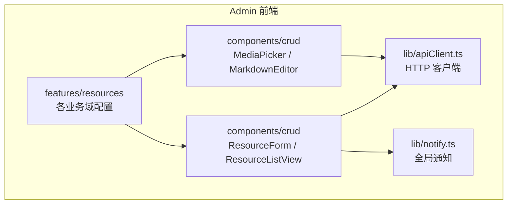
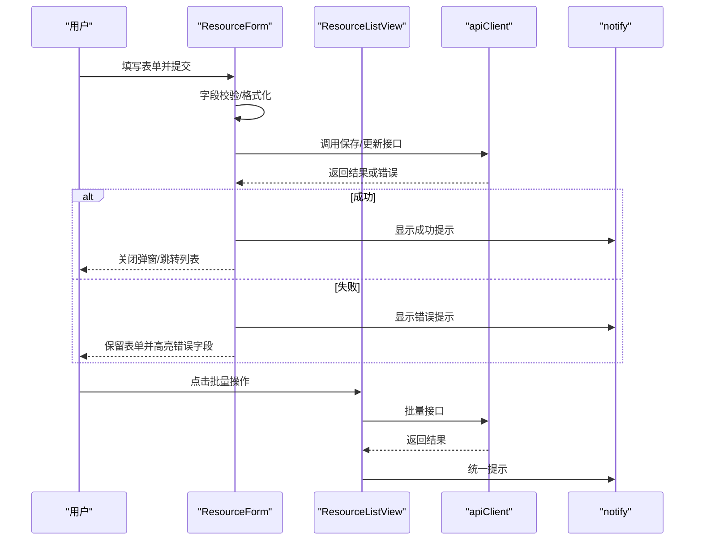
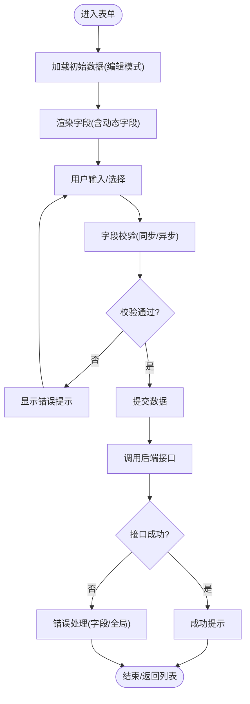
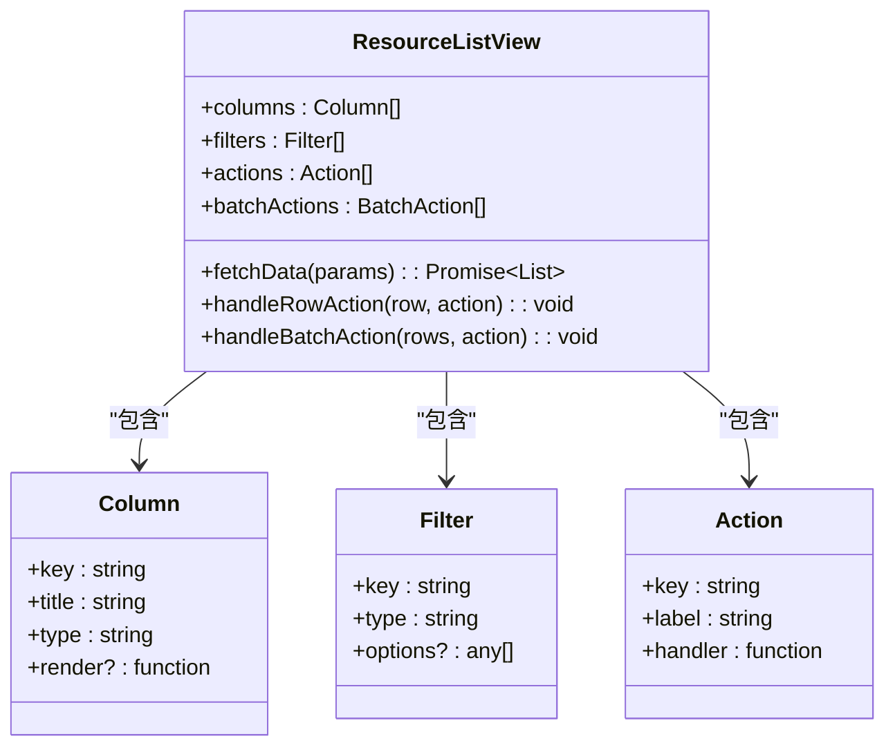
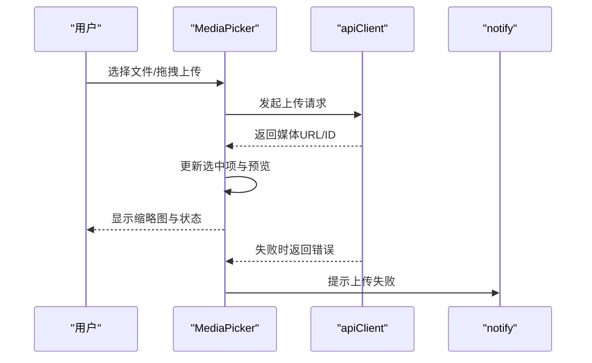
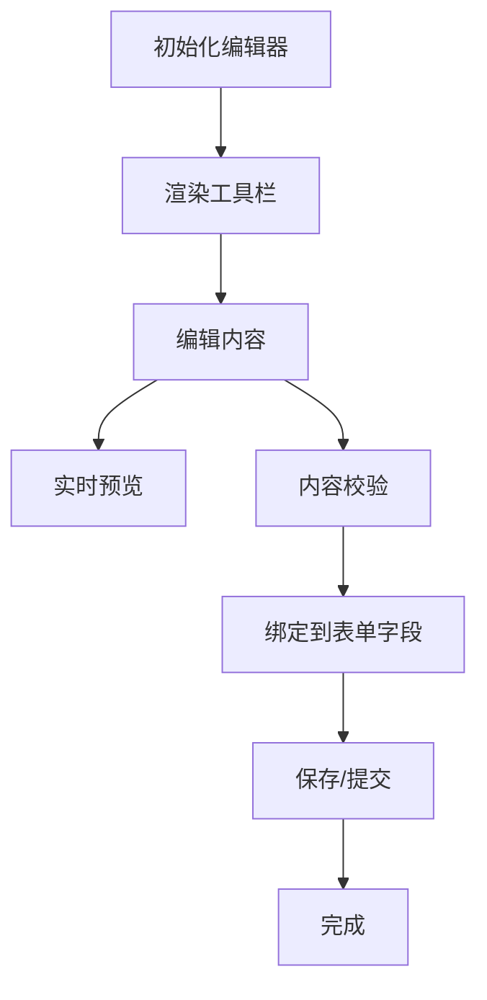
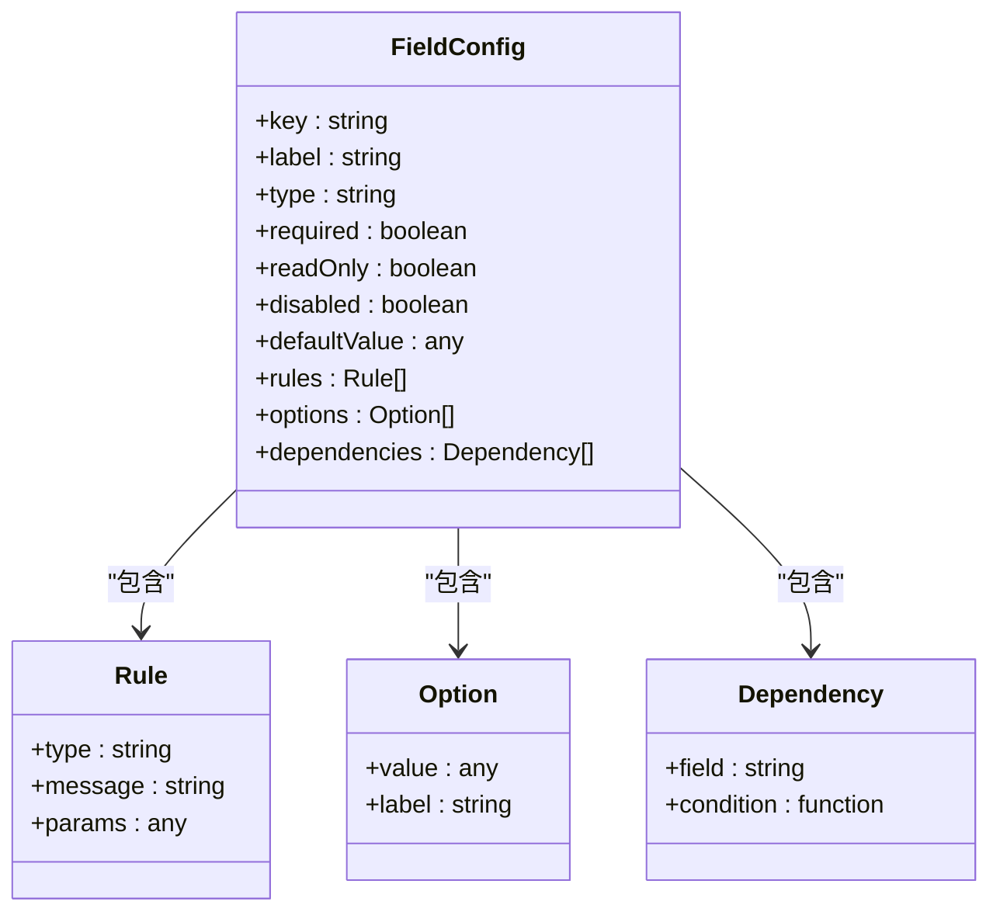
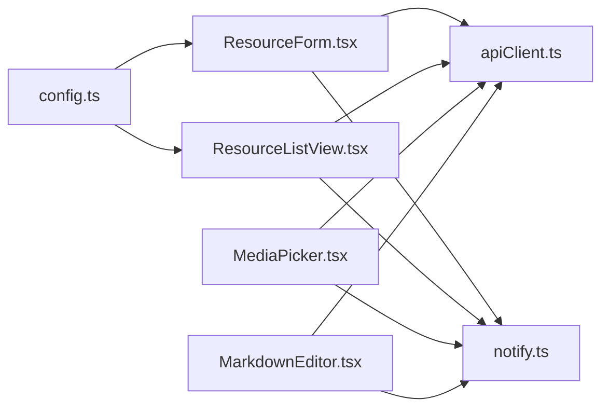

# 业务组件

<cite>
**本文引用的文件**   
- [apps/admin/src/components/crud/ResourceForm.tsx](file://apps/admin/src/components/crud/ResourceForm.tsx)
- [apps/admin/src/components/crud/ResourceListView.tsx](file://apps/admin/src/components/crud/ResourceListView.tsx)
- [apps/admin/src/components/crud/MediaPicker.tsx](file://apps/admin/src/components/crud/MediaPicker.tsx)
- [apps/admin/src/components/crud/MarkdownEditor.tsx](file://apps/admin/src/components/crud/MarkdownEditor.tsx)
- [apps/admin/src/components/crud/config.ts](file://apps/admin/src/components/crud/config.ts)
- [apps/admin/src/features/resources/blog.tsx](file://apps/admin/src/features/resources/blog.tsx)
- [apps/admin/src/features/resources/customers.tsx](file://apps/admin/src/features/resources/customers.tsx)
- [apps/admin/src/features/resources/documents.tsx](file://apps/admin/src/features/resources/documents.tsx)
- [apps/admin/src/features/resources/news.tsx](file://apps/admin/src/features/resources/news.tsx)
- [apps/admin/src/features/resources/cases.tsx](file://apps/admin/src/features/resources/cases.tsx)
- [apps/admin/src/features/resources/tradeShows.tsx](file://apps/admin/src/features/resources/tradeShows.tsx)
- [apps/admin/src/lib/apiClient.ts](file://apps/admin/src/lib/apiClient.ts)
- [apps/admin/src/lib/notify.ts](file://apps/admin/src/lib/notify.ts)
</cite>

## 目录
1. [简介](#简介)
2. [项目结构](#项目结构)
3. [核心组件](#核心组件)
4. [架构总览](#架构总览)
5. [详细组件分析](#详细组件分析)
6. [依赖关系分析](#依赖关系分析)
7. [性能考量](#性能考量)
8. [故障排查指南](#故障排查指南)
9. [结论](#结论)
10. [附录：集成与扩展指南](#附录集成与扩展指南)

## 简介
本文件面向“业务组件”的文档目标，聚焦于后台管理应用中的 CRUD 表单、数据表格、文件上传、富文本编辑器等通用能力。通过配置化与组合式的设计，这些组件能够以最小成本快速构建各类业务页面，包括复杂表单配置、动态字段生成、批量操作、统一错误处理与通知反馈等。

## 项目结构
本项目采用多应用（admin、api、web）+ 共享包（packages/*）的仓库组织方式。业务组件主要位于 admin 应用的 components/crud 与 features/resources 目录中：
- components/crud：提供可复用的资源编辑与列表组件、媒体选择器、Markdown 编辑器及统一的配置入口。
- features/resources：基于 crud 组件，按业务域（博客、客户、文档、新闻、案例、展会）进行具体页面的拼装与配置。

图表来源 
- [apps/admin/src/components/crud/ResourceForm.tsx](file://apps/admin/src/components/crud/ResourceForm.tsx)
- [apps/admin/src/components/crud/ResourceListView.tsx](file://apps/admin/src/components/crud/ResourceListView.tsx)
- [apps/admin/src/components/crud/MediaPicker.tsx](file://apps/admin/src/components/crud/MediaPicker.tsx)
- [apps/admin/src/components/crud/MarkdownEditor.tsx](file://apps/admin/src/components/crud/MarkdownEditor.tsx)
- [apps/admin/src/lib/apiClient.ts](file://apps/admin/src/lib/apiClient.ts)
- [apps/admin/src/lib/notify.ts](file://apps/admin/src/lib/notify.ts)

章节来源
- [apps/admin/src/components/crud/config.ts](file://apps/admin/src/components/crud/config.ts)
- [apps/admin/src/features/resources/blog.tsx](file://apps/admin/src/features/resources/blog.tsx)
- [apps/admin/src/features/resources/customers.tsx](file://apps/admin/src/features/resources/customers.tsx)
- [apps/admin/src/features/resources/documents.tsx](file://apps/admin/src/features/resources/documents.tsx)
- [apps/admin/src/features/resources/news.tsx](file://apps/admin/src/features/resources/news.tsx)
- [apps/admin/src/features/resources/cases.tsx](file://apps/admin/src/features/resources/cases.tsx)
- [apps/admin/src/features/resources/tradeShows.tsx](file://apps/admin/src/features/resources/tradeShows.tsx)

## 核心组件
- 资源表单（ResourceForm）
  - 职责：根据配置渲染表单字段、绑定数据、执行校验、提交保存/更新、处理错误与成功回调。
  - 关键能力：复杂表单配置、动态字段生成、批量操作入口、字段级与全局级校验、异步提交与加载态管理。
- 资源列表（ResourceListView）
  - 职责：展示数据表格、分页、筛选、排序、搜索、批量选择与批量操作、行内操作。
  - 关键能力：列定义、操作按钮、导出/导入、与后端查询参数映射、状态同步。
- 媒体选择器（MediaPicker）
  - 职责：选择图片/视频等多媒体资源，支持预览、多选、上传、删除、占位图回退。
  - 关键能力：与表单字段双向绑定、上传进度与失败重试、缩略图缓存。
- Markdown 编辑器（MarkdownEditor）
  - 职责：提供富文本编辑能力，支持实时预览、工具栏定制、国际化、内容清洗。
  - 关键能力：与表单值绑定、内容校验、版本历史（可选）、粘贴图片自动上传（可选）。
- 配置中心（config.ts）
  - 职责：集中维护字段类型、校验规则、默认值、显示标签、枚举选项、联动逻辑等。
  - 关键能力：声明式配置、条件渲染、动态枚举、国际化键映射。

章节来源
- [apps/admin/src/components/crud/ResourceForm.tsx](file://apps/admin/src/components/crud/ResourceForm.tsx)
- [apps/admin/src/components/crud/ResourceListView.tsx](file://apps/admin/src/components/crud/ResourceListView.tsx)
- [apps/admin/src/components/crud/MediaPicker.tsx](file://apps/admin/src/components/crud/MediaPicker.tsx)
- [apps/admin/src/components/crud/MarkdownEditor.tsx](file://apps/admin/src/components/crud/MarkdownEditor.tsx)
- [apps/admin/src/components/crud/config.ts](file://apps/admin/src/components/crud/config.ts)

## 架构总览
CRUD 组件遵循“配置驱动 + 组合复用”的架构模式：
- 配置层：在 features/resources 下为每个业务域定义字段、列、操作、权限等配置。
- 组件层：ResourceForm 与 ResourceListView 消费配置，完成渲染与交互。
- 数据层：通过 apiClient 发起请求，统一处理鉴权、重试、错误码转换。
- 反馈层：通过 notify 统一提示成功/失败信息。

图表来源 
- [apps/admin/src/components/crud/ResourceForm.tsx](file://apps/admin/src/components/crud/ResourceForm.tsx)
- [apps/admin/src/components/crud/ResourceListView.tsx](file://apps/admin/src/components/crud/ResourceListView.tsx)
- [apps/admin/src/lib/apiClient.ts](file://apps/admin/src/lib/apiClient.ts)
- [apps/admin/src/lib/notify.ts](file://apps/admin/src/lib/notify.ts)

## 详细组件分析

### 资源表单（ResourceForm）
- 设计要点
  - 配置驱动：通过 config.ts 定义字段类型、校验规则、默认值、显示名、是否必填、是否只读、是否禁用、联动逻辑等。
  - 数据绑定：受控组件模式，表单值与状态双向绑定，支持嵌套对象与数组字段。
  - 校验机制：支持同步/异步校验、字段级与全局级校验、自定义校验函数。
  - 提交流程：提交前进行数据清洗与校验，成功后触发回调（如刷新列表、关闭弹窗），失败时展示错误并保留输入。
  - 批量操作：支持批量新增/编辑入口，配合列表页勾选实现批量提交。
- 使用示例
  - 在 features/resources 中为某业务域定义字段与操作，传入 ResourceForm 即可渲染完整表单。
- 错误处理
  - 网络错误：统一捕获并提示；支持重试策略。
  - 业务错误：将后端错误映射到字段级提示或全局提示。
  - 校验错误：即时反馈，阻止无效提交。

图表来源 
- [apps/admin/src/components/crud/ResourceForm.tsx](file://apps/admin/src/components/crud/ResourceForm.tsx)
- [apps/admin/src/components/crud/config.ts](file://apps/admin/src/components/crud/config.ts)
- [apps/admin/src/lib/apiClient.ts](file://apps/admin/src/lib/apiClient.ts)
- [apps/admin/src/lib/notify.ts](file://apps/admin/src/lib/notify.ts)

章节来源
- [apps/admin/src/components/crud/ResourceForm.tsx](file://apps/admin/src/components/crud/ResourceForm.tsx)
- [apps/admin/src/components/crud/config.ts](file://apps/admin/src/components/crud/config.ts)

### 资源列表（ResourceListView）
- 设计要点
  - 列定义：支持文本、数字、日期、枚举、链接、操作列等。
  - 查询参数：将筛选、排序、分页、搜索转换为后端期望的参数格式。
  - 批量操作：支持全选、反选、批量删除/导出/状态变更等。
  - 行操作：编辑、查看、删除、复制、转移等。
  - 数据刷新：提交后自动刷新或局部更新。
- 使用示例
  - 在 features/resources 中定义列、筛选、操作与权限，传入 ResourceListView 即可。
- 性能优化
  - 虚拟滚动（大数据量场景）。
  - 防抖搜索与延迟加载。
  - 分页与增量更新。

图表来源 
- [apps/admin/src/components/crud/ResourceListView.tsx](file://apps/admin/src/components/crud/ResourceListView.tsx)

章节来源
- [apps/admin/src/components/crud/ResourceListView.tsx](file://apps/admin/src/components/crud/ResourceListView.tsx)

### 媒体选择器（MediaPicker）
- 设计要点
  - 支持单图/多图、视频、音频等多种类型。
  - 上传流程：分片/直传/服务端中转（视后端实现），支持进度与失败重试。
  - 预览与裁剪：缩略图、大图预览、基础裁剪（可选）。
  - 与表单绑定：选中项作为字段值，支持清空与替换。
- 使用示例
  - 在表单配置中将字段类型设为 media，并指定允许的类型与数量限制。
- 错误处理
  - 上传失败：提示并重试；记录失败原因。
  - 权限不足：提示无权限访问媒体。

图表来源 
- [apps/admin/src/components/crud/MediaPicker.tsx](file://apps/admin/src/components/crud/MediaPicker.tsx)
- [apps/admin/src/lib/apiClient.ts](file://apps/admin/src/lib/apiClient.ts)
- [apps/admin/src/lib/notify.ts](file://apps/admin/src/lib/notify.ts)

章节来源
- [apps/admin/src/components/crud/MediaPicker.tsx](file://apps/admin/src/components/crud/MediaPicker.tsx)

### Markdown 编辑器（MarkdownEditor）
- 设计要点
  - 工具栏定制：标题、列表、链接、图片、代码块、表格等。
  - 实时预览：左右分栏或切换模式。
  - 内容清洗：过滤不安全标签与脚本。
  - 国际化：界面文案本地化。
  - 与表单绑定：编辑器内容与表单字段双向绑定。
- 使用示例
  - 在表单配置中将字段类型设为 markdown，并配置工具栏与校验规则。
- 错误处理
  - 粘贴图片上传失败：降级为外链或提示重新上传。
  - 内容过长：截断或分页保存（可选）。

图表来源 
- [apps/admin/src/components/crud/MarkdownEditor.tsx](file://apps/admin/src/components/crud/MarkdownEditor.tsx)

章节来源
- [apps/admin/src/components/crud/MarkdownEditor.tsx](file://apps/admin/src/components/crud/MarkdownEditor.tsx)

### 配置中心（config.ts）
- 设计要点
  - 字段元数据：类型、标签、占位符、默认值、是否必填、是否只读、是否禁用、是否隐藏。
  - 校验规则：内置规则（长度、格式、范围、枚举）与自定义规则。
  - 动态字段：根据其他字段值动态显示/隐藏/启用/禁用。
  - 枚举选项：静态选项与远程选项（懒加载）。
  - 联动逻辑：字段间依赖与计算。
- 使用示例
  - 在 features/resources 中引用 config.ts 的字段定义，按需覆盖或扩展。

图表来源 
- [apps/admin/src/components/crud/config.ts](file://apps/admin/src/components/crud/config.ts)

章节来源
- [apps/admin/src/components/crud/config.ts](file://apps/admin/src/components/crud/config.ts)

### 业务域集成示例（features/resources）
- 博客（blog.tsx）
  - 典型字段：标题、摘要、正文（markdown）、封面（media）、分类、标签、状态、作者、发布时间。
  - 列表能力：搜索标题/摘要、按分类筛选、按状态筛选、批量发布/下架。
- 客户（customers.tsx）
  - 典型字段：姓名、公司、联系方式、来源、备注、标签。
  - 列表能力：模糊搜索、按来源筛选、批量导入/导出。
- 文档（documents.tsx）
  - 典型字段：名称、描述、正文（markdown）、附件（media）、权限、标签。
  - 列表能力：文件夹导航、全文检索、批量移动/删除。
- 新闻（news.tsx）
  - 典型字段：标题、正文（markdown）、封面（media）、发布时间、状态。
  - 列表能力：按时间排序、批量置顶/取消。
- 案例（cases.tsx）
  - 典型字段：标题、正文（markdown）、封面（media）、行业、标签。
  - 列表能力：按行业筛选、批量推荐/下架。
- 展会（tradeShows.tsx）
  - 典型字段：名称、时间、地点、详情（markdown）、海报（media）。
  - 列表能力：按时间筛选、批量报名/取消。

章节来源
- [apps/admin/src/features/resources/blog.tsx](file://apps/admin/src/features/resources/blog.tsx)
- [apps/admin/src/features/resources/customers.tsx](file://apps/admin/src/features/resources/customers.tsx)
- [apps/admin/src/features/resources/documents.tsx](file://apps/admin/src/features/resources/documents.tsx)
- [apps/admin/src/features/resources/news.tsx](file://apps/admin/src/features/resources/news.tsx)
- [apps/admin/src/features/resources/cases.tsx](file://apps/admin/src/features/resources/cases.tsx)
- [apps/admin/src/features/resources/tradeShows.tsx](file://apps/admin/src/features/resources/tradeShows.tsx)

## 依赖关系分析
- 组件耦合度
  - ResourceForm 与 ResourceListView 强依赖 config.ts 的配置结构，低耦合于具体业务域。
  - MediaPicker 与 MarkdownEditor 独立性强，仅通过 apiClient 与 notify 与外部交互。
- 外部依赖
  - apiClient：统一 HTTP 请求封装，处理鉴权、重试、错误码转换。
  - notify：统一消息提示，避免分散的 alert/prompt。
- 潜在循环依赖
  - 当前结构清晰，未见循环依赖；建议在新增字段类型时保持配置与组件解耦。

图表来源 
- [apps/admin/src/components/crud/config.ts](file://apps/admin/src/components/crud/config.ts)
- [apps/admin/src/components/crud/ResourceForm.tsx](file://apps/admin/src/components/crud/ResourceForm.tsx)
- [apps/admin/src/components/crud/ResourceListView.tsx](file://apps/admin/src/components/crud/ResourceListView.tsx)
- [apps/admin/src/components/crud/MediaPicker.tsx](file://apps/admin/src/components/crud/MediaPicker.tsx)
- [apps/admin/src/components/crud/MarkdownEditor.tsx](file://apps/admin/src/components/crud/MarkdownEditor.tsx)
- [apps/admin/src/lib/apiClient.ts](file://apps/admin/src/lib/apiClient.ts)
- [apps/admin/src/lib/notify.ts](file://apps/admin/src/lib/notify.ts)

章节来源
- [apps/admin/src/lib/apiClient.ts](file://apps/admin/src/lib/apiClient.ts)
- [apps/admin/src/lib/notify.ts](file://apps/admin/src/lib/notify.ts)

## 性能考量
- 表单性能
  - 大表单：分页分步或懒加载字段，减少首屏渲染压力。
  - 校验优化：合并校验、防抖输入、异步校验缓存。
- 列表性能
  - 大数据量：虚拟滚动、分页加载、增量更新。
  - 搜索与筛选：后端分页与过滤，前端防抖。
- 媒体与编辑器
  - 图片压缩与懒加载，缩略图缓存。
  - 编辑器内容增量保存，避免全量重渲染。

## 故障排查指南
- 常见问题
  - 表单无法提交：检查字段校验规则与必填项；确认 apiClient 鉴权与接口路径。
  - 列表不刷新：检查提交回调是否正确触发刷新；确认分页参数与筛选条件。
  - 媒体上传失败：检查文件大小与类型限制；查看网络与跨域配置；确认后端存储权限。
  - 编辑器内容丢失：检查内容清洗规则与持久化逻辑；确认本地缓存与备份策略。
- 调试建议
  - 打开浏览器开发者工具，查看网络请求与响应。
  - 在 notify 中打印错误信息，定位问题来源。
  - 在 config.ts 中逐步缩小字段范围，定位问题字段。

章节来源
- [apps/admin/src/lib/apiClient.ts](file://apps/admin/src/lib/apiClient.ts)
- [apps/admin/src/lib/notify.ts](file://apps/admin/src/lib/notify.ts)

## 结论
通过配置驱动的 CRUD 组件体系，本项目实现了高度复用与快速扩展的业务开发模式。ResourceForm、ResourceListView、MediaPicker、MarkdownEditor 与 config.ts 的组合，覆盖了大多数后台管理场景。结合 apiClient 与 notify，形成了统一的数据流与反馈机制。开发者只需在 features/resources 中定义配置，即可快速搭建业务页面。

## 附录：集成与扩展指南
- 新增业务域
  - 在 features/resources 下新建文件，定义字段、列、操作与权限。
  - 复用 ResourceForm 与 ResourceListView，传入配置即可。
- 新增字段类型
  - 在 config.ts 中扩展字段类型与渲染逻辑。
  - 在 ResourceForm 中注册新类型的渲染与校验。
- 自定义校验规则
  - 在 config.ts 中添加自定义规则，或在组件中注入校验函数。
- 批量操作扩展
  - 在 ResourceListView 中新增批量动作，并在 features/resources 中配置。
- 媒体与编辑器扩展
  - 在 MediaPicker 与 MarkdownEditor 中增加新的能力（如裁剪、水印、版本历史）。

章节来源
- [apps/admin/src/features/resources/blog.tsx](file://apps/admin/src/features/resources/blog.tsx)
- [apps/admin/src/features/resources/customers.tsx](file://apps/admin/src/features/resources/customers.tsx)
- [apps/admin/src/features/resources/documents.tsx](file://apps/admin/src/features/resources/documents.tsx)
- [apps/admin/src/features/resources/news.tsx](file://apps/admin/src/features/resources/news.tsx)
- [apps/admin/src/features/resources/cases.tsx](file://apps/admin/src/features/resources/cases.tsx)
- [apps/admin/src/features/resources/tradeShows.tsx](file://apps/admin/src/features/resources/tradeShows.tsx)
- [apps/admin/src/components/crud/config.ts](file://apps/admin/src/components/crud/config.ts)
- [apps/admin/src/components/crud/ResourceForm.tsx](file://apps/admin/src/components/crud/ResourceForm.tsx)
- [apps/admin/src/components/crud/ResourceListView.tsx](file://apps/admin/src/components/crud/ResourceListView.tsx)
- [apps/admin/src/components/crud/MediaPicker.tsx](file://apps/admin/src/components/crud/MediaPicker.tsx)
- [apps/admin/src/components/crud/MarkdownEditor.tsx](file://apps/admin/src/components/crud/MarkdownEditor.tsx)
- [apps/admin/src/lib/apiClient.ts](file://apps/admin/src/lib/apiClient.ts)
- [apps/admin/src/lib/notify.ts](file://apps/admin/src/lib/notify.ts)