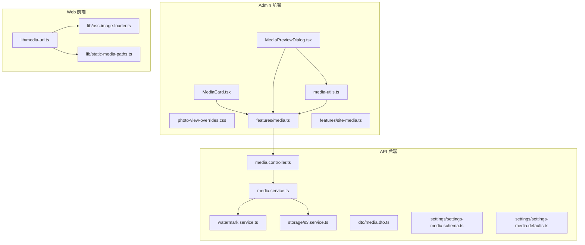
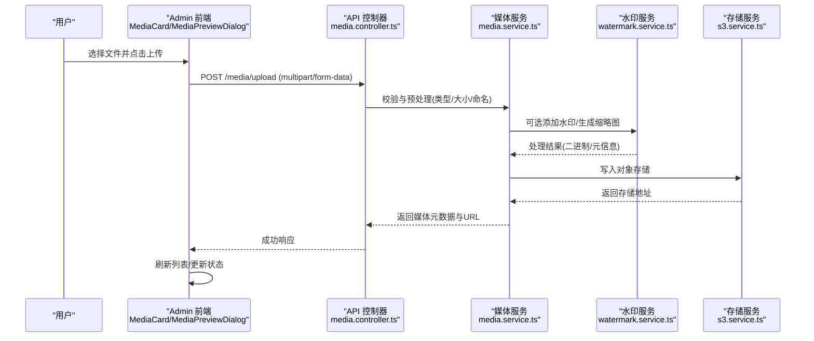
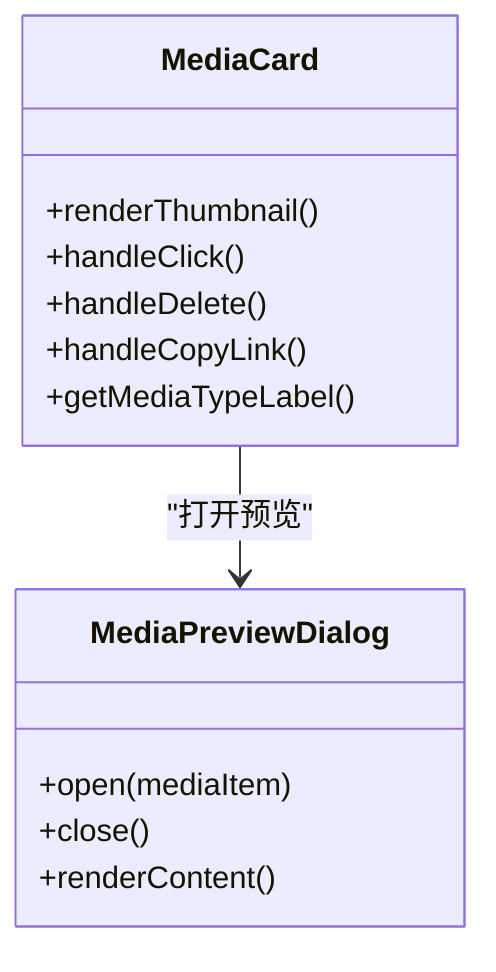
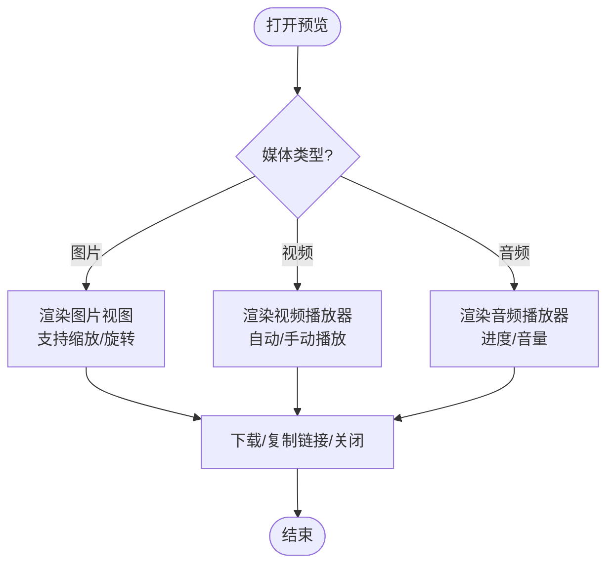
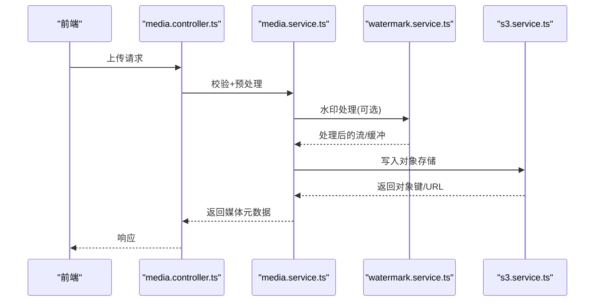
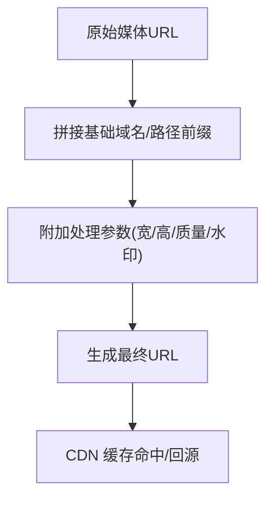
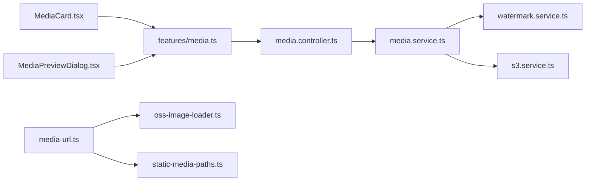

# 媒体管理组件

<cite>
**本文引用的文件**
- [MediaCard.tsx](file://apps/admin/src/components/media/MediaCard.tsx)
- [MediaPreviewDialog.tsx](file://apps/admin/src/components/media/MediaPreviewDialog.tsx)
- [media-utils.ts](file://apps/admin/src/components/media/media-utils.ts)
- [photo-view-overrides.css](file://apps/admin/src/components/media/photo-view-overrides.css)
- [media.ts](file://apps/admin/src/features/media.ts)
- [site-media.ts](file://apps/admin/src/features/site-media.ts)
- [media.controller.ts](file://apps/api/src/media/media.controller.ts)
- [media.service.ts](file://apps/api/src/media/media.service.ts)
- [watermark.service.ts](file://apps/api/src/media/watermark.service.ts)
- [media.dto.ts](file://apps/api/src/media/dto/media.dto.ts)
- [s3.service.ts](file://apps/api/src/storage/s3.service.ts)
- [settings-media.schema.ts](file://apps/api/src/settings/settings-media.schema.ts)
- [settings-media.defaults.ts](file://apps/api/src/settings/settings-media.defaults.ts)
- [media-url.ts](file://apps/admin/src/lib/media-url.ts)
- [oss-image-loader.ts](file://apps/web/src/lib/oss-image-loader.ts)
- [static-media-paths.ts](file://apps/web/src/lib/static-media-paths.ts)
</cite>

## 目录
1. [简介](#简介)
2. [项目结构](#项目结构)
3. [核心组件](#核心组件)
4. [架构总览](#架构总览)
5. [详细组件分析](#详细组件分析)
6. [依赖关系分析](#依赖关系分析)
7. [性能考虑](#性能考虑)
8. [故障排查指南](#故障排查指南)
9. [结论](#结论)
10. [附录](#附录)

## 简介
本文件面向“媒体管理组件”的完整实现与使用，覆盖前端媒体卡片、预览对话框、工具函数，以及后端上传、存储、水印、缩略图生成、格式转换、URL 生成与 CDN 集成等能力。文档旨在帮助开发者快速理解并扩展媒体库的搜索、分类与批量操作功能，并提供性能优化与问题定位建议。

## 项目结构
媒体相关代码横跨 admin（控制台前端）、api（后端服务）与 web（公开站点前端）三个应用：
- admin 前端：提供媒体卡片展示、预览对话框、媒体选择器与工具函数
- api 后端：提供媒体上传、元数据管理、水印处理、缩略图与格式转换、存储适配
- web 前端：提供媒体 URL 生成、图片加载器与静态路径解析

图表来源
- [MediaCard.tsx](file://apps/admin/src/components/media/MediaCard.tsx)
- [MediaPreviewDialog.tsx](file://apps/admin/src/components/media/MediaPreviewDialog.tsx)
- [media-utils.ts](file://apps/admin/src/components/media/media-utils.ts)
- [media.ts](file://apps/admin/src/features/media.ts)
- [media.controller.ts](file://apps/api/src/media/media.controller.ts)
- [media.service.ts](file://apps/api/src/media/media.service.ts)
- [watermark.service.ts](file://apps/api/src/media/watermark.service.ts)
- [s3.service.ts](file://apps/api/src/storage/s3.service.ts)
- [media-url.ts](file://apps/admin/src/lib/media-url.ts)
- [oss-image-loader.ts](file://apps/web/src/lib/oss-image-loader.ts)
- [static-media-paths.ts](file://apps/web/src/lib/static-media-paths.ts)

章节来源
- [media.controller.ts](file://apps/api/src/media/media.controller.ts)
- [media.service.ts](file://apps/api/src/media/media.service.ts)
- [media.ts](file://apps/admin/src/features/media.ts)

## 核心组件
- MediaCard：媒体列表中的单条卡片，负责渲染不同类型媒体的缩略图/封面、名称、尺寸、类型标签、操作按钮（预览、删除、复制链接等），支持键盘导航与无障碍属性。
- MediaPreviewDialog：全屏或模态预览，支持图片缩放、视频播放、音频播放与下载；根据媒体类型切换渲染策略。
- media-utils：媒体类型判断、MIME 映射、缩略图占位符生成、文件名规范化、大小格式化、URL 拼接与参数构建等工具方法。

章节来源
- [MediaCard.tsx](file://apps/admin/src/components/media/MediaCard.tsx)
- [MediaPreviewDialog.tsx](file://apps/admin/src/components/media/MediaPreviewDialog.tsx)
- [media-utils.ts](file://apps/admin/src/components/media/media-utils.ts)

## 架构总览
媒体管理采用前后端分离架构：
- 前端通过 features/media.ts 调用 API 层接口，完成上传、查询、删除等操作
- 后端控制器接收请求，交由服务层进行业务处理（校验、转码、水印、缩略图、存储）
- 存储服务抽象对接对象存储（如 S3/OSS），统一返回可访问的媒体 URL
- Web 端通过媒体 URL 生成器与图片加载器，结合 CDN 参数实现按需裁剪与缓存

图表来源
- [media.controller.ts](file://apps/api/src/media/media.controller.ts)
- [media.service.ts](file://apps/api/src/media/media.service.ts)
- [watermark.service.ts](file://apps/api/src/media/watermark.service.ts)
- [s3.service.ts](file://apps/api/src/storage/s3.service.ts)

## 详细组件分析

### MediaCard 媒体卡片
- 职责：渲染媒体项、显示类型图标与缩略图、暴露预览与删除入口、支持多选与批量操作
- 交互：点击打开预览对话框；右键或长按弹出操作菜单；支持拖拽排序（若启用）
- 数据：从媒体列表获取元数据（名称、类型、尺寸、创建时间、URL）
- 可访问性：为图片设置 alt，为按钮设置 aria-label，支持键盘焦点与回车触发

图表来源
- [MediaCard.tsx](file://apps/admin/src/components/media/MediaCard.tsx)
- [MediaPreviewDialog.tsx](file://apps/admin/src/components/media/MediaPreviewDialog.tsx)

章节来源
- [MediaCard.tsx](file://apps/admin/src/components/media/MediaCard.tsx)
- [MediaPreviewDialog.tsx](file://apps/admin/src/components/media/MediaPreviewDialog.tsx)

### MediaPreviewDialog 预览对话框
- 职责：以模态形式预览图片/视频/音频，支持缩放、旋转、全屏、下载与分享链接
- 行为：根据媒体类型动态选择渲染器；对视频自动播放控制；对音频提供播放控件
- 样式：通过 photo-view-overrides.css 覆盖第三方图库样式，保证一致体验

图表来源
- [MediaPreviewDialog.tsx](file://apps/admin/src/components/media/MediaPreviewDialog.tsx)
- [photo-view-overrides.css](file://apps/admin/src/components/media/photo-view-overrides.css)

章节来源
- [MediaPreviewDialog.tsx](file://apps/admin/src/components/media/MediaPreviewDialog.tsx)
- [photo-view-overrides.css](file://apps/admin/src/components/media/photo-view-overrides.css)

### media-utils 媒体工具函数
- 类型识别：基于 MIME 与扩展名判断图片/视频/音频类型
- 文件名规范：去除非法字符、限制长度、生成唯一后缀
- 尺寸格式化：将字节转换为 KB/MB/GB 可读文本
- URL 构建：拼接基础域名、路径与查询参数（如尺寸、质量、水印开关）

图表来源
- [media-utils.ts](file://apps/admin/src/components/media/media-utils.ts)

章节来源
- [media-utils.ts](file://apps/admin/src/components/media/media-utils.ts)

### 媒体功能模块 features/media.ts
- 职责：封装媒体相关的 API 调用（上传、列表、删除、批量操作）、错误处理与重试逻辑
- 数据流：将后端返回的媒体元数据转换为前端可用的数据结构，维护本地状态与缓存

章节来源
- [media.ts](file://apps/admin/src/features/media.ts)

### 站点媒体配置 features/site-media.ts
- 职责：读取站点级媒体配置（默认压缩、水印开关、CDN 域名、最大尺寸等）
- 作用：为前端渲染与 URL 生成提供默认策略

章节来源
- [site-media.ts](file://apps/admin/src/features/site-media.ts)

### 后端媒体控制器与媒体服务
- media.controller.ts：定义上传、列表、删除、批量操作的 HTTP 路由与参数校验
- media.service.ts：编排上传流程（校验、转码、水印、缩略图、存储、索引）
- watermark.service.ts：实现图片/视频水印叠加、位置与透明度控制
- s3.service.ts：封装对象存储上传、下载、删除与签名 URL 生成

图表来源
- [media.controller.ts](file://apps/api/src/media/media.controller.ts)
- [media.service.ts](file://apps/api/src/media/media.service.ts)
- [watermark.service.ts](file://apps/api/src/media/watermark.service.ts)
- [s3.service.ts](file://apps/api/src/storage/s3.service.ts)

章节来源
- [media.controller.ts](file://apps/api/src/media/media.controller.ts)
- [media.service.ts](file://apps/api/src/media/media.service.ts)
- [watermark.service.ts](file://apps/api/src/media/watermark.service.ts)
- [s3.service.ts](file://apps/api/src/storage/s3.service.ts)

### DTO 与配置
- media.dto.ts：定义上传与查询参数的校验规则（类型、大小、分页、排序）
- settings-media.schema.ts：媒体设置的 JSON Schema（压缩、水印、CDN、格式策略）
- settings-media.defaults.ts：默认值（如默认质量、默认水印位置）

章节来源
- [media.dto.ts](file://apps/api/src/media/dto/media.dto.ts)
- [settings-media.schema.ts](file://apps/api/src/settings/settings-media.schema.ts)
- [settings-media.defaults.ts](file://apps/api/src/settings/settings-media.defaults.ts)

### 媒体 URL 生成与 CDN 集成
- lib/media-url.ts：统一生成媒体访问 URL，支持路径前缀、查询参数（尺寸、质量、水印开关）
- oss-image-loader.ts：Next.js 图片加载器，对接对象存储的图片处理服务，实现按需裁剪与缓存
- static-media-paths.ts：静态媒体路径解析，用于服务端渲染与预取

图表来源
- [media-url.ts](file://apps/admin/src/lib/media-url.ts)
- [oss-image-loader.ts](file://apps/web/src/lib/oss-image-loader.ts)
- [static-media-paths.ts](file://apps/web/src/lib/static-media-paths.ts)

章节来源
- [media-url.ts](file://apps/admin/src/lib/media-url.ts)
- [oss-image-loader.ts](file://apps/web/src/lib/oss-image-loader.ts)
- [static-media-paths.ts](file://apps/web/src/lib/static-media-paths.ts)

## 依赖关系分析
- 前端组件依赖 features/media.ts 提供的 API 封装
- features/media.ts 依赖后端媒体控制器路由
- 后端媒体服务依赖水印服务与存储服务
- Web 端媒体 URL 生成依赖对象存储图片处理能力与 CDN

图表来源
- [MediaCard.tsx](file://apps/admin/src/components/media/MediaCard.tsx)
- [MediaPreviewDialog.tsx](file://apps/admin/src/components/media/MediaPreviewDialog.tsx)
- [media.ts](file://apps/admin/src/features/media.ts)
- [media.controller.ts](file://apps/api/src/media/media.controller.ts)
- [media.service.ts](file://apps/api/src/media/media.service.ts)
- [watermark.service.ts](file://apps/api/src/media/watermark.service.ts)
- [s3.service.ts](file://apps/api/src/storage/s3.service.ts)
- [media-url.ts](file://apps/admin/src/lib/media-url.ts)
- [oss-image-loader.ts](file://apps/web/src/lib/oss-image-loader.ts)
- [static-media-paths.ts](file://apps/web/src/lib/static-media-paths.ts)

章节来源
- [media.ts](file://apps/admin/src/features/media.ts)
- [media.controller.ts](file://apps/api/src/media/media.controller.ts)
- [media.service.ts](file://apps/api/src/media/media.service.ts)

## 性能考虑
- 缩略图与按需裁剪：通过 URL 参数指定宽高与质量，减少带宽与首屏加载时间
- CDN 缓存：合理设置缓存头与版本号，利用边缘节点就近分发
- 懒加载与占位：图片懒加载与占位图提升滚动性能
- 并发上传：分片与并行上传，失败重试与断点续传
- 资源清理：定期清理未引用媒体与临时文件，释放存储空间

## 故障排查指南
- 上传失败：检查文件大小与类型限制、网络超时、对象存储权限与 CORS 配置
- 水印异常：确认水印素材路径、透明度与位置参数是否合法
- 预览空白：核对媒体 URL 是否有效、CDN 是否回源失败、浏览器是否支持该媒体格式
- 列表不更新：确认 API 响应结构与前端期望字段一致，检查缓存失效策略

章节来源
- [media.controller.ts](file://apps/api/src/media/media.controller.ts)
- [media.service.ts](file://apps/api/src/media/media.service.ts)
- [watermark.service.ts](file://apps/api/src/media/watermark.service.ts)
- [s3.service.ts](file://apps/api/src/storage/s3.service.ts)

## 结论
媒体管理组件通过清晰的前后端分层与统一的 URL 生成策略，实现了多类型媒体的上传、存储、预览与高效分发。借助水印服务与对象存储处理能力，系统可在保证安全与品牌一致性的同时，提供良好的用户体验与可扩展性。建议在后续迭代中持续完善搜索与分类能力、批量操作与审计日志，并结合 CDN 与缓存策略进一步优化性能。

## 附录
- 常见媒体类型与 MIME 映射参考：image/jpeg, image/png, video/mp4, audio/mpeg 等
- 推荐的文件命名规范：按日期/业务维度组织，避免特殊字符，保留扩展名
- 水印最佳实践：低透明度、右下角或居中、避免遮挡关键内容