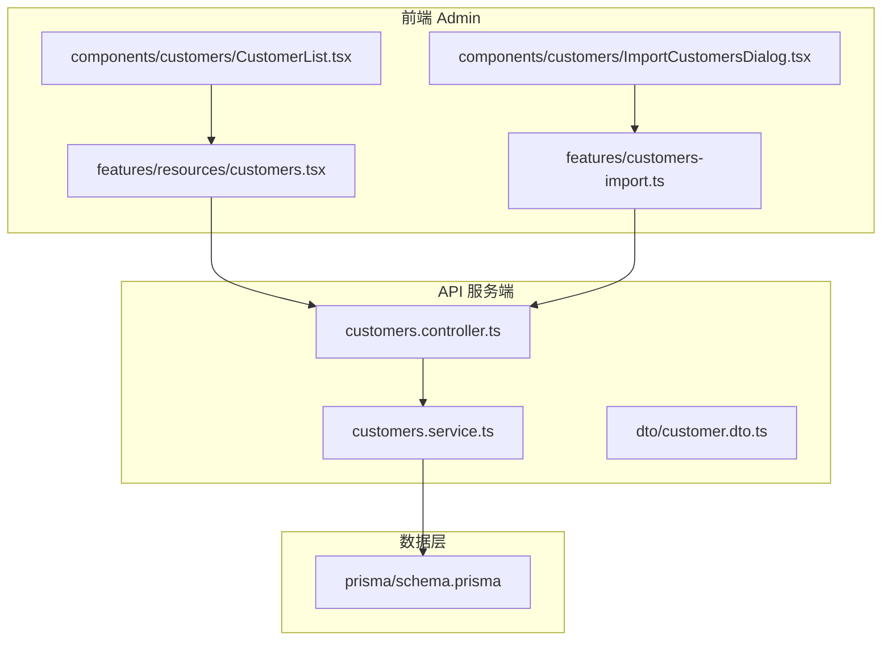
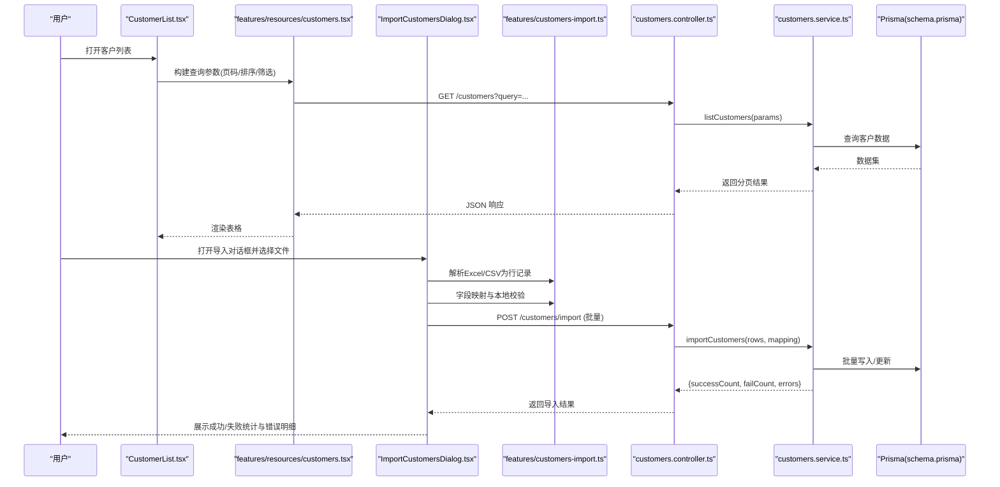
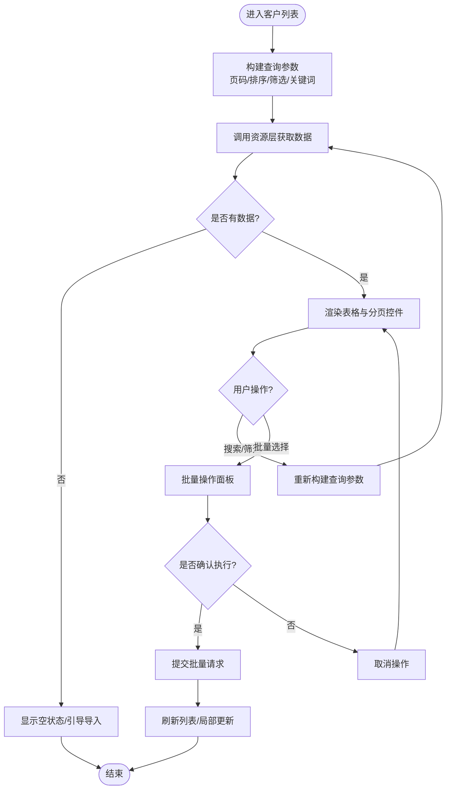
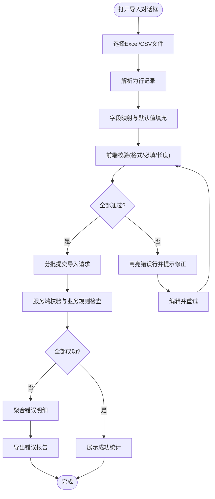
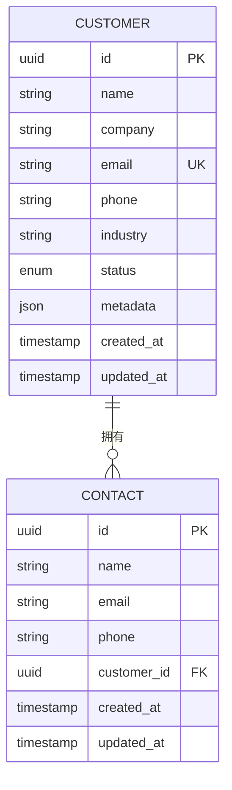
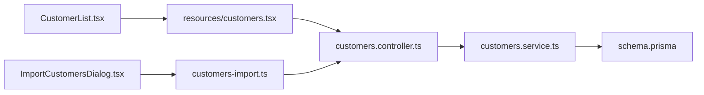

# 客户管理组件

<cite>
**本文引用的文件**   
- [CustomerList.tsx](file://apps/admin/src/components/customers/CustomerList.tsx)
- [ImportCustomersDialog.tsx](file://apps/admin/src/components/customers/ImportCustomersDialog.tsx)
- [customers.tsx](file://apps/admin/src/features/resources/customers.tsx)
- [customers-import.ts](file://apps/admin/src/features/customers-import.ts)
- [customer.dto.ts](file://apps/api/src/customers/dto/customer.dto.ts)
- [customers.controller.ts](file://apps/api/src/customers/customers.controller.ts)
- [customers.service.ts](file://apps/api/src/customers/customers.service.ts)
- [schema.prisma](file://apps/api/prisma/schema.prisma)
</cite>

## 目录
1. [简介](#简介)
2. [项目结构](#项目结构)
3. [核心组件](#核心组件)
4. [架构总览](#架构总览)
5. [详细组件分析](#详细组件分析)
6. [依赖关系分析](#依赖关系分析)
7. [性能考虑](#性能考虑)
8. [故障排查指南](#故障排查指南)
9. [结论](#结论)
10. [附录](#附录)

## 简介
本文件面向“客户管理”功能的前后端实现，重点围绕以下两个前端组件展开：
- CustomerList（客户列表）：负责展示、搜索、筛选与批量操作。
- ImportCustomersDialog（导入对话框）：负责 Excel/CSV 文件上传、解析、字段映射、数据校验与错误处理。

同时，文档将解释客户状态管理、联系人关联与客户画像的实现思路，并给出数据导入模板格式、字段映射规则以及异常处理的最佳实践。

## 项目结构
客户管理相关代码分布在 admin 应用的前端组件与 features 层，以及 api 服务端的控制器、服务与 DTO 中。数据库模型定义在 Prisma schema 中。

图表来源
- [CustomerList.tsx](file://apps/admin/src/components/customers/CustomerList.tsx)
- [ImportCustomersDialog.tsx](file://apps/admin/src/components/customers/ImportCustomersDialog.tsx)
- [customers.tsx](file://apps/admin/src/features/resources/customers.tsx)
- [customers-import.ts](file://apps/admin/src/features/customers-import.ts)
- [customers.controller.ts](file://apps/api/src/customers/customers.controller.ts)
- [customers.service.ts](file://apps/api/src/customers/customers.service.ts)
- [customer.dto.ts](file://apps/api/src/customers/dto/customer.dto.ts)
- [schema.prisma](file://apps/api/prisma/schema.prisma)

章节来源
- [CustomerList.tsx](file://apps/admin/src/components/customers/CustomerList.tsx)
- [ImportCustomersDialog.tsx](file://apps/admin/src/components/customers/ImportCustomersDialog.tsx)
- [customers.tsx](file://apps/admin/src/features/resources/customers.tsx)
- [customers-import.ts](file://apps/admin/src/features/customers-import.ts)
- [customers.controller.ts](file://apps/api/src/customers/customers.controller.ts)
- [customers.service.ts](file://apps/api/src/customers/customers.service.ts)
- [customer.dto.ts](file://apps/api/src/customers/dto/customer.dto.ts)
- [schema.prisma](file://apps/api/prisma/schema.prisma)

## 核心组件
- CustomerList（客户列表）
  - 职责：分页加载客户数据；提供关键词搜索与多条件筛选；支持多选与批量操作（如批量删除、批量更新状态等）。
  - 交互要点：表格列配置、排序、分页、选择行、批量工具栏、详情查看入口。
  - 数据流：从资源层 customers.tsx 获取查询参数与结果，调用 API 控制器接口。

- ImportCustomersDialog（导入对话框）
  - 职责：接收 Excel/CSV 文件；解析为结构化数据；进行字段映射与校验；提交批量创建或更新；汇总错误行并提示用户。
  - 交互要点：文件选择、预览、字段映射表、进度条、错误报告下载。
  - 数据流：通过 customers-import.ts 组织导入任务，调用 API 的导入接口，服务端返回成功/失败统计与明细。

章节来源
- [CustomerList.tsx](file://apps/admin/src/components/customers/CustomerList.tsx)
- [ImportCustomersDialog.tsx](file://apps/admin/src/components/customers/ImportCustomersDialog.tsx)
- [customers.tsx](file://apps/admin/src/features/resources/customers.tsx)
- [customers-import.ts](file://apps/admin/src/features/customers-import.ts)

## 架构总览
下图展示了从 UI 到 API 再到数据层的完整流程，包括列表查询与导入两条主路径。

图表来源
- [CustomerList.tsx](file://apps/admin/src/components/customers/CustomerList.tsx)
- [customers.tsx](file://apps/admin/src/features/resources/customers.tsx)
- [ImportCustomersDialog.tsx](file://apps/admin/src/components/customers/ImportCustomersDialog.tsx)
- [customers-import.ts](file://apps/admin/src/features/customers-import.ts)
- [customers.controller.ts](file://apps/api/src/customers/customers.controller.ts)
- [customers.service.ts](file://apps/api/src/customers/customers.service.ts)
- [schema.prisma](file://apps/api/prisma/schema.prisma)

## 详细组件分析

### CustomerList（客户列表）
- 展示与分页
  - 通过资源层封装的查询方法拉取数据，支持分页、排序与列显示控制。
- 搜索与筛选
  - 关键词搜索：对姓名、公司名、邮箱等字段进行模糊匹配。
  - 多维筛选：按状态、标签、创建时间范围等过滤。
- 批量操作
  - 支持多选行后执行批量删除、批量修改状态、批量打标签等操作。
  - 批量操作前进行二次确认，失败时逐行反馈。
- 状态管理与缓存
  - 使用 React Query 或类似机制缓存列表数据，避免重复请求。
  - 在导入成功后触发列表刷新或增量更新。

图表来源
- [CustomerList.tsx](file://apps/admin/src/components/customers/CustomerList.tsx)
- [customers.tsx](file://apps/admin/src/features/resources/customers.tsx)

章节来源
- [CustomerList.tsx](file://apps/admin/src/components/customers/CustomerList.tsx)
- [customers.tsx](file://apps/admin/src/features/resources/customers.tsx)

### ImportCustomersDialog（导入对话框）
- 文件解析
  - 支持 .xlsx/.xls/.csv 文件读取，转换为行级记录数组。
  - 自动识别分隔符与编码，必要时提供手动设置选项。
- 字段映射
  - 提供可视化映射界面，将文件列映射到系统字段（如公司名称、联系人、邮箱、电话、地址、行业、来源、备注等）。
  - 支持默认值、必填校验、去重策略（按邮箱/手机号/统一社会信用代码等）。
- 数据校验
  - 前端基础校验（类型、长度、格式），后端严格校验（业务规则、唯一性、关联实体存在性）。
  - 对错误行生成详细错误信息，支持导出错误报告。
- 批量提交与错误处理
  - 分批次提交，避免单次请求过大。
  - 服务端返回成功数、失败数与错误明细，前端聚合展示并可下载。

图表来源
- [ImportCustomersDialog.tsx](file://apps/admin/src/components/customers/ImportCustomersDialog.tsx)
- [customers-import.ts](file://apps/admin/src/features/customers-import.ts)
- [customers.controller.ts](file://apps/api/src/customers/customers.controller.ts)
- [customers.service.ts](file://apps/api/src/customers/customers.service.ts)

章节来源
- [ImportCustomersDialog.tsx](file://apps/admin/src/components/customers/ImportCustomersDialog.tsx)
- [customers-import.ts](file://apps/admin/src/features/customers-import.ts)
- [customers.controller.ts](file://apps/api/src/customers/customers.controller.ts)
- [customers.service.ts](file://apps/api/src/customers/customers.service.ts)

### 数据模型与关系（Prisma）
- 客户实体包含基本信息、联系方式、来源、状态、标签等字段。
- 与联系人实体的关联：一个客户可拥有多个联系人，或通过外部 ID 关联。
- 客户画像：基于行为数据、交易记录、标签与评分等维度形成综合画像。

图表来源
- [schema.prisma](file://apps/api/prisma/schema.prisma)

章节来源
- [schema.prisma](file://apps/api/prisma/schema.prisma)

### 状态管理、联系人关联与客户画像
- 状态管理
  - 列表状态：分页、排序、筛选条件、选中行集合。
  - 导入状态：文件解析进度、映射配置、校验结果、错误明细。
- 联系人关联
  - 导入时可指定联系人字段映射，建立与现有联系人的关联或新建联系人。
  - 支持根据邮箱/手机号去重合并。
- 客户画像
  - 通过元数据字段存储画像标签、评分、来源渠道等，便于后续分析与营销。

章节来源
- [CustomerList.tsx](file://apps/admin/src/components/customers/CustomerList.tsx)
- [ImportCustomersDialog.tsx](file://apps/admin/src/components/customers/ImportCustomersDialog.tsx)
- [customers-import.ts](file://apps/admin/src/features/customers-import.ts)
- [schema.prisma](file://apps/api/prisma/schema.prisma)

## 依赖关系分析
- 前端依赖
  - CustomerList 依赖 resources/customers.tsx 提供的查询能力。
  - ImportCustomersDialog 依赖 features/customers-import.ts 的导入逻辑。
- 后端依赖
  - customers.controller.ts 暴露 REST 接口，接收列表查询与导入请求。
  - customers.service.ts 实现业务逻辑，调用 Prisma 访问数据库。
  - DTO 定义用于输入验证与输出格式化。

图表来源
- [CustomerList.tsx](file://apps/admin/src/components/customers/CustomerList.tsx)
- [customers.tsx](file://apps/admin/src/features/resources/customers.tsx)
- [ImportCustomersDialog.tsx](file://apps/admin/src/components/customers/ImportCustomersDialog.tsx)
- [customers-import.ts](file://apps/admin/src/features/customers-import.ts)
- [customers.controller.ts](file://apps/api/src/customers/customers.controller.ts)
- [customers.service.ts](file://apps/api/src/customers/customers.service.ts)
- [schema.prisma](file://apps/api/prisma/schema.prisma)

章节来源
- [customers.controller.ts](file://apps/api/src/customers/customers.controller.ts)
- [customers.service.ts](file://apps/api/src/customers/customers.service.ts)
- [customer.dto.ts](file://apps/api/src/customers/dto/customer.dto.ts)

## 性能考虑
- 列表查询
  - 使用分页与按需加载，避免一次性拉取大量数据。
  - 对常用筛选条件建立索引（后端数据库层面）。
- 导入性能
  - 分批次提交导入请求，限制每批大小（例如 200-500 行）。
  - 并行度控制：避免过多并发导致数据库锁竞争。
  - 预处理与去重：在前端进行初步去重，减少无效请求。
- 缓存与失效
  - 列表数据缓存，导入成功后主动失效或增量更新。
  - 对热点字段（如状态、标签）做局部更新，减少全量刷新。

[本节为通用指导，不直接分析具体文件]

## 故障排查指南
- 导入失败常见原因
  - 文件格式不支持或编码异常：确保 .xlsx/.csv 且 UTF-8 编码。
  - 字段映射错误：检查列头与系统字段映射是否正确。
  - 数据校验失败：必填缺失、格式不符、唯一性冲突（邮箱/手机号重复）。
  - 关联实体不存在：联系人或外部 ID 无法匹配。
- 定位步骤
  - 查看导入对话框的错误报告，定位问题行与错误信息。
  - 在后端日志中检索导入任务的错误堆栈与事务回滚信息。
  - 核对 DTO 校验规则与数据库约束。
- 修复建议
  - 修正源数据格式与内容，重新映射字段。
  - 调整去重策略与默认值，避免冲突。
  - 对批量操作增加重试与幂等机制，防止重复写入。

章节来源
- [ImportCustomersDialog.tsx](file://apps/admin/src/components/customers/ImportCustomersDialog.tsx)
- [customers-import.ts](file://apps/admin/src/features/customers-import.ts)
- [customer.dto.ts](file://apps/api/src/customers/dto/customer.dto.ts)

## 结论
CustomerList 与 ImportCustomersDialog 共同构成了完整的客户管理能力：前者提供高效的数据浏览与批量操作，后者提供健壮的数据导入与错误处理能力。通过清晰的依赖关系与分层设计，前后端协作顺畅，数据一致性得到保障。遵循本文的模板规范、字段映射规则与异常处理最佳实践，可显著提升导入成功率与用户体验。

[本节为总结性内容，不直接分析具体文件]

## 附录

### 数据导入模板格式与字段映射规则
- 推荐模板字段
  - 公司名称、联系人姓名、邮箱、电话、行业、来源、备注、状态、标签、外部ID（可选）
- 字段映射规则
  - 必填字段：公司名称、联系人姓名、邮箱（或电话至少其一）
  - 唯一性：邮箱或电话作为去重键，重复则跳过或更新
  - 枚举值：状态需匹配系统定义（如“潜在客户”“已成交”“流失”）
  - 日期与金额：统一格式（如 YYYY-MM-DD），金额保留两位小数
- 错误处理最佳实践
  - 前端即时校验并高亮错误行
  - 服务端返回结构化错误（行号、字段、错误原因）
  - 支持导出错误报告与部分成功统计

[本节为概念性说明，不直接分析具体文件]