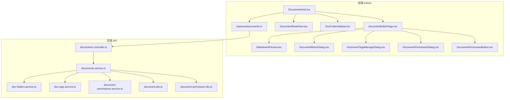
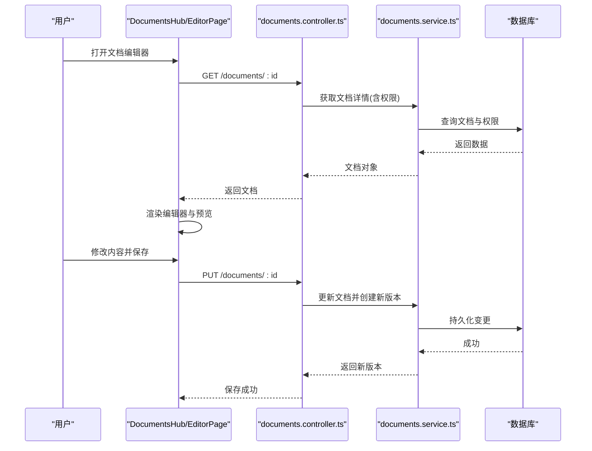
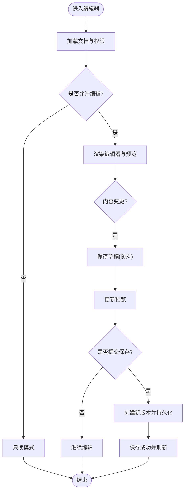
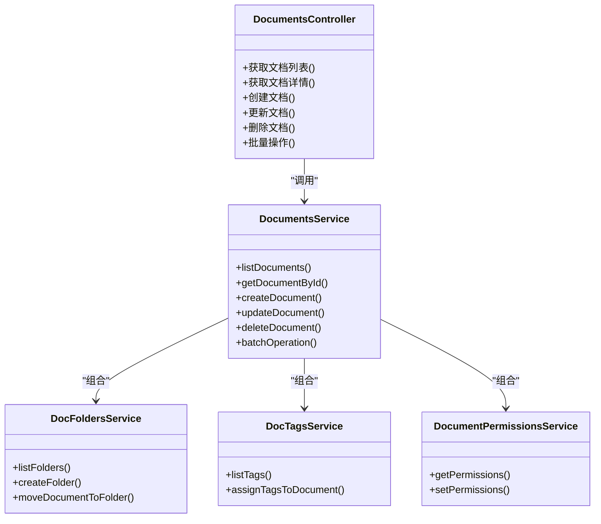

# 文档管理组件

<cite>
**本文引用的文件**   
- [DocumentsHub.tsx](file://apps/admin/src/components/documents/DocumentsHub.tsx)
- [DocumentEditorPage.tsx](file://apps/admin/src/components/documents/DocumentEditorPage.tsx)
- [DocumentReadView.tsx](file://apps/admin/src/components/documents/DocumentReadView.tsx)
- [DocFolderSidebar.tsx](file://apps/admin/src/components/documents/DocFolderSidebar.tsx)
- [MarkdownPreview.tsx](file://apps/admin/src/components/documents/MarkdownPreview.tsx)
- [DocumentMoveDialog.tsx](file://apps/admin/src/components/documents/DocumentMoveDialog.tsx)
- [DocumentTagsManageDialog.tsx](file://apps/admin/src/components/documents/DocumentTagsManageDialog.tsx)
- [DocumentPermissionButton.tsx](file://apps/admin/src/components/DocumentPermissionButton.tsx)
- [DocumentPermissionDialog.tsx](file://apps/admin/src/components/DocumentPermissionDialog.tsx)
- [documents.ts](file://apps/admin/src/features/documents.ts)
- [documents.controller.ts](file://apps/api/src/documents/documents.controller.ts)
- [documents.service.ts](file://apps/api/src/documents/documents.service.ts)
- [doc-folders.service.ts](file://apps/api/src/documents/doc-folders.service.ts)
- [doc-tags.service.ts](file://apps/api/src/documents/doc-tags.service.ts)
- [document-permissions.service.ts](file://apps/api/src/documents/document-permissions.service.ts)
- [document.dto.ts](file://apps/api/src/documents/dto/document.dto.ts)
- [document-permission.dto.ts](file://apps/api/src/documents/dto/document-permission.dto.ts)
</cite>

## 目录
1. [简介](#简介)
2. [项目结构](#项目结构)
3. [核心组件](#核心组件)
4. [架构总览](#架构总览)
5. [详细组件分析](#详细组件分析)
6. [依赖关系分析](#依赖关系分析)
7. [性能考量](#性能考量)
8. [故障排查指南](#故障排查指南)
9. [结论](#结论)
10. [附录：API 接口说明](#附录api-接口说明)

## 简介
本文件面向“文档管理组件”的完整实现与使用，覆盖以下关键能力：
- 文档树形结构与文件夹导航
- 权限控制（基于角色的访问控制）
- 版本管理与协作编辑
- Markdown 编辑器集成、实时预览与格式转换
- 标签系统与搜索
- 分享机制
- 文档迁移与批量操作 API

该组件由前端 admin 应用中的 React 组件与后端 NestJS 服务共同构成，通过 RESTful API 进行数据交互。

## 项目结构
文档管理相关的前端组件位于 apps/admin/src/components/documents，后端控制器与服务位于 apps/api/src/documents。核心文件包括：
- 前端容器与页面：DocumentsHub、DocumentEditorPage、DocumentReadView、DocFolderSidebar
- 功能对话框：DocumentMoveDialog、DocumentTagsManageDialog、DocumentPermissionDialog、DocumentPermissionButton
- 预览与工具：MarkdownPreview
- 前端特性层：features/documents.ts（封装查询与状态）
- 后端控制器与服务：documents.controller.ts、documents.service.ts、doc-folders.service.ts、doc-tags.service.ts、document-permissions.service.ts
- DTO：document.dto.ts、document-permission.dto.ts

图表来源
- [DocumentsHub.tsx](file://apps/admin/src/components/documents/DocumentsHub.tsx)
- [DocumentEditorPage.tsx](file://apps/admin/src/components/documents/DocumentEditorPage.tsx)
- [DocumentReadView.tsx](file://apps/admin/src/components/documents/DocumentReadView.tsx)
- [DocFolderSidebar.tsx](file://apps/admin/src/components/documents/DocFolderSidebar.tsx)
- [MarkdownPreview.tsx](file://apps/admin/src/components/documents/MarkdownPreview.tsx)
- [DocumentMoveDialog.tsx](file://apps/admin/src/components/documents/DocumentMoveDialog.tsx)
- [DocumentTagsManageDialog.tsx](file://apps/admin/src/components/documents/DocumentTagsManageDialog.tsx)
- [DocumentPermissionDialog.tsx](file://apps/admin/src/components/DocumentPermissionDialog.tsx)
- [DocumentPermissionButton.tsx](file://apps/admin/src/components/DocumentPermissionButton.tsx)
- [documents.ts](file://apps/admin/src/features/documents.ts)
- [documents.controller.ts](file://apps/api/src/documents/documents.controller.ts)
- [documents.service.ts](file://apps/api/src/documents/documents.service.ts)
- [doc-folders.service.ts](file://apps/api/src/documents/doc-folders.service.ts)
- [doc-tags.service.ts](file://apps/api/src/documents/doc-tags.service.ts)
- [document-permissions.service.ts](file://apps/api/src/documents/document-permissions.service.ts)
- [document.dto.ts](file://apps/api/src/documents/dto/document.dto.ts)
- [document-permission.dto.ts](file://apps/api/src/documents/dto/document-permission.dto.ts)

章节来源
- [DocumentsHub.tsx](file://apps/admin/src/components/documents/DocumentsHub.tsx)
- [DocumentEditorPage.tsx](file://apps/admin/src/components/documents/DocumentEditorPage.tsx)
- [DocumentReadView.tsx](file://apps/admin/src/components/documents/DocumentReadView.tsx)
- [DocFolderSidebar.tsx](file://apps/admin/src/components/documents/DocFolderSidebar.tsx)
- [documents.ts](file://apps/admin/src/features/documents.ts)
- [documents.controller.ts](file://apps/api/src/documents/documents.controller.ts)
- [documents.service.ts](file://apps/api/src/documents/documents.service.ts)
- [doc-folders.service.ts](file://apps/api/src/documents/doc-folders.service.ts)
- [doc-tags.service.ts](file://apps/api/src/documents/doc-tags.service.ts)
- [document-permissions.service.ts](file://apps/api/src/documents/document-permissions.service.ts)
- [document.dto.ts](file://apps/api/src/documents/dto/document.dto.ts)
- [document-permission.dto.ts](file://apps/api/src/documents/dto/document-permission.dto.ts)

## 核心组件
- DocumentsHub：文档模块主容器，负责路由切换、全局状态、权限校验与子页面装配。
- DocumentEditorPage：文档编辑器页面，集成 Markdown 编辑器、实时预览、保存与版本管理、权限设置入口。
- DocumentReadView：文档阅读视图，渲染 Markdown 内容并支持元信息展示与分享。
- DocFolderSidebar：文件夹侧边栏，提供树形导航、新建/移动/删除等快捷操作。

章节来源
- [DocumentsHub.tsx](file://apps/admin/src/components/documents/DocumentsHub.tsx)
- [DocumentEditorPage.tsx](file://apps/admin/src/components/documents/DocumentEditorPage.tsx)
- [DocumentReadView.tsx](file://apps/admin/src/components/documents/DocumentReadView.tsx)
- [DocFolderSidebar.tsx](file://apps/admin/src/components/documents/DocFolderSidebar.tsx)

## 架构总览
整体采用前后端分离架构：
- 前端以 React + Next.js 构建，组件通过 features/documents.ts 调用后端 API。
- 后端以 NestJS 提供服务，按资源划分控制器与服务，DTO 用于请求/响应校验。
- 权限模型基于角色与资源级权限，结合守卫与装饰器在控制器层进行鉴权。

图表来源
- [DocumentEditorPage.tsx](file://apps/admin/src/components/documents/DocumentEditorPage.tsx)
- [documents.controller.ts](file://apps/api/src/documents/documents.controller.ts)
- [documents.service.ts](file://apps/api/src/documents/documents.service.ts)

## 详细组件分析

### DocumentsHub 主容器
职责：
- 组织文档列表、编辑器、阅读视图与文件夹侧边栏的布局与路由。
- 统一处理权限校验与错误提示。
- 维护当前选中文档、文件夹上下文与全局搜索过滤。

交互要点：
- 根据 URL 参数决定显示列表、编辑器或阅读视图。
- 与 DocFolderSidebar 联动，点击节点加载对应文档或文件夹。
- 将权限按钮与对话框注入到编辑器与阅读视图的工具栏中。

章节来源
- [DocumentsHub.tsx](file://apps/admin/src/components/documents/DocumentsHub.tsx)

### DocumentEditorPage 编辑器页面
职责：
- 集成 Markdown 编辑器与实时预览。
- 提供保存、发布、版本回滚与历史查看。
- 打开权限设置对话框与标签管理对话框。
- 触发文档移动与批量操作的入口。

交互流程：
- 进入页面时拉取文档详情与权限。
- 编辑器内容变化时触发防抖保存草稿。
- 提交保存时创建新版本并刷新预览。
- 打开权限对话框后，通过按钮触发权限更新。

图表来源
- [DocumentEditorPage.tsx](file://apps/admin/src/components/documents/DocumentEditorPage.tsx)
- [MarkdownPreview.tsx](file://apps/admin/src/components/documents/MarkdownPreview.tsx)

章节来源
- [DocumentEditorPage.tsx](file://apps/admin/src/components/documents/DocumentEditorPage.tsx)
- [MarkdownPreview.tsx](file://apps/admin/src/components/documents/MarkdownPreview.tsx)

### DocumentReadView 阅读视图
职责：
- 渲染 Markdown 为 HTML 并展示文档元信息（标题、作者、更新时间、标签等）。
- 提供分享链接生成与权限检查。
- 支持跳转到编辑器（具备编辑权限时）。

章节来源
- [DocumentReadView.tsx](file://apps/admin/src/components/documents/DocumentReadView.tsx)

### DocFolderSidebar 文件夹侧边栏
职责：
- 渲染文件夹树并提供展开/折叠。
- 支持新建文件夹、重命名、删除与移动文档。
- 与 DocumentsHub 同步当前选中节点，驱动文档列表与编辑器加载。

章节来源
- [DocFolderSidebar.tsx](file://apps/admin/src/components/documents/DocFolderSidebar.tsx)

### 标签系统
- 标签管理对话框用于新增、删除、分配标签给文档。
- 标签数据通过 doc-tags.service.ts 暴露，供前端调用。

章节来源
- [DocumentTagsManageDialog.tsx](file://apps/admin/src/components/documents/DocumentTagsManageDialog.tsx)
- [doc-tags.service.ts](file://apps/api/src/documents/doc-tags.service.ts)

### 权限控制
- 权限按钮与对话框用于设置文档级别的访问控制（如仅自己可见、团队可见、公开等）。
- 权限数据通过 document-permissions.service.ts 管理，控制器层使用装饰器进行鉴权。

章节来源
- [DocumentPermissionButton.tsx](file://apps/admin/src/components/DocumentPermissionButton.tsx)
- [DocumentPermissionDialog.tsx](file://apps/admin/src/components/DocumentPermissionDialog.tsx)
- [document-permissions.service.ts](file://apps/api/src/documents/document-permissions.service.ts)
- [documents.controller.ts](file://apps/api/src/documents/documents.controller.ts)

### 文档迁移与批量操作
- 文档移动对话框支持将文档移动到目标文件夹。
- 批量操作可通过控制器提供的批量接口完成（如批量移动、批量删除、批量打标签）。

章节来源
- [DocumentMoveDialog.tsx](file://apps/admin/src/components/documents/DocumentMoveDialog.tsx)
- [documents.controller.ts](file://apps/api/src/documents/documents.controller.ts)
- [documents.service.ts](file://apps/api/src/documents/documents.service.ts)

## 依赖关系分析
- 前端依赖：
  - features/documents.ts 封装了与 documents.controller.ts 的交互逻辑。
  - 各 UI 组件通过 hooks 或状态管理调用这些方法。
- 后端依赖：
  - documents.controller.ts 协调 documents.service.ts 与 DTO。
  - documents.service.ts 组合 doc-folders.service.ts、doc-tags.service.ts、document-permissions.service.ts 完成业务编排。
  - DTO 定义输入输出结构，确保类型安全与校验。

图表来源
- [documents.controller.ts](file://apps/api/src/documents/documents.controller.ts)
- [documents.service.ts](file://apps/api/src/documents/documents.service.ts)
- [doc-folders.service.ts](file://apps/api/src/documents/doc-folders.service.ts)
- [doc-tags.service.ts](file://apps/api/src/documents/doc-tags.service.ts)
- [document-permissions.service.ts](file://apps/api/src/documents/document-permissions.service.ts)

章节来源
- [documents.controller.ts](file://apps/api/src/documents/documents.controller.ts)
- [documents.service.ts](file://apps/api/src/documents/documents.service.ts)
- [doc-folders.service.ts](file://apps/api/src/documents/doc-folders.service.ts)
- [doc-tags.service.ts](file://apps/api/src/documents/doc-tags.service.ts)
- [document-permissions.service.ts](file://apps/api/src/documents/document-permissions.service.ts)

## 性能考量
- 编辑器防抖保存：避免频繁写入导致性能问题。
- 懒加载与分页：文档列表与文件夹树按需加载，减少首屏压力。
- 预览渲染优化：Markdown 转 HTML 可考虑缓存与增量更新。
- 权限校验前置：在控制器层尽早拒绝无权限请求，降低无效计算。

[本节为通用指导，不直接分析具体文件]

## 故障排查指南
常见问题与定位建议：
- 权限不足：检查控制器装饰器与权限服务返回结果，确认用户角色与资源权限匹配。
- 保存失败：查看网络请求与 DTO 校验错误，确认字段完整性与类型正确。
- 预览异常：检查 Markdown 语法与渲染配置，必要时降级为纯文本。
- 移动失败：确认目标文件夹存在且当前用户有操作权限。

章节来源
- [documents.controller.ts](file://apps/api/src/documents/documents.controller.ts)
- [document.dto.ts](file://apps/api/src/documents/dto/document.dto.ts)
- [document-permission.dto.ts](file://apps/api/src/documents/dto/document-permission.dto.ts)

## 结论
文档管理组件通过清晰的前后端分层与模块化设计，实现了树形结构管理、权限控制、版本管理与协作编辑等核心能力。Markdown 编辑器与预览的集成提升了编辑体验，标签系统与搜索增强了检索效率，分享与迁移能力完善了文档生命周期管理。建议在后续迭代中持续优化性能与可用性，并完善错误提示与日志记录。

[本节为总结性内容，不直接分析具体文件]

## 附录：API 接口说明
以下为文档管理相关的主要 API 接口概览（方法与路径以控制器定义为准）：
- 文档 CRUD
  - GET /documents：获取文档列表（支持分页、筛选、排序）
  - GET /documents/:id：获取文档详情（包含权限信息）
  - POST /documents：创建文档
  - PUT /documents/:id：更新文档（自动创建新版本）
  - DELETE /documents/:id：删除文档
- 文件夹管理
  - GET /folders：获取文件夹树
  - POST /folders：新建文件夹
  - PATCH /folders/:id：更新文件夹信息
  - DELETE /folders/:id：删除文件夹
- 标签管理
  - GET /tags：获取标签列表
  - POST /documents/:id/tags：为文档分配标签
  - DELETE /documents/:id/tags：移除文档标签
- 权限管理
  - GET /documents/:id/permissions：获取文档权限
  - PUT /documents/:id/permissions：设置文档权限
- 批量操作
  - POST /documents/batch：批量移动、删除、打标签等操作

章节来源
- [documents.controller.ts](file://apps/api/src/documents/documents.controller.ts)
- [documents.service.ts](file://apps/api/src/documents/documents.service.ts)
- [doc-folders.service.ts](file://apps/api/src/documents/doc-folders.service.ts)
- [doc-tags.service.ts](file://apps/api/src/documents/doc-tags.service.ts)
- [document-permissions.service.ts](file://apps/api/src/documents/document-permissions.service.ts)
- [document.dto.ts](file://apps/api/src/documents/dto/document.dto.ts)
- [document-permission.dto.ts](file://apps/api/src/documents/dto/document-permission.dto.ts)