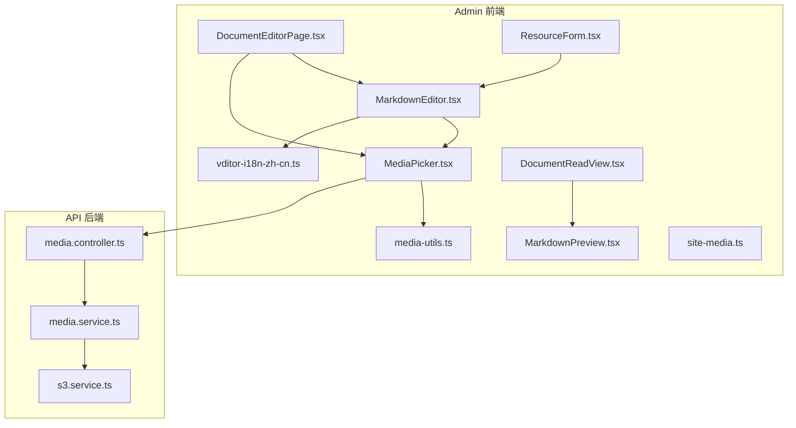
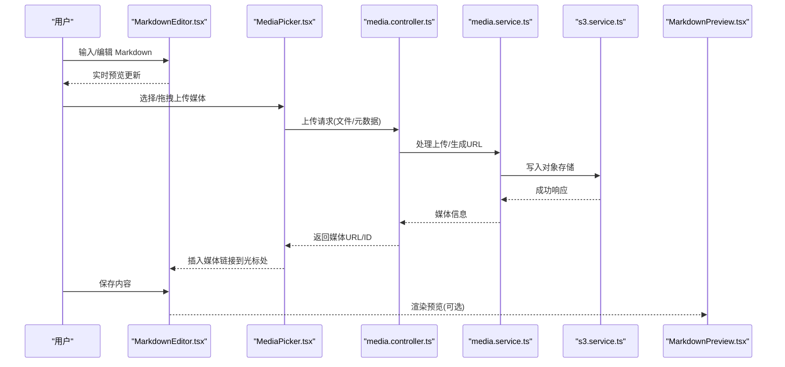
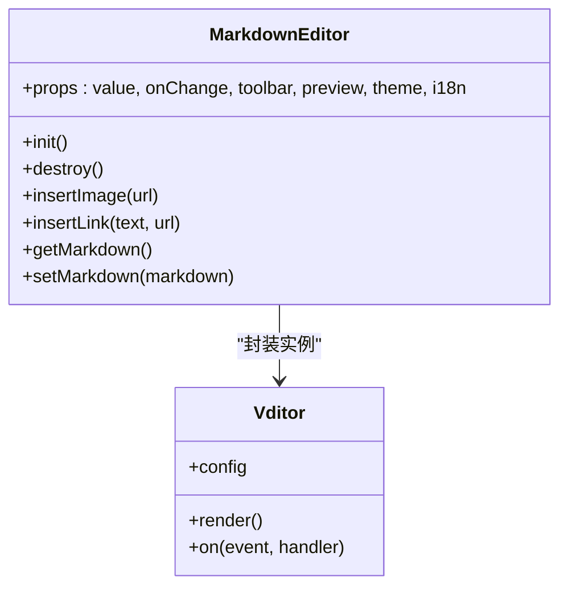
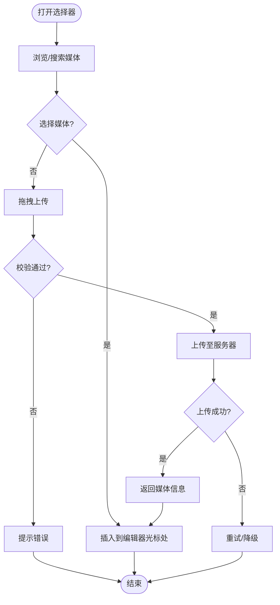
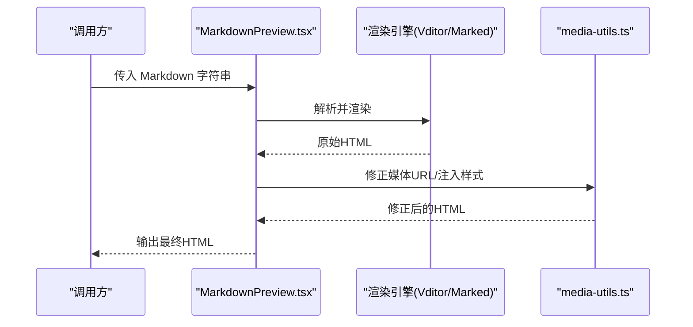
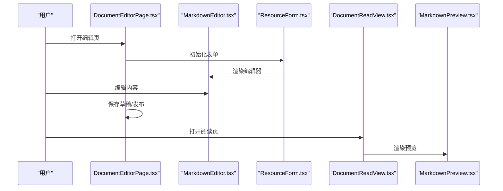
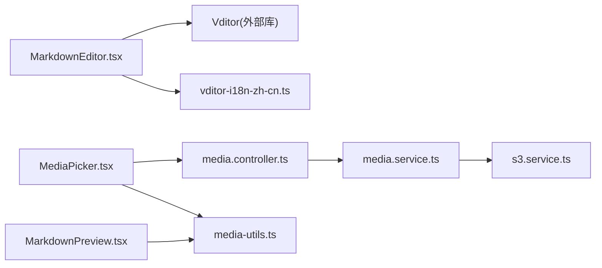

# 编辑器组件

<cite>
**本文引用的文件**   
- [MarkdownEditor.tsx](file://apps/admin/src/components/crud/MarkdownEditor.tsx)
- [MediaPicker.tsx](file://apps/admin/src/components/crud/MediaPicker.tsx)
- [MarkdownPreview.tsx](file://apps/admin/src/components/documents/MarkdownPreview.tsx)
- [vditor-i18n-zh-cn.ts](file://apps/admin/src/lib/vditor-i18n-zh-cn.ts)
- [media-utils.ts](file://apps/admin/src/components/media/media-utils.ts)
- [site-media.ts](file://apps/admin/src/features/site-media.ts)
- [media.controller.ts](file://apps/api/src/media/media.controller.ts)
- [media.service.ts](file://apps/api/src/media/media.service.ts)
- [s3.service.ts](file://apps/api/src/storage/s3.service.ts)
- [DocumentEditorPage.tsx](file://apps/admin/src/components/documents/DocumentEditorPage.tsx)
- [DocumentReadView.tsx](file://apps/admin/src/components/documents/DocumentReadView.tsx)
- [ResourceForm.tsx](file://apps/admin/src/components/crud/ResourceForm.tsx)
</cite>

## 目录
1. [简介](#简介)
2. [项目结构](#项目结构)
3. [核心组件](#核心组件)
4. [架构总览](#架构总览)
5. [详细组件分析](#详细组件分析)
6. [依赖关系分析](#依赖关系分析)
7. [性能考虑](#性能考虑)
8. [故障排查指南](#故障排查指南)
9. [结论](#结论)
10. [附录](#附录)

## 简介
本文件面向编辑器相关的前端与后端实现，系统性说明以下能力：
- MarkdownEditor 富文本编辑器的语法支持、工具栏定制、实时预览与主题/国际化配置。
- MediaPicker 媒体选择器的文件浏览、拖拽上传与插入机制。
- MarkdownPreview 预览组件的渲染策略与样式控制。
- 编辑器与业务数据的绑定方式与内容持久化策略（含媒体资源同步）。
- 插件扩展点与最佳实践建议。

## 项目结构
编辑器相关代码主要分布在 admin 应用的前端组件与 API 服务中：
- 前端组件
  - apps/admin/src/components/crud/MarkdownEditor.tsx：基于 Vditor 的 Markdown 编辑器封装。
  - apps/admin/src/components/crud/MediaPicker.tsx：媒体选择器，提供浏览、上传与插入。
  - apps/admin/src/components/documents/MarkdownPreview.tsx：Markdown 渲染预览。
  - apps/admin/src/lib/vditor-i18n-zh-cn.ts：Vditor 中文本地化文案。
  - apps/admin/src/components/media/media-utils.ts：媒体 URL 处理与类型判断等工具。
  - apps/admin/src/features/site-media.ts：站点媒体相关功能与配置。
  - apps/admin/src/components/documents/DocumentEditorPage.tsx：文档编辑页面，集成编辑器与表单。
  - apps/admin/src/components/documents/DocumentReadView.tsx：文档阅读视图，集成预览。
  - apps/admin/src/components/crud/ResourceForm.tsx：通用资源表单，可嵌入编辑器。
- 后端接口与服务
  - apps/api/src/media/media.controller.ts：媒体上传、列表、删除等接口。
  - apps/api/src/media/media.service.ts：媒体业务逻辑。
  - apps/api/src/storage/s3.service.ts：对象存储（S3/兼容）操作。

图表来源 
- [MarkdownEditor.tsx](file://apps/admin/src/components/crud/MarkdownEditor.tsx)
- [MediaPicker.tsx](file://apps/admin/src/components/crud/MediaPicker.tsx)
- [MarkdownPreview.tsx](file://apps/admin/src/components/documents/MarkdownPreview.tsx)
- [vditor-i18n-zh-cn.ts](file://apps/admin/src/lib/vditor-i18n-zh-cn.ts)
- [media-utils.ts](file://apps/admin/src/components/media/media-utils.ts)
- [site-media.ts](file://apps/admin/src/features/site-media.ts)
- [media.controller.ts](file://apps/api/src/media/media.controller.ts)
- [media.service.ts](file://apps/api/src/media/media.service.ts)
- [s3.service.ts](file://apps/api/src/storage/s3.service.ts)
- [DocumentEditorPage.tsx](file://apps/admin/src/components/documents/DocumentEditorPage.tsx)
- [DocumentReadView.tsx](file://apps/admin/src/components/documents/DocumentReadView.tsx)
- [ResourceForm.tsx](file://apps/admin/src/components/crud/ResourceForm.tsx)

章节来源
- [MarkdownEditor.tsx](file://apps/admin/src/components/crud/MarkdownEditor.tsx)
- [MediaPicker.tsx](file://apps/admin/src/components/crud/MediaPicker.tsx)
- [MarkdownPreview.tsx](file://apps/admin/src/components/documents/MarkdownPreview.tsx)
- [vditor-i18n-zh-cn.ts](file://apps/admin/src/lib/vditor-i18n-zh-cn.ts)
- [media-utils.ts](file://apps/admin/src/components/media/media-utils.ts)
- [site-media.ts](file://apps/admin/src/features/site-media.ts)
- [media.controller.ts](file://apps/api/src/media/media.controller.ts)
- [media.service.ts](file://apps/api/src/media/media.service.ts)
- [s3.service.ts](file://apps/api/src/storage/s3.service.ts)
- [DocumentEditorPage.tsx](file://apps/admin/src/components/documents/DocumentEditorPage.tsx)
- [DocumentReadView.tsx](file://apps/admin/src/components/documents/DocumentReadView.tsx)
- [ResourceForm.tsx](file://apps/admin/src/components/crud/ResourceForm.tsx)

## 核心组件
- MarkdownEditor：基于 Vditor 的 Markdown 编辑器封装，提供工具栏、实时预览、主题与国际化配置、自定义快捷键与插件扩展点。
- MediaPicker：媒体选择器，支持文件夹浏览、搜索过滤、拖拽上传、批量选择与插入到编辑器光标位置。
- MarkdownPreview：将 Markdown 内容渲染为 HTML，并注入站点样式与媒体 URL 修正，保证前后一致展示。

章节来源
- [MarkdownEditor.tsx](file://apps/admin/src/components/crud/MarkdownEditor.tsx)
- [MediaPicker.tsx](file://apps/admin/src/components/crud/MediaPicker.tsx)
- [MarkdownPreview.tsx](file://apps/admin/src/components/documents/MarkdownPreview.tsx)

## 架构总览
编辑器数据流与媒体上传流程如下：
- 编辑器输入 Markdown 文本，实时预览通过 Vditor 渲染。
- 媒体上传由 MediaPicker 发起，调用媒体控制器接口，返回媒体信息后插入编辑器。
- 保存时，编辑器内容作为 Markdown 字符串持久化；媒体资源在对象存储中独立管理，并在 Markdown 中以相对或绝对 URL 引用。
- 预览阶段，MarkdownPreview 对内容进行安全渲染与 URL 修正，确保跨域与路径正确。

图表来源 
- [MarkdownEditor.tsx](file://apps/admin/src/components/crud/MarkdownEditor.tsx)
- [MediaPicker.tsx](file://apps/admin/src/components/crud/MediaPicker.tsx)
- [media.controller.ts](file://apps/api/src/media/media.controller.ts)
- [media.service.ts](file://apps/api/src/media/media.service.ts)
- [s3.service.ts](file://apps/api/src/storage/s3.service.ts)
- [MarkdownPreview.tsx](file://apps/admin/src/components/documents/MarkdownPreview.tsx)

## 详细组件分析

### MarkdownEditor 组件
- 功能要点
  - 基于 Vditor 初始化，支持 Markdown 语法、实时预览、工具栏定制、主题切换与国际化。
  - 提供事件回调（如内容变化、粘贴、图片上传），便于与业务表单集成。
  - 支持快捷键与自定义命令，可扩展插件以增强能力。
- 配置项
  - 工具栏：增删按钮、分组顺序、自定义图标与提示文案。
  - 预览：是否开启实时预览、渲染延迟、预览容器样式。
  - 主题：内置主题与自定义 CSS 覆盖。
  - 国际化：通过 i18n 映射表替换默认文案。
- 与表单集成
  - 受控模式：value 与 onChange 双向绑定，配合 ResourceForm 使用。
  - 非受控模式：内部状态管理，外部通过 ref 获取值。
- 错误处理
  - 初始化失败回退到基础模式。
  - 粘贴大图片或超长内容时的节流与校验。

图表来源 
- [MarkdownEditor.tsx](file://apps/admin/src/components/crud/MarkdownEditor.tsx)

章节来源
- [MarkdownEditor.tsx](file://apps/admin/src/components/crud/MarkdownEditor.tsx)
- [vditor-i18n-zh-cn.ts](file://apps/admin/src/lib/vditor-i18n-zh-cn.ts)
- [ResourceForm.tsx](file://apps/admin/src/components/crud/ResourceForm.tsx)

### MediaPicker 组件
- 功能要点
  - 文件浏览：分页列表、分类筛选、关键词搜索。
  - 拖拽上传：支持多文件、进度条、失败重试。
  - 插入机制：选中媒体后，将 Markdown 链接插入到编辑器当前光标位置。
- 与后端交互
  - 调用媒体控制器接口进行上传与查询。
  - 返回媒体 URL、缩略图、尺寸、MIME 类型等元数据。
- 错误处理
  - 网络异常重试与降级提示。
  - 超大文件或非法类型拦截。

图表来源 
- [MediaPicker.tsx](file://apps/admin/src/components/crud/MediaPicker.tsx)
- [media.controller.ts](file://apps/api/src/media/media.controller.ts)
- [media.service.ts](file://apps/api/src/media/media.service.ts)
- [media-utils.ts](file://apps/admin/src/components/media/media-utils.ts)

章节来源
- [MediaPicker.tsx](file://apps/admin/src/components/crud/MediaPicker.tsx)
- [media.controller.ts](file://apps/api/src/media/media.controller.ts)
- [media.service.ts](file://apps/api/src/media/media.service.ts)
- [media-utils.ts](file://apps/admin/src/components/media/media-utils.ts)

### MarkdownPreview 组件
- 功能要点
  - 将 Markdown 转换为 HTML，注入站点样式，确保与编辑器预览一致。
  - 自动修正媒体 URL，适配不同部署环境（CDN/相对路径）。
  - 支持代码高亮、表格、数学公式等扩展渲染（按需启用）。
- 性能优化
  - 长内容分块渲染与懒加载。
  - 图片占位与延迟加载。

图表来源 
- [MarkdownPreview.tsx](file://apps/admin/src/components/documents/MarkdownPreview.tsx)
- [media-utils.ts](file://apps/admin/src/components/media/media-utils.ts)

章节来源
- [MarkdownPreview.tsx](file://apps/admin/src/components/documents/MarkdownPreview.tsx)
- [media-utils.ts](file://apps/admin/src/components/media/media-utils.ts)

### 文档编辑与预览集成
- DocumentEditorPage：整合 MarkdownEditor 与表单字段，负责数据校验、保存与撤销。
- DocumentReadView：整合 MarkdownPreview，用于阅读视图展示。

图表来源 
- [DocumentEditorPage.tsx](file://apps/admin/src/components/documents/DocumentEditorPage.tsx)
- [DocumentReadView.tsx](file://apps/admin/src/components/documents/DocumentReadView.tsx)
- [MarkdownEditor.tsx](file://apps/admin/src/components/crud/MarkdownEditor.tsx)
- [MarkdownPreview.tsx](file://apps/admin/src/components/documents/MarkdownPreview.tsx)
- [ResourceForm.tsx](file://apps/admin/src/components/crud/ResourceForm.tsx)

章节来源
- [DocumentEditorPage.tsx](file://apps/admin/src/components/documents/DocumentEditorPage.tsx)
- [DocumentReadView.tsx](file://apps/admin/src/components/documents/DocumentReadView.tsx)
- [ResourceForm.tsx](file://apps/admin/src/components/crud/ResourceForm.tsx)

## 依赖关系分析
- 前端依赖
  - MarkdownEditor 依赖 Vditor（通过 CDN 或本地资源包），以及国际化文案映射。
  - MediaPicker 依赖媒体控制器接口与媒体工具函数。
  - MarkdownPreview 依赖渲染引擎与媒体 URL 修正工具。
- 后端依赖
  - media.controller 依赖 media.service 与 s3.service，完成上传、元数据处理与对象存储操作。
- 耦合与内聚
  - 编辑器与媒体选择器通过“插入链接”解耦，避免直接耦合渲染细节。
  - 媒体 URL 修正集中在工具层，提升复用性与一致性。

图表来源 
- [MarkdownEditor.tsx](file://apps/admin/src/components/crud/MarkdownEditor.tsx)
- [vditor-i18n-zh-cn.ts](file://apps/admin/src/lib/vditor-i18n-zh-cn.ts)
- [MediaPicker.tsx](file://apps/admin/src/components/crud/MediaPicker.tsx)
- [media.controller.ts](file://apps/api/src/media/media.controller.ts)
- [media.service.ts](file://apps/api/src/media/media.service.ts)
- [s3.service.ts](file://apps/api/src/storage/s3.service.ts)
- [media-utils.ts](file://apps/admin/src/components/media/media-utils.ts)
- [MarkdownPreview.tsx](file://apps/admin/src/components/documents/MarkdownPreview.tsx)

章节来源
- [MarkdownEditor.tsx](file://apps/admin/src/components/crud/MarkdownEditor.tsx)
- [MediaPicker.tsx](file://apps/admin/src/components/crud/MediaPicker.tsx)
- [MarkdownPreview.tsx](file://apps/admin/src/components/documents/MarkdownPreview.tsx)
- [media.controller.ts](file://apps/api/src/media/media.controller.ts)
- [media.service.ts](file://apps/api/src/media/media.service.ts)
- [s3.service.ts](file://apps/api/src/storage/s3.service.ts)
- [media-utils.ts](file://apps/admin/src/components/media/media-utils.ts)

## 性能考虑
- 编辑器渲染
  - 实时预览采用防抖与增量更新，减少重排重绘。
  - 大文档分片渲染与懒加载图片，降低首屏压力。
- 媒体上传
  - 断点续传与并发限制，避免阻塞主线程。
  - 压缩与格式转换（服务端）以减少带宽占用。
- 预览优化
  - 缓存已渲染 HTML，避免重复计算。
  - 代码块折叠与按需展开，减少 DOM 节点数量。

[本节为通用指导，不直接分析具体文件]

## 故障排查指南
- 编辑器初始化失败
  - 检查 Vditor 资源是否加载成功，确认 CDN 或本地路径可用。
  - 查看控制台错误日志，定位初始化参数问题。
- 媒体上传失败
  - 检查媒体控制器接口状态码与返回体，确认权限与大小限制。
  - 验证对象存储服务连接与 CORS 配置。
- 预览不一致
  - 对比编辑器与预览的样式注入与 URL 修正逻辑。
  - 检查媒体 URL 是否正确拼接域名与路径前缀。

章节来源
- [media.controller.ts](file://apps/api/src/media/media.controller.ts)
- [media.service.ts](file://apps/api/src/media/media.service.ts)
- [s3.service.ts](file://apps/api/src/storage/s3.service.ts)
- [media-utils.ts](file://apps/admin/src/components/media/media-utils.ts)

## 结论
本编辑器组件体系以 MarkdownEditor 为核心，结合 MediaPicker 与 MarkdownPreview，形成完整的编辑与预览闭环。通过清晰的职责划分与解耦设计，实现了灵活的配置、良好的用户体验与稳定的持久化策略。后续可在插件扩展、主题定制与国际化方面继续深化，以满足更复杂的业务场景。

[本节为总结性内容，不直接分析具体文件]

## 附录
- 常用配置建议
  - 工具栏：仅保留高频按钮，保持界面简洁。
  - 预览：开启实时预览以提升写作体验。
  - 主题：统一站点风格，避免过度定制导致维护成本上升。
  - 国际化：集中管理文案，便于多语言切换。
- 数据绑定与持久化
  - 编辑器值与表单字段双向绑定，提交时转为 Markdown 字符串。
  - 媒体资源独立存储，Markdown 中引用 URL，确保内容与资源分离。

[本节为补充说明，不直接分析具体文件]