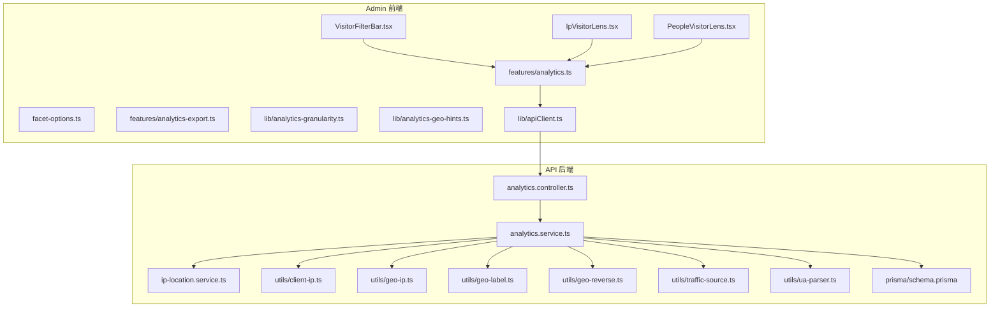
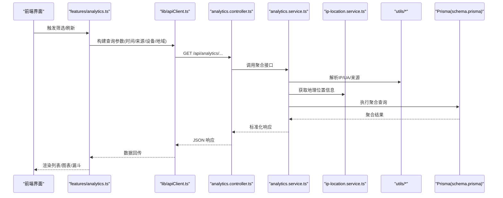
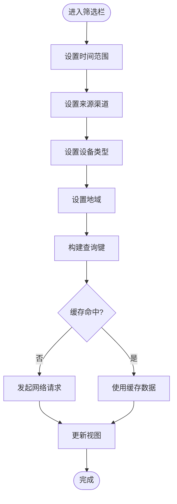
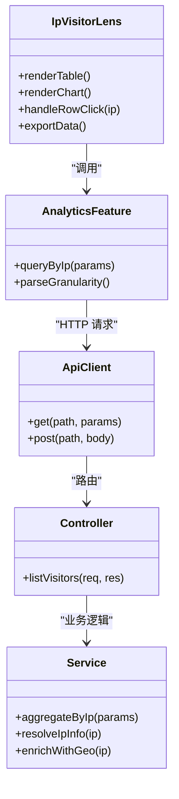
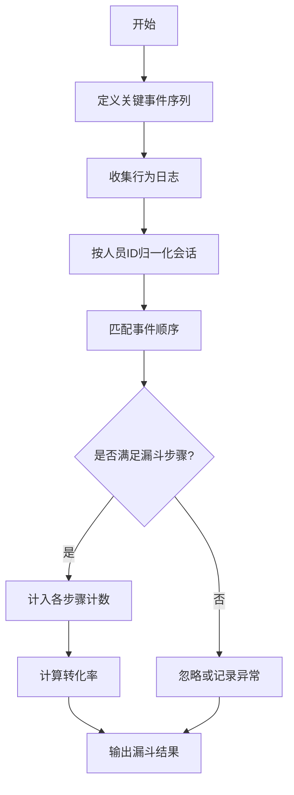
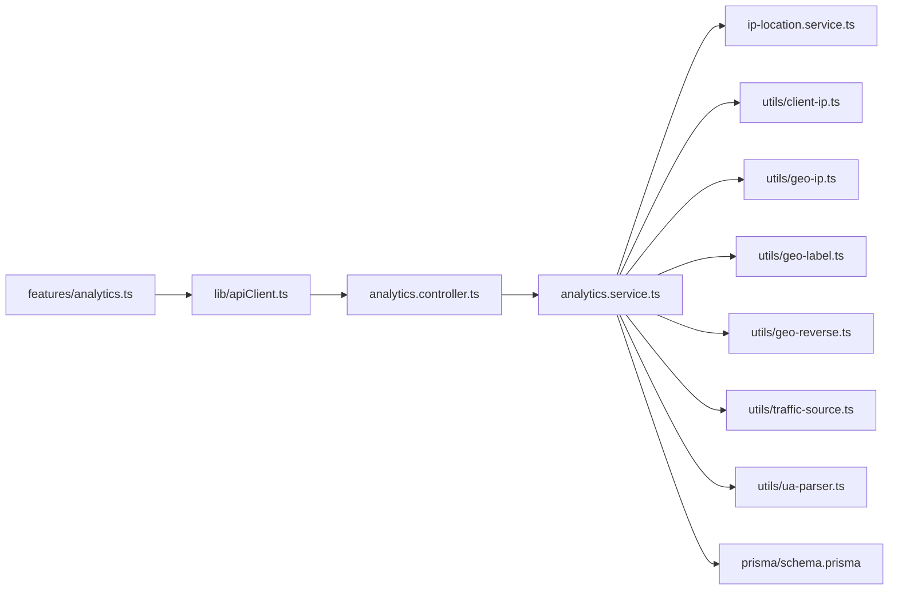

# 访客分析组件

<cite>
**本文引用的文件**   
- [VisitorFilterBar.tsx](file://apps/admin/src/components/visitors/VisitorFilterBar.tsx)
- [IpVisitorLens.tsx](file://apps/admin/src/components/visitors/IpVisitorLens.tsx)
- [PeopleVisitorLens.tsx](file://apps/admin/src/components/visitors/PeopleVisitorLens.tsx)
- [facet-options.ts](file://apps/admin/src/components/visitors/facet-options.ts)
- [analytics.ts](file://apps/admin/src/features/analytics.ts)
- [analytics-export.ts](file://apps/admin/src/features/analytics-export.ts)
- [analytics-granularity.ts](file://apps/admin/src/lib/analytics-granularity.ts)
- [analytics-geo-hints.ts](file://apps/admin/src/lib/analytics-geo-hints.ts)
- [apiClient.ts](file://apps/admin/src/lib/apiClient.ts)
- [analytics.controller.ts](file://apps/api/src/analytics/analytics.controller.ts)
- [analytics.service.ts](file://apps/api/src/analytics/analytics.service.ts)
- [ip-location.service.ts](file://apps/api/src/analytics/ip-location.service.ts)
- [client-ip.ts](file://apps/api/src/analytics/utils/client-ip.ts)
- [geo-ip.ts](file://apps/api/src/analytics/utils/geo-ip.ts)
- [geo-label.ts](file://apps/api/src/analytics/utils/geo-label.ts)
- [geo-reverse.ts](file://apps/api/src/analytics/utils/geo-reverse.ts)
- [traffic-source.ts](file://apps/api/src/analytics/utils/traffic-source.ts)
- [ua-parser.ts](file://apps/api/src/analytics/utils/ua-parser.ts)
- [schema.prisma](file://apps/api/prisma/schema.prisma)
</cite>

## 目录
1. [简介](#简介)
2. [项目结构](#项目结构)
3. [核心组件](#核心组件)
4. [架构总览](#架构总览)
5. [详细组件分析](#详细组件分析)
6. [依赖关系分析](#依赖关系分析)
7. [性能考虑](#性能考虑)
8. [故障排查指南](#故障排查指南)
9. [结论](#结论)
10. [附录](#附录)

## 简介
本文件面向“访客分析”子系统，聚焦以下三个前端组件与后端支撑能力：
- VisitorFilterBar 筛选栏：提供时间、来源、设备、地域等多维筛选条件。
- IpVisitorLens IP 访客视图：按 IP 维度聚合展示访问行为、地理位置、设备信息等。
- PeopleVisitorLens 人员访客视图：在已识别用户（如登录或埋点标识）维度上聚合行为与转化路径。

文档将详细说明数据筛选、聚合与可视化流程，解释 IP 地址解析、地理位置识别、用户行为追踪的技术实现，并给出会话管理、来源分析与转化漏斗的计算逻辑，以及数据分析 API 的使用方法与性能优化建议。

## 项目结构
访客分析功能横跨 admin 应用的前端组件与 api 服务的数据处理层：
- 前端：位于 apps/admin/src/components/visitors 下的三个核心组件，配合 analytics 特性模块与 lib 工具库完成查询与渲染。
- 后端：位于 apps/api/src/analytics 的控制器与服务，负责采集、解析、地理定位与聚合查询；Prisma schema 定义相关实体与字段。

图表来源
- [VisitorFilterBar.tsx](file://apps/admin/src/components/visitors/VisitorFilterBar.tsx)
- [IpVisitorLens.tsx](file://apps/admin/src/components/visitors/IpVisitorLens.tsx)
- [PeopleVisitorLens.tsx](file://apps/admin/src/components/visitors/PeopleVisitorLens.tsx)
- [facet-options.ts](file://apps/admin/src/components/visitors/facet-options.ts)
- [analytics.ts](file://apps/admin/src/features/analytics.ts)
- [analytics-export.ts](file://apps/admin/src/features/analytics-export.ts)
- [analytics-granularity.ts](file://apps/admin/src/lib/analytics-granularity.ts)
- [analytics-geo-hints.ts](file://apps/admin/src/lib/analytics-geo-hints.ts)
- [apiClient.ts](file://apps/admin/src/lib/apiClient.ts)
- [analytics.controller.ts](file://apps/api/src/analytics/analytics.controller.ts)
- [analytics.service.ts](file://apps/api/src/analytics/analytics.service.ts)
- [ip-location.service.ts](file://apps/api/src/analytics/ip-location.service.ts)
- [client-ip.ts](file://apps/api/src/analytics/utils/client-ip.ts)
- [geo-ip.ts](file://apps/api/src/analytics/utils/geo-ip.ts)
- [geo-label.ts](file://apps/api/src/analytics/utils/geo-label.ts)
- [geo-reverse.ts](file://apps/api/src/analytics/utils/geo-reverse.ts)
- [traffic-source.ts](file://apps/api/src/analytics/utils/traffic-source.ts)
- [ua-parser.ts](file://apps/api/src/analytics/utils/ua-parser.ts)
- [schema.prisma](file://apps/api/prisma/schema.prisma)

章节来源
- [VisitorFilterBar.tsx](file://apps/admin/src/components/visitors/VisitorFilterBar.tsx)
- [IpVisitorLens.tsx](file://apps/admin/src/components/visitors/IpVisitorLens.tsx)
- [PeopleVisitorLens.tsx](file://apps/admin/src/components/visitors/PeopleVisitorLens.tsx)
- [analytics.ts](file://apps/admin/src/features/analytics.ts)
- [analytics-export.ts](file://apps/admin/src/features/analytics-export.ts)
- [analytics-granularity.ts](file://apps/admin/src/lib/analytics-granularity.ts)
- [analytics-geo-hints.ts](file://apps/admin/src/lib/analytics-geo-hints.ts)
- [apiClient.ts](file://apps/admin/src/lib/apiClient.ts)
- [analytics.controller.ts](file://apps/api/src/analytics/analytics.controller.ts)
- [analytics.service.ts](file://apps/api/src/analytics/analytics.service.ts)
- [ip-location.service.ts](file://apps/api/src/analytics/ip-location.service.ts)
- [client-ip.ts](file://apps/api/src/analytics/utils/client-ip.ts)
- [geo-ip.ts](file://apps/api/src/analytics/utils/geo-ip.ts)
- [geo-label.ts](file://apps/api/src/analytics/utils/geo-label.ts)
- [geo-reverse.ts](file://apps/api/src/analytics/utils/geo-reverse.ts)
- [traffic-source.ts](file://apps/api/src/analytics/utils/traffic-source.ts)
- [ua-parser.ts](file://apps/api/src/analytics/utils/ua-parser.ts)
- [schema.prisma](file://apps/api/prisma/schema.prisma)

## 核心组件
- VisitorFilterBar：封装时间范围、来源渠道、设备类型、国家/地区等筛选参数，支持联动更新 URL 状态与查询缓存键，避免重复请求。
- IpVisitorLens：以 IP 为分组键，聚合页面浏览、事件、来源、设备、地理位置等指标，支持分页、排序与导出。
- PeopleVisitorLens：以人员标识（如 userId 或匿名 ID）为分组键，聚合行为序列、转化路径、首次/末次访问、停留时长等指标。

章节来源
- [VisitorFilterBar.tsx](file://apps/admin/src/components/visitors/VisitorFilterBar.tsx)
- [IpVisitorLens.tsx](file://apps/admin/src/components/visitors/IpVisitorLens.tsx)
- [PeopleVisitorLens.tsx](file://apps/admin/src/components/visitors/PeopleVisitorLens.tsx)

## 架构总览
前端通过统一的 analytics 特性模块发起查询，调用 apiClient 向后端 analytics.controller 发起 HTTP 请求。后端 analytics.service 组合 IP 解析、UA 解析、来源识别、地理定位与数据库聚合，返回结构化结果供前端渲染。

图表来源
- [analytics.ts](file://apps/admin/src/features/analytics.ts)
- [apiClient.ts](file://apps/admin/src/lib/apiClient.ts)
- [analytics.controller.ts](file://apps/api/src/analytics/analytics.controller.ts)
- [analytics.service.ts](file://apps/api/src/analytics/analytics.service.ts)
- [ip-location.service.ts](file://apps/api/src/analytics/ip-location.service.ts)
- [client-ip.ts](file://apps/api/src/analytics/utils/client-ip.ts)
- [geo-ip.ts](file://apps/api/src/analytics/utils/geo-ip.ts)
- [geo-label.ts](file://apps/api/src/analytics/utils/geo-label.ts)
- [geo-reverse.ts](file://apps/api/src/analytics/utils/geo-reverse.ts)
- [traffic-source.ts](file://apps/api/src/analytics/utils/traffic-source.ts)
- [ua-parser.ts](file://apps/api/src/analytics/utils/ua-parser.ts)
- [schema.prisma](file://apps/api/prisma/schema.prisma)

## 详细组件分析

### VisitorFilterBar 筛选栏
- 功能要点
  - 时间范围选择：支持日/周/月/自定义区间，自动转换为后端所需的时间戳格式。
  - 来源渠道筛选：基于 traffic-source 规则匹配，支持多选与排除。
  - 设备类型筛选：基于 UA 解析结果的设备分类（桌面/移动/平板）。
  - 地域筛选：国家/城市两级，结合 geo-label 与 geo-reverse 能力。
  - 状态同步：URL 状态与本地缓存键联动，避免重复请求。
- 交互流程
  - 用户修改筛选条件 → 生成新的查询键 → 触发 analytics 特性模块查询 → 更新视图。

章节来源
- [VisitorFilterBar.tsx](file://apps/admin/src/components/visitors/VisitorFilterBar.tsx)
- [analytics.ts](file://apps/admin/src/features/analytics.ts)
- [analytics-granularity.ts](file://apps/admin/src/lib/analytics-granularity.ts)
- [analytics-geo-hints.ts](file://apps/admin/src/lib/analytics-geo-hints.ts)

### IpVisitorLens IP 访客视图
- 功能要点
  - 以 IP 为分组键，聚合 PV/UV、来源、设备、地理位置、首访/末访时间、平均停留时长等。
  - 支持分页、排序、导出 CSV/Excel。
  - 点击行可展开详情面板，查看该 IP 的行为时间线。
- 数据流
  - 前端构造查询参数（含时间、来源、设备、地域）→ 后端聚合 → 返回分组结果 → 前端渲染表格与图表。

图表来源
- [IpVisitorLens.tsx](file://apps/admin/src/components/visitors/IpVisitorLens.tsx)
- [analytics.ts](file://apps/admin/src/features/analytics.ts)
- [apiClient.ts](file://apps/admin/src/lib/apiClient.ts)
- [analytics.controller.ts](file://apps/api/src/analytics/analytics.controller.ts)
- [analytics.service.ts](file://apps/api/src/analytics/analytics.service.ts)

章节来源
- [IpVisitorLens.tsx](file://apps/admin/src/components/visitors/IpVisitorLens.tsx)
- [analytics.ts](file://apps/admin/src/features/analytics.ts)

### PeopleVisitorLens 人员访客视图
- 功能要点
  - 以人员标识（userId 或匿名 ID）为分组键，聚合行为序列、转化路径、首次/末次访问、页面停留时长、事件计数等。
  - 支持按来源渠道、设备类型、地域进行过滤。
  - 提供转化漏斗计算：从“访问首页”到“提交表单/注册”的关键步骤转化率。
- 转化漏斗计算逻辑
  - 定义关键事件序列（例如：首页访问 → 产品页浏览 → 联系表单打开 → 提交成功）。
  - 统计每个步骤的独立访客数与累计转化率。
  - 支持按来源渠道与设备类型拆分漏斗。

章节来源
- [PeopleVisitorLens.tsx](file://apps/admin/src/components/visitors/PeopleVisitorLens.tsx)
- [analytics.ts](file://apps/admin/src/features/analytics.ts)

## 依赖关系分析
- 前端依赖
  - features/analytics.ts：统一封装查询参数构建、缓存键生成、分页与排序。
  - lib/apiClient.ts：HTTP 客户端，负责鉴权、重试与错误处理。
  - lib/analytics-granularity.ts：时间粒度转换（小时/天/周/月）。
  - lib/analytics-geo-hints.ts：地域提示与映射。
- 后端依赖
  - analytics.controller.ts：路由与入参校验。
  - analytics.service.ts：聚合逻辑、IP/UA/来源解析、地理定位、数据库查询。
  - ip-location.service.ts：IP 地理位置查询与缓存。
  - utils/*：client-ip.ts、geo-ip.ts、geo-label.ts、geo-reverse.ts、traffic-source.ts、ua-parser.ts。
  - prisma/schema.prisma：实体与索引定义，支撑高效聚合。

图表来源
- [analytics.ts](file://apps/admin/src/features/analytics.ts)
- [apiClient.ts](file://apps/admin/src/lib/apiClient.ts)
- [analytics.controller.ts](file://apps/api/src/analytics/analytics.controller.ts)
- [analytics.service.ts](file://apps/api/src/analytics/analytics.service.ts)
- [ip-location.service.ts](file://apps/api/src/analytics/ip-location.service.ts)
- [client-ip.ts](file://apps/api/src/analytics/utils/client-ip.ts)
- [geo-ip.ts](file://apps/api/src/analytics/utils/geo-ip.ts)
- [geo-label.ts](file://apps/api/src/analytics/utils/geo-label.ts)
- [geo-reverse.ts](file://apps/api/src/analytics/utils/geo-reverse.ts)
- [traffic-source.ts](file://apps/api/src/analytics/utils/traffic-source.ts)
- [ua-parser.ts](file://apps/api/src/analytics/utils/ua-parser.ts)
- [schema.prisma](file://apps/api/prisma/schema.prisma)

章节来源
- [analytics.ts](file://apps/admin/src/features/analytics.ts)
- [apiClient.ts](file://apps/admin/src/lib/apiClient.ts)
- [analytics.controller.ts](file://apps/api/src/analytics/analytics.controller.ts)
- [analytics.service.ts](file://apps/api/src/analytics/analytics.service.ts)
- [ip-location.service.ts](file://apps/api/src/analytics/ip-location.service.ts)
- [client-ip.ts](file://apps/api/src/analytics/utils/client-ip.ts)
- [geo-ip.ts](file://apps/api/src/analytics/utils/geo-ip.ts)
- [geo-label.ts](file://apps/api/src/analytics/utils/geo-label.ts)
- [geo-reverse.ts](file://apps/api/src/analytics/utils/geo-reverse.ts)
- [traffic-source.ts](file://apps/api/src/analytics/utils/traffic-source.ts)
- [ua-parser.ts](file://apps/api/src/analytics/utils/ua-parser.ts)
- [schema.prisma](file://apps/api/prisma/schema.prisma)

## 性能考虑
- 前端优化
  - 使用查询缓存键与去抖策略，减少重复请求。
  - 分页与虚拟滚动，降低大列表渲染压力。
  - 按需加载图表与详情面板，避免首屏阻塞。
- 后端优化
  - 聚合查询使用合适的索引（时间、IP、来源、设备、地域）。
  - 地理位置查询引入缓存（Redis），降低外部服务调用开销。
  - 批量解析 UA 与来源，减少重复计算。
  - 控制返回字段，避免冗余数据传输。
- 导出优化
  - 异步导出任务，避免阻塞主线程。
  - 分片写入与压缩传输，提升大文件导出效率。

[本节为通用指导，不直接分析具体文件]

## 故障排查指南
- 常见问题
  - 时间范围无效：检查前端时间格式化与后端时区处理。
  - 来源渠道为空：确认 traffic-source 规则与 UA/Referrer 解析是否正确。
  - 地理位置缺失：检查 geo-ip 与 geo-reverse 配置与缓存命中率。
  - 设备类型识别错误：验证 ua-parser 版本与规则更新。
- 调试建议
  - 开启请求日志与错误上报，定位失败链路。
  - 使用测试数据集验证聚合逻辑与漏斗计算。
  - 对热点查询添加慢查询日志与索引优化建议。

章节来源
- [analytics.controller.ts](file://apps/api/src/analytics/analytics.controller.ts)
- [analytics.service.ts](file://apps/api/src/analytics/analytics.service.ts)
- [client-ip.ts](file://apps/api/src/analytics/utils/client-ip.ts)
- [geo-ip.ts](file://apps/api/src/analytics/utils/geo-ip.ts)
- [geo-label.ts](file://apps/api/src/analytics/utils/geo-label.ts)
- [geo-reverse.ts](file://apps/api/src/analytics/utils/geo-reverse.ts)
- [traffic-source.ts](file://apps/api/src/analytics/utils/traffic-source.ts)
- [ua-parser.ts](file://apps/api/src/analytics/utils/ua-parser.ts)

## 结论
访客分析组件通过前后端协作，实现了多维筛选、聚合与可视化展示。IP 地址解析、地理位置识别与用户行为追踪构成了数据基础，会话管理与来源分析支撑了转化漏斗计算。通过合理的缓存、索引与异步导出策略，系统可在大数据量下保持良好性能。

[本节为总结性内容，不直接分析具体文件]

## 附录
- API 使用方法
  - 查询参数：时间范围、来源渠道、设备类型、地域、分页与排序。
  - 响应结构：分组指标、明细列表、图表数据、导出链接。
- 最佳实践
  - 合理设置时间粒度，避免过细导致数据膨胀。
  - 使用缓存键与去抖，减少重复请求。
  - 定期更新 UA 与来源规则，保证识别准确性。

[本节为补充说明，不直接分析具体文件]