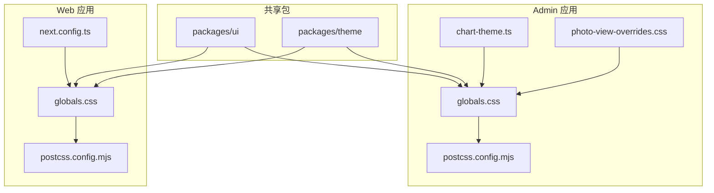
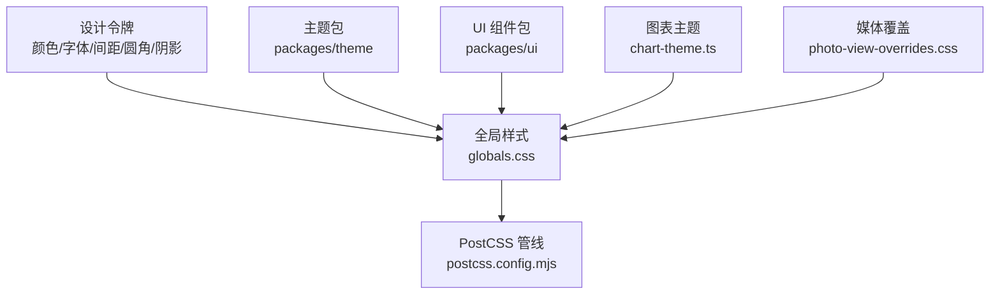
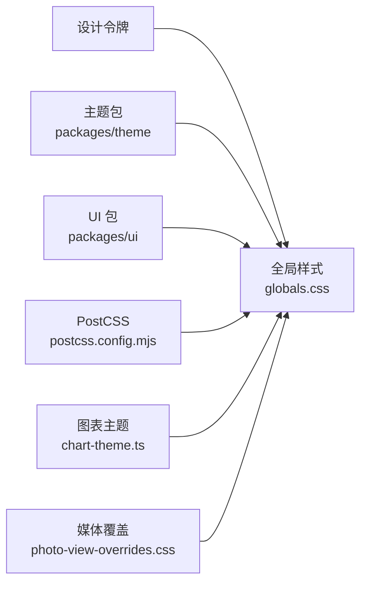

# 主题系统与样式

<cite>
**本文引用的文件**   
- [apps/admin/src/app/globals.css](file://apps/admin/src/app/globals.css)
- [apps/web/src/app/globals.css](file://apps/web/src/app/globals.css)
- [apps/admin/postcss.config.mjs](file://apps/admin/postcss.config.mjs)
- [apps/web/postcss.config.mjs](file://apps/web/postcss.config.mjs)
- [packages/theme/package.json](file://packages/theme/package.json)
- [packages/ui/package.json](file://packages/ui/package.json)
- [apps/admin/src/components/analytics/chart-theme.ts](file://apps/admin/src/components/analytics/chart-theme.ts)
- [apps/admin/src/components/media/photo-view-overrides.css](file://apps/admin/src/components/media/photo-view-overrides.css)
- [apps/web/next.config.ts](file://apps/web/next.config.ts)
- [apps/admin/next.config.ts](file://apps/admin/next.config.ts)
</cite>

## 目录
1. [简介](#简介)
2. [项目结构](#项目结构)
3. [核心组件](#核心组件)
4. [架构总览](#架构总览)
5. [详细组件分析](#详细组件分析)
6. [依赖关系分析](#依赖关系分析)
7. [性能考虑](#性能考虑)
8. [故障排查指南](#故障排查指南)
9. [结论](#结论)
10. [附录](#附录)

## 简介
本文件系统化梳理本仓库的主题系统与样式体系，覆盖 CSS 变量、设计令牌、颜色系统、字体配置、响应式断点、动画与图标系统的组织方式。同时提供如何定制主题、覆盖默认样式、实现暗色模式切换的实践指南，并给出样式组织规范与性能优化建议，确保一致的用户体验。

## 项目结构
本项目采用多应用（admin、web）+ 共享包（packages）的架构。样式与主题相关的关键位置如下：
- 全局样式入口：各应用的 app 层 globals.css
- PostCSS 构建管线：各应用的 postcss.config.mjs
- 第三方 UI 与主题包：packages/ui、packages/theme
- 图表主题：admin 应用中独立的图表主题配置
- 媒体预览样式覆盖：admin 应用中针对图片查看器的样式覆盖

**图示来源** 
- [apps/admin/src/app/globals.css](file://apps/admin/src/app/globals.css)
- [apps/web/src/app/globals.css](file://apps/web/src/app/globals.css)
- [apps/admin/postcss.config.mjs](file://apps/admin/postcss.config.mjs)
- [apps/web/postcss.config.mjs](file://apps/web/postcss.config.mjs)
- [apps/admin/src/components/analytics/chart-theme.ts](file://apps/admin/src/components/analytics/chart-theme.ts)
- [apps/admin/src/components/media/photo-view-overrides.css](file://apps/admin/src/components/media/photo-view-overrides.css)
- [apps/web/next.config.ts](file://apps/web/next.config.ts)
- [apps/admin/next.config.ts](file://apps/admin/next.config.ts)

**章节来源**
- [apps/admin/src/app/globals.css](file://apps/admin/src/app/globals.css)
- [apps/web/src/app/globals.css](file://apps/web/src/app/globals.css)
- [apps/admin/postcss.config.mjs](file://apps/admin/postcss.config.mjs)
- [apps/web/postcss.config.mjs](file://apps/web/postcss.config.mjs)
- [packages/ui/package.json](file://packages/ui/package.json)
- [packages/theme/package.json](file://packages/theme/package.json)

## 核心组件
- 全局样式与主题变量集中管理：通过各应用的 globals.css 定义或引入设计令牌（颜色、间距、圆角、阴影等），作为全站点可复用的基础。
- PostCSS 构建管线：统一处理 CSS 预处理、自动前缀、压缩与按需提取，保证跨浏览器兼容与打包体积可控。
- 第三方 UI 与主题包：通过 packages/ui 与 packages/theme 提供一致的组件样式与主题能力，便于在多应用中复用。
- 图表主题：在 admin 应用中通过独立模块为图表库注入主题变量，确保数据可视化风格与整体品牌一致。
- 媒体预览样式覆盖：对第三方图片查看器进行局部样式覆盖，保持视觉一致性。

**章节来源**
- [apps/admin/src/app/globals.css](file://apps/admin/src/app/globals.css)
- [apps/web/src/app/globals.css](file://apps/web/src/app/globals.css)
- [apps/admin/postcss.config.mjs](file://apps/admin/postcss.config.mjs)
- [apps/web/postcss.config.mjs](file://apps/web/postcss.config.mjs)
- [packages/ui/package.json](file://packages/ui/package.json)
- [packages/theme/package.json](file://packages/theme/package.json)
- [apps/admin/src/components/analytics/chart-theme.ts](file://apps/admin/src/components/analytics/chart-theme.ts)
- [apps/admin/src/components/media/photo-view-overrides.css](file://apps/admin/src/components/media/photo-view-overrides.css)

## 架构总览
主题系统以“全局变量 + 构建管线 + 共享包”为核心，形成从设计令牌到具体组件样式的清晰分层。

**图示来源** 
- [apps/admin/src/app/globals.css](file://apps/admin/src/app/globals.css)
- [apps/web/src/app/globals.css](file://apps/web/src/app/globals.css)
- [apps/admin/postcss.config.mjs](file://apps/admin/postcss.config.mjs)
- [apps/web/postcss.config.mjs](file://apps/web/postcss.config.mjs)
- [packages/theme/package.json](file://packages/theme/package.json)
- [packages/ui/package.json](file://packages/ui/package.json)
- [apps/admin/src/components/analytics/chart-theme.ts](file://apps/admin/src/components/analytics/chart-theme.ts)
- [apps/admin/src/components/media/photo-view-overrides.css](file://apps/admin/src/components/media/photo-view-overrides.css)

## 详细组件分析

### 全局样式与主题变量（globals.css）
- 职责：集中声明 CSS 变量（如颜色、字体族、字号、行高、间距、圆角、阴影、过渡时长等），并提供基础重置与布局基线。
- 使用方式：在组件样式中通过 var(--token) 引用设计令牌，避免硬编码值；在需要时通过类名或属性选择器覆盖特定上下文中的变量。
- 暗色模式：可通过在根节点或容器上切换 data-theme 或 class，配合媒体查询与变量映射实现明/暗主题切换。

**章节来源**
- [apps/admin/src/app/globals.css](file://apps/admin/src/app/globals.css)
- [apps/web/src/app/globals.css](file://apps/web/src/app/globals.css)

### PostCSS 构建管线（postcss.config.mjs）
- 职责：配置 CSS 处理流程，包括插件链（如 autoprefixer、tailwind 集成、cssnano 等）、源映射、按需加载与产物输出。
- 关键点：确保主题变量与组件样式在构建时被正确解析与优化；开启必要的兼容性插件以保证跨端一致表现。

**章节来源**
- [apps/admin/postcss.config.mjs](file://apps/admin/postcss.config.mjs)
- [apps/web/postcss.config.mjs](file://apps/web/postcss.config.mjs)

### 图表主题（chart-theme.ts）
- 职责：为图表库注入主题变量，统一配色、背景、文本与交互状态，使数据可视化与整体品牌保持一致。
- 使用方式：在应用初始化或页面加载时注册主题配置，确保图表渲染前主题已生效。

**章节来源**
- [apps/admin/src/components/analytics/chart-theme.ts](file://apps/admin/src/components/analytics/chart-theme.ts)

### 媒体预览样式覆盖（photo-view-overrides.css）
- 职责：对第三方图片查看器进行局部样式覆盖，修正尺寸、遮罩、按钮与排版，使其与全局主题一致。
- 使用方式：在需要展示大图或媒体详情的页面引入该覆盖样式，避免污染全局样式。

**章节来源**
- [apps/admin/src/components/media/photo-view-overrides.css](file://apps/admin/src/components/media/photo-view-overrides.css)

### Next.js 配置与样式集成（next.config.ts）
- 职责：配置静态资源路径、CSS 处理策略与运行时行为，确保主题与样式在 SSR/CSR 环境下稳定工作。
- 关键点：合理设置外部化与内联策略，减少首屏样式阻塞；必要时启用 CSS Modules 或全局样式按需加载。

**章节来源**
- [apps/web/next.config.ts](file://apps/web/next.config.ts)
- [apps/admin/next.config.ts](file://apps/admin/next.config.ts)

### 共享 UI 与主题包（packages/ui、packages/theme）
- 职责：封装通用 UI 组件与主题能力，提供一致的样式接口与设计令牌，供 admin 与 web 应用复用。
- 使用方式：通过导入包暴露的组件与主题 API，在业务组件中直接引用，避免重复定义样式。

**章节来源**
- [packages/ui/package.json](file://packages/ui/package.json)
- [packages/theme/package.json](file://packages/theme/package.json)

## 依赖关系分析
主题系统依赖关系清晰：设计令牌由全局样式与主题包共同维护，PostCSS 负责构建期处理，应用层通过 globals.css 与组件样式消费这些令牌。图表与媒体预览作为特殊场景，通过独立模块进行主题适配与样式覆盖。

**图示来源** 
- [apps/admin/src/app/globals.css](file://apps/admin/src/app/globals.css)
- [apps/web/src/app/globals.css](file://apps/web/src/app/globals.css)
- [apps/admin/postcss.config.mjs](file://apps/admin/postcss.config.mjs)
- [apps/web/postcss.config.mjs](file://apps/web/postcss.config.mjs)
- [packages/theme/package.json](file://packages/theme/package.json)
- [packages/ui/package.json](file://packages/ui/package.json)
- [apps/admin/src/components/analytics/chart-theme.ts](file://apps/admin/src/components/analytics/chart-theme.ts)
- [apps/admin/src/components/media/photo-view-overrides.css](file://apps/admin/src/components/media/photo-view-overrides.css)

**章节来源**
- [apps/admin/src/app/globals.css](file://apps/admin/src/app/globals.css)
- [apps/web/src/app/globals.css](file://apps/web/src/app/globals.css)
- [apps/admin/postcss.config.mjs](file://apps/admin/postcss.config.mjs)
- [apps/web/postcss.config.mjs](file://apps/web/postcss.config.mjs)
- [packages/theme/package.json](file://packages/theme/package.json)
- [packages/ui/package.json](file://packages/ui/package.json)
- [apps/admin/src/components/analytics/chart-theme.ts](file://apps/admin/src/components/analytics/chart-theme.ts)
- [apps/admin/src/components/media/photo-view-overrides.css](file://apps/admin/src/components/media/photo-view-overrides.css)

## 性能考虑
- 减少样式重绘与回流：优先使用 CSS 变量与 transform/opacity 做动画，避免频繁修改布局属性。
- 控制样式体积：通过 PostCSS 插件剔除未使用的样式，拆分大样式文件，按需加载。
- 首屏优化：将关键样式内联，非关键样式延迟加载；合理使用预加载与懒加载策略。
- 缓存与版本化：对静态资源启用强缓存与内容哈希，提升二次访问速度。
- 图表与媒体：仅在需要时初始化图表主题与媒体预览样式，避免不必要的 DOM 操作与样式计算。

[本节为通用性能建议，不直接分析具体文件]

## 故障排查指南
- 主题变量未生效：检查 globals.css 是否被正确引入，确认变量作用域与优先级；验证 PostCSS 配置是否正确处理 CSS 变量。
- 暗色模式切换无效：确认 data-theme 或 class 切换逻辑，检查媒体查询与变量映射是否正确；在控制台查看最终计算的样式值。
- 图表主题不一致：确认图表主题模块在渲染前已注册；检查主题变量是否与全局变量命名一致。
- 媒体预览样式异常：检查覆盖样式是否被其他规则覆盖；确认引入顺序与选择器优先级。

**章节来源**
- [apps/admin/src/app/globals.css](file://apps/admin/src/app/globals.css)
- [apps/web/src/app/globals.css](file://apps/web/src/app/globals.css)
- [apps/admin/postcss.config.mjs](file://apps/admin/postcss.config.mjs)
- [apps/web/postcss.config.mjs](file://apps/web/postcss.config.mjs)
- [apps/admin/src/components/analytics/chart-theme.ts](file://apps/admin/src/components/analytics/chart-theme.ts)
- [apps/admin/src/components/media/photo-view-overrides.css](file://apps/admin/src/components/media/photo-view-overrides.css)

## 结论
本项目的主题系统以全局样式与共享包为核心，结合 PostCSS 构建管线，实现了设计令牌的一致性与可维护性。通过明确的层次划分与模块化组织，开发者可以便捷地定制主题、覆盖默认样式、实现暗色模式切换，并在图表与媒体等特殊场景中保持视觉一致性。遵循本文的组织规范与性能建议，有助于提升开发效率与用户体验。

[本节为总结性内容，不直接分析具体文件]

## 附录
- 定制主题步骤建议：
  - 在 globals.css 中新增或覆盖设计令牌（颜色、字体、间距等）。
  - 在需要的组件或页面中通过 var(--token) 引用新令牌。
  - 若需全局切换主题，可在根节点添加 data-theme 或 class，并映射对应的变量集。
- 响应式断点建议：
  - 在 PostCSS 或框架提供的工具中定义统一的断点常量，避免散落的数值。
  - 使用语义化的类名或工具函数生成响应式样式。
- 动画效果建议：
  - 使用 CSS 变量控制动画时长与缓动曲线，便于主题切换时保持一致节奏。
  - 优先使用 GPU 加速的属性（transform、opacity）以提升流畅度。
- 图标系统建议：
  - 使用 SVG 图标并通过 CSS 变量控制填充色与大小，确保与主题一致。
  - 将常用图标封装为组件，统一管理尺寸与对齐方式。

[本节为概念性指导，不直接分析具体文件]