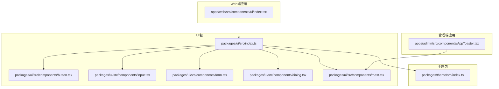
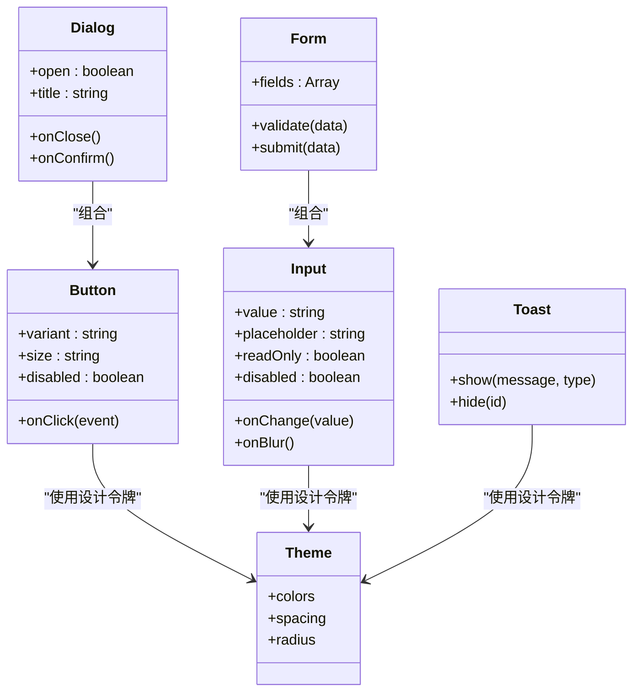
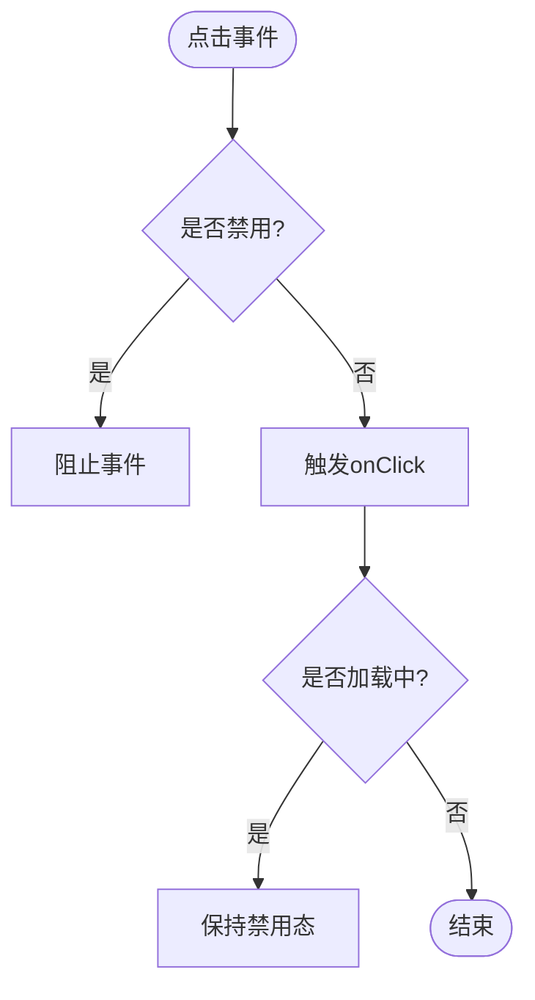
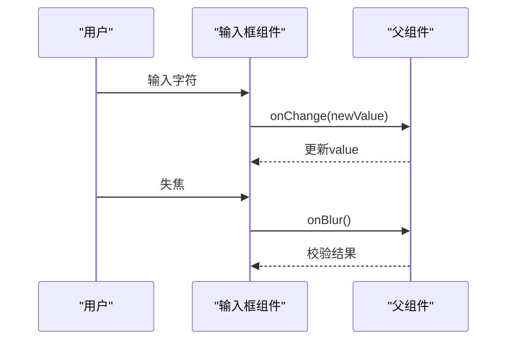
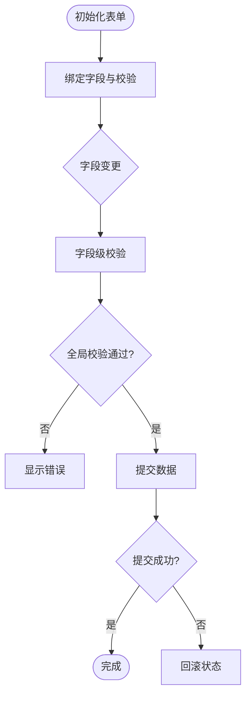
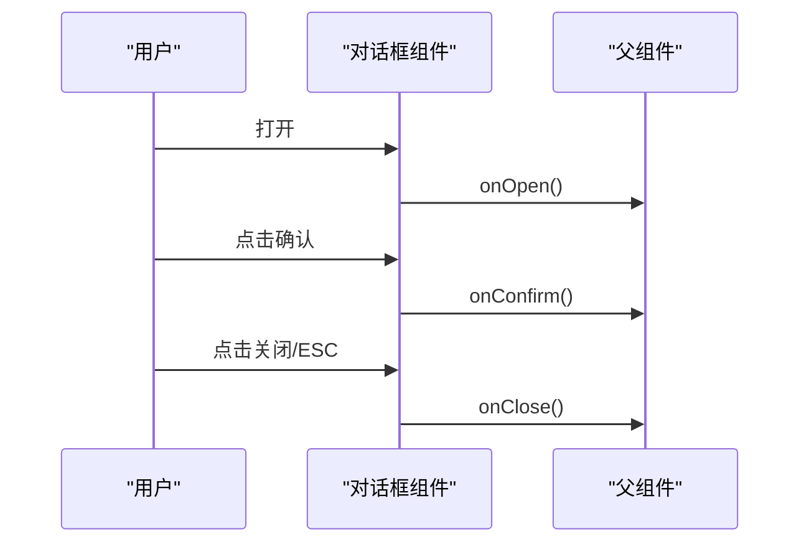
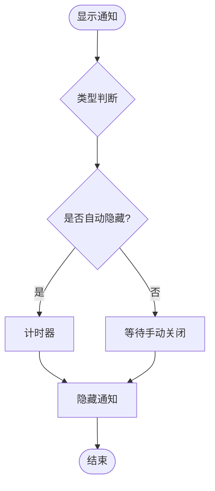
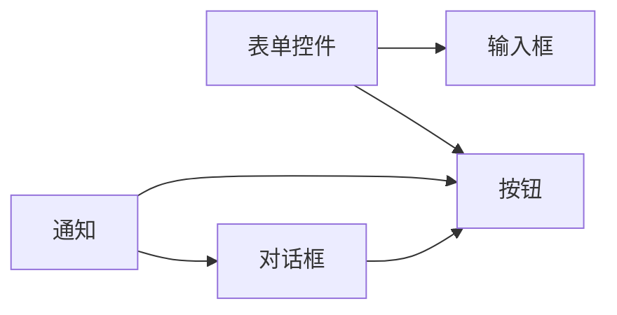
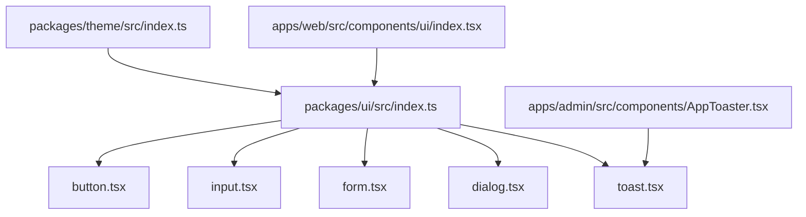

# 基础UI组件

<cite>
**本文档引用的文件**   
- [packages/ui/src/components/button.tsx](file://packages/ui/src/components/button.tsx)
- [packages/ui/src/components/input.tsx](file://packages/ui/src/components/input.tsx)
- [packages/ui/src/components/form.tsx](file://packages/ui/src/components/form.tsx)
- [packages/ui/src/components/dialog.tsx](file://packages/ui/src/components/dialog.tsx)
- [packages/ui/src/components/toast.tsx](file://packages/ui/src/components/toast.tsx)
- [packages/ui/src/index.ts](file://packages/ui/src/index.ts)
- [apps/admin/src/components/AppToaster.tsx](file://apps/admin/src/components/AppToaster.tsx)
- [apps/web/src/components/ui/index.tsx](file://apps/web/src/components/ui/index.tsx)
- [packages/theme/src/index.ts](file://packages/theme/src/index.ts)
</cite>

## 目录
1. [简介](#简介)
2. [项目结构](#项目结构)
3. [核心组件](#核心组件)
4. [架构总览](#架构总览)
5. [详细组件分析](#详细组件分析)
6. [依赖关系分析](#依赖关系分析)
7. [性能考虑](#性能考虑)
8. [故障排查指南](#故障排查指南)
9. [结论](#结论)
10. [附录](#附录)

## 简介
本文件面向开发团队，系统化梳理并文档化基础UI组件：按钮、输入框、表单控件、对话框、通知等通用界面元素。内容涵盖每个组件的Props接口、事件处理、样式定制与主题支持、使用示例、最佳实践、性能优化建议、可访问性支持与响应式设计实现，以及组件组合模式与扩展方法，确保团队在统一规范下高效协作。

## 项目结构
本项目采用多包（monorepo）组织方式，UI组件集中在 packages/ui 中，应用层通过 apps/admin 与 apps/web 引用并使用这些组件；主题系统位于 packages/theme。整体结构如下：

图表来源
- [packages/ui/src/index.ts](file://packages/ui/src/index.ts)
- [packages/ui/src/components/button.tsx](file://packages/ui/src/components/button.tsx)
- [packages/ui/src/components/input.tsx](file://packages/ui/src/components/input.tsx)
- [packages/ui/src/components/form.tsx](file://packages/ui/src/components/form.tsx)
- [packages/ui/src/components/dialog.tsx](file://packages/ui/src/components/dialog.tsx)
- [packages/ui/src/components/toast.tsx](file://packages/ui/src/components/toast.tsx)
- [packages/theme/src/index.ts](file://packages/theme/src/index.ts)
- [apps/admin/src/components/AppToaster.tsx](file://apps/admin/src/components/AppToaster.tsx)
- [apps/web/src/components/ui/index.tsx](file://apps/web/src/components/ui/index.tsx)

章节来源
- [packages/ui/src/index.ts](file://packages/ui/src/index.ts)
- [packages/theme/src/index.ts](file://packages/theme/src/index.ts)
- [apps/admin/src/components/AppToaster.tsx](file://apps/admin/src/components/AppToaster.tsx)
- [apps/web/src/components/ui/index.tsx](file://apps/web/src/components/ui/index.tsx)

## 核心组件
本节对按钮、输入框、表单控件、对话框、通知五大类基础组件进行概览说明，包括职责边界、典型用法与交互要点。

- 按钮（Button）
  - 职责：触发操作，支持多种尺寸、变体与禁用态。
  - 典型用法：提交表单、打开对话框、执行搜索或导航。
  - 交互要点：键盘可达、焦点可见、无障碍标签。

- 输入框（Input）
  - 职责：文本输入，支持占位符、只读、禁用、前缀/后缀图标。
  - 典型用法：搜索框、表单字段、过滤条件。
  - 交互要点：自动聚焦、错误提示、长度限制。

- 表单控件（Form）
  - 职责：聚合多个输入项，提供校验、提交与状态管理。
  - 典型用法：注册/登录、设置页、数据录入。
  - 交互要点：联动校验、批量提交、错误定位。

- 对话框（Dialog）
  - 职责：模态窗口承载重要操作或信息确认。
  - 典型用法：删除确认、设置弹窗、媒体预览。
  - 交互要点：焦点陷阱、ESC关闭、遮罩点击关闭。

- 通知（Toast）
  - 职责：非阻塞式反馈消息，成功、警告、错误等类型。
  - 典型用法：操作结果提示、加载完成提示。
  - 交互要点：自动消失、手动关闭、堆叠显示。

章节来源
- [packages/ui/src/components/button.tsx](file://packages/ui/src/components/button.tsx)
- [packages/ui/src/components/input.tsx](file://packages/ui/src/components/input.tsx)
- [packages/ui/src/components/form.tsx](file://packages/ui/src/components/form.tsx)
- [packages/ui/src/components/dialog.tsx](file://packages/ui/src/components/dialog.tsx)
- [packages/ui/src/components/toast.tsx](file://packages/ui/src/components/toast.tsx)

## 架构总览
UI组件通过统一的入口导出，应用层按需引入；主题系统提供颜色、间距、圆角等设计令牌，保证一致的视觉风格。通知系统在应用层集成，集中管理消息生命周期。

图表来源
- [packages/ui/src/components/button.tsx](file://packages/ui/src/components/button.tsx)
- [packages/ui/src/components/input.tsx](file://packages/ui/src/components/input.tsx)
- [packages/ui/src/components/form.tsx](file://packages/ui/src/components/form.tsx)
- [packages/ui/src/components/dialog.tsx](file://packages/ui/src/components/dialog.tsx)
- [packages/ui/src/components/toast.tsx](file://packages/ui/src/components/toast.tsx)
- [packages/theme/src/index.ts](file://packages/theme/src/index.ts)

## 详细组件分析

### 按钮（Button）
- Props接口
  - variant：主按钮、次按钮、危险按钮等变体。
  - size：默认、小、大尺寸。
  - disabled：禁用态。
  - loading：加载态（可选）。
  - icon：前置或后置图标（可选）。
  - onClick：点击回调。
- 事件处理
  - 支持键盘回车/空格触发。
  - 禁用态阻止事件冒泡。
- 样式定制与主题
  - 基于主题的颜色、间距、圆角。
  - 可通过className覆盖局部样式。
- 可访问性
  - role="button"、aria-disabled、aria-label。
- 响应式设计
  - 移动端增大触控区域。
- 使用示例
  - 提交表单、打开对话框、执行搜索。
- 最佳实践
  - 明确语义化文案，避免“确定”“取消”歧义。
  - 长列表中使用loading态避免重复提交。
- 性能优化
  - 避免在高频渲染路径内创建新对象作为props。
  - 使用React.memo包裹纯展示场景。

图表来源
- [packages/ui/src/components/button.tsx](file://packages/ui/src/components/button.tsx)

章节来源
- [packages/ui/src/components/button.tsx](file://packages/ui/src/components/button.tsx)

### 输入框（Input）
- Props接口
  - value：当前值。
  - placeholder：占位符。
  - readOnly：只读。
  - disabled：禁用。
  - onChange：值变化回调。
  - onBlur：失焦回调。
  - prefix/suffix：前后缀内容（可选）。
- 事件处理
  - 防抖输入（建议在业务层封装）。
  - 失焦时触发校验。
- 样式定制与主题
  - 边框、背景、字体大小由主题控制。
  - 错误态高亮边框。
- 可访问性
  - aria-invalid、aria-describedby（关联错误信息）。
- 响应式设计
  - 自适应宽度，移动端全宽。
- 使用示例
  - 搜索框、表单字段、过滤条件。
- 最佳实践
  - 明确输入格式与长度限制。
  - 错误信息就近显示。
- 性能优化
  - 受控组件配合useMemo/useCallback减少重渲染。

图表来源
- [packages/ui/src/components/input.tsx](file://packages/ui/src/components/input.tsx)

章节来源
- [packages/ui/src/components/input.tsx](file://packages/ui/src/components/input.tsx)

### 表单控件（Form）
- Props接口
  - fields：字段定义数组（名称、类型、校验规则等）。
  - validate：自定义校验函数。
  - submit：提交处理函数。
  - initialValues：初始值。
- 事件处理
  - 字段级校验与全局校验。
  - 提交前拦截与失败回滚。
- 样式定制与主题
  - 布局栅格、间距、对齐方式。
- 可访问性
  - label与input关联，错误信息可读。
- 响应式设计
  - 移动端单列布局，桌面端多列。
- 使用示例
  - 注册/登录、设置页、数据录入。
- 最佳实践
  - 统一错误提示位置与样式。
  - 复杂表单分步提交。
- 性能优化
  - 懒加载校验逻辑，避免首屏阻塞。

图表来源
- [packages/ui/src/components/form.tsx](file://packages/ui/src/components/form.tsx)

章节来源
- [packages/ui/src/components/form.tsx](file://packages/ui/src/components/form.tsx)

### 对话框（Dialog）
- Props接口
  - open：是否打开。
  - title：标题。
  - children：内容。
  - onClose：关闭回调。
  - onConfirm：确认回调（可选）。
- 事件处理
  - ESC键关闭、遮罩点击关闭。
  - 焦点陷阱与恢复。
- 样式定制与主题
  - 居中、阴影、圆角、最大高度。
- 可访问性
  - role="dialog"、aria-modal、aria-labelledby。
- 响应式设计
  - 移动端全屏或底部抽屉。
- 使用示例
  - 删除确认、设置弹窗、媒体预览。
- 最佳实践
  - 避免嵌套对话框。
  - 明确主次操作。
- 性能优化
  - 延迟渲染内容，按需挂载。

图表来源
- [packages/ui/src/components/dialog.tsx](file://packages/ui/src/components/dialog.tsx)

章节来源
- [packages/ui/src/components/dialog.tsx](file://packages/ui/src/components/dialog.tsx)

### 通知（Toast）
- Props接口
  - message：消息内容。
  - type：类型（成功、警告、错误、信息）。
  - duration：自动消失时长。
  - onClose：关闭回调。
- 事件处理
  - 手动关闭、自动消失。
  - 堆叠显示与去重。
- 样式定制与主题
  - 位置（顶部/底部）、颜色、动画。
- 可访问性
  - role="alert"、aria-live。
- 响应式设计
  - 移动端适配宽度与位置。
- 使用示例
  - 操作结果提示、加载完成提示。
- 最佳实践
  - 简洁明了，避免频繁打扰。
  - 关键操作需用户确认。
- 性能优化
  - 合并相似消息，限制同时显示数量。

图表来源
- [packages/ui/src/components/toast.tsx](file://packages/ui/src/components/toast.tsx)

章节来源
- [packages/ui/src/components/toast.tsx](file://packages/ui/src/components/toast.tsx)

### 概念总览
以下流程图展示了各组件之间的常见组合模式与数据流向，帮助理解在实际页面中的协作方式。

[此图为概念流程，不直接映射具体源码文件]

## 依赖关系分析
UI组件依赖主题系统提供的设计令牌，应用层通过各自的入口文件引入并使用组件。通知系统在应用层集中管理，便于统一配置与行为。

图表来源
- [packages/ui/src/index.ts](file://packages/ui/src/index.ts)
- [packages/ui/src/components/button.tsx](file://packages/ui/src/components/button.tsx)
- [packages/ui/src/components/input.tsx](file://packages/ui/src/components/input.tsx)
- [packages/ui/src/components/form.tsx](file://packages/ui/src/components/form.tsx)
- [packages/ui/src/components/dialog.tsx](file://packages/ui/src/components/dialog.tsx)
- [packages/ui/src/components/toast.tsx](file://packages/ui/src/components/toast.tsx)
- [packages/theme/src/index.ts](file://packages/theme/src/index.ts)
- [apps/admin/src/components/AppToaster.tsx](file://apps/admin/src/components/AppToaster.tsx)
- [apps/web/src/components/ui/index.tsx](file://apps/web/src/components/ui/index.tsx)

章节来源
- [packages/ui/src/index.ts](file://packages/ui/src/index.ts)
- [packages/theme/src/index.ts](file://packages/theme/src/index.ts)
- [apps/admin/src/components/AppToaster.tsx](file://apps/admin/src/components/AppToaster.tsx)
- [apps/web/src/components/ui/index.tsx](file://apps/web/src/components/ui/index.tsx)

## 性能考虑
- 组件渲染
  - 使用React.memo包裹无状态组件，避免不必要的重渲染。
  - 将频繁变化的回调函数用useCallback缓存。
- 输入优化
  - 对高频输入进行防抖或节流处理。
  - 受控组件结合useRef减少状态更新频率。
- 对话框与通知
  - 延迟渲染内容，按需挂载DOM节点。
  - 限制同时显示的通知数量，避免内存占用过高。
- 主题与样式
  - 避免在运行时动态计算样式，优先使用CSS变量或主题常量。
- 可访问性与性能平衡
  - 合理使用aria属性，避免过多无障碍标记影响渲染性能。

## 故障排查指南
- 按钮无效
  - 检查disabled与loading状态是否正确设置。
  - 确认onClick事件未被其他事件拦截。
- 输入框无法输入
  - 检查value是否为受控状态，onChange是否被正确调用。
  - 验证readOnly与disabled属性。
- 表单校验不生效
  - 确认字段定义与校验规则匹配。
  - 检查全局校验逻辑是否存在异常。
- 对话框不关闭
  - 检查onClose回调是否被调用。
  - 确认焦点陷阱未导致键盘事件失效。
- 通知不显示或重复
  - 检查消息去重逻辑与堆叠限制。
  - 确认自动消失定时器未被清除。

章节来源
- [packages/ui/src/components/button.tsx](file://packages/ui/src/components/button.tsx)
- [packages/ui/src/components/input.tsx](file://packages/ui/src/components/input.tsx)
- [packages/ui/src/components/form.tsx](file://packages/ui/src/components/form.tsx)
- [packages/ui/src/components/dialog.tsx](file://packages/ui/src/components/dialog.tsx)
- [packages/ui/src/components/toast.tsx](file://packages/ui/src/components/toast.tsx)

## 结论
本文件系统化梳理了基础UI组件的职责、接口、交互、样式与主题、可访问性与响应式实现，并提供组合模式与扩展方法建议。遵循本文档的规范与实践，有助于提升团队协作效率与产品一致性。

## 附录
- 组件命名规范：使用PascalCase，语义化命名。
- 样式约定：优先使用主题变量，避免硬编码颜色与尺寸。
- 可访问性基线：所有交互元素需提供合适的role与aria属性。
- 响应式策略：移动端优先，逐步增强桌面端体验。