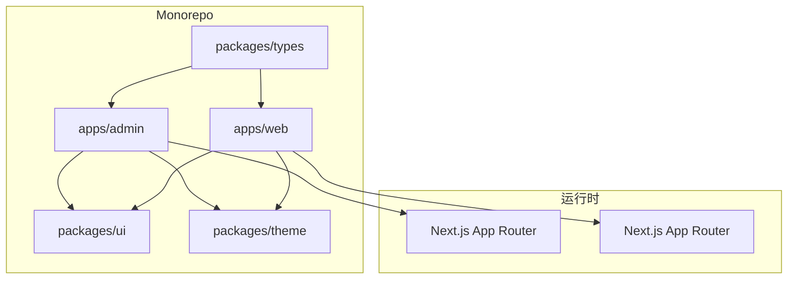
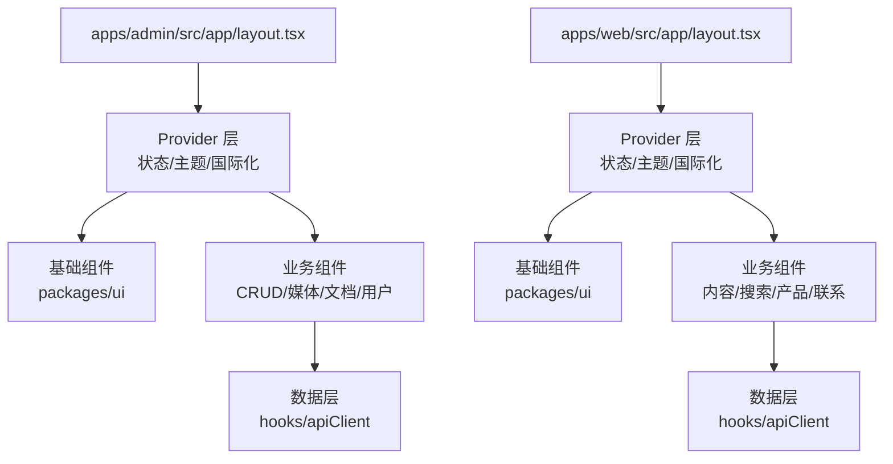
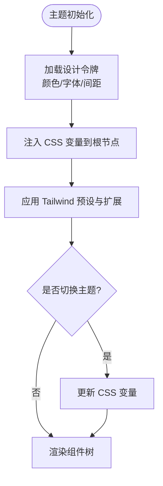
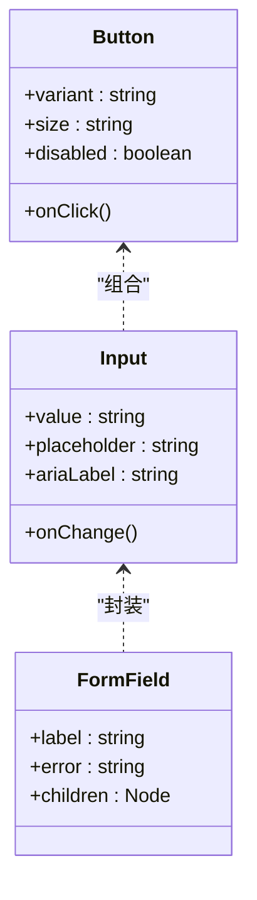
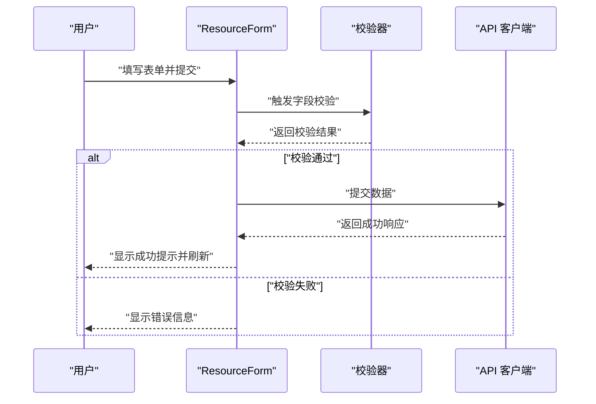
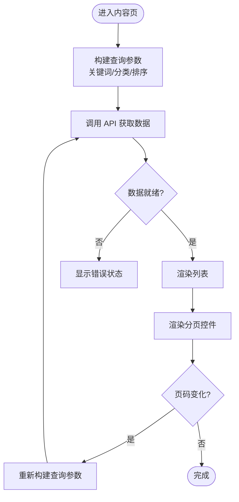
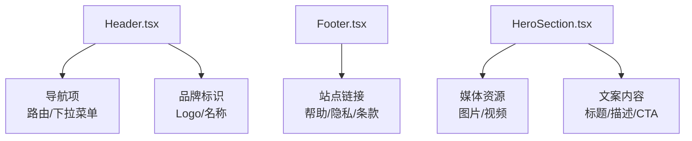
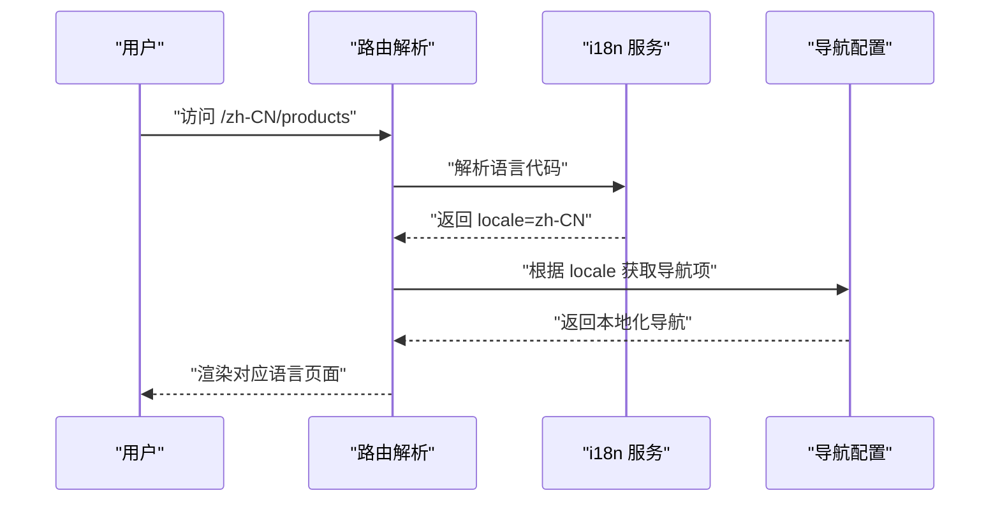
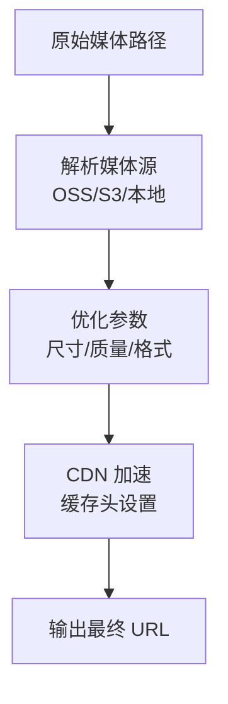
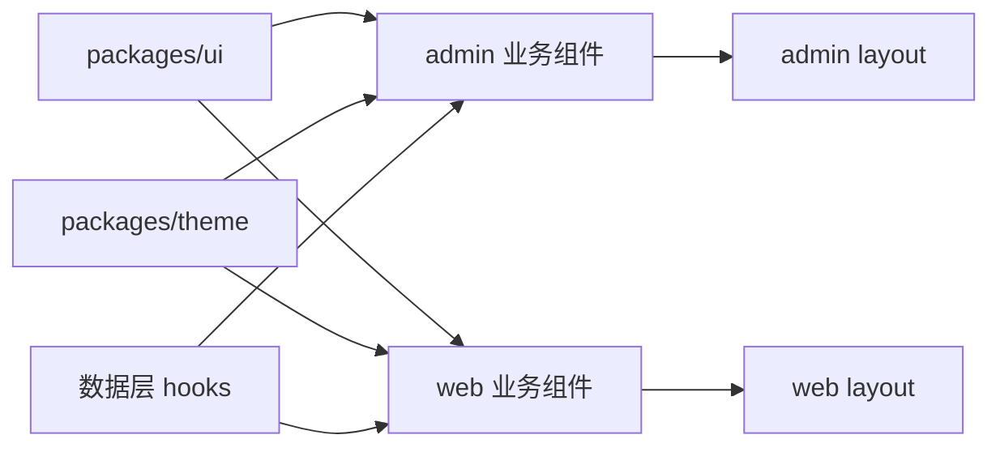

# 组件库与UI框架

<cite>
**本文档引用的文件**   
- [apps/admin/src/components/Providers.tsx](file://apps/admin/src/components/Providers.tsx)
- [apps/admin/src/app/layout.tsx](file://apps/admin/src/app/layout.tsx)
- [apps/admin/src/app/globals.css](file://apps/admin/src/app/globals.css)
- [apps/web/src/app/layout.tsx](file://apps/web/src/app/layout.tsx)
- [apps/web/src/app/globals.css](file://apps/web/src/app/globals.css)
- [apps/web/components.json](file://apps/web/components.json)
- [packages/theme/package.json](file://packages/theme/package.json)
- [packages/ui/package.json](file://packages/ui/package.json)
- [apps/admin/src/components/crud/config.ts](file://apps/admin/src/components/crud/config.ts)
- [apps/admin/src/components/crud/ResourceForm.tsx](file://apps/admin/src/components/crud/ResourceForm.tsx)
- [apps/admin/src/components/crud/ResourceListView.tsx](file://apps/admin/src/components/crud/ResourceListView.tsx)
- [apps/admin/src/features/constants.tsx](file://apps/admin/src/features/constants.tsx)
- [apps/admin/src/lib/config.ts](file://apps/admin/src/lib/config.ts)
- [apps/web/src/lib/site-settings.ts](file://apps/web/src/lib/site-settings.ts)
- [apps/web/src/i18n/navigation.ts](file://apps/web/src/i18n/navigation.ts)
- [apps/web/src/lib/navigation.ts](file://apps/web/src/lib/navigation.ts)
- [apps/web/src/lib/media-url.ts](file://apps/web/src/lib/media-url.ts)
- [apps/web/src/components/search/SearchInput.tsx](file://apps/web/src/components/search/SearchInput.tsx)
- [apps/web/src/components/content/ContentListShell.tsx](file://apps/web/src/components/content/ContentListShell.tsx)
- [apps/web/src/components/content/ContentPagination.tsx](file://apps/web/src/components/content/ContentPagination.tsx)
- [apps/web/src/components/sections/HeroSection.tsx](file://apps/web/src/components/sections/HeroSection.tsx)
- [apps/web/src/components/layout/Header.tsx](file://apps/web/src/components/layout/Header.tsx)
- [apps/web/src/components/layout/Footer.tsx](file://apps/web/src/components/layout/Footer.tsx)
</cite>

## 目录
1. [简介](#简介)
2. [项目结构](#项目结构)
3. [核心组件](#核心组件)
4. [架构总览](#架构总览)
5. [详细组件分析](#详细组件分析)
6. [依赖分析](#依赖分析)
7. [性能考虑](#性能考虑)
8. [故障排查指南](#故障排查指南)
9. [结论](#结论)
10. [附录](#附录)

## 简介
本文件面向基于 React 与 TypeScript 的现代化组件库与 UI 框架，目标是提供一套可复用、可扩展、主题化且无障碍友好的基础组件、业务组件与页面模板体系。文档覆盖以下关键主题：
- 基础组件、业务组件与页面模板的设计原则与使用方法
- 主题定制、样式系统、响应式设计与无障碍访问支持
- 组件组合模式、状态管理与性能优化策略
- 组件文档、使用示例与最佳实践
- 为前端开发提供一致的用户体验和高可维护性的代码基础

## 项目结构
本项目采用多应用（Admin 与 Web）+ 共享包（packages）的 Monorepo 组织方式：
- apps/admin：管理后台应用，包含丰富的业务组件与 CRUD 能力
- apps/web：对外展示网站应用，强调内容展示、搜索、国际化与 SEO
- packages：共享主题、UI 原子组件、类型定义等
- infra：部署与基础设施配置
- docs：设计、API 与决策记录

**图表来源** 
- [apps/admin/src/app/layout.tsx](file://apps/admin/src/app/layout.tsx)
- [apps/web/src/app/layout.tsx](file://apps/web/src/app/layout.tsx)

**章节来源**
- [apps/admin/src/app/layout.tsx](file://apps/admin/src/app/layout.tsx)
- [apps/web/src/app/layout.tsx](file://apps/web/src/app/layout.tsx)

## 核心组件
- 基础组件（Atomic UI）：按钮、输入、表单、表格、对话框、通知、图标等，位于 packages/ui
- 主题系统（Theme）：颜色、字体、间距、断点、阴影等设计令牌，位于 packages/theme
- 业务组件（Business Components）：资源编辑器、媒体选择器、列表视图、分页、搜索、内容区块等，位于 apps/*/components
- 页面模板（Page Templates）：布局壳、头部/底部、内容容器、错误页等，位于 apps/*/app 与 components/layout

设计原则
- 单一职责：每个组件聚焦一个功能点，通过 props 暴露最小必要接口
- 组合优先：通过组合基础组件构建复杂业务组件，避免重复实现
- 主题驱动：所有视觉属性来自主题令牌，确保一致性
- 无障碍优先：语义化标签、键盘可达性、ARIA 属性与焦点管理
- 可测试性：稳定的 API 与清晰的边界，便于单元测试与集成测试

**章节来源**
- [packages/ui/package.json](file://packages/ui/package.json)
- [packages/theme/package.json](file://packages/theme/package.json)

## 架构总览
整体架构以 Next.js App Router 为核心，结合 Provider 模式进行全局状态与上下文注入，组件间通过 props 与 Context 通信，数据层通过 hooks 与 API 客户端交互。

**图表来源** 
- [apps/admin/src/app/layout.tsx](file://apps/admin/src/app/layout.tsx)
- [apps/web/src/app/layout.tsx](file://apps/web/src/app/layout.tsx)
- [apps/admin/src/components/Providers.tsx](file://apps/admin/src/components/Providers.tsx)

**章节来源**
- [apps/admin/src/components/Providers.tsx](file://apps/admin/src/components/Providers.tsx)

## 详细组件分析

### 主题系统与样式规范
- 设计令牌：颜色、字体、间距、圆角、阴影、断点等集中管理于主题包
- 样式系统：CSS 变量 + Tailwind 类名，保证主题切换与响应式一致性
- 全局样式：在应用 layout 中引入全局 CSS，统一根样式与重置

**图表来源** 
- [apps/admin/src/app/globals.css](file://apps/admin/src/app/globals.css)
- [apps/web/src/app/globals.css](file://apps/web/src/app/globals.css)
- [packages/theme/package.json](file://packages/theme/package.json)

**章节来源**
- [apps/admin/src/app/globals.css](file://apps/admin/src/app/globals.css)
- [apps/web/src/app/globals.css](file://apps/web/src/app/globals.css)
- [packages/theme/package.json](file://packages/theme/package.json)

### 基础组件与组合模式
- 组合模式：通过 children、slots 与 render props 实现灵活组合
- 受控与非受控：输入类组件同时支持两种模式，提升易用性
- 无障碍：默认提供 aria-* 属性与键盘导航支持

**图表来源** 
- [packages/ui/package.json](file://packages/ui/package.json)

**章节来源**
- [packages/ui/package.json](file://packages/ui/package.json)

### 业务组件：CRUD 资源编辑与列表
- ResourceForm：通用表单生成器，支持字段校验、动态选项、富文本与媒体选择
- ResourceListView：通用列表视图，支持排序、筛选、分页与批量操作
- config：字段映射与行为配置，解耦业务逻辑与 UI

**图表来源** 
- [apps/admin/src/components/crud/ResourceForm.tsx](file://apps/admin/src/components/crud/ResourceForm.tsx)
- [apps/admin/src/components/crud/config.ts](file://apps/admin/src/components/crud/config.ts)

**章节来源**
- [apps/admin/src/components/crud/ResourceForm.tsx](file://apps/admin/src/components/crud/ResourceForm.tsx)
- [apps/admin/src/components/crud/config.ts](file://apps/admin/src/components/crud/config.ts)

### 业务组件：内容列表与分页
- ContentListShell：内容列表容器，处理查询参数与数据获取
- ContentPagination：分页组件，支持页码跳转与每页条数设置
- SearchInput：搜索输入框，支持防抖与即时反馈

**图表来源** 
- [apps/web/src/components/content/ContentListShell.tsx](file://apps/web/src/components/content/ContentListShell.tsx)
- [apps/web/src/components/content/ContentPagination.tsx](file://apps/web/src/components/content/ContentPagination.tsx)
- [apps/web/src/components/search/SearchInput.tsx](file://apps/web/src/components/search/SearchInput.tsx)

**章节来源**
- [apps/web/src/components/content/ContentListShell.tsx](file://apps/web/src/components/content/ContentListShell.tsx)
- [apps/web/src/components/content/ContentPagination.tsx](file://apps/web/src/components/content/ContentPagination.tsx)
- [apps/web/src/components/search/SearchInput.tsx](file://apps/web/src/components/search/SearchInput.tsx)

### 页面模板：头部、底部与英雄区
- Header：导航与品牌展示，支持移动端抽屉菜单
- Footer：站点信息与链接，支持多语言
- HeroSection：首屏展示区域，支持图片与文案配置

**图表来源** 
- [apps/web/src/components/layout/Header.tsx](file://apps/web/src/components/layout/Header.tsx)
- [apps/web/src/components/layout/Footer.tsx](file://apps/web/src/components/layout/Footer.tsx)
- [apps/web/src/components/sections/HeroSection.tsx](file://apps/web/src/components/sections/HeroSection.tsx)

**章节来源**
- [apps/web/src/components/layout/Header.tsx](file://apps/web/src/components/layout/Header.tsx)
- [apps/web/src/components/layout/Footer.tsx](file://apps/web/src/components/layout/Footer.tsx)
- [apps/web/src/components/sections/HeroSection.tsx](file://apps/web/src/components/sections/HeroSection.tsx)

### 国际化与导航
- navigation.ts：多语言导航配置，支持动态路径与标签
- i18n/request.ts：请求级国际化解析
- routing.ts：路由与语言前缀处理

**图表来源** 
- [apps/web/src/i18n/navigation.ts](file://apps/web/src/i18n/navigation.ts)
- [apps/web/src/lib/navigation.ts](file://apps/web/src/lib/navigation.ts)

**章节来源**
- [apps/web/src/i18n/navigation.ts](file://apps/web/src/i18n/navigation.ts)
- [apps/web/src/lib/navigation.ts](file://apps/web/src/lib/navigation.ts)

### 媒体资源与 URL 处理
- media-url.ts：媒体 URL 生成与优化，支持尺寸裁剪与格式转换
- site-settings.ts：站点设置，包括媒体源、CDN 与缓存策略

**图表来源** 
- [apps/web/src/lib/media-url.ts](file://apps/web/src/lib/media-url.ts)
- [apps/web/src/lib/site-settings.ts](file://apps/web/src/lib/site-settings.ts)

**章节来源**
- [apps/web/src/lib/media-url.ts](file://apps/web/src/lib/media-url.ts)
- [apps/web/src/lib/site-settings.ts](file://apps/web/src/lib/site-settings.ts)

## 依赖分析
组件间的依赖关系清晰，基础组件被业务组件复用，业务组件被页面模板组合，数据层通过 hooks 抽象 API 调用。

**图表来源** 
- [packages/ui/package.json](file://packages/ui/package.json)
- [packages/theme/package.json](file://packages/theme/package.json)
- [apps/admin/src/app/layout.tsx](file://apps/admin/src/app/layout.tsx)
- [apps/web/src/app/layout.tsx](file://apps/web/src/app/layout.tsx)

**章节来源**
- [packages/ui/package.json](file://packages/ui/package.json)
- [packages/theme/package.json](file://packages/theme/package.json)
- [apps/admin/src/app/layout.tsx](file://apps/admin/src/app/layout.tsx)
- [apps/web/src/app/layout.tsx](file://apps/web/src/app/layout.tsx)

## 性能考虑
- 组件懒加载：使用 React.lazy 与 Suspense 按需加载重型组件
- 数据缓存：React Query 或 SWR 缓存 API 响应，减少重复请求
- 图片优化：使用 next/image 或自定义媒体组件，自动压缩与懒加载
- 虚拟滚动：长列表使用 react-window 或 @tanstack/virtual 提升渲染性能
- 代码分割：按路由与功能模块拆分 bundle，减小初始加载体积
- 防抖节流：搜索与输入场景使用防抖，减少不必要的计算与请求

[本节为通用指导，无需特定文件引用]

## 故障排查指南
- 主题不生效：检查全局 CSS 是否正确引入，CSS 变量是否覆盖
- 表单校验失败：确认字段映射与校验规则配置正确
- 分页异常：检查查询参数构建与 API 响应结构
- 国际化缺失：确认语言包是否完整，路由前缀是否正确
- 媒体加载失败：检查媒体源配置与 CORS 设置

**章节来源**
- [apps/admin/src/components/crud/config.ts](file://apps/admin/src/components/crud/config.ts)
- [apps/web/src/lib/site-settings.ts](file://apps/web/src/lib/site-settings.ts)
- [apps/web/src/i18n/navigation.ts](file://apps/web/src/i18n/navigation.ts)

## 结论
本组件库与 UI 框架通过模块化、主题化与组合式设计，提供了高内聚、低耦合的前端基础能力。配合严格的类型定义与无障碍支持，能够显著提升开发效率与用户体验。建议在实际项目中遵循本文档的设计原则与最佳实践，持续迭代与完善组件生态。

[本节为总结性内容，无需特定文件引用]

## 附录
- 组件文档：建议在 packages/ui 下为每个基础组件提供 README 与 Storybook 示例
- 使用示例：在 apps 应用中提供完整的页面级示例，展示组件组合与状态管理
- 最佳实践：制定编码规范、审查清单与性能基准，确保团队一致性

[本节为补充说明，无需特定文件引用]