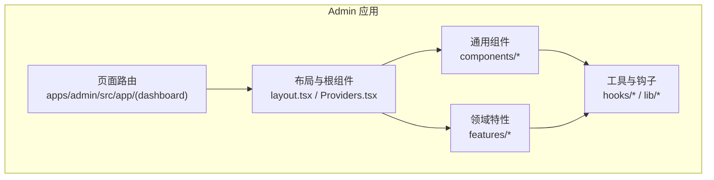
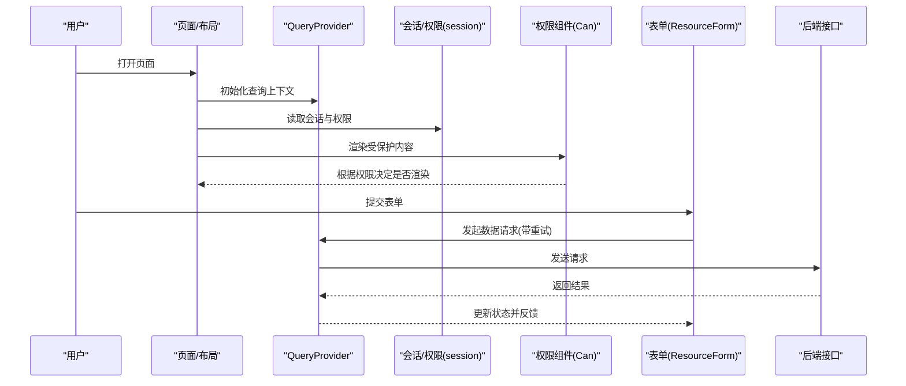
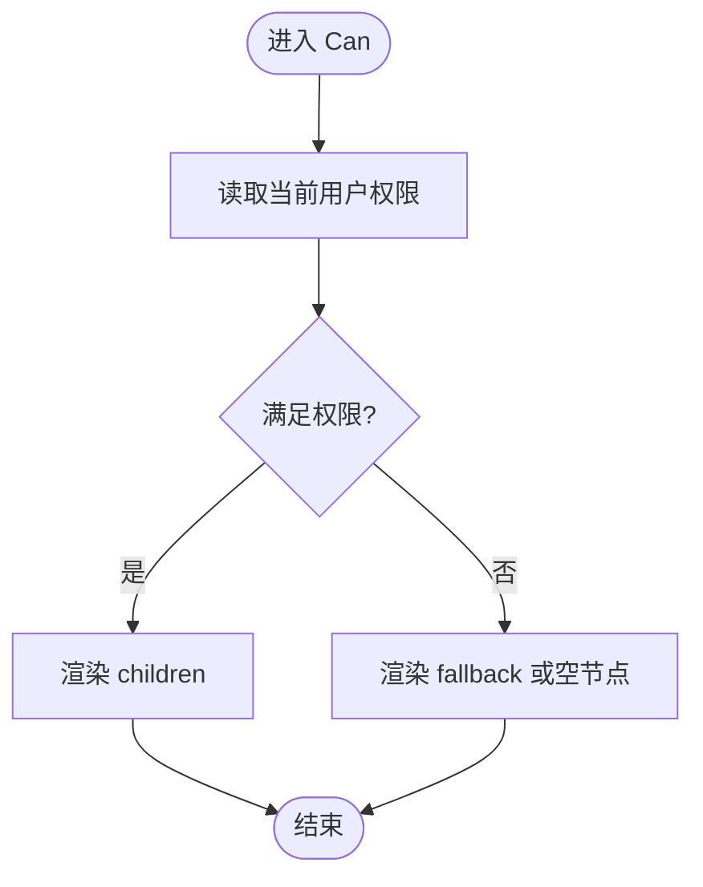
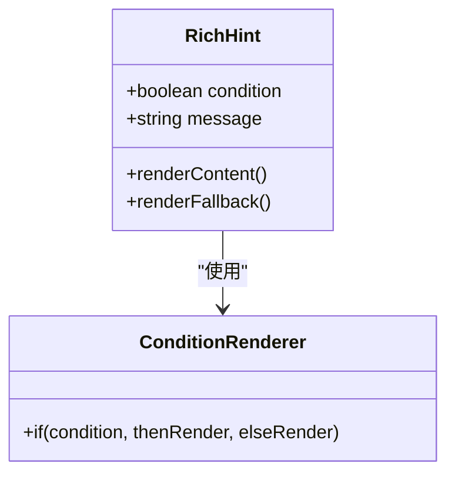
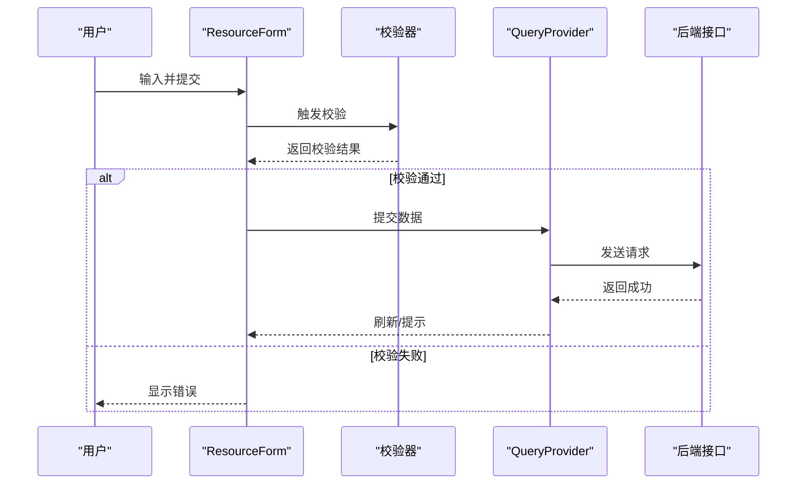
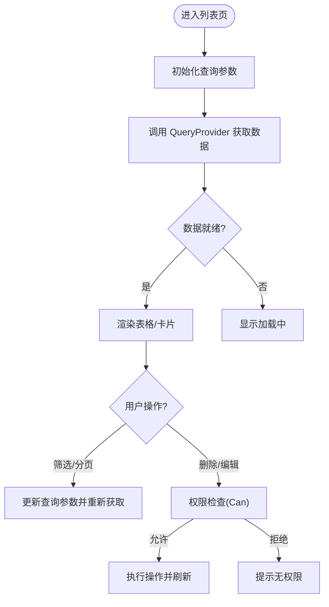
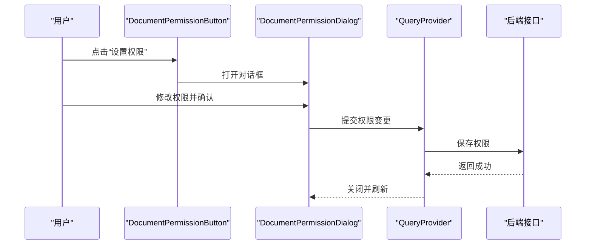
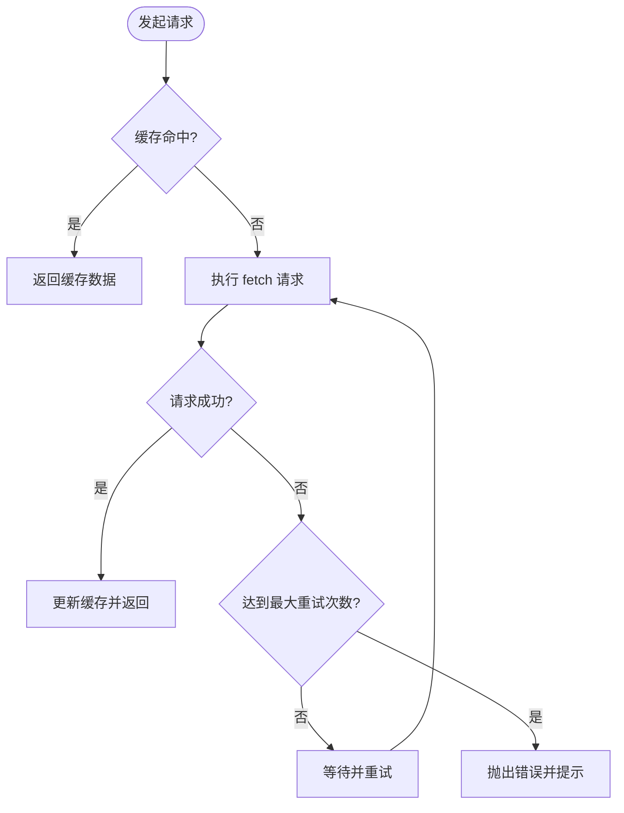
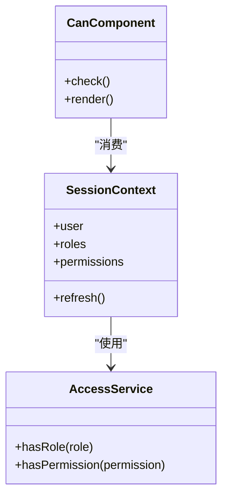
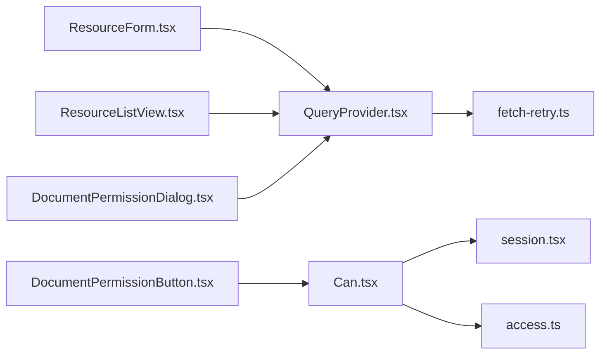

# 组件设计模式

<cite>
**本文引用的文件**   
- [Can.tsx](file://apps/admin/src/components/Can.tsx)
- [Providers.tsx](file://apps/admin/src/components/Providers.tsx)
- [QueryProvider.tsx](file://apps/admin/src/components/QueryProvider.tsx)
- [session.tsx](file://apps/admin/src/components/session.tsx)
- [ResourceForm.tsx](file://apps/admin/src/components/crud/ResourceForm.tsx)
- [ResourceListView.tsx](file://apps/admin/src/components/crud/ResourceListView.tsx)
- [DocumentPermissionButton.tsx](file://apps/admin/src/components/DocumentPermissionButton.tsx)
- [DocumentPermissionDialog.tsx](file://apps/admin/src/components/DocumentPermissionDialog.tsx)
- [RichHint.tsx](file://apps/admin/src/components/RichHint.tsx)
- [access.ts](file://apps/admin/src/features/access.ts)
- [auth.ts](file://apps/admin/src/lib/auth.ts)
- [fetch-retry.ts](file://apps/admin/src/lib/fetch-retry.ts)
- [useDebouncedValue.ts](file://apps/admin/src/hooks/useDebouncedValue.ts)
- [layout.tsx](file://apps/admin/src/app/(dashboard)/layout.tsx)
- [page.tsx](file://apps/admin/src/app/(dashboard)/page.tsx)
</cite>

## 目录
1. [简介](#简介)
2. [项目结构](#项目结构)
3. [核心组件与模式](#核心组件与模式)
4. [架构总览](#架构总览)
5. [详细组件分析](#详细组件分析)
6. [依赖关系分析](#依赖关系分析)
7. [性能考量](#性能考量)
8. [故障排查指南](#故障排查指南)
9. [结论](#结论)
10. [附录](#附录)

## 简介
本文件围绕组件设计模式，系统梳理在管理后台应用中常见的组合、高阶组件、渲染属性、状态提升等实践，并结合权限控制、条件渲染、表单验证、数据获取等典型场景给出可落地的实现思路。同时提供组件测试策略、性能优化技巧与可访问性最佳实践，帮助团队构建高内聚、低耦合、易扩展的组件体系。

## 项目结构
本项目采用多应用（admin/web/api）+ 共享包（packages/*）的组织方式。前端 admin 应用以 Next.js App Router 为基础，组件集中在 apps/admin/src/components 下，按功能域划分；业务逻辑通过 features 与 hooks 分层组织；通用能力如查询、会话、权限等在 lib 层提供。

图表来源
- [layout.tsx](file://apps/admin/src/app/(dashboard)/layout.tsx)
- [Providers.tsx](file://apps/admin/src/components/Providers.tsx)

章节来源
- [layout.tsx](file://apps/admin/src/app/(dashboard)/layout.tsx)
- [Providers.tsx](file://apps/admin/src/components/Providers.tsx)

## 核心组件与模式
本节聚焦以下关键组件与模式：
- 权限控制组件：基于角色/权限的条件渲染与操作拦截
- 条件渲染：根据状态或权限动态展示 UI
- 表单验证：集中式校验与错误提示
- 数据获取：统一的数据请求、重试与缓存策略
- 状态提升：将状态上移至父级或 Provider，跨组件共享
- 渲染属性/HOC：通过 props.children 或高阶封装复用横切逻辑

章节来源
- [Can.tsx](file://apps/admin/src/components/Can.tsx)
- [ResourceForm.tsx](file://apps/admin/src/components/crud/ResourceForm.tsx)
- [ResourceListView.tsx](file://apps/admin/src/components/crud/ResourceListView.tsx)
- [DocumentPermissionButton.tsx](file://apps/admin/src/components/DocumentPermissionButton.tsx)
- [DocumentPermissionDialog.tsx](file://apps/admin/src/components/DocumentPermissionDialog.tsx)
- [RichHint.tsx](file://apps/admin/src/components/RichHint.tsx)
- [QueryProvider.tsx](file://apps/admin/src/components/QueryProvider.tsx)
- [session.tsx](file://apps/admin/src/components/session.tsx)
- [fetch-retry.ts](file://apps/admin/src/lib/fetch-retry.ts)
- [useDebouncedValue.ts](file://apps/admin/src/hooks/useDebouncedValue.ts)

## 架构总览
下图展示了权限、数据与 UI 的交互关系：权限决策由 Can 组件与权限服务驱动；数据获取由 QueryProvider 统一管理；UI 通过条件渲染与表单组件呈现。

图表来源
- [QueryProvider.tsx](file://apps/admin/src/components/QueryProvider.tsx)
- [session.tsx](file://apps/admin/src/components/session.tsx)
- [Can.tsx](file://apps/admin/src/components/Can.tsx)
- [ResourceForm.tsx](file://apps/admin/src/components/crud/ResourceForm.tsx)
- [fetch-retry.ts](file://apps/admin/src/lib/fetch-retry.ts)

## 详细组件分析

### 权限控制组件（Can）
- 职责：根据当前用户角色/权限决定子节点是否渲染，或禁用/隐藏特定操作按钮
- 模式：组合 + 条件渲染；可与 HOC 结合对任意组件进行权限包装
- 关键点：
  - 从会话/权限服务读取当前用户信息
  - 支持细粒度权限标识与角色集合匹配
  - 无权限时可选择隐藏或降级为只读 UI

图表来源
- [Can.tsx](file://apps/admin/src/components/Can.tsx)
- [session.tsx](file://apps/admin/src/components/session.tsx)
- [access.ts](file://apps/admin/src/features/access.ts)

章节来源
- [Can.tsx](file://apps/admin/src/components/Can.tsx)
- [session.tsx](file://apps/admin/src/components/session.tsx)
- [access.ts](file://apps/admin/src/features/access.ts)

### 条件渲染与富提示（RichHint）
- 职责：根据布尔条件或异步状态切换不同 UI，并提供可复用的提示/说明区域
- 模式：组合 + 渲染属性（render 函数或 children）
- 关键点：
  - 使用 props.children 或 render 回调注入上下文
  - 支持 loading/error/success 等多态渲染
  - 无障碍：为提示区域设置 aria-* 语义

图表来源
- [RichHint.tsx](file://apps/admin/src/components/RichHint.tsx)

章节来源
- [RichHint.tsx](file://apps/admin/src/components/RichHint.tsx)

### 表单验证与资源编辑（ResourceForm）
- 职责：统一的 CRUD 表单封装，包含字段校验、错误展示、提交与重置
- 模式：状态提升（表单状态上提至父组件或 Provider）、渲染属性（自定义字段渲染器）
- 关键点：
  - 集中式校验规则与错误映射
  - 提交前校验与防抖处理
  - 与 QueryProvider 集成，自动刷新列表

图表来源
- [ResourceForm.tsx](file://apps/admin/src/components/crud/ResourceForm.tsx)
- [QueryProvider.tsx](file://apps/admin/src/components/QueryProvider.tsx)

章节来源
- [ResourceForm.tsx](file://apps/admin/src/components/crud/ResourceForm.tsx)

### 列表视图与数据获取（ResourceListView）
- 职责：统一的数据列表展示、分页、筛选与操作入口
- 模式：数据获取与缓存（QueryProvider）、状态提升（筛选/分页状态）
- 关键点：
  - 与查询上下文联动，避免重复请求
  - 加载态与错误态的统一处理
  - 操作按钮受权限控制（与 Can 组合）

图表来源
- [ResourceListView.tsx](file://apps/admin/src/components/crud/ResourceListView.tsx)
- [QueryProvider.tsx](file://apps/admin/src/components/QueryProvider.tsx)

章节来源
- [ResourceListView.tsx](file://apps/admin/src/components/crud/ResourceListView.tsx)

### 文档权限按钮与对话框（DocumentPermissionButton/Dialog）
- 职责：针对文档级别的权限管理与授权操作
- 模式：组合（按钮 + 对话框）、状态提升（权限选择状态）
- 关键点：
  - 按钮受权限控制，仅允许有权限的用户打开
  - 对话框内维护临时权限变更状态，提交后持久化
  - 成功后触发列表刷新

图表来源
- [DocumentPermissionButton.tsx](file://apps/admin/src/components/DocumentPermissionButton.tsx)
- [DocumentPermissionDialog.tsx](file://apps/admin/src/components/DocumentPermissionDialog.tsx)
- [QueryProvider.tsx](file://apps/admin/src/components/QueryProvider.tsx)

章节来源
- [DocumentPermissionButton.tsx](file://apps/admin/src/components/DocumentPermissionButton.tsx)
- [DocumentPermissionDialog.tsx](file://apps/admin/src/components/DocumentPermissionDialog.tsx)

### 查询与重试（QueryProvider 与 fetch-retry）
- 职责：统一的数据获取、缓存、重试与错误处理
- 模式：Provider 模式（状态提升），HOC/Wrapper（请求包装）
- 关键点：
  - 请求失败自动重试，指数退避
  - 缓存命中优先，减少网络开销
  - 错误分类与用户友好提示

图表来源
- [QueryProvider.tsx](file://apps/admin/src/components/QueryProvider.tsx)
- [fetch-retry.ts](file://apps/admin/src/lib/fetch-retry.ts)

章节来源
- [QueryProvider.tsx](file://apps/admin/src/components/QueryProvider.tsx)
- [fetch-retry.ts](file://apps/admin/src/lib/fetch-retry.ts)

### 会话与权限上下文（session.tsx 与 access.ts）
- 职责：维护用户会话、角色与权限信息，供全局消费
- 模式：Provider 模式（状态提升），组合（权限判断）
- 关键点：
  - 会话初始化与过期刷新
  - 权限计算与缓存
  - 与 Can 组件无缝协作

图表来源
- [session.tsx](file://apps/admin/src/components/session.tsx)
- [access.ts](file://apps/admin/src/features/access.ts)
- [Can.tsx](file://apps/admin/src/components/Can.tsx)

章节来源
- [session.tsx](file://apps/admin/src/components/session.tsx)
- [access.ts](file://apps/admin/src/features/access.ts)
- [Can.tsx](file://apps/admin/src/components/Can.tsx)

### 防抖与用户体验（useDebouncedValue）
- 职责：对高频输入进行防抖，降低不必要的请求与渲染
- 模式：自定义 Hook（状态提升）
- 关键点：
  - 合理延迟时间配置
  - 取消未完成的副作用
  - 与搜索/筛选场景结合

章节来源
- [useDebouncedValue.ts](file://apps/admin/src/hooks/useDebouncedValue.ts)

## 依赖关系分析
- 组件间依赖清晰：UI 组件依赖 Provider 与 Hooks，不直接耦合业务细节
- 权限与数据解耦：Can 与 QueryProvider 分别负责权限与数据，互不影响
- 可扩展点：通过渲染属性与组合，轻松替换具体实现

图表来源
- [Can.tsx](file://apps/admin/src/components/Can.tsx)
- [session.tsx](file://apps/admin/src/components/session.tsx)
- [access.ts](file://apps/admin/src/features/access.ts)
- [ResourceForm.tsx](file://apps/admin/src/components/crud/ResourceForm.tsx)
- [ResourceListView.tsx](file://apps/admin/src/components/crud/ResourceListView.tsx)
- [DocumentPermissionButton.tsx](file://apps/admin/src/components/DocumentPermissionButton.tsx)
- [DocumentPermissionDialog.tsx](file://apps/admin/src/components/DocumentPermissionDialog.tsx)
- [QueryProvider.tsx](file://apps/admin/src/components/QueryProvider.tsx)
- [fetch-retry.ts](file://apps/admin/src/lib/fetch-retry.ts)

章节来源
- [Can.tsx](file://apps/admin/src/components/Can.tsx)
- [ResourceForm.tsx](file://apps/admin/src/components/crud/ResourceForm.tsx)
- [ResourceListView.tsx](file://apps/admin/src/components/crud/ResourceListView.tsx)
- [DocumentPermissionButton.tsx](file://apps/admin/src/components/DocumentPermissionButton.tsx)
- [DocumentPermissionDialog.tsx](file://apps/admin/src/components/DocumentPermissionDialog.tsx)
- [QueryProvider.tsx](file://apps/admin/src/components/QueryProvider.tsx)
- [session.tsx](file://apps/admin/src/components/session.tsx)
- [access.ts](file://apps/admin/src/features/access.ts)
- [fetch-retry.ts](file://apps/admin/src/lib/fetch-retry.ts)

## 性能考量
- 减少重渲染：合理使用 React.memo、useMemo、useCallback，避免不必要更新
- 数据缓存：利用 QueryProvider 的缓存机制，减少重复请求
- 请求优化：启用 fetch-retry 与去重，避免抖动与竞态
- 懒加载：按需加载重型组件与模块，降低首屏体积
- 虚拟化：长列表使用虚拟滚动，提升渲染性能
- 防抖节流：搜索与筛选使用防抖，限制频繁触发

[本节为通用指导，无需引用具体文件]

## 故障排查指南
- 权限问题：检查 session 初始化与权限计算逻辑，确认 Can 的权限标识是否正确
- 表单校验失败：查看校验规则与错误映射，确保字段名一致
- 数据请求失败：检查 fetch-retry 的重试策略与错误分类，关注网络与鉴权状态
- 列表不更新：确认 QueryProvider 的缓存键与失效策略，检查操作后的刷新触发
- 可访问性问题：为提示与交互元素添加合适的 aria-* 属性，确保键盘可达

章节来源
- [session.tsx](file://apps/admin/src/components/session.tsx)
- [Can.tsx](file://apps/admin/src/components/Can.tsx)
- [ResourceForm.tsx](file://apps/admin/src/components/crud/ResourceForm.tsx)
- [QueryProvider.tsx](file://apps/admin/src/components/QueryProvider.tsx)
- [fetch-retry.ts](file://apps/admin/src/lib/fetch-retry.ts)

## 结论
通过组合、高阶组件、渲染属性与状态提升等模式，本项目构建了清晰的权限控制、条件渲染、表单验证与数据获取体系。配合 Provider 与 Hooks，实现了高内聚、低耦合与强扩展性的组件架构。遵循本文的性能优化与可访问性建议，可进一步提升用户体验与可维护性。

[本节为总结，无需引用具体文件]

## 附录
- 组件复用与扩展原则：
  - 单一职责：每个组件只做一件事
  - 组合优于继承：通过 props.children 与渲染属性扩展行为
  - 显式优于隐式：权限与状态通过 props/context 明确传递
  - 可测试性：拆分纯函数与副作用，便于单元测试与集成测试
- 测试策略：
  - 单元测试：校验纯函数与 Hook 行为
  - 组件测试：模拟 Provider 与 API，断言渲染与交互
  - 端到端测试：覆盖关键流程（登录、权限、CRUD）

[本节为补充说明，无需引用具体文件]