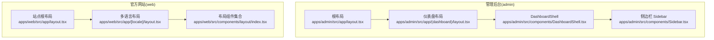
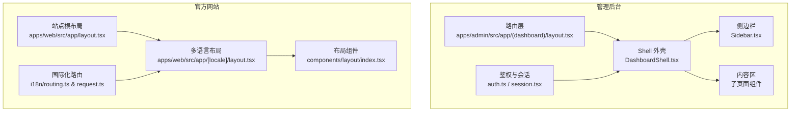
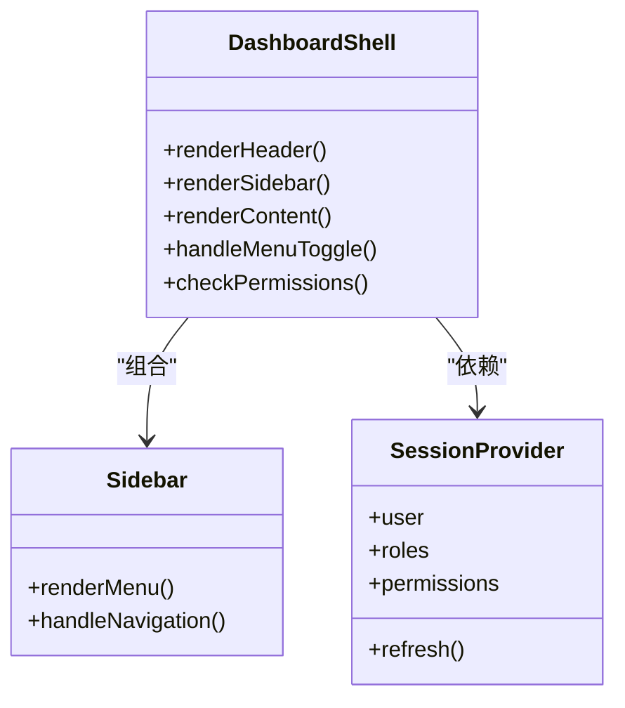
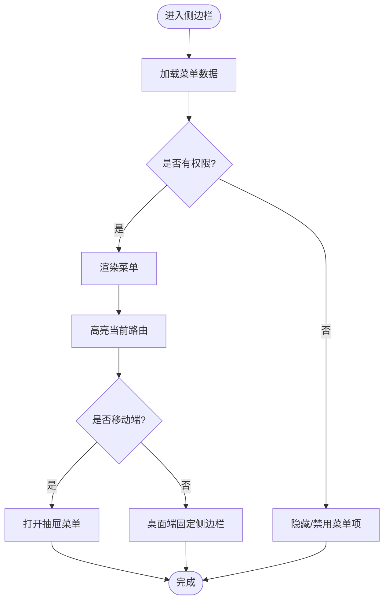
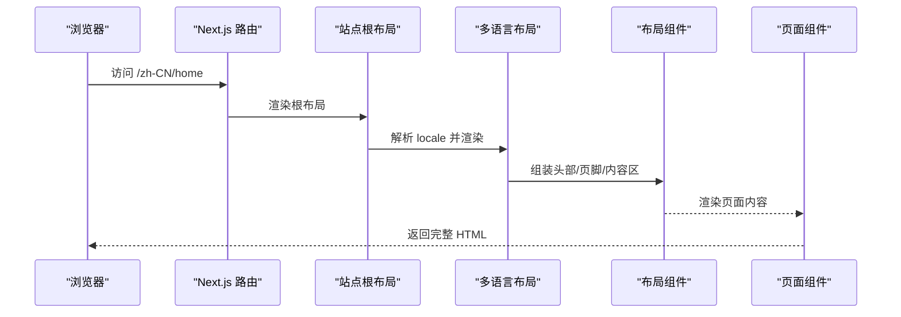
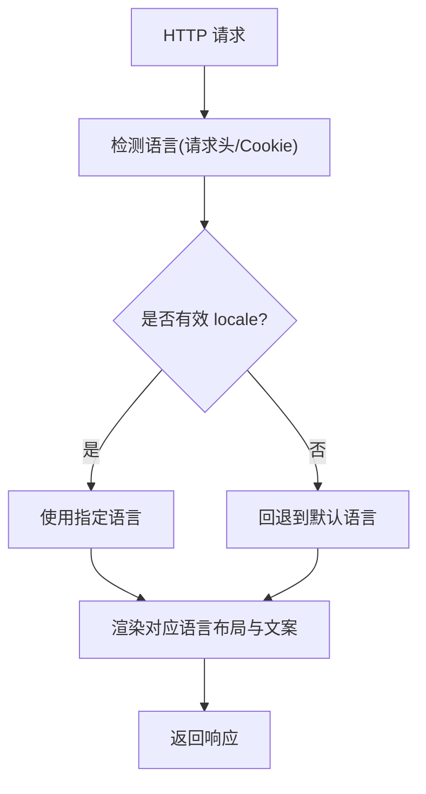
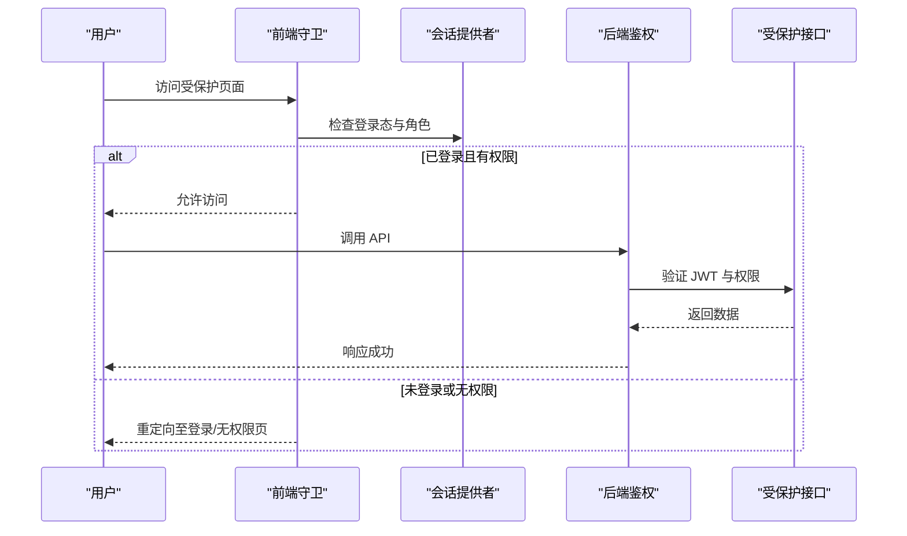
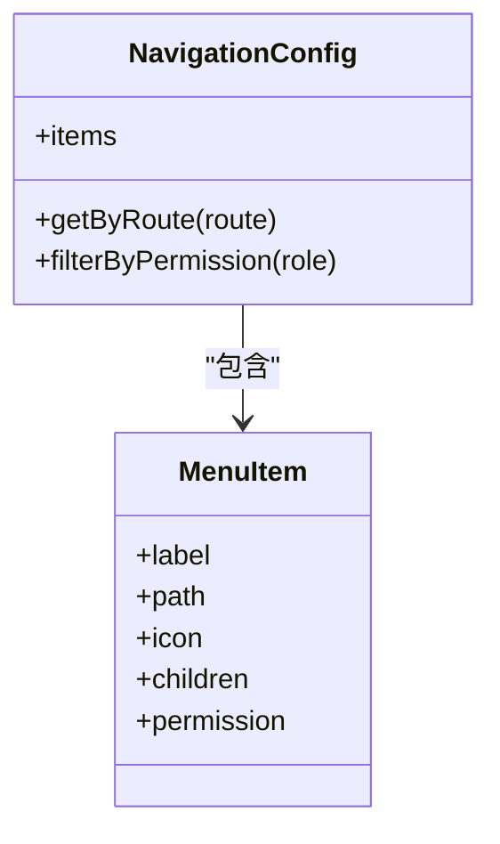
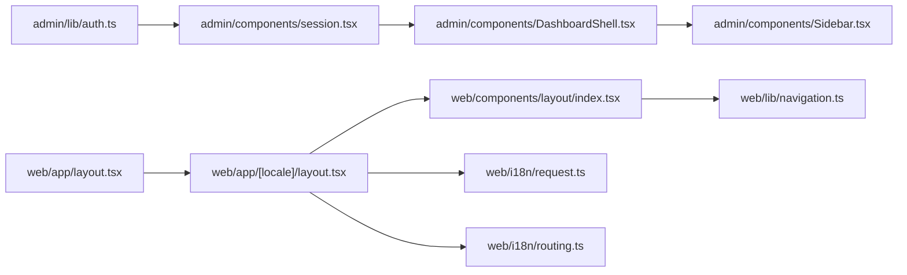

# 页面模板与布局

<cite>
**本文引用的文件**   
- [apps/admin/src/app/layout.tsx](file://apps/admin/src/app/layout.tsx)
- [apps/admin/src/app/(dashboard)/layout.tsx](file://apps/admin/src/app/(dashboard)/layout.tsx)
- [apps/admin/src/components/DashboardShell.tsx](file://apps/admin/src/components/DashboardShell.tsx)
- [apps/admin/src/components/Sidebar.tsx](file://apps/admin/src/components/Sidebar.tsx)
- [apps/admin/src/components/session.tsx](file://apps/admin/src/components/session.tsx)
- [apps/admin/src/lib/auth.ts](file://apps/admin/src/lib/auth.ts)
- [apps/web/src/app/[locale]/layout.tsx](file://apps/web/src/app/[locale]/layout.tsx)
- [apps/web/src/app/layout.tsx](file://apps/web/src/app/layout.tsx)
- [apps/web/src/components/layout/index.tsx](file://apps/web/src/components/layout/index.tsx)
- [apps/web/src/i18n/routing.ts](file://apps/web/src/i18n/routing.ts)
- [apps/web/src/i18n/request.ts](file://apps/web/src/i18n/request.ts)
- [apps/web/src/lib/navigation.ts](file://apps/web/src/lib/navigation.ts)
</cite>

## 目录
1. [简介](#简介)
2. [项目结构](#项目结构)
3. [核心组件](#核心组件)
4. [架构总览](#架构总览)
5. [详细组件分析](#详细组件分析)
6. [依赖关系分析](#依赖关系分析)
7. [性能考量](#性能考量)
8. [故障排查指南](#故障排查指南)
9. [结论](#结论)
10. [附录](#附录)

## 简介
本文件面向管理后台（admin）与官方网站（web）的页面模板与布局系统，系统性阐述：
- 页面结构与导航布局
- Shell 组件、侧边栏、头部导航、内容区域的配置与使用
- 路由守卫与权限控制
- 国际化支持
- 响应式设计策略
- 页面模板最佳实践与自定义布局开发指南

目标是帮助开发者快速理解并扩展多应用下的统一布局体系。

## 项目结构
本项目采用多应用（Monorepo）组织方式，包含三个主要应用：
- admin：管理后台（Next.js App Router），基于分组路由与 Shell 布局
- web：官方网站（Next.js App Router），基于多语言路由与站点级布局
- api：后端服务（NestJS），提供鉴权、权限、数据接口等能力

关键布局文件分布：
- 管理后台根布局与仪表盘布局分别定义在 apps/admin/src/app 下
- 网站多语言布局与站点布局分别定义在 apps/web/src/app 下
- 共享 UI 与业务组件位于各应用的 components 目录

图表来源 
- [apps/admin/src/app/layout.tsx](file://apps/admin/src/app/layout.tsx)
- [apps/admin/src/app/(dashboard)/layout.tsx](file://apps/admin/src/app/(dashboard)/layout.tsx)
- [apps/admin/src/components/DashboardShell.tsx](file://apps/admin/src/components/DashboardShell.tsx)
- [apps/admin/src/components/Sidebar.tsx](file://apps/admin/src/components/Sidebar.tsx)
- [apps/web/src/app/layout.tsx](file://apps/web/src/app/layout.tsx)
- [apps/web/src/app/[locale]/layout.tsx](file://apps/web/src/app/[locale]/layout.tsx)
- [apps/web/src/components/layout/index.tsx](file://apps/web/src/components/layout/index.tsx)

章节来源
- [apps/admin/src/app/layout.tsx](file://apps/admin/src/app/layout.tsx)
- [apps/admin/src/app/(dashboard)/layout.tsx](file://apps/admin/src/app/(dashboard)/layout.tsx)
- [apps/web/src/app/layout.tsx](file://apps/web/src/app/layout.tsx)
- [apps/web/src/app/[locale]/layout.tsx](file://apps/web/src/app/[locale]/layout.tsx)

## 核心组件
- Shell 组件：作为页面外壳，承载头部、侧边栏、内容区与全局状态/上下文
- 侧边栏：管理后台主导航入口，支持多级菜单与动态加载
- 头部导航：用户信息、通知、设置入口，以及移动端折叠菜单
- 内容区域：根据路由渲染具体页面，支持骨架屏与错误边界
- 国际化：按 locale 分层的布局与导航文案切换
- 路由守卫与权限：前端基于会话与角色判断，结合后端鉴权中间件

章节来源
- [apps/admin/src/components/DashboardShell.tsx](file://apps/admin/src/components/DashboardShell.tsx)
- [apps/admin/src/components/Sidebar.tsx](file://apps/admin/src/components/Sidebar.tsx)
- [apps/web/src/components/layout/index.tsx](file://apps/web/src/components/layout/index.tsx)
- [apps/web/src/i18n/routing.ts](file://apps/web/src/i18n/routing.ts)
- [apps/web/src/i18n/request.ts](file://apps/web/src/i18n/request.ts)
- [apps/admin/src/lib/auth.ts](file://apps/admin/src/lib/auth.ts)
- [apps/admin/src/components/session.tsx](file://apps/admin/src/components/session.tsx)

## 架构总览
下图展示了管理后台与官网的布局层级与交互关系，包括路由、Shell、侧边栏、头部与内容区的协作方式。

图表来源 
- [apps/admin/src/app/(dashboard)/layout.tsx](file://apps/admin/src/app/(dashboard)/layout.tsx)
- [apps/admin/src/components/DashboardShell.tsx](file://apps/admin/src/components/DashboardShell.tsx)
- [apps/admin/src/components/Sidebar.tsx](file://apps/admin/src/components/Sidebar.tsx)
- [apps/admin/src/lib/auth.ts](file://apps/admin/src/lib/auth.ts)
- [apps/admin/src/components/session.tsx](file://apps/admin/src/components/session.tsx)
- [apps/web/src/app/layout.tsx](file://apps/web/src/app/layout.tsx)
- [apps/web/src/app/[locale]/layout.tsx](file://apps/web/src/app/[locale]/layout.tsx)
- [apps/web/src/components/layout/index.tsx](file://apps/web/src/components/layout/index.tsx)
- [apps/web/src/i18n/routing.ts](file://apps/web/src/i18n/routing.ts)
- [apps/web/src/i18n/request.ts](file://apps/web/src/i18n/request.ts)

## 详细组件分析

### 管理后台 Shell 组件（DashboardShell）
- 职责：统一包裹仪表盘页面，集成头部、侧边栏、内容区与全局状态（如会话、主题、通知）
- 特性：
  - 响应式布局：移动端自动折叠侧边栏，提供抽屉式菜单
  - 权限控制：根据当前用户角色/权限动态显示菜单项与操作按钮
  - 国际化：通过 i18n 上下文注入文案
  - 错误边界：捕获渲染异常并提供回退 UI
- 扩展点：可插入自定义头部工具栏、快捷入口、统计卡片等

图表来源 
- [apps/admin/src/components/DashboardShell.tsx](file://apps/admin/src/components/DashboardShell.tsx)
- [apps/admin/src/components/Sidebar.tsx](file://apps/admin/src/components/Sidebar.tsx)
- [apps/admin/src/components/session.tsx](file://apps/admin/src/components/session.tsx)

章节来源
- [apps/admin/src/components/DashboardShell.tsx](file://apps/admin/src/components/DashboardShell.tsx)
- [apps/admin/src/components/Sidebar.tsx](file://apps/admin/src/components/Sidebar.tsx)
- [apps/admin/src/components/session.tsx](file://apps/admin/src/components/session.tsx)

### 侧边栏（Sidebar）
- 职责：展示管理后台主导航，支持多级菜单与图标、角标、搜索过滤
- 行为：
  - 路由高亮：根据当前路径匹配激活项
  - 权限过滤：依据角色/权限隐藏或禁用菜单
  - 响应式：小屏设备切换为抽屉模式
- 配置：可通过外部菜单配置文件或 API 动态生成

图表来源 
- [apps/admin/src/components/Sidebar.tsx](file://apps/admin/src/components/Sidebar.tsx)

章节来源
- [apps/admin/src/components/Sidebar.tsx](file://apps/admin/src/components/Sidebar.tsx)

### 网站布局（Web Layout）
- 站点根布局：定义全局 HTML 结构、元数据、字体与样式注入
- 多语言布局：基于 [locale] 路由段，提供语言切换、SEO 元信息与本地化资源加载
- 布局组件：封装头部、页脚、面包屑、内容容器等通用模块

图表来源 
- [apps/web/src/app/layout.tsx](file://apps/web/src/app/layout.tsx)
- [apps/web/src/app/[locale]/layout.tsx](file://apps/web/src/app/[locale]/layout.tsx)
- [apps/web/src/components/layout/index.tsx](file://apps/web/src/components/layout/index.tsx)

章节来源
- [apps/web/src/app/layout.tsx](file://apps/web/src/app/layout.tsx)
- [apps/web/src/app/[locale]/layout.tsx](file://apps/web/src/app/[locale]/layout.tsx)
- [apps/web/src/components/layout/index.tsx](file://apps/web/src/components/layout/index.tsx)

### 国际化支持（i18n）
- 路由：通过 [locale] 路由段实现多语言 URL 前缀
- 请求：服务端根据 Accept-Language 或 Cookie 确定默认语言
- 导航：导航文案与链接按语言动态生成

图表来源 
- [apps/web/src/i18n/routing.ts](file://apps/web/src/i18n/routing.ts)
- [apps/web/src/i18n/request.ts](file://apps/web/src/i18n/request.ts)

章节来源
- [apps/web/src/i18n/routing.ts](file://apps/web/src/i18n/routing.ts)
- [apps/web/src/i18n/request.ts](file://apps/web/src/i18n/request.ts)

### 路由守卫与权限控制
- 前端守卫：基于会话与角色判断，拦截未授权路由跳转
- 菜单/按钮级权限：根据权限码控制可见性与可操作状态
- 后端校验：API 层通过装饰器与守卫确保数据安全

图表来源 
- [apps/admin/src/lib/auth.ts](file://apps/admin/src/lib/auth.ts)
- [apps/admin/src/components/session.tsx](file://apps/admin/src/components/session.tsx)

章节来源
- [apps/admin/src/lib/auth.ts](file://apps/admin/src/lib/auth.ts)
- [apps/admin/src/components/session.tsx](file://apps/admin/src/components/session.tsx)

### 导航与菜单配置
- 导航数据结构：集中管理站点与后台菜单项，支持多级嵌套与条件显示
- 动态更新：可从配置中心或 API 获取最新导航，避免硬编码
- SEO 友好：自动生成面包屑与结构化数据

图表来源 
- [apps/web/src/lib/navigation.ts](file://apps/web/src/lib/navigation.ts)

章节来源
- [apps/web/src/lib/navigation.ts](file://apps/web/src/lib/navigation.ts)

## 依赖关系分析
- 管理后台依赖：
  - 会话与鉴权：session.tsx、auth.ts
  - 布局与导航：DashboardShell.tsx、Sidebar.tsx
  - 路由：Next.js App Router 分组路由
- 官方网站依赖：
  - 多语言：i18n/routing.ts、i18n/request.ts
  - 布局：layout.tsx、[locale]/layout.tsx、components/layout/index.tsx
  - 导航：lib/navigation.ts

图表来源 
- [apps/admin/src/lib/auth.ts](file://apps/admin/src/lib/auth.ts)
- [apps/admin/src/components/session.tsx](file://apps/admin/src/components/session.tsx)
- [apps/admin/src/components/DashboardShell.tsx](file://apps/admin/src/components/DashboardShell.tsx)
- [apps/admin/src/components/Sidebar.tsx](file://apps/admin/src/components/Sidebar.tsx)
- [apps/web/src/app/layout.tsx](file://apps/web/src/app/layout.tsx)
- [apps/web/src/app/[locale]/layout.tsx](file://apps/web/src/app/[locale]/layout.tsx)
- [apps/web/src/components/layout/index.tsx](file://apps/web/src/components/layout/index.tsx)
- [apps/web/src/lib/navigation.ts](file://apps/web/src/lib/navigation.ts)
- [apps/web/src/i18n/request.ts](file://apps/web/src/i18n/request.ts)
- [apps/web/src/i18n/routing.ts](file://apps/web/src/i18n/routing.ts)

章节来源
- [apps/admin/src/lib/auth.ts](file://apps/admin/src/lib/auth.ts)
- [apps/admin/src/components/session.tsx](file://apps/admin/src/components/session.tsx)
- [apps/admin/src/components/DashboardShell.tsx](file://apps/admin/src/components/DashboardShell.tsx)
- [apps/admin/src/components/Sidebar.tsx](file://apps/admin/src/components/Sidebar.tsx)
- [apps/web/src/app/layout.tsx](file://apps/web/src/app/layout.tsx)
- [apps/web/src/app/[locale]/layout.tsx](file://apps/web/src/app/[locale]/layout.tsx)
- [apps/web/src/components/layout/index.tsx](file://apps/web/src/components/layout/index.tsx)
- [apps/web/src/lib/navigation.ts](file://apps/web/src/lib/navigation.ts)
- [apps/web/src/i18n/request.ts](file://apps/web/src/i18n/request.ts)
- [apps/web/src/i18n/routing.ts](file://apps/web/src/i18n/routing.ts)

## 性能考量
- 代码分割与懒加载：按需加载侧边栏菜单、图表与富文本编辑器资源
- 静态资源优化：图片懒加载、CDN 缓存、字体预加载
- 首屏渲染：SSR 与 SSG 结合，减少客户端计算；骨架屏提升感知速度
- 缓存策略：API 响应缓存、路由级缓存、浏览器缓存头配置
- 监控与度量：集成性能埋点与 Lighthouse 指标采集

## 故障排查指南
- 登录态异常：检查会话刷新逻辑与 Token 过期处理
- 权限拒绝：核对角色/权限映射与菜单过滤规则
- 多语言失效：确认请求头与 Cookie 中的语言设置是否正确传递
- 布局错乱：检查响应式断点与 CSS 变量覆盖
- 路由守卫死循环：避免在守卫中触发重复跳转或状态更新

章节来源
- [apps/admin/src/lib/auth.ts](file://apps/admin/src/lib/auth.ts)
- [apps/admin/src/components/session.tsx](file://apps/admin/src/components/session.tsx)
- [apps/web/src/i18n/request.ts](file://apps/web/src/i18n/request.ts)

## 结论
本布局系统以 Shell 为核心，将管理后台与官方网站的页面结构、导航与国际化进行统一抽象，并通过前后端协同的权限控制保障安全与一致性。遵循本文的最佳实践与扩展指南，可高效构建可维护、可扩展且体验优良的页面模板与布局。

## 附录
- 自定义布局开发步骤：
  - 新建布局文件并在路由组中注册
  - 复用 Shell 组件与侧边栏/头部模块
  - 接入权限与国际化上下文
  - 编写单元测试与端到端测试用例
- 常用断点与响应式策略：
  - 移动端优先设计，逐步增强桌面端体验
  - 使用弹性布局与网格系统保证自适应
- 最佳实践清单：
  - 保持布局组件纯函数化与可组合性
  - 将导航与权限配置外置，便于热更新
  - 对敏感操作增加二次确认与审计日志