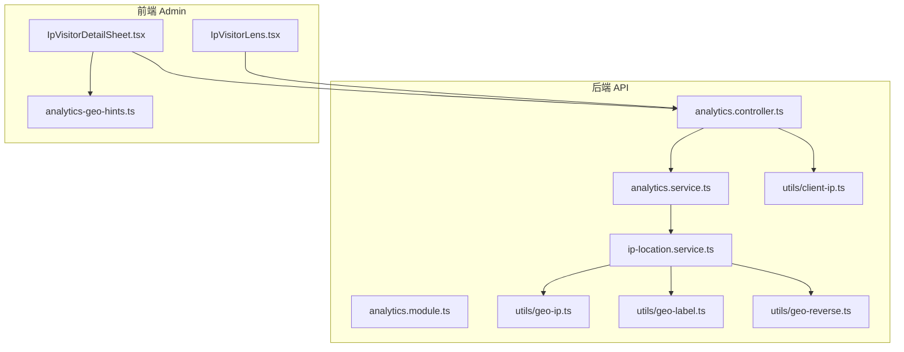
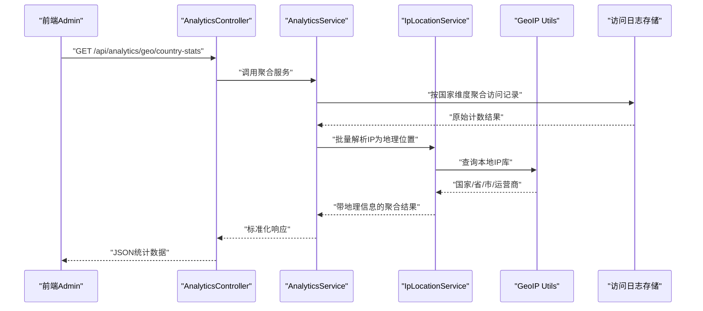
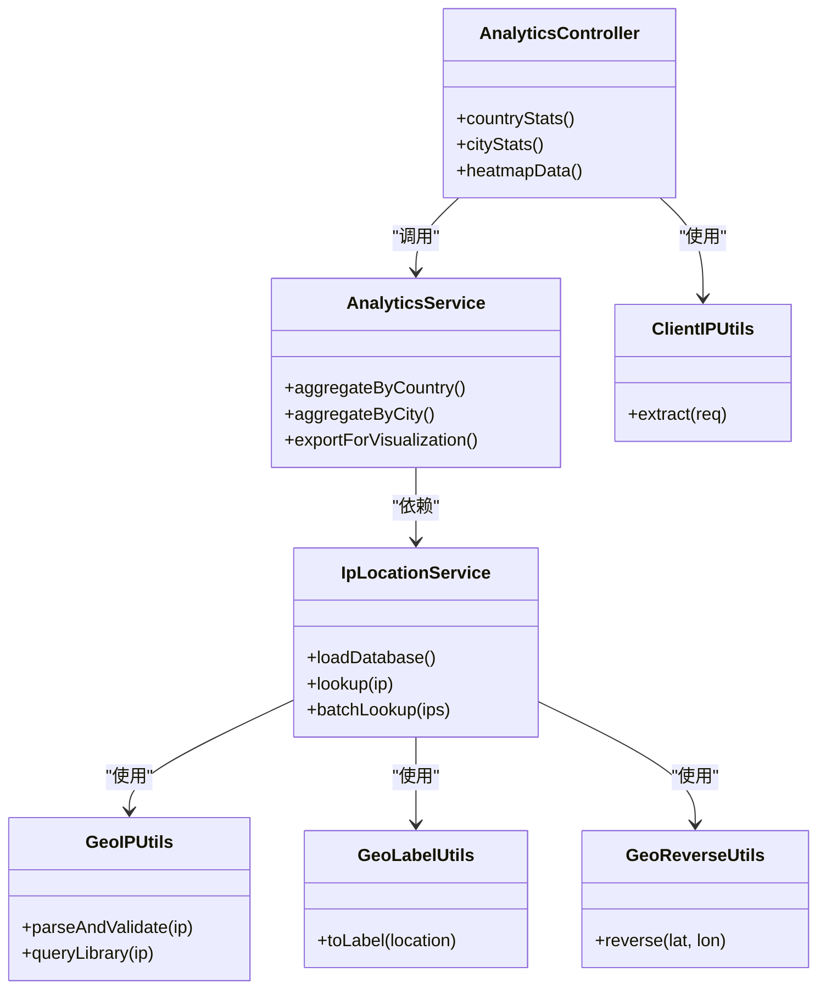

# 地理位置服务

<cite>
**本文引用的文件**   
- [ip-location.service.ts](file://apps/api/src/analytics/ip-location.service.ts)
- [geo-ip.ts](file://apps/api/src/analytics/utils/geo-ip.ts)
- [geo-label.ts](file://apps/api/src/analytics/utils/geo-label.ts)
- [geo-reverse.ts](file://apps/api/src/analytics/utils/geo-reverse.ts)
- [analytics.controller.ts](file://apps/api/src/analytics/analytics.controller.ts)
- [analytics.service.ts](file://apps/api/src/analytics/analytics.service.ts)
- [analytics.module.ts](file://apps/api/src/analytics/analytics.module.ts)
- [client-ip.ts](file://apps/api/src/analytics/utils/client-ip.ts)
- [lib-qqwry.d.ts](file://apps/api/src/types/lib-qqwry.d.ts)
- [IpVisitorDetailSheet.tsx](file://apps/admin/src/components/analytics/IpVisitorDetailSheet.tsx)
- [IpVisitorLens.tsx](file://apps/admin/src/components/visitors/IpVisitorLens.tsx)
- [analytics-geo-hints.ts](file://apps/admin/src/lib/analytics-geo-hints.ts)
</cite>

## 目录
1. [简介](#简介)
2. [项目结构](#项目结构)
3. [核心组件](#核心组件)
4. [架构总览](#架构总览)
5. [详细组件分析](#详细组件分析)
6. [依赖关系分析](#依赖关系分析)
7. [性能考量](#性能考量)
8. [故障排查指南](#故障排查指南)
9. [结论](#结论)
10. [附录：API使用示例与最佳实践](#附录api使用示例与最佳实践)

## 简介
本文件面向地理位置服务的实现与使用，覆盖以下主题：
- IP地址到地理位置的映射机制（基于本地IP库）
- 地理数据库更新与维护策略
- 经纬度坐标转换、时区识别与本地化信息获取
- 反向地理编码、距离计算与区域聚合分析
- 地理位置API的使用示例（城市级统计、国家分布图、热力图数据生成）
- 地理数据精度说明、更新频率建议与异常数据处理

## 项目结构
地理位置能力主要位于后端 analytics 模块中，包含控制器、服务与工具函数；前端在管理端提供展示与分析视图。

图表来源
- [analytics.controller.ts](file://apps/api/src/analytics/analytics.controller.ts)
- [analytics.service.ts](file://apps/api/src/analytics/analytics.service.ts)
- [analytics.module.ts](file://apps/api/src/analytics/analytics.module.ts)
- [ip-location.service.ts](file://apps/api/src/analytics/ip-location.service.ts)
- [geo-ip.ts](file://apps/api/src/analytics/utils/geo-ip.ts)
- [geo-label.ts](file://apps/api/src/analytics/utils/geo-label.ts)
- [geo-reverse.ts](file://apps/api/src/analytics/utils/geo-reverse.ts)
- [client-ip.ts](file://apps/api/src/analytics/utils/client-ip.ts)
- [IpVisitorDetailSheet.tsx](file://apps/admin/src/components/analytics/IpVisitorDetailSheet.tsx)
- [IpVisitorLens.tsx](file://apps/admin/src/components/visitors/IpVisitorLens.tsx)
- [analytics-geo-hints.ts](file://apps/admin/src/lib/analytics-geo-hints.ts)

章节来源
- [analytics.controller.ts](file://apps/api/src/analytics/analytics.controller.ts)
- [analytics.service.ts](file://apps/api/src/analytics/analytics.service.ts)
- [analytics.module.ts](file://apps/api/src/analytics/analytics.module.ts)
- [ip-location.service.ts](file://apps/api/src/analytics/ip-location.service.ts)
- [geo-ip.ts](file://apps/api/src/analytics/utils/geo-ip.ts)
- [geo-label.ts](file://apps/api/src/analytics/utils/geo-label.ts)
- [geo-reverse.ts](file://apps/api/src/analytics/utils/geo-reverse.ts)
- [client-ip.ts](file://apps/api/src/analytics/utils/client-ip.ts)
- [IpVisitorDetailSheet.tsx](file://apps/admin/src/components/analytics/IpVisitorDetailSheet.tsx)
- [IpVisitorLens.tsx](file://apps/admin/src/components/visitors/IpVisitorLens.tsx)
- [analytics-geo-hints.ts](file://apps/admin/src/lib/analytics-geo-hints.ts)

## 核心组件
- IP定位服务：封装IP到地理位置的查询逻辑，负责加载并查询本地IP库，返回国家、省份、城市、运营商等字段。
- 工具函数：
  - geo-ip：解析与校验IP、调用IP库查询。
  - geo-label：将位置对象转换为可读标签（如“中国-广东-深圳”）。
  - geo-reverse：根据经纬度进行反向地理编码，返回地名、行政区划、时区等。
  - client-ip：从请求头安全提取客户端真实IP。
- 控制器与服务：对外暴露分析接口，聚合访问日志中的地理位置维度，支持按国家/城市统计、导出可视化数据。
- 前端展示：管理端提供访客详情面板与IP维度筛选器，结合地理提示辅助展示。

章节来源
- [ip-location.service.ts](file://apps/api/src/analytics/ip-location.service.ts)
- [geo-ip.ts](file://apps/api/src/analytics/utils/geo-ip.ts)
- [geo-label.ts](file://apps/api/src/analytics/utils/geo-label.ts)
- [geo-reverse.ts](file://apps/api/src/analytics/utils/geo-reverse.ts)
- [client-ip.ts](file://apps/api/src/analytics/utils/client-ip.ts)
- [analytics.controller.ts](file://apps/api/src/analytics/analytics.controller.ts)
- [analytics.service.ts](file://apps/api/src/analytics/analytics.service.ts)
- [IpVisitorDetailSheet.tsx](file://apps/admin/src/components/analytics/IpVisitorDetailSheet.tsx)
- [IpVisitorLens.tsx](file://apps/admin/src/components/visitors/IpVisitorLens.tsx)
- [analytics-geo-hints.ts](file://apps/admin/src/lib/analytics-geo-hints.ts)

## 架构总览
下图展示了从HTTP请求到地理位置解析与返回的关键流程，以及前后端交互点。

图表来源
- [analytics.controller.ts](file://apps/api/src/analytics/analytics.controller.ts)
- [analytics.service.ts](file://apps/api/src/analytics/analytics.service.ts)
- [ip-location.service.ts](file://apps/api/src/analytics/ip-location.service.ts)
- [geo-ip.ts](file://apps/api/src/analytics/utils/geo-ip.ts)

## 详细组件分析

### IP定位服务（IpLocationService）
职责：
- 初始化并加载本地IP库（例如QQWry格式），确保内存中可用。
- 提供IP到地理位置的查询方法，返回结构化字段（国家、省份、城市、ISP等）。
- 处理缓存与错误降级，保证高并发下的稳定性。

关键点：
- 本地库路径与版本管理，便于定期更新。
- 查询失败时的回退策略（如仅返回国家或未知标记）。
- 批量查询优化（去重、分页、并行）。

章节来源
- [ip-location.service.ts](file://apps/api/src/analytics/ip-location.service.ts)
- [lib-qqwry.d.ts](file://apps/api/src/types/lib-qqwry.d.ts)

### 工具函数：geo-ip、geo-label、geo-reverse、client-ip
- geo-ip：
  - 输入：字符串IP
  - 输出：地理位置对象（国家、省份、城市、经纬度、时区、运营商等）
  - 行为：校验IP合法性、调用本地库、缓存命中优先
- geo-label：
  - 输入：地理位置对象
  - 输出：人类可读标签（如“中国-广东-深圳”）
  - 行为：空值处理、语言适配
- geo-reverse：
  - 输入：经纬度坐标
  - 输出：地名、行政区、时区、本地化名称
  - 行为：边界检查、默认时区回退
- client-ip：
  - 输入：HTTP请求上下文
  - 输出：客户端真实IP
  - 行为：信任代理头、过滤内网与非法IP

章节来源
- [geo-ip.ts](file://apps/api/src/analytics/utils/geo-ip.ts)
- [geo-label.ts](file://apps/api/src/analytics/utils/geo-label.ts)
- [geo-reverse.ts](file://apps/api/src/analytics/utils/geo-reverse.ts)
- [client-ip.ts](file://apps/api/src/analytics/utils/client-ip.ts)

### 控制器与服务：analytics.controller.ts、analytics.service.ts
- 控制器：
  - 暴露REST接口，接收时间范围、粒度（国家/城市）、排序与分页参数。
  - 统一鉴权与限流，返回标准JSON结构。
- 服务：
  - 聚合访问日志，按地理维度分组统计。
  - 调用IpLocationService补充地理位置信息。
  - 提供导出接口用于前端可视化（国家分布、城市排行、热力图数据）。

章节来源
- [analytics.controller.ts](file://apps/api/src/analytics/analytics.controller.ts)
- [analytics.service.ts](file://apps/api/src/analytics/analytics.service.ts)

### 前端展示：IpVisitorDetailSheet.tsx、IpVisitorLens.tsx、analytics-geo-hints.ts
- IpVisitorDetailSheet：展示单个IP访客的地理位置详情（国家、省份、城市、ISP、最近访问时间等）。
- IpVisitorLens：在访客列表中按IP维度筛选与聚合，支持按国家/城市过滤。
- analytics-geo-hints：提供地理相关的前端提示与格式化辅助（如地区标签、时区显示）。

章节来源
- [IpVisitorDetailSheet.tsx](file://apps/admin/src/components/analytics/IpVisitorDetailSheet.tsx)
- [IpVisitorLens.tsx](file://apps/admin/src/components/visitors/IpVisitorLens.tsx)
- [analytics-geo-hints.ts](file://apps/admin/src/lib/analytics-geo-hints.ts)

## 依赖关系分析
- 模块装配：analytics.module.ts注册控制器、服务与工具依赖。
- 外部依赖：本地IP库（如QQWry）类型定义位于types/lib-qqwry.d.ts。
- 数据流向：控制器→服务→IP定位服务→工具函数→本地IP库→返回结构化地理信息。

图表来源
- [analytics.controller.ts](file://apps/api/src/analytics/analytics.controller.ts)
- [analytics.service.ts](file://apps/api/src/analytics/analytics.service.ts)
- [ip-location.service.ts](file://apps/api/src/analytics/ip-location.service.ts)
- [geo-ip.ts](file://apps/api/src/analytics/utils/geo-ip.ts)
- [geo-label.ts](file://apps/api/src/analytics/utils/geo-label.ts)
- [geo-reverse.ts](file://apps/api/src/analytics/utils/geo-reverse.ts)
- [client-ip.ts](file://apps/api/src/analytics/utils/client-ip.ts)

章节来源
- [analytics.module.ts](file://apps/api/src/analytics/analytics.module.ts)
- [lib-qqwry.d.ts](file://apps/api/src/types/lib-qqwry.d.ts)

## 性能考量
- 本地IP库加载：启动时一次性加载至内存，避免重复I/O。
- 查询缓存：对热点IP进行短期缓存，降低重复查询开销。
- 批量处理：对聚合任务采用分批与并行策略，减少阻塞。
- 降级策略：当IP库不可用时，返回最小可用字段（如国家）并记录告警。
- 前端渲染：大数据量时使用分页与虚拟滚动，避免UI卡顿。

[本节为通用指导，不直接分析具体文件]

## 故障排查指南
常见问题与处理建议：
- IP库加载失败：
  - 检查文件路径与权限，确认库文件格式正确。
  - 查看启动日志中的错误堆栈，必要时回滚到上一版本库。
- 查询结果为空或异常：
  - 校验输入IP是否合法，排除私有/保留地址。
  - 检查代理头配置，确保client-ip能正确提取真实IP。
- 时区与本地化不一致：
  - 确认geo-reverse返回的时区ID有效，必要时回退到UTC。
  - 前端显示时区需考虑夏令时规则。
- 聚合数据偏差：
  - 检查时间窗口与去重逻辑，确认日志采集完整。
  - 对缺失地理位置的记录进行补全或标记。

章节来源
- [geo-ip.ts](file://apps/api/src/analytics/utils/geo-ip.ts)
- [geo-reverse.ts](file://apps/api/src/analytics/utils/geo-reverse.ts)
- [client-ip.ts](file://apps/api/src/analytics/utils/client-ip.ts)
- [analytics.service.ts](file://apps/api/src/analytics/analytics.service.ts)

## 结论
本地理位置服务以本地IP库为核心，结合工具函数与模块化设计，提供稳定高效的IP到地理位置映射能力。通过控制器与服务层暴露聚合接口，满足城市级统计、国家分布图与热力图等可视化需求。建议在部署环境中建立定期更新机制，完善异常监控与降级策略，以保证数据质量与系统可用性。

[本节为总结性内容，不直接分析具体文件]

## 附录：API使用示例与最佳实践

### 城市级统计
- 接口：GET /api/analytics/geo/city-stats
- 参数：时间范围、排序字段、分页
- 返回：按城市聚合的访问量、占比、趋势指标
- 用途：城市热度排行、投放效果评估

### 国家分布图
- 接口：GET /api/analytics/geo/country-stats
- 参数：时间范围、维度粒度
- 返回：国家维度计数与比例
- 用途：全球流量分布、市场拓展分析

### 热力图数据生成
- 接口：GET /api/analytics/geo/heatmap-data
- 参数：时间范围、缩放级别、区域边界
- 返回：经纬度网格密度、颜色映射值
- 用途：地图热力渲染、实时流量监控

### 经纬度坐标转换与时区识别
- 使用geo-reverse：输入经纬度，输出地名、时区、本地化名称
- 使用时区库：将UTC时间转换为本地时间，考虑夏令时
- 注意：边界模糊区域的坐标可能返回近似地名

### 反向地理编码
- 输入：经纬度
- 输出：行政区、街道、POI、时区
- 应用：访客定位、配送地址校验、区域营销

### 距离计算与区域聚合
- 距离计算：使用Haversine公式计算两点球面距离
- 区域聚合：将经纬度映射到行政边界或自定义网格，统计密度与指标
- 优化：预计算常用区域中心点，减少重复计算

### 地理数据精度与更新频率
- 精度说明：城市级通常可达90%以上，街道级受限于IP库分辨率
- 更新频率：建议每月更新一次IP库，重大变更时即时更新
- 监控：记录查询命中率、平均延迟、错误率，设置阈值告警

### 异常数据处理
- 无效IP：跳过或标记为“未知”，避免污染统计
- 缺失字段：填充默认值并记录日志，便于后续修复
- 超时与降级：限制外部依赖超时，启用本地缓存与回退逻辑

章节来源
- [analytics.controller.ts](file://apps/api/src/analytics/analytics.controller.ts)
- [analytics.service.ts](file://apps/api/src/analytics/analytics.service.ts)
- [geo-reverse.ts](file://apps/api/src/analytics/utils/geo-reverse.ts)
- [geo-ip.ts](file://apps/api/src/analytics/utils/geo-ip.ts)
- [IpVisitorDetailSheet.tsx](file://apps/admin/src/components/analytics/IpVisitorDetailSheet.tsx)
- [IpVisitorLens.tsx](file://apps/admin/src/components/visitors/IpVisitorLens.tsx)
- [analytics-geo-hints.ts](file://apps/admin/src/lib/analytics-geo-hints.ts)