# 数据分析与采集

<cite>
**本文引用的文件**   
- [analytics.controller.ts](file://apps/api/src/analytics/analytics.controller.ts)
- [analytics.service.ts](file://apps/api/src/analytics/analytics.service.ts)
- [ip-location.service.ts](file://apps/api/src/analytics/ip-location.service.ts)
- [collect-pageview.dto.ts](file://apps/api/src/analytics/dto/collect-pageview.dto.ts)
- [identify.dto.ts](file://apps/api/src/analytics/dto/identify.dto.ts)
- [ua-parser.ts](file://apps/api/src/analytics/utils/ua-parser.ts)
- [geo-ip.ts](file://apps/api/src/analytics/utils/geo-ip.ts)
- [geo-label.ts](file://apps/api/src/analytics/utils/geo-label.ts)
- [geo-reverse.ts](file://apps/api/src/analytics/utils/geo-reverse.ts)
- [traffic-source.ts](file://apps/api/src/analytics/utils/traffic-source.ts)
- [key-pages.ts](file://apps/api/src/analytics/utils/key-pages.ts)
- [client-ip.ts](file://apps/api/src/analytics/utils/client-ip.ts)
- [last-ip.ts](file://apps/api/src/analytics/utils/last-ip.ts)
- [analytics-list.ts](file://apps/api/src/analytics/utils/analytics-list.ts)
- [VisitorTracker.tsx](file://apps/web/src/components/analytics/VisitorTracker.tsx)
- [analytics.ts](file://apps/web/src/lib/analytics.ts)
- [analytics-export.ts](file://apps/admin/src/features/analytics-export.ts)
- [analytics.ts](file://apps/admin/src/features/analytics.ts)
- [IpVisitorLens.tsx](file://apps/admin/src/components/visitors/IpVisitorLens.tsx)
- [PeopleVisitorLens.tsx](file://apps/admin/src/components/visitors/PeopleVisitorLens.tsx)
- [AnalyticsCharts.tsx](file://apps/admin/src/components/analytics/AnalyticsCharts.tsx)
- [schema.prisma](file://apps/api/prisma/schema.prisma)
</cite>

## 目录
1. [简介](#简介)
2. [项目结构](#项目结构)
3. [核心组件](#核心组件)
4. [架构总览](#架构总览)
5. [详细组件分析](#详细组件分析)
6. [依赖关系分析](#依赖关系分析)
7. [性能考虑](#性能考虑)
8. [故障排查指南](#故障排查指南)
9. [结论](#结论)
10. [附录：API 使用示例与数据处理流程](#附录api-使用示例与数据处理流程)

## 简介
本系统面向网站访问统计、用户行为分析、流量来源追踪与数据聚合处理，提供从前端埋点到后端采集、清洗、解析、地理定位、关键页面识别、转化率计算的全链路能力。系统包含：
- 前端埋点与上报：在 Web 端通过轻量 SDK 采集页面浏览、事件、设备信息、来源等，并批量上报至 API。
- 后端采集服务：接收上报数据，进行去重、校验、UA 解析、IP 地理定位、来源推断、关键页面标记、聚合存储。
- 管理端分析：提供按 IP/访客维度、时间粒度、渠道来源的可视化分析与导出能力。
- 数据质量与监控：内置异常检测、缓存策略、批量处理与错误重试机制，保障高吞吐与稳定性。

## 项目结构
- 前端（Web）埋点与上报：位于 apps/web，核心为 VisitorTracker 组件与 analytics 工具库，负责采集浏览器 UA、屏幕分辨率、语言、来源、页面路径等，并按批上报。
- 后端（API）采集与分析：位于 apps/api，核心模块 analytics 提供 REST 接口，封装 DTO、工具类（UA 解析、IP 定位、来源推断、关键页面识别）、服务层与控制器。
- 管理端（Admin）分析展示：位于 apps/admin，提供访客列表、图表、导出等功能，调用后端 analytics 接口。

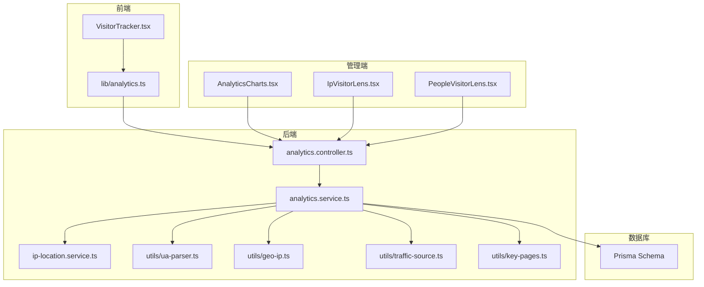

**图表来源** 
- [VisitorTracker.tsx](file://apps/web/src/components/analytics/VisitorTracker.tsx)
- [analytics.ts](file://apps/web/src/lib/analytics.ts)
- [analytics.controller.ts](file://apps/api/src/analytics/analytics.controller.ts)
- [analytics.service.ts](file://apps/api/src/analytics/analytics.service.ts)
- [ua-parser.ts](file://apps/api/src/analytics/utils/ua-parser.ts)
- [geo-ip.ts](file://apps/api/src/analytics/utils/geo-ip.ts)
- [traffic-source.ts](file://apps/api/src/analytics/utils/traffic-source.ts)
- [key-pages.ts](file://apps/api/src/analytics/utils/key-pages.ts)
- [ip-location.service.ts](file://apps/api/src/analytics/ip-location.service.ts)
- [schema.prisma](file://apps/api/prisma/schema.prisma)
- [AnalyticsCharts.tsx](file://apps/admin/src/components/analytics/AnalyticsCharts.tsx)
- [IpVisitorLens.tsx](file://apps/admin/src/components/visitors/IpVisitorLens.tsx)
- [PeopleVisitorLens.tsx](file://apps/admin/src/components/visitors/PeopleVisitorLens.tsx)

**章节来源**
- [VisitorTracker.tsx](file://apps/web/src/components/analytics/VisitorTracker.tsx)
- [analytics.ts](file://apps/web/src/lib/analytics.ts)
- [analytics.controller.ts](file://apps/api/src/analytics/analytics.controller.ts)
- [analytics.service.ts](file://apps/api/src/analytics/analytics.service.ts)
- [schema.prisma](file://apps/api/prisma/schema.prisma)

## 核心组件
- 采集控制器（Controller）：暴露页面浏览与身份识别接口，统一参数校验、请求上下文提取（如真实 IP、Referer、User-Agent）。
- 采集服务（Service）：编排数据清洗、去重、UA 解析、IP 地理定位、来源推断、关键页面识别、聚合写入与缓存更新。
- 地理定位服务：封装 IP 到国家/省/市/运营商等信息查询与缓存。
- 工具集：
  - UA 解析：解析浏览器、操作系统、设备类型与版本。
  - 客户端 IP 提取：从代理头或连接信息获取真实 IP。
  - 来源推断：根据 Referer、URL 参数、渠道标识判断自然搜索、付费广告、社交媒体、直接访问等。
  - 关键页面识别：匹配产品页、案例页、解决方案页、定价页等关键转化入口。
  - 列表聚合：支持按时间粒度、维度分组、过滤排序的聚合查询。
- 前端埋点：VisitorTracker 自动采集页面浏览与事件，analytics 工具库负责批量化与重试。

**章节来源**
- [analytics.controller.ts](file://apps/api/src/analytics/analytics.controller.ts)
- [analytics.service.ts](file://apps/api/src/analytics/analytics.service.ts)
- [ip-location.service.ts](file://apps/api/src/analytics/ip-location.service.ts)
- [ua-parser.ts](file://apps/api/src/analytics/utils/ua-parser.ts)
- [client-ip.ts](file://apps/api/src/analytics/utils/client-ip.ts)
- [traffic-source.ts](file://apps/api/src/analytics/utils/traffic-source.ts)
- [key-pages.ts](file://apps/api/src/analytics/utils/key-pages.ts)
- [analytics-list.ts](file://apps/api/src/analytics/utils/analytics-list.ts)
- [VisitorTracker.tsx](file://apps/web/src/components/analytics/VisitorTracker.tsx)
- [analytics.ts](file://apps/web/src/lib/analytics.ts)

## 架构总览
系统采用前后端分离架构，前端埋点通过 HTTP 上报至后端采集接口；后端服务对数据进行清洗、解析、定位与聚合，持久化到数据库并提供查询接口；管理端通过 API 拉取分析结果并进行可视化展示。

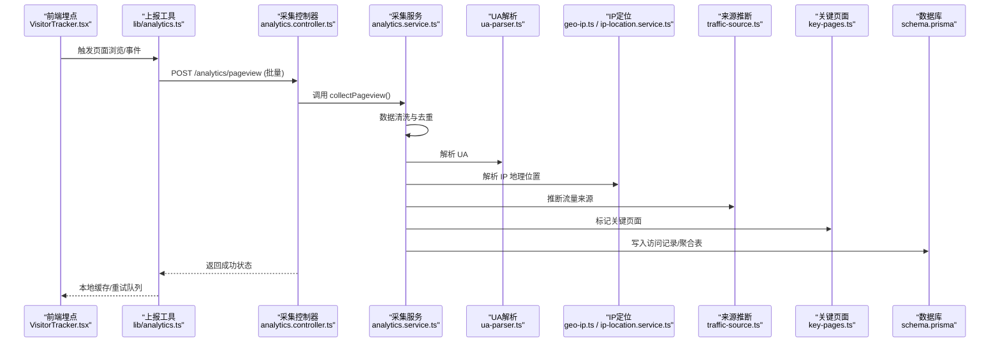

**图表来源** 
- [VisitorTracker.tsx](file://apps/web/src/components/analytics/VisitorTracker.tsx)
- [analytics.ts](file://apps/web/src/lib/analytics.ts)
- [analytics.controller.ts](file://apps/api/src/analytics/analytics.controller.ts)
- [analytics.service.ts](file://apps/api/src/analytics/analytics.service.ts)
- [ua-parser.ts](file://apps/api/src/analytics/utils/ua-parser.ts)
- [geo-ip.ts](file://apps/api/src/analytics/utils/geo-ip.ts)
- [ip-location.service.ts](file://apps/api/src/analytics/ip-location.service.ts)
- [traffic-source.ts](file://apps/api/src/analytics/utils/traffic-source.ts)
- [key-pages.ts](file://apps/api/src/analytics/utils/key-pages.ts)
- [schema.prisma](file://apps/api/prisma/schema.prisma)

## 详细组件分析

### 采集控制器（analytics.controller.ts）
- 职责：定义 REST 路由，接收页面浏览与身份识别请求，统一参数校验与响应格式。
- 关键点：
  - 批量上报：支持数组形式的 pageview 事件，减少网络开销。
  - 身份识别：支持 identify 接口将匿名访客与注册用户关联。
  - 上下文提取：从请求头获取真实 IP、Referer、UA 等。

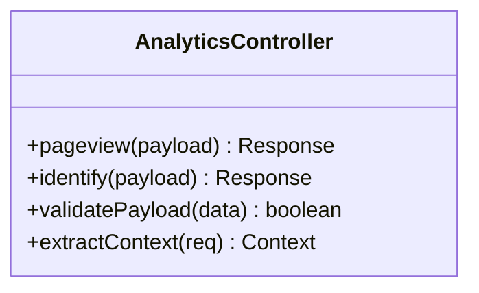

**图表来源** 
- [analytics.controller.ts](file://apps/api/src/analytics/analytics.controller.ts)
- [collect-pageview.dto.ts](file://apps/api/src/analytics/dto/collect-pageview.dto.ts)
- [identify.dto.ts](file://apps/api/src/analytics/dto/identify.dto.ts)

**章节来源**
- [analytics.controller.ts](file://apps/api/src/analytics/analytics.controller.ts)
- [collect-pageview.dto.ts](file://apps/api/src/analytics/dto/collect-pageview.dto.ts)
- [identify.dto.ts](file://apps/api/src/analytics/dto/identify.dto.ts)

### 采集服务（analytics.service.ts）
- 职责：编排数据采集后的清洗、解析、定位、来源推断、关键页面识别与聚合写入。
- 关键点：
  - 数据清洗：去除无效字段、规范化时间戳、标准化路径。
  - 去重策略：基于 sessionID、eventID、时间窗口与指纹（UA+IP）去重。
  - 缓存策略：对高频查询（如 IP 定位、来源规则）启用短期缓存。
  - 批量处理：分批写入数据库，避免单条事务过大。
  - 异常检测：对异常 UA、非法 IP、重复率突增等进行告警。

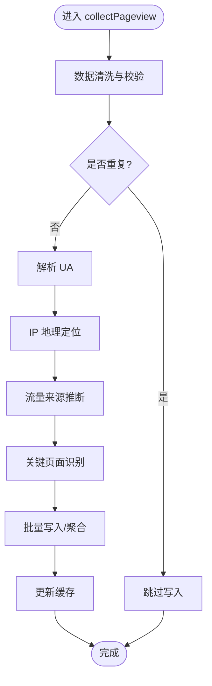

**图表来源** 
- [analytics.service.ts](file://apps/api/src/analytics/analytics.service.ts)
- [ua-parser.ts](file://apps/api/src/analytics/utils/ua-parser.ts)
- [geo-ip.ts](file://apps/api/src/analytics/utils/geo-ip.ts)
- [traffic-source.ts](file://apps/api/src/analytics/utils/traffic-source.ts)
- [key-pages.ts](file://apps/api/src/analytics/utils/key-pages.ts)

**章节来源**
- [analytics.service.ts](file://apps/api/src/analytics/analytics.service.ts)

### 地理定位服务（ip-location.service.ts）
- 职责：提供 IP 到国家/省/市/运营商等地理信息的查询与缓存。
- 关键点：
  - 多源兼容：支持本地库与在线 API 的切换。
  - 缓存键设计：以 IP 为主键，设置过期时间降低外部依赖压力。
  - 降级策略：当外部服务不可用时回退到默认值或空值。

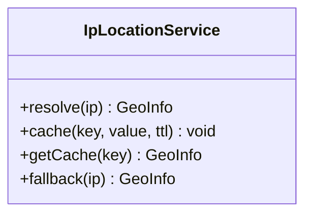

**图表来源** 
- [ip-location.service.ts](file://apps/api/src/analytics/ip-location.service.ts)
- [geo-ip.ts](file://apps/api/src/analytics/utils/geo-ip.ts)
- [geo-label.ts](file://apps/api/src/analytics/utils/geo-label.ts)
- [geo-reverse.ts](file://apps/api/src/analytics/utils/geo-reverse.ts)

**章节来源**
- [ip-location.service.ts](file://apps/api/src/analytics/ip-location.service.ts)
- [geo-ip.ts](file://apps/api/src/analytics/utils/geo-ip.ts)
- [geo-label.ts](file://apps/api/src/analytics/utils/geo-label.ts)
- [geo-reverse.ts](file://apps/api/src/analytics/utils/geo-reverse.ts)

### 工具集详解
- UA 解析（ua-parser.ts）：解析浏览器、操作系统、设备型号与版本，输出结构化对象。
- 客户端 IP（client-ip.ts）：从 X-Forwarded-For、X-Real-IP、连接地址中安全提取真实 IP。
- 来源推断（traffic-source.ts）：依据 Referer、UTM 参数、域名白名单判断来源渠道。
- 关键页面（key-pages.ts）：匹配产品、案例、解决方案、定价等关键转化页面。
- 列表聚合（analytics-list.ts）：支持按时间粒度、维度分组、过滤排序的聚合查询。

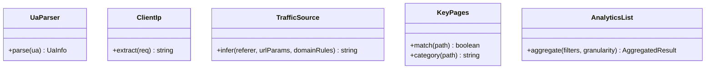

**图表来源** 
- [ua-parser.ts](file://apps/api/src/analytics/utils/ua-parser.ts)
- [client-ip.ts](file://apps/api/src/analytics/utils/client-ip.ts)
- [traffic-source.ts](file://apps/api/src/analytics/utils/traffic-source.ts)
- [key-pages.ts](file://apps/api/src/analytics/utils/key-pages.ts)
- [analytics-list.ts](file://apps/api/src/analytics/utils/analytics-list.ts)

**章节来源**
- [ua-parser.ts](file://apps/api/src/analytics/utils/ua-parser.ts)
- [client-ip.ts](file://apps/api/src/analytics/utils/client-ip.ts)
- [traffic-source.ts](file://apps/api/src/analytics/utils/traffic-source.ts)
- [key-pages.ts](file://apps/api/src/analytics/utils/key-pages.ts)
- [analytics-list.ts](file://apps/api/src/analytics/utils/analytics-list.ts)

### 前端埋点（VisitorTracker.tsx 与 lib/analytics.ts）
- VisitorTracker：在页面加载时自动采集页面浏览、设备信息、语言、来源等，并触发上报。
- analytics 工具库：负责构建上报载荷、批量化、失败重试、离线缓存与隐私合规（如匿名化）。

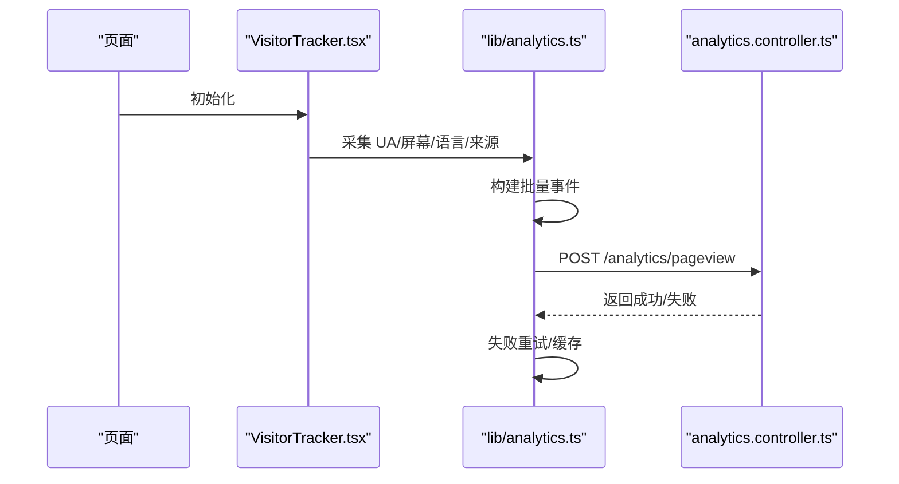

**图表来源** 
- [VisitorTracker.tsx](file://apps/web/src/components/analytics/VisitorTracker.tsx)
- [analytics.ts](file://apps/web/src/lib/analytics.ts)
- [analytics.controller.ts](file://apps/api/src/analytics/analytics.controller.ts)

**章节来源**
- [VisitorTracker.tsx](file://apps/web/src/components/analytics/VisitorTracker.tsx)
- [analytics.ts](file://apps/web/src/lib/analytics.ts)

### 管理端分析（Admin）
- 访客维度：IpVisitorLens、PeopleVisitorLens 提供按 IP 与访客维度的筛选与详情查看。
- 图表展示：AnalyticsCharts 渲染趋势图、渠道分布、关键页面转化漏斗等。
- 导出功能：analytics-export 支持 CSV/Excel 导出，便于离线分析。

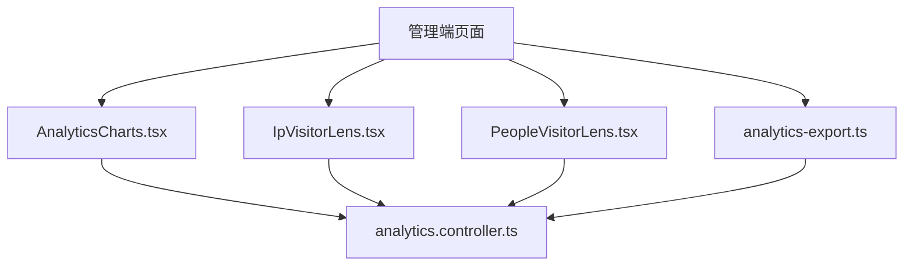

**图表来源** 
- [AnalyticsCharts.tsx](file://apps/admin/src/components/analytics/AnalyticsCharts.tsx)
- [IpVisitorLens.tsx](file://apps/admin/src/components/visitors/IpVisitorLens.tsx)
- [PeopleVisitorLens.tsx](file://apps/admin/src/components/visitors/PeopleVisitorLens.tsx)
- [analytics-export.ts](file://apps/admin/src/features/analytics-export.ts)
- [analytics.ts](file://apps/admin/src/features/analytics.ts)
- [analytics.controller.ts](file://apps/api/src/analytics/analytics.controller.ts)

**章节来源**
- [AnalyticsCharts.tsx](file://apps/admin/src/components/analytics/AnalyticsCharts.tsx)
- [IpVisitorLens.tsx](file://apps/admin/src/components/visitors/IpVisitorLens.tsx)
- [PeopleVisitorLens.tsx](file://apps/admin/src/components/visitors/PeopleVisitorLens.tsx)
- [analytics-export.ts](file://apps/admin/src/features/analytics-export.ts)
- [analytics.ts](file://apps/admin/src/features/analytics.ts)

## 依赖关系分析
- 控制器依赖 DTO 进行参数校验，服务依赖工具集进行解析与推断，服务依赖地理定位服务与数据库。
- 前端埋点依赖 analytics 工具库，工具库依赖网络请求与本地存储。
- 管理端依赖控制器提供的查询接口，图表与列表组件依赖聚合结果。

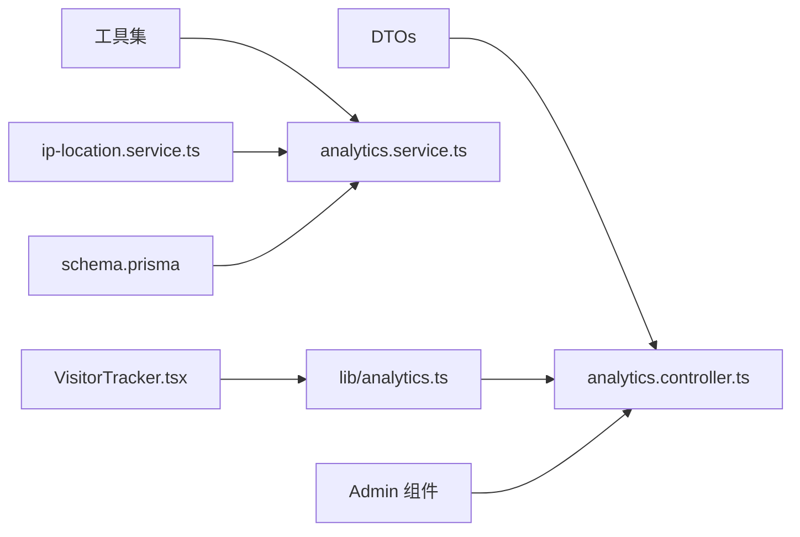

**图表来源** 
- [collect-pageview.dto.ts](file://apps/api/src/analytics/dto/collect-pageview.dto.ts)
- [identify.dto.ts](file://apps/api/src/analytics/dto/identify.dto.ts)
- [analytics.controller.ts](file://apps/api/src/analytics/analytics.controller.ts)
- [analytics.service.ts](file://apps/api/src/analytics/analytics.service.ts)
- [ip-location.service.ts](file://apps/api/src/analytics/ip-location.service.ts)
- [schema.prisma](file://apps/api/prisma/schema.prisma)
- [VisitorTracker.tsx](file://apps/web/src/components/analytics/VisitorTracker.tsx)
- [analytics.ts](file://apps/web/src/lib/analytics.ts)

**章节来源**
- [collect-pageview.dto.ts](file://apps/api/src/analytics/dto/collect-pageview.dto.ts)
- [identify.dto.ts](file://apps/api/src/analytics/dto/identify.dto.ts)
- [analytics.controller.ts](file://apps/api/src/analytics/analytics.controller.ts)
- [analytics.service.ts](file://apps/api/src/analytics/analytics.service.ts)
- [ip-location.service.ts](file://apps/api/src/analytics/ip-location.service.ts)
- [schema.prisma](file://apps/api/prisma/schema.prisma)
- [VisitorTracker.tsx](file://apps/web/src/components/analytics/VisitorTracker.tsx)
- [analytics.ts](file://apps/web/src/lib/analytics.ts)

## 性能考虑
- 批量上报：前端合并多个事件为一次请求，降低网络开销。
- 去重策略：服务端基于事件指纹与时间窗口去重，避免重复写入。
- 缓存策略：对高频查询（IP 定位、来源规则）启用短期缓存，降低外部依赖压力。
- 异步处理：非关键路径（如日志、指标上报）采用异步任务，避免阻塞主流程。
- 分页与聚合：管理端查询支持分页与聚合，减少大数据量传输。

[本节为通用指导，不直接分析具体文件]

## 故障排查指南
- 上报失败：检查网络连通性、接口权限、载荷格式；查看前端重试队列与本地缓存。
- 数据缺失：确认 UA 解析、IP 定位、来源推断是否生效；检查关键页面匹配规则。
- 性能问题：关注批量大小、缓存命中率、数据库慢查询；调整批次与缓存 TTL。
- 异常检测：监控重复率突增、异常 UA、非法 IP 比例；设置阈值告警。

**章节来源**
- [analytics.service.ts](file://apps/api/src/analytics/analytics.service.ts)
- [analytics.ts](file://apps/web/src/lib/analytics.ts)

## 结论
本系统通过前后端协同实现完整的访问统计与用户行为分析能力，涵盖数据清洗、去重、UA 解析、IP 地理定位、来源推断、关键页面识别与转化率计算。通过批量处理、缓存策略与异常检测，确保高吞吐与数据质量。管理端提供丰富的可视化与导出能力，支撑业务决策与优化。

[本节为总结，不直接分析具体文件]

## 附录：API 使用示例与数据处理流程

### 页面浏览上报（POST /analytics/pageview）
- 请求体：包含多个 pageview 事件的数组，每个事件含 URL、标题、时间戳、UA、IP、来源等字段。
- 处理流程：
  - 控制器校验载荷与上下文。
  - 服务执行清洗、去重、UA 解析、IP 定位、来源推断、关键页面识别。
  - 批量写入数据库并更新缓存。
- 响应：成功状态码与统计摘要。

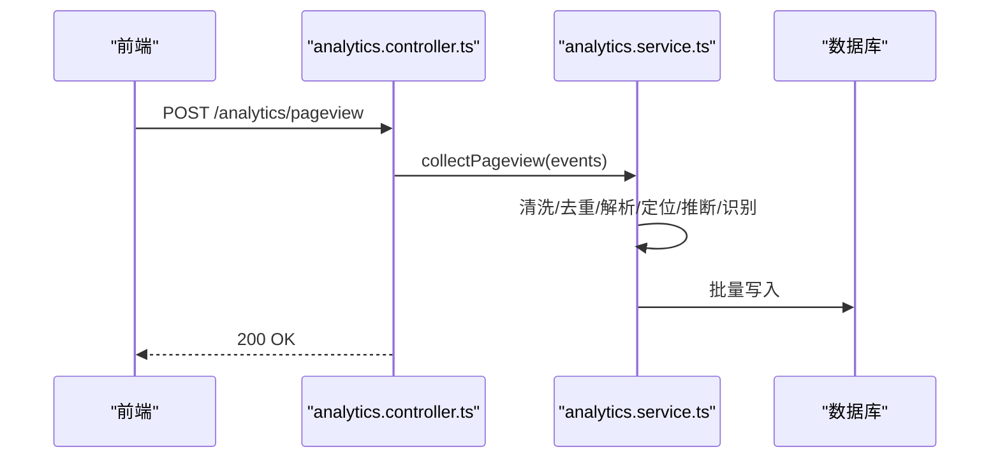

**图表来源** 
- [analytics.controller.ts](file://apps/api/src/analytics/analytics.controller.ts)
- [analytics.service.ts](file://apps/api/src/analytics/analytics.service.ts)
- [collect-pageview.dto.ts](file://apps/api/src/analytics/dto/collect-pageview.dto.ts)

**章节来源**
- [analytics.controller.ts](file://apps/api/src/analytics/analytics.controller.ts)
- [analytics.service.ts](file://apps/api/src/analytics/analytics.service.ts)
- [collect-pageview.dto.ts](file://apps/api/src/analytics/dto/collect-pageview.dto.ts)

### 身份识别（POST /analytics/identify）
- 请求体：包含访客 ID、用户 ID、属性等，用于将匿名访客与注册用户关联。
- 处理流程：
  - 控制器校验载荷。
  - 服务更新访客身份映射，关联历史访问记录。
- 响应：成功状态码与关联结果。

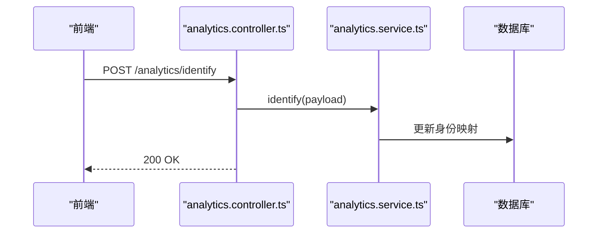

**图表来源** 
- [analytics.controller.ts](file://apps/api/src/analytics/analytics.controller.ts)
- [analytics.service.ts](file://apps/api/src/analytics/analytics.service.ts)
- [identify.dto.ts](file://apps/api/src/analytics/dto/identify.dto.ts)

**章节来源**
- [analytics.controller.ts](file://apps/api/src/analytics/analytics.controller.ts)
- [analytics.service.ts](file://apps/api/src/analytics/analytics.service.ts)
- [identify.dto.ts](file://apps/api/src/analytics/dto/identify.dto.ts)

### 数据清洗与去重流程图
- 清洗：去除无效字段、标准化时间戳与路径。
- 去重：基于事件指纹（UA+IP+URL+时间窗口）去重。
- 解析：UA 解析、IP 地理定位、来源推断、关键页面识别。
- 写入：批量写入数据库，更新缓存。

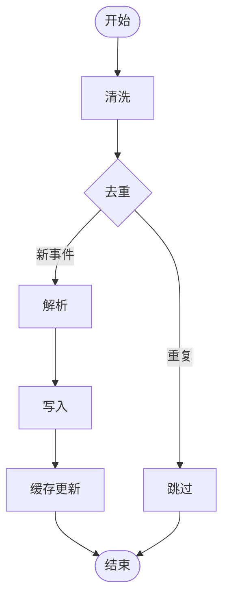

**图表来源** 
- [analytics.service.ts](file://apps/api/src/analytics/analytics.service.ts)
- [ua-parser.ts](file://apps/api/src/analytics/utils/ua-parser.ts)
- [geo-ip.ts](file://apps/api/src/analytics/utils/geo-ip.ts)
- [traffic-source.ts](file://apps/api/src/analytics/utils/traffic-source.ts)
- [key-pages.ts](file://apps/api/src/analytics/utils/key-pages.ts)

**章节来源**
- [analytics.service.ts](file://apps/api/src/analytics/analytics.service.ts)