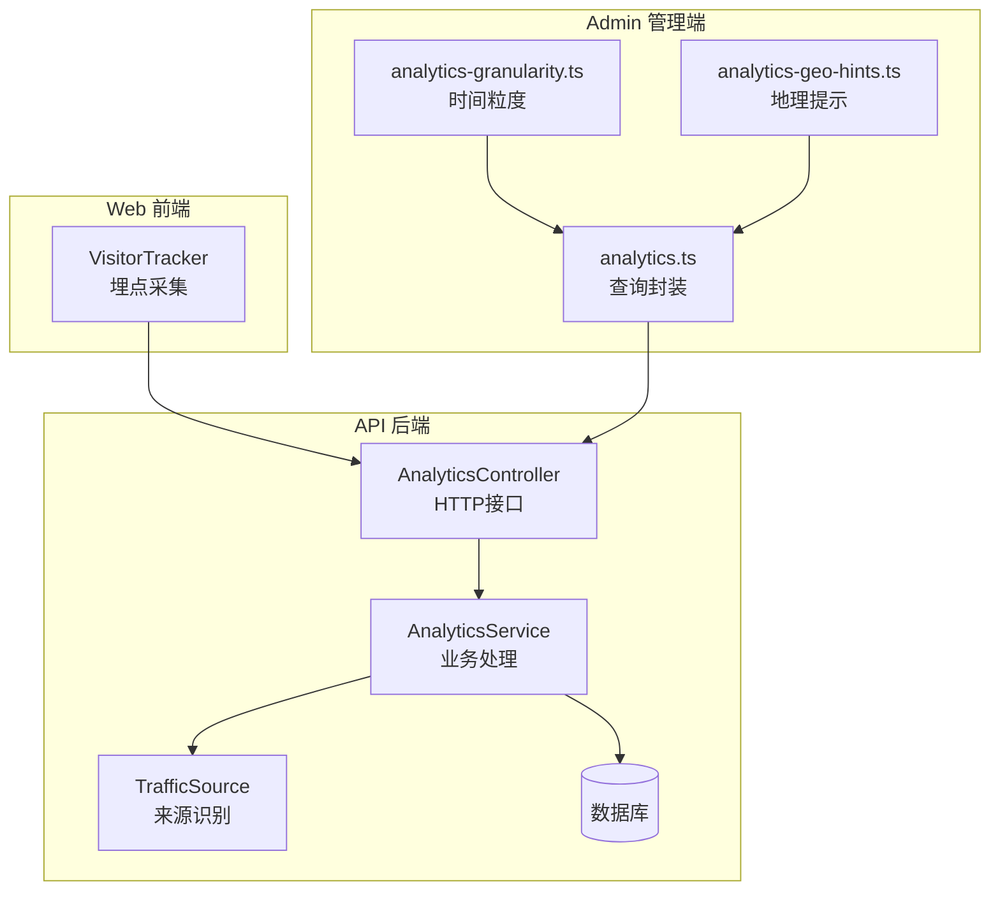
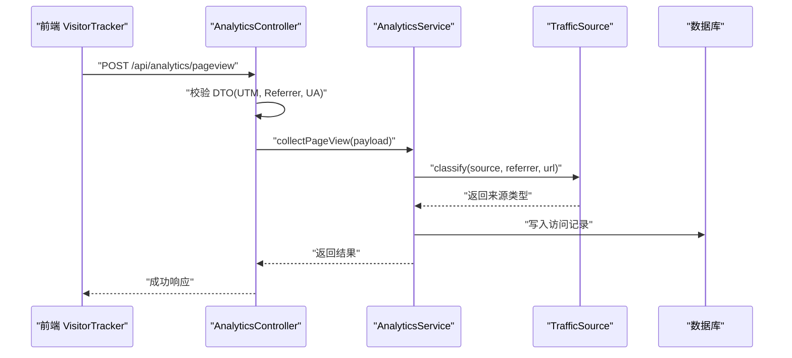
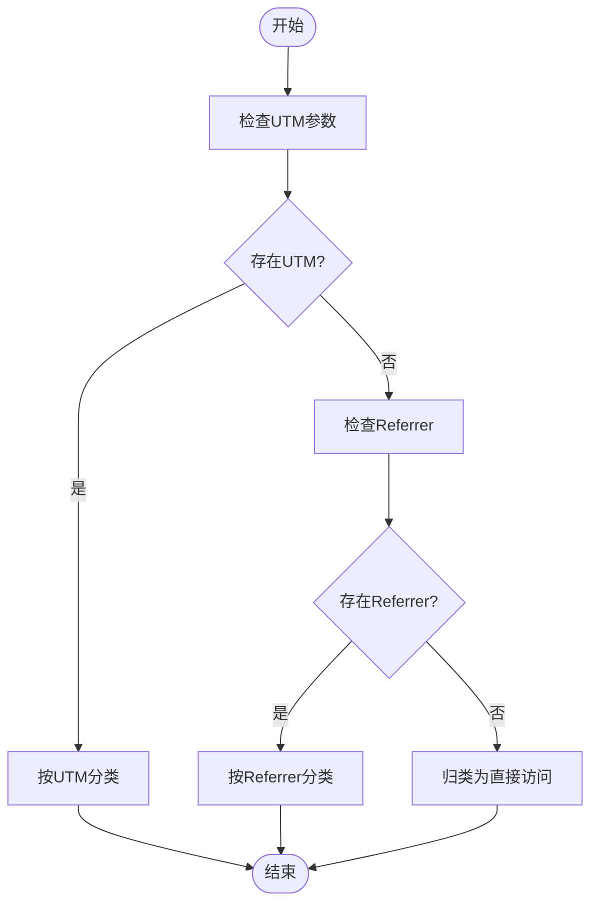
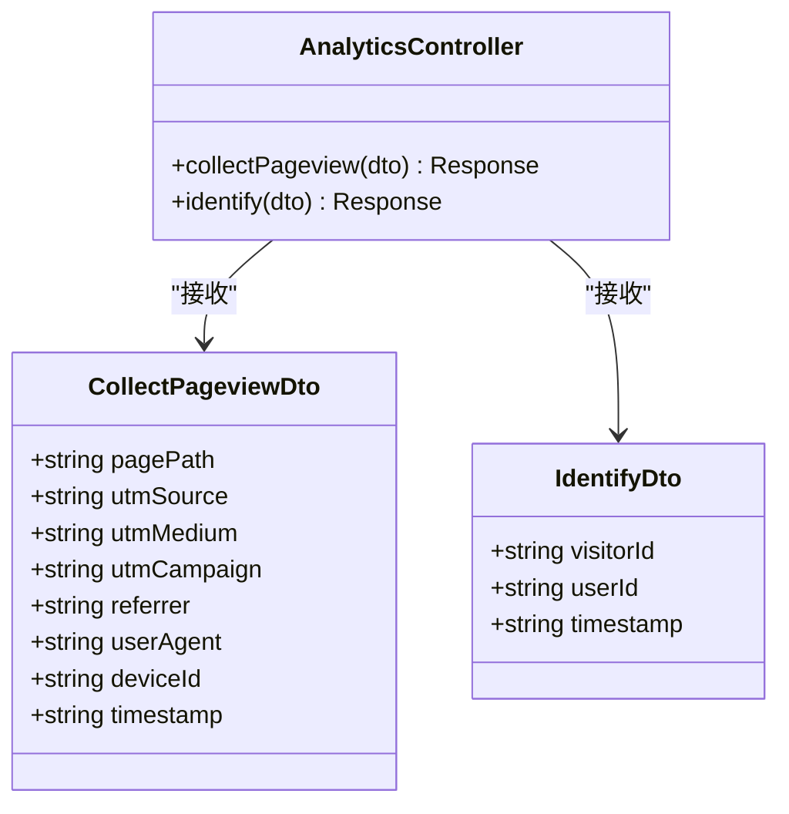
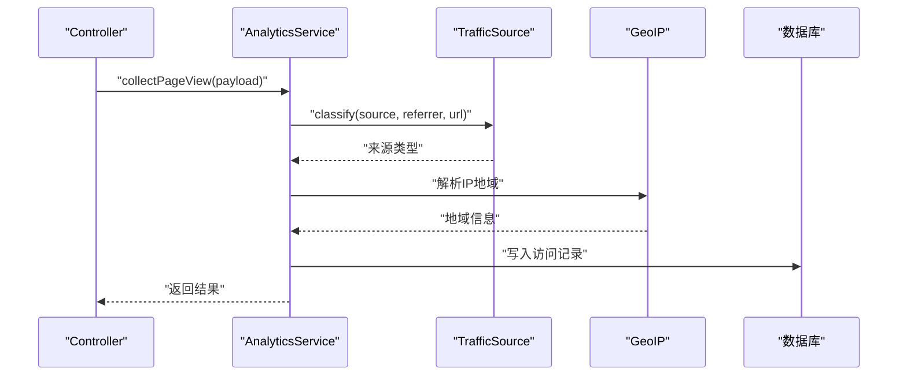
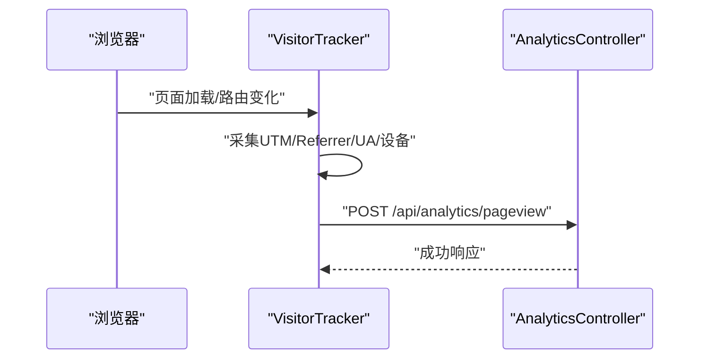
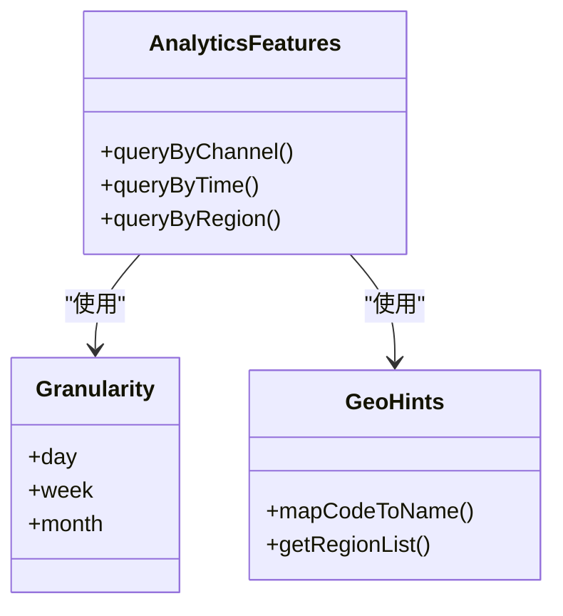
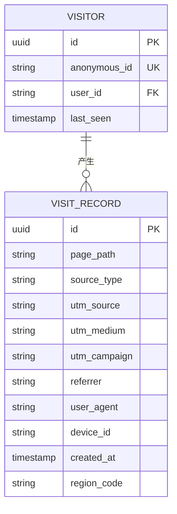
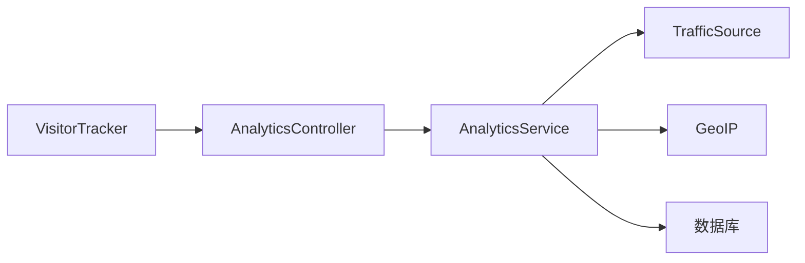

# 流量来源分析

<cite>
**本文引用的文件**   
- [apps/api/src/analytics/utils/traffic-source.ts](file://apps/api/src/analytics/utils/traffic-source.ts)
- [apps/api/src/analytics/analytics.controller.ts](file://apps/api/src/analytics/analytics.controller.ts)
- [apps/api/src/analytics/analytics.service.ts](file://apps/api/src/analytics/analytics.service.ts)
- [apps/api/src/analytics/dto/collect-pageview.dto.ts](file://apps/api/src/analytics/dto/collect-pageview.dto.ts)
- [apps/api/src/analytics/dto/identify.dto.ts](file://apps/api/src/analytics/dto/identify.dto.ts)
- [apps/web/src/components/analytics/VisitorTracker.tsx](file://apps/web/src/components/analytics/VisitorTracker.tsx)
- [apps/admin/src/features/analytics.ts](file://apps/admin/src/features/analytics.ts)
- [apps/admin/src/lib/analytics-granularity.ts](file://apps/admin/src/lib/analytics-granularity.ts)
- [apps/admin/src/lib/analytics-geo-hints.ts](file://apps/admin/src/lib/analytics-geo-hints.ts)
- [apps/api/prisma/schema.prisma](file://apps/api/prisma/schema.prisma)
</cite>

## 目录
1. [简介](#简介)
2. [项目结构](#项目结构)
3. [核心组件](#核心组件)
4. [架构总览](#架构总览)
5. [详细组件分析](#详细组件分析)
6. [依赖关系分析](#依赖关系分析)
7. [性能考量](#性能考量)
8. [故障排查指南](#故障排查指南)
9. [结论](#结论)
10. [附录](#附录)

## 简介
本文件面向“流量来源分析系统”，围绕以下目标展开：
- 流量来源分类算法与渠道归因模型
- 转化路径追踪与漏斗分析
- 搜索引擎、社交媒体、直接访问、引荐流量的识别逻辑
- UTM参数解析与referrer分析
- 广告效果评估与ROI计算思路
- 流量分析API使用示例（渠道对比、转化漏斗、ROI）
- 数据来源验证、异常流量检测与反作弊机制

本仓库包含前端埋点采集、后端接口与分析处理模块，以及管理端可视化能力。下文将基于代码结构与实现细节进行系统化说明。

## 项目结构
与流量来源分析相关的关键位置如下：
- 前端埋点采集：web应用中的访客跟踪组件负责收集页面浏览事件与基础上下文信息。
- 后端分析与接口：NestJS的analytics模块提供数据收集、来源识别、地理定位等能力。
- 管理端展示：admin应用提供图表、粒度控制、地理提示等分析界面。
- 数据存储：Prisma schema定义分析相关实体与字段。

**图示来源** 
- [apps/web/src/components/analytics/VisitorTracker.tsx](file://apps/web/src/components/analytics/VisitorTracker.tsx)
- [apps/api/src/analytics/analytics.controller.ts](file://apps/api/src/analytics/analytics.controller.ts)
- [apps/api/src/analytics/analytics.service.ts](file://apps/api/src/analytics/analytics.service.ts)
- [apps/api/src/analytics/utils/traffic-source.ts](file://apps/api/src/analytics/utils/traffic-source.ts)
- [apps/admin/src/features/analytics.ts](file://apps/admin/src/features/analytics.ts)
- [apps/admin/src/lib/analytics-granularity.ts](file://apps/admin/src/lib/analytics-granularity.ts)
- [apps/admin/src/lib/analytics-geo-hints.ts](file://apps/admin/src/lib/analytics-geo-hints.ts)

**章节来源**
- [apps/api/src/analytics/analytics.controller.ts](file://apps/api/src/analytics/analytics.controller.ts)
- [apps/api/src/analytics/analytics.service.ts](file://apps/api/src/analytics/analytics.service.ts)
- [apps/api/src/analytics/utils/traffic-source.ts](file://apps/api/src/analytics/utils/traffic-source.ts)
- [apps/web/src/components/analytics/VisitorTracker.tsx](file://apps/web/src/components/analytics/VisitorTracker.tsx)
- [apps/admin/src/features/analytics.ts](file://apps/admin/src/features/analytics.ts)
- [apps/admin/src/lib/analytics-granularity.ts](file://apps/admin/src/lib/analytics-granularity.ts)
- [apps/admin/src/lib/analytics-geo-hints.ts](file://apps/admin/src/lib/analytics-geo-hints.ts)

## 核心组件
- 来源识别工具（traffic-source）：根据请求头、URL参数、Referrer等规则判定流量来源类型（搜索引擎、社交媒体、直接访问、引荐）。
- 分析控制器（analytics.controller）：暴露数据收集与查询接口，接收页面浏览、用户识别等事件。
- 分析服务（analytics.service）：聚合来源识别、地理位置解析、去重与存储逻辑。
- 前端埋点（VisitorTracker）：在浏览器侧采集页面浏览、设备信息、UA、Referrer、UTM等上下文并上报。
- 管理端分析（features/analytics + granularity + geo-hints）：封装查询、时间粒度选择、地理提示等能力。

**章节来源**
- [apps/api/src/analytics/utils/traffic-source.ts](file://apps/api/src/analytics/utils/traffic-source.ts)
- [apps/api/src/analytics/analytics.controller.ts](file://apps/api/src/analytics/analytics.controller.ts)
- [apps/api/src/analytics/analytics.service.ts](file://apps/api/src/analytics/analytics.service.ts)
- [apps/web/src/components/analytics/VisitorTracker.tsx](file://apps/web/src/components/analytics/VisitorTracker.tsx)
- [apps/admin/src/features/analytics.ts](file://apps/admin/src/features/analytics.ts)
- [apps/admin/src/lib/analytics-granularity.ts](file://apps/admin/src/lib/analytics-granularity.ts)
- [apps/admin/src/lib/analytics-geo-hints.ts](file://apps/admin/src/lib/analytics-geo-hints.ts)

## 架构总览
整体流程：
- 前端通过VisitorTracker采集页面浏览事件，携带UTM、Referrer、UA、设备信息等。
- API层由AnalyticsController接收请求，校验DTO后交由AnalyticsService处理。
- AnalyticsService调用TrafficSource进行来源分类，并结合GeoIP等工具完善维度。
- 最终数据持久化到数据库，供管理端查询与可视化。

**图示来源** 
- [apps/api/src/analytics/analytics.controller.ts](file://apps/api/src/analytics/analytics.controller.ts)
- [apps/api/src/analytics/analytics.service.ts](file://apps/api/src/analytics/analytics.service.ts)
- [apps/api/src/analytics/utils/traffic-source.ts](file://apps/api/src/analytics/utils/traffic-source.ts)
- [apps/api/src/analytics/dto/collect-pageview.dto.ts](file://apps/api/src/analytics/dto/collect-pageview.dto.ts)
- [apps/web/src/components/analytics/VisitorTracker.tsx](file://apps/web/src/components/analytics/VisitorTracker.tsx)

## 详细组件分析

### 来源识别与分类算法（TrafficSource）
- 输入维度：
  - URL参数（如utm_source、utm_medium、utm_campaign等）
  - Referrer头部（来源页面）
  - User-Agent（用于识别爬虫或特定客户端）
  - 其他上下文（如IP、设备信息）
- 分类规则（概念性说明）：
  - 搜索引擎：当Referrer来自主流搜索引擎域名或UTM标记指示搜索时，归类为搜索引擎。
  - 社交媒体：当Referrer来自社交平台域名或UTM标记指示社媒时，归类为社交媒体。
  - 直接访问：当无有效Referrer且无UTM标记时，归类为直接访问。
  - 引荐流量：当存在非搜索引擎/社交平台的Referrer时，归类为引荐流量。
- 优先级策略：
  - UTM优先于Referrer；若UTM缺失则回退至Referrer判断；若无任何来源信息则归为直接访问。
- 扩展性：
  - 可通过维护白名单/黑名单列表扩展平台识别（新增搜索引擎或社交平台域名）。

**图示来源** 
- [apps/api/src/analytics/utils/traffic-source.ts](file://apps/api/src/analytics/utils/traffic-source.ts)

**章节来源**
- [apps/api/src/analytics/utils/traffic-source.ts](file://apps/api/src/analytics/utils/traffic-source.ts)

### 数据收集接口（AnalyticsController 与 DTO）
- 主要职责：
  - 接收页面浏览与用户识别请求
  - 校验入参（UTM、Referrer、UA、设备等）
  - 调用服务层完成来源识别与存储
- DTO设计要点：
  - collect-pageview.dto：包含页面路径、UTM参数、Referrer、UA、设备信息、时间戳等字段
  - identify.dto：用于关联访客身份（如匿名ID或登录用户ID）

**图示来源** 
- [apps/api/src/analytics/dto/collect-pageview.dto.ts](file://apps/api/src/analytics/dto/collect-pageview.dto.ts)
- [apps/api/src/analytics/dto/identify.dto.ts](file://apps/api/src/analytics/dto/identify.dto.ts)
- [apps/api/src/analytics/analytics.controller.ts](file://apps/api/src/analytics/analytics.controller.ts)

**章节来源**
- [apps/api/src/analytics/dto/collect-pageview.dto.ts](file://apps/api/src/analytics/dto/collect-pageview.dto.ts)
- [apps/api/src/analytics/dto/identify.dto.ts](file://apps/api/src/analytics/dto/identify.dto.ts)
- [apps/api/src/analytics/analytics.controller.ts](file://apps/api/src/analytics/analytics.controller.ts)

### 分析服务（AnalyticsService）
- 职责：
  - 聚合来源识别、地理位置解析、去重与存储
  - 提供查询接口（渠道对比、漏斗、ROI等）
- 关键流程：
  - 校验与规范化入参
  - 调用来源识别工具进行分类
  - 结合GeoIP补充地域维度
  - 写入数据库并返回统计结果

**图示来源** 
- [apps/api/src/analytics/analytics.service.ts](file://apps/api/src/analytics/analytics.service.ts)
- [apps/api/src/analytics/utils/traffic-source.ts](file://apps/api/src/analytics/utils/traffic-source.ts)

**章节来源**
- [apps/api/src/analytics/analytics.service.ts](file://apps/api/src/analytics/analytics.service.ts)

### 前端埋点（VisitorTracker）
- 功能：
  - 监听页面加载与路由变化
  - 采集UTM、Referrer、UA、设备信息、时间戳
  - 上报至后端pageview接口
- 注意事项：
  - 避免重复上报同一页面
  - 对敏感信息进行脱敏处理
  - 在网络异常时进行重试或缓存

**图示来源** 
- [apps/web/src/components/analytics/VisitorTracker.tsx](file://apps/web/src/components/analytics/VisitorTracker.tsx)
- [apps/api/src/analytics/analytics.controller.ts](file://apps/api/src/analytics/analytics.controller.ts)

**章节来源**
- [apps/web/src/components/analytics/VisitorTracker.tsx](file://apps/web/src/components/analytics/VisitorTracker.tsx)

### 管理端分析（features/analytics + granularity + geo-hints）
- features/analytics：封装查询方法，支持按渠道、时间、地域等维度筛选。
- analytics-granularity：提供时间粒度配置（日、周、月等），影响聚合与图表展示。
- analytics-geo-hints：提供地理提示与映射，辅助可视化。

**图示来源** 
- [apps/admin/src/features/analytics.ts](file://apps/admin/src/features/analytics.ts)
- [apps/admin/src/lib/analytics-granularity.ts](file://apps/admin/src/lib/analytics-granularity.ts)
- [apps/admin/src/lib/analytics-geo-hints.ts](file://apps/admin/src/lib/analytics-geo-hints.ts)

**章节来源**
- [apps/admin/src/features/analytics.ts](file://apps/admin/src/features/analytics.ts)
- [apps/admin/src/lib/analytics-granularity.ts](file://apps/admin/src/lib/analytics-granularity.ts)
- [apps/admin/src/lib/analytics-geo-hints.ts](file://apps/admin/src/lib/analytics-geo-hints.ts)

### 数据模型（Prisma Schema）
- 分析相关实体通常包含：
  - 访问记录：页面路径、来源类型、UTM字段、Referrer、UA、设备信息、时间戳、地域信息
  - 访客标识：匿名ID、用户ID（登录后关联）
- 索引建议：
  - 按时间、来源类型、页面路径建立索引以优化查询性能

**图示来源** 
- [apps/api/prisma/schema.prisma](file://apps/api/prisma/schema.prisma)

**章节来源**
- [apps/api/prisma/schema.prisma](file://apps/api/prisma/schema.prisma)

## 依赖关系分析
- 模块耦合：
  - Controller依赖Service，Service依赖TrafficSource与GeoIP工具
  - 前端埋点依赖后端接口契约（DTO字段）
- 外部依赖：
  - 地理位置解析服务（可选）
  - 数据库（PostgreSQL/MySQL等）
- 潜在循环依赖：
  - 确保Service不反向依赖Controller，保持单向调用链

**图示来源** 
- [apps/api/src/analytics/analytics.controller.ts](file://apps/api/src/analytics/analytics.controller.ts)
- [apps/api/src/analytics/analytics.service.ts](file://apps/api/src/analytics/analytics.service.ts)
- [apps/api/src/analytics/utils/traffic-source.ts](file://apps/api/src/analytics/utils/traffic-source.ts)
- [apps/web/src/components/analytics/VisitorTracker.tsx](file://apps/web/src/components/analytics/VisitorTracker.tsx)

**章节来源**
- [apps/api/src/analytics/analytics.controller.ts](file://apps/api/src/analytics/analytics.controller.ts)
- [apps/api/src/analytics/analytics.service.ts](file://apps/api/src/analytics/analytics.service.ts)
- [apps/api/src/analytics/utils/traffic-source.ts](file://apps/api/src/analytics/utils/traffic-source.ts)
- [apps/web/src/analytics/VisitorTracker.tsx](file://apps/web/src/components/analytics/VisitorTracker.tsx)

## 性能考量
- 批量上报：前端可合并多次页面浏览事件，减少网络开销。
- 异步处理：后端采用异步写入队列，降低主链路延迟。
- 索引优化：对高频查询字段（时间、来源类型、页面路径）建立索引。
- 缓存策略：对热点渠道统计结果进行短期缓存，减轻数据库压力。
- 数据压缩：传输层启用gzip压缩，减少带宽占用。

[本节为通用指导，无需具体文件引用]

## 故障排查指南
- 常见问题：
  - UTM参数缺失或格式错误：检查前端采集逻辑与URL拼接
  - Referrer被浏览器安全策略屏蔽：确认跨域与HTTPS环境
  - 重复上报：前端需实现去重与节流
  - 地理位置解析失败：检查GeoIP服务可用性与IP有效性
- 日志与监控：
  - 记录接口入参与异常堆栈
  - 监控上报成功率与延迟分布
  - 设置阈值告警（如异常流量突增）

**章节来源**
- [apps/api/src/analytics/analytics.controller.ts](file://apps/api/src/analytics/analytics.controller.ts)
- [apps/api/src/analytics/analytics.service.ts](file://apps/api/src/analytics/analytics.service.ts)

## 结论
本流量来源分析系统通过前端埋点采集、后端来源识别与存储、管理端可视化展示，形成完整的流量分析闭环。核心在于UTM与Referrer的解析、来源分类算法的准确性与可扩展性，以及数据质量与性能保障。建议在后续迭代中增强反作弊机制、细化归因模型，并丰富ROI与广告效果评估指标。

[本节为总结性内容，无需具体文件引用]

## 附录
- API使用示例（概念性说明）：
  - 渠道对比：按来源类型聚合访问量与转化率
  - 转化漏斗：按页面路径序列统计流失率
  - ROI计算：结合广告花费与转化收益，按渠道维度汇总
- 数据来源验证：
  - 校验UTM字段合法性与长度限制
  - 过滤无效UA与设备指纹
- 异常流量检测与反作弊：
  - 频率限制与IP黑名单
  - UA一致性校验与设备指纹稳定性检查
  - 行为模式分析（短时间大量访问、固定路径循环）

[本节为补充说明，无需具体文件引用]