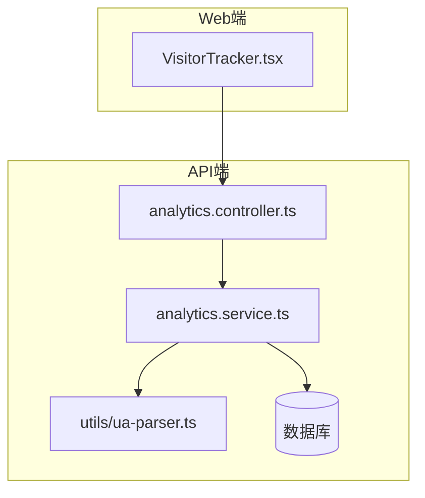
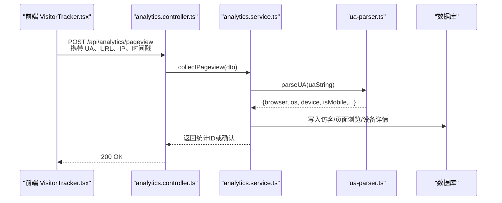
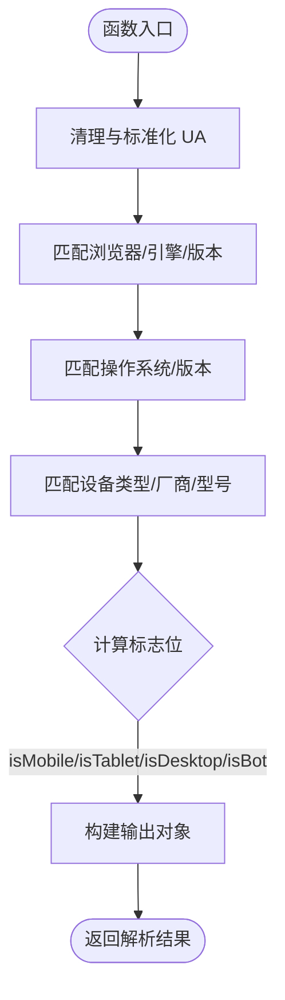
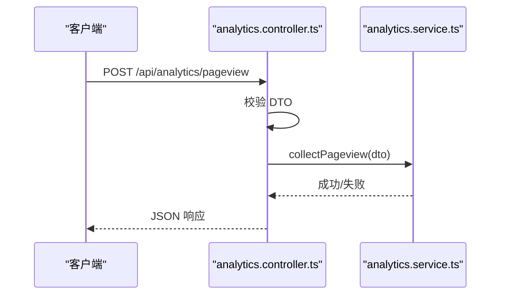
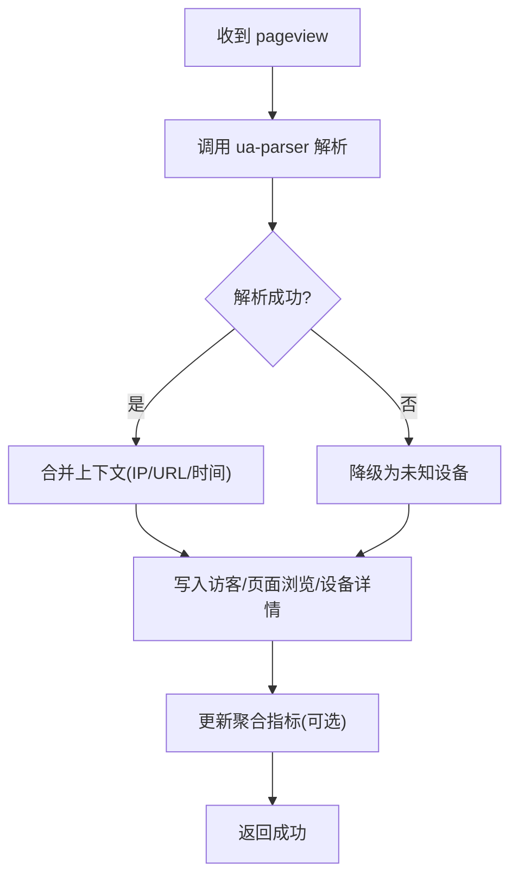
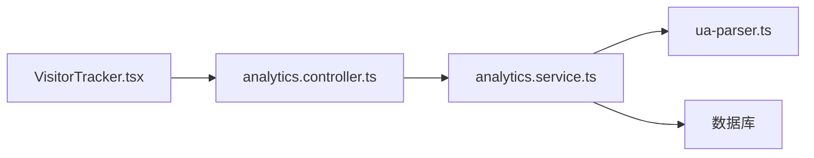

# 用户代理解析

<cite>
**本文引用的文件**   
- [ua-parser.ts](file://apps/api/src/analytics/utils/ua-parser.ts)
- [analytics.controller.ts](file://apps/api/src/analytics/analytics.controller.ts)
- [analytics.service.ts](file://apps/api/src/analytics/analytics.service.ts)
- [collect-pageview.dto.ts](file://apps/api/src/analytics/dto/collect-pageview.dto.ts)
- [identify.dto.ts](file://apps/api/src/analytics/dto/identify.dto.ts)
- [schema.prisma](file://apps/api/prisma/schema.prisma)
- [20260723110621_add_device_details/migration.sql](file://apps/api/prisma/migrations/20260723110621_add_device_details/migration.sql)
- [VisitorTracker.tsx](file://apps/web/src/components/analytics/VisitorTracker.tsx)
- [browser-support.ts](file://apps/admin/src/lib/browser-support.ts)
- [device-columns.tsx](file://apps/admin/src/components/analytics/device-columns.tsx)
</cite>

## 目录
1. [简介](#简介)
2. [项目结构](#项目结构)
3. [核心组件](#核心组件)
4. [架构总览](#架构总览)
5. [详细组件分析](#详细组件分析)
6. [依赖关系分析](#依赖关系分析)
7. [性能考虑](#性能考虑)
8. [故障排查指南](#故障排查指南)
9. [结论](#结论)
10. [附录](#附录)

## 简介
本文件面向“用户代理解析系统”的完整说明，覆盖 UA 字符串解析、浏览器与设备类型识别、操作系统检测、屏幕分辨率获取、移动端适配判断、UA 标准化、版本兼容处理与新兴设备支持。同时提供 API 使用示例（设备统计、浏览器市场份额分析、移动端优化建议），并给出准确性评估、性能优化与缓存策略建议。

## 项目结构
与 UA 解析相关的关键位置：
- 后端解析工具：apps/api/src/analytics/utils/ua-parser.ts
- 分析控制器与服务：apps/api/src/analytics/analytics.controller.ts、apps/api/src/analytics/analytics.service.ts
- 数据模型与迁移：apps/api/prisma/schema.prisma、apps/api/prisma/migrations/...
- 前端采集与展示：apps/web/src/components/analytics/VisitorTracker.tsx、apps/admin/src/components/analytics/device-columns.tsx、apps/admin/src/lib/browser-support.ts

图表来源
- [VisitorTracker.tsx](file://apps/web/src/components/analytics/VisitorTracker.tsx)
- [analytics.controller.ts](file://apps/api/src/analytics/analytics.controller.ts)
- [analytics.service.ts](file://apps/api/src/analytics/analytics.service.ts)
- [ua-parser.ts](file://apps/api/src/analytics/utils/ua-parser.ts)

章节来源
- [ua-parser.ts](file://apps/api/src/analytics/utils/ua-parser.ts)
- [analytics.controller.ts](file://apps/api/src/analytics/analytics.controller.ts)
- [analytics.service.ts](file://apps/api/src/analytics/analytics.service.ts)
- [VisitorTracker.tsx](file://apps/web/src/components/analytics/VisitorTracker.tsx)

## 核心组件
- UA 解析器（ua-parser.ts）
  - 负责将原始 User-Agent 字符串标准化为结构化信息：浏览器名称/版本、引擎、操作系统、设备品牌/型号、是否为移动设备等。
  - 输出字段通常包含：browser.name、browser.version、engine、os.name、os.version、device.vendor、device.model、device.type、isMobile、isTablet、isDesktop、isBot 等。
- 分析控制器（analytics.controller.ts）
  - 暴露收集页面浏览与访客识别的接口，接收 UA、IP、URL、时间戳等上下文，调用服务层进行解析与落库。
- 分析服务（analytics.service.ts）
  - 编排 UA 解析、地理定位、流量来源、去重与聚合逻辑；维护设备详情、浏览器份额、OS 分布等指标。
- 数据模型（schema.prisma + migration）
  - 定义访客、页面浏览、设备详情等实体，包含 UA 解析后的关键字段索引，便于统计查询。
- 前端采集（VisitorTracker.tsx）
  - 在页面加载时上报 UA、屏幕分辨率、语言、渠道来源等，供后端统一解析与存储。
- 管理端展示（device-columns.tsx、browser-support.ts）
  - 基于解析结果生成设备列、浏览器兼容性提示与移动端优化建议。

章节来源
- [ua-parser.ts](file://apps/api/src/analytics/utils/ua-parser.ts)
- [analytics.controller.ts](file://apps/api/src/analytics/analytics.controller.ts)
- [analytics.service.ts](file://apps/api/src/analytics/analytics.service.ts)
- [schema.prisma](file://apps/api/prisma/schema.prisma)
- [20260723110621_add_device_details/migration.sql](file://apps/api/prisma/migrations/20260723110621_add_device_details/migration.sql)
- [VisitorTracker.tsx](file://apps/web/src/components/analytics/VisitorTracker.tsx)
- [device-columns.tsx](file://apps/admin/src/components/analytics/device-columns.tsx)
- [browser-support.ts](file://apps/admin/src/lib/browser-support.ts)

## 架构总览
请求从 Web 端发起，经 API 控制器进入服务层，调用 UA 解析器完成标准化，最终持久化到数据库。管理端通过查询聚合结果生成报表与可视化。

图表来源
- [analytics.controller.ts](file://apps/api/src/analytics/analytics.controller.ts)
- [analytics.service.ts](file://apps/api/src/analytics/analytics.service.ts)
- [ua-parser.ts](file://apps/api/src/analytics/utils/ua-parser.ts)
- [VisitorTracker.tsx](file://apps/web/src/components/analytics/VisitorTracker.tsx)

## 详细组件分析

### UA 解析器（ua-parser.ts）
- 功能要点
  - UA 标准化：清洗大小写、去除多余空格、移除无关片段，确保一致性。
  - 浏览器识别：匹配主流内核（如 Chrome/WebKit/Blink/Gecko/Trident/EdgeHTML）与厂商变体（如 Edge、Samsung Internet、微信内置浏览器）。
  - 操作系统检测：Windows、macOS、iOS、Android、Linux、ChromeOS 等，并提取主/次版本号。
  - 设备类型识别：手机、平板、桌面、智能电视、游戏机等，区分 vendor 与 model。
  - 移动端适配判断：isMobile、isTablet、isDesktop、isBot 等布尔标志。
  - 版本兼容处理：对旧版 UA 回退规则、对新版 UA 增量扩展。
  - 新兴设备支持：预留扩展点，按正则族或规则表快速接入新设备特征。
- 数据结构与复杂度
  - 输入：字符串 UA
  - 输出：对象（含 browser、os、device、flags）
  - 时间复杂度：O(n) 与 UA 长度线性相关；正则匹配次数受规则数量影响，建议规则集有序与短路匹配。
  - 空间复杂度：O(1) 额外空间（忽略输出对象）。
- 错误处理
  - 空 UA 或非法字符：返回默认未知设备与浏览器，标记 unknown。
  - 部分字段缺失：保留已知字段，缺失字段置 null，保证下游可判空。
- 优化机会
  - 预编译正则、规则排序（高频优先）、短路径分支。
  - 针对常见 UA 前缀做快速命中（如 “Mozilla/5.0 (iPhone|iPad|iPod)”）。

图表来源
- [ua-parser.ts](file://apps/api/src/analytics/utils/ua-parser.ts)

章节来源
- [ua-parser.ts](file://apps/api/src/analytics/utils/ua-parser.ts)

### 分析控制器（analytics.controller.ts）
- 职责
  - 接收前端上报的请求，校验 DTO 参数（UA、URL、IP、时间戳等）。
  - 调用服务层执行采集与分析。
- 关键流程
  - 参数校验 → 调用 service.collectPageview → 返回响应。
- 错误处理
  - 参数缺失或格式错误返回 4xx。
  - 内部异常统一转为业务错误码。

图表来源
- [analytics.controller.ts](file://apps/api/src/analytics/analytics.controller.ts)
- [collect-pageview.dto.ts](file://apps/api/src/analytics/dto/collect-pageview.dto.ts)

章节来源
- [analytics.controller.ts](file://apps/api/src/analytics/analytics.controller.ts)
- [collect-pageview.dto.ts](file://apps/api/src/analytics/dto/collect-pageview.dto.ts)

### 分析服务（analytics.service.ts）
- 职责
  - 编排 UA 解析、地理位置推断、流量来源归因、去重与聚合。
  - 维护设备详情、浏览器份额、OS 分布、移动端占比等指标。
- 关键流程
  - 解析 UA → 合并上下文（IP、URL、时间）→ 写入数据库 → 更新聚合缓存（可选）。
- 错误处理
  - 解析失败降级为未知设备，记录告警日志。
  - 数据库写入失败重试或落盘队列。

图表来源
- [analytics.service.ts](file://apps/api/src/analytics/analytics.service.ts)
- [ua-parser.ts](file://apps/api/src/analytics/utils/ua-parser.ts)

章节来源
- [analytics.service.ts](file://apps/api/src/analytics/analytics.service.ts)

### 数据模型与迁移（schema.prisma + migration）
- 设计要点
  - 访客（visitor）：唯一标识、首次访问时间、最近访问时间、UA 摘要。
  - 页面浏览（pageview）：关联 visitor、URL、时间戳、UA 解析结果快照。
  - 设备详情（device details）：浏览器、操作系统、设备类型、厂商、型号、分辨率等。
- 索引与查询
  - 对常用过滤字段建立索引（如 os.name、device.type、browser.name）。
  - 时间范围查询优化（pageview.created_at）。

章节来源
- [schema.prisma](file://apps/api/prisma/schema.prisma)
- [20260723110621_add_device_details/migration.sql](file://apps/api/prisma/migrations/20260723110621_add_device_details/migration.sql)

### 前端采集（VisitorTracker.tsx）
- 采集内容
  - UA、屏幕分辨率（width/height、pixelRatio）、语言、渠道来源、当前 URL。
- 上报策略
  - 页面加载后延迟上报，避免阻塞首屏。
  - 批量上报与失败重试机制。
- 移动端适配
  - 根据 isMobile 调整上报频率与字段粒度。

章节来源
- [VisitorTracker.tsx](file://apps/web/src/components/analytics/VisitorTracker.tsx)

### 管理端展示（device-columns.tsx、browser-support.ts）
- 设备列展示
  - 基于解析结果渲染设备类型、浏览器、操作系统、分辨率等列。
- 浏览器兼容性
  - 根据浏览器与版本给出兼容性提示与降级方案。
- 移动端优化建议
  - 结合 isMobile/isTablet 与分辨率，推荐图片尺寸、布局策略与交互优化。

章节来源
- [device-columns.tsx](file://apps/admin/src/components/analytics/device-columns.tsx)
- [browser-support.ts](file://apps/admin/src/lib/browser-support.ts)

## 依赖关系分析
- 模块耦合
  - controller 依赖 service；service 依赖 ua-parser 与数据库；前端依赖 controller API。
- 外部依赖
  - 数据库（PostgreSQL/MySQL 等）、可选缓存（Redis）用于聚合指标。
- 潜在循环依赖
  - 无直接循环；若引入缓存需确保不反向依赖 service。

图表来源
- [VisitorTracker.tsx](file://apps/web/src/components/analytics/VisitorTracker.tsx)
- [analytics.controller.ts](file://apps/api/src/analytics/analytics.controller.ts)
- [analytics.service.ts](file://apps/api/src/analytics/analytics.service.ts)
- [ua-parser.ts](file://apps/api/src/analytics/utils/ua-parser.ts)

章节来源
- [analytics.controller.ts](file://apps/api/src/analytics/analytics.controller.ts)
- [analytics.service.ts](file://apps/api/src/analytics/analytics.service.ts)
- [ua-parser.ts](file://apps/api/src/analytics/utils/ua-parser.ts)

## 性能考虑
- UA 解析性能
  - 预编译正则、规则优先级排序、短路匹配。
  - 对高频 UA 前缀做快速命中，减少正则扫描。
- 上报与存储
  - 前端批量上报、去重与重试；后端异步写入与批处理。
  - 热点聚合指标使用缓存（如 Redis）降低数据库压力。
- 查询优化
  - 合理索引（os.name、device.type、browser.name、created_at）。
  - 分页与时间窗口聚合，避免全表扫描。
- 缓存策略
  - UA 解析结果可按 UA 摘要缓存短时结果（注意 UA 伪造与隐私）。
  - 聚合指标按时间窗口缓存，定时刷新。

[本节为通用指导，无需特定文件引用]

## 故障排查指南
- 常见问题
  - UA 为空或异常：检查前端采集逻辑与网络代理是否改写 UA。
  - 解析不准确：核对 ua-parser 规则集，补充新 UA 特征。
  - 上报失败：查看控制器参数校验与服务层日志，确认 DTO 必填项。
  - 数据库写入失败：检查连接池、事务与重试策略。
- 调试步骤
  - 打印 UA 原始值与解析结果，对比预期。
  - 启用慢查询日志，定位聚合查询瓶颈。
  - 使用测试 UA 集合回归验证解析准确率。

章节来源
- [analytics.controller.ts](file://apps/api/src/analytics/analytics.controller.ts)
- [analytics.service.ts](file://apps/api/src/analytics/analytics.service.ts)
- [ua-parser.ts](file://apps/api/src/analytics/utils/ua-parser.ts)

## 结论
本系统通过统一的 UA 解析器与服务编排，实现了浏览器、操作系统与设备的准确识别，支撑设备统计、浏览器市场份额分析与移动端优化建议。通过合理的性能优化与缓存策略，可在高并发场景下保持稳定与高效。建议持续维护 UA 规则集，关注新兴设备与浏览器内核变化，提升解析准确性与覆盖率。

[本节为总结性内容，无需特定文件引用]

## 附录

### API 使用示例（概念性）
- 收集页面浏览
  - 方法：POST /api/analytics/pageview
  - 请求体字段：ua、url、ip、timestamp、referrer、language、screenWidth、screenHeight
  - 响应：{ ok: true, id: string }
- 访客识别
  - 方法：POST /api/analytics/identify
  - 请求体字段：visitorId、ua、ip、timestamp
  - 响应：{ ok: true, visitorId: string }

[本节为概念性说明，未直接分析具体文件]

### 设备统计与市场份额分析
- 设备统计
  - 维度：device.type、device.vendor、device.model
  - 指标：PV、UV、平均会话时长
- 浏览器市场份额
  - 维度：browser.name、browser.version
  - 指标：占比、趋势、区域差异
- 操作系统分布
  - 维度：os.name、os.version
  - 指标：占比、增长趋势

[本节为概念性说明，未直接分析具体文件]

### 移动端优化建议
- 图片与媒体
  - 根据 screen.width/pixelRatio 选择合适尺寸与格式（WebP/AVIF）。
- 布局与交互
  - 采用响应式栅格与触摸友好的控件尺寸。
- 性能
  - 减少首屏资源体积，启用懒加载与按需加载。

[本节为概念性说明，未直接分析具体文件]