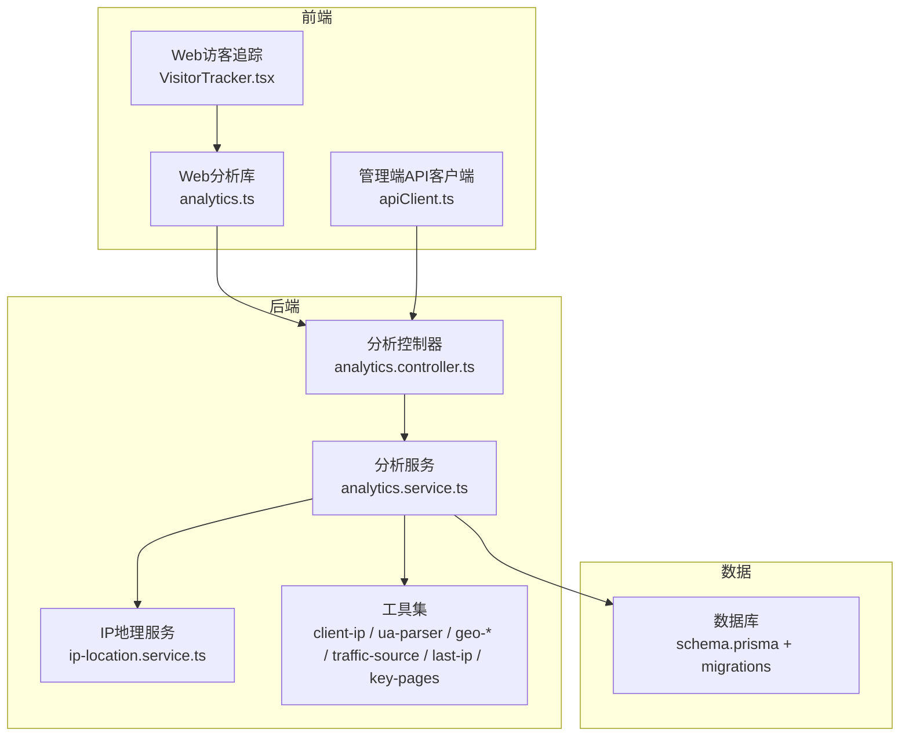
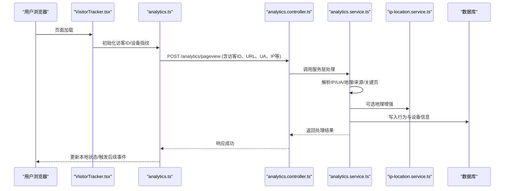
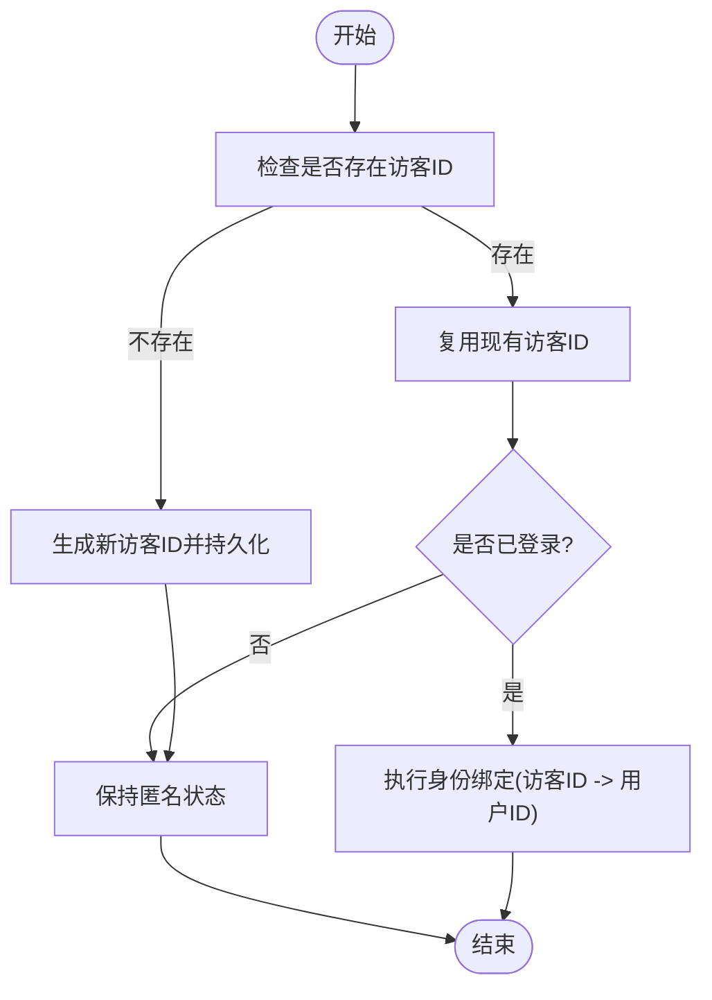
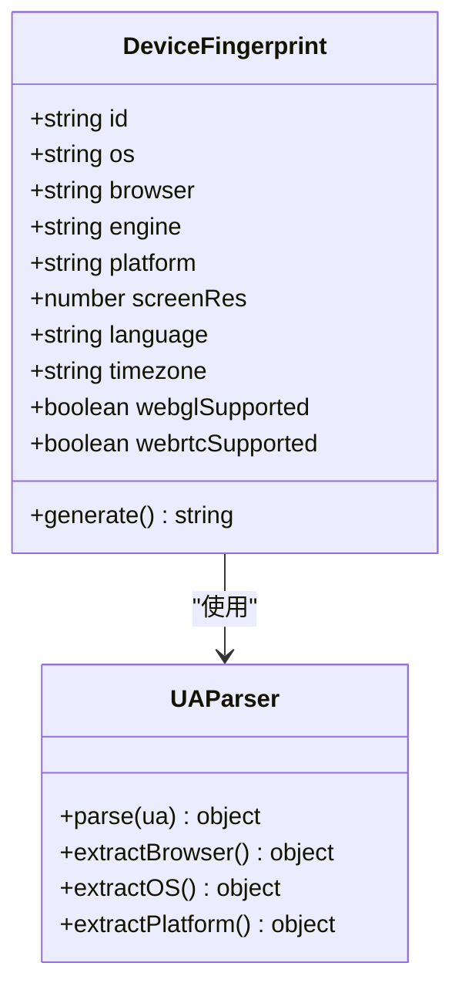
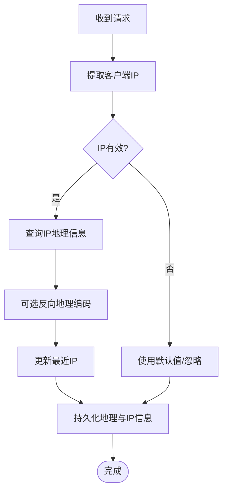
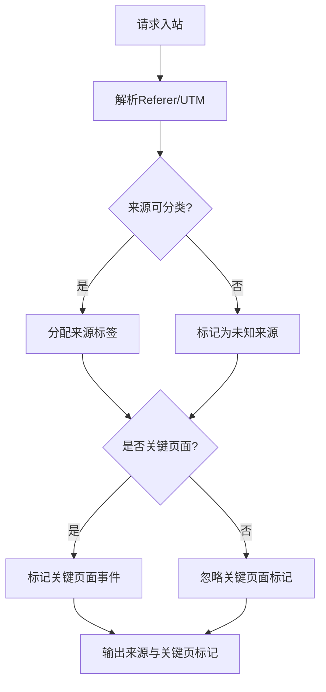
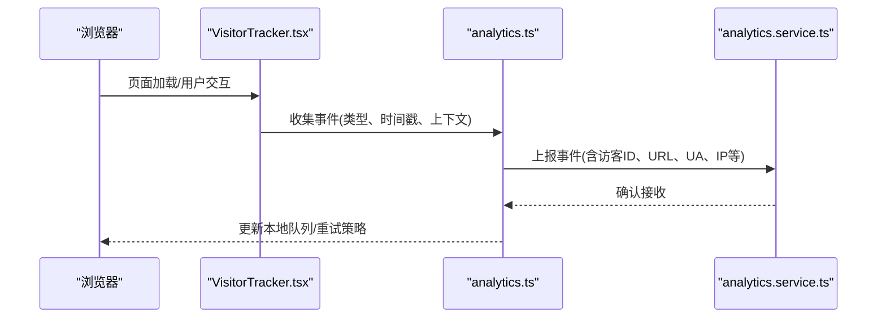
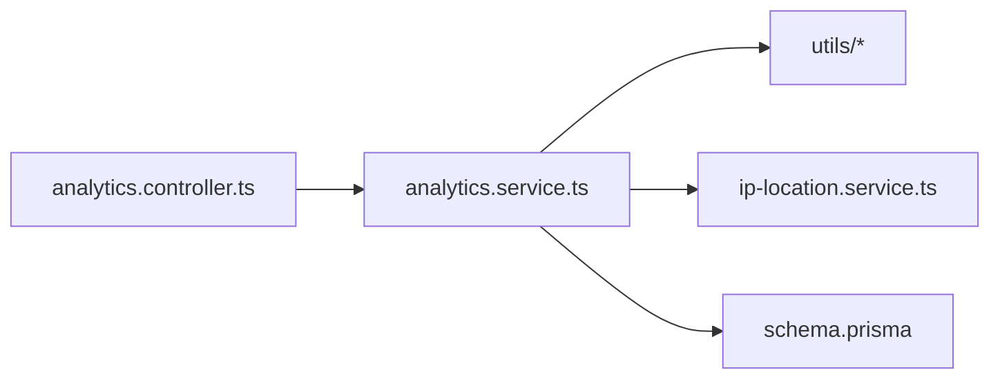

# 用户识别与追踪

<cite>
**本文档引用的文件**   
- [analytics.controller.ts](file://apps/api/src/analytics/analytics.controller.ts)
- [analytics.service.ts](file://apps/api/src/analytics/analytics.service.ts)
- [collect-pageview.dto.ts](file://apps/api/src/analytics/dto/collect-pageview.dto.ts)
- [identify.dto.ts](file://apps/api/src/analytics/dto/identify.dto.ts)
- [client-ip.ts](file://apps/api/src/analytics/utils/client-ip.ts)
- [ua-parser.ts](file://apps/api/src/analytics/utils/ua-parser.ts)
- [geo-ip.ts](file://apps/api/src/analytics/utils/geo-ip.ts)
- [geo-label.ts](file://apps/api/src/analytics/utils/geo-label.ts)
- [geo-reverse.ts](file://apps/api/src/analytics/utils/geo-reverse.ts)
- [traffic-source.ts](file://apps/api/src/analytics/utils/traffic-source.ts)
- [last-ip.ts](file://apps/api/src/analytics/utils/last-ip.ts)
- [key-pages.ts](file://apps/api/src/analytics/utils/key-pages.ts)
- [ip-location.service.ts](file://apps/api/src/analytics/ip-location.service.ts)
- [schema.prisma](file://apps/api/prisma/schema.prisma)
- [20260723110621_add_device_details/migration.sql](file://apps/api/prisma/migrations/20260723110621_add_device_details/migration.sql)
- [VisitorTracker.tsx](file://apps/web/src/components/analytics/VisitorTracker.tsx)
- [analytics.ts](file://apps/web/src/lib/analytics.ts)
- [apiClient.ts](file://apps/admin/src/lib/apiClient.ts)
- [auth.ts](file://apps/admin/src/lib/auth.ts)
- [IpVisitorDetailSheet.tsx](file://apps/admin/src/components/analytics/IpVisitorDetailSheet.tsx)
- [VisitorActivityTimeline.tsx](file://apps/admin/src/components/analytics/VisitorActivityTimeline.tsx)
- [IpVisitorLens.tsx](file://apps/admin/src/components/visitors/IpVisitorLens.tsx)
- [PeopleVisitorLens.tsx](file://apps/admin/src/components/visitors/PeopleVisitorLens.tsx)
</cite>

## 目录
1. [简介](#简介)
2. [项目结构](#项目结构)
3. [核心组件](#核心组件)
4. [架构总览](#架构总览)
5. [详细组件分析](#详细组件分析)
6. [依赖关系分析](#依赖关系分析)
7. [性能考量](#性能考量)
8. [故障排查指南](#故障排查指南)
9. [结论](#结论)
10. [附录：API使用示例](#附录api使用示例)

## 简介
本文件面向“用户识别与追踪系统”，聚焦以下目标：
- 用户身份识别机制与会话管理
- 设备指纹生成与浏览器特征提取
- IP地址解析、地理位置标注与来源渠道推断
- 用户行为序列追踪、跨页面跟踪与用户画像构建
- 用户识别API的使用示例（身份绑定、会话状态查询、行为事件上报）
- 隐私保护措施、数据脱敏与合规性要求

该系统由前端采集器、后端分析服务与数据库三部分组成，覆盖从客户端到服务端的全链路数据采集、处理与可视化。

## 项目结构
- 前端采集层
  - Web端：在页面中集成访客追踪脚本，负责收集页面浏览、交互事件、设备与网络信息，并上报至后端。
  - 管理端：提供IP访客详情、活动时序、人群筛选等分析界面。
- 后端分析服务
  - 控制器：暴露行为采集与身份识别接口。
  - 服务层：实现IP解析、UA解析、地理定位、来源渠道推断、关键页面判定、最近IP维护等逻辑。
  - 数据层：通过Prisma模型与迁移脚本持久化访客、设备与行为数据。
- 基础设施
  - 数据库：PostgreSQL（通过Prisma ORM）。
  - 可选外部服务：IP地理库、反向地理编码、来源渠道归因服务等。

图表来源
- [VisitorTracker.tsx](file://apps/web/src/components/analytics/VisitorTracker.tsx)
- [analytics.ts](file://apps/web/src/lib/analytics.ts)
- [analytics.controller.ts](file://apps/api/src/analytics/analytics.controller.ts)
- [analytics.service.ts](file://apps/api/src/analytics/analytics.service.ts)
- [ip-location.service.ts](file://apps/api/src/analytics/ip-location.service.ts)
- [client-ip.ts](file://apps/api/src/analytics/utils/client-ip.ts)
- [ua-parser.ts](file://apps/api/src/analytics/utils/ua-parser.ts)
- [geo-ip.ts](file://apps/api/src/analytics/utils/geo-ip.ts)
- [geo-label.ts](file://apps/api/src/analytics/utils/geo-label.ts)
- [geo-reverse.ts](file://apps/api/src/analytics/utils/geo-reverse.ts)
- [traffic-source.ts](file://apps/api/src/analytics/utils/traffic-source.ts)
- [last-ip.ts](file://apps/api/src/analytics/utils/last-ip.ts)
- [key-pages.ts](file://apps/api/src/analytics/utils/key-pages.ts)
- [schema.prisma](file://apps/api/prisma/schema.prisma)

章节来源
- [analytics.controller.ts](file://apps/api/src/analytics/analytics.controller.ts)
- [analytics.service.ts](file://apps/api/src/analytics/analytics.service.ts)
- [VisitorTracker.tsx](file://apps/web/src/components/analytics/VisitorTracker.tsx)
- [analytics.ts](file://apps/web/src/lib/analytics.ts)

## 核心组件
- 访客追踪器（前端）
  - 职责：初始化访客ID、收集设备与浏览器特征、记录页面浏览与交互事件、上报至后端。
  - 关键点：跨页面跟踪通过本地存储或Cookie维持访客ID；事件去抖与批量上报提升性能。
- 分析控制器（后端）
  - 职责：接收行为采集与身份识别请求，参数校验后委托服务层处理。
  - 关键点：统一错误处理、限流与审计日志。
- 分析服务（后端）
  - 职责：解析客户端IP、解析User-Agent、获取地理位置、推断流量来源、判定关键页面、维护最近IP、持久化行为与设备信息。
  - 关键点：可插拔的地理与来源策略；失败降级与缓存。
- 数据模型与迁移
  - 职责：定义访客、设备、行为事件等实体及关系；通过迁移脚本演进数据结构。
  - 关键点：设备细节扩展字段、联系人/客户与访客关联字段。

章节来源
- [VisitorTracker.tsx](file://apps/web/src/components/analytics/VisitorTracker.tsx)
- [analytics.ts](file://apps/web/src/lib/analytics.ts)
- [analytics.controller.ts](file://apps/api/src/analytics/analytics.controller.ts)
- [analytics.service.ts](file://apps/api/src/analytics/analytics.service.ts)
- [schema.prisma](file://apps/api/prisma/schema.prisma)
- [20260723110621_add_device_details/migration.sql](file://apps/api/prisma/migrations/20260723110621_add_device_details/migration.sql)

## 架构总览
整体流程分为三层：
- 采集层：Web端VisitorTracker与analytics库负责事件采集与上报。
- 处理层：后端控制器与服务层完成参数校验、IP解析、UA解析、地理标注、来源推断、关键页面判定与数据落盘。
- 展示层：管理端提供IP访客详情、活动时序、人群筛选与分析报表。

图表来源
- [VisitorTracker.tsx](file://apps/web/src/components/analytics/VisitorTracker.tsx)
- [analytics.ts](file://apps/web/src/lib/analytics.ts)
- [analytics.controller.ts](file://apps/api/src/analytics/analytics.controller.ts)
- [analytics.service.ts](file://apps/api/src/analytics/analytics.service.ts)
- [ip-location.service.ts](file://apps/api/src/analytics/ip-location.service.ts)

## 详细组件分析

### 用户身份识别与会话管理
- 访客标识
  - 首次访问时生成唯一访客ID，持久化至本地存储或Cookie，用于跨页面跟踪。
  - 支持匿名访客与已登录用户的身份绑定（如登录后将访客ID与用户ID关联）。
- 会话管理
  - 基于时间窗口聚合行为事件，形成会话；会话过期策略可配置。
  - 会话内包含页面浏览、点击、滚动、表单提交等行为。
- 身份绑定
  - 提供身份绑定接口，将匿名访客与系统用户进行关联，便于后续分析与转化归因。

章节来源
- [analytics.controller.ts](file://apps/api/src/analytics/analytics.controller.ts)
- [analytics.service.ts](file://apps/api/src/analytics/analytics.service.ts)
- [identify.dto.ts](file://apps/api/src/analytics/dto/identify.dto.ts)

### 设备指纹与浏览器特征提取
- 设备指纹
  - 基于设备硬件、操作系统、屏幕分辨率、语言、时区、Canvas/WebGL等特征组合生成稳定指纹。
  - 指纹用于区分不同设备与浏览器环境，提高识别准确率。
- 浏览器特征
  - 解析User-Agent得到浏览器类型、版本、引擎、平台等信息。
  - 结合navigator属性补充能力检测（如是否支持WebRTC、是否启用广告拦截等）。

图表来源
- [ua-parser.ts](file://apps/api/src/analytics/utils/ua-parser.ts)
- [VisitorTracker.tsx](file://apps/web/src/components/analytics/VisitorTracker.tsx)

章节来源
- [ua-parser.ts](file://apps/api/src/analytics/utils/ua-parser.ts)
- [VisitorTracker.tsx](file://apps/web/src/components/analytics/VisitorTracker.tsx)

### IP地址解析与地理位置标注
- IP解析
  - 从请求头或代理链中提取真实客户端IP，避免伪造与内网映射干扰。
- 地理位置
  - 通过IP地理库获取国家、省份、城市、经纬度等。
  - 可选反向地理编码增强位置描述。
- 最近IP维护
  - 维护访客最近使用的IP，用于异常检测与多设备识别。

图表来源
- [client-ip.ts](file://apps/api/src/analytics/utils/client-ip.ts)
- [geo-ip.ts](file://apps/api/src/analytics/utils/geo-ip.ts)
- [geo-label.ts](file://apps/api/src/analytics/utils/geo-label.ts)
- [geo-reverse.ts](file://apps/api/src/analytics/utils/geo-reverse.ts)
- [last-ip.ts](file://apps/api/src/analytics/utils/last-ip.ts)
- [ip-location.service.ts](file://apps/api/src/analytics/ip-location.service.ts)

章节来源
- [client-ip.ts](file://apps/api/src/analytics/utils/client-ip.ts)
- [geo-ip.ts](file://apps/api/src/analytics/utils/geo-ip.ts)
- [geo-label.ts](file://apps/api/src/analytics/utils/geo-label.ts)
- [geo-reverse.ts](file://apps/api/src/analytics/utils/geo-reverse.ts)
- [last-ip.ts](file://apps/api/src/analytics/utils/last-ip.ts)
- [ip-location.service.ts](file://apps/api/src/analytics/ip-location.service.ts)

### 流量来源推断与关键页面判定
- 流量来源
  - 根据Referer、UTM参数、搜索关键词等推断来源渠道（自然搜索、付费广告、社交媒体、直接访问等）。
- 关键页面
  - 定义关键页面集合（如产品页、定价页、联系页），用于转化漏斗分析。

图表来源
- [traffic-source.ts](file://apps/api/src/analytics/utils/traffic-source.ts)
- [key-pages.ts](file://apps/api/src/analytics/utils/key-pages.ts)

章节来源
- [traffic-source.ts](file://apps/api/src/analytics/utils/traffic-source.ts)
- [key-pages.ts](file://apps/api/src/analytics/utils/key-pages.ts)

### 用户行为序列追踪与跨页面跟踪
- 行为序列
  - 记录页面浏览、点击、滚动、表单输入等行为，按时间顺序组织成序列。
  - 支持事件去重、去抖与批量上报，降低网络开销。
- 跨页面跟踪
  - 通过访客ID在多个页面间串联行为，形成完整旅程。
  - 支持会话超时与重新计算。

图表来源
- [VisitorTracker.tsx](file://apps/web/src/components/analytics/VisitorTracker.tsx)
- [analytics.ts](file://apps/web/src/lib/analytics.ts)
- [analytics.service.ts](file://apps/api/src/analytics/analytics.service.ts)

章节来源
- [VisitorTracker.tsx](file://apps/web/src/components/analytics/VisitorTracker.tsx)
- [analytics.ts](file://apps/web/src/lib/analytics.ts)
- [analytics.service.ts](file://apps/api/src/analytics/analytics.service.ts)

### 用户画像构建
- 画像维度
  - 基础信息：设备、浏览器、操作系统、地理位置。
  - 行为特征：活跃时段、偏好页面、转化路径、留存率。
  - 来源渠道：自然搜索、付费广告、社交媒体、直接访问。
- 画像更新
  - 增量更新：每次事件上报后更新相关维度。
  - 离线批处理：定期汇总统计，生成指标与标签。

章节来源
- [analytics.service.ts](file://apps/api/src/analytics/analytics.service.ts)
- [schema.prisma](file://apps/api/prisma/schema.prisma)

### 管理端可视化与分析
- IP访客详情
  - 展示某IP下的所有访客、设备、行为与地理位置。
- 活动时序
  - 以时间轴形式展示访客行为序列，辅助诊断问题与优化体验。
- 人群筛选
  - 按来源、设备、地理位置、关键页面等条件筛选访客群体。

章节来源
- [IpVisitorDetailSheet.tsx](file://apps/admin/src/components/analytics/IpVisitorDetailSheet.tsx)
- [VisitorActivityTimeline.tsx](file://apps/admin/src/components/analytics/VisitorActivityTimeline.tsx)
- [IpVisitorLens.tsx](file://apps/admin/src/components/visitors/IpVisitorLens.tsx)
- [PeopleVisitorLens.tsx](file://apps/admin/src/components/visitors/PeopleVisitorLens.tsx)

## 依赖关系分析
- 模块耦合
  - 控制器依赖服务层；服务层依赖工具集与地理服务；数据层通过Prisma访问数据库。
- 外部依赖
  - IP地理库、反向地理编码、来源渠道归因服务等可替换实现。
- 潜在循环依赖
  - 工具函数无对外业务依赖，避免循环引用。

图表来源
- [analytics.controller.ts](file://apps/api/src/analytics/analytics.controller.ts)
- [analytics.service.ts](file://apps/api/src/analytics/analytics.service.ts)
- [client-ip.ts](file://apps/api/src/analytics/utils/client-ip.ts)
- [ua-parser.ts](file://apps/api/src/analytics/utils/ua-parser.ts)
- [geo-ip.ts](file://apps/api/src/analytics/utils/geo-ip.ts)
- [geo-label.ts](file://apps/api/src/analytics/utils/geo-label.ts)
- [geo-reverse.ts](file://apps/api/src/analytics/utils/geo-reverse.ts)
- [traffic-source.ts](file://apps/api/src/analytics/utils/traffic-source.ts)
- [last-ip.ts](file://apps/api/src/analytics/utils/last-ip.ts)
- [key-pages.ts](file://apps/api/src/analytics/utils/key-pages.ts)
- [ip-location.service.ts](file://apps/api/src/analytics/ip-location.service.ts)
- [schema.prisma](file://apps/api/prisma/schema.prisma)

章节来源
- [analytics.controller.ts](file://apps/api/src/analytics/analytics.controller.ts)
- [analytics.service.ts](file://apps/api/src/analytics/analytics.service.ts)
- [schema.prisma](file://apps/api/prisma/schema.prisma)

## 性能考量
- 前端采集
  - 事件去抖与批量上报，减少网络请求频率。
  - 本地队列与重试机制，保证弱网环境下数据不丢失。
- 后端处理
  - IP地理查询与反向地理编码采用缓存策略，降低延迟。
  - 关键页面判定与来源推断使用轻量规则，避免复杂计算。
- 数据存储
  - 行为事件表分区与索引优化，提升查询效率。
  - 定期归档历史数据，控制表规模。

[本节为通用指导，不直接分析具体文件]

## 故障排查指南
- 常见问题
  - IP解析失败：检查代理头与网络配置，确保正确提取客户端IP。
  - 地理位置缺失：验证地理库可用性，必要时降级为默认值。
  - 事件丢失：检查前端队列与重试策略，确认后端接口限流与错误处理。
- 调试建议
  - 开启详细日志，记录请求ID与关键步骤。
  - 使用管理端IP访客详情与活动时序定位问题。

章节来源
- [analytics.controller.ts](file://apps/api/src/analytics/analytics.controller.ts)
- [analytics.service.ts](file://apps/api/src/analytics/analytics.service.ts)
- [IpVisitorDetailSheet.tsx](file://apps/admin/src/components/analytics/IpVisitorDetailSheet.tsx)
- [VisitorActivityTimeline.tsx](file://apps/admin/src/components/analytics/VisitorActivityTimeline.tsx)

## 结论
本系统通过前端采集、后端处理与数据持久化的协同，实现了完整的用户识别与追踪能力。其核心在于稳定的访客标识、可靠的设备指纹、准确的IP地理标注与高效的来源推断。配合管理端的可视化分析，可为运营与产品决策提供有力支撑。同时，系统在隐私保护与合规性方面采取了必要措施，确保数据采集与使用的合法性与安全性。

[本节为总结性内容，不直接分析具体文件]

## 附录：API使用示例
- 身份绑定
  - 目的：将匿名访客与系统用户进行关联。
  - 请求：POST /analytics/identify，携带访客ID与用户ID。
  - 响应：绑定结果与当前会话状态。
  - 参考：[identify.dto.ts](file://apps/api/src/analytics/dto/identify.dto.ts)
- 会话状态查询
  - 目的：获取当前访客的会话信息与最近行为。
  - 请求：GET /analytics/session，携带访客ID。
  - 响应：会话ID、创建时间、最近IP、设备信息等。
  - 参考：[analytics.controller.ts](file://apps/api/src/analytics/analytics.controller.ts)
- 行为事件上报
  - 目的：上报页面浏览与交互事件。
  - 请求：POST /analytics/pageview，携带访客ID、URL、UA、IP、事件类型等。
  - 响应：接收确认与处理结果。
  - 参考：[collect-pageview.dto.ts](file://apps/api/src/analytics/dto/collect-pageview.dto.ts)

章节来源
- [identify.dto.ts](file://apps/api/src/analytics/dto/identify.dto.ts)
- [collect-pageview.dto.ts](file://apps/api/src/analytics/dto/collect-pageview.dto.ts)
- [analytics.controller.ts](file://apps/api/src/analytics/analytics.controller.ts)