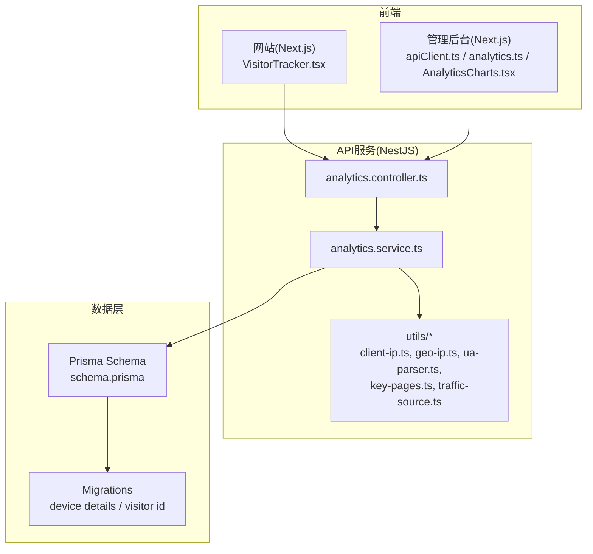
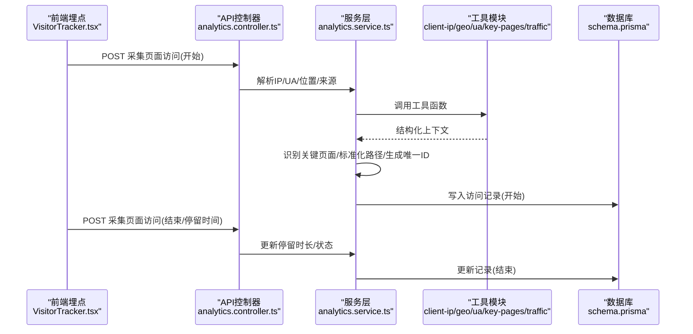
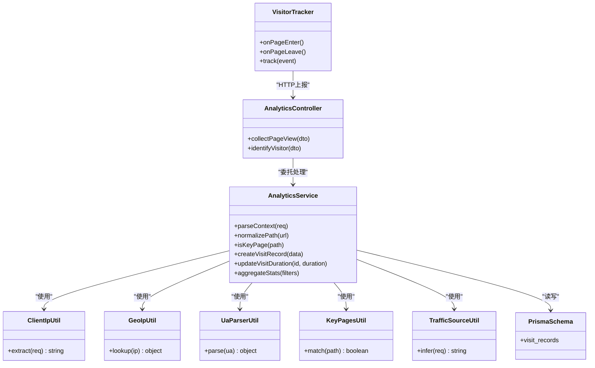
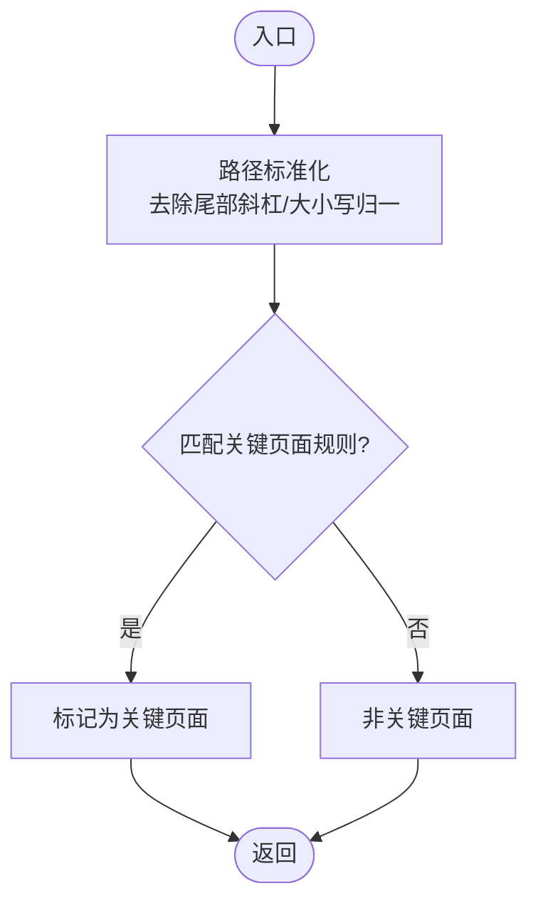
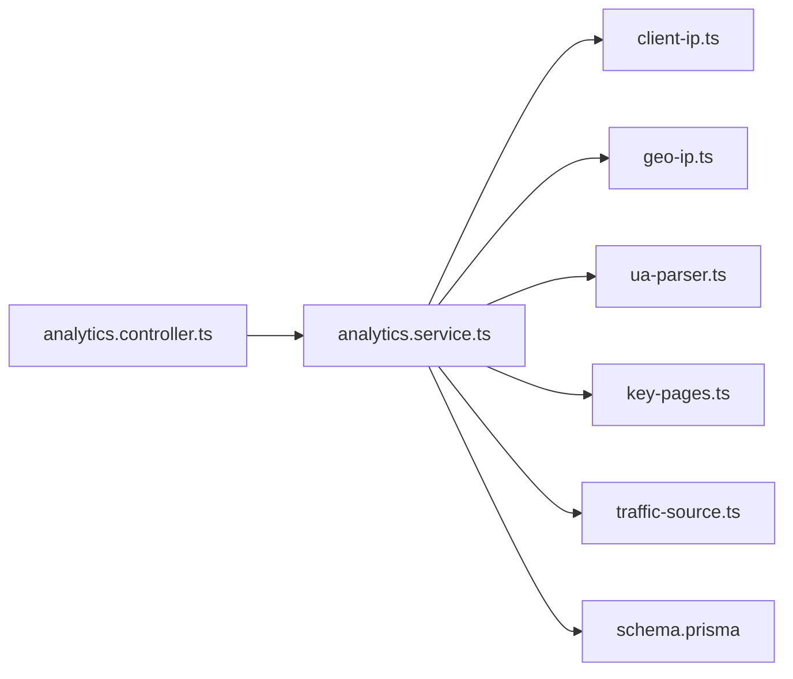

# 页面访问统计

<cite>
**本文引用的文件**   
- [analytics.controller.ts](file://apps/api/src/analytics/analytics.controller.ts)
- [analytics.service.ts](file://apps/api/src/analytics/analytics.service.ts)
- [collect-pageview.dto.ts](file://apps/api/src/analytics/dto/collect-pageview.dto.ts)
- [identify.dto.ts](file://apps/api/src/analytics/dto/identify.dto.ts)
- [client-ip.ts](file://apps/api/src/analytics/utils/client-ip.ts)
- [geo-ip.ts](file://apps/api/src/analytics/utils/geo-ip.ts)
- [geo-label.ts](file://apps/api/src/analytics/utils/geo-label.ts)
- [geo-reverse.ts](file://apps/api/src/analytics/utils/geo-reverse.ts)
- [key-pages.ts](file://apps/api/src/analytics/utils/key-pages.ts)
- [traffic-source.ts](file://apps/api/src/analytics/utils/traffic-source.ts)
- [ua-parser.ts](file://apps/api/src/analytics/utils/ua-parser.ts)
- [VisitorTracker.tsx](file://apps/web/src/components/analytics/VisitorTracker.tsx)
- [schema.prisma](file://apps/api/prisma/schema.prisma)
- [20260723110621_add_device_details/migration.sql](file://apps/api/prisma/migrations/20260723110621_add_device_details/migration.sql)
- [20260723120000_add_contact_visitor_id/migration.sql](file://apps/api/prisma/migrations/20260723120000_add_contact_visitor_id/migration.sql)
- [20260724122950_customer_visitor_id/migration.sql](file://apps/api/prisma/migrations/20260724122950_customer_visitor_id/migration.sql)
- [apiClient.ts](file://apps/admin/src/lib/apiClient.ts)
- [analytics.ts](file://apps/admin/src/features/analytics.ts)
- [AnalyticsCharts.tsx](file://apps/admin/src/components/analytics/AnalyticsCharts.tsx)
</cite>

## 目录
1. [简介](#简介)
2. [项目结构](#项目结构)
3. [核心组件](#核心组件)
4. [架构总览](#架构总览)
5. [详细组件分析](#详细组件分析)
6. [依赖关系分析](#依赖关系分析)
7. [性能考虑](#性能考虑)
8. [故障排查指南](#故障排查指南)
9. [结论](#结论)
10. [附录](#附录)

## 简介
本文件面向“页面访问统计”功能，覆盖从前端埋点到后端采集、存储与统计的全链路说明。重点包括：
- 页面浏览量的采集、存储与统计逻辑
- 关键页面识别算法、页面路径标准化与URL参数处理
- 页面停留时间计算、跳出率分析与热门页面排序
- 查询接口使用示例（时间范围筛选、页面分组、趋势分析）
- 数据去重机制、缓存策略与性能优化方案

## 项目结构
该功能涉及三个主要层次：
- 前端埋点层：Web端通过组件在页面生命周期中上报事件；管理后台提供可视化与分析能力
- API服务层：NestJS模块负责接收上报、解析上下文、落库与聚合统计
- 数据层：Prisma模型与数据库迁移定义访问记录的结构与索引

图表来源 
- [VisitorTracker.tsx](file://apps/web/src/components/analytics/VisitorTracker.tsx)
- [analytics.controller.ts](file://apps/api/src/analytics/analytics.controller.ts)
- [analytics.service.ts](file://apps/api/src/analytics/analytics.service.ts)
- [schema.prisma](file://apps/api/prisma/schema.prisma)

章节来源
- [VisitorTracker.tsx](file://apps/web/src/components/analytics/VisitorTracker.tsx)
- [analytics.controller.ts](file://apps/api/src/analytics/analytics.controller.ts)
- [analytics.service.ts](file://apps/api/src/analytics/analytics.service.ts)
- [schema.prisma](file://apps/api/prisma/schema.prisma)

## 核心组件
- 前端埋点组件：在页面挂载/卸载时采集基础信息并上报
- API控制器：暴露采集与识别接口，校验入参并委派服务层
- 业务服务：解析IP、UA、地理位置、流量来源，识别关键页面，生成规范化路径，写入访问记录
- 工具模块：客户端IP提取、GeoIP解析、设备信息解析、关键页面规则、流量来源推断
- 数据模型：访问记录表结构与相关迁移

章节来源
- [VisitorTracker.tsx](file://apps/web/src/components/analytics/VisitorTracker.tsx)
- [analytics.controller.ts](file://apps/api/src/analytics/analytics.controller.ts)
- [analytics.service.ts](file://apps/api/src/analytics/analytics.service.ts)
- [client-ip.ts](file://apps/api/src/analytics/utils/client-ip.ts)
- [geo-ip.ts](file://apps/api/src/analytics/utils/geo-ip.ts)
- [ua-parser.ts](file://apps/api/src/analytics/utils/ua-parser.ts)
- [key-pages.ts](file://apps/api/src/analytics/utils/key-pages.ts)
- [traffic-source.ts](file://apps/api/src/analytics/utils/traffic-source.ts)
- [schema.prisma](file://apps/api/prisma/schema.prisma)

## 架构总览
页面访问统计的整体流程如下：
- 前端在页面可见时触发“页面加载”，在离开或关闭时触发“页面离开”，分别上报基础信息与结束时间
- API层对请求进行鉴权与参数校验，解析客户端IP、UA、地理位置与流量来源
- 服务层根据规则识别关键页面、标准化路径、过滤无效参数，生成唯一访问ID用于去重
- 访问记录持久化后，支持按时间、页面、来源等多维度聚合统计与导出

图表来源 
- [VisitorTracker.tsx](file://apps/web/src/components/analytics/VisitorTracker.tsx)
- [analytics.controller.ts](file://apps/api/src/analytics/analytics.controller.ts)
- [analytics.service.ts](file://apps/api/src/analytics/analytics.service.ts)
- [client-ip.ts](file://apps/api/src/analytics/utils/client-ip.ts)
- [geo-ip.ts](file://apps/api/src/analytics/utils/geo-ip.ts)
- [ua-parser.ts](file://apps/api/src/analytics/utils/ua-parser.ts)
- [key-pages.ts](file://apps/api/src/analytics/utils/key-pages.ts)
- [traffic-source.ts](file://apps/api/src/analytics/utils/traffic-source.ts)
- [schema.prisma](file://apps/api/prisma/schema.prisma)

## 详细组件分析

### 前端埋点组件（VisitorTracker）
- 职责
  - 监听页面生命周期，收集页面标题、路径、时间戳、用户代理等
  - 在页面进入时上报“开始访问”，在页面离开时上报“结束访问”以计算停留时长
  - 可选上报访客标识（如匿名ID），便于跨会话关联
- 关键点
  - 避免重复上报：基于路由变化与组件卸载事件控制上报时机
  - 网络容错：失败重试与静默降级，不影响主流程性能
  - 隐私合规：不上传敏感信息，仅上报必要字段

章节来源
- [VisitorTracker.tsx](file://apps/web/src/components/analytics/VisitorTracker.tsx)

### API控制器（analytics.controller）
- 职责
  - 暴露采集接口：接收页面访问开始/结束事件
  - 暴露访客识别接口：将匿名访客与联系人/客户关联
  - 参数校验与错误处理：确保入参完整与安全
- 关键点
  - 统一响应格式与异常过滤器
  - 限流与防刷：对高频上报进行节流

章节来源
- [analytics.controller.ts](file://apps/api/src/analytics/analytics.controller.ts)
- [collect-pageview.dto.ts](file://apps/api/src/analytics/dto/collect-pageview.dto.ts)
- [identify.dto.ts](file://apps/api/src/analytics/dto/identify.dto.ts)

### 服务层（analytics.service）
- 职责
  - 解析请求上下文：客户端IP、User-Agent、地理位置、流量来源
  - 页面识别与标准化：判断是否关键页面、规范化路径、清理URL参数
  - 访问记录写入与更新：创建/更新访问事件，计算停留时长
  - 统计与聚合：支持按时间、页面、来源、设备等维度聚合
- 关键点
  - 去重机制：基于唯一访问ID与时间窗口去重
  - 批量写入：在高并发场景下合并写入降低IO压力
  - 缓存热点：对频繁查询的聚合结果进行短期缓存

章节来源
- [analytics.service.ts](file://apps/api/src/analytics/analytics.service.ts)
- [client-ip.ts](file://apps/api/src/analytics/utils/client-ip.ts)
- [geo-ip.ts](file://apps/api/src/analytics/utils/geo-ip.ts)
- [geo-label.ts](file://apps/api/src/analytics/utils/geo-label.ts)
- [geo-reverse.ts](file://apps/api/src/analytics/utils/geo-reverse.ts)
- [ua-parser.ts](file://apps/api/src/analytics/utils/ua-parser.ts)
- [key-pages.ts](file://apps/api/src/analytics/utils/key-pages.ts)
- [traffic-source.ts](file://apps/api/src/analytics/utils/traffic-source.ts)

### 工具模块
- client-ip.ts：从请求头与代理链中提取真实客户端IP
- geo-ip.ts：基于IP解析地理位置（国家/城市/ISP）
- geo-label.ts：地理标签映射与展示名称
- geo-reverse.ts：反向地理编码（坐标到地名）
- ua-parser.ts：解析设备类型、操作系统、浏览器版本
- key-pages.ts：关键页面识别规则（如首页、产品页、案例页、联系页等）
- traffic-source.ts：推断流量来源（直接访问、搜索引擎、社交媒体、广告等）

章节来源
- [client-ip.ts](file://apps/api/src/analytics/utils/client-ip.ts)
- [geo-ip.ts](file://apps/api/src/analytics/utils/geo-ip.ts)
- [geo-label.ts](file://apps/api/src/analytics/utils/geo-label.ts)
- [geo-reverse.ts](file://apps/api/src/analytics/utils/geo-reverse.ts)
- [ua-parser.ts](file://apps/api/src/analytics/utils/ua-parser.ts)
- [key-pages.ts](file://apps/api/src/analytics/utils/key-pages.ts)
- [traffic-source.ts](file://apps/api/src/analytics/utils/traffic-source.ts)

### 数据模型与迁移
- schema.prisma：定义访问记录实体（如页面路径、标题、IP、UA、地理位置、来源、时间戳、停留时长、是否关键页面、唯一访问ID等）
- 迁移文件：补充设备详情、访客ID关联等字段，提升统计粒度与关联能力

章节来源
- [schema.prisma](file://apps/api/prisma/schema.prisma)
- [20260723110621_add_device_details/migration.sql](file://apps/api/prisma/migrations/20260723110621_add_device_details/migration.sql)
- [20260723120000_add_contact_visitor_id/migration.sql](file://apps/api/prisma/migrations/20260723120000_add_contact_visitor_id/migration.sql)
- [20260724122950_customer_visitor_id/migration.sql](file://apps/api/prisma/migrations/20260724122950_customer_visitor_id/migration.sql)

## 依赖关系分析
- 前端埋点依赖浏览器API与网络请求封装
- API控制器依赖DTO校验与中间件（鉴权、审计）
- 服务层依赖工具模块与数据库ORM
- 数据层依赖Prisma与PostgreSQL

图表来源 
- [VisitorTracker.tsx](file://apps/web/src/components/analytics/VisitorTracker.tsx)
- [analytics.controller.ts](file://apps/api/src/analytics/analytics.controller.ts)
- [analytics.service.ts](file://apps/api/src/analytics/analytics.service.ts)
- [client-ip.ts](file://apps/api/src/analytics/utils/client-ip.ts)
- [geo-ip.ts](file://apps/api/src/analytics/utils/geo-ip.ts)
- [ua-parser.ts](file://apps/api/src/analytics/utils/ua-parser.ts)
- [key-pages.ts](file://apps/api/src/analytics/utils/key-pages.ts)
- [traffic-source.ts](file://apps/api/src/analytics/utils/traffic-source.ts)
- [schema.prisma](file://apps/api/prisma/schema.prisma)

## 详细组件分析

### 关键页面识别算法
- 输入：规范化后的页面路径
- 规则：匹配预定义的关键页面模式（如首页、产品列表、案例详情、解决方案、联系我们等）
- 输出：布尔值表示是否关键页面，用于后续统计与看板展示

图表来源 
- [key-pages.ts](file://apps/api/src/analytics/utils/key-pages.ts)

章节来源
- [key-pages.ts](file://apps/api/src/analytics/utils/key-pages.ts)

### 页面路径标准化与URL参数处理
- 标准化步骤
  - 移除多余尾部斜杠
  - 统一大小写与编码
  - 忽略锚点与无意义片段
- URL参数处理
  - 过滤追踪参数（如UTM、分析ID）
  - 保留业务相关参数（如分页、排序）
  - 生成稳定键用于去重与分组

章节来源
- [analytics.service.ts](file://apps/api/src/analytics/analytics.service.ts)
- [key-pages.ts](file://apps/api/src/analytics/utils/key-pages.ts)

### 页面停留时间计算
- 开始时间：页面进入上报的时间戳
- 结束时间：页面离开上报的时间戳
- 停留时长：结束时间减开始时间，限制最小/最大阈值，避免异常值
- 未结束记录：定时任务补全长时间停留记录

章节来源
- [analytics.service.ts](file://apps/api/src/analytics/analytics.service.ts)

### 跳出率分析
- 定义：单页会话（仅一次页面访问且无后续交互）占该页面总访问的比例
- 计算：统计每个页面的“单次访问次数”与“总访问次数”，计算比值
- 应用：识别高跳出页面，辅助内容优化与转化漏斗改进

章节来源
- [analytics.service.ts](file://apps/api/src/analytics/analytics.service.ts)

### 热门页面排序
- 指标：访问量、独立访客数、平均停留时长、关键页面占比
- 排序：按指定权重组合排序，支持时间范围与页面分组过滤
- 输出：Top N页面列表及明细

章节来源
- [analytics.service.ts](file://apps/api/src/analytics/analytics.service.ts)

### 查询接口使用示例
- 时间范围筛选：传入start/end时间戳，限定统计区间
- 页面分组：按路径前缀、关键页面标志、设备类型、地理位置分组
- 趋势分析：按小时/天/周聚合，生成折线/柱状图数据

章节来源
- [analytics.controller.ts](file://apps/api/src/analytics/analytics.controller.ts)
- [analytics.service.ts](file://apps/api/src/analytics/analytics.service.ts)

### 数据去重机制
- 唯一访问ID：由客户端指纹+会话ID+时间窗口生成
- 去重策略：相同ID在同一时间窗口内只计一次访问
- 冲突处理：当ID冲突时，依据时间戳与来源优先级判定

章节来源
- [analytics.service.ts](file://apps/api/src/analytics/analytics.service.ts)

### 缓存策略与性能优化
- 聚合缓存：对热点查询结果进行短时缓存（如最近1小时）
- 批量写入：合并多次访问记录，减少数据库写入频率
- 异步处理：耗时操作（如GeoIP解析）异步执行，避免阻塞主流程
- 限流与降级：对高频上报进行限流，失败时降级为本地队列延迟上报

章节来源
- [analytics.service.ts](file://apps/api/src/analytics/analytics.service.ts)

## 依赖关系分析
- 模块耦合度：控制器与服务层解耦，服务层通过工具模块扩展能力
- 外部依赖：IP地理位置库、UA解析库、数据库ORM
- 潜在循环依赖：工具模块保持纯函数设计，避免反向引用

图表来源 
- [analytics.controller.ts](file://apps/api/src/analytics/analytics.controller.ts)
- [analytics.service.ts](file://apps/api/src/analytics/analytics.service.ts)
- [client-ip.ts](file://apps/api/src/analytics/utils/client-ip.ts)
- [geo-ip.ts](file://apps/api/src/analytics/utils/geo-ip.ts)
- [ua-parser.ts](file://apps/api/src/analytics/utils/ua-parser.ts)
- [key-pages.ts](file://apps/api/src/analytics/utils/key-pages.ts)
- [traffic-source.ts](file://apps/api/src/analytics/utils/traffic-source.ts)
- [schema.prisma](file://apps/api/prisma/schema.prisma)

章节来源
- [analytics.controller.ts](file://apps/api/src/analytics/analytics.controller.ts)
- [analytics.service.ts](file://apps/api/src/analytics/analytics.service.ts)

## 性能考虑
- 前端埋点
  - 使用requestIdleCallback或定时器延迟上报，避免阻塞渲染
  - 网络失败重试与退避策略
- API服务
  - 连接池与查询优化：合理索引与分页
  - 缓存热点数据：Redis或内存缓存
  - 异步任务队列：GeoIP解析与批量写入
- 数据层
  - 分区与归档：历史数据按月分区
  - 压缩与冷热分离：冷数据归档至低成本存储

[本节为通用指导，不直接分析具体文件]

## 故障排查指南
- 常见问题
  - 上报失败：检查网络连通性与接口限流
  - 数据缺失：确认埋点组件是否正确挂载与卸载
  - 停留时长异常：检查开始/结束上报顺序与时间戳精度
  - 地理位置不准：验证IP库更新与代理链配置
- 调试建议
  - 启用调试日志与请求追踪ID
  - 使用管理后台查看原始记录与聚合结果
  - 对比不同设备/浏览器行为差异

章节来源
- [analytics.controller.ts](file://apps/api/src/analytics/analytics.controller.ts)
- [analytics.service.ts](file://apps/api/src/analytics/analytics.service.ts)

## 结论
页面访问统计功能通过前后端协同实现完整的采集、存储与统计闭环。关键页面识别、路径标准化、URL参数处理与停留时间计算保障了数据的准确性与可用性。去重机制、缓存策略与性能优化提升了系统在高并发下的稳定性与效率。管理后台提供丰富的查询与分析能力，支撑运营与产品决策。

[本节为总结性内容，不直接分析具体文件]

## 附录
- 管理后台集成
  - apiClient.ts：封装API调用与错误处理
  - analytics.ts：定义查询参数与数据结构
  - AnalyticsCharts.tsx：可视化展示趋势与分布

章节来源
- [apiClient.ts](file://apps/admin/src/lib/apiClient.ts)
- [analytics.ts](file://apps/admin/src/features/analytics.ts)
- [AnalyticsCharts.tsx](file://apps/admin/src/components/analytics/AnalyticsCharts.tsx)