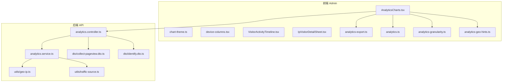
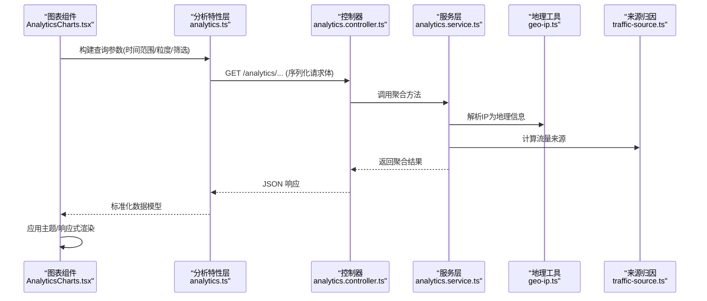
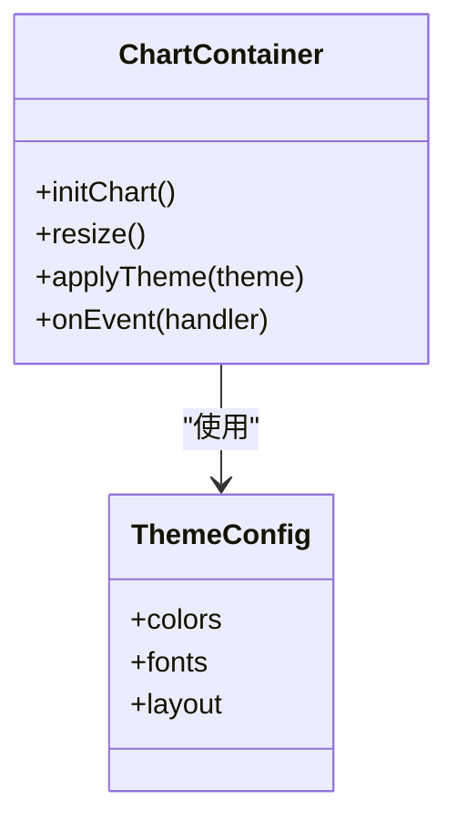
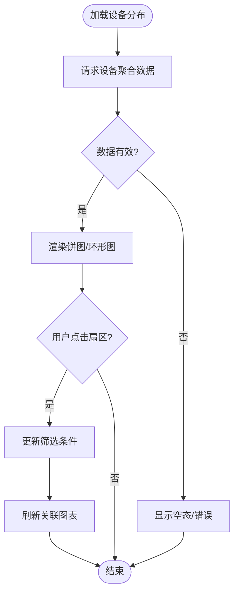
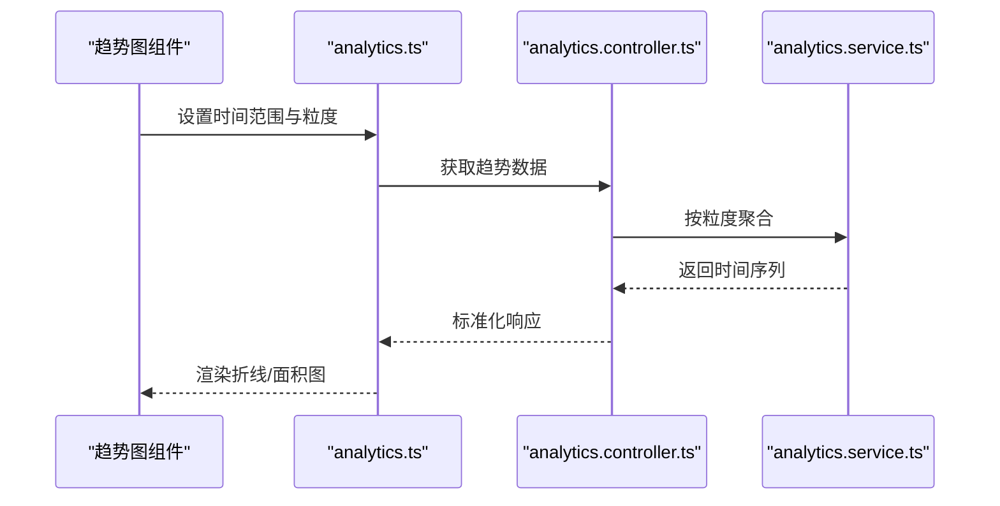
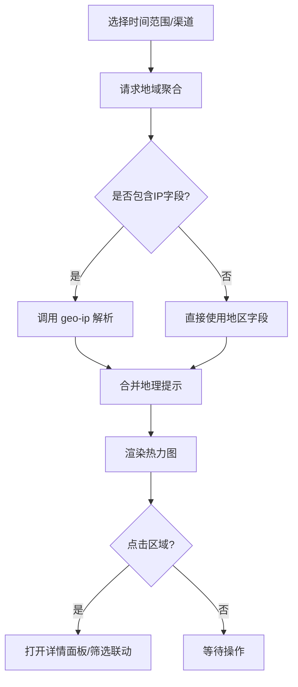
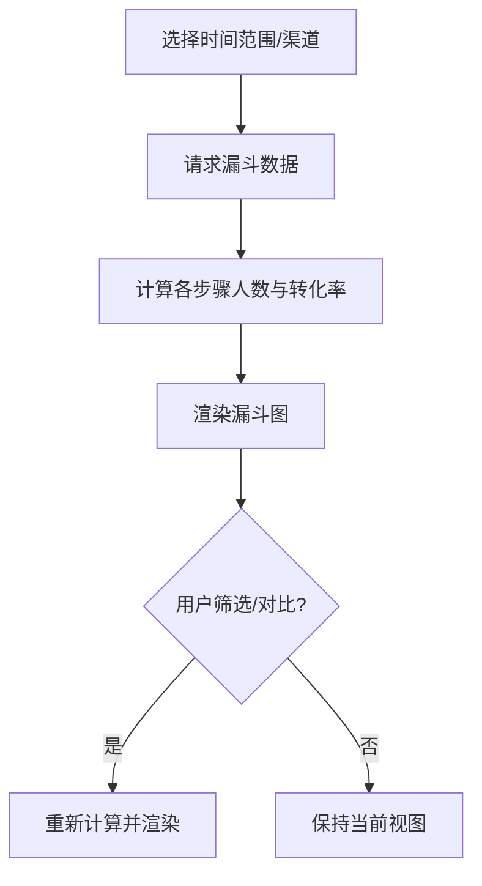
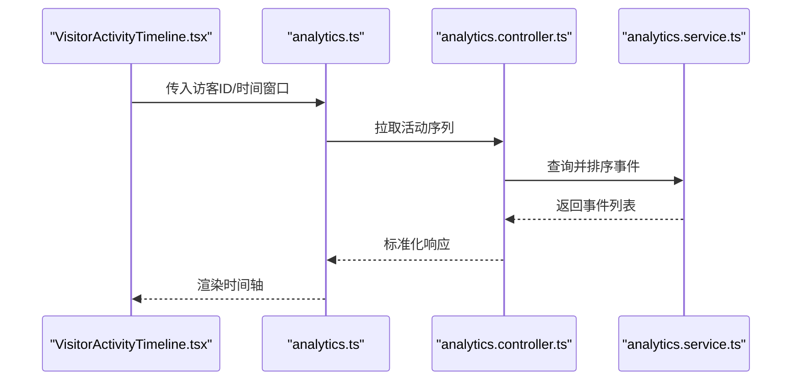
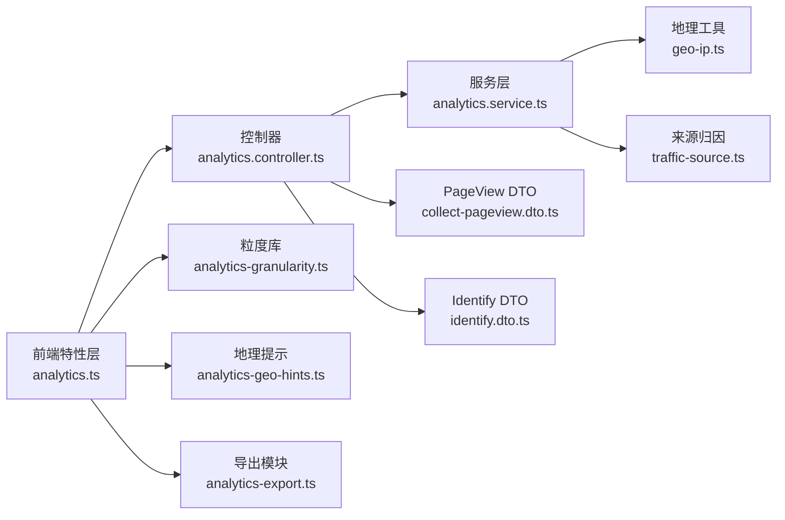

# 数据可视化与分析报表

<cite>
**本文引用的文件**   
- [apps/admin/src/components/analytics/AnalyticsCharts.tsx](file://apps/admin/src/components/analytics/AnalyticsCharts.tsx)
- [apps/admin/src/components/analytics/chart-theme.ts](file://apps/admin/src/components/analytics/chart-theme.ts)
- [apps/admin/src/components/analytics/device-columns.tsx](file://apps/admin/src/components/analytics/device-columns.tsx)
- [apps/admin/src/components/analytics/IpVisitorDetailSheet.tsx](file://apps/admin/src/components/analytics/IpVisitorDetailSheet.tsx)
- [apps/admin/src/components/analytics/VisitorActivityTimeline.tsx](file://apps/admin/src/components/analytics/VisitorActivityTimeline.tsx)
- [apps/admin/src/features/analytics-export.ts](file://apps/admin/src/features/analytics-export.ts)
- [apps/admin/src/features/analytics.ts](file://apps/admin/src/features/analytics.ts)
- [apps/admin/src/lib/analytics-granularity.ts](file://apps/admin/src/lib/analytics-granularity.ts)
- [apps/admin/src/lib/analytics-geo-hints.ts](file://apps/admin/src/lib/analytics-geo-hints.ts)
- [apps/api/src/analytics/analytics.controller.ts](file://apps/api/src/analytics/analytics.controller.ts)
- [apps/api/src/analytics/analytics.service.ts](file://apps/api/src/analytics/analytics.service.ts)
- [apps/api/src/analytics/utils/geo-ip.ts](file://apps/api/src/analytics/utils/geo-ip.ts)
- [apps/api/src/analytics/utils/traffic-source.ts](file://apps/api/src/analytics/utils/traffic-source.ts)
- [apps/api/src/analytics/dto/collect-pageview.dto.ts](file://apps/api/src/analytics/dto/collect-pageview.dto.ts)
- [apps/api/src/analytics/dto/identify.dto.ts](file://apps/api/src/analytics/dto/identify.dto.ts)
</cite>

## 目录
1. [简介](#简介)
2. [项目结构](#项目结构)
3. [核心组件](#核心组件)
4. [架构总览](#架构总览)
5. [详细组件分析](#详细组件分析)
6. [依赖关系分析](#依赖关系分析)
7. [性能考量](#性能考量)
8. [故障排查指南](#故障排查指南)
9. [结论](#结论)
10. [附录](#附录)

## 简介
本文件面向数据可视化与分析报表模块，系统性说明图表组件实现、数据展示模式与交互式分析界面。覆盖设备分布图、流量趋势图、地域热力图和转化漏斗可视化；阐述自定义报表生成、数据筛选与时间范围选择；并给出图表主题定制、响应式设计与导出功能的实践要点与配置示例路径。

## 项目结构
该模块由前端（Next.js Admin）与后端（NestJS API）两部分组成：
- 前端负责图表渲染、交互、主题与导出，以及筛选与时间范围控制。
- 后端提供分析数据的聚合接口、地理信息解析与来源归因工具。

**图示来源** 
- [apps/admin/src/components/analytics/AnalyticsCharts.tsx](file://apps/admin/src/components/analytics/AnalyticsCharts.tsx)
- [apps/admin/src/components/analytics/chart-theme.ts](file://apps/admin/src/components/analytics/chart-theme.ts)
- [apps/admin/src/components/analytics/device-columns.tsx](file://apps/admin/src/components/analytics/device-columns.tsx)
- [apps/admin/src/components/analytics/VisitorActivityTimeline.tsx](file://apps/admin/src/components/analytics/VisitorActivityTimeline.tsx)
- [apps/admin/src/components/analytics/IpVisitorDetailSheet.tsx](file://apps/admin/src/components/analytics/IpVisitorDetailSheet.tsx)
- [apps/admin/src/features/analytics-export.ts](file://apps/admin/src/features/analytics-export.ts)
- [apps/admin/src/features/analytics.ts](file://apps/admin/src/features/analytics.ts)
- [apps/admin/src/lib/analytics-granularity.ts](file://apps/admin/src/lib/analytics-granularity.ts)
- [apps/admin/src/lib/analytics-geo-hints.ts](file://apps/admin/src/lib/analytics-geo-hints.ts)
- [apps/api/src/analytics/analytics.controller.ts](file://apps/api/src/analytics/analytics.controller.ts)
- [apps/api/src/analytics/analytics.service.ts](file://apps/api/src/analytics/analytics.service.ts)
- [apps/api/src/analytics/utils/geo-ip.ts](file://apps/api/src/analytics/utils/geo-ip.ts)
- [apps/api/src/analytics/utils/traffic-source.ts](file://apps/api/src/analytics/utils/traffic-source.ts)
- [apps/api/src/analytics/dto/collect-pageview.dto.ts](file://apps/api/src/analytics/dto/collect-pageview.dto.ts)
- [apps/api/src/analytics/dto/identify.dto.ts](file://apps/api/src/analytics/dto/identify.dto.ts)

**章节来源**
- [apps/admin/src/components/analytics/AnalyticsCharts.tsx](file://apps/admin/src/components/analytics/AnalyticsCharts.tsx)
- [apps/admin/src/components/analytics/chart-theme.ts](file://apps/admin/src/components/analytics/chart-theme.ts)
- [apps/admin/src/components/analytics/device-columns.tsx](file://apps/admin/src/components/analytics/device-columns.tsx)
- [apps/admin/src/components/analytics/VisitorActivityTimeline.tsx](file://apps/admin/src/components/analytics/VisitorActivityTimeline.tsx)
- [apps/admin/src/components/analytics/IpVisitorDetailSheet.tsx](file://apps/admin/src/components/analytics/IpVisitorDetailSheet.tsx)
- [apps/admin/src/features/analytics-export.ts](file://apps/admin/src/features/analytics-export.ts)
- [apps/admin/src/features/analytics.ts](file://apps/admin/src/features/analytics.ts)
- [apps/admin/src/lib/analytics-granularity.ts](file://apps/admin/src/lib/analytics-granularity.ts)
- [apps/admin/src/lib/analytics-geo-hints.ts](file://apps/admin/src/lib/analytics-geo-hints.ts)
- [apps/api/src/analytics/analytics.controller.ts](file://apps/api/src/analytics/analytics.controller.ts)
- [apps/api/src/analytics/analytics.service.ts](file://apps/api/src/analytics/analytics.service.ts)
- [apps/api/src/analytics/utils/geo-ip.ts](file://apps/api/src/analytics/utils/geo-ip.ts)
- [apps/api/src/analytics/utils/traffic-source.ts](file://apps/api/src/analytics/utils/traffic-source.ts)
- [apps/api/src/analytics/dto/collect-pageview.dto.ts](file://apps/api/src/analytics/dto/collect-pageview.dto.ts)
- [apps/api/src/analytics/dto/identify.dto.ts](file://apps/api/src/analytics/dto/identify.dto.ts)

## 核心组件
- 图表容器与渲染：统一封装图表初始化、主题应用、响应式适配与事件回调。
- 设备分布图：以饼图/环形图呈现不同设备类型的访问占比，支持点击钻取与筛选联动。
- 流量趋势图：折线/面积图展示按时间粒度聚合的访问量、访客数等指标，支持多系列对比。
- 地域热力图：基于国家/地区维度聚合，结合地理提示与颜色映射展示热点区域。
- 转化漏斗：按关键步骤（如访问-注册-付费）统计转化率，支持分渠道/来源拆解。
- 活动时序：时间轴视图展示访客行为序列，便于定位异常或高价值行为。
- IP 访客详情：侧边抽屉展示 IP 维度的详细信息与关联事件。

**章节来源**
- [apps/admin/src/components/analytics/AnalyticsCharts.tsx](file://apps/admin/src/components/analytics/AnalyticsCharts.tsx)
- [apps/admin/src/components/analytics/device-columns.tsx](file://apps/admin/src/components/analytics/device-columns.tsx)
- [apps/admin/src/components/analytics/VisitorActivityTimeline.tsx](file://apps/admin/src/components/analytics/VisitorActivityTimeline.tsx)
- [apps/admin/src/components/analytics/IpVisitorDetailSheet.tsx](file://apps/admin/src/components/analytics/IpVisitorDetailSheet.tsx)

## 架构总览
前端通过统一的分析特性层调用后端控制器，控制器委托服务完成聚合计算，必要时借助地理信息与来源归因工具。图表组件消费标准化数据模型，并按主题与粒度进行渲染。

**图示来源** 
- [apps/admin/src/components/analytics/AnalyticsCharts.tsx](file://apps/admin/src/components/analytics/AnalyticsCharts.tsx)
- [apps/admin/src/features/analytics.ts](file://apps/admin/src/features/analytics.ts)
- [apps/api/src/analytics/analytics.controller.ts](file://apps/api/src/analytics/analytics.controller.ts)
- [apps/api/src/analytics/analytics.service.ts](file://apps/api/src/analytics/analytics.service.ts)
- [apps/api/src/analytics/utils/geo-ip.ts](file://apps/api/src/analytics/utils/geo-ip.ts)
- [apps/api/src/analytics/utils/traffic-source.ts](file://apps/api/src/analytics/utils/traffic-source.ts)

## 详细组件分析

### 图表容器与主题
- 职责：集中管理图表实例生命周期、尺寸自适应、主题切换与事件分发。
- 关键点：
  - 主题定义与注入：通过主题配置文件统一色板、字体与布局。
  - 响应式：监听容器尺寸变化，重算布局与重绘。
  - 事件：统一拦截点击、缩放、筛选联动，转发至业务逻辑。

**图示来源** 
- [apps/admin/src/components/analytics/AnalyticsCharts.tsx](file://apps/admin/src/components/analytics/AnalyticsCharts.tsx)
- [apps/admin/src/components/analytics/chart-theme.ts](file://apps/admin/src/components/analytics/chart-theme.ts)

**章节来源**
- [apps/admin/src/components/analytics/AnalyticsCharts.tsx](file://apps/admin/src/components/analytics/AnalyticsCharts.tsx)
- [apps/admin/src/components/analytics/chart-theme.ts](file://apps/admin/src/components/analytics/chart-theme.ts)

### 设备分布图
- 数据源：设备类型维度聚合（如移动端、桌面端、平板）。
- 交互：点击扇区触发筛选，联动其他图表刷新。
- 列定义：设备列模板用于列表与表格展示。

**图示来源** 
- [apps/admin/src/components/analytics/device-columns.tsx](file://apps/admin/src/components/analytics/device-columns.tsx)
- [apps/admin/src/components/analytics/AnalyticsCharts.tsx](file://apps/admin/src/components/analytics/AnalyticsCharts.tsx)

**章节来源**
- [apps/admin/src/components/analytics/device-columns.tsx](file://apps/admin/src/components/analytics/device-columns.tsx)
- [apps/admin/src/components/analytics/AnalyticsCharts.tsx](file://apps/admin/src/components/analytics/AnalyticsCharts.tsx)

### 流量趋势图
- 数据源：按时间粒度（小时/日/周/月）聚合的指标序列。
- 交互：时间范围选择器、粒度切换、多指标叠加、缩放与平移。
- 粒度策略：根据时间跨度自动推荐粒度，避免数据过密或过疏。

**图示来源** 
- [apps/admin/src/components/analytics/AnalyticsCharts.tsx](file://apps/admin/src/components/analytics/AnalyticsCharts.tsx)
- [apps/admin/src/features/analytics.ts](file://apps/admin/src/features/analytics.ts)
- [apps/api/src/analytics/analytics.controller.ts](file://apps/api/src/analytics/analytics.controller.ts)
- [apps/api/src/analytics/analytics.service.ts](file://apps/api/src/analytics/analytics.service.ts)
- [apps/admin/src/lib/analytics-granularity.ts](file://apps/admin/src/lib/analytics-granularity.ts)

**章节来源**
- [apps/admin/src/lib/analytics-granularity.ts](file://apps/admin/src/lib/analytics-granularity.ts)
- [apps/admin/src/components/analytics/AnalyticsCharts.tsx](file://apps/admin/src/components/analytics/AnalyticsCharts.tsx)
- [apps/admin/src/features/analytics.ts](file://apps/admin/src/features/analytics.ts)
- [apps/api/src/analytics/analytics.controller.ts](file://apps/api/src/analytics/analytics.controller.ts)
- [apps/api/src/analytics/analytics.service.ts](file://apps/api/src/analytics/analytics.service.ts)

### 地域热力图
- 数据源：国家/地区维度聚合，结合地理提示优化标签与排序。
- 交互：点击区域查看明细、下钻到城市（若可用）、筛选来源渠道。
- 地理增强：IP 解析与反向地理提示，提升可读性。

**图示来源** 
- [apps/admin/src/lib/analytics-geo-hints.ts](file://apps/admin/src/lib/analytics-geo-hints.ts)
- [apps/api/src/analytics/utils/geo-ip.ts](file://apps/api/src/analytics/utils/geo-ip.ts)
- [apps/admin/src/components/analytics/AnalyticsCharts.tsx](file://apps/admin/src/components/analytics/AnalyticsCharts.tsx)

**章节来源**
- [apps/admin/src/lib/analytics-geo-hints.ts](file://apps/admin/src/lib/analytics-geo-hints.ts)
- [apps/api/src/analytics/utils/geo-ip.ts](file://apps/api/src/analytics/utils/geo-ip.ts)
- [apps/admin/src/components/analytics/AnalyticsCharts.tsx](file://apps/admin/src/components/analytics/AnalyticsCharts.tsx)

### 转化漏斗可视化
- 数据源：按关键步骤（访问→注册→付费等）统计人数与转化率。
- 交互：步骤过滤、渠道拆分、时间切片对比。
- 展示：阶梯图或桑基图，突出流失环节。

**图示来源** 
- [apps/admin/src/components/analytics/AnalyticsCharts.tsx](file://apps/admin/src/components/analytics/AnalyticsCharts.tsx)
- [apps/admin/src/features/analytics.ts](file://apps/admin/src/features/analytics.ts)
- [apps/api/src/analytics/analytics.controller.ts](file://apps/api/src/analytics/analytics.controller.ts)
- [apps/api/src/analytics/analytics.service.ts](file://apps/api/src/analytics/analytics.service.ts)

**章节来源**
- [apps/admin/src/components/analytics/AnalyticsCharts.tsx](file://apps/admin/src/components/analytics/AnalyticsCharts.tsx)
- [apps/admin/src/features/analytics.ts](file://apps/admin/src/features/analytics.ts)
- [apps/api/src/analytics/analytics.controller.ts](file://apps/api/src/analytics/analytics.controller.ts)
- [apps/api/src/analytics/analytics.service.ts](file://apps/api/src/analytics/analytics.service.ts)

### 访客活动时序与 IP 详情
- 活动时序：时间轴展示访客行为序列，支持回放与过滤。
- IP 详情：侧边抽屉展示 IP 地理位置、来源、设备与最近活动。

**图示来源** 
- [apps/admin/src/components/analytics/VisitorActivityTimeline.tsx](file://apps/admin/src/components/analytics/VisitorActivityTimeline.tsx)
- [apps/admin/src/components/analytics/IpVisitorDetailSheet.tsx](file://apps/admin/src/components/analytics/IpVisitorDetailSheet.tsx)
- [apps/admin/src/features/analytics.ts](file://apps/admin/src/features/analytics.ts)
- [apps/api/src/analytics/analytics.controller.ts](file://apps/api/src/analytics/analytics.controller.ts)
- [apps/api/src/analytics/analytics.service.ts](file://apps/api/src/analytics/analytics.service.ts)

**章节来源**
- [apps/admin/src/components/analytics/VisitorActivityTimeline.tsx](file://apps/admin/src/components/analytics/VisitorActivityTimeline.tsx)
- [apps/admin/src/components/analytics/IpVisitorDetailSheet.tsx](file://apps/admin/src/components/analytics/IpVisitorDetailSheet.tsx)
- [apps/admin/src/features/analytics.ts](file://apps/admin/src/features/analytics.ts)
- [apps/api/src/analytics/analytics.controller.ts](file://apps/api/src/analytics/analytics.controller.ts)
- [apps/api/src/analytics/analytics.service.ts](file://apps/api/src/analytics/analytics.service.ts)

## 依赖关系分析
- 前端依赖：
  - 分析特性层 analytics.ts 负责请求编排与数据标准化。
  - 粒度与地理提示库 analytics-granularity.ts、analytics-geo-hints.ts 提供辅助能力。
  - 导出功能 analytics-export.ts 统一导出入口。
- 后端依赖：
  - 控制器 analytics.controller.ts 暴露 REST 接口。
  - 服务层 analytics.service.ts 聚合数据，调用地理与来源工具。
  - DTO collect-pageview.dto.ts、identify.dto.ts 约束采集与识别请求。

**图示来源** 
- [apps/admin/src/features/analytics.ts](file://apps/admin/src/features/analytics.ts)
- [apps/admin/src/lib/analytics-granularity.ts](file://apps/admin/src/lib/analytics-granularity.ts)
- [apps/admin/src/lib/analytics-geo-hints.ts](file://apps/admin/src/lib/analytics-geo-hints.ts)
- [apps/admin/src/features/analytics-export.ts](file://apps/admin/src/features/analytics-export.ts)
- [apps/api/src/analytics/analytics.controller.ts](file://apps/api/src/analytics/analytics.controller.ts)
- [apps/api/src/analytics/analytics.service.ts](file://apps/api/src/analytics/analytics.service.ts)
- [apps/api/src/analytics/utils/geo-ip.ts](file://apps/api/src/analytics/utils/geo-ip.ts)
- [apps/api/src/analytics/utils/traffic-source.ts](file://apps/api/src/analytics/utils/traffic-source.ts)
- [apps/api/src/analytics/dto/collect-pageview.dto.ts](file://apps/api/src/analytics/dto/collect-pageview.dto.ts)
- [apps/api/src/analytics/dto/identify.dto.ts](file://apps/api/src/analytics/dto/identify.dto.ts)

**章节来源**
- [apps/admin/src/features/analytics.ts](file://apps/admin/src/features/analytics.ts)
- [apps/admin/src/lib/analytics-granularity.ts](file://apps/admin/src/lib/analytics-granularity.ts)
- [apps/admin/src/lib/analytics-geo-hints.ts](file://apps/admin/src/lib/analytics-geo-hints.ts)
- [apps/admin/src/features/analytics-export.ts](file://apps/admin/src/features/analytics-export.ts)
- [apps/api/src/analytics/analytics.controller.ts](file://apps/api/src/analytics/analytics.controller.ts)
- [apps/api/src/analytics/analytics.service.ts](file://apps/api/src/analytics/analytics.service.ts)
- [apps/api/src/analytics/utils/geo-ip.ts](file://apps/api/src/analytics/utils/geo-ip.ts)
- [apps/api/src/analytics/utils/traffic-source.ts](file://apps/api/src/analytics/utils/traffic-source.ts)
- [apps/api/src/analytics/dto/collect-pageview.dto.ts](file://apps/api/src/analytics/dto/collect-pageview.dto.ts)
- [apps/api/src/analytics/dto/identify.dto.ts](file://apps/api/src/analytics/dto/identify.dto.ts)

## 性能考量
- 数据粒度自适应：根据时间跨度动态选择粒度，减少无效点与渲染压力。
- 增量更新：仅对变化维度重新请求，避免全量刷新。
- 缓存策略：对热点查询（如固定时间范围）做短期缓存。
- 渲染优化：按需加载图表库、虚拟滚动长列表、防抖/节流交互事件。
- 后端聚合：在服务层完成聚合与索引优化，降低前端计算成本。

[本节为通用指导，不直接分析具体文件]

## 故障排查指南
- 图表空白或无数据：
  - 检查时间范围与粒度是否合理，确认后端返回数据结构是否符合预期。
  - 校验地理字段是否存在，缺失时回退到地区字段。
- 导出失败：
  - 确认导出权限与文件大小限制，检查网络超时与重试机制。
- 交互无响应：
  - 检查事件绑定与状态同步，确保筛选条件正确传递。
- 地理信息不准确：
  - 核对 IP 解析服务可用性，必要时启用备用库或降级策略。

**章节来源**
- [apps/admin/src/features/analytics-export.ts](file://apps/admin/src/features/analytics-export.ts)
- [apps/admin/src/lib/analytics-geo-hints.ts](file://apps/admin/src/lib/analytics-geo-hints.ts)
- [apps/api/src/analytics/utils/geo-ip.ts](file://apps/api/src/analytics/utils/geo-ip.ts)

## 结论
本模块以前后端分离的方式实现了完整的数据可视化与分析报表能力。通过统一的图表容器、灵活的主题与粒度策略、丰富的交互与导出能力，满足设备分布、流量趋势、地域热力与转化漏斗等多场景需求。建议持续优化数据聚合与渲染性能，完善错误处理与降级策略，以提升用户体验与系统稳定性。

[本节为总结性内容，不直接分析具体文件]

## 附录

### 图表配置选项与使用示例
- 主题定制：在主题配置文件中定义色板、字体与布局，并在图表容器中应用。
- 时间范围与粒度：通过选择器设置起止时间与粒度，自动推荐最优粒度。
- 数据筛选：支持设备、渠道、地域等多维度筛选，联动所有图表刷新。
- 导出：支持 CSV/PNG/PDF 等格式，可批量导出报表。
- 示例路径参考：
  - 图表容器与主题：[apps/admin/src/components/analytics/AnalyticsCharts.tsx](file://apps/admin/src/components/analytics/AnalyticsCharts.tsx)、[apps/admin/src/components/analytics/chart-theme.ts](file://apps/admin/src/components/analytics/chart-theme.ts)
  - 设备分布与列模板：[apps/admin/src/components/analytics/device-columns.tsx](file://apps/admin/src/components/analytics/device-columns.tsx)
  - 活动时序与 IP 详情：[apps/admin/src/components/analytics/VisitorActivityTimeline.tsx](file://apps/admin/src/components/analytics/VisitorActivityTimeline.tsx)、[apps/admin/src/components/analytics/IpVisitorDetailSheet.tsx](file://apps/admin/src/components/analytics/IpVisitorDetailSheet.tsx)
  - 导出功能：[apps/admin/src/features/analytics-export.ts](file://apps/admin/src/features/analytics-export.ts)
  - 请求与数据标准化：[apps/admin/src/features/analytics.ts](file://apps/admin/src/features/analytics.ts)
  - 粒度与地理提示：[apps/admin/src/lib/analytics-granularity.ts](file://apps/admin/src/lib/analytics-granularity.ts)、[apps/admin/src/lib/analytics-geo-hints.ts](file://apps/admin/src/lib/analytics-geo-hints.ts)
  - 后端接口与服务：[apps/api/src/analytics/analytics.controller.ts](file://apps/api/src/analytics/analytics.controller.ts)、[apps/api/src/analytics/analytics.service.ts](file://apps/api/src/analytics/analytics.service.ts)
  - 工具与 DTO：[apps/api/src/analytics/utils/geo-ip.ts](file://apps/api/src/analytics/utils/geo-ip.ts)、[apps/api/src/analytics/utils/traffic-source.ts](file://apps/api/src/analytics/utils/traffic-source.ts)、[apps/api/src/analytics/dto/collect-pageview.dto.ts](file://apps/api/src/analytics/dto/collect-pageview.dto.ts)、[apps/api/src/analytics/dto/identify.dto.ts](file://apps/api/src/analytics/dto/identify.dto.ts)

[本节为参考性内容，不直接分析具体文件]