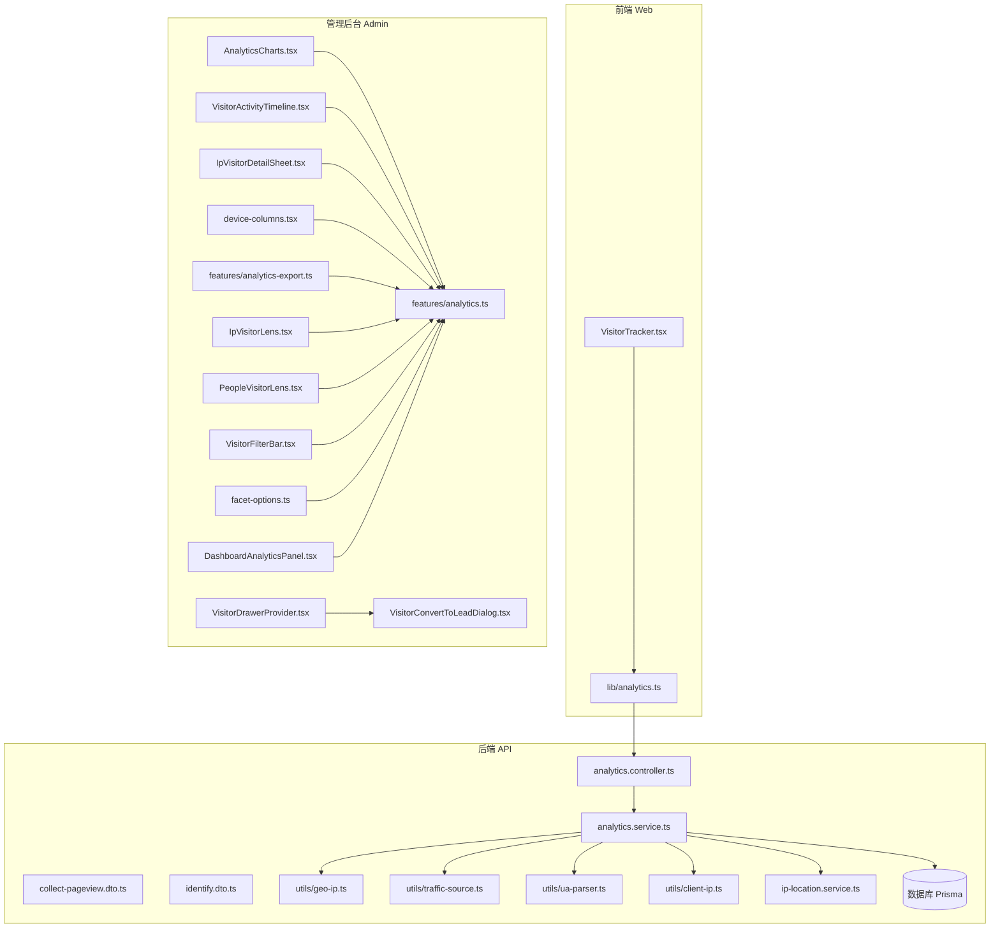
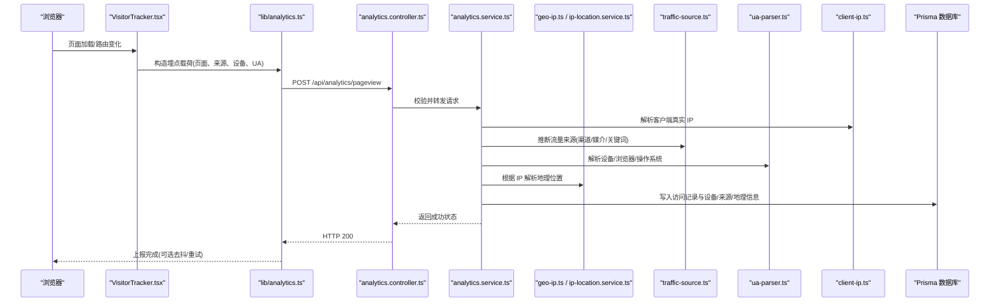
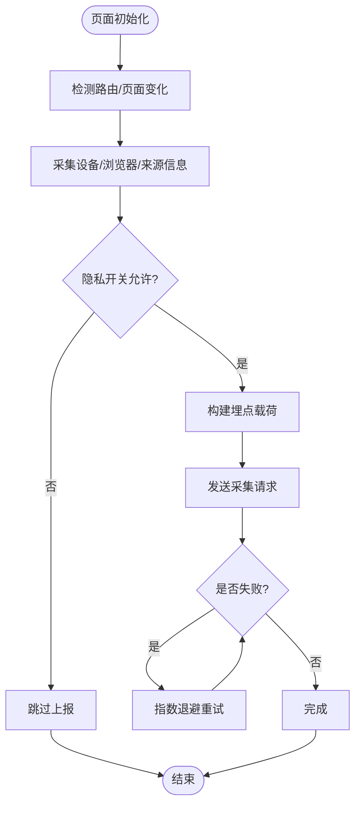
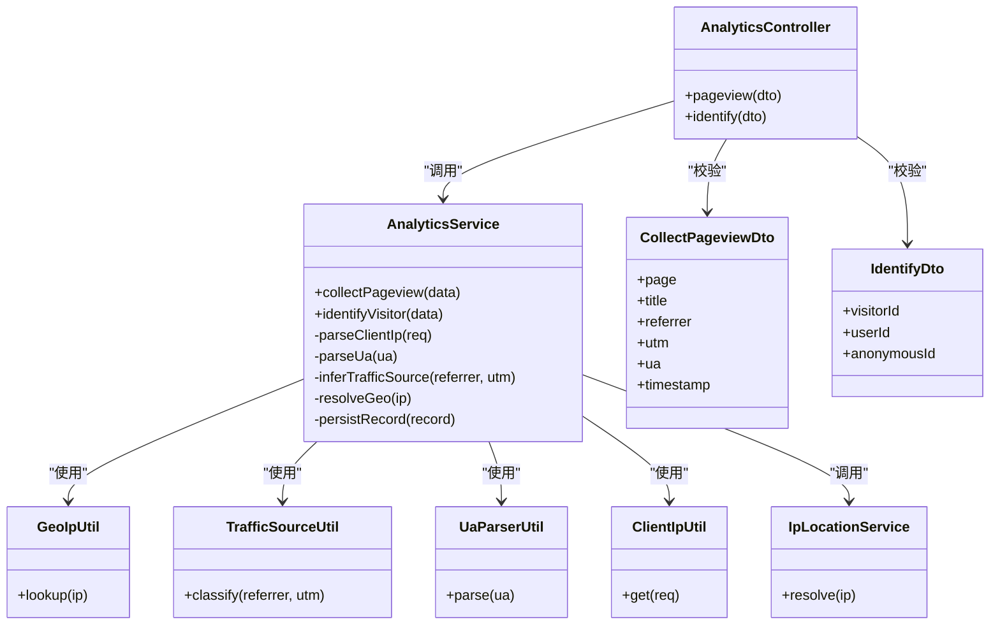
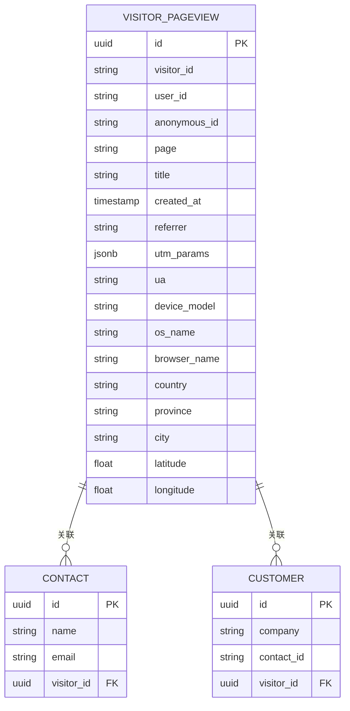
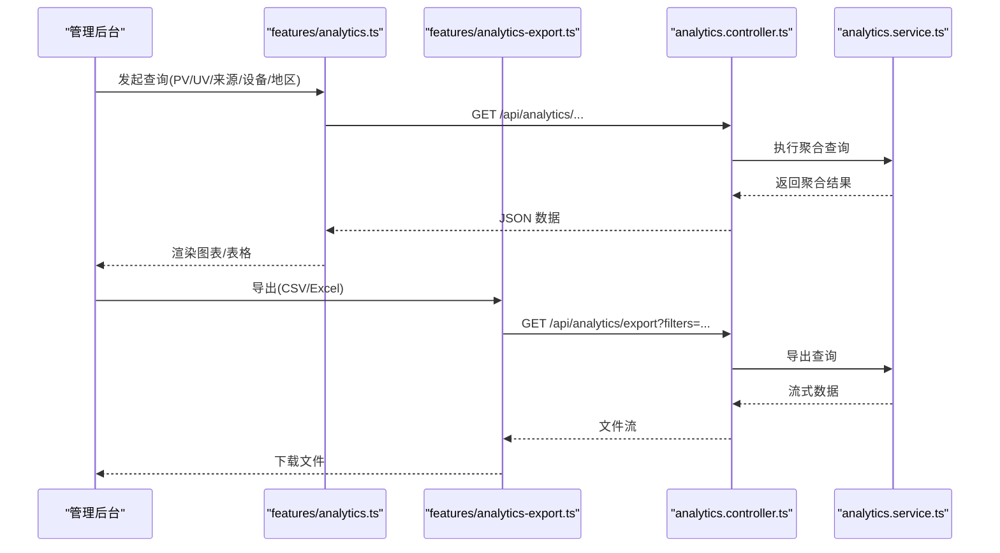
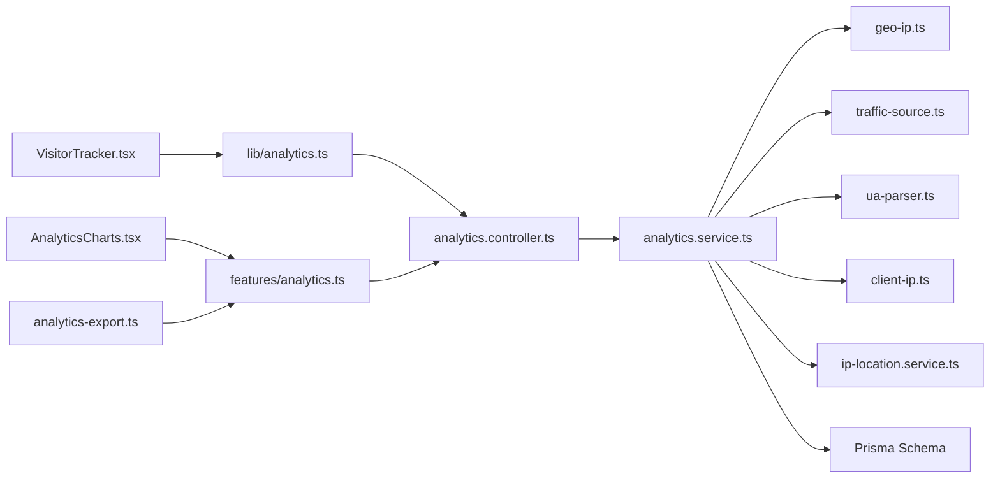

# 访客分析与追踪

<cite>
**本文引用的文件**   
- [VisitorTracker.tsx](file://apps/web/src/components/analytics/VisitorTracker.tsx)
- [analytics.ts](file://apps/web/src/lib/analytics.ts)
- [analytics.controller.ts](file://apps/api/src/analytics/analytics.controller.ts)
- [analytics.service.ts](file://apps/api/src/analytics/analytics.service.ts)
- [collect-pageview.dto.ts](file://apps/api/src/analytics/dto/collect-pageview.dto.ts)
- [identify.dto.ts](file://apps/api/src/analytics/dto/identify.dto.ts)
- [geo-ip.ts](file://apps/api/src/analytics/utils/geo-ip.ts)
- [traffic-source.ts](file://apps/api/src/analytics/utils/traffic-source.ts)
- [ua-parser.ts](file://apps/api/src/analytics/utils/ua-parser.ts)
- [client-ip.ts](file://apps/api/src/analytics/utils/client-ip.ts)
- [ip-location.service.ts](file://apps/api/src/analytics/ip-location.service.ts)
- [schema.prisma](file://apps/api/prisma/schema.prisma)
- [20260723110621_add_device_details/migration.sql](file://apps/api/prisma/migrations/20260723110621_add_device_details/migration.sql)
- [20260723120000_add_contact_visitor_id/migration.sql](file://apps/api/prisma/migrations/20260723120000_add_contact_visitor_id/migration.sql)
- [20260724122950_customer_visitor_id/migration.sql](file://apps/api/prisma/migrations/20260724122950_customer_visitor_id/migration.sql)
- [AnalyticsCharts.tsx](file://apps/admin/src/components/analytics/AnalyticsCharts.tsx)
- [VisitorActivityTimeline.tsx](file://apps/admin/src/components/analytics/VisitorActivityTimeline.tsx)
- [IpVisitorDetailSheet.tsx](file://apps/admin/src/components/analytics/IpVisitorDetailSheet.tsx)
- [device-columns.tsx](file://apps/admin/src/components/analytics/device-columns.tsx)
- [analytics-export.ts](file://apps/admin/src/features/analytics-export.ts)
- [analytics.ts](file://apps/admin/src/features/analytics.ts)
- [IpVisitorLens.tsx](file://apps/admin/src/components/visitors/IpVisitorLens.tsx)
- [PeopleVisitorLens.tsx](file://apps/admin/src/components/visitors/PeopleVisitorLens.tsx)
- [VisitorFilterBar.tsx](file://apps/admin/src/components/visitors/VisitorFilterBar.tsx)
- [facet-options.ts](file://apps/admin/src/components/visitors/facet-options.ts)
- [VisitorDrawerProvider.tsx](file://apps/admin/src/components/visitor-drawer/VisitorDrawerProvider.tsx)
- [context.ts](file://apps/admin/src/components/visitor-drawer/context.ts)
- [VisitorConvertToLeadDialog.tsx](file://apps/admin/src/components/visitor-drawer/VisitorConvertToLeadDialog.tsx)
- [DashboardAnalyticsPanel.tsx](file://apps/admin/src/components/dashboard/DashboardAnalyticsPanel.tsx)
- [env.validation.ts](file://apps/api/src/config/env.validation.ts)
</cite>

## 目录
1. [简介](#简介)
2. [项目结构](#项目结构)
3. [核心组件](#核心组件)
4. [架构总览](#架构总览)
5. [详细组件分析](#详细组件分析)
6. [依赖关系分析](#依赖关系分析)
7. [性能考量](#性能考量)
8. [故障排查指南](#故障排查指南)
9. [结论](#结论)
10. [附录](#附录)

## 简介
本文件系统性地梳理并文档化“访客分析与追踪”方案，覆盖前端埋点、后端数据采集与处理、设备信息收集、地理位置定位、实时访客监控、流量来源分析、转化漏斗、用户画像构建、数据可视化与报表导出等能力。同时强调隐私保护、数据脱敏与合规性要求，为市场分析与用户洞察提供坚实的数据支撑。

## 项目结构
本项目采用前后端分离的模块化架构：
- 前端（Web）负责页面级埋点、事件上报、设备信息与来源解析，以及基础的用户识别。
- 后端（API）提供采集接口、IP 地理解析、UA 解析、流量来源推断、数据存储与查询服务。
- 管理后台（Admin）提供可视化图表、实时看板、访客详情、筛选与导出能力。

**图示来源** 
- [VisitorTracker.tsx](file://apps/web/src/components/analytics/VisitorTracker.tsx)
- [analytics.ts](file://apps/web/src/lib/analytics.ts)
- [analytics.controller.ts](file://apps/api/src/analytics/analytics.controller.ts)
- [analytics.service.ts](file://apps/api/src/analytics/analytics.service.ts)
- [collect-pageview.dto.ts](file://apps/api/src/analytics/dto/collect-pageview.dto.ts)
- [identify.dto.ts](file://apps/api/src/analytics/dto/identify.dto.ts)
- [geo-ip.ts](file://apps/api/src/analytics/utils/geo-ip.ts)
- [traffic-source.ts](file://apps/api/src/analytics/utils/traffic-source.ts)
- [ua-parser.ts](file://apps/api/src/analytics/utils/ua-parser.ts)
- [client-ip.ts](file://apps/api/src/analytics/utils/client-ip.ts)
- [ip-location.service.ts](file://apps/api/src/analytics/ip-location.service.ts)
- [AnalyticsCharts.tsx](file://apps/admin/src/components/analytics/AnalyticsCharts.tsx)
- [VisitorActivityTimeline.tsx](file://apps/admin/src/components/analytics/VisitorActivityTimeline.tsx)
- [IpVisitorDetailSheet.tsx](file://apps/admin/src/components/analytics/IpVisitorDetailSheet.tsx)
- [device-columns.tsx](file://apps/admin/src/components/analytics/device-columns.tsx)
- [analytics-export.ts](file://apps/admin/src/features/analytics-export.ts)
- [analytics.ts](file://apps/admin/src/features/analytics.ts)
- [IpVisitorLens.tsx](file://apps/admin/src/components/visitors/IpVisitorLens.tsx)
- [PeopleVisitorLens.tsx](file://apps/admin/src/components/visitors/PeopleVisitorLens.tsx)
- [VisitorFilterBar.tsx](file://apps/admin/src/components/visitors/VisitorFilterBar.tsx)
- [facet-options.ts](file://apps/admin/src/components/visitors/facet-options.ts)
- [VisitorDrawerProvider.tsx](file://apps/admin/src/components/visitor-drawer/VisitorDrawerProvider.tsx)
- [VisitorConvertToLeadDialog.tsx](file://apps/admin/src/components/visitor-drawer/VisitorConvertToLeadDialog.tsx)
- [DashboardAnalyticsPanel.tsx](file://apps/admin/src/components/dashboard/DashboardAnalyticsPanel.tsx)

**章节来源**
- [VisitorTracker.tsx](file://apps/web/src/components/analytics/VisitorTracker.tsx)
- [analytics.ts](file://apps/web/src/lib/analytics.ts)
- [analytics.controller.ts](file://apps/api/src/analytics/analytics.controller.ts)
- [analytics.service.ts](file://apps/api/src/analytics/analytics.service.ts)
- [collect-pageview.dto.ts](file://apps/api/src/analytics/dto/collect-pageview.dto.ts)
- [identify.dto.ts](file://apps/api/src/analytics/dto/identify.dto.ts)
- [geo-ip.ts](file://apps/api/src/analytics/utils/geo-ip.ts)
- [traffic-source.ts](file://apps/api/src/analytics/utils/traffic-source.ts)
- [ua-parser.ts](file://apps/api/src/analytics/utils/ua-parser.ts)
- [client-ip.ts](file://apps/api/src/analytics/utils/client-ip.ts)
- [ip-location.service.ts](file://apps/api/src/analytics/ip-location.service.ts)
- [schema.prisma](file://apps/api/prisma/schema.prisma)
- [20260723110621_add_device_details/migration.sql](file://apps/api/prisma/migrations/20260723110621_add_device_details/migration.sql)
- [20260723120000_add_contact_visitor_id/migration.sql](file://apps/api/prisma/migrations/20260723120000_add_contact_visitor_id/migration.sql)
- [20260724122950_customer_visitor_id/migration.sql](file://apps/api/prisma/migrations/20260724122950_customer_visitor_id/migration.sql)
- [AnalyticsCharts.tsx](file://apps/admin/src/components/analytics/AnalyticsCharts.tsx)
- [VisitorActivityTimeline.tsx](file://apps/admin/src/components/analytics/VisitorActivityTimeline.tsx)
- [IpVisitorDetailSheet.tsx](file://apps/admin/src/components/analytics/IpVisitorDetailSheet.tsx)
- [device-columns.tsx](file://apps/admin/src/components/analytics/device-columns.tsx)
- [analytics-export.ts](file://apps/admin/src/features/analytics-export.ts)
- [analytics.ts](file://apps/admin/src/features/analytics.ts)
- [IpVisitorLens.tsx](file://apps/admin/src/components/visitors/IpVisitorLens.tsx)
- [PeopleVisitorLens.tsx](file://apps/admin/src/components/visitors/PeopleVisitorLens.tsx)
- [VisitorFilterBar.tsx](file://apps/admin/src/components/visitors/VisitorFilterBar.tsx)
- [facet-options.ts](file://apps/admin/src/components/visitors/facet-options.ts)
- [VisitorDrawerProvider.tsx](file://apps/admin/src/components/visitor-drawer/VisitorDrawerProvider.tsx)
- [VisitorConvertToLeadDialog.tsx](file://apps/admin/src/components/visitor-drawer/VisitorConvertToLeadDialog.tsx)
- [DashboardAnalyticsPanel.tsx](file://apps/admin/src/components/dashboard/DashboardAnalyticsPanel.tsx)

## 核心组件
- 前端埋点与上报
  - VisitorTracker：页面加载与路由变化时触发页面访问埋点，聚合设备信息与来源信息，调用统一上报入口。
  - analytics.ts：封装上报逻辑，包括请求重试、去抖、错误降级与隐私开关控制。
- 后端采集与处理
  - analytics.controller.ts：暴露采集接口，接收页面访问与用户识别事件，进行参数校验与响应。
  - analytics.service.ts：核心业务逻辑，解析 IP、UA、来源，关联地理位置，持久化存储，并提供查询聚合能力。
  - DTO：collect-pageview.dto.ts、identify.dto.ts 定义输入数据结构与校验规则。
  - 工具模块：geo-ip.ts、traffic-source.ts、ua-parser.ts、client-ip.ts 分别实现地理解析、来源推断、UA 解析与客户端 IP 获取。
  - ip-location.service.ts：封装地理位置服务调用与缓存策略。
- 管理后台可视化与导出
  - AnalyticsCharts.tsx、VisitorActivityTimeline.tsx、IpVisitorDetailSheet.tsx、device-columns.tsx：图表、时间线、IP 访客详情与设备列渲染。
  - analytics-export.ts、analytics.ts：数据导出与查询封装。
  - IpVisitorLens.tsx、PeopleVisitorLens.tsx、VisitorFilterBar.tsx、facet-options.ts：按 IP 或人维度的列表视图与筛选器。
  - VisitorDrawerProvider.tsx、VisitorConvertToLeadDialog.tsx：访客抽屉上下文与线索转化流程。
  - DashboardAnalyticsPanel.tsx：仪表盘关键指标面板。

**章节来源**
- [VisitorTracker.tsx](file://apps/web/src/components/analytics/VisitorTracker.tsx)
- [analytics.ts](file://apps/web/src/lib/analytics.ts)
- [analytics.controller.ts](file://apps/api/src/analytics/analytics.controller.ts)
- [analytics.service.ts](file://apps/api/src/analytics/analytics.service.ts)
- [collect-pageview.dto.ts](file://apps/api/src/analytics/dto/collect-pageview.dto.ts)
- [identify.dto.ts](file://apps/api/src/analytics/dto/identify.dto.ts)
- [geo-ip.ts](file://apps/api/src/analytics/utils/geo-ip.ts)
- [traffic-source.ts](file://apps/api/src/analytics/utils/traffic-source.ts)
- [ua-parser.ts](file://apps/api/src/analytics/utils/ua-parser.ts)
- [client-ip.ts](file://apps/api/src/analytics/utils/client-ip.ts)
- [ip-location.service.ts](file://apps/api/src/analytics/ip-location.service.ts)
- [AnalyticsCharts.tsx](file://apps/admin/src/components/analytics/AnalyticsCharts.tsx)
- [VisitorActivityTimeline.tsx](file://apps/admin/src/components/analytics/VisitorActivityTimeline.tsx)
- [IpVisitorDetailSheet.tsx](file://apps/admin/src/components/analytics/IpVisitorDetailSheet.tsx)
- [device-columns.tsx](file://apps/admin/src/components/analytics/device-columns.tsx)
- [analytics-export.ts](file://apps/admin/src/features/analytics-export.ts)
- [analytics.ts](file://apps/admin/src/features/analytics.ts)
- [IpVisitorLens.tsx](file://apps/admin/src/components/visitors/IpVisitorLens.tsx)
- [PeopleVisitorLens.tsx](file://apps/admin/src/components/visitors/PeopleVisitorLens.tsx)
- [VisitorFilterBar.tsx](file://apps/admin/src/components/visitors/VisitorFilterBar.tsx)
- [facet-options.ts](file://apps/admin/src/components/visitors/facet-options.ts)
- [VisitorDrawerProvider.tsx](file://apps/admin/src/components/visitor-drawer/VisitorDrawerProvider.tsx)
- [VisitorConvertToLeadDialog.tsx](file://apps/admin/src/components/visitor-drawer/VisitorConvertToLeadDialog.tsx)
- [DashboardAnalyticsPanel.tsx](file://apps/admin/src/components/dashboard/DashboardAnalyticsPanel.tsx)

## 架构总览
系统遵循“前端轻量埋点 + 后端集中处理 + 管理后台可视化”的分层设计。前端仅采集必要字段并安全上报；后端完成解析、关联与存储；管理后台通过查询接口生成图表与报表。

**图示来源** 
- [VisitorTracker.tsx](file://apps/web/src/components/analytics/VisitorTracker.tsx)
- [analytics.ts](file://apps/web/src/lib/analytics.ts)
- [analytics.controller.ts](file://apps/api/src/analytics/analytics.controller.ts)
- [analytics.service.ts](file://apps/api/src/analytics/analytics.service.ts)
- [geo-ip.ts](file://apps/api/src/analytics/utils/geo-ip.ts)
- [traffic-source.ts](file://apps/api/src/analytics/utils/traffic-source.ts)
- [ua-parser.ts](file://apps/api/src/analytics/utils/ua-parser.ts)
- [client-ip.ts](file://apps/api/src/analytics/utils/client-ip.ts)
- [ip-location.service.ts](file://apps/api/src/analytics/ip-location.service.ts)

## 详细组件分析

### 前端埋点与上报（VisitorTracker.tsx 与 lib/analytics.ts）
- 行为追踪
  - 监听页面加载与路由变化，自动采集页面路径、标题、时间戳。
  - 合并设备信息（屏幕尺寸、像素密度、内核类型）、浏览器与操作系统信息。
  - 提取来源信息（referrer、UTM 参数），必要时做归一化处理。
- 上报机制
  - 统一封装请求，支持失败重试与指数退避。
  - 支持隐私开关：当用户拒绝追踪时跳过上报。
  - 去抖与批量上报以降低网络开销。
- 用户识别
  - 提供 identify 接口，将匿名访客与已登录用户建立关联，便于后续转化分析。

**图示来源** 
- [VisitorTracker.tsx](file://apps/web/src/components/analytics/VisitorTracker.tsx)
- [analytics.ts](file://apps/web/src/lib/analytics.ts)

**章节来源**
- [VisitorTracker.tsx](file://apps/web/src/components/analytics/VisitorTracker.tsx)
- [analytics.ts](file://apps/web/src/lib/analytics.ts)

### 后端采集与处理（analytics.controller.ts 与 analytics.service.ts）
- 控制器层
  - 暴露 pageview 与 identify 两个接口，使用 DTO 进行入参校验。
  - 统一异常处理与响应格式。
- 服务层
  - 解析客户端真实 IP（考虑代理头）。
  - 解析 UA，得到设备型号、操作系统、浏览器版本等。
  - 推断流量来源（渠道、媒介、关键词、着陆页）。
  - 调用地理位置服务，获得国家、省份、城市、经纬度等。
  - 持久化访问记录，支持按维度聚合查询（时间、页面、来源、设备、地区）。
- 工具模块
  - geo-ip.ts：IP 到地理信息的映射与缓存。
  - traffic-source.ts：基于 referrer 与 UTM 参数的来源分类。
  - ua-parser.ts：User-Agent 解析。
  - client-ip.ts：从请求头中获取可信客户端 IP。

**图示来源** 
- [analytics.controller.ts](file://apps/api/src/analytics/analytics.controller.ts)
- [analytics.service.ts](file://apps/api/src/analytics/analytics.service.ts)
- [collect-pageview.dto.ts](file://apps/api/src/analytics/dto/collect-pageview.dto.ts)
- [identify.dto.ts](file://apps/api/src/analytics/dto/identify.dto.ts)
- [geo-ip.ts](file://apps/api/src/analytics/utils/geo-ip.ts)
- [traffic-source.ts](file://apps/api/src/analytics/utils/traffic-source.ts)
- [ua-parser.ts](file://apps/api/src/analytics/utils/ua-parser.ts)
- [client-ip.ts](file://apps/api/src/analytics/utils/client-ip.ts)
- [ip-location.service.ts](file://apps/api/src/analytics/ip-location.service.ts)

**章节来源**
- [analytics.controller.ts](file://apps/api/src/analytics/analytics.controller.ts)
- [analytics.service.ts](file://apps/api/src/analytics/analytics.service.ts)
- [collect-pageview.dto.ts](file://apps/api/src/analytics/dto/collect-pageview.dto.ts)
- [identify.dto.ts](file://apps/api/src/analytics/dto/identify.dto.ts)
- [geo-ip.ts](file://apps/api/src/analytics/utils/geo-ip.ts)
- [traffic-source.ts](file://apps/api/src/analytics/utils/traffic-source.ts)
- [ua-parser.ts](file://apps/api/src/analytics/utils/ua-parser.ts)
- [client-ip.ts](file://apps/api/src/analytics/utils/client-ip.ts)
- [ip-location.service.ts](file://apps/api/src/analytics/ip-location.service.ts)

### 数据模型与迁移（schema.prisma 与迁移脚本）
- 核心实体
  - 访客访问记录：包含页面、标题、时间戳、来源、UA、设备信息、地理位置等。
  - 设备详情扩展：新增设备型号、操作系统、浏览器等字段。
  - 联系人/客户与访客关联：支持将访客与联系人或客户建立关联，用于线索转化与 CRM 打通。
- 迁移脚本
  - 20260723110621_add_device_details：增加设备相关字段。
  - 20260723120000_add_contact_visitor_id：在联系人表中增加访客 ID 外键。
  - 20260724122950_customer_visitor_id：在客户表中增加访客 ID 外键。

**图示来源** 
- [schema.prisma](file://apps/api/prisma/schema.prisma)
- [20260723110621_add_device_details/migration.sql](file://apps/api/prisma/migrations/20260723110621_add_device_details/migration.sql)
- [20260723120000_add_contact_visitor_id/migration.sql](file://apps/api/prisma/migrations/20260723120000_add_contact_visitor_id/migration.sql)
- [20260724122950_customer_visitor_id/migration.sql](file://apps/api/prisma/migrations/20260724122950_customer_visitor_id/migration.sql)

**章节来源**
- [schema.prisma](file://apps/api/prisma/schema.prisma)
- [20260723110621_add_device_details/migration.sql](file://apps/api/prisma/migrations/20260723110621_add_device_details/migration.sql)
- [20260723120000_add_contact_visitor_id/migration.sql](file://apps/api/prisma/migrations/20260723120000_add_contact_visitor_id/migration.sql)
- [20260724122950_customer_visitor_id/migration.sql](file://apps/api/prisma/migrations/20260724122950_customer_visitor_id/migration.sql)

### 管理后台可视化与导出（Admin 组件与特性）
- 图表与时间线
  - AnalyticsCharts.tsx：聚合展示 PV/UV、来源分布、设备占比、地区热力等。
  - VisitorActivityTimeline.tsx：按时间轴展示访客活动轨迹。
- 访客详情与筛选
  - IpVisitorDetailSheet.tsx：按 IP 维度查看访客访问明细与设备信息。
  - device-columns.tsx：设备列渲染（型号、操作系统、浏览器）。
  - IpVisitorLens.tsx、PeopleVisitorLens.tsx：IP 与人维度的列表视图。
  - VisitorFilterBar.tsx、facet-options.ts：多维筛选（时间、来源、地区、设备等）。
- 导出与查询
  - analytics-export.ts：支持 CSV/Excel 导出，含分页与过滤条件。
  - analytics.ts：封装查询接口，支持聚合与排序。
- 线索转化与仪表盘
  - VisitorDrawerProvider.tsx、VisitorConvertToLeadDialog.tsx：在访客详情中直接转化为线索。
  - DashboardAnalyticsPanel.tsx：关键指标概览（PV、UV、转化率、热门页面）。

**图示来源** 
- [AnalyticsCharts.tsx](file://apps/admin/src/components/analytics/AnalyticsCharts.tsx)
- [VisitorActivityTimeline.tsx](file://apps/admin/src/components/analytics/VisitorActivityTimeline.tsx)
- [IpVisitorDetailSheet.tsx](file://apps/admin/src/components/analytics/IpVisitorDetailSheet.tsx)
- [device-columns.tsx](file://apps/admin/src/components/analytics/device-columns.tsx)
- [analytics-export.ts](file://apps/admin/src/features/analytics-export.ts)
- [analytics.ts](file://apps/admin/src/features/analytics.ts)
- [analytics.controller.ts](file://apps/api/src/analytics/analytics.controller.ts)
- [analytics.service.ts](file://apps/api/src/analytics/analytics.service.ts)

**章节来源**
- [AnalyticsCharts.tsx](file://apps/admin/src/components/analytics/AnalyticsCharts.tsx)
- [VisitorActivityTimeline.tsx](file://apps/admin/src/components/analytics/VisitorActivityTimeline.tsx)
- [IpVisitorDetailSheet.tsx](file://apps/admin/src/components/analytics/IpVisitorDetailSheet.tsx)
- [device-columns.tsx](file://apps/admin/src/components/analytics/device-columns.tsx)
- [analytics-export.ts](file://apps/admin/src/features/analytics-export.ts)
- [analytics.ts](file://apps/admin/src/features/analytics.ts)
- [IpVisitorLens.tsx](file://apps/admin/src/components/visitors/IpVisitorLens.tsx)
- [PeopleVisitorLens.tsx](file://apps/admin/src/components/visitors/PeopleVisitorLens.tsx)
- [VisitorFilterBar.tsx](file://apps/admin/src/components/visitors/VisitorFilterBar.tsx)
- [facet-options.ts](file://apps/admin/src/components/visitors/facet-options.ts)
- [VisitorDrawerProvider.tsx](file://apps/admin/src/components/visitor-drawer/VisitorDrawerProvider.tsx)
- [VisitorConvertToLeadDialog.tsx](file://apps/admin/src/components/visitor-drawer/VisitorConvertToLeadDialog.tsx)
- [DashboardAnalyticsPanel.tsx](file://apps/admin/src/components/dashboard/DashboardAnalyticsPanel.tsx)

## 依赖关系分析
- 前端依赖
  - VisitorTracker.tsx 依赖 lib/analytics.ts 的上报能力。
  - Admin 各组件依赖 features/analytics.ts 与 analytics-export.ts 的查询与导出能力。
- 后端依赖
  - analytics.controller.ts 依赖 analytics.service.ts 的业务逻辑。
  - analytics.service.ts 依赖 utils 下的 geo-ip、traffic-source、ua-parser、client-ip 与 ip-location.service。
  - 数据层依赖 Prisma schema 与迁移脚本。
- 外部依赖
  - 地理位置服务（可配置第三方或本地库）。
  - 可能的 UA 解析库与来源推断规则。

**图示来源** 
- [VisitorTracker.tsx](file://apps/web/src/components/analytics/VisitorTracker.tsx)
- [analytics.ts](file://apps/web/src/lib/analytics.ts)
- [analytics.controller.ts](file://apps/api/src/analytics/analytics.controller.ts)
- [analytics.service.ts](file://apps/api/src/analytics/analytics.service.ts)
- [geo-ip.ts](file://apps/api/src/analytics/utils/geo-ip.ts)
- [traffic-source.ts](file://apps/api/src/analytics/utils/traffic-source.ts)
- [ua-parser.ts](file://apps/api/src/analytics/utils/ua-parser.ts)
- [client-ip.ts](file://apps/api/src/analytics/utils/client-ip.ts)
- [ip-location.service.ts](file://apps/api/src/analytics/ip-location.service.ts)
- [schema.prisma](file://apps/api/prisma/schema.prisma)
- [AnalyticsCharts.tsx](file://apps/admin/src/components/analytics/AnalyticsCharts.tsx)
- [analytics-export.ts](file://apps/admin/src/features/analytics-export.ts)
- [analytics.ts](file://apps/admin/src/features/analytics.ts)

**章节来源**
- [analytics.controller.ts](file://apps/api/src/analytics/analytics.controller.ts)
- [analytics.service.ts](file://apps/api/src/analytics/analytics.service.ts)
- [geo-ip.ts](file://apps/api/src/analytics/utils/geo-ip.ts)
- [traffic-source.ts](file://apps/api/src/analytics/utils/traffic-source.ts)
- [ua-parser.ts](file://apps/api/src/analytics/utils/ua-parser.ts)
- [client-ip.ts](file://apps/api/src/analytics/utils/client-ip.ts)
- [ip-location.service.ts](file://apps/api/src/analytics/ip-location.service.ts)
- [schema.prisma](file://apps/api/prisma/schema.prisma)
- [AnalyticsCharts.tsx](file://apps/admin/src/components/analytics/AnalyticsCharts.tsx)
- [analytics-export.ts](file://apps/admin/src/features/analytics-export.ts)
- [analytics.ts](file://apps/admin/src/features/analytics.ts)

## 性能考量
- 前端优化
  - 去抖与批量上报减少请求次数。
  - 失败重试采用指数退避，避免雪崩。
  - 隐私开关默认关闭非必要采集，降低负载。
- 后端优化
  - 地理位置解析引入缓存（内存或 Redis）以减少重复查询。
  - 聚合查询使用索引与分表策略（按时间分区）。
  - 导出接口采用流式输出，避免大对象内存占用。
- 存储优化
  - 设备与 UA 字段使用压缩或枚举化存储。
  - 历史数据归档至冷存储，提升热查询性能。

[本节为通用指导，不直接分析具体文件]

## 故障排查指南
- 采集失败
  - 检查前端隐私开关与上报 URL 配置。
  - 查看后端接口日志与 DTO 校验错误。
- 地理位置不准确
  - 确认 IP 解析服务可用性与缓存命中率。
  - 检查代理头是否正确传递真实 IP。
- 来源推断异常
  - 核对 referrer 与 UTM 参数命名规范。
  - 检查 traffic-source.ts 的分类规则。
- 设备信息缺失
  - 验证 UA 解析库版本与兼容性。
  - 检查迁移脚本是否成功应用设备字段。
- 导出失败
  - 检查导出接口权限与过滤器合法性。
  - 确认数据库连接与查询超时设置。

**章节来源**
- [env.validation.ts](file://apps/api/src/config/env.validation.ts)
- [analytics.controller.ts](file://apps/api/src/analytics/analytics.controller.ts)
- [analytics.service.ts](file://apps/api/src/analytics/analytics.service.ts)
- [geo-ip.ts](file://apps/api/src/analytics/utils/geo-ip.ts)
- [traffic-source.ts](file://apps/api/src/analytics/utils/traffic-source.ts)
- [ua-parser.ts](file://apps/api/src/analytics/utils/ua-parser.ts)
- [client-ip.ts](file://apps/api/src/analytics/utils/client-ip.ts)
- [ip-location.service.ts](file://apps/api/src/analytics/ip-location.service.ts)

## 结论
本方案以轻量前端埋点为核心，结合稳健的后端采集与处理能力，实现了完整的访客行为追踪、设备信息采集、地理位置定位与流量来源分析。管理后台提供丰富的可视化与导出能力，支持实时监控、转化漏斗与用户画像构建。在隐私保护与合规性方面，系统内置隐私开关、数据脱敏与最小化采集原则，确保数据安全与合规。整体架构清晰、可扩展性强，可为市场分析与用户洞察提供强有力的数据支撑。

[本节为总结性内容，不直接分析具体文件]

## 附录
- 隐私与合规建议
  - 明确告知用户数据采集范围与用途，提供退出选项。
  - 对敏感字段（如 IP、UA）进行脱敏与哈希处理。
  - 定期审计数据访问与导出权限，防止滥用。
- 扩展方向
  - 接入更多来源归因模型（多触点归因）。
  - 增强实时性（WebSocket 推送实时访客动态）。
  - 深化用户画像（兴趣标签、行为序列建模）。

[本节为补充说明，不直接分析具体文件]