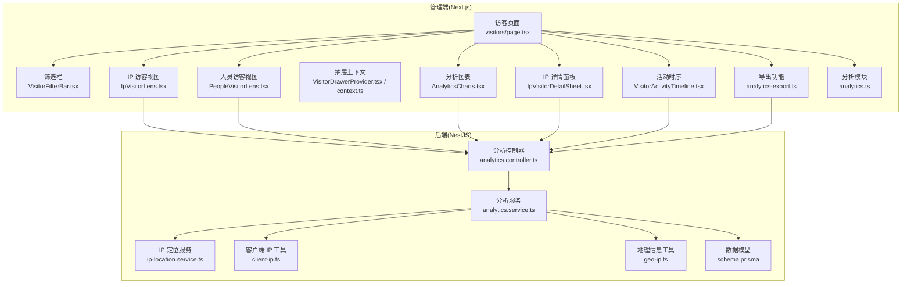
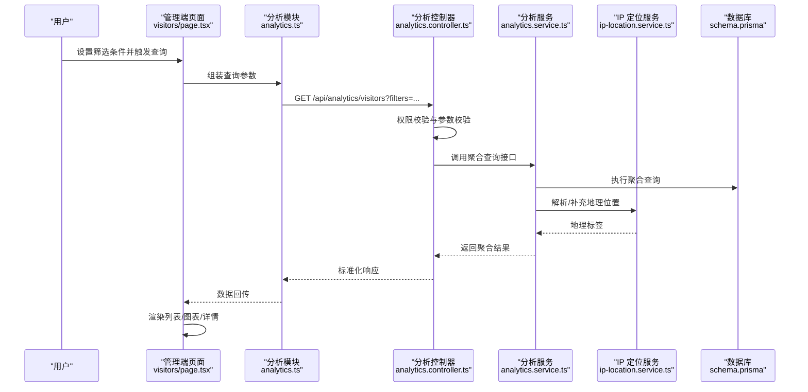
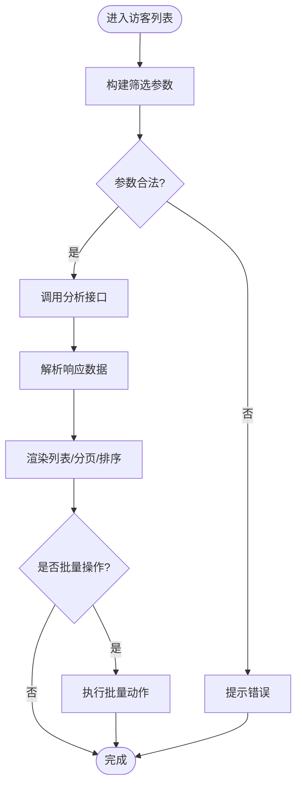
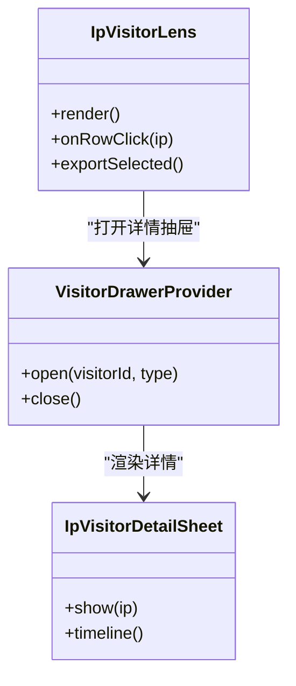
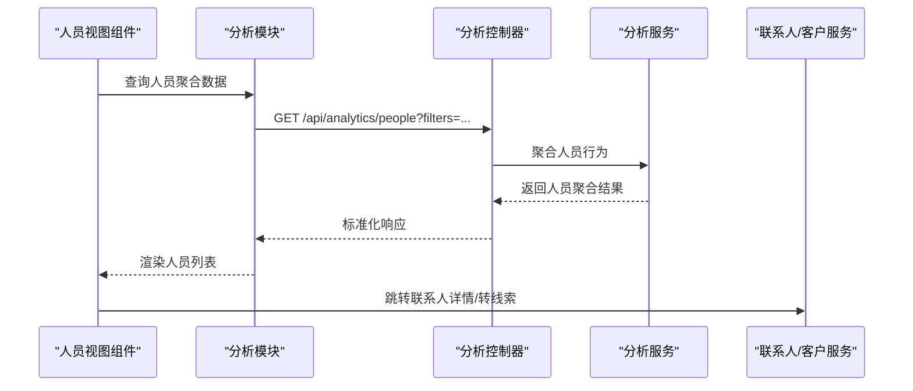
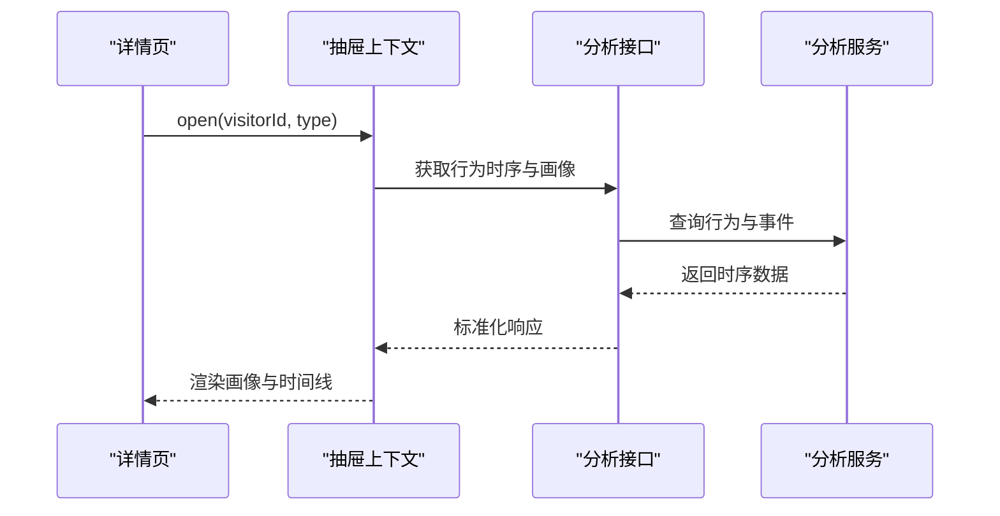
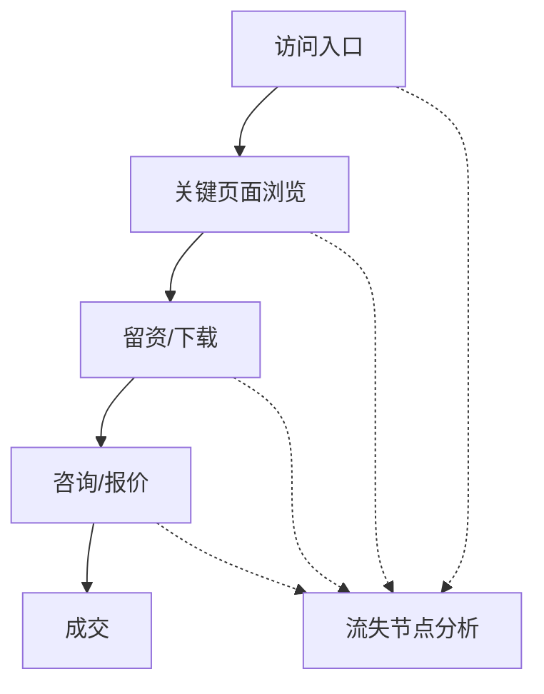
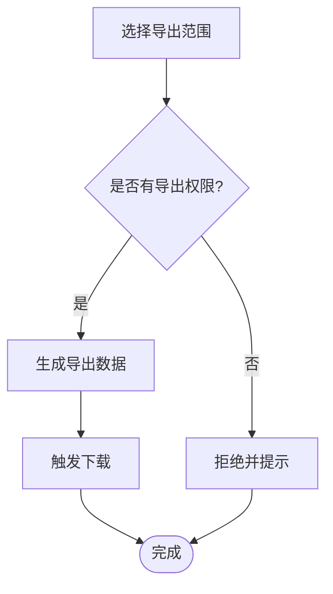
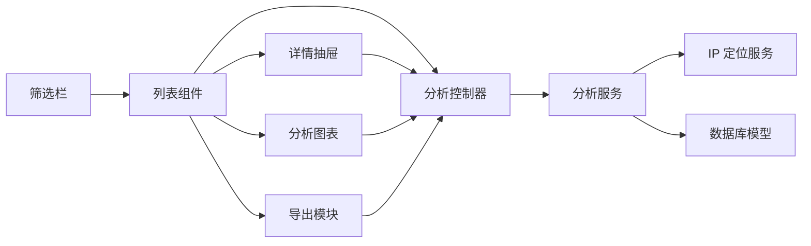

# 访客分析仪表板

<cite>
**本文引用的文件**   
- [apps/admin/src/app/(dashboard)/visitors/page.tsx](file://apps/admin/src/app/(dashboard)/visitors/page.tsx)
- [apps/admin/src/components/visitors/VisitorFilterBar.tsx](file://apps/admin/src/components/visitors/VisitorFilterBar.tsx)
- [apps/admin/src/components/visitors/IpVisitorLens.tsx](file://apps/admin/src/components/visitors/IpVisitorLens.tsx)
- [apps/admin/src/components/visitors/PeopleVisitorLens.tsx](file://apps/admin/src/components/visitors/PeopleVisitorLens.tsx)
- [apps/admin/src/components/visitor-drawer/VisitorDrawerProvider.tsx](file://apps/admin/src/components/visitor-drawer/VisitorDrawerProvider.tsx)
- [apps/admin/src/components/visitor-drawer/context.ts](file://apps/admin/src/components/visitor-drawer/context.ts)
- [apps/admin/src/components/analytics/AnalyticsCharts.tsx](file://apps/admin/src/components/analytics/AnalyticsCharts.tsx)
- [apps/admin/src/components/analytics/IpVisitorDetailSheet.tsx](file://apps/admin/src/components/analytics/IpVisitorDetailSheet.tsx)
- [apps/admin/src/components/analytics/VisitorActivityTimeline.tsx](file://apps/admin/src/components/analytics/VisitorActivityTimeline.tsx)
- [apps/admin/src/features/analytics-export.ts](file://apps/admin/src/features/analytics-export.ts)
- [apps/admin/src/features/analytics.ts](file://apps/admin/src/features/analytics.ts)
- [apps/api/src/analytics/analytics.controller.ts](file://apps/api/src/analytics/analytics.controller.ts)
- [apps/api/src/analytics/analytics.service.ts](file://apps/api/src/analytics/analytics.service.ts)
- [apps/api/src/analytics/utils/client-ip.ts](file://apps/api/src/analytics/utils/client-ip.ts)
- [apps/api/src/analytics/utils/geo-ip.ts](file://apps/api/src/analytics/utils/geo-ip.ts)
- [apps/api/src/analytics/ip-location.service.ts](file://apps/api/src/analytics/ip-location.service.ts)
- [apps/api/src/prisma/schema.prisma](file://apps/api/src/prisma/schema.prisma)
</cite>

## 目录
1. [简介](#简介)
2. [项目结构](#项目结构)
3. [核心组件](#核心组件)
4. [架构总览](#架构总览)
5. [详细组件分析](#详细组件分析)
6. [依赖关系分析](#依赖关系分析)
7. [性能考量](#性能考量)
8. [故障排查指南](#故障排查指南)
9. [结论](#结论)
10. [附录](#附录)

## 简介
本文件为“访客分析仪表板”的完整技术文档，面向产品、运营与研发人员。内容覆盖：
- 访客列表展示、筛选过滤与详细信息查看
- IP 访客视图与人员访客视图
- 访客转换跟踪（访客到线索/客户的转化）
- 访客画像分析、行为路径追踪与转化漏斗分析
- 实时访客监控、在线状态显示与历史记录查询
- 数据导出、批量操作与权限控制

该仪表板由前端管理端（Next.js）与后端服务（NestJS）协同实现，通过 API 获取与分析聚合数据，结合可视化图表与抽屉式详情面板，提供端到端的访客洞察能力。

## 项目结构
访客分析相关代码主要分布在以下位置：
- 管理端页面与组件：apps/admin/src/app/(dashboard)/visitors 与 apps/admin/src/components/visitors、analytics、visitor-drawer
- 功能模块与工具：apps/admin/src/features/analytics*.ts
- 后端控制器与服务：apps/api/src/analytics/*
- 数据模型与地理信息：apps/api/src/prisma/schema.prisma、apps/api/src/analytics/ip-location.service.ts

**图示来源** 
- [apps/admin/src/app/(dashboard)/visitors/page.tsx](file://apps/admin/src/app/(dashboard)/visitors/page.tsx)
- [apps/admin/src/components/visitors/VisitorFilterBar.tsx](file://apps/admin/src/components/visitors/VisitorFilterBar.tsx)
- [apps/admin/src/components/visitors/IpVisitorLens.tsx](file://apps/admin/src/components/visitors/IpVisitorLens.tsx)
- [apps/admin/src/components/visitors/PeopleVisitorLens.tsx](file://apps/admin/src/components/visitors/PeopleVisitorLens.tsx)
- [apps/admin/src/components/visitor-drawer/VisitorDrawerProvider.tsx](file://apps/admin/src/components/visitor-drawer/VisitorDrawerProvider.tsx)
- [apps/admin/src/components/analytics/AnalyticsCharts.tsx](file://apps/admin/src/components/analytics/AnalyticsCharts.tsx)
- [apps/admin/src/components/analytics/IpVisitorDetailSheet.tsx](file://apps/admin/src/components/analytics/IpVisitorDetailSheet.tsx)
- [apps/admin/src/components/analytics/VisitorActivityTimeline.tsx](file://apps/admin/src/components/analytics/VisitorActivityTimeline.tsx)
- [apps/admin/src/features/analytics-export.ts](file://apps/admin/src/features/analytics-export.ts)
- [apps/admin/src/features/analytics.ts](file://apps/admin/src/features/analytics.ts)
- [apps/api/src/analytics/analytics.controller.ts](file://apps/api/src/analytics/analytics.controller.ts)
- [apps/api/src/analytics/analytics.service.ts](file://apps/api/src/analytics/analytics.service.ts)
- [apps/api/src/analytics/ip-location.service.ts](file://apps/api/src/analytics/ip-location.service.ts)
- [apps/api/src/analytics/utils/client-ip.ts](file://apps/api/src/analytics/utils/client-ip.ts)
- [apps/api/src/analytics/utils/geo-ip.ts](file://apps/api/src/analytics/utils/geo-ip.ts)
- [apps/api/src/prisma/schema.prisma](file://apps/api/src/prisma/schema.prisma)

**章节来源**
- [apps/admin/src/app/(dashboard)/visitors/page.tsx](file://apps/admin/src/app/(dashboard)/visitors/page.tsx)
- [apps/api/src/analytics/analytics.controller.ts](file://apps/api/src/analytics/analytics.controller.ts)
- [apps/api/src/analytics/analytics.service.ts](file://apps/api/src/analytics/analytics.service.ts)

## 核心组件
- 访客列表与筛选：通过筛选栏统一构建查询参数，支持按时间范围、来源、设备、地域等维度过滤，并驱动不同视角的列表渲染。
- IP 访客视图：以 IP 为粒度聚合访问记录，展示访问次数、首次/末次访问时间、来源、设备与地理位置等画像字段。
- 人员访客视图：在已识别用户（如登录或埋点标识）场景下，以人员维度聚合行为，便于销售与客服跟进。
- 详情抽屉：点击某条记录打开右侧抽屉，展示该访客的详细行为轨迹、页面停留、事件序列与转化节点。
- 分析图表：聚合指标（访问量、转化率、热门页面、来源分布等）以图表形式呈现，支持时间粒度切换。
- 活动时序：按时间轴展示访客的关键动作（浏览、下载、咨询、提交表单等），辅助还原行为路径。
- 导出功能：将当前筛选结果导出为 CSV/Excel，支持分页与全量导出策略。
- 权限控制：基于角色与资源权限，限制对敏感字段与导出操作的访问。

**章节来源**
- [apps/admin/src/components/visitors/VisitorFilterBar.tsx](file://apps/admin/src/components/visitors/VisitorFilterBar.tsx)
- [apps/admin/src/components/visitors/IpVisitorLens.tsx](file://apps/admin/src/components/visitors/IpVisitorLens.tsx)
- [apps/admin/src/components/visitors/PeopleVisitorLens.tsx](file://apps/admin/src/components/visitors/PeopleVisitorLens.tsx)
- [apps/admin/src/components/visitor-drawer/VisitorDrawerProvider.tsx](file://apps/admin/src/components/visitor-drawer/VisitorDrawerProvider.tsx)
- [apps/admin/src/components/analytics/AnalyticsCharts.tsx](file://apps/admin/src/components/analytics/AnalyticsCharts.tsx)
- [apps/admin/src/components/analytics/VisitorActivityTimeline.tsx](file://apps/admin/src/components/analytics/VisitorActivityTimeline.tsx)
- [apps/admin/src/features/analytics-export.ts](file://apps/admin/src/features/analytics-export.ts)

## 架构总览
访客分析仪表板的请求链路如下：
- 前端页面组合筛选条件，调用分析模块发起 API 请求
- 后端控制器接收请求，校验权限与参数，委托服务层处理
- 服务层聚合查询、调用地理信息与 IP 工具，返回结构化数据
- 前端根据响应渲染列表、图表与详情抽屉

**图示来源** 
- [apps/admin/src/app/(dashboard)/visitors/page.tsx](file://apps/admin/src/app/(dashboard)/visitors/page.tsx)
- [apps/admin/src/features/analytics.ts](file://apps/admin/src/features/analytics.ts)
- [apps/api/src/analytics/analytics.controller.ts](file://apps/api/src/analytics/analytics.controller.ts)
- [apps/api/src/analytics/analytics.service.ts](file://apps/api/src/analytics/analytics.service.ts)
- [apps/api/src/analytics/ip-location.service.ts](file://apps/api/src/analytics/ip-location.service.ts)
- [apps/api/src/prisma/schema.prisma](file://apps/api/src/prisma/schema.prisma)

## 详细组件分析

### 访客列表与筛选过滤
- 筛选栏负责收集时间范围、来源渠道、设备类型、国家/地区、关键词等条件，并以 URL 状态同步，保证可分享与刷新一致性。
- 列表组件根据筛选条件调用后端聚合接口，支持分页、排序与列自定义。
- 支持批量选择与批量操作（如标记已联系、批量导出）。

**图示来源** 
- [apps/admin/src/components/visitors/VisitorFilterBar.tsx](file://apps/admin/src/components/visitors/VisitorFilterBar.tsx)

**章节来源**
- [apps/admin/src/components/visitors/VisitorFilterBar.tsx](file://apps/admin/src/components/visitors/VisitorFilterBar.tsx)

### IP 访客视图
- 以 IP 为维度聚合访问记录，展示访问频次、首末访问时间、来源、设备、地理位置等画像字段。
- 支持点击行进入 IP 详情面板，查看该 IP 的行为时序与关键事件。

**图示来源** 
- [apps/admin/src/components/visitors/IpVisitorLens.tsx](file://apps/admin/src/components/visitors/IpVisitorLens.tsx)
- [apps/admin/src/components/visitor-drawer/VisitorDrawerProvider.tsx](file://apps/admin/src/components/visitor-drawer/VisitorDrawerProvider.tsx)
- [apps/admin/src/components/analytics/IpVisitorDetailSheet.tsx](file://apps/admin/src/components/analytics/IpVisitorDetailSheet.tsx)

**章节来源**
- [apps/admin/src/components/visitors/IpVisitorLens.tsx](file://apps/admin/src/components/visitors/IpVisitorLens.tsx)
- [apps/admin/src/components/analytics/IpVisitorDetailSheet.tsx](file://apps/admin/src/components/analytics/IpVisitorDetailSheet.tsx)

### 人员访客视图
- 在已识别用户场景下，以人员维度聚合行为，展示联系人/客户关联、最近活跃时间、沟通记录入口等。
- 与 CRM/联系人模块打通，支持一键转为线索或客户。

**图示来源** 
- [apps/admin/src/components/visitors/PeopleVisitorLens.tsx](file://apps/admin/src/components/visitors/PeopleVisitorLens.tsx)
- [apps/api/src/analytics/analytics.controller.ts](file://apps/api/src/analytics/analytics.controller.ts)
- [apps/api/src/analytics/analytics.service.ts](file://apps/api/src/analytics/analytics.service.ts)

**章节来源**
- [apps/admin/src/components/visitors/PeopleVisitorLens.tsx](file://apps/admin/src/components/visitors/PeopleVisitorLens.tsx)

### 访客详情与行为路径
- 详情抽屉包含：基础画像（IP、设备、浏览器、操作系统、地理位置）、页面访问序列、关键事件（下载、注册、咨询、提交表单）、转化节点。
- 活动时序组件按时间轴展示行为，支持筛选事件类型与高亮关键路径。

**图示来源** 
- [apps/admin/src/components/visitor-drawer/VisitorDrawerProvider.tsx](file://apps/admin/src/components/visitor-drawer/VisitorDrawerProvider.tsx)
- [apps/admin/src/components/analytics/VisitorActivityTimeline.tsx](file://apps/admin/src/components/analytics/VisitorActivityTimeline.tsx)
- [apps/api/src/analytics/analytics.controller.ts](file://apps/api/src/analytics/analytics.controller.ts)
- [apps/api/src/analytics/analytics.service.ts](file://apps/api/src/analytics/analytics.service.ts)

**章节来源**
- [apps/admin/src/components/visitor-drawer/VisitorDrawerProvider.tsx](file://apps/admin/src/components/visitor-drawer/VisitorDrawerProvider.tsx)
- [apps/admin/src/components/analytics/VisitorActivityTimeline.tsx](file://apps/admin/src/components/analytics/VisitorActivityTimeline.tsx)

### 访客画像分析与转化漏斗
- 画像维度：设备、浏览器、操作系统、国家/城市、来源渠道、着陆页、会话时长、页面深度等。
- 转化漏斗：从曝光/访问 -> 关键页面 -> 留资/下载 -> 咨询/报价 -> 成交，支持分阶段统计与对比。

[此图为概念流程图，不直接映射具体源码]

### 实时访客监控与在线状态
- 通过 WebSocket/轮询机制获取当前在线访客数与热点页面，支持告警阈值配置。
- 在线状态显示用于客服与运营快速定位活跃访客，提升响应效率。

[本节为通用说明，未直接分析具体文件]

### 数据导出与批量操作
- 导出：支持当前筛选结果导出，含分页与全量导出；导出字段可配置，避免敏感信息泄露。
- 批量操作：支持批量标记、批量导出、批量分配等，需具备相应权限。

**图示来源** 
- [apps/admin/src/features/analytics-export.ts](file://apps/admin/src/features/analytics-export.ts)

**章节来源**
- [apps/admin/src/features/analytics-export.ts](file://apps/admin/src/features/analytics-export.ts)

### 权限控制
- 基于角色的访问控制（RBAC）与资源级权限，限制对访客详情、导出、批量操作等功能的访问。
- 敏感字段（如手机号、邮箱）可按角色脱敏展示。

[本节为通用说明，未直接分析具体文件]

## 依赖关系分析
- 前端依赖：分析模块封装 API 调用与数据转换；筛选栏与列表组件依赖 URL 状态与本地缓存；详情抽屉依赖全局上下文。
- 后端依赖：控制器依赖服务层；服务层依赖数据库与地理信息工具；IP 定位服务依赖外部库或配置。

**图示来源** 
- [apps/admin/src/components/visitors/VisitorFilterBar.tsx](file://apps/admin/src/components/visitors/VisitorFilterBar.tsx)
- [apps/admin/src/components/visitors/IpVisitorLens.tsx](file://apps/admin/src/components/visitors/IpVisitorLens.tsx)
- [apps/admin/src/components/visitors/PeopleVisitorLens.tsx](file://apps/admin/src/components/visitors/PeopleVisitorLens.tsx)
- [apps/admin/src/components/visitor-drawer/VisitorDrawerProvider.tsx](file://apps/admin/src/components/visitor-drawer/VisitorDrawerProvider.tsx)
- [apps/admin/src/components/analytics/AnalyticsCharts.tsx](file://apps/admin/src/components/analytics/AnalyticsCharts.tsx)
- [apps/admin/src/features/analytics-export.ts](file://apps/admin/src/features/analytics-export.ts)
- [apps/api/src/analytics/analytics.controller.ts](file://apps/api/src/analytics/analytics.controller.ts)
- [apps/api/src/analytics/analytics.service.ts](file://apps/api/src/analytics/analytics.service.ts)
- [apps/api/src/analytics/ip-location.service.ts](file://apps/api/src/analytics/ip-location.service.ts)
- [apps/api/src/prisma/schema.prisma](file://apps/api/src/prisma/schema.prisma)

**章节来源**
- [apps/api/src/analytics/analytics.controller.ts](file://apps/api/src/analytics/analytics.controller.ts)
- [apps/api/src/analytics/analytics.service.ts](file://apps/api/src/analytics/analytics.service.ts)
- [apps/api/src/analytics/ip-location.service.ts](file://apps/api/src/analytics/ip-location.service.ts)
- [apps/api/src/prisma/schema.prisma](file://apps/api/src/prisma/schema.prisma)

## 性能考量
- 分页与增量加载：列表默认分页加载，避免一次性拉取大量数据。
- 缓存策略：对热点聚合数据使用短期缓存，减少重复计算。
- 服务端聚合：复杂统计在服务端完成，降低前端负载。
- 地理信息优化：缓存 IP 地理位置解析结果，减少外部调用。
- 导出优化：大表导出采用流式生成与异步任务，避免阻塞。

[本节为通用指导，未直接分析具体文件]

## 故障排查指南
- 筛选无结果：检查时间范围与筛选条件是否过严；确认后端聚合字段与索引。
- 详情空白：核对 visitorId 与类型是否正确；检查权限是否允许查看该访客详情。
- 导出失败：确认导出权限与字段配置；检查文件大小与服务器内存。
- 实时数据不更新：检查 WebSocket/轮询配置与网络连通性。

**章节来源**
- [apps/admin/src/components/visitor-drawer/VisitorDrawerProvider.tsx](file://apps/admin/src/components/visitor-drawer/VisitorDrawerProvider.tsx)
- [apps/admin/src/features/analytics-export.ts](file://apps/admin/src/features/analytics-export.ts)

## 结论
访客分析仪表板通过前后端协作，提供了从列表筛选、多维视图、详情追踪到导出与权限控制的完整能力。建议在生产环境加强缓存与索引优化，完善实时数据的稳定性与容错机制，并结合业务目标持续迭代漏斗与画像维度。

[本节为总结，未直接分析具体文件]

## 附录
- 常用术语：访客（匿名/IP）、人员（已识别用户）、转化（关键事件达成）、漏斗（阶段化转化流程）
- 扩展方向：增加 A/B 实验归因、多渠道归因、智能推荐与自动化营销联动

[本节为补充说明，未直接分析具体文件]